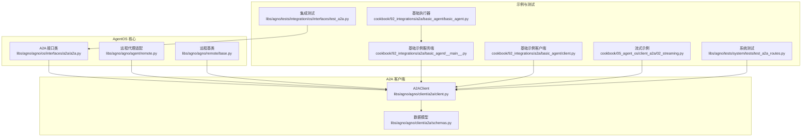
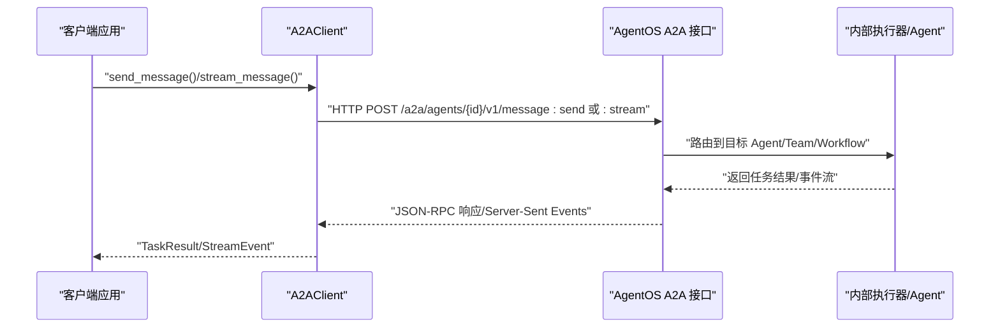
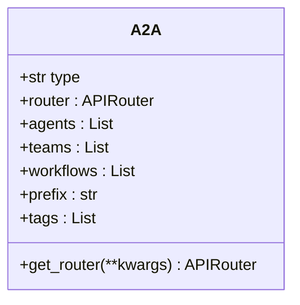
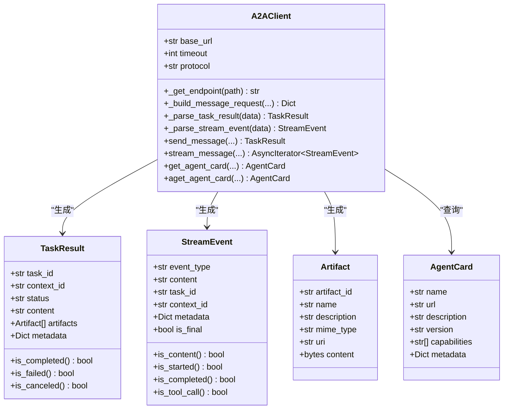
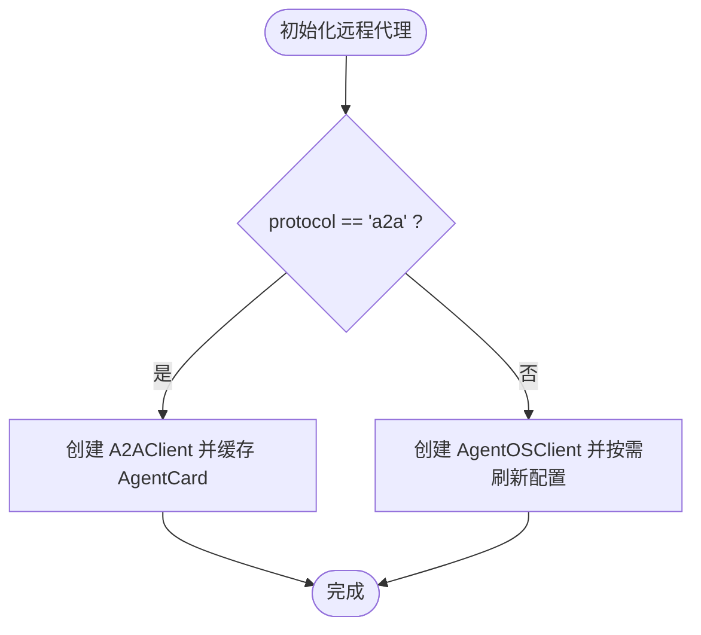
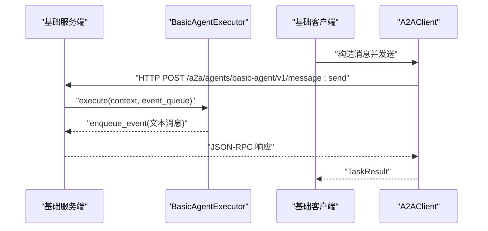
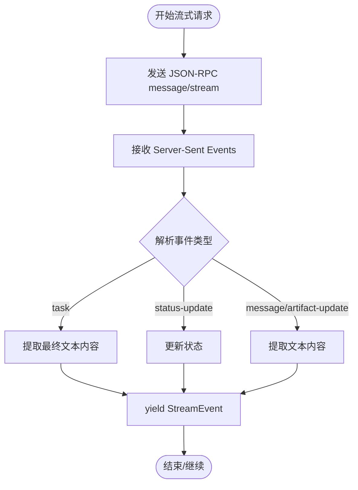
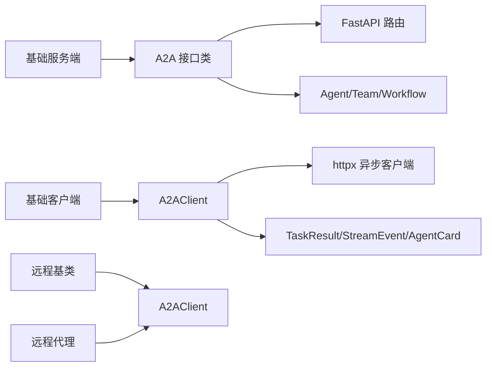

# A2A 集成

<cite>
**本文引用的文件**
- [a2a.py](file://libs/agno/agno/os/interfaces/a2a/a2a.py)
- [client.py](file://libs/agno/agno/client/a2a/client.py)
- [schemas.py](file://libs/agno/agno/client/a2a/schemas.py)
- [remote.py](file://libs/agno/agno/agent/remote.py)
- [base.py](file://libs/agno/agno/remote/base.py)
- [test_a2a.py](file://libs/agno/tests/integration/os/interfaces/test_a2a.py)
- [test_a2a_routes.py](file://libs/agno/tests/system/tests/test_a2a_routes.py)
- [02_streaming.py](file://cookbook/05_agent_os/client_a2a/02_streaming.py)
- [README.md](file://cookbook/92_integrations/a2a/README.md)
- [basic_agent.py](file://cookbook/92_integrations/a2a/basic_agent/basic_agent.py)
- [client.py](file://cookbook/92_integrations/a2a/basic_agent/client.py)
- [__main__.py](file://cookbook/92_integrations/a2a/basic_agent/__main__.py)
</cite>

## 目录
1. [简介](#简介)
2. [项目结构](#项目结构)
3. [核心组件](#核心组件)
4. [架构总览](#架构总览)
5. [详细组件分析](#详细组件分析)
6. [依赖关系分析](#依赖关系分析)
7. [性能考量](#性能考量)
8. [故障排查指南](#故障排查指南)
9. [结论](#结论)
10. [附录](#附录)

## 简介
本文件系统性阐述 AgentOS 的 A2A（Agent-to-Agent）集成方案，覆盖代理间通信的实现机制与最佳实践，包括：
- 基础消息传递与流式通信
- 多轮对话与上下文管理
- 与外部平台（如 Google ADK）的对接思路
- 连接管理、消息路由与安全注意事项
- 典型应用场景与实施建议

A2A 协议在本仓库中既作为 AgentOS 内部接口暴露，也作为跨框架互操作的标准协议被客户端使用。AgentOS 通过 A2A 接口将 Agent/Team/Workflow 暴露为 A2A 兼容的服务端点；同时，客户端可基于 A2AClient 以 REST 或 JSON-RPC 方式与这些服务进行交互。

## 项目结构
围绕 A2A 的相关代码主要分布在以下位置：
- AgentOS A2A 接口实现：libs/agno/agno/os/interfaces/a2a/a2a.py
- A2A 客户端库：libs/agno/agno/client/a2a/client.py 及其数据模型 schemas.py
- 远程代理适配：libs/agno/agno/agent/remote.py、libs/agno/agno/remote/base.py
- 测试用例：libs/agno/tests/integration/os/interfaces/test_a2a.py、libs/agno/tests/system/tests/test_a2a_routes.py
- 示例与教程：cookbook/92_integrations/a2a/basic_agent/ 与 cookbook/05_agent_os/client_a2a/02_streaming.py
- A2A 集成概览：cookbook/92_integrations/a2a/README.md

图表来源
- [a2a.py:16-44](file://libs/agno/agno/os/interfaces/a2a/a2a.py#L16-L44)
- [client.py:27-555](file://libs/agno/agno/client/a2a/client.py#L27-L555)
- [schemas.py:11-113](file://libs/agno/agno/client/a2a/schemas.py#L11-L113)
- [remote.py:70-141](file://libs/agno/agno/agent/remote.py#L70-L141)
- [base.py:380-413](file://libs/agno/agno/remote/base.py#L380-L413)
- [__main__.py:24-59](file://cookbook/92_integrations/a2a/basic_agent/__main__.py#L24-L59)
- [client.py:23-61](file://cookbook/92_integrations/a2a/basic_agent/client.py#L23-L61)
- [basic_agent.py:27-52](file://cookbook/92_integrations/a2a/basic_agent/basic_agent.py#L27-L52)
- [02_streaming.py:24-51](file://cookbook/05_agent_os/client_a2a/02_streaming.py#L24-L51)
- [test_a2a.py:57-83](file://libs/agno/tests/integration/os/interfaces/test_a2a.py#L57-L83)
- [test_a2a_routes.py:163-362](file://libs/agno/tests/system/tests/test_a2a_routes.py#L163-L362)

章节来源
- [README.md:1-22](file://cookbook/92_integrations/a2a/README.md#L1-L22)

## 核心组件
- A2A 接口类：负责注册 A2A 路由，支持将 Agent/Team/Workflow 暴露为 A2A 兼容服务。
- A2AClient：提供异步发送消息、流式接收事件的能力，并解析 JSON-RPC 响应为 Python 数据类。
- 数据模型：TaskResult、StreamEvent、Artifact、AgentCard，用于统一响应结构与能力发现。
- 远程代理适配：在 A2A 模式下获取远端 AgentCard 并缓存配置，兼容不同协议下的配置刷新策略。
- 示例与测试：包含基础服务端/客户端、流式示例以及系统级路由测试，验证非流式与流式消息路径。

章节来源
- [a2a.py:16-44](file://libs/agno/agno/os/interfaces/a2a/a2a.py#L16-L44)
- [client.py:27-555](file://libs/agno/agno/client/a2a/client.py#L27-L555)
- [schemas.py:11-113](file://libs/agno/agno/client/a2a/schemas.py#L11-L113)
- [remote.py:70-141](file://libs/agno/agno/agent/remote.py#L70-L141)
- [base.py:380-413](file://libs/agno/agno/remote/base.py#L380-L413)
- [test_a2a.py:57-83](file://libs/agno/tests/integration/os/interfaces/test_a2a.py#L57-L83)
- [test_a2a_routes.py:163-362](file://libs/agno/tests/system/tests/test_a2a_routes.py#L163-L362)

## 架构总览
AgentOS 通过 A2A 接口将内部资源暴露为标准 A2A 服务端点；客户端通过 A2AClient 发送消息或开启流式事件通道。远程代理在 A2A 模式下通过 AgentCard 获取能力信息并缓存。

图表来源
- [client.py:323-500](file://libs/agno/agno/client/a2a/client.py#L323-L500)
- [a2a.py:38-43](file://libs/agno/agno/os/interfaces/a2a/a2a.py#L38-L43)
- [test_a2a_routes.py:163-362](file://libs/agno/tests/system/tests/test_a2a_routes.py#L163-L362)

## 详细组件分析

### 组件一：A2A 接口类（暴露 A2A 服务）
- 职责：注册 A2A 路由，绑定 Agent/Team/Workflow 到 /a2a 前缀下的 REST/JSON-RPC 端点。
- 关键点：
  - 支持通过参数传入多个 Agent/Team/Workflow。
  - 路由前缀默认 “/a2a”，标签为 “A2A”。
  - 若未提供任何资源，抛出参数错误。

图表来源
- [a2a.py:16-44](file://libs/agno/agno/os/interfaces/a2a/a2a.py#L16-L44)

章节来源
- [a2a.py:16-44](file://libs/agno/agno/os/interfaces/a2a/a2a.py#L16-L44)

### 组件二：A2AClient（客户端）
- 能力：
  - 发送非流式消息：构建 JSON-RPC 请求，等待完整响应，解析为 TaskResult。
  - 启动流式消息：以 text/event-stream 形式接收事件，逐行解析为 StreamEvent。
  - 能力发现：通过 GET /.well-known/agent-card.json 获取 AgentCard。
- 关键设计：
  - 支持 “rest” 和 “json-rpc” 两种协议模式，自动拼接端点。
  - 对连接失败与超时进行统一异常包装，便于上层处理。
  - 解析逻辑兼容多种事件类型（task、status-update、message、artifact-update），并提取文本内容与元数据。

图表来源
- [client.py:27-555](file://libs/agno/agno/client/a2a/client.py#L27-L555)
- [schemas.py:11-113](file://libs/agno/agno/client/a2a/schemas.py#L11-L113)

章节来源
- [client.py:27-555](file://libs/agno/agno/client/a2a/client.py#L27-L555)
- [schemas.py:11-113](file://libs/agno/agno/client/a2a/schemas.py#L11-L113)

### 组件三：远程代理与协议选择
- 远程基类支持两种协议：
  - agentos：AgentOS 自有 REST API，默认方式。
  - a2a：A2A 协议，用于跨框架互操作。
- 在 A2A 模式下，远程代理会通过 A2AClient 获取 AgentCard 并缓存，避免重复请求；同时不支持从远端拉取完整配置，因此返回最小化配置对象。

图表来源
- [base.py:380-413](file://libs/agno/agno/remote/base.py#L380-L413)
- [remote.py:70-141](file://libs/agno/agno/agent/remote.py#L70-L141)

章节来源
- [base.py:380-413](file://libs/agno/agno/remote/base.py#L380-L413)
- [remote.py:70-141](file://libs/agno/agno/agent/remote.py#L70-L141)

### 组件四：示例与测试（基础 A2A 服务端/客户端）
- 基础示例服务端：
  - 使用 A2AStarletteApplication 与 DefaultRequestHandler，注册 AgentSkill 与 AgentCard。
  - 执行器 BasicAgentExecutor 将 A2A 文本消息转为 Agno Agent 的消息并返回。
- 基础示例客户端：
  - 通过 A2AClient.get_client_from_agent_card_url 获取客户端，构造消息并调用 send_message。
- 系统测试：
  - 验证 /a2a/agents/{id}/v1/message:send 与 :stream 路由存在。
  - 验证非流式与流式消息的响应格式与事件类型。

图表来源
- [__main__.py:24-59](file://cookbook/92_integrations/a2a/basic_agent/__main__.py#L24-L59)
- [basic_agent.py:27-52](file://cookbook/92_integrations/a2a/basic_agent/basic_agent.py#L27-L52)
- [client.py:23-61](file://cookbook/92_integrations/a2a/basic_agent/client.py#L23-L61)
- [test_a2a_routes.py:163-362](file://libs/agno/tests/system/tests/test_a2a_routes.py#L163-L362)

章节来源
- [basic_agent.py:1-61](file://cookbook/92_integrations/a2a/basic_agent/basic_agent.py#L1-L61)
- [client.py:1-61](file://cookbook/92_integrations/a2a/basic_agent/client.py#L1-L61)
- [__main__.py:1-59](file://cookbook/92_integrations/a2a/basic_agent/__main__.py#L1-L59)
- [test_a2a_routes.py:163-362](file://libs/agno/tests/system/tests/test_a2a_routes.py#L163-L362)

### 组件五：流式通信（SSE）
- 客户端通过 stream_message 启动流式通道，服务端以 text/event-stream 返回事件。
- 事件类型解析：
  - task：最终任务结果，包含历史消息中的文本内容。
  - status-update：状态更新事件，支持 working/completed/failed/canceled 等状态。
  - message/artifact-update：内容事件，提取文本部分。
- 示例：cookbook/05_agent_os/client_a2a/02_streaming.py 展示了如何逐段打印内容并跟踪事件细节。

图表来源
- [client.py:393-500](file://libs/agno/agno/client/a2a/client.py#L393-L500)
- [schemas.py:60-99](file://libs/agno/agno/client/a2a/schemas.py#L60-L99)
- [02_streaming.py:24-51](file://cookbook/05_agent_os/client_a2a/02_streaming.py#L24-L51)

章节来源
- [client.py:393-500](file://libs/agno/agno/client/a2a/client.py#L393-L500)
- [schemas.py:60-99](file://libs/agno/agno/client/a2a/schemas.py#L60-L99)
- [02_streaming.py:1-51](file://cookbook/05_agent_os/client_a2a/02_streaming.py#L1-L51)

## 依赖关系分析
- A2A 接口类依赖 FastAPI 路由器与内部资源（Agent/Team/Workflow）。
- A2AClient 依赖 httpx 异步客户端与 JSON-RPC/REST 端点拼接逻辑。
- 远程代理在 A2A 模式下依赖 A2AClient 获取 AgentCard 并缓存。
- 示例与测试分别验证接口注册与路由行为。

图表来源
- [a2a.py:16-44](file://libs/agno/agno/os/interfaces/a2a/a2a.py#L16-L44)
- [client.py:27-555](file://libs/agno/agno/client/a2a/client.py#L27-L555)
- [remote.py:70-141](file://libs/agno/agno/agent/remote.py#L70-L141)
- [base.py:380-413](file://libs/agno/agno/remote/base.py#L380-L413)
- [__main__.py:24-59](file://cookbook/92_integrations/a2a/basic_agent/__main__.py#L24-L59)
- [client.py:23-61](file://cookbook/92_integrations/a2a/basic_agent/client.py#L23-L61)

章节来源
- [a2a.py:16-44](file://libs/agno/agno/os/interfaces/a2a/a2a.py#L16-L44)
- [client.py:27-555](file://libs/agno/agno/client/a2a/client.py#L27-L555)
- [remote.py:70-141](file://libs/agno/agno/agent/remote.py#L70-L141)
- [base.py:380-413](file://libs/agno/agno/remote/base.py#L380-L413)

## 性能考量
- 连接与超时：客户端默认超时时间可配置，建议根据网络环境与模型响应时间调整。
- 流式传输：SSE 下按行解析，注意空行与事件头过滤，避免无效日志与解析开销。
- 缓存策略：远程代理在 A2A 模式下缓存 AgentCard，减少重复请求；非 A2A 模式下对 Agent 配置进行 TTL 缓存。
- 并发与批量：在高并发场景下，建议限制单客户端并发数并结合后端限流策略。

## 故障排查指南
- 连接失败/超时：
  - 现象：抛出 RemoteServerUnavailableError。
  - 排查：确认服务端地址、端口可达；检查防火墙与反向代理设置；适当增大超时时间。
- 路由不存在：
  - 现象：找不到 /a2a/.../message:send 或 :stream。
  - 排查：确认已启用 A2A 接口参数或在 interfaces 中显式传入 A2A；检查路由注册是否生效。
- 流式事件解析异常：
  - 现象：日志出现 JSON 解码警告。
  - 排查：检查服务端事件输出格式是否符合 A2A 协议标准；确保 Accept 与 Cache-Control 头正确设置。
- 非 A2A 模式下配置不可用：
  - 现象：A2A 服务器不提供完整配置。
  - 处理：远程代理在 A2A 模式下返回最小化配置对象，属预期行为。

章节来源
- [client.py:380-500](file://libs/agno/agno/client/a2a/client.py#L380-L500)
- [test_a2a.py:57-83](file://libs/agno/tests/integration/os/interfaces/test_a2a.py#L57-L83)
- [test_a2a_routes.py:163-362](file://libs/agno/tests/system/tests/test_a2a_routes.py#L163-L362)
- [remote.py:70-141](file://libs/agno/agno/agent/remote.py#L70-L141)

## 结论
AgentOS 的 A2A 集成提供了标准化的代理间通信能力，既能作为内部接口服务于 Agent/Team/Workflow 的统一暴露，也能作为跨框架互操作的桥梁。通过 A2AClient 的 REST/JSON-RPC 支持、SSE 流式事件与完善的错误处理，开发者可以快速搭建实时、可扩展的代理协作系统。配合示例与测试，可高效落地复杂场景下的多轮对话与工具调用编排。

## 附录
- 快速开始（基础示例）：
  - 启动服务端：参考 cookbook/92_integrations/a2a/basic_agent/__main__.py
  - 启动客户端：参考 cookbook/92_integrations/a2a/basic_agent/client.py
- 流式示例：参考 cookbook/05_agent_os/client_a2a/02_streaming.py
- 集成与系统测试：参考 libs/agno/tests/integration/os/interfaces/test_a2a.py 与 libs/agno/tests/system/tests/test_a2a_routes.py