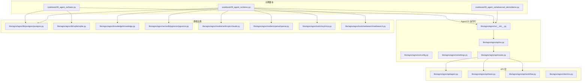
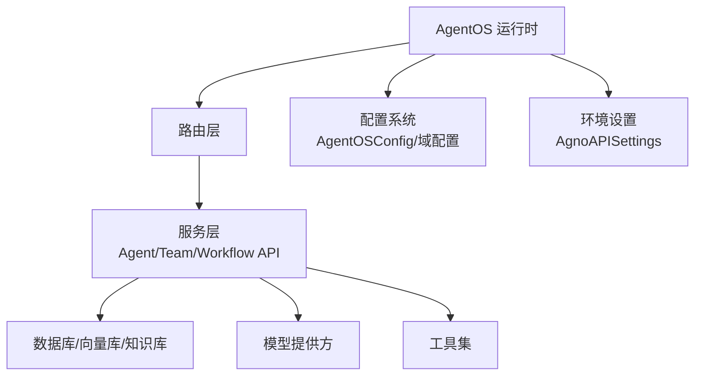
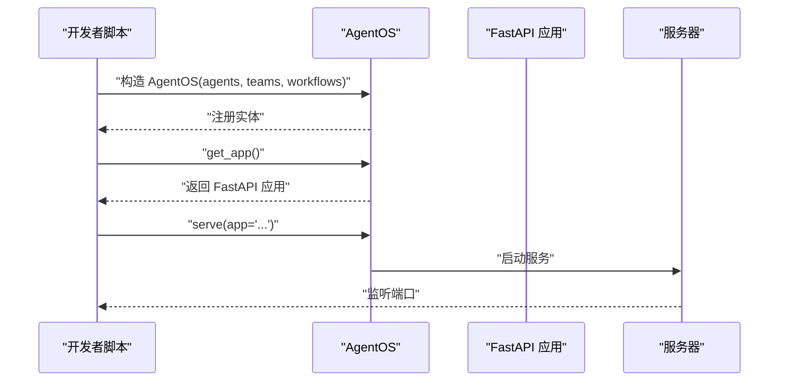
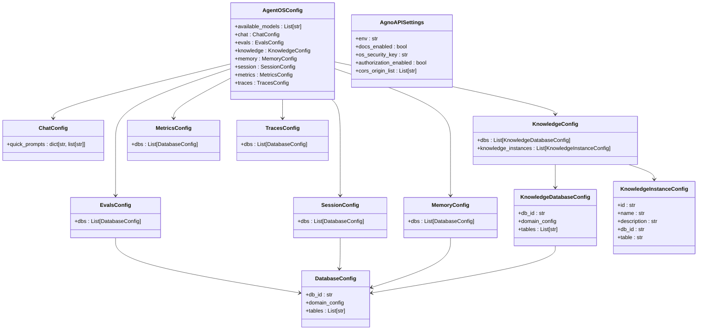
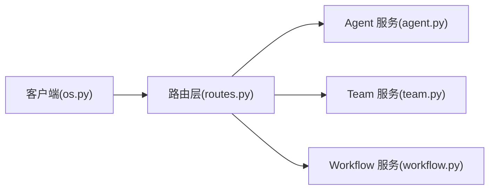
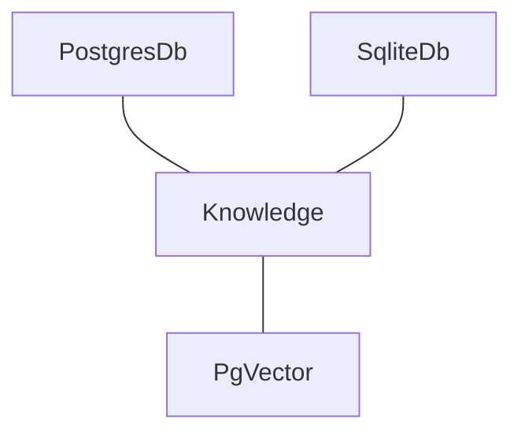
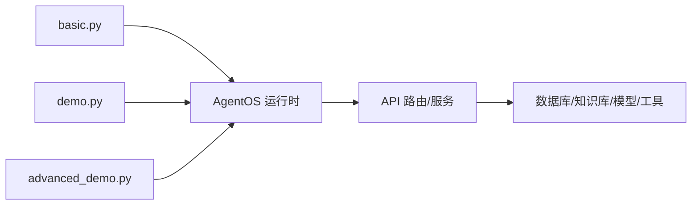

# AgentOS 基础

<cite>
**本文引用的文件**
- [README.md](file://README.md)
- [basic.py](file://cookbook/05_agent_os/basic.py)
- [demo.py](file://cookbook/05_agent_os/demo.py)
- [demo.py](file://cookbook/05_agent_os/advanced_demo/demo.py)
- [__init__.py](file://libs/agno/agno/os/__init__.py)
- [config.py](file://libs/agno/agno/os/config.py)
- [settings.py](file://libs/agno/agno/os/settings.py)
- [os.py](file://libs/agno/agno/api/os.py)
- [routes.py](file://libs/agno/agno/api/routes.py)
- [agent.py](file://libs/agno/agno/api/agent.py)
- [team.py](file://libs/agno/agno/api/team.py)
- [workflow.py](file://libs/agno/agno/api/workflow.py)
- [os.py](file://libs/agno/agno/client/os.py)
- [postgres.py](file://libs/agno/agno/db/postgres/postgres.py)
- [sqlite.py](file://libs/agno/agno/db/sqlite/sqlite.py)
- [claude.py](file://libs/agno/agno/models/anthropic/claude.py)
- [openai.py](file://libs/agno/agno/models/openai/openai.py)
- [mcp.py](file://libs/agno/agno/tools/mcp/mcp.py)
- [websearch.py](file://libs/agno/agno/tools/websearch/websearch.py)
- [pgvector.py](file://libs/agno/agno/vectordb/pgvector/pgvector.py)
- [knowledge.py](file://libs/agno/agno/knowledge/knowledge.py)
</cite>

## 目录
1. [简介](#简介)
2. [项目结构](#项目结构)
3. [核心组件](#核心组件)
4. [架构总览](#架构总览)
5. [详细组件分析](#详细组件分析)
6. [依赖关系分析](#依赖关系分析)
7. [性能考虑](#性能考虑)
8. [故障排查指南](#故障排查指南)
9. [结论](#结论)
10. [附录](#附录)

## 简介
本文件面向希望快速掌握 AgentOS 运行时基础能力的读者，系统阐述 AgentOS 的运行时架构、应用创建流程与配置管理机制，覆盖应用实例化、生命周期管理与基础配置选项；同时说明运行时环境的启动与初始化流程、基础服务配置，以及如何通过基础 API 接口、路由与中间件实现最小可用的应用示例。

## 项目结构
- 根目录提供顶层说明与示例入口，其中 cookbook/05_agent_os 下包含 AgentOS 的基础示例与演示脚本。
- libs/agno/agno/os 提供运行时核心实现（配置、设置、API 路由等），libs/agno/agno/api 提供对外 API 定义与路由，client 提供客户端封装。
- 示例脚本展示了如何组合 Agent、Team、Workflow、数据库、模型与工具，最终通过 AgentOS 构建可运行的 FastAPI 应用。

图表来源
- [basic.py:1-74](file://cookbook/05_agent_os/basic.py#L1-L74)
- [demo.py:1-104](file://cookbook/05_agent_os/demo.py#L1-L104)
- [demo.py:1-56](file://cookbook/05_agent_os/advanced_demo/demo.py#L1-L56)
- [__init__.py:1-4](file://libs/agno/agno/os/__init__.py#L1-L4)
- [config.py:1-146](file://libs/agno/agno/os/config.py#L1-L146)
- [settings.py:1-47](file://libs/agno/agno/os/settings.py#L1-L47)
- [os.py](file://libs/agno/agno/api/os.py)
- [routes.py](file://libs/agno/agno/api/routes.py)
- [agent.py](file://libs/agno/agno/api/agent.py)
- [team.py](file://libs/agno/agno/api/team.py)
- [workflow.py](file://libs/agno/agno/api/workflow.py)
- [os.py](file://libs/agno/agno/client/os.py)
- [postgres.py](file://libs/agno/agno/db/postgres/postgres.py)
- [sqlite.py](file://libs/agno/agno/db/sqlite/sqlite.py)
- [knowledge.py](file://libs/agno/agno/knowledge/knowledge.py)
- [pgvector.py](file://libs/agno/agno/vectordb/pgvector/pgvector.py)
- [claude.py](file://libs/agno/agno/models/anthropic/claude.py)
- [openai.py](file://libs/agno/agno/models/openai/openai.py)
- [mcp.py](file://libs/agno/agno/tools/mcp/mcp.py)
- [websearch.py](file://libs/agno/agno/tools/websearch/websearch.py)

章节来源
- [README.md:35-98](file://README.md#L35-L98)
- [basic.py:1-74](file://cookbook/05_agent_os/basic.py#L1-L74)
- [demo.py:1-104](file://cookbook/05_agent_os/demo.py#L1-L104)
- [demo.py:1-56](file://cookbook/05_agent_os/advanced_demo/demo.py#L1-L56)

## 核心组件
- AgentOS 运行时：负责将 Agent、Team、Workflow 等实体注册到运行时，生成可部署的 FastAPI 应用，并提供 serve/get_app 生命周期方法。
- 配置与设置：通过 Pydantic 模型定义运行时配置（如各域的数据库映射、聊天页提示词等），通过环境变量驱动的设置类管理认证、CORS 等运行参数。
- API 层：定义对外接口（Agent/Team/Workflow），路由层组织 API 路径与中间件。
- 基础设施：数据库（Postgres/SQLite）、向量库（PgVector）、知识库（Knowledge）、模型（OpenAI/Claude）、工具（MCP/WebSearch）等。

章节来源
- [__init__.py:1-4](file://libs/agno/agno/os/__init__.py#L1-L4)
- [config.py:135-146](file://libs/agno/agno/os/config.py#L135-L146)
- [settings.py:9-47](file://libs/agno/agno/os/settings.py#L9-L47)
- [os.py](file://libs/agno/agno/api/os.py)
- [routes.py](file://libs/agno/agno/api/routes.py)
- [agent.py](file://libs/agno/agno/api/agent.py)
- [team.py](file://libs/agno/agno/api/team.py)
- [workflow.py](file://libs/agno/agno/api/workflow.py)

## 架构总览
AgentOS 将“应用”抽象为一组可组合的运行单元（Agent/Team/Workflow），通过运行时统一注册与路由，最终导出 FastAPI 应用。运行时支持配置化与环境变量驱动的设置，具备认证、CORS、追踪等基础能力。

图表来源
- [os.py](file://libs/agno/agno/api/os.py)
- [routes.py](file://libs/agno/agno/api/routes.py)
- [config.py:135-146](file://libs/agno/agno/os/config.py#L135-L146)
- [settings.py:9-47](file://libs/agno/agno/os/settings.py#L9-L47)

## 详细组件分析

### AgentOS 运行时与应用创建流程
- 实例化阶段：在示例脚本中，先创建数据库、Agent、Team、Workflow 等对象，随后传入 AgentOS 构造函数完成注册。
- 应用生成：调用 get_app() 获取 FastAPI 应用实例，用于后续 serve 或直接部署。
- 启动阶段：通过 serve(app, ...) 启动开发服务器或与 Uvicorn 集成。

图表来源
- [basic.py:52-74](file://cookbook/05_agent_os/basic.py#L52-L74)
- [demo.py:89-104](file://cookbook/05_agent_os/demo.py#L89-L104)
- [demo.py:21-56](file://cookbook/05_agent_os/advanced_demo/demo.py#L21-L56)
- [os.py](file://libs/agno/agno/api/os.py)

章节来源
- [basic.py:14-74](file://cookbook/05_agent_os/basic.py#L14-L74)
- [demo.py:24-104](file://cookbook/05_agent_os/demo.py#L24-L104)
- [demo.py:18-56](file://cookbook/05_agent_os/advanced_demo/demo.py#L18-L56)

### 配置管理机制
- AgentOSConfig：顶层配置容器，包含可用模型列表、聊天页提示词、各域（Evals/Session/Memory/Knowledge/Metrics/Traces）配置及其数据库映射。
- 域配置：每个域可指定数据库映射与表清单，支持显示名等元信息。
- ChatConfig：限制每个 Agent/Team/Workflow 的快捷提示数量，确保界面体验可控。
- 设置类 AgnoAPISettings：通过环境变量控制文档开关、安全密钥、JWT 授权开关与 CORS 域白名单。

图表来源
- [config.py:135-146](file://libs/agno/agno/os/config.py#L135-L146)
- [config.py:120-133](file://libs/agno/agno/os/config.py#L120-L133)
- [config.py:75-118](file://libs/agno/agno/os/config.py#L75-L118)
- [config.py:67-73](file://libs/agno/agno/os/config.py#L67-L73)
- [config.py:93-105](file://libs/agno/agno/os/config.py#L93-L105)
- [config.py:36-44](file://libs/agno/agno/os/config.py#L36-L44)
- [settings.py:9-47](file://libs/agno/agno/os/settings.py#L9-L47)

章节来源
- [config.py:1-146](file://libs/agno/agno/os/config.py#L1-L146)
- [settings.py:1-47](file://libs/agno/agno/os/settings.py#L1-L47)

### 基础 API 接口与路由
- 路由层：集中定义 API 路径与中间件，将 Agent/Team/Workflow 的操作暴露为 HTTP 接口。
- 服务层：分别对应 Agent/Team/Workflow 的具体业务处理逻辑。
- 客户端：提供运行时客户端封装，便于在应用内访问 AgentOS 能力。

图表来源
- [routes.py](file://libs/agno/agno/api/routes.py)
- [agent.py](file://libs/agno/agno/api/agent.py)
- [team.py](file://libs/agno/agno/api/team.py)
- [workflow.py](file://libs/agno/agno/api/workflow.py)
- [os.py](file://libs/agno/agno/client/os.py)

章节来源
- [routes.py](file://libs/agno/agno/api/routes.py)
- [agent.py](file://libs/agno/agno/api/agent.py)
- [team.py](file://libs/agno/agno/api/team.py)
- [workflow.py](file://libs/agno/agno/api/workflow.py)
- [os.py](file://libs/agno/agno/client/os.py)

### 中间件与基础服务配置
- 认证与授权：支持基于 Bearer Token 的安全密钥校验与 JWT 授权开关；CORS 域白名单可由环境变量注入并自动合并官方域名。
- 追踪与可观测性：通过运行时配置启用链路追踪与指标收集，便于在 AgentOS UI 中观测与调试。

章节来源
- [settings.py:20-46](file://libs/agno/agno/os/settings.py#L20-L46)
- [config.py:114-118](file://libs/agno/agno/os/config.py#L114-L118)

### 数据库与知识库集成
- 数据库：示例脚本使用 Postgres/SQLite 作为持久化后端，支持会话、记忆、追踪等数据的存储与查询。
- 知识库：结合向量数据库（PgVector）与知识库（Knowledge）实现检索增强生成（RAG）能力。

图表来源
- [postgres.py](file://libs/agno/agno/db/postgres/postgres.py)
- [sqlite.py](file://libs/agno/agno/db/sqlite/sqlite.py)
- [knowledge.py](file://libs/agno/agno/knowledge/knowledge.py)
- [pgvector.py](file://libs/agno/agno/vectordb/pgvector/pgvector.py)

章节来源
- [demo.py:24-39](file://cookbook/05_agent_os/demo.py#L24-L39)
- [basic.py:15-28](file://cookbook/05_agent_os/basic.py#L15-L28)

### 模型与工具
- 模型：示例脚本使用 OpenAI/Claude 等模型提供推理能力。
- 工具：MCP/WebSearch 等工具扩展 Agent 的外部交互能力。

章节来源
- [demo.py:42-71](file://cookbook/05_agent_os/demo.py#L42-L71)
- [basic.py:19-50](file://cookbook/05_agent_os/basic.py#L19-L50)
- [claude.py](file://libs/agno/agno/models/anthropic/claude.py)
- [openai.py](file://libs/agno/agno/models/openai/openai.py)
- [mcp.py](file://libs/agno/agno/tools/mcp/mcp.py)
- [websearch.py](file://libs/agno/agno/tools/websearch/websearch.py)

## 依赖关系分析
- 组件耦合：示例脚本对 AgentOS 的依赖集中在构造与启动两个阶段；运行时内部通过路由层解耦服务层。
- 外部依赖：数据库、向量库、模型提供方与工具均为可插拔组件，通过配置与注入实现解耦。
- 环境变量：通过 AgnoAPISettings 统一读取运行时参数，避免硬编码。

图表来源
- [basic.py:52-74](file://cookbook/05_agent_os/basic.py#L52-L74)
- [demo.py:89-104](file://cookbook/05_agent_os/demo.py#L89-L104)
- [demo.py:21-56](file://cookbook/05_agent_os/advanced_demo/demo.py#L21-L56)
- [os.py](file://libs/agno/agno/api/os.py)
- [routes.py](file://libs/agno/agno/api/routes.py)

章节来源
- [basic.py:1-74](file://cookbook/05_agent_os/basic.py#L1-L74)
- [demo.py:1-104](file://cookbook/05_agent_os/demo.py#L1-L104)
- [demo.py:1-56](file://cookbook/05_agent_os/advanced_demo/demo.py#L1-L56)

## 性能考虑
- 无状态与水平扩展：运行时设计为无状态，适合水平扩展部署。
- 会话与记忆：合理设置历史轮次与摘要更新策略，平衡上下文长度与性能。
- 数据库与向量库：根据负载选择合适的数据库与索引策略，避免热查询阻塞。
- 工具调用：对高延迟工具采用异步或限流策略，保证主流程吞吐。

## 故障排查指南
- 认证问题：检查 OS_SECURITY_KEY 是否正确设置，或 authorization_enabled 与 JWT 配置是否符合预期。
- CORS 问题：确认 cors_origin_list 是否包含前端域名，必要时显式设置环境变量。
- 数据库连接：核对数据库 URL 与凭据，确保网络可达与权限正确。
- 工具不可用：检查工具的网络连通性与鉴权配置（如 MCP 服务地址与协议）。

章节来源
- [settings.py:20-46](file://libs/agno/agno/os/settings.py#L20-L46)

## 结论
AgentOS 以“可组合的运行单元 + 配置化运行时”的方式，提供了从开发到生产的统一架构。通过最小示例即可快速搭建具备状态管理、工具调用与可观测性的 Agent 应用，并在此基础上扩展团队与工作流，满足更复杂的编排需求。

## 附录

### 快速上手步骤（基于示例）
- 创建数据库与 Agent/Team/Workflow 对象。
- 初始化 AgentOS 并获取应用实例。
- 启动开发服务器或集成到生产环境。

章节来源
- [basic.py:14-74](file://cookbook/05_agent_os/basic.py#L14-L74)
- [demo.py:24-104](file://cookbook/05_agent_os/demo.py#L24-L104)
- [demo.py:18-56](file://cookbook/05_agent_os/advanced_demo/demo.py#L18-L56)