# AgentOS 运行时

<cite>
**本文引用的文件**
- [cookbook/05_agent_os/README.md](file://cookbook/05_agent_os/README.md)
- [cookbook/05_agent_os/demo.py](file://cookbook/05_agent_os/demo.py)
- [cookbook/05_agent_os/basic.py](file://cookbook/05_agent_os/basic.py)
- [libs/agno/os/__init__.py](file://libs/agno/os/__init__.py)
- [libs/agno/os/agent_os.py](file://libs/agno/os/agent_os.py)
- [libs/agno/api/api.py](file://libs/agno/api/api.py)
- [libs/agno/api/routes.py](file://libs/agno/api/routes.py)
- [libs/agno/agent/agent.py](file://libs/agno/agent/agent.py)
- [libs/agno/team/team.py](file://libs/agno/team/team.py)
- [libs/agno/workflow/workflow.py](file://libs/agno/workflow/workflow.py)
- [libs/agno/db/postgres.py](file://libs/agno/db/postgres.py)
- [libs/agno/vectordb/pgvector.py](file://libs/agno/vectordb/pgvector.py)
- [libs/agno/knowledge/knowledge.py](file://libs/agno/knowledge/knowledge.py)
- [libs/agno/models/openai.py](file://libs/agno/models/openai.py)
- [libs/agno/tools/mcp.py](file://libs/agno/tools/mcp.py)
- [libs/agno/approval/decorator.py](file://libs/agno/approval/decorator.py)
- [libs/agno/approval/types.py](file://libs/agno/approval/types.py)
- [libs/agno/scheduler/scheduler.py](file://libs/agno/scheduler/scheduler.py)
- [libs/agno/client/a2a/__init__.py](file://libs/agno/client/a2a/__init__.py)
- [libs/agno/client/os.py](file://libs/agno/client/os.py)
- [libs/agno/interfaces/a2a/__init__.py](file://libs/agno/interfaces/a2a/__init__.py)
- [libs/agno/rbac/__init__.py](file://libs/agno/rbac/__init__.py)
- [libs/agno/tracing/__init__.py](file://libs/agno/tracing/__init__.py)
- [libs/agno/background_tasks/__init__.py](file://libs/agno/background_tasks/__init__.py)
- [libs/agno/middleware/__init__.py](file://libs/agno/middleware/__init__.py)
- [libs/agno/customize/__init__.py](file://libs/agno/customize/__init__.py)
- [libs/agno/integrations/__init__.py](file://libs/agno/integrations/__init__.py)
- [libs/agno/skills/__init__.py](file://libs/agno/skills/__init__.py)
- [libs/agno/team_tasks/__init__.py](file://libs/agno/team_tasks/__init__.py)
- [libs/agno/os_config/__init__.py](file://libs/agno/os_config/__init__.py)
- [libs/agno/mcp_demo/__init__.py](file://libs/agno/mcp_demo/__init__.py)
- [libs/agno/remote/__init__.py](file://libs/agno/remote/__init__.py)
- [libs/agno/workflow/__init__.py](file://libs/agno/workflow/__init__.py)
- [libs/agno/registry/__init__.py](file://libs/agno/registry/__init__.py)
</cite>

## 目录
1. [简介](#简介)
2. [项目结构](#项目结构)
3. [核心组件](#核心组件)
4. [架构总览](#架构总览)
5. [详细组件分析](#详细组件分析)
6. [依赖关系分析](#依赖关系分析)
7. [性能考量](#性能考量)
8. [故障排查指南](#故障排查指南)
9. [结论](#结论)
10. [附录](#附录)

## 简介
本文件面向 Agno Learn 的 AgentOS 运行时，系统性梳理其架构设计与实现原理，覆盖运行时架构、应用创建与配置管理、基础功能、高级演示、审批系统、后台任务、客户端集成、A2A 集成、自定义配置、数据库集成、集成工具与接口管理、知识库集成、MCP 演示、中间件、RBAC、远程集成、调度器、模式定义、技能系统、团队任务、链路追踪与工作流集成等主题。文档以可操作的示例与清晰的图示帮助读者快速理解并高效使用 AgentOS。

## 项目结构
AgentOS 示例位于 cookbook/05_agent_os 目录，提供最小化示例与完整演示；核心运行时与组件位于 libs/agno 下，按领域模块化组织，包含运行时入口、API 层、代理、团队、工作流、数据库、向量库、知识库、模型、工具、审批、调度、客户端与接口等子系统。

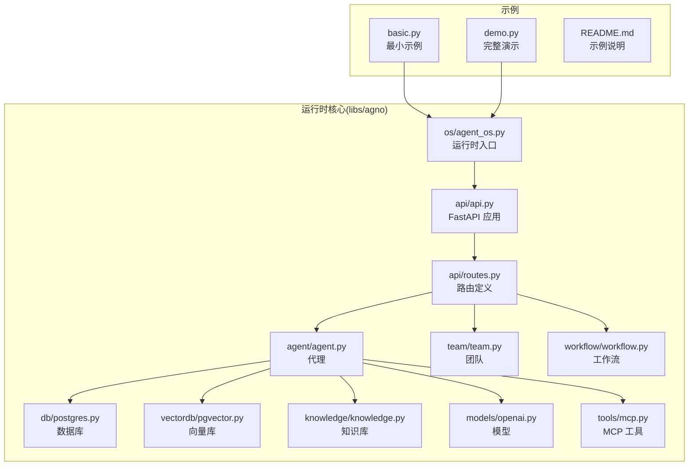

**图表来源**
- [cookbook/05_agent_os/basic.py:1-74](file://cookbook/05_agent_os/basic.py#L1-L74)
- [cookbook/05_agent_os/demo.py:1-104](file://cookbook/05_agent_os/demo.py#L1-L104)
- [libs/agno/os/agent_os.py](file://libs/agno/os/agent_os.py)
- [libs/agno/api/api.py](file://libs/agno/api/api.py)
- [libs/agno/api/routes.py](file://libs/agno/api/routes.py)
- [libs/agno/agent/agent.py](file://libs/agno/agent/agent.py)
- [libs/agno/team/team.py](file://libs/agno/team/team.py)
- [libs/agno/workflow/workflow.py](file://libs/agno/workflow/workflow.py)
- [libs/agno/db/postgres.py](file://libs/agno/db/postgres.py)
- [libs/agno/vectordb/pgvector.py](file://libs/agno/vectordb/pgvector.py)
- [libs/agno/knowledge/knowledge.py](file://libs/agno/knowledge/knowledge.py)
- [libs/agno/models/openai.py](file://libs/agno/models/openai.py)
- [libs/agno/tools/mcp.py](file://libs/agno/tools/mcp.py)

**章节来源**
- [cookbook/05_agent_os/README.md:1-14](file://cookbook/05_agent_os/README.md#L1-L14)
- [cookbook/05_agent_os/basic.py:1-74](file://cookbook/05_agent_os/basic.py#L1-L74)
- [cookbook/05_agent_os/demo.py:1-104](file://cookbook/05_agent_os/demo.py#L1-L104)

## 核心组件
- 运行时入口：负责注册代理、团队、工作流，构建 FastAPI 应用并提供服务启动能力。
- API 层：统一暴露 REST 接口，路由到代理、团队、工作流等资源。
- 代理：具备会话记忆、工具调用、上下文管理、输出解析等能力。
- 团队：多代理协作编排，支持领导代理与成员交互。
- 工作流：步骤化执行，支持顺序、条件、并行与循环等执行模式。
- 数据与知识：持久化存储、向量检索、RAG 等能力。
- 中间件与配置：支持 JWT、自定义中间件、YAML 配置、生命周期事件等。
- 审批与 RBAC：装饰器式审批、权限控制与审计。
- 调度与后台任务：计划任务、异步钩子与评估。
- 客户端与 A2A：本地客户端 SDK、A2A 消息与流式通信。
- 集成与扩展：MCP、远程集成、接口适配、技能系统、链路追踪等。

**章节来源**
- [libs/agno/os/agent_os.py](file://libs/agno/os/agent_os.py)
- [libs/agno/api/api.py](file://libs/agno/api/api.py)
- [libs/agno/api/routes.py](file://libs/agno/api/routes.py)
- [libs/agno/agent/agent.py](file://libs/agno/agent/agent.py)
- [libs/agno/team/team.py](file://libs/agno/team/team.py)
- [libs/agno/workflow/workflow.py](file://libs/agno/workflow/workflow.py)
- [libs/agno/db/postgres.py](file://libs/agno/db/postgres.py)
- [libs/agno/vectordb/pgvector.py](file://libs/agno/vectordb/pgvector.py)
- [libs/agno/knowledge/knowledge.py](file://libs/agno/knowledge/knowledge.py)
- [libs/agno/middleware/__init__.py](file://libs/agno/middleware/__init__.py)
- [libs/agno/os_config/__init__.py](file://libs/agno/os_config/__init__.py)

## 架构总览
AgentOS 将“运行时”、“API 层”、“资源层”解耦：运行时负责装配与生命周期管理；API 层提供统一接口；资源层通过插件化组件（数据库、向量库、知识库、模型、工具）扩展能力。

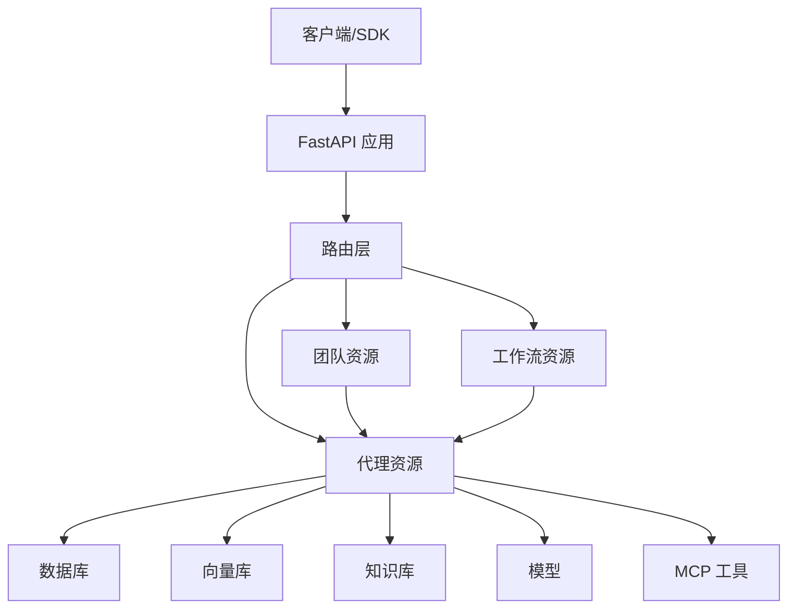

**图表来源**
- [libs/agno/api/api.py](file://libs/agno/api/api.py)
- [libs/agno/api/routes.py](file://libs/agno/api/routes.py)
- [libs/agno/agent/agent.py](file://libs/agno/agent/agent.py)
- [libs/agno/team/team.py](file://libs/agno/team/team.py)
- [libs/agno/workflow/workflow.py](file://libs/agno/workflow/workflow.py)
- [libs/agno/db/postgres.py](file://libs/agno/db/postgres.py)
- [libs/agno/vectordb/pgvector.py](file://libs/agno/vectordb/pgvector.py)
- [libs/agno/knowledge/knowledge.py](file://libs/agno/knowledge/knowledge.py)
- [libs/agno/models/openai.py](file://libs/agno/models/openai.py)
- [libs/agno/tools/mcp.py](file://libs/agno/tools/mcp.py)

## 详细组件分析

### 运行时架构与应用创建
- 运行时装配：在运行时中注册代理、团队、工作流，并生成 FastAPI 应用实例。
- 示例对比：最小示例仅包含代理、团队与工作流；完整示例加入知识库、向量库、MCP 工具与多代理团队。
- 启动方式：通过运行时提供的 serve 方法启动开发服务器或部署服务。

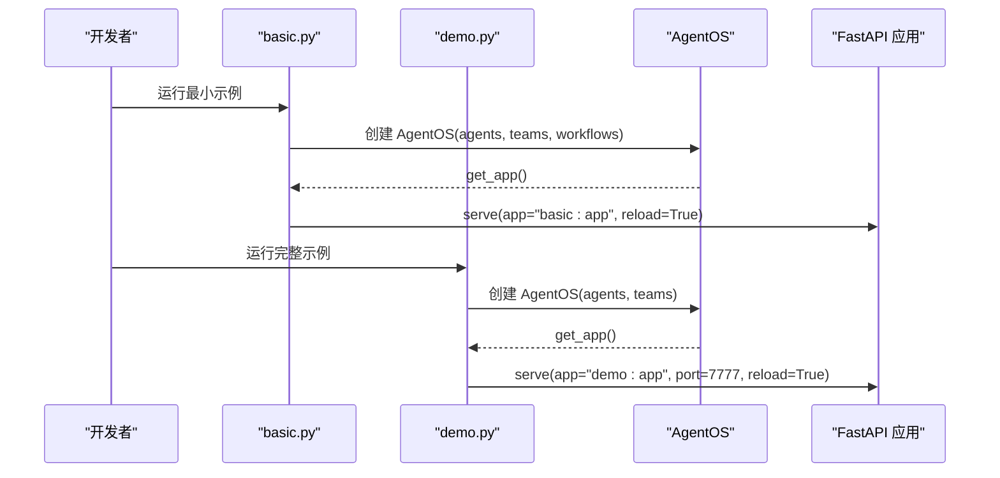

**图表来源**
- [cookbook/05_agent_os/basic.py:52-74](file://cookbook/05_agent_os/basic.py#L52-L74)
- [cookbook/05_agent_os/demo.py:89-104](file://cookbook/05_agent_os/demo.py#L89-L104)
- [libs/agno/os/agent_os.py](file://libs/agno/os/agent_os.py)

**章节来源**
- [cookbook/05_agent_os/basic.py:1-74](file://cookbook/05_agent_os/basic.py#L1-L74)
- [cookbook/05_agent_os/demo.py:1-104](file://cookbook/05_agent_os/demo.py#L1-L104)

### API 与路由
- 统一 API：路由层集中暴露代理、团队、工作流、评估等接口。
- 扩展点：可通过自定义路由与中间件增强鉴权、限流、审计等能力。

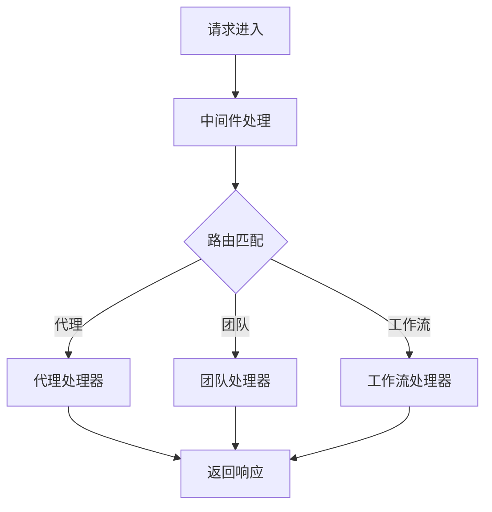

**图表来源**
- [libs/agno/api/api.py](file://libs/agno/api/api.py)
- [libs/agno/api/routes.py](file://libs/agno/api/routes.py)

**章节来源**
- [libs/agno/api/api.py](file://libs/agno/api/api.py)
- [libs/agno/api/routes.py](file://libs/agno/api/routes.py)

### 代理（Agent）
- 能力：会话记忆、上下文注入、工具调用、结构化输出、多模态输入等。
- 配置：数据库、向量库、知识库、模型与工具的组合使用。
- 示例：MCP 工具、Web 搜索工具、Markdown 输出、时间戳上下文注入等。

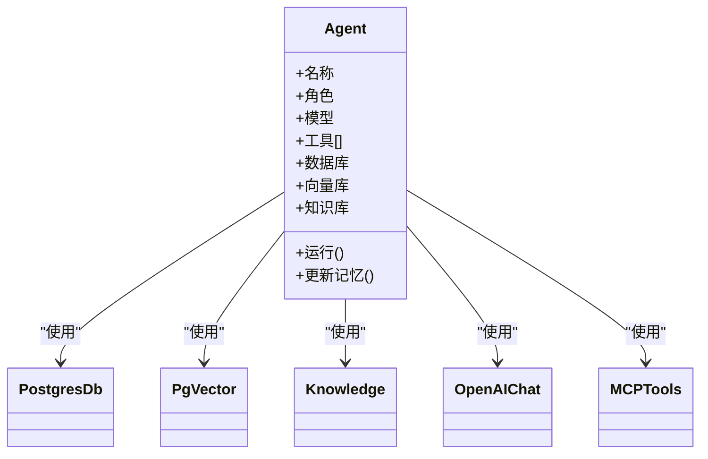

**图表来源**
- [libs/agno/agent/agent.py](file://libs/agno/agent/agent.py)
- [libs/agno/db/postgres.py](file://libs/agno/db/postgres.py)
- [libs/agno/vectordb/pgvector.py](file://libs/agno/vectordb/pgvector.py)
- [libs/agno/knowledge/knowledge.py](file://libs/agno/knowledge/knowledge.py)
- [libs/agno/models/openai.py](file://libs/agno/models/openai.py)
- [libs/agno/tools/mcp.py](file://libs/agno/tools/mcp.py)

**章节来源**
- [libs/agno/agent/agent.py](file://libs/agno/agent/agent.py)
- [libs/agno/db/postgres.py](file://libs/agno/db/postgres.py)
- [libs/agno/vectordb/pgvector.py](file://libs/agno/vectordb/pgvector.py)
- [libs/agno/knowledge/knowledge.py](file://libs/agno/knowledge/knowledge.py)
- [libs/agno/models/openai.py](file://libs/agno/models/openai.py)
- [libs/agno/tools/mcp.py](file://libs/agno/tools/mcp.py)

### 团队（Team）
- 编排：领导代理协调成员执行任务，支持上下文注入与 Markdown 输出。
- 成员：多个代理共享上下文与目标，协同完成复杂任务。

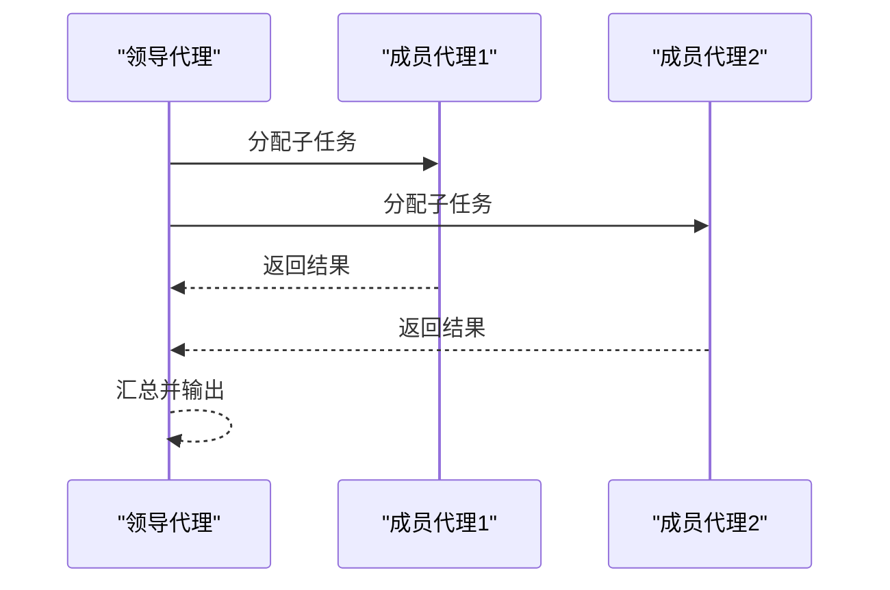

**图表来源**
- [libs/agno/team/team.py](file://libs/agno/team/team.py)
- [libs/agno/agent/agent.py](file://libs/agno/agent/agent.py)

**章节来源**
- [libs/agno/team/team.py](file://libs/agno/team/team.py)

### 工作流（Workflow）
- 步骤化执行：顺序、条件、并行与循环等执行模式。
- 历史与上下文：可将工作流历史注入步骤上下文，提升一致性与可追溯性。

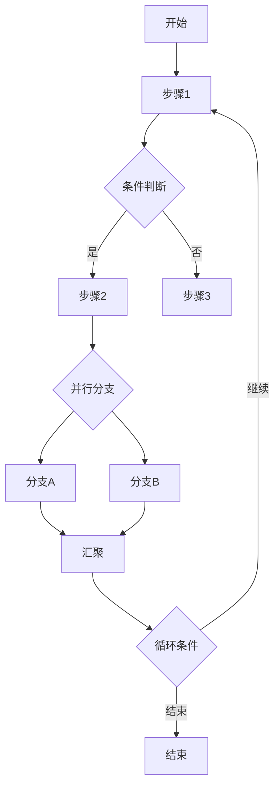

**图表来源**
- [libs/agno/workflow/workflow.py](file://libs/agno/workflow/workflow.py)

**章节来源**
- [libs/agno/workflow/workflow.py](file://libs/agno/workflow/workflow.py)

### 审批系统（Approvals）
- 装饰器式审批：对代理、团队、工作流的关键动作进行审批拦截。
- 类型与状态：定义审批类型、状态流转与审计记录。
- 示例：基本审批、用户输入审批、异步审批与审计概览。

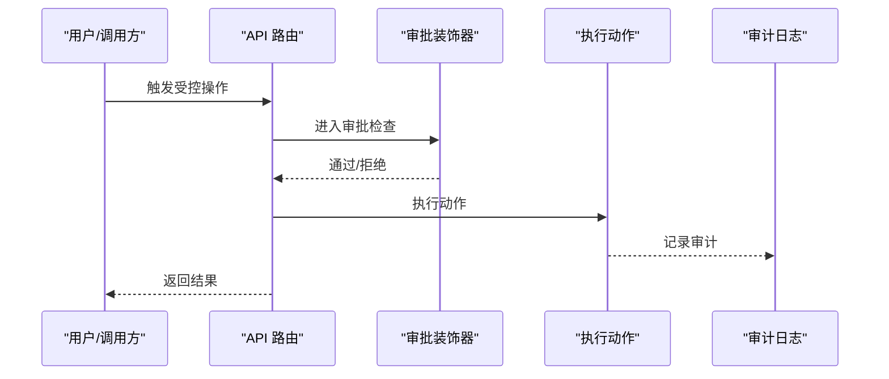

**图表来源**
- [libs/agno/approval/decorator.py](file://libs/agno/approval/decorator.py)
- [libs/agno/approval/types.py](file://libs/agno/approval/types.py)

**章节来源**
- [libs/agno/approval/decorator.py](file://libs/agno/approval/decorator.py)
- [libs/agno/approval/types.py](file://libs/agno/approval/types.py)

### 后台任务与异步执行
- 异步钩子：在运行前后执行异步逻辑，如评估、指标上报。
- 评估与输出：对输出进行异步评估，支持团队与工作流维度。
- 示例：后台钩子、团队钩子、工作流钩子与评估示例。

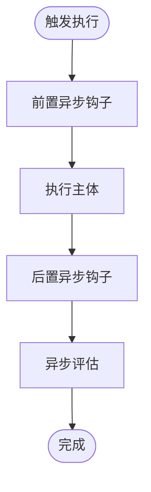

**图表来源**
- [libs/agno/background_tasks/__init__.py](file://libs/agno/background_tasks/__init__.py)

**章节来源**
- [libs/agno/background_tasks/__init__.py](file://libs/agno/background_tasks/__init__.py)

### 客户端集成（SDK 与 API）
- 本地客户端：封装运行时 API，支持运行代理、团队、工作流与知识搜索。
- 服务器端：示例展示如何在服务端集成 AgentOS 并对外提供接口。
- 错误处理：建议在客户端捕获网络异常、鉴权失败与业务错误码。

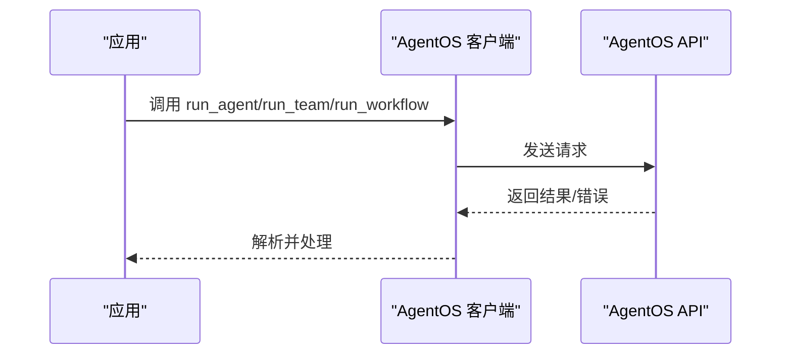

**图表来源**
- [libs/agno/client/os.py](file://libs/agno/client/os.py)

**章节来源**
- [libs/agno/client/os.py](file://libs/agno/client/os.py)

### A2A（Agent-to-Agent）集成
- 本地 A2A：通过接口层实现代理间消息传递与流式通信。
- 错误处理：示例覆盖连接失败、协议不匹配与超时等场景。
- 多轮对话：支持多轮消息与状态同步。

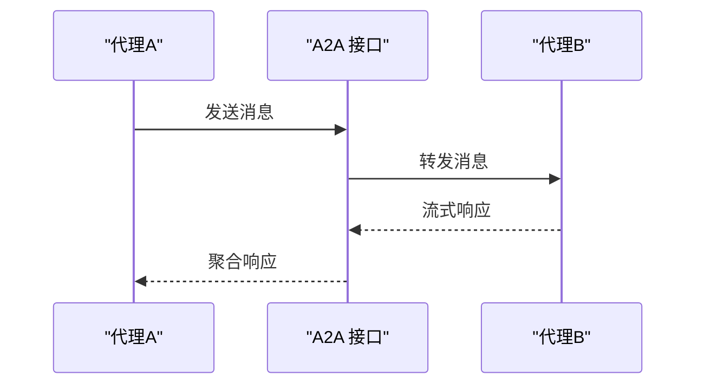

**图表来源**
- [libs/agno/interfaces/a2a/__init__.py](file://libs/agno/interfaces/a2a/__init__.py)
- [libs/agno/client/a2a/__init__.py](file://libs/agno/client/a2a/__init__.py)

**章节来源**
- [libs/agno/interfaces/a2a/__init__.py](file://libs/agno/interfaces/a2a/__init__.py)
- [libs/agno/client/a2a/__init__.py](file://libs/agno/client/a2a/__init__.py)

### 自定义配置与中间件
- YAML 配置：支持从 YAML 文件加载运行时配置。
- 生命周期事件：在应用生命周期内注入自定义逻辑。
- 自定义中间件：支持 JWT、内容提取、守卫等中间件。
- 路由覆盖：允许替换默认路由或添加新路由。

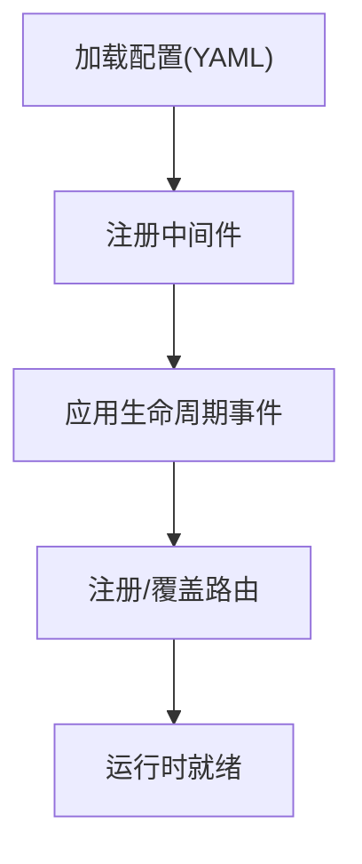

**图表来源**
- [libs/agno/os_config/__init__.py](file://libs/agno/os_config/__init__.py)
- [libs/agno/middleware/__init__.py](file://libs/agno/middleware/__init__.py)
- [libs/agno/customize/__init__.py](file://libs/agno/customize/__init__.py)

**章节来源**
- [libs/agno/os_config/__init__.py](file://libs/agno/os_config/__init__.py)
- [libs/agno/middleware/__init__.py](file://libs/agno/middleware/__init__.py)
- [libs/agno/customize/__init__.py](file://libs/agno/customize/__init__.py)

### 数据库集成与连接池
- 多数据库支持：PostgreSQL、MySQL、SQLite、MongoDB、Redis、DynamoDB、Firestore、S3 等。
- 连接池与迁移：提供连接池配置与迁移工具，确保生产可用性。
- 向量库：PgVector 作为 PostgreSQL 的向量扩展，支撑 RAG 场景。

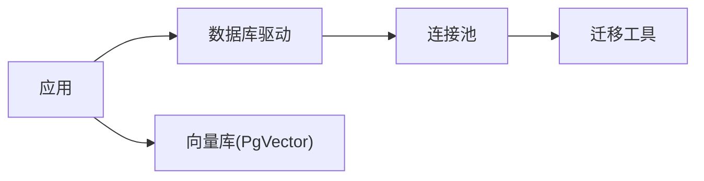

**图表来源**
- [libs/agno/db/postgres.py](file://libs/agno/db/postgres.py)
- [libs/agno/vectordb/pgvector.py](file://libs/agno/vectordb/pgvector.py)

**章节来源**
- [libs/agno/db/postgres.py](file://libs/agno/db/postgres.py)
- [libs/agno/vectordb/pgvector.py](file://libs/agno/vectordb/pgvector.py)

### 知识库与 RAG
- 知识库：结合内容数据库与向量库，提供检索增强生成能力。
- 示例：基于知识库的问答、检索重排与参考格式化。

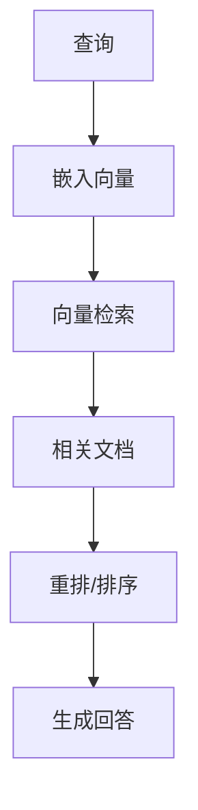

**图表来源**
- [libs/agno/knowledge/knowledge.py](file://libs/agno/knowledge/knowledge.py)
- [libs/agno/vectordb/pgvector.py](file://libs/agno/vectordb/pgvector.py)

**章节来源**
- [libs/agno/knowledge/knowledge.py](file://libs/agno/knowledge/knowledge.py)

### MCP 演示与工具生态
- MCP 工具：通过 MCP 协议动态发现与调用外部工具。
- 示例：启用 MCP、高级工具配置与现有生命周期集成。

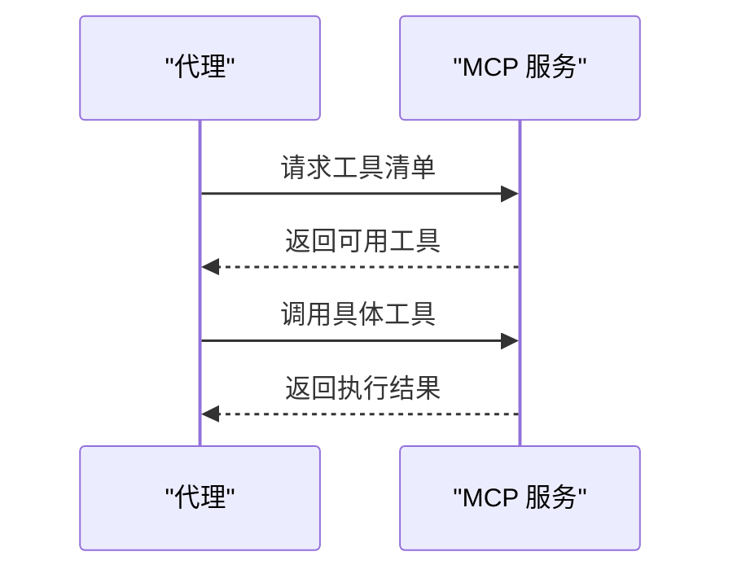

**图表来源**
- [libs/agno/tools/mcp.py](file://libs/agno/tools/mcp.py)
- [libs/agno/mcp_demo/__init__.py](file://libs/agno/mcp_demo/__init__.py)

**章节来源**
- [libs/agno/tools/mcp.py](file://libs/agno/tools/mcp.py)
- [libs/agno/mcp_demo/__init__.py](file://libs/agno/mcp_demo/__init__.py)

### RBAC 权限控制
- 对称与非对称权限模型：根据角色与资源建立授权矩阵。
- 集成点：可在中间件或路由层进行权限校验。

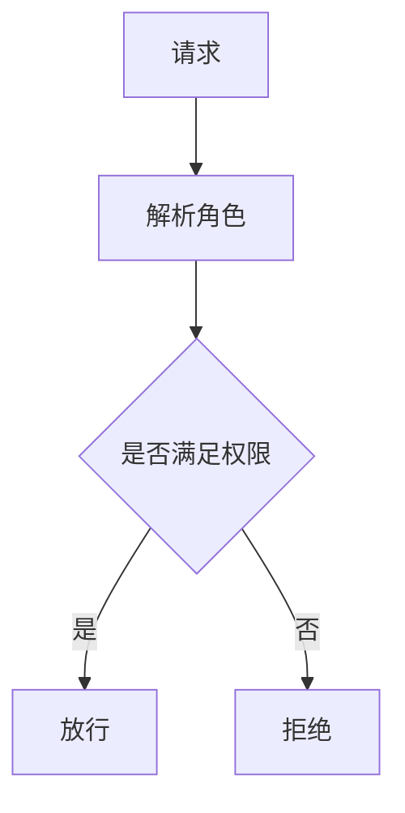

**图表来源**
- [libs/agno/rbac/__init__.py](file://libs/agno/rbac/__init__.py)

**章节来源**
- [libs/agno/rbac/__init__.py](file://libs/agno/rbac/__init__.py)

### 调度器与计划任务
- 计划任务：支持单次、周期与多代理调度。
- REST API：通过 API 管理与查询调度任务。
- 历史与验证：记录执行历史并进行调度有效性校验。

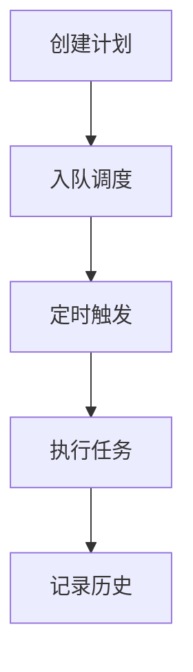

**图表来源**
- [libs/agno/scheduler/scheduler.py](file://libs/agno/scheduler/scheduler.py)

**章节来源**
- [libs/agno/scheduler/scheduler.py](file://libs/agno/scheduler/scheduler.py)

### 技能系统与团队任务
- 技能：可复用的动作模板，便于在代理与团队中共享。
- 团队任务：支持团队级的任务流式执行与状态跟踪。

**章节来源**
- [libs/agno/skills/__init__.py](file://libs/agno/skills/__init__.py)
- [libs/agno/team_tasks/__init__.py](file://libs/agno/team_tasks/__init__.py)

### 链路追踪与可观测性
- 追踪：贯穿请求到执行的全链路观测，便于定位性能瓶颈与异常。
- 集成：可与外部追踪系统对接，统一采集与上报。

**章节来源**
- [libs/agno/tracing/__init__.py](file://libs/agno/tracing/__init__.py)

### 远程集成与网关
- 远程代理/团队：支持远程调用与跨边界协作。
- 网关：提供统一入口与协议转换，保障安全与稳定。

**章节来源**
- [libs/agno/remote/__init__.py](file://libs/agno/remote/__init__.py)

### 接口管理与模式定义
- 接口：抽象出统一的适配层，屏蔽底层差异。
- 模式：定义数据与行为模式，确保扩展一致性。

**章节来源**
- [libs/agno/interfaces/a2a/__init__.py](file://libs/agno/interfaces/a2a/__init__.py)
- [libs/agno/registry/__init__.py](file://libs/agno/registry/__init__.py)

## 依赖关系分析
AgentOS 采用模块化设计，运行时与 API 层解耦，资源层通过组件插件化扩展。下图展示关键文件间的依赖关系。

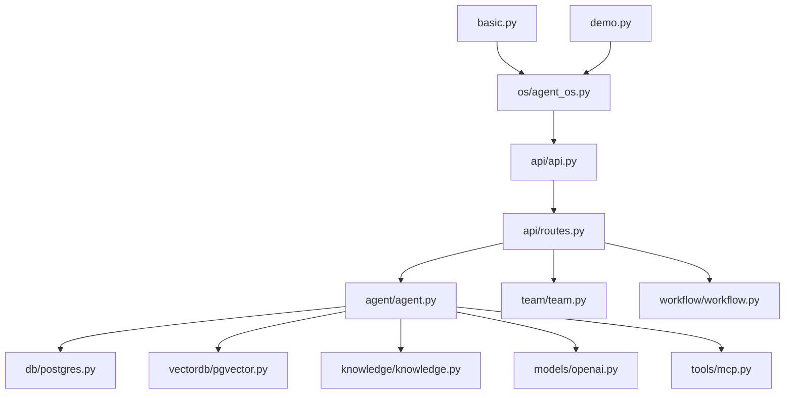

**图表来源**
- [cookbook/05_agent_os/basic.py:1-74](file://cookbook/05_agent_os/basic.py#L1-L74)
- [cookbook/05_agent_os/demo.py:1-104](file://cookbook/05_agent_os/demo.py#L1-L104)
- [libs/agno/os/agent_os.py](file://libs/agno/os/agent_os.py)
- [libs/agno/api/api.py](file://libs/agno/api/api.py)
- [libs/agno/api/routes.py](file://libs/agno/api/routes.py)
- [libs/agno/agent/agent.py](file://libs/agno/agent/agent.py)
- [libs/agno/team/team.py](file://libs/agno/team/team.py)
- [libs/agno/workflow/workflow.py](file://libs/agno/workflow/workflow.py)
- [libs/agno/db/postgres.py](file://libs/agno/db/postgres.py)
- [libs/agno/vectordb/pgvector.py](file://libs/agno/vectordb/pgvector.py)
- [libs/agno/knowledge/knowledge.py](file://libs/agno/knowledge/knowledge.py)
- [libs/agno/models/openai.py](file://libs/agno/models/openai.py)
- [libs/agno/tools/mcp.py](file://libs/agno/tools/mcp.py)

**章节来源**
- [cookbook/05_agent_os/basic.py:1-74](file://cookbook/05_agent_os/basic.py#L1-L74)
- [cookbook/05_agent_os/demo.py:1-104](file://cookbook/05_agent_os/demo.py#L1-L104)
- [libs/agno/os/agent_os.py](file://libs/agno/os/agent_os.py)
- [libs/agno/api/api.py](file://libs/agno/api/api.py)
- [libs/agno/api/routes.py](file://libs/agno/api/routes.py)
- [libs/agno/agent/agent.py](file://libs/agno/agent/agent.py)
- [libs/agno/team/team.py](file://libs/agno/team/team.py)
- [libs/agno/workflow/workflow.py](file://libs/agno/workflow/workflow.py)
- [libs/agno/db/postgres.py](file://libs/agno/db/postgres.py)
- [libs/agno/vectordb/pgvector.py](file://libs/agno/vectordb/pgvector.py)
- [libs/agno/knowledge/knowledge.py](file://libs/agno/knowledge/knowledge.py)
- [libs/agno/models/openai.py](file://libs/agno/models/openai.py)
- [libs/agno/tools/mcp.py](file://libs/agno/tools/mcp.py)

## 性能考量
- 连接池与并发：合理配置数据库与向量库连接池，避免高并发下的连接争用。
- 向量化与索引：对常用查询建立高效索引，减少检索延迟。
- 缓存与预热：对热点数据与工具调用结果进行缓存。
- 异步与流式：利用异步钩子与流式输出降低端到端等待时间。
- 监控与追踪：开启链路追踪与指标采集，持续优化关键路径。

## 故障排查指南
- 启动失败：检查环境变量、端口占用与依赖安装。
- 认证问题：确认鉴权中间件配置与密钥设置。
- 数据库连接：核对连接串、网络连通与权限。
- 工具调用：检查 MCP 服务可达性与工具清单。
- 审批阻塞：查看审批状态与审计日志，确认审批流程。
- 调度异常：核对计划表达式与历史记录，修正无效调度。

## 结论
AgentOS 提供了从运行时装配、API 接口到资源扩展的完整能力体系。通过模块化设计与丰富的示例，开发者可以快速搭建从单代理到多代理团队与工作流的智能系统，并在此基础上扩展知识库、MCP、RBAC、调度与可观测性等高级能力。

## 附录
- 快速开始：参考示例目录中的最小示例与完整演示，按需选择运行。
- 配置管理：优先使用 YAML 配置与生命周期事件，保持运行时一致性。
- 扩展建议：遵循接口契约与模式定义，逐步引入新的数据库、工具与集成。