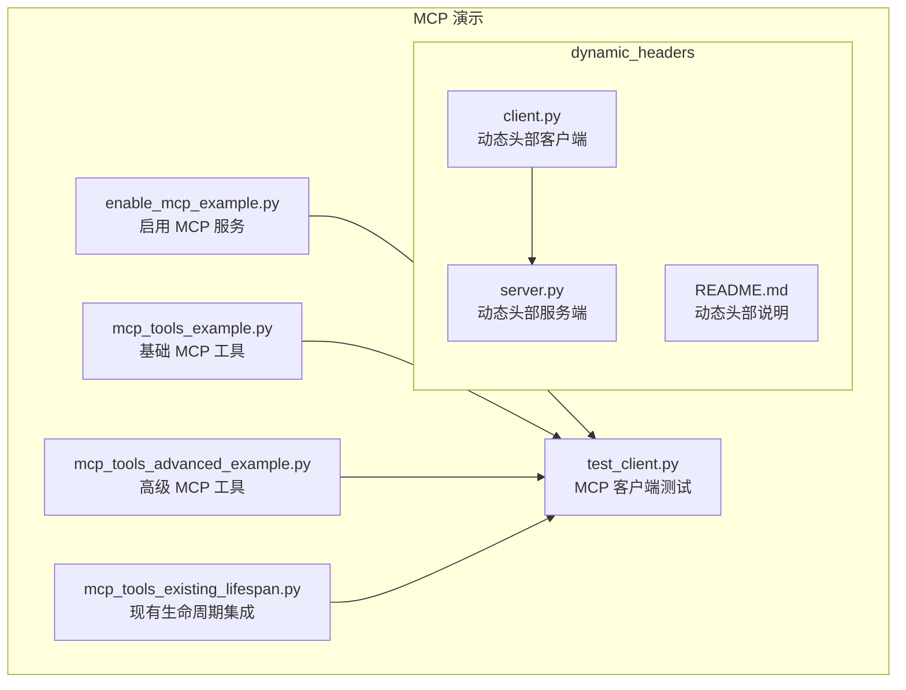
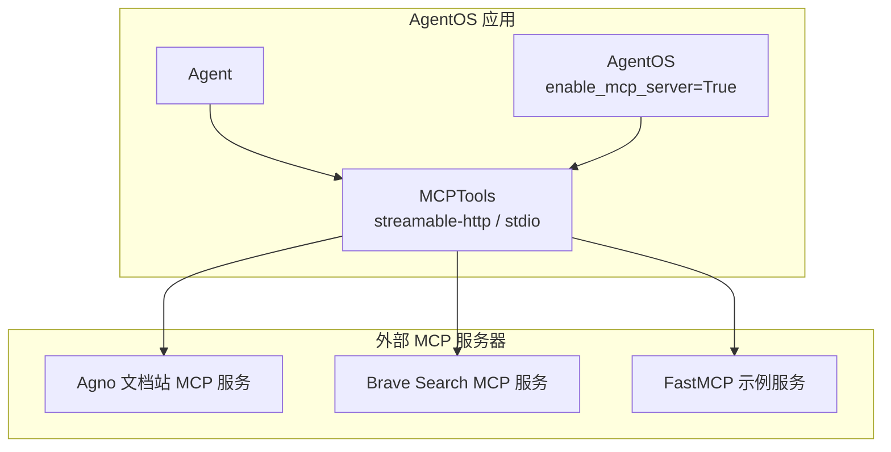
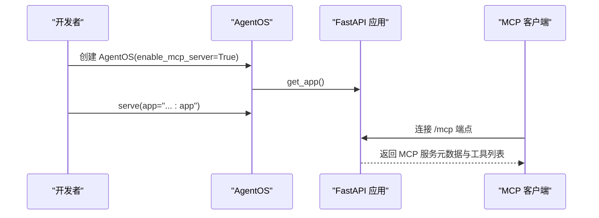
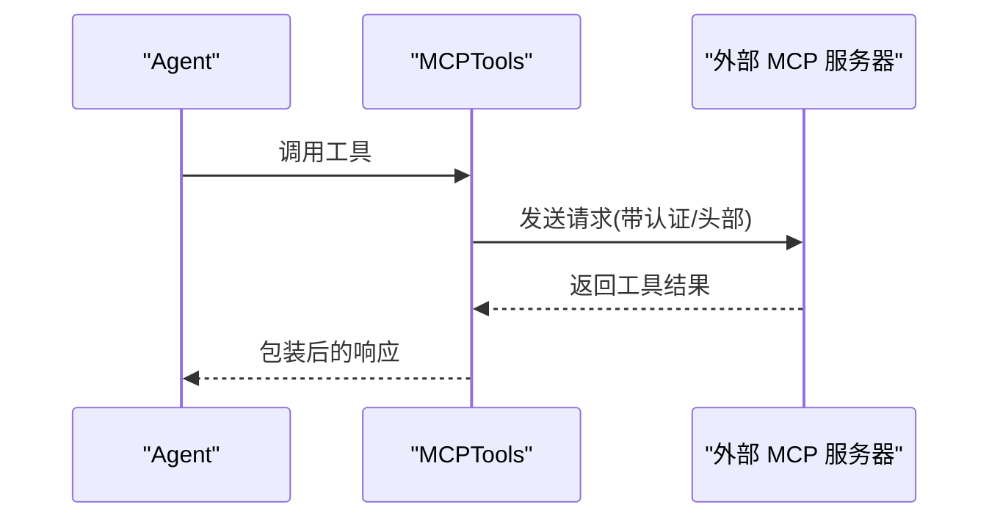
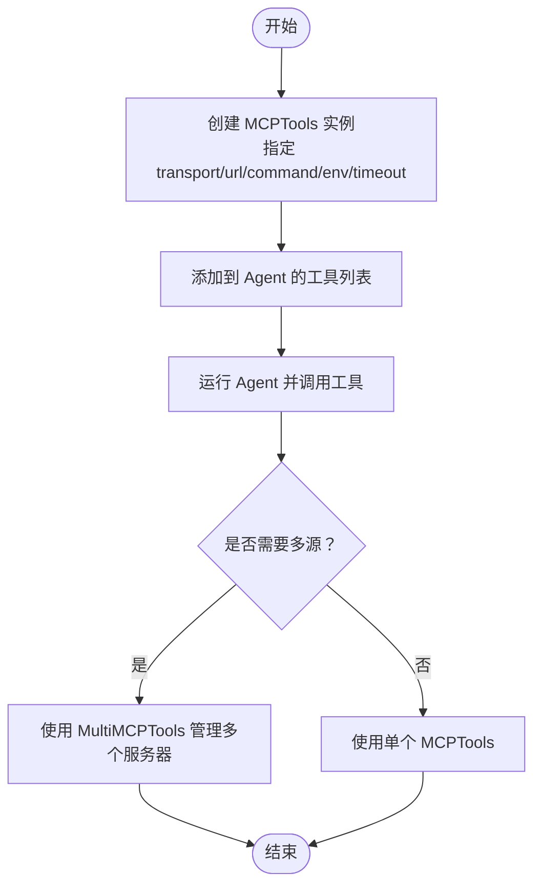
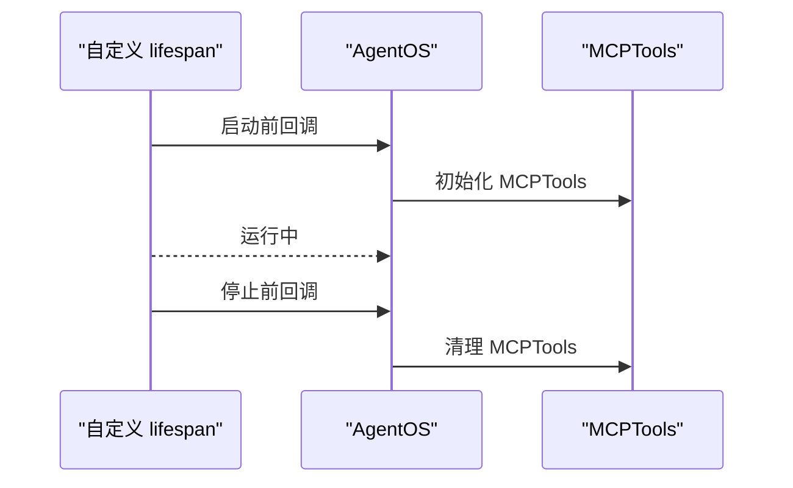
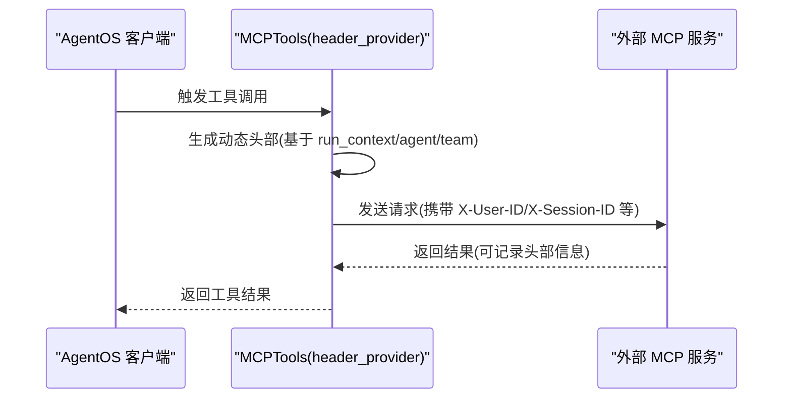
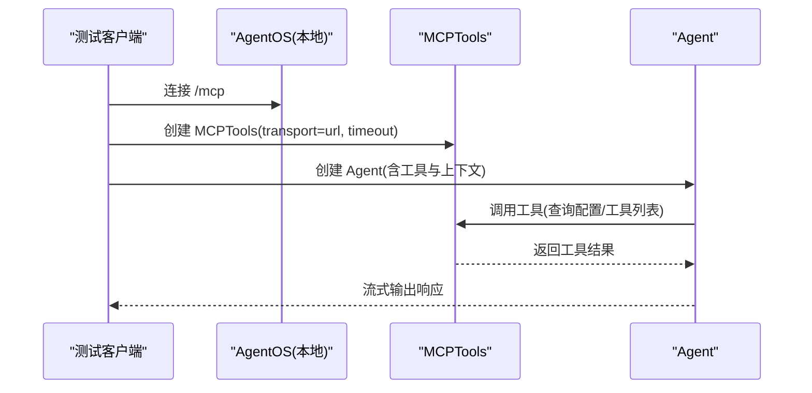
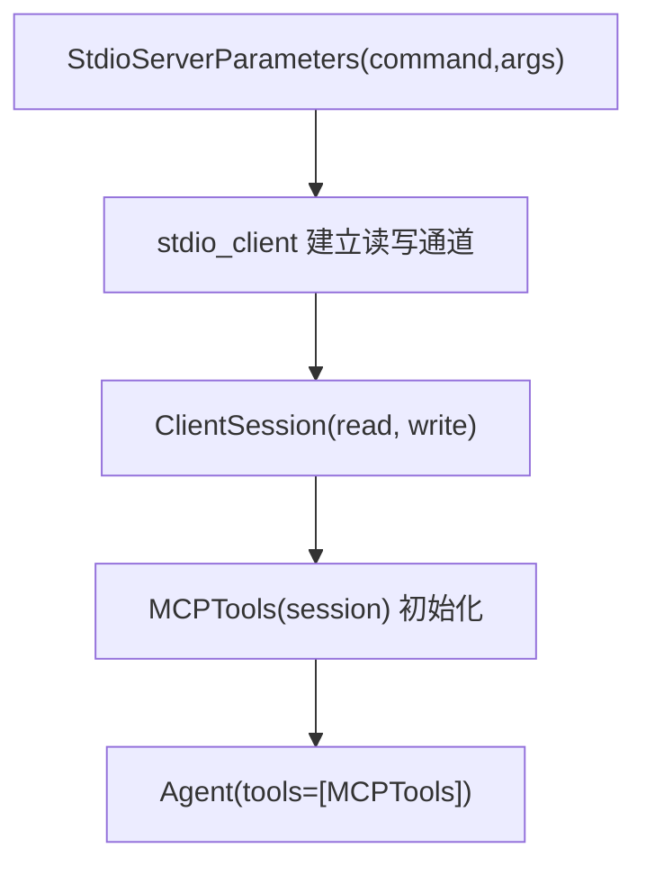
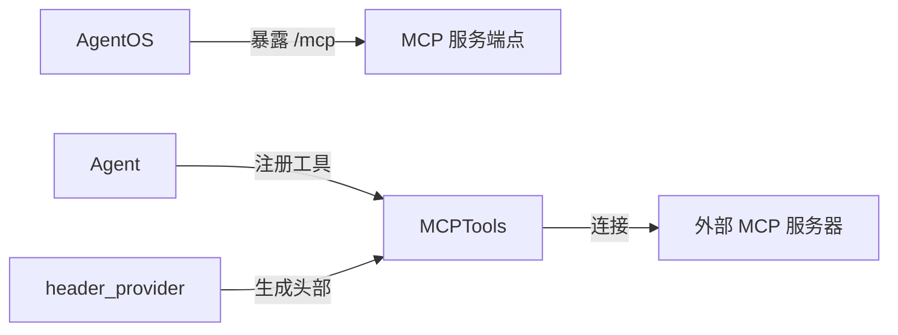

# MCP 演示

<cite>
**本文引用的文件**
- [README.md](file://cookbook/05_agent_os/mcp_demo/README.md)
- [enable_mcp_example.py](file://cookbook/05_agent_os/mcp_demo/enable_mcp_example.py)
- [mcp_tools_example.py](file://cookbook/05_agent_os/mcp_demo/mcp_tools_example.py)
- [mcp_tools_advanced_example.py](file://cookbook/05_agent_os/mcp_demo/mcp_tools_advanced_example.py)
- [mcp_tools_existing_lifespan.py](file://cookbook/05_agent_os/mcp_demo/mcp_tools_existing_lifespan.py)
- [test_client.py](file://cookbook/05_agent_os/mcp_demo/test_client.py)
- [dynamic_headers/README.md](file://cookbook/05_agent_os/mcp_demo/dynamic_headers/README.md)
- [client.py](file://cookbook/05_agent_os/mcp_demo/dynamic_headers/client.py)
- [server.py](file://cookbook/05_agent_os/mcp_demo/dynamic_headers/server.py)
- [mcp_tools.py](file://cookbook/91_tools/mcp_tools.py)
- [test_mcp_routes.py](file://libs/agno/tests/system/tests/test_mcp_routes.py)
</cite>

## 目录
1. [简介](#简介)
2. [项目结构](#项目结构)
3. [核心组件](#核心组件)
4. [架构总览](#架构总览)
5. [详细组件分析](#详细组件分析)
6. [依赖关系分析](#依赖关系分析)
7. [性能考虑](#性能考虑)
8. [故障排查指南](#故障排查指南)
9. [结论](#结论)
10. [附录](#附录)

## 简介
本文件面向 AgentOS 的 MCP（Model Context Protocol）演示与实践，系统性讲解如何在 AgentOS 中启用与配置 MCP 支持，如何注册与使用 MCP 工具，如何进行会话管理与动态头部传递，以及如何进行客户端测试与协议通信。文档覆盖从基础 MCP 工具到高级多源工具集成，再到现有生命周期集成与动态头部处理的完整路径，并提供可直接定位到源码的参考路径，便于读者快速上手与扩展。

## 项目结构
MCP 演示位于 cookbook/05_agent_os/mcp_demo 目录下，包含以下关键文件：
- 启用 MCP 的应用示例：enable_mcp_example.py
- 使用 MCPTools 的基础示例：mcp_tools_example.py
- 使用 MCPTools 的高级示例（多源、命令行启动、超时等）：mcp_tools_advanced_example.py
- 在已有生命周期中集成 MCP：mcp_tools_existing_lifespan.py
- 测试客户端（连接 AgentOS 的 MCP 服务并调用工具）：test_client.py
- 动态头部处理示例：dynamic_headers 子目录下的 client.py 与 server.py，以及其说明文档

图表来源
- [enable_mcp_example.py:35-40](file://cookbook/05_agent_os/mcp_demo/enable_mcp_example.py#L35-L40)
- [mcp_tools_example.py:20-32](file://cookbook/05_agent_os/mcp_demo/mcp_tools_example.py#L20-L32)
- [mcp_tools_advanced_example.py:22-52](file://cookbook/05_agent_os/mcp_demo/mcp_tools_advanced_example.py#L22-L52)
- [mcp_tools_existing_lifespan.py:25-52](file://cookbook/05_agent_os/mcp_demo/mcp_tools_existing_lifespan.py#L25-L52)
- [test_client.py:27-50](file://cookbook/05_agent_os/mcp_demo/test_client.py#L27-L50)
- [client.py:57-86](file://cookbook/05_agent_os/mcp_demo/dynamic_headers/client.py#L57-L86)
- [server.py:15-35](file://cookbook/05_agent_os/mcp_demo/dynamic_headers/server.py#L15-L35)

章节来源
- [README.md:1-16](file://cookbook/05_agent_os/mcp_demo/README.md#L1-L16)

## 核心组件
- AgentOS 集成 MCP 服务：通过设置 enable_mcp_server=True，AgentOS 将暴露一个 LLM 友好的 MCP 服务端点，供外部 MCP 客户端连接与调用。
- MCPTools 工具：封装 MCP 客户端会话，支持 streamable-http 传输与 stdio 传输；可传入 URL 或命令行参数启动外部 MCP 服务器；支持超时与环境变量注入。
- 生命周期管理：AgentOS 可接管 MCPTools 的生命周期，也可与自定义 lifespan 上下文结合，确保资源正确初始化与释放。
- 动态头部传递：通过 header_provider 回调函数，将用户 ID、会话 ID、代理名称、团队名称等上下文信息作为 HTTP 头部发送至外部 MCP 服务器，实现细粒度的访问控制与审计。
- 测试客户端：提供独立脚本，连接已启用 MCP 的 AgentOS，查询配置、调用工具、管理记忆与会话状态。

章节来源
- [enable_mcp_example.py:35-40](file://cookbook/05_agent_os/mcp_demo/enable_mcp_example.py#L35-L40)
- [mcp_tools_example.py:20-32](file://cookbook/05_agent_os/mcp_demo/mcp_tools_example.py#L20-L32)
- [mcp_tools_advanced_example.py:22-52](file://cookbook/05_agent_os/mcp_demo/mcp_tools_advanced_example.py#L22-L52)
- [mcp_tools_existing_lifespan.py:40-52](file://cookbook/05_agent_os/mcp_demo/mcp_tools_existing_lifespan.py#L40-L52)
- [client.py:36-52](file://cookbook/05_agent_os/mcp_demo/dynamic_headers/client.py#L36-L52)
- [test_client.py:27-50](file://cookbook/05_agent_os/mcp_demo/test_client.py#L27-L50)

## 架构总览
下图展示了 AgentOS 与 MCP 工具及外部 MCP 服务器之间的交互关系，以及动态头部在请求链路中的传递位置。

图表来源
- [enable_mcp_example.py:35-40](file://cookbook/05_agent_os/mcp_demo/enable_mcp_example.py#L35-L40)
- [mcp_tools_example.py:20-32](file://cookbook/05_agent_os/mcp_demo/mcp_tools_example.py#L20-L32)
- [mcp_tools_advanced_example.py:22-52](file://cookbook/05_agent_os/mcp_demo/mcp_tools_advanced_example.py#L22-L52)
- [server.py:15-35](file://cookbook/05_agent_os/mcp_demo/dynamic_headers/server.py#L15-L35)

## 详细组件分析

### 组件一：启用 MCP 的 AgentOS 应用
- 目标：在 AgentOS 中开启 MCP 服务端点，使外部 MCP 客户端可连接并调用工具。
- 关键点：
  - 通过 AgentOS 构造函数设置 enable_mcp_server=True。
  - 提供 SQLite 数据库、Claude 模型、WebSearch 工具等基础能力。
  - 通过 serve(app="...") 启动服务，默认可在 http://localhost:7777/mcp 访问 MCP 服务端点。

图表来源
- [enable_mcp_example.py:35-56](file://cookbook/05_agent_os/mcp_demo/enable_mcp_example.py#L35-L56)

章节来源
- [enable_mcp_example.py:35-56](file://cookbook/05_agent_os/mcp_demo/enable_mcp_example.py#L35-L56)

### 组件二：基础 MCP 工具使用
- 目标：在 Agent 中注册 MCPTools，使用 streamable-http 传输方式连接外部 MCP 服务器。
- 关键点：
  - MCPTools(transport="streamable-http", url="...")。
  - AgentOS 自动管理 MCPTools 生命周期，无需手动关闭。
  - 支持历史上下文、会话摘要、Markdown 输出等增强能力。

图表来源
- [mcp_tools_example.py:20-32](file://cookbook/05_agent_os/mcp_demo/mcp_tools_example.py#L20-L32)

章节来源
- [mcp_tools_example.py:20-32](file://cookbook/05_agent_os/mcp_demo/mcp_tools_example.py#L20-L32)

### 组件三：高级 MCP 工具与多源集成
- 目标：同时连接多个 MCP 服务器（如 Agno 文档站与 Brave Search），并通过命令行启动本地 MCP 服务器。
- 关键点：
  - 支持 command 参数与 env 注入，适合本地或第三方 MCP 服务器。
  - 支持 timeout_seconds 控制请求超时。
  - 可使用 MultiMCPTools（注释示例）同时连接多个源。

图表来源
- [mcp_tools_advanced_example.py:22-52](file://cookbook/05_agent_os/mcp_demo/mcp_tools_advanced_example.py#L22-L52)

章节来源
- [mcp_tools_advanced_example.py:22-52](file://cookbook/05_agent_os/mcp_demo/mcp_tools_advanced_example.py#L22-L52)

### 组件四：现有生命周期集成
- 目标：在已有自定义 lifespan 中集成 MCPTools，确保应用启动与停止时正确管理 MCP 资源。
- 关键点：
  - 通过 lifespan 参数传入自定义 asynccontextmanager。
  - AgentOS 会在应用生命周期内维护 MCPTools 的连接与会话。

图表来源
- [mcp_tools_existing_lifespan.py:40-52](file://cookbook/05_agent_os/mcp_demo/mcp_tools_existing_lifespan.py#L40-L52)

章节来源
- [mcp_tools_existing_lifespan.py:40-52](file://cookbook/05_agent_os/mcp_demo/mcp_tools_existing_lifespan.py#L40-L52)

### 组件五：动态头部处理
- 目标：将用户上下文（用户 ID、会话 ID）、代理名称、团队名称等信息作为 HTTP 头部传递给外部 MCP 服务器，实现细粒度的权限控制与审计。
- 关键点：
  - header_provider 接收 run_context、agent、team，返回字典形式的头部。
  - MCPTools 构造时传入 header_provider，每次请求自动附加动态头部。
  - 服务端可通过 FastMCP 的依赖注入获取 HTTP 请求头并记录日志。

图表来源
- [client.py:36-61](file://cookbook/05_agent_os/mcp_demo/dynamic_headers/client.py#L36-L61)
- [server.py:18-35](file://cookbook/05_agent_os/mcp_demo/dynamic_headers/server.py#L18-L35)

章节来源
- [dynamic_headers/README.md:1-13](file://cookbook/05_agent_os/mcp_demo/dynamic_headers/README.md#L1-L13)
- [client.py:36-61](file://cookbook/05_agent_os/mcp_demo/dynamic_headers/client.py#L36-L61)
- [server.py:18-35](file://cookbook/05_agent_os/mcp_demo/dynamic_headers/server.py#L18-L35)

### 组件六：MCP 客户端测试
- 目标：连接已启用 MCP 的 AgentOS，查询配置、调用工具、管理记忆与会话状态。
- 关键点：
  - 使用 async with MCPTools(...) as mcp_tools 管理生命周期。
  - 设置 user_id、session_id、add_session_state_to_context、add_history_to_context 等上下文增强选项。
  - 通过 agent.aprint_response(...) 执行任务并流式输出。

图表来源
- [test_client.py:27-50](file://cookbook/05_agent_os/mcp_demo/test_client.py#L27-L50)

章节来源
- [test_client.py:27-50](file://cookbook/05_agent_os/mcp_demo/test_client.py#L27-L50)

### 组件七：MCP 工具实现与 stdio 传输
- 目标：展示如何通过 stdio 与 MCP 服务器建立连接，适用于本地命令行启动的 MCP 服务器。
- 关键点：
  - 使用 StdioServerParameters(command, args) 启动服务器进程。
  - 通过 stdio_client 建立读写通道，再创建 ClientSession。
  - 初始化 MCPTools 并将其注入 Agent。

图表来源
- [mcp_tools.py:22-44](file://cookbook/91_tools/mcp_tools.py#L22-L44)

章节来源
- [mcp_tools.py:22-44](file://cookbook/91_tools/mcp_tools.py#L22-L44)

## 依赖关系分析
- AgentOS 与 MCP 工具的耦合度低：AgentOS 仅负责暴露 MCP 服务端点，MCPTools 负责与外部 MCP 服务器通信。
- 生命周期解耦：AgentOS 可接管 MCPTools 生命周期，也可与自定义 lifespan 结合，避免资源泄漏。
- 动态头部与上下文：header_provider 将 run_context、agent、team 的信息转化为 HTTP 头部，降低外部服务器对 AgentOS 内部状态的耦合。

图表来源
- [enable_mcp_example.py:35-40](file://cookbook/05_agent_os/mcp_demo/enable_mcp_example.py#L35-L40)
- [mcp_tools_example.py:20-32](file://cookbook/05_agent_os/mcp_demo/mcp_tools_example.py#L20-L32)
- [client.py:36-61](file://cookbook/05_agent_os/mcp_demo/dynamic_headers/client.py#L36-L61)

章节来源
- [enable_mcp_example.py:35-40](file://cookbook/05_agent_os/mcp_demo/enable_mcp_example.py#L35-L40)
- [mcp_tools_example.py:20-32](file://cookbook/05_agent_os/mcp_demo/mcp_tools_example.py#L20-L32)
- [client.py:36-61](file://cookbook/05_agent_os/mcp_demo/dynamic_headers/client.py#L36-L61)

## 性能考虑
- 传输方式选择：streamable-http 为现代标准，延迟更低、更易扩展；stdio 适合本地开发与简单场景。
- 超时控制：通过 timeout_seconds 控制请求超时，避免阻塞；在高并发场景下建议合理设置。
- 生命周期管理：使用 async with 或 AgentOS 的生命周期管理，确保连接复用与资源回收，减少重复握手开销。
- 动态头部最小化：仅传递必要字段，避免头部过大影响网络传输效率。

## 故障排查指南
- 无法连接 MCP 服务端点
  - 确认 AgentOS 已启用 enable_mcp_server=True，且服务正常启动。
  - 检查端口占用与防火墙设置。
- 工具调用失败或超时
  - 检查 transport/url/command/env 配置是否正确。
  - 调整 timeout_seconds 并观察外部服务器日志。
- 动态头部未生效
  - 确认 header_provider 返回的键名与外部服务器期望一致（大小写敏感）。
  - 在外部服务器侧验证请求头是否被正确接收与解析。
- 客户端测试异常
  - 使用独立测试脚本连接本地 AgentOS，逐步验证工具发现与调用流程。
  - 查看系统级 MCP 测试用例，确认网关与远程服务器可用性。

章节来源
- [test_mcp_routes.py:1-50](file://libs/agno/tests/system/tests/test_mcp_routes.py#L1-L50)
- [test_client.py:27-50](file://cookbook/05_agent_os/mcp_demo/test_client.py#L27-L50)

## 结论
通过本演示，您可以在 AgentOS 中无缝启用 MCP 服务端点，注册并使用 MCP 工具，实现与外部 MCP 服务器的稳定通信。配合动态头部与生命周期管理，您可以构建具备细粒度上下文感知与安全控制的智能代理系统。建议在生产环境中优先采用 streamable-http 传输与合理的超时策略，并结合系统测试用例持续验证 MCP 集成的可靠性。

## 附录
- 快速开始
  - 启用 MCP 的应用示例：[enable_mcp_example.py:35-56](file://cookbook/05_agent_os/mcp_demo/enable_mcp_example.py#L35-L56)
  - 基础 MCP 工具示例：[mcp_tools_example.py:20-32](file://cookbook/05_agent_os/mcp_demo/mcp_tools_example.py#L20-L32)
  - 高级 MCP 工具示例：[mcp_tools_advanced_example.py:22-52](file://cookbook/05_agent_os/mcp_demo/mcp_tools_advanced_example.py#L22-L52)
  - 现有生命周期集成：[mcp_tools_existing_lifespan.py:40-52](file://cookbook/05_agent_os/mcp_demo/mcp_tools_existing_lifespan.py#L40-L52)
  - 动态头部示例：[client.py:36-61](file://cookbook/05_agent_os/mcp_demo/dynamic_headers/client.py#L36-L61)、[server.py:18-35](file://cookbook/05_agent_os/mcp_demo/dynamic_headers/server.py#L18-L35)
  - MCP 客户端测试：[test_client.py:27-50](file://cookbook/05_agent_os/mcp_demo/test_client.py#L27-L50)
  - stdio 传输示例：[mcp_tools.py:22-44](file://cookbook/91_tools/mcp_tools.py#L22-L44)
  - 系统级 MCP 路由测试：[test_mcp_routes.py:1-50](file://libs/agno/tests/system/tests/test_mcp_routes.py#L1-L50)