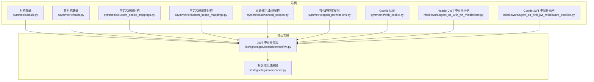
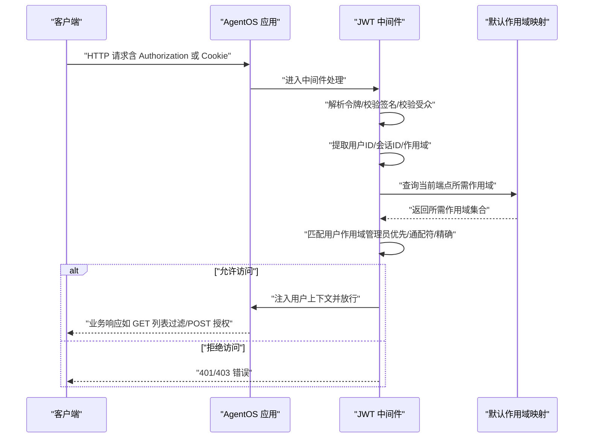
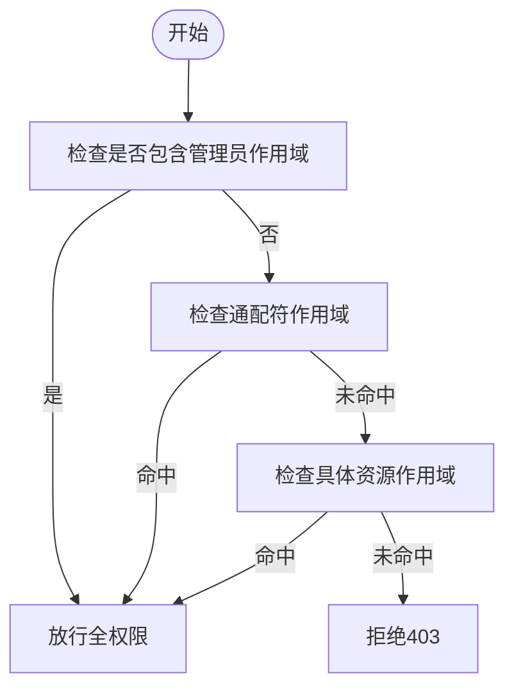
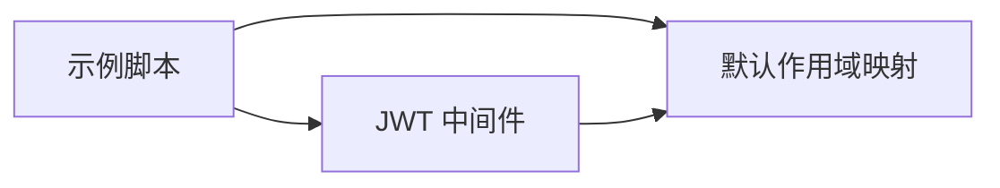

# RBAC 系统

<cite>
**本文引用的文件**
- [RBAC 总览与默认映射](file://cookbook/05_agent_os/rbac/README.md)
- [对称密钥基础示例](file://cookbook/05_agent_os/rbac/symmetric/basic.py)
- [非对称密钥基础示例](file://cookbook/05_agent_os/rbac/asymmetric/basic.py)
- [自定义作用域映射（对称）](file://cookbook/05_agent_os/rbac/symmetric/custom_scope_mappings.py)
- [自定义作用域映射（非对称）](file://cookbook/05_agent_os/rbac/asymmetric/custom_scope_mappings.py)
- [高级作用域与通配符示例](file://cookbook/05_agent_os/rbac/symmetric/advanced_scopes.py)
- [按代理粒度权限示例](file://cookbook/05_agent_os/rbac/symmetric/agent_permissions.py)
- [Cookie 认证示例](file://cookbook/05_agent_os/rbac/symmetric/with_cookie.py)
- [JWT 中间件示例（Header）](file://cookbook/05_agent_os/middleware/agent_os_with_jwt_middleware.py)
- [JWT 中间件示例（Cookie）](file://cookbook/05_agent_os/middleware/agent_os_with_jwt_middleware_cookies.py)
- [JWT 中间件实现](file://libs/agno/agno/os/middleware/jwt.py)
- [默认作用域映射定义](file://libs/agno/agno/os/scopes.py)
</cite>

## 目录
1. [简介](#简介)
2. [项目结构](#项目结构)
3. [核心组件](#核心组件)
4. [架构总览](#架构总览)
5. [详细组件分析](#详细组件分析)
6. [依赖关系分析](#依赖关系分析)
7. [性能考虑](#性能考虑)
8. [故障排查指南](#故障排查指南)
9. [结论](#结论)
10. [附录](#附录)

## 简介
本文件系统化梳理 AgentOS 的基于角色的访问控制（RBAC）体系，覆盖对称与非对称签名算法、默认与自定义作用域映射、GET 列表过滤与 POST 运行授权、通配符与全局作用域、Cookie 与 Header 双模式认证等关键能力，并给出可直接定位到源码路径的示例与最佳实践。

## 项目结构
RBAC 示例集中在 cookbook/05_agent_os/rbac 下，按“对称/非对称”和“基础/高级/自定义映射/按代理权限/带 Cookie”分类组织；核心中间件与默认作用域映射位于 libs/agno/agno/os/middleware 与 libs/agno/agno/os/scopes.py。

图表来源
- [对称基础示例](file://cookbook/05_agent_os/rbac/symmetric/basic.py)
- [非对称密钥基础示例](file://cookbook/05_agent_os/rbac/asymmetric/basic.py)
- [自定义作用域映射（对称）](file://cookbook/05_agent_os/rbac/symmetric/custom_scope_mappings.py)
- [自定义作用域映射（非对称）](file://cookbook/05_agent_os/rbac/asymmetric/custom_scope_mappings.py)
- [高级作用域与通配符示例](file://cookbook/05_agent_os/rbac/symmetric/advanced_scopes.py)
- [按代理粒度权限示例](file://cookbook/05_agent_os/rbac/symmetric/agent_permissions.py)
- [Cookie 认证示例](file://cookbook/05_agent_os/rbac/symmetric/with_cookie.py)
- [JWT 中间件示例（Header）](file://cookbook/05_agent_os/middleware/agent_os_with_jwt_middleware.py)
- [JWT 中间件示例（Cookie）](file://cookbook/05_agent_os/middleware/agent_os_with_jwt_middleware_cookies.py)
- [JWT 中间件实现](file://libs/agno/agno/os/middleware/jwt.py)
- [默认作用域映射定义](file://libs/agno/agno/os/scopes.py)

章节来源
- [RBAC 总览与默认映射](file://cookbook/05_agent_os/rbac/README.md)
- [对称基础示例](file://cookbook/05_agent_os/rbac/symmetric/basic.py)
- [非对称密钥基础示例](file://cookbook/05_agent_os/rbac/asymmetric/basic.py)
- [自定义作用域映射（对称）](file://cookbook/05_agent_os/rbac/symmetric/custom_scope_mappings.py)
- [自定义作用域映射（非对称）](file://cookbook/05_agent_os/rbac/asymmetric/custom_scope_mappings.py)
- [高级作用域与通配符示例](file://cookbook/05_agent_os/rbac/symmetric/advanced_scopes.py)
- [按代理粒度权限示例](file://cookbook/05_agent_os/rbac/symmetric/agent_permissions.py)
- [Cookie 认证示例](file://cookbook/05_agent_os/rbac/symmetric/with_cookie.py)
- [JWT 中间件示例（Header）](file://cookbook/05_agent_os/middleware/agent_os_with_jwt_middleware.py)
- [JWT 中间件示例（Cookie）](file://cookbook/05_agent_os/middleware/agent_os_with_jwt_middleware_cookies.py)
- [JWT 中间件实现](file://libs/agno/agno/os/middleware/jwt.py)
- [默认作用域映射定义](file://libs/agno/agno/os/scopes.py)

## 核心组件
- JWT 中间件：负责令牌解析、签名验证、受众校验、作用域提取、请求状态注入、路由白名单排除、Cookie/Header 双模式读取。
- 默认作用域映射：定义各端点的最小作用域要求，支持全局资源、具体资源、通配符与管理员作用域。
- 示例应用：演示对称/非对称签名、自定义映射、通配符、按代理权限、Cookie 认证等场景。

章节来源
- [RBAC 总览与默认映射](file://cookbook/05_agent_os/rbac/README.md)
- [JWT 中间件实现](file://libs/agno/agno/os/middleware/jwt.py)
- [默认作用域映射定义](file://libs/agno/agno/os/scopes.py)

## 架构总览
下图展示了从客户端到 AgentOS 应用、再到中间件与默认作用域映射的整体流程。

图表来源
- [RBAC 总览与默认映射](file://cookbook/05_agent_os/rbac/README.md)
- [JWT 中间件实现](file://libs/agno/agno/os/middleware/jwt.py)
- [默认作用域映射定义](file://libs/agno/agno/os/scopes.py)

## 详细组件分析

### 1) 作用域格式与层级
- 管理员作用域：agent_os:admin（最高权限）
- 全局资源作用域：resource:action（如 agents:read、agents:run）
- 具体资源作用域：resource:<id>:action（如 agents:web-agent:run）
- 通配符作用域：resource:*:action（如 agents:*:run）

图表来源
- [RBAC 总览与默认映射](file://cookbook/05_agent_os/rbac/README.md)

章节来源
- [RBAC 总览与默认映射](file://cookbook/05_agent_os/rbac/README.md)

### 2) GET 列表过滤与 POST 授权
- GET 列表端点：自动按用户作用域过滤结果（如 /agents、/teams、/workflows）。
- POST 运行端点：需满足对应资源运行作用域（如 /agents/{agent_id}/runs 需 agents:run 或通配符/全局）。

章节来源
- [RBAC 总览与默认映射](file://cookbook/05_agent_os/rbac/README.md)

### 3) 对称与非对称签名模型
- 对称（HS256）：开发/测试友好，使用共享密钥；适合本地或受控环境。
- 非对称（RS256）：生产推荐，私钥签发、公钥验证；与 AgentOS 控制面对接时仅提供公钥。

章节来源
- [RBAC 总览与默认映射](file://cookbook/05_agent_os/rbac/README.md)
- [对称基础示例](file://cookbook/05_agent_os/rbac/symmetric/basic.py)
- [非对称密钥基础示例](file://cookbook/05_agent_os/rbac/asymmetric/basic.py)

### 4) 自定义作用域映射
- 支持覆盖默认映射、新增端点权限、多作用域叠加、管理员绕过。
- 示例分别演示对称与非对称两种签名方式下的自定义映射。

章节来源
- [自定义作用域映射（对称）](file://cookbook/05_agent_os/rbac/symmetric/custom_scope_mappings.py)
- [自定义作用域映射（非对称）](file://cookbook/05_agent_os/rbac/asymmetric/custom_scope_mappings.py)

### 5) 高级作用域与通配符
- 展示管理员、全局、按代理、只读、通配符运行等多层级权限组合。
- 强调受众（aud）一致性校验。

章节来源
- [高级作用域与通配符示例](file://cookbook/05_agent_os/rbac/symmetric/advanced_scopes.py)

### 6) 按代理粒度权限
- 通过具体资源作用域限制用户仅能运行指定代理，实现细粒度隔离。

章节来源
- [按代理粒度权限示例](file://cookbook/05_agent_os/rbac/symmetric/agent_permissions.py)

### 7) Cookie 认证与参数注入
- 支持从 Cookie 提取令牌，结合排除路径、Cookie 名称、声明字段等配置。
- 同时演示将 JWT 声明注入工具依赖参数的能力（用于参数注入示例，非默认 RBAC 验证）。

章节来源
- [Cookie 认证示例](file://cookbook/05_agent_os/rbac/symmetric/with_cookie.py)
- [JWT 中间件示例（Header）](file://cookbook/05_agent_os/middleware/agent_os_with_jwt_middleware.py)
- [JWT 中间件示例（Cookie）](file://cookbook/05_agent_os/middleware/agent_os_with_jwt_middleware_cookies.py)

### 8) 默认作用域映射
- 定义系统、代理、团队、工作流、会话等端点的默认作用域要求，便于开箱即用。

章节来源
- [默认作用域映射定义](file://libs/agno/agno/os/scopes.py)

## 依赖关系分析
- 示例脚本依赖 AgentOS、JWT 中间件与默认作用域映射。
- JWT 中间件负责令牌解析、签名验证、受众校验、作用域匹配与上下文注入。
- 默认作用域映射提供端点到作用域的契约。

图表来源
- [对称基础示例](file://cookbook/05_agent_os/rbac/symmetric/basic.py)
- [JWT 中间件实现](file://libs/agno/agno/os/middleware/jwt.py)
- [默认作用域映射定义](file://libs/agno/agno/os/scopes.py)

章节来源
- [对称基础示例](file://cookbook/05_agent_os/rbac/symmetric/basic.py)
- [JWT 中间件实现](file://libs/agno/agno/os/middleware/jwt.py)
- [默认作用域映射定义](file://libs/agno/agno/os/scopes.py)

## 性能考虑
- 令牌解析与签名验证成本低，主要开销在端点匹配与列表过滤。
- 建议：
  - 使用通配符减少细粒度过高带来的匹配复杂度。
  - 将管理员作用域前置判断，避免多余匹配。
  - 在高频端点启用缓存（如代理列表）以降低数据库/存储压力。

## 故障排查指南
- 401 未授权
  - 令牌缺失/过期/格式错误
  - 秘钥不正确或算法不匹配
  - 受众（aud）与 AgentOS ID 不一致
- 403 禁止访问
  - 缺少必要作用域
  - 资源不在用户作用域范围内
- 代理在 GET /agents 中不可见
  - 缺少 agents:read 或 agents:<id>:read 作用域
- 作用域未生效
  - 未开启 authorization（JWT 中间件或 AgentOS 参数）
  - 未设置正确的 verification_keys/algorithm

章节来源
- [RBAC 总览与默认映射](file://cookbook/05_agent_os/rbac/README.md)

## 结论
AgentOS 的 RBAC 通过“令牌 + 作用域 + 映射”的组合，提供了灵活且可扩展的访问控制方案。对称与非对称签名满足不同部署阶段的安全需求；默认与自定义映射兼顾易用性与定制化；通配符与管理员作用域简化了权限设计。建议在生产中采用 RS256、严格受众校验、最小权限原则与完善的审计策略。

## 附录

### A. 快速上手清单
- 启用 RBAC：在 AgentOS 或 JWT 中间件中设置 authorization=True，并配置 verification_keys 与 algorithm。
- 生成令牌：包含 sub、aud、scopes、exp 等声明。
- 测试访问：使用 curl 或 SDK 发起受保护端点请求。

章节来源
- [RBAC 总览与默认映射](file://cookbook/05_agent_os/rbac/README.md)

### B. 关键实现参考路径
- JWT 中间件实现与配置项
  - [JWT 中间件实现](file://libs/agno/agno/os/middleware/jwt.py)
- 默认作用域映射
  - [默认作用域映射定义](file://libs/agno/agno/os/scopes.py)
- 示例脚本
  - [对称基础示例](file://cookbook/05_agent_os/rbac/symmetric/basic.py)
  - [非对称密钥基础示例](file://cookbook/05_agent_os/rbac/asymmetric/basic.py)
  - [自定义作用域映射（对称）](file://cookbook/05_agent_os/rbac/symmetric/custom_scope_mappings.py)
  - [自定义作用域映射（非对称）](file://cookbook/05_agent_os/rbac/asymmetric/custom_scope_mappings.py)
  - [高级作用域与通配符示例](file://cookbook/05_agent_os/rbac/symmetric/advanced_scopes.py)
  - [按代理粒度权限示例](file://cookbook/05_agent_os/rbac/symmetric/agent_permissions.py)
  - [Cookie 认证示例](file://cookbook/05_agent_os/rbac/symmetric/with_cookie.py)
  - [JWT 中间件示例（Header）](file://cookbook/05_agent_os/middleware/agent_os_with_jwt_middleware.py)
  - [JWT 中间件示例（Cookie）](file://cookbook/05_agent_os/middleware/agent_os_with_jwt_middleware_cookies.py)