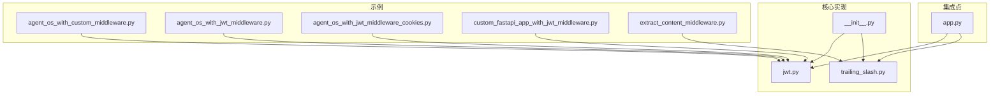
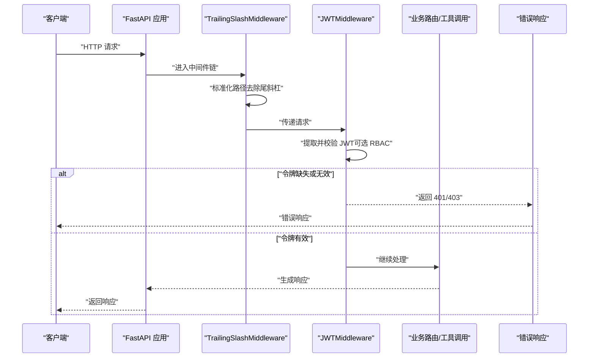
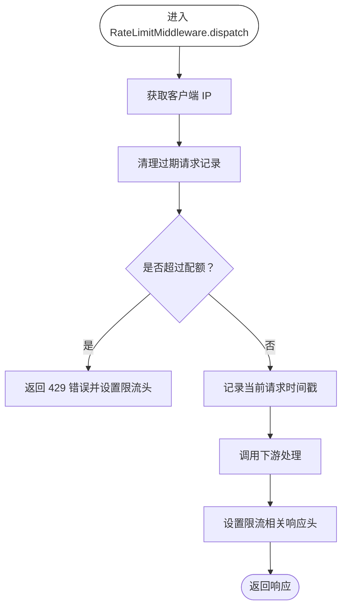
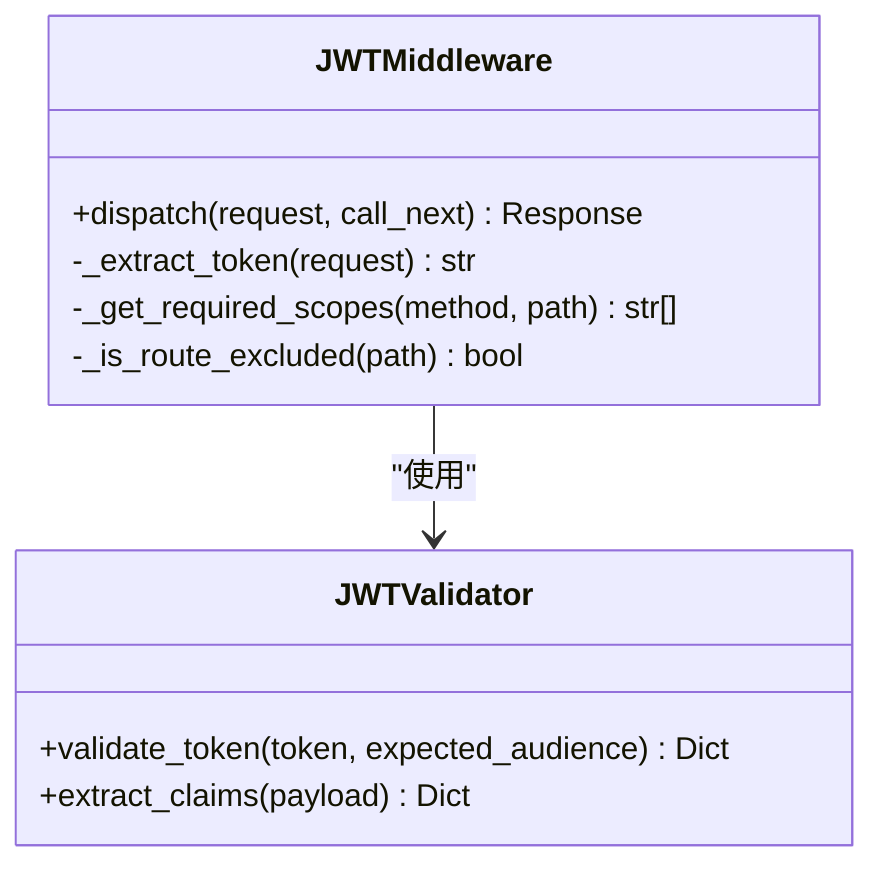
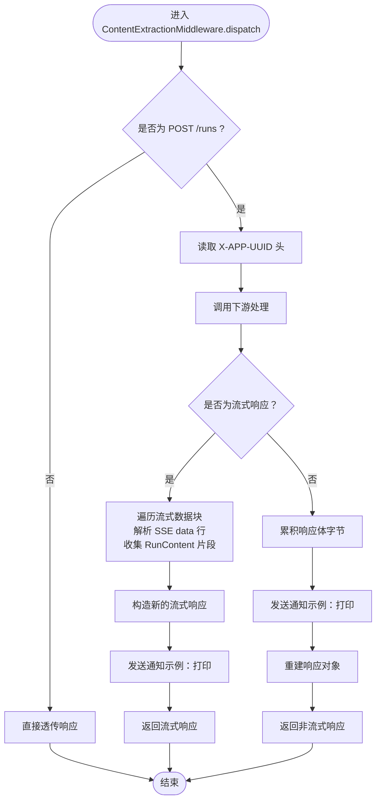
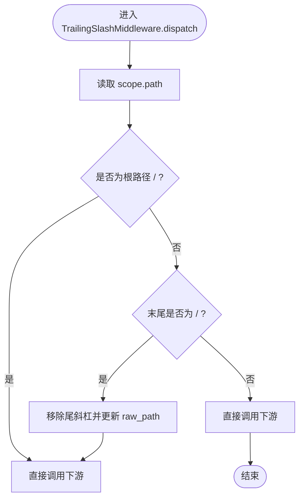
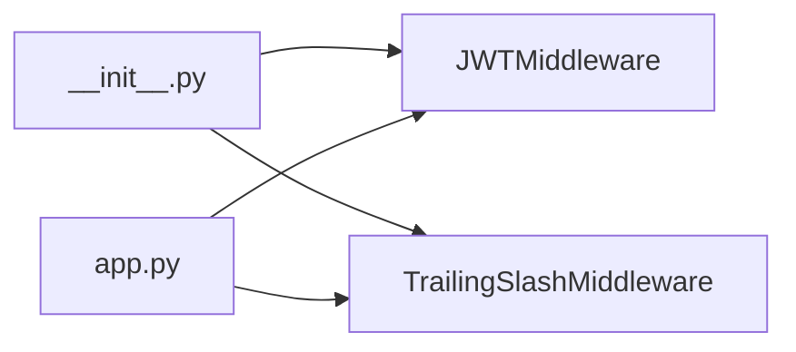

# 中间件系统

<cite>
**本文引用的文件**
- [README.md](file://cookbook/05_agent_os/middleware/README.md)
- [agent_os_with_custom_middleware.py](file://cookbook/05_agent_os/middleware/agent_os_with_custom_middleware.py)
- [agent_os_with_jwt_middleware.py](file://cookbook/05_agent_os/middleware/agent_os_with_jwt_middleware.py)
- [agent_os_with_jwt_middleware_cookies.py](file://cookbook/05_agent_os/middleware/agent_os_with_jwt_middleware_cookies.py)
- [custom_fastapi_app_with_jwt_middleware.py](file://cookbook/05_agent_os/middleware/custom_fastapi_app_with_jwt_middleware.py)
- [extract_content_middleware.py](file://cookbook/05_agent_os/middleware/extract_content_middleware.py)
- [jwt.py](file://libs/agno/agno/os/middleware/jwt.py)
- [trailing_slash.py](file://libs/agno/agno/os/middleware/trailing_slash.py)
- [__init__.py](file://libs/agno/agno/os/middleware/__init__.py)
- [app.py](file://libs/agno/agno/os/app.py)
</cite>

## 目录
1. [简介](#简介)
2. [项目结构](#项目结构)
3. [核心组件](#核心组件)
4. [架构总览](#架构总览)
5. [详细组件分析](#详细组件分析)
6. [依赖分析](#依赖分析)
7. [性能考虑](#性能考虑)
8. [故障排查指南](#故障排查指南)
9. [结论](#结论)
10. [附录](#附录)

## 简介
本文件系统性地介绍 AgentOS 的中间件体系，覆盖以下主题：
- 中间件的配置与使用：自定义中间件、JWT 中间件（支持头部与 Cookie）、内容提取中间件
- 核心功能：请求预处理、响应后处理、安全控制（认证与授权）
- 不同中间件类型的特点与适用场景
- 如何实现自定义中间件逻辑
- 中间件链管理、错误处理与性能优化
- 设计原则与最佳实践

## 项目结构
中间件相关示例与实现主要分布在如下位置：
- 示例与用法：cookbook/05_agent_os/middleware 下的多个 Python 示例文件
- 核心实现：libs/agno/agno/os/middleware 下的 jwt.py、trailing_slash.py 及其导出入口 __init__.py
- 集成点：libs/agno/agno/os/app.py 在应用初始化时自动注入中间件

**图表来源**
- [agent_os_with_custom_middleware.py:1-192](file://cookbook/05_agent_os/middleware/agent_os_with_custom_middleware.py#L1-L192)
- [agent_os_with_jwt_middleware.py:1-100](file://cookbook/05_agent_os/middleware/agent_os_with_jwt_middleware.py#L1-L100)
- [agent_os_with_jwt_middleware_cookies.py:1-155](file://cookbook/05_agent_os/middleware/agent_os_with_jwt_middleware_cookies.py#L1-L155)
- [custom_fastapi_app_with_jwt_middleware.py:1-98](file://cookbook/05_agent_os/middleware/custom_fastapi_app_with_jwt_middleware.py#L1-L98)
- [extract_content_middleware.py:1-192](file://cookbook/05_agent_os/middleware/extract_content_middleware.py#L1-L192)
- [jwt.py:1-868](file://libs/agno/agno/os/middleware/jwt.py#L1-L868)
- [trailing_slash.py:1-28](file://libs/agno/agno/os/middleware/trailing_slash.py#L1-L28)
- [__init__.py:1-32](file://libs/agno/agno/os/middleware/__init__.py#L1-L32)
- [app.py:840-886](file://libs/agno/agno/os/app.py#L840-L886)

**章节来源**
- [README.md:1-17](file://cookbook/05_agent_os/middleware/README.md#L1-L17)
- [app.py:840-886](file://libs/agno/agno/os/app.py#L840-L886)

## 核心组件
- JWT 中间件（JWTMiddleware）：负责从请求中提取并验证 JWT，将用户身份、会话与权限信息注入到请求状态；可选启用基于作用域的访问控制（RBAC），并支持多种令牌来源（头部、Cookie 或两者）。
- 去除尾斜杠中间件（TrailingSlashMiddleware）：统一路径格式，避免 /agents 与 /agents/ 被视为不同路径。
- 内容提取中间件（ContentExtractionMiddleware）：对 /runs 端点的响应进行内容抽取，支持流式与非流式响应，并在完成后发送通知。

这些组件通过 FastAPI 的中间件栈串联，形成完整的请求生命周期处理链。

**章节来源**
- [jwt.py:311-800](file://libs/agno/agno/os/middleware/jwt.py#L311-L800)
- [trailing_slash.py:6-28](file://libs/agno/agno/os/middleware/trailing_slash.py#L6-L28)
- [extract_content_middleware.py:19-108](file://cookbook/05_agent_os/middleware/extract_content_middleware.py#L19-L108)

## 架构总览
下图展示了 AgentOS 应用启动时中间件的装配流程与运行时的请求处理顺序。

**图表来源**
- [app.py:846-886](file://libs/agno/agno/os/app.py#L846-L886)
- [jwt.py:663-766](file://libs/agno/agno/os/middleware/jwt.py#L663-L766)
- [trailing_slash.py:14-27](file://libs/agno/agno/os/middleware/trailing_slash.py#L14-L27)

## 详细组件分析

### 自定义中间件：速率限制与请求日志
该示例演示了如何向 AgentOS 应用添加自定义中间件，包含两个典型用途：
- 速率限制中间件：按客户端 IP 维护时间窗口内的请求数，超过阈值返回 429 并设置限流相关响应头
- 请求/响应日志中间件：记录请求方法、路径、来源 IP、耗时与状态码，并在响应头中附加统计信息

**图表来源**
- [agent_os_with_custom_middleware.py:28-72](file://cookbook/05_agent_os/middleware/agent_os_with_custom_middleware.py#L28-L72)

**章节来源**
- [agent_os_with_custom_middleware.py:1-192](file://cookbook/05_agent_os/middleware/agent_os_with_custom_middleware.py#L1-L192)

### JWT 中间件：认证与可选授权
JWT 中间件提供以下能力：
- 令牌来源：支持从 Authorization 头部、Cookie 或两者（优先头部，再回退 Cookie）
- 令牌验证：支持对称算法（如 HS256）与非对称算法（如 RS256），可加载静态密钥或 JWKS 文件
- 声明注入：将用户 ID、会话 ID、作用域等声明写入 request.state，供后续工具与钩子使用
- 可选 RBAC：根据路径模式匹配所需作用域，执行权限校验；支持通配符与资源级作用域
- 排除路由：可配置无需鉴权/授权的路径（如健康检查、文档端点）

**图表来源**
- [jwt.py:35-310](file://libs/agno/agno/os/middleware/jwt.py#L35-L310)
- [jwt.py:311-800](file://libs/agno/agno/os/middleware/jwt.py#L311-L800)

**章节来源**
- [jwt.py:27-800](file://libs/agno/agno/os/middleware/jwt.py#L27-L800)
- [agent_os_with_jwt_middleware.py:1-100](file://cookbook/05_agent_os/middleware/agent_os_with_jwt_middleware.py#L1-L100)
- [agent_os_with_jwt_middleware_cookies.py:1-155](file://cookbook/05_agent_os/middleware/agent_os_with_jwt_middleware_cookies.py#L1-L155)
- [custom_fastapi_app_with_jwt_middleware.py:1-98](file://cookbook/05_agent_os/middleware/custom_fastapi_app_with_jwt_middleware.py#L1-L98)

### 内容提取中间件：响应体抽取与通知
该中间件用于对 /runs 端点的响应进行内容抽取，支持：
- 流式与非流式响应
- 解析 SSE 数据块，提取事件名为 RunContent 的内容片段
- 将组装后的完整内容发送至通知服务（示例中打印日志）
- 保留原始响应体与媒体类型，确保下游行为不变

**图表来源**
- [extract_content_middleware.py:28-108](file://cookbook/05_agent_os/middleware/extract_content_middleware.py#L28-L108)

**章节来源**
- [extract_content_middleware.py:1-192](file://cookbook/05_agent_os/middleware/extract_content_middleware.py#L1-L192)

### 去除尾斜杠中间件
该中间件在 ASGI 层面修改请求路径，统一 /agents 与 /agents/ 的处理，避免重定向开销。

**图表来源**
- [trailing_slash.py:14-27](file://libs/agno/agno/os/middleware/trailing_slash.py#L14-L27)

**章节来源**
- [trailing_slash.py:1-28](file://libs/agno/agno/os/middleware/trailing_slash.py#L1-L28)

## 依赖分析
- 导出与可用性：中间件模块通过 __init__.py 提供条件导入，若缺少 PyJWT，则抛出明确的安装提示
- 应用集成：AgentOS 在构建 FastAPI 应用时自动注入去尾斜杠中间件，并在开启授权时注入 JWT 中间件
- 运行时依赖：JWT 中间件依赖于作用域映射与权限校验工具，以及 CORS 允许来源以正确设置错误响应头

**图表来源**
- [__init__.py:1-32](file://libs/agno/agno/os/middleware/__init__.py#L1-L32)
- [app.py:846-886](file://libs/agno/agno/os/app.py#L846-L886)

**章节来源**
- [__init__.py:1-32](file://libs/agno/agno/os/middleware/__init__.py#L1-L32)
- [app.py:840-886](file://libs/agno/agno/os/app.py#L840-L886)

## 性能考虑
- 中间件链顺序：将高频短路逻辑（如排除路由、OPTIONS 预检）置于链前端，减少后续处理成本
- 令牌验证：优先使用 JWKS 动态密钥与缓存策略，避免重复解析；仅在必要时开启严格受众校验
- 流式响应：内容提取中间件对流式响应采用增量解析与拼接，注意内存占用与延迟平衡
- 路径规范化：去尾斜杠中间件在 ASGI 层直接修改路径，避免额外重定向与字符串处理

[本节为通用指导，不直接分析具体文件]

## 故障排查指南
- 缺少 PyJWT：若未安装 PyJWT，中间件导出会抛出 ImportError，请按提示安装相应依赖
- 令牌缺失：根据令牌来源配置，检查 Authorization 头或 Cookie 是否存在
- 令牌无效：确认算法、密钥或 JWKS 配置正确；若关闭验证仅用于开发，请谨慎设置 validate=False
- RBAC 拒绝：核对 scope_mappings 与路径模式匹配规则；确认用户作用域集合包含所需权限
- CORS 错误：检查 app.state.cors_allowed_origins 设置，确保错误响应包含必要的 CORS 头

**章节来源**
- [__init__.py:6-18](file://libs/agno/agno/os/middleware/__init__.py#L6-L18)
- [jwt.py:623-652](file://libs/agno/agno/os/middleware/jwt.py#L623-L652)
- [jwt.py:767-800](file://libs/agno/agno/os/middleware/jwt.py#L767-L800)

## 结论
AgentOS 的中间件系统通过简洁而强大的接口，将认证、授权、路径规范化与内容抽取等横切关注点整合进统一的中间件链中。开发者可以：
- 快速启用 JWT 中间件并按需开启 RBAC
- 通过自定义中间件扩展请求/响应处理能力
- 利用内容提取中间件实现运行结果的通知与归档
- 在保证安全性的同时，优化中间件链顺序与配置，提升整体性能与可观测性

[本节为总结性内容，不直接分析具体文件]

## 附录

### 使用示例与最佳实践
- 自定义中间件
  - 在 AgentOS 应用上通过 add_middleware 注册，注意中间件顺序与职责边界
  - 对于高并发场景，建议将限流与日志中间件置于链前端
  - 参考示例路径：[agent_os_with_custom_middleware.py:142-153](file://cookbook/05_agent_os/middleware/agent_os_with_custom_middleware.py#L142-L153)
- JWT 中间件
  - 选择合适的令牌来源（Authorization 头部或 Cookie），并配置排除路由
  - 生产环境务必启用令牌验证与受众校验，合理设置作用域映射
  - 参考示例路径：
    - [agent_os_with_jwt_middleware.py:61-73](file://cookbook/05_agent_os/middleware/agent_os_with_jwt_middleware.py#L61-L73)
    - [agent_os_with_jwt_middleware_cookies.py:103-117](file://cookbook/05_agent_os/middleware/agent_os_with_jwt_middleware_cookies.py#L103-L117)
    - [custom_fastapi_app_with_jwt_middleware.py:45-53](file://cookbook/05_agent_os/middleware/custom_fastapi_app_with_jwt_middleware.py#L45-L53)
- 内容提取中间件
  - 仅对特定端点（如 /runs）启用，避免对所有路由造成额外开销
  - 注意区分流式与非流式响应，确保通知在流结束后触发
  - 参考示例路径：[extract_content_middleware.py:162-163](file://cookbook/05_agent_os/middleware/extract_content_middleware.py#L162-L163)

**章节来源**
- [agent_os_with_custom_middleware.py:142-153](file://cookbook/05_agent_os/middleware/agent_os_with_custom_middleware.py#L142-L153)
- [agent_os_with_jwt_middleware.py:61-73](file://cookbook/05_agent_os/middleware/agent_os_with_jwt_middleware.py#L61-L73)
- [agent_os_with_jwt_middleware_cookies.py:103-117](file://cookbook/05_agent_os/middleware/agent_os_with_jwt_middleware_cookies.py#L103-L117)
- [custom_fastapi_app_with_jwt_middleware.py:45-53](file://cookbook/05_agent_os/middleware/custom_fastapi_app_with_jwt_middleware.py#L45-L53)
- [extract_content_middleware.py:162-163](file://cookbook/05_agent_os/middleware/extract_content_middleware.py#L162-L163)