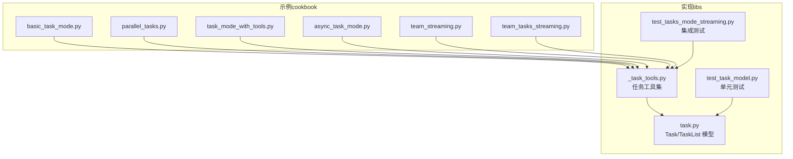
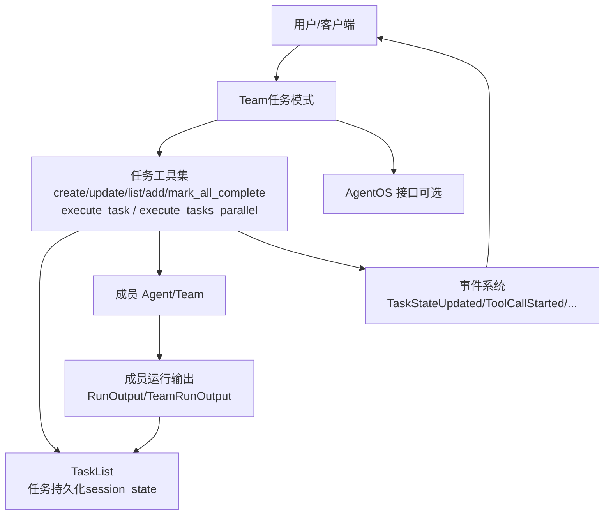
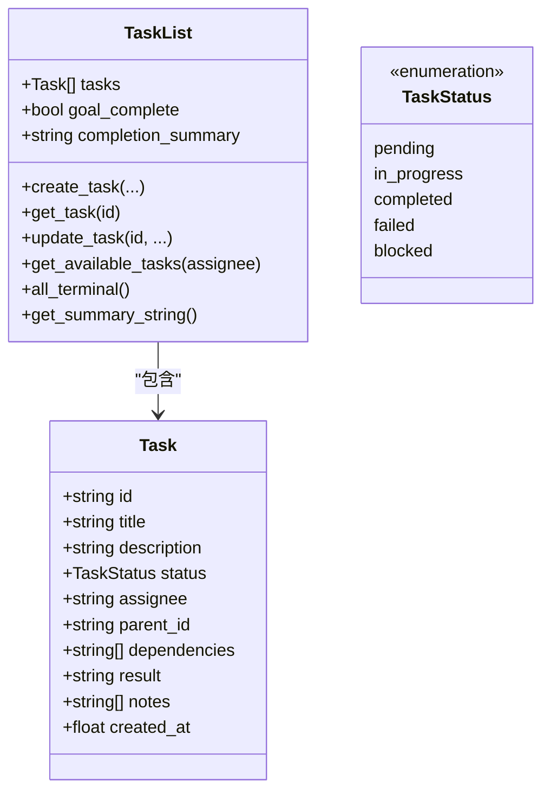
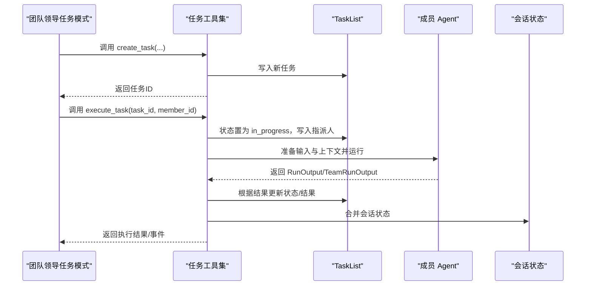
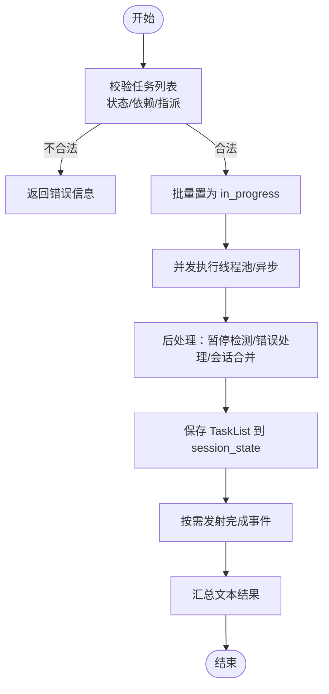
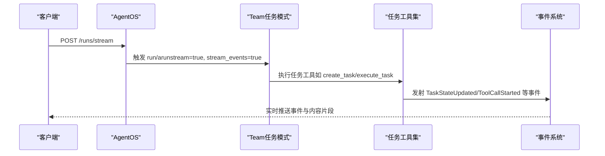
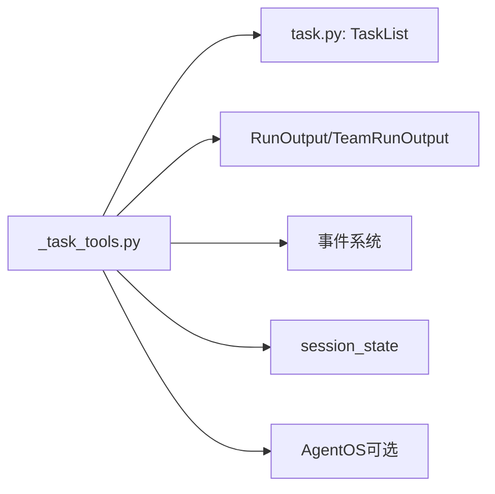

# 团队任务

<cite>
**本文引用的文件**
- [cookbook/03_teams/02_modes/tasks/04_basic_task_mode.py](file://cookbook/03_teams/02_modes/tasks/04_basic_task_mode.py)
- [cookbook/03_teams/02_modes/tasks/05_parallel_tasks.py](file://cookbook/03_teams/02_modes/tasks/05_parallel_tasks.py)
- [cookbook/03_teams/02_modes/tasks/06_task_mode_with_tools.py](file://cookbook/03_teams/02_modes/tasks/06_task_mode_with_tools.py)
- [cookbook/03_teams/02_modes/tasks/07_async_task_mode.py](file://cookbook/03_teams/02_modes/tasks/07_async_task_mode.py)
- [cookbook/03_teams/08_streaming/team_streaming.py](file://cookbook/03_teams/08_streaming/team_streaming.py)
- [libs/agno/agno/team/task.py](file://libs/agno/agno/team/task.py)
- [libs/agno/agno/team/_task_tools.py](file://libs/agno/agno/team/_task_tools.py)
- [libs/agno/tests/integration/teams/test_tasks_mode_streaming.py](file://libs/agno/tests/integration/teams/test_tasks_mode_streaming.py)
- [libs/agno/tests/unit/team/test_task_model.py](file://libs/agno/tests/unit/team/test_task_model.py)
- [cookbook/05_agent_os/team_tasks/team_tasks_streaming.py](file://cookbook/05_agent_os/team_tasks/team_tasks_streaming.py)
</cite>

## 目录
1. [引言](#引言)
2. [项目结构](#项目结构)
3. [核心组件](#核心组件)
4. [架构总览](#架构总览)
5. [详细组件分析](#详细组件分析)
6. [依赖分析](#依赖分析)
7. [性能考虑](#性能考虑)
8. [故障排查指南](#故障排查指南)
9. [结论](#结论)
10. [附录](#附录)

## 引言
本文件面向 AgentOS 团队任务系统，系统性阐述任务的创建、分配、状态跟踪与流式响应处理机制。文档覆盖任务模式（tasks）下的任务生命周期、依赖管理、并行执行、异步运行、事件流与结果汇总，并结合示例路径帮助读者快速上手。同时总结设计原则与最佳实践，指导在复杂协作场景中进行任务配置、状态管理与性能优化。

## 项目结构
围绕团队任务系统的关键文件分布于 cookbook 示例与 libs 实现层：
- 示例层：提供从基础任务到并行执行、带工具的任务、异步任务与流式输出的完整用法。
- 实现层：提供任务数据模型、任务列表与任务工具集，支撑任务模式下的自动化编排与事件驱动。

**图表来源**
- [cookbook/03_teams/02_modes/tasks/04_basic_task_mode.py:1-85](file://cookbook/03_teams/02_modes/tasks/04_basic_task_mode.py#L1-L85)
- [cookbook/03_teams/02_modes/tasks/05_parallel_tasks.py:1-81](file://cookbook/03_teams/02_modes/tasks/05_parallel_tasks.py#L1-L81)
- [cookbook/03_teams/02_modes/tasks/06_task_mode_with_tools.py:1-74](file://cookbook/03_teams/02_modes/tasks/06_task_mode_with_tools.py#L1-L74)
- [cookbook/03_teams/02_modes/tasks/07_async_task_mode.py:1-93](file://cookbook/03_teams/02_modes/tasks/07_async_task_mode.py#L1-L93)
- [cookbook/03_teams/08_streaming/team_streaming.py:1-85](file://cookbook/03_teams/08_streaming/team_streaming.py#L1-L85)
- [cookbook/05_agent_os/team_tasks/team_tasks_streaming.py:1-89](file://cookbook/05_agent_os/team_tasks/team_tasks_streaming.py#L1-L89)
- [libs/agno/agno/team/task.py:1-261](file://libs/agno/agno/team/task.py#L1-L261)
- [libs/agno/agno/team/_task_tools.py:1-1055](file://libs/agno/agno/team/_task_tools.py#L1-L1055)
- [libs/agno/tests/integration/teams/test_tasks_mode_streaming.py:1-309](file://libs/agno/tests/integration/teams/test_tasks_mode_streaming.py#L1-L309)
- [libs/agno/tests/unit/team/test_task_model.py:1-257](file://libs/agno/tests/unit/team/test_task_model.py#L1-L257)

**章节来源**
- [cookbook/03_teams/02_modes/tasks/04_basic_task_mode.py:1-85](file://cookbook/03_teams/02_modes/tasks/04_basic_task_mode.py#L1-L85)
- [cookbook/03_teams/02_modes/tasks/05_parallel_tasks.py:1-81](file://cookbook/03_teams/02_modes/tasks/05_parallel_tasks.py#L1-L81)
- [cookbook/03_teams/02_modes/tasks/06_task_mode_with_tools.py:1-74](file://cookbook/03_teams/02_modes/tasks/06_task_mode_with_tools.py#L1-L74)
- [cookbook/03_teams/02_modes/tasks/07_async_task_mode.py:1-93](file://cookbook/03_teams/02_modes/tasks/07_async_task_mode.py#L1-L93)
- [cookbook/03_teams/08_streaming/team_streaming.py:1-85](file://cookbook/03_teams/08_streaming/team_streaming.py#L1-L85)
- [cookbook/05_agent_os/team_tasks/team_tasks_streaming.py:1-89](file://cookbook/05_agent_os/team_tasks/team_tasks_streaming.py#L1-L89)
- [libs/agno/agno/team/task.py:1-261](file://libs/agno/agno/team/task.py#L1-L261)
- [libs/agno/agno/team/_task_tools.py:1-1055](file://libs/agno/agno/team/_task_tools.py#L1-L1055)
- [libs/agno/tests/integration/teams/test_tasks_mode_streaming.py:1-309](file://libs/agno/tests/integration/teams/test_tasks_mode_streaming.py#L1-L309)
- [libs/agno/tests/unit/team/test_task_model.py:1-257](file://libs/agno/tests/unit/team/test_task_model.py#L1-L257)

## 核心组件
- 任务数据模型
  - 任务状态枚举：pending、in_progress、completed、failed、blocked
  - 任务实体：包含标题、描述、指派对象、父任务、依赖、结果、备注、创建时间等字段
  - 任务列表：提供增删改查、可用任务筛选、摘要渲染、依赖满足判断、阻塞状态重算、序列化/反序列化
- 任务工具集（任务模式下由团队领导模型调用）
  - 创建任务、更新任务状态、列出任务、添加任务备注、标记全部完成
  - 同步/异步执行单个任务、并行执行多个任务
  - 事件发射：任务创建、任务更新、迭代开始/结束、运行开始/结束等
  - 会话状态合并、媒体传递、历史注入、暂停传播等后处理逻辑

**章节来源**
- [libs/agno/agno/team/task.py:12-261](file://libs/agno/agno/team/task.py#L12-L261)
- [libs/agno/agno/team/_task_tools.py:55-1055](file://libs/agno/agno/team/_task_tools.py#L55-L1055)

## 架构总览
团队任务系统以“任务模式”为核心，通过任务工具集驱动成员执行具体工作，借助事件流实现状态可视化与可观测性，支持同步与异步两种运行方式，并可接入 AgentOS 提供的 HTTP 流式接口。

**图表来源**
- [libs/agno/agno/team/_task_tools.py:55-1055](file://libs/agno/agno/team/_task_tools.py#L55-L1055)
- [libs/agno/agno/team/task.py:78-261](file://libs/agno/agno/team/task.py#L78-L261)
- [cookbook/05_agent_os/team_tasks/team_tasks_streaming.py:77-89](file://cookbook/05_agent_os/team_tasks/team_tasks_streaming.py#L77-L89)

## 详细组件分析

### 任务数据模型与任务列表
- 数据结构
  - Task：任务标识、标题、描述、状态、指派人、父任务、依赖、结果、备注、创建时间
  - TaskList：任务集合、目标完成标志、完成摘要；提供 CRUD、可用任务查询、摘要字符串生成、依赖检查与阻塞状态重算、序列化/反序列化
- 关键算法
  - 可用任务筛选：仅返回 pending 且依赖满足的任务
  - 阻塞状态判定：若任一依赖未完成或未知，则阻塞；若依赖失败则自动降级为失败
  - 终止条件：所有任务进入终止状态（completed 或 failed）
- 复杂度
  - 可用任务筛选：O(n)
  - 依赖检查：对每个任务 O(k)，k 为依赖数量
  - 阻塞状态重算：O(n·k)

**图表来源**
- [libs/agno/agno/team/task.py:22-261](file://libs/agno/agno/team/task.py#L22-L261)

**章节来源**
- [libs/agno/agno/team/task.py:22-261](file://libs/agno/agno/team/task.py#L22-L261)
- [libs/agno/tests/unit/team/test_task_model.py:83-257](file://libs/agno/tests/unit/team/test_task_model.py#L83-L257)

### 任务工具集与执行流程
- 工具清单
  - create_task：创建任务，去重校验，保存至 session_state，可选事件发射
  - update_task_status：更新任务状态（禁止手动设为 blocked），保存并可选事件发射
  - list_tasks：渲染任务摘要字符串
  - add_task_note：为任务添加备注
  - mark_all_complete：标记整体目标完成
  - execute_task / aexecute_task：同步/异步执行单任务，设置 in_progress、指派成员、准备上下文、运行成员、后处理（交互记录、会话合并、媒体更新）、根据结果更新状态
  - execute_tasks_parallel / aexecute_tasks_parallel：并行执行多个独立任务，线程池/异步并发，统一合并会话状态，按完成顺序产出事件与文本汇总
- 事件与日志
  - 通过事件管道发射任务创建/更新事件，便于外部观察
  - 使用团队与代理日志器区分上下文
- 人类在环（HITL）
  - 若成员运行被暂停，传播暂停状态，任务回退为 pending，等待后续恢复

**图表来源**
- [libs/agno/agno/team/_task_tools.py:141-504](file://libs/agno/agno/team/_task_tools.py#L141-L504)

**章节来源**
- [libs/agno/agno/team/_task_tools.py:55-1055](file://libs/agno/agno/team/_task_tools.py#L55-L1055)

### 并行任务执行与依赖管理
- 并行策略
  - execute_tasks_parallel：验证所有任务可执行且无阻塞，批量置 in_progress，使用线程池并发执行，完成后统一合并会话状态，按序产出事件与文本汇总
  - aexecute_tasks_parallel：异步版本，使用 asyncio.gather 并发执行
- 依赖一致性
  - 任务必须处于 pending/in_progress，且 assignee 存在，依赖均已完成
  - 任一子任务失败将被记录为 failed，并在最终汇总中体现

**图表来源**
- [libs/agno/agno/team/_task_tools.py:649-842](file://libs/agno/agno/team/_task_tools.py#L649-L842)
- [libs/agno/agno/team/_task_tools.py:847-1033](file://libs/agno/agno/team/_task_tools.py#L847-L1033)

**章节来源**
- [libs/agno/agno/team/_task_tools.py:649-1033](file://libs/agno/agno/team/_task_tools.py#L649-L1033)

### 流式响应与事件流
- 同步/异步流式
  - 支持在任务模式下开启 stream=True 与 stream_events=True，实时产出内容事件与任务状态事件
  - 集成测试覆盖了迭代事件、任务状态更新事件、工具调用事件与运行内容事件
- AgentOS 流式接口
  - 将团队暴露为 HTTP 服务，支持流式请求端点，便于外部系统消费

**图表来源**
- [libs/agno/tests/integration/teams/test_tasks_mode_streaming.py:68-183](file://libs/agno/tests/integration/teams/test_tasks_mode_streaming.py#L68-L183)
- [cookbook/05_agent_os/team_tasks/team_tasks_streaming.py:9-13](file://cookbook/05_agent_os/team_tasks/team_tasks_streaming.py#L9-L13)

**章节来源**
- [libs/agno/tests/integration/teams/test_tasks_mode_streaming.py:1-309](file://libs/agno/tests/integration/teams/test_tasks_mode_streaming.py#L1-L309)
- [cookbook/03_teams/08_streaming/team_streaming.py:1-85](file://cookbook/03_teams/08_streaming/team_streaming.py#L1-L85)
- [cookbook/05_agent_os/team_tasks/team_tasks_streaming.py:1-89](file://cookbook/05_agent_os/team_tasks/team_tasks_streaming.py#L1-L89)

### 示例用法与最佳实践
- 基础任务模式
  - 展示团队领导自动拆解任务、分配给合适成员、收集结果并给出最终摘要
  - 示例路径：[cookbook/03_teams/02_modes/tasks/04_basic_task_mode.py:1-85](file://cookbook/03_teams/02_modes/tasks/04_basic_task_mode.py#L1-L85)
- 并行任务执行
  - 当任务相互独立时，优先使用并行执行以提升吞吐
  - 示例路径：[cookbook/03_teams/02_modes/tasks/05_parallel_tasks.py:1-81](file://cookbook/03_teams/02_modes/tasks/05_parallel_tasks.py#L1-L81)
- 带工具的任务
  - 成员具备真实工具（如网络搜索）时，合理设置任务依赖顺序，确保下游在上游完成后执行
  - 示例路径：[cookbook/03_teams/02_modes/tasks/06_task_mode_with_tools.py:1-74](file://cookbook/03_teams/02_modes/tasks/06_task_mode_with_tools.py#L1-L74)
- 异步任务模式
  - 适用于需要非阻塞执行的场景（如 Web 服务）
  - 示例路径：[cookbook/03_teams/02_modes/tasks/07_async_task_mode.py:1-93](file://cookbook/03_teams/02_modes/tasks/07_async_task_mode.py#L1-L93)
- 流式输出
  - 同步/异步均可开启流式输出，便于前端实时展示
  - 示例路径：[cookbook/03_teams/08_streaming/team_streaming.py:1-85](file://cookbook/03_teams/08_streaming/team_streaming.py#L1-L85)

**章节来源**
- [cookbook/03_teams/02_modes/tasks/04_basic_task_mode.py:1-85](file://cookbook/03_teams/02_modes/tasks/04_basic_task_mode.py#L1-L85)
- [cookbook/03_teams/02_modes/tasks/05_parallel_tasks.py:1-81](file://cookbook/03_teams/02_modes/tasks/05_parallel_tasks.py#L1-L81)
- [cookbook/03_teams/02_modes/tasks/06_task_mode_with_tools.py:1-74](file://cookbook/03_teams/02_modes/tasks/06_task_mode_with_tools.py#L1-L74)
- [cookbook/03_teams/02_modes/tasks/07_async_task_mode.py:1-93](file://cookbook/03_teams/02_modes/tasks/07_async_task_mode.py#L1-L93)
- [cookbook/03_teams/08_streaming/team_streaming.py:1-85](file://cookbook/03_teams/08_streaming/team_streaming.py#L1-L85)

## 依赖分析
- 组件耦合
  - 任务工具集紧耦合 TaskList 与 session_state，负责任务状态变更与持久化
  - 与成员运行输出（RunOutput/TeamRunOutput）强关联，用于结果回填与状态更新
  - 事件系统贯穿执行链路，保证可观测性
- 外部依赖
  - AgentOS：提供 HTTP 流式接口，便于外部系统消费
  - 测试：集成测试覆盖事件流与异步行为，保障稳定性

**图表来源**
- [libs/agno/agno/team/_task_tools.py:1-1055](file://libs/agno/agno/team/_task_tools.py#L1-L1055)
- [libs/agno/agno/team/task.py:1-261](file://libs/agno/agno/team/task.py#L1-L261)
- [cookbook/05_agent_os/team_tasks/team_tasks_streaming.py:77-89](file://cookbook/05_agent_os/team_tasks/team_tasks_streaming.py#L77-L89)

**章节来源**
- [libs/agno/agno/team/_task_tools.py:1-1055](file://libs/agno/agno/team/_task_tools.py#L1-L1055)
- [libs/agno/agno/team/task.py:1-261](file://libs/agno/agno/team/task.py#L1-L261)
- [libs/agno/tests/integration/teams/test_tasks_mode_streaming.py:1-309](file://libs/agno/tests/integration/teams/test_tasks_mode_streaming.py#L1-L309)

## 性能考虑
- 并行执行
  - 对独立任务采用线程池/异步并发，显著缩短总耗时；注意资源上限与线程数控制
- 会话状态合并
  - 并行场景下统一合并修改后的 session_state，避免竞态；建议限制一次性合并规模
- 事件发射
  - 开启 stream_events 会增加事件量，生产环境可根据需要选择性启用
- 日志与调试
  - 在调试模式下可获得更细粒度日志，但会影响性能；建议按需开启

[本节为通用指导，无需特定文件引用]

## 故障排查指南
- 任务无法执行
  - 检查任务状态是否为 pending/in_progress；确认依赖是否全部完成；核对指派成员是否存在
  - 参考：[libs/agno/agno/team/_task_tools.py:366-504](file://libs/agno/agno/team/_task_tools.py#L366-L504)
- 任务被阻塞
  - 若依赖未完成或未知，任务将被标记为 blocked；依赖失败会导致自动降级为 failed
  - 参考：[libs/agno/agno/team/task.py:184-223](file://libs/agno/agno/team/task.py#L184-L223)
- 人类在环（HITL）暂停
  - 成员运行被暂停时，任务回退为 pending，需人工介入后重试
  - 参考：[libs/agno/agno/team/_task_tools.py:468-476](file://libs/agno/agno/team/_task_tools.py#L468-L476)
- 事件缺失或异常
  - 确认已开启 stream_events；检查事件类型（如 TaskStateUpdated、ToolCallStarted）是否正确接收
  - 参考：[libs/agno/tests/integration/teams/test_tasks_mode_streaming.py:68-183](file://libs/agno/tests/integration/teams/test_tasks_mode_streaming.py#L68-L183)
- AgentOS 流式接口
  - 确认服务已启动并监听端口；使用 curl 或 SDK 调用 /runs/stream 端点
  - 参考：[cookbook/05_agent_os/team_tasks/team_tasks_streaming.py:87-89](file://cookbook/05_agent_os/team_tasks/team_tasks_streaming.py#L87-L89)

**章节来源**
- [libs/agno/agno/team/_task_tools.py:366-504](file://libs/agno/agno/team/_task_tools.py#L366-L504)
- [libs/agno/agno/team/task.py:184-223](file://libs/agno/agno/team/task.py#L184-L223)
- [libs/agno/tests/integration/teams/test_tasks_mode_streaming.py:68-183](file://libs/agno/tests/integration/teams/test_tasks_mode_streaming.py#L68-L183)
- [cookbook/05_agent_os/team_tasks/team_tasks_streaming.py:87-89](file://cookbook/05_agent_os/team_tasks/team_tasks_streaming.py#L87-L89)

## 结论
团队任务系统通过明确的任务数据模型、完善的任务工具集与事件驱动的可观测性，实现了从任务创建、依赖管理、并发执行到结果汇总的全链路自动化。配合同步/异步与流式输出能力，既满足交互式体验，也适合在服务端非阻塞场景部署。遵循依赖先行、并行优先、事件可观测与会话状态安全合并的原则，可在复杂协作中稳定高效地推进任务交付。

[本节为总结性内容，无需特定文件引用]

## 附录
- 快速上手清单
  - 定义成员与角色，创建团队并启用任务模式
  - 使用 create_task 创建初始任务，必要时设置依赖
  - 通过 execute_task 或 execute_tasks_parallel 分配并执行任务
  - 使用 list_tasks 查看当前状态，使用 add_task_note 记录进展
  - 任务完成后调用 mark_all_complete 汇总结果
  - 如需流式体验，开启 stream=True 与 stream_events=True；或通过 AgentOS 暴露 HTTP 接口
- 相关示例路径
  - 基础任务模式：[cookbook/03_teams/02_modes/tasks/04_basic_task_mode.py:1-85](file://cookbook/03_teams/02_modes/tasks/04_basic_task_mode.py#L1-L85)
  - 并行任务执行：[cookbook/03_teams/02_modes/tasks/05_parallel_tasks.py:1-81](file://cookbook/03_teams/02_modes/tasks/05_parallel_tasks.py#L1-L81)
  - 带工具的任务：[cookbook/03_teams/02_modes/tasks/06_task_mode_with_tools.py:1-74](file://cookbook/03_teams/02_modes/tasks/06_task_mode_with_tools.py#L1-L74)
  - 异步任务模式：[cookbook/03_teams/02_modes/tasks/07_async_task_mode.py:1-93](file://cookbook/03_teams/02_modes/tasks/07_async_task_mode.py#L1-L93)
  - 流式输出：[cookbook/03_teams/08_streaming/team_streaming.py:1-85](file://cookbook/03_teams/08_streaming/team_streaming.py#L1-L85)
  - AgentOS 流式接口：[cookbook/05_agent_os/team_tasks/team_tasks_streaming.py:1-89](file://cookbook/05_agent_os/team_tasks/team_tasks_streaming.py#L1-L89)

[本节为附录性内容，无需特定文件引用]