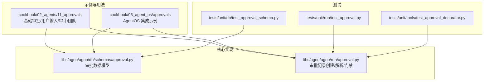
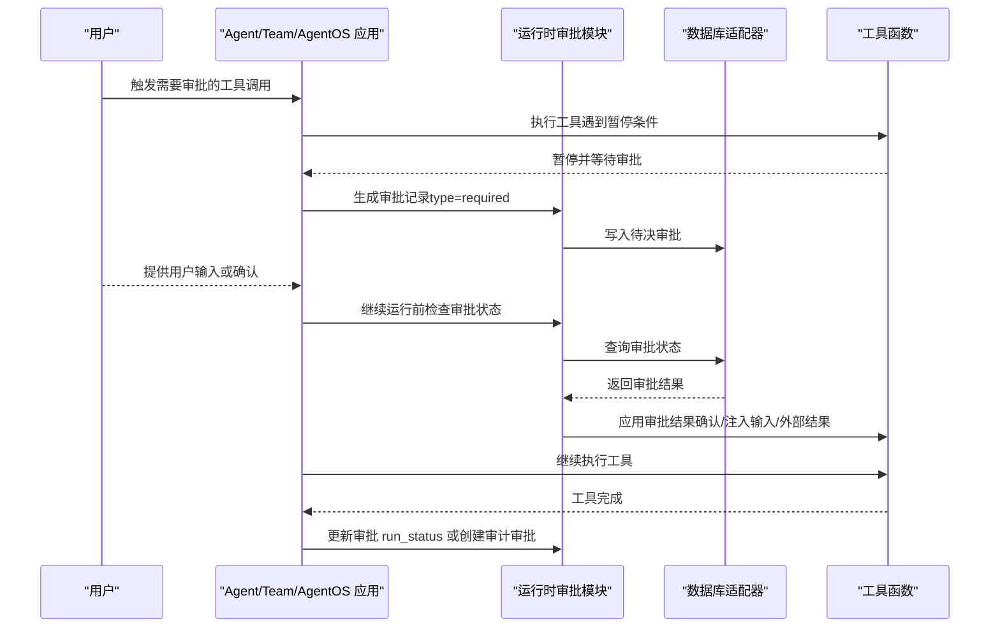
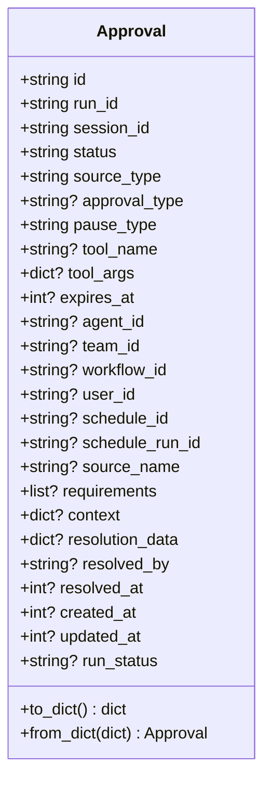
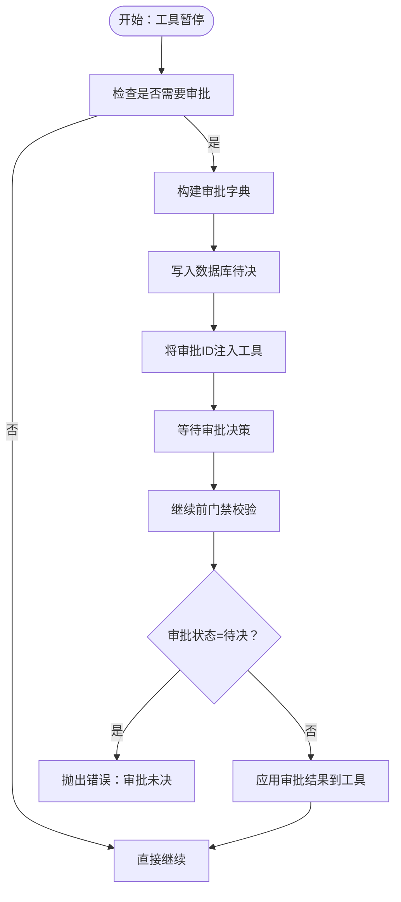
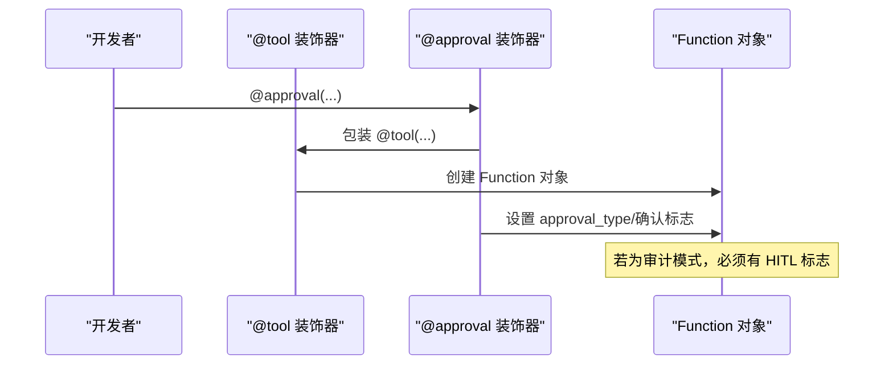
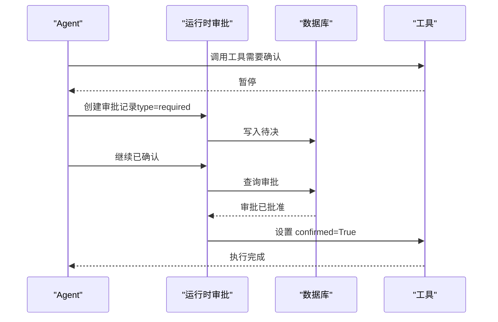
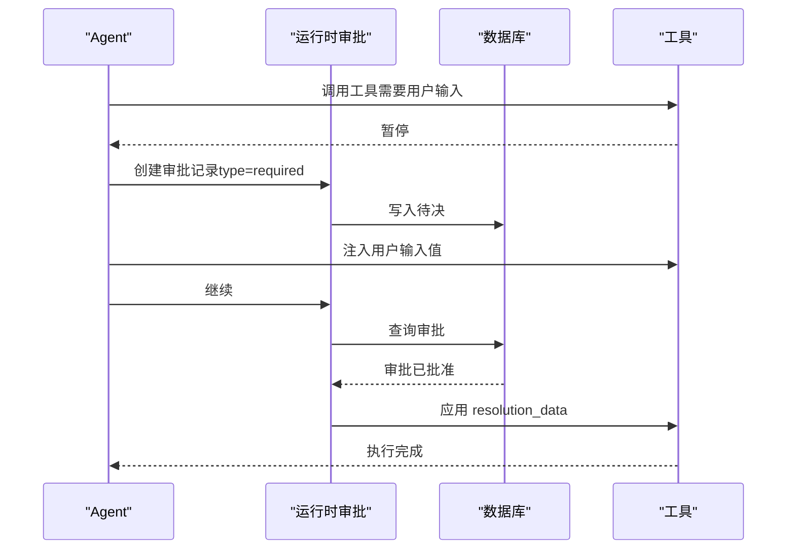
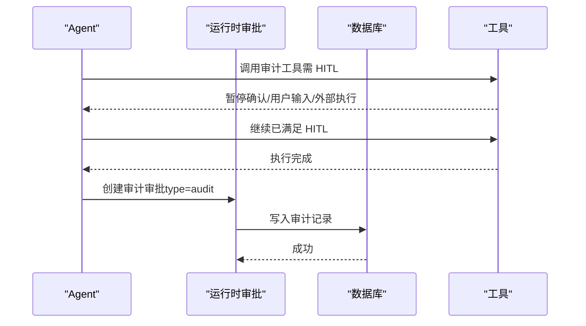
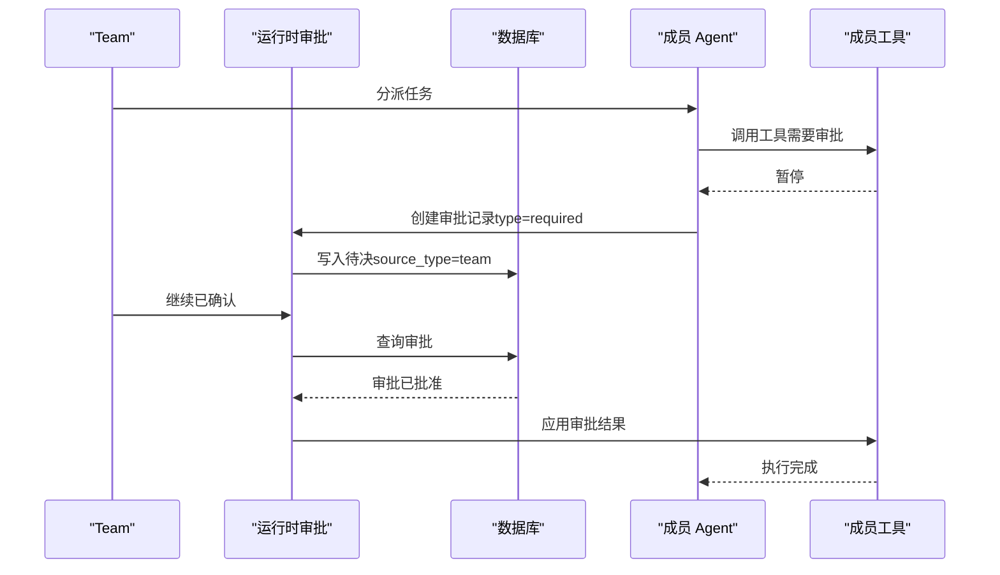
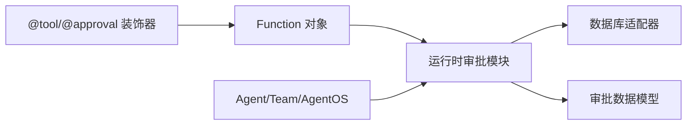

# 审批系统

<cite>
**本文档引用的文件**
- [approval_basic.py](file://cookbook/02_agents/11_approvals/approval_basic.py)
- [approval_user_input.py](file://cookbook/02_agents/11_approvals/approval_user_input.py)
- [audit_approval_overview.py](file://cookbook/02_agents/11_approvals/audit_approval_overview.py)
- [audit_approval_user_input.py](file://cookbook/02_agents/11_approvals/audit_approval_user_input.py)
- [approval_team.py](file://cookbook/02_agents/11_approvals/approval_team.py)
- [approval_basic.py](file://cookbook/05_agent_os/approvals/approval_basic.py)
- [approval_user_input.py](file://cookbook/05_agent_os/approvals/approval_user_input.py)
- [approval.py](file://libs/agno/agno/db/schemas/approval.py)
- [approval.py](file://libs/agno/agno/run/approval.py)
- [test_approval_schema.py](file://libs/agno/tests/unit/db/test_approval_schema.py)
- [test_approval.py](file://libs/agno/tests/unit/run/test_approval.py)
- [test_approval_decorator.py](file://libs/agno/tests/unit/tools/test_approval_decorator.py)
</cite>

## 目录
1. [简介](#简介)
2. [项目结构](#项目结构)
3. [核心组件](#核心组件)
4. [架构总览](#架构总览)
5. [详细组件分析](#详细组件分析)
6. [依赖关系分析](#依赖关系分析)
7. [性能考虑](#性能考虑)
8. [故障排查指南](#故障排查指南)
9. [结论](#结论)
10. [附录](#附录)

## 简介
本文件面向 AgentOS 审批系统，系统性阐述审批流程的实现机制与使用方法，覆盖以下主题：
- 审批请求的创建、处理与状态管理
- 审批规则定义、审批人分配与审批状态跟踪
- 用户输入审批与基础审批流程
- 如何在代理应用中集成审批功能
- 审批权限控制、审计日志与审批历史管理
- 审批系统与 AgentOS 其他组件（Agent、Team、AgentOS）的集成方式
- 自定义审批流程以满足特定业务需求

## 项目结构
审批系统相关代码主要分布在两个层面：
- 示例与用法：位于 cookbook 的 02_agents/11_approvals 与 05_agent_os/approvals 目录，演示不同场景下的审批使用方式
- 核心实现：位于 libs/agno/agno/run 与 libs/agno/agno/db/schemas，包含审批记录模型与运行时审批逻辑

**图表来源**
- [approval_basic.py:1-132](file://cookbook/02_agents/11_approvals/approval_basic.py#L1-L132)
- [approval_user_input.py:1-128](file://cookbook/02_agents/11_approvals/approval_user_input.py#L1-L128)
- [audit_approval_overview.py:1-187](file://cookbook/02_agents/11_approvals/audit_approval_overview.py#L1-L187)
- [audit_approval_user_input.py:1-125](file://cookbook/02_agents/11_approvals/audit_approval_user_input.py#L1-L125)
- [approval_team.py:1-131](file://cookbook/02_agents/11_approvals/approval_team.py#L1-L131)
- [approval_basic.py:1-70](file://cookbook/05_agent_os/approvals/approval_basic.py#L1-L70)
- [approval_user_input.py:1-80](file://cookbook/05_agent_os/approvals/approval_user_input.py#L1-L80)
- [approval.py:1-108](file://libs/agno/agno/db/schemas/approval.py#L1-L108)
- [approval.py:1-570](file://libs/agno/agno/run/approval.py#L1-L570)
- [test_approval_schema.py:1-273](file://libs/agno/tests/unit/db/test_approval_schema.py#L1-L273)
- [test_approval.py:1-569](file://libs/agno/tests/unit/run/test_approval.py#L1-L569)
- [test_approval_decorator.py:1-277](file://libs/agno/tests/unit/tools/test_approval_decorator.py#L1-L277)

**章节来源**
- [approval_basic.py:1-132](file://cookbook/02_agents/11_approvals/approval_basic.py#L1-L132)
- [approval_user_input.py:1-128](file://cookbook/02_agents/11_approvals/approval_user_input.py#L1-L128)
- [audit_approval_overview.py:1-187](file://cookbook/02_agents/11_approvals/audit_approval_overview.py#L1-L187)
- [audit_approval_user_input.py:1-125](file://cookbook/02_agents/11_approvals/audit_approval_user_input.py#L1-L125)
- [approval_team.py:1-131](file://cookbook/02_agents/11_approvals/approval_team.py#L1-L131)
- [approval_basic.py:1-70](file://cookbook/05_agent_os/approvals/approval_basic.py#L1-L70)
- [approval_user_input.py:1-80](file://cookbook/05_agent_os/approvals/approval_user_input.py#L1-L80)
- [approval.py:1-108](file://libs/agno/agno/db/schemas/approval.py#L1-L108)
- [approval.py:1-570](file://libs/agno/agno/run/approval.py#L1-L570)

## 核心组件
- 审批数据模型：定义审批记录的字段、默认值、序列化与反序列化行为，支持持久化存储
- 运行时审批逻辑：负责在工具暂停时创建“待决”审批记录、在继续前校验审批结果、根据审批状态对工具进行确认或注入用户输入/外部执行结果
- 审计审批：在工具执行完成后记录审计审批，用于合规与审计追踪
- 示例与用法：覆盖基础审批、用户输入审批、审计审批、团队级审批等典型场景

**章节来源**
- [approval.py:7-108](file://libs/agno/agno/db/schemas/approval.py#L7-L108)
- [approval.py:13-570](file://libs/agno/agno/run/approval.py#L13-L570)
- [test_approval_schema.py:24-273](file://libs/agno/tests/unit/db/test_approval_schema.py#L24-L273)
- [test_approval.py:9-569](file://libs/agno/tests/unit/run/test_approval.py#L9-L569)
- [test_approval_decorator.py:14-277](file://libs/agno/tests/unit/tools/test_approval_decorator.py#L14-L277)

## 架构总览
审批系统围绕“暂停-审批-恢复”的闭环工作流展开，核心流程如下：

**图表来源**
- [approval.py:152-262](file://libs/agno/agno/run/approval.py#L152-L262)
- [approval.py:394-440](file://libs/agno/agno/run/approval.py#L394-L440)
- [approval.py:513-570](file://libs/agno/agno/run/approval.py#L513-L570)
- [approval.py:7-108](file://libs/agno/agno/db/schemas/approval.py#L7-L108)

## 详细组件分析

### 审批数据模型（Approval）
- 字段覆盖：状态、来源类型（agent/team/workflow）、审批类型（required/audit）、暂停类型（confirmation/user_input/external_execution）、工具名与参数、关联会话与运行、上下文、决议数据、审批人与时间戳、运行状态映射等
- 默认值与时间戳：自动设置创建时间；更新与解决时间转换为秒级时间戳
- 序列化/反序列化：to_dict 保留 None 值，from_dict 过滤未知键，保证与数据库表结构一致

**图表来源**
- [approval.py:7-108](file://libs/agno/agno/db/schemas/approval.py#L7-L108)

**章节来源**
- [approval.py:7-108](file://libs/agno/agno/db/schemas/approval.py#L7-L108)
- [test_approval_schema.py:24-273](file://libs/agno/tests/unit/db/test_approval_schema.py#L24-L273)

### 运行时审批逻辑（创建/解析/门禁）
- 创建审批记录：当工具暂停且需要审批时，从运行响应构建审批字典，写入数据库，并将审批 ID 注入相关工具
- 审核审批：工具执行完成后创建审计审批记录，记录状态与上下文
- 门禁校验：继续运行前查询审批状态，若仍为待决则抛出错误；否则根据审批结果对工具进行确认或注入用户输入/外部执行结果
- 异步支持：同步与异步路径均兼容，优先尝试异步接口，回退到同步

**图表来源**
- [approval.py:152-262](file://libs/agno/agno/run/approval.py#L152-L262)
- [approval.py:394-440](file://libs/agno/agno/run/approval.py#L394-L440)
- [approval.py:264-325](file://libs/agno/agno/run/approval.py#L264-L325)

**章节来源**
- [approval.py:13-570](file://libs/agno/agno/run/approval.py#L13-L570)
- [test_approval.py:9-569](file://libs/agno/tests/unit/run/test_approval.py#L9-L569)

### 审批装饰器与工具集成
- 装饰器行为：@approval 叠加在 @tool 上时，自动设置 approval_type='required' 并在无其他 HITL 标志时设置 requires_confirmation=True
- 审计模式：@approval(type='audit') 必须配合至少一个 HITL 标志（如 requires_confirmation、requires_user_input、external_execution），否则报错
- 工具包传播：在 Toolkit 中注册的 @approval + @tool 方法能保持 approval_type 设置

**图表来源**
- [test_approval_decorator.py:14-201](file://libs/agno/tests/unit/tools/test_approval_decorator.py#L14-L201)

**章节来源**
- [test_approval_decorator.py:14-277](file://libs/agno/tests/unit/tools/test_approval_decorator.py#L14-L277)

### 基础审批流程（确认型）
- 场景：工具需要人工确认后方可执行
- 关键点：工具标注 requires_confirmation=True；运行暂停；在 UI/交互层确认；继续运行前通过门禁校验；数据库中更新审批状态

**图表来源**
- [approval_basic.py:22-132](file://cookbook/02_agents/11_approvals/approval_basic.py#L22-L132)
- [approval_basic.py:21-70](file://cookbook/05_agent_os/approvals/approval_basic.py#L21-L70)

**章节来源**
- [approval_basic.py:1-132](file://cookbook/02_agents/11_approvals/approval_basic.py#L1-L132)
- [approval_basic.py:1-70](file://cookbook/05_agent_os/approvals/approval_basic.py#L1-L70)

### 用户输入审批流程
- 场景：工具需要用户提供输入（如账户、备注等）
- 关键点：工具标注 requires_user_input=True 并声明 user_input_fields；运行暂停；在交互层收集用户输入；继续运行前应用输入值；可同时结合确认

**图表来源**
- [approval_user_input.py:20-128](file://cookbook/02_agents/11_approvals/approval_user_input.py#L20-L128)
- [audit_approval_user_input.py:19-125](file://cookbook/02_agents/11_approvals/audit_approval_user_input.py#L19-L125)

**章节来源**
- [approval_user_input.py:1-128](file://cookbook/02_agents/11_approvals/approval_user_input.py#L1-L128)
- [audit_approval_user_input.py:1-125](file://cookbook/02_agents/11_approvals/audit_approval_user_input.py#L1-L125)

### 审计审批流程
- 场景：工具执行完成后记录审计审批，便于合规与审计
- 关键点：@approval(type='audit') 与 HITL 标志组合；工具执行完成后创建审计记录；状态为 approved/rejected；不阻塞继续

**图表来源**
- [audit_approval_overview.py:20-187](file://cookbook/02_agents/11_approvals/audit_approval_overview.py#L20-L187)
- [audit_approval_user_input.py:19-125](file://cookbook/02_agents/11_approvals/audit_approval_user_input.py#L19-L125)

**章节来源**
- [audit_approval_overview.py:1-187](file://cookbook/02_agents/11_approvals/audit_approval_overview.py#L1-L187)
- [audit_approval_user_input.py:1-125](file://cookbook/02_agents/11_approvals/audit_approval_user_input.py#L1-L125)

### 团队级审批流程
- 场景：Team 中成员工具触发审批，审批记录标记 source_type 为 team，并携带 source_name
- 关键点：Team.run 产生暂停；审批记录包含团队信息；继续运行前同样进行门禁校验

**图表来源**
- [approval_team.py:21-131](file://cookbook/02_agents/11_approvals/approval_team.py#L21-L131)

**章节来源**
- [approval_team.py:1-131](file://cookbook/02_agents/11_approvals/approval_team.py#L1-L131)

### 在代理应用中集成审批功能
- 步骤概览
  1) 定义工具：使用 @tool 标注需要审批的工具，必要时设置 requires_confirmation、requires_user_input、external_execution
  2) 应用审批：使用 @approval 将工具纳入审批流程，或使用 @approval(type='audit') 记录审计
  3) 初始化数据库：配置 SqliteDb 或其他数据库适配器，确保 approvals 表存在
  4) 运行与交互：Agent/Team/AgentOS 应用运行时遇到暂停，通过 UI/交互层完成审批；继续运行前由运行时审批模块进行门禁校验
  5) 审计与历史：审批状态与审计记录持久化，支持查询与统计

- 示例参考
  - 基础审批与确认：[approval_basic.py:22-132](file://cookbook/02_agents/11_approvals/approval_basic.py#L22-L132)
  - 用户输入审批：[approval_user_input.py:20-128](file://cookbook/02_agents/11_approvals/approval_user_input.py#L20-L128)
  - 审计审批概览：[audit_approval_overview.py:20-187](file://cookbook/02_agents/11_approvals/audit_approval_overview.py#L20-L187)
  - 团队级审批：[approval_team.py:21-131](file://cookbook/02_agents/11_approvals/approval_team.py#L21-L131)
  - AgentOS 集成：[approval_basic.py:21-70](file://cookbook/05_agent_os/approvals/approval_basic.py#L21-L70), [approval_user_input.py:20-80](file://cookbook/05_agent_os/approvals/approval_user_input.py#L20-L80)

**章节来源**
- [approval_basic.py:1-132](file://cookbook/02_agents/11_approvals/approval_basic.py#L1-L132)
- [approval_user_input.py:1-128](file://cookbook/02_agents/11_approvals/approval_user_input.py#L1-L128)
- [audit_approval_overview.py:1-187](file://cookbook/02_agents/11_approvals/audit_approval_overview.py#L1-L187)
- [approval_team.py:1-131](file://cookbook/02_agents/11_approvals/approval_team.py#L1-L131)
- [approval_basic.py:1-70](file://cookbook/05_agent_os/approvals/approval_basic.py#L1-L70)
- [approval_user_input.py:1-80](file://cookbook/05_agent_os/approvals/approval_user_input.py#L1-L80)

## 依赖关系分析
- 组件耦合
  - 运行时审批模块依赖数据库适配器接口（create_approval、get_approvals、update_approval_run_status 等）
  - 审批数据模型与数据库表结构强绑定，测试用例验证了字段一致性
  - 装饰器与工具系统紧密耦合，确保 approval_type 与 HITL 标志正确传播
- 外部依赖
  - 数据库适配器：SQLite/PostgreSQL 等，需提供审批表结构
  - Agent/Team/AgentOS：作为上层运行容器，触发暂停与继续流程

**图表来源**
- [approval.py:152-262](file://libs/agno/agno/run/approval.py#L152-L262)
- [approval.py:7-108](file://libs/agno/agno/db/schemas/approval.py#L7-L108)
- [test_approval_schema.py:231-273](file://libs/agno/tests/unit/db/test_approval_schema.py#L231-L273)

**章节来源**
- [approval.py:1-570](file://libs/agno/agno/run/approval.py#L1-L570)
- [approval.py:1-108](file://libs/agno/agno/db/schemas/approval.py#L1-L108)
- [test_approval_schema.py:231-273](file://libs/agno/tests/unit/db/test_approval_schema.py#L231-L273)

## 性能考虑
- 异步优先：运行时审批模块优先尝试异步数据库接口，减少阻塞
- 最小化查询：门禁校验仅在需要时查询最新审批记录，避免重复查询
- 序列化开销：审批记录的 to_dict 保留 None 值，确保更新操作精确，但需注意字段数量较多时的序列化成本
- 数据库索引：建议在 run_id、status、approval_type、created_at 等常用查询字段建立索引，提升审批列表与统计查询性能

## 故障排查指南
- 问题：继续运行时报“未找到审批记录”
  - 排查：确认数据库适配器是否实现 get_approvals；检查 run_id 是否匹配；确认审批记录是否被正确创建
  - 参考：[approval.py:394-418](file://libs/agno/agno/run/approval.py#L394-L418)
- 问题：继续运行时报“审批仍为待决”
  - 排查：确认审批状态已在数据库中更新为 approved/rejected；检查并发更新导致的竞态条件
  - 参考：[approval.py:420-440](file://libs/agno/agno/run/approval.py#L420-L440)
- 问题：审计审批未创建
  - 排查：确认工具执行完成后再创建审计审批；检查 create_audit_approval 调用路径
  - 参考：[approval.py:264-325](file://libs/agno/agno/run/approval.py#L264-L325)
- 问题：字段不一致导致序列化失败
  - 排查：对照数据库表结构，确保 Approval 字段与表列一致；使用测试用例验证
  - 参考：[test_approval_schema.py:231-273](file://libs/agno/tests/unit/db/test_approval_schema.py#L231-L273)

**章节来源**
- [approval.py:394-440](file://libs/agno/agno/run/approval.py#L394-L440)
- [approval.py:264-325](file://libs/agno/agno/run/approval.py#L264-L325)
- [test_approval_schema.py:231-273](file://libs/agno/tests/unit/db/test_approval_schema.py#L231-L273)

## 结论
AgentOS 审批系统通过“暂停-审批-恢复”的闭环机制，结合审批数据模型与运行时审批逻辑，实现了对高风险工具的安全控制与审计追踪。系统支持多种审批模式（确认、用户输入、外部执行）与审计模式，并与 Agent、Team、AgentOS 等上层组件无缝集成。通过数据库适配器抽象，系统具备良好的扩展性与可维护性。

## 附录
- 审批状态与暂停类型
  - 状态：pending、approved、rejected、expired、cancelled
  - 暂停类型：confirmation、user_input、external_execution
- 审批类型
  - required：阻塞式审批，必须在继续前获得批准
  - audit：非阻塞式审计，工具执行完成后记录
- 常用数据库接口
  - create_approval、get_approvals、update_approval_run_status、update_approval 等