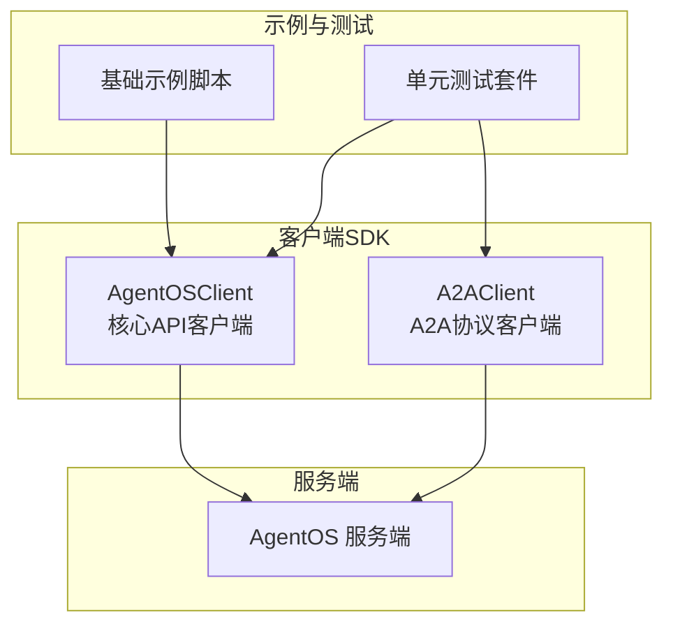
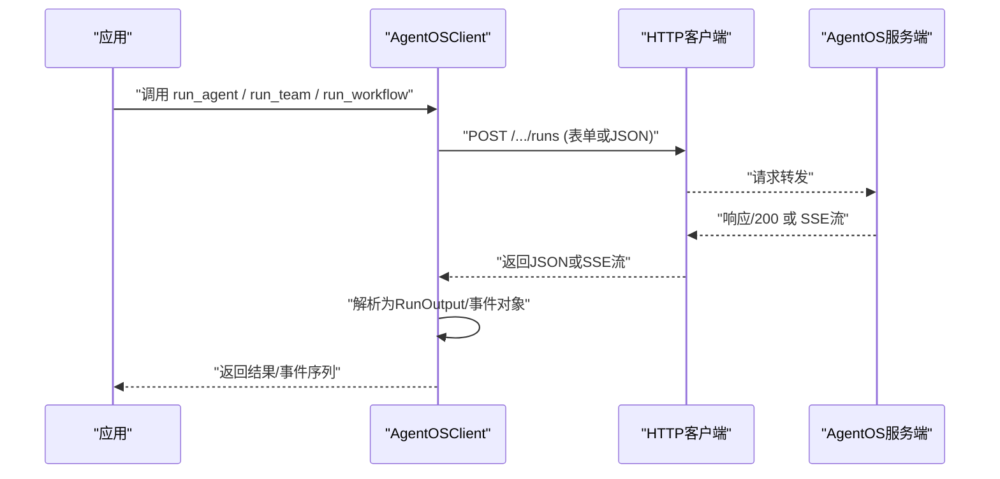
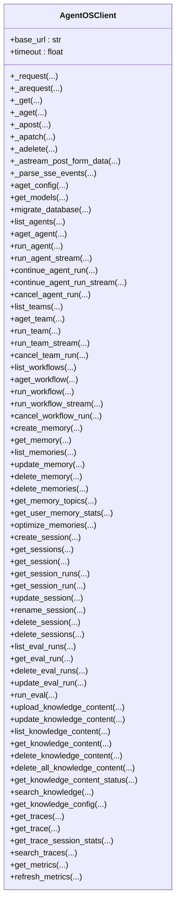
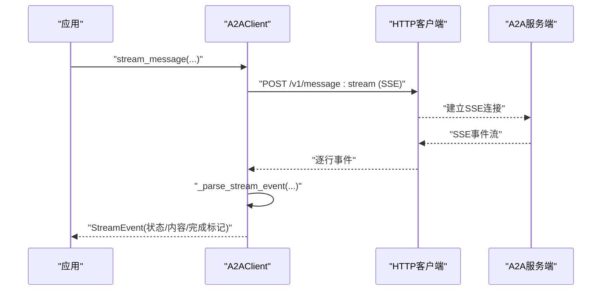
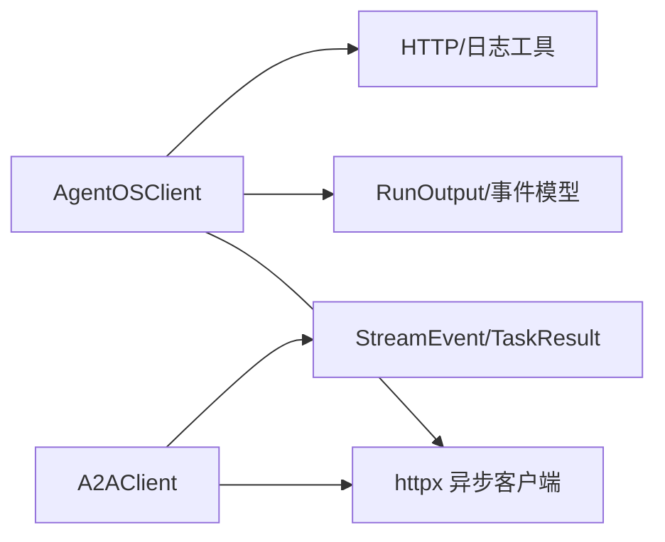

# 客户端集成

<cite>
**本文引用的文件**
- [libs/agno/agno/client/os.py](file://libs/agno/agno/client/os.py)
- [libs/agno/agno/client/__init__.py](file://libs/agno/agno/client/__init__.py)
- [libs/agno/agno/client/a2a/client.py](file://libs/agno/agno/client/a2a/client.py)
- [cookbook/05_agent_os/client/01_basic_client.py](file://cookbook/05_agent_os/client/01_basic_client.py)
- [libs/agno/tests/unit/os/test_client.py](file://libs/agno/tests/unit/os/test_client.py)
- [libs/agno/tests/unit/os/test_client_user_id.py](file://libs/agno/tests/unit/os/test_client_user_id.py)
- [libs/agno/tests/unit/a2a/test_client.py](file://libs/agno/tests/unit/a2a/test_client.py)
- [libs/agno/agno/remote/base.py](file://libs/agno/agno/remote/base.py)
</cite>

## 目录
1. [简介](#简介)
2. [项目结构](#项目结构)
3. [核心组件](#核心组件)
4. [架构总览](#架构总览)
5. [详细组件分析](#详细组件分析)
6. [依赖关系分析](#依赖关系分析)
7. [性能考虑](#性能考虑)
8. [故障排查指南](#故障排查指南)
9. [结论](#结论)
10. [附录](#附录)

## 简介
本文件面向希望在应用中集成 AgentOS 客户端 SDK 的工程师与技术文档读者，系统性阐述客户端 SDK 的使用方法、API 调用流程、错误处理策略、会话管理机制，以及客户端与 AgentOS 服务端之间的认证、授权与数据传输细节。文档同时覆盖代理运行、知识库检索、评估与指标等关键能力，并提供最佳实践与常见问题排查建议。

## 项目结构
AgentOS 客户端位于 libs/agno/agno/client 目录下，包含两类客户端：
- AgentOSClient：用于与 AgentOS 核心 API 交互（代理运行、团队协作、工作流、会话、知识库、评估、追踪与指标等）。
- A2AClient：用于与 A2A（Agent-to-Agent）协议兼容的服务通信，支持消息发送与事件流解析。

图示来源
- [libs/agno/agno/client/os.py:72-2138](file://libs/agno/agno/client/os.py#L72-L2138)
- [libs/agno/agno/client/a2a/client.py:27-555](file://libs/agno/agno/client/a2a/client.py#L27-L555)
- [cookbook/05_agent_os/client/01_basic_client.py:35-61](file://cookbook/05_agent_os/client/01_basic_client.py#L35-L61)
- [libs/agno/tests/unit/os/test_client.py:1-769](file://libs/agno/tests/unit/os/test_client.py#L1-L769)
- [libs/agno/tests/unit/a2a/test_client.py:1-446](file://libs/agno/tests/unit/a2a/test_client.py#L1-L446)

章节来源
- [libs/agno/agno/client/os.py:72-2138](file://libs/agno/agno/client/os.py#L72-L2138)
- [libs/agno/agno/client/a2a/client.py:27-555](file://libs/agno/agno/client/a2a/client.py#L27-L555)
- [cookbook/05_agent_os/client/01_basic_client.py:1-61](file://cookbook/05_agent_os/client/01_basic_client.py#L1-L61)

## 核心组件
- AgentOSClient
  - 提供与 AgentOS 服务端的同步/异步 HTTP 交互封装，内置请求与 SSE 流解析逻辑。
  - 支持发现与配置查询、模型列表、数据库迁移、组件列举与详情获取、运行执行与取消、会话 CRUD、知识库上传/检索/状态查询、评估运行、追踪与指标等。
- A2AClient
  - 面向 A2A 协议的客户端，支持 REST 与 JSON-RPC 两种模式，提供消息发送与事件流解析。
  - 支持任务结果解析、流式事件类型识别与元数据提取。

章节来源
- [libs/agno/agno/client/os.py:72-2138](file://libs/agno/agno/client/os.py#L72-L2138)
- [libs/agno/agno/client/a2a/client.py:27-555](file://libs/agno/agno/client/a2a/client.py#L27-L555)

## 架构总览
客户端通过统一的 HTTP 客户端与服务端进行交互，内部对请求参数、表单提交、SSE 流进行标准化处理；同时提供认证头注入与错误转换，确保调用方专注于业务逻辑。

图示来源
- [libs/agno/agno/client/os.py:534-744](file://libs/agno/agno/client/os.py#L534-L744)
- [libs/agno/agno/client/os.py:1049-1116](file://libs/agno/agno/client/os.py#L1049-L1116)

## 详细组件分析

### AgentOSClient 组件
- 初始化与基础方法
  - 支持自定义 base_url 与超时；内部统一封装 _request/_arequest/_get/_aget/_apost/_apatch/_adelete/_astream_post_form_data/_parse_sse_events。
  - 错误处理：将连接失败与超时转换为统一的 RemoteServerUnavailableError；对空响应返回 None。
- 发现与配置
  - get_config / aget_config：获取 OS 元信息、可用组件与接口配置。
  - get_models：获取当前使用的模型列表。
- 组件运行
  - run_agent / run_agent_stream：执行代理运行并可选择流式输出。
  - run_team / run_team_stream：执行团队运行。
  - run_workflow / run_workflow_stream：执行工作流运行。
  - cancel_agent_run / cancel_team_run / cancel_workflow_run：取消运行。
- 会话管理
  - create_session / get_session / get_sessions / get_session_runs / get_session_run / update_session / rename_session / delete_session / delete_sessions：覆盖代理/团队/工作流三类会话的全生命周期管理。
- 知识库
  - upload_knowledge_content / update_knowledge_content / list_knowledge_content / get_knowledge_content / delete_knowledge_content / delete_all_knowledge_content / get_knowledge_content_status / search_knowledge / get_knowledge_config：内容上传、检索、状态查询与配置获取。
- 评估与指标
  - list_eval_runs / get_eval_run / delete_eval_runs / update_eval_run / run_eval：评估运行管理与执行。
  - get_metrics / refresh_metrics：指标查询与刷新。
- 追踪
  - get_traces / get_trace / get_trace_session_stats / search_traces：追踪与统计查询。
- 认证与安全
  - 通过 headers 注入 Authorization 头（Bearer Token），并在远程不可达时抛出统一异常。

图示来源
- [libs/agno/agno/client/os.py:72-2138](file://libs/agno/agno/client/os.py#L72-L2138)

章节来源
- [libs/agno/agno/client/os.py:72-2138](file://libs/agno/agno/client/os.py#L72-L2138)
- [libs/agno/tests/unit/os/test_client.py:1-769](file://libs/agno/tests/unit/os/test_client.py#L1-L769)

### A2AClient 组件
- 协议与端点
  - 支持 REST 与 JSON-RPC 两种协议模式；REST 模式下按路径拼接，JSON-RPC 模式下统一指向根路径。
- 请求构建
  - _build_message_request：构造符合 A2A 协议的消息体，支持文本、图片、音频、视频与文件附件，以及上下文 ID、用户 ID 与元数据。
- 响应解析
  - _parse_task_result：解析最终任务结果，提取任务 ID、上下文 ID、状态、内容与制品。
  - _parse_stream_event：解析流事件，识别 content、status-update、task 等事件类型，并标注是否为最终事件。
- 方法
  - send_message：发送消息并等待一次性结果。
  - stream_message：发送消息并实时解析事件流。
  - get_agent_card / aget_agent_card：能力发现，获取代理卡片信息。

图示来源
- [libs/agno/agno/client/a2a/client.py:393-500](file://libs/agno/agno/client/a2a/client.py#L393-L500)

章节来源
- [libs/agno/agno/client/a2a/client.py:27-555](file://libs/agno/agno/client/a2a/client.py#L27-L555)
- [libs/agno/tests/unit/a2a/test_client.py:1-446](file://libs/agno/tests/unit/a2a/test_client.py#L1-L446)

### API 使用示例与最佳实践
- 基础示例
  - 参考 cookbook 中的基础客户端示例，演示如何初始化 AgentOSClient 并查询配置与代理详情。
- 最佳实践
  - 明确设置 base_url 与 timeout，避免默认值导致的超时或连接失败。
  - 在 headers 中注入 Authorization: Bearer <token> 实现鉴权。
  - 对于长耗时运行，优先使用流式接口（run_*_stream）以提升用户体验与可观测性。
  - 合理使用 session_id 与 user_id 参数，确保会话与用户边界清晰，便于追踪与审计。
  - 对于知识库上传，优先使用 multipart 表单并结合 reader/chunker 参数优化处理效果。

章节来源
- [cookbook/05_agent_os/client/01_basic_client.py:1-61](file://cookbook/05_agent_os/client/01_basic_client.py#L1-L61)
- [libs/agno/tests/unit/os/test_client_user_id.py:1-277](file://libs/agno/tests/unit/os/test_client_user_id.py#L1-L277)

## 依赖关系分析
- 组件内聚与耦合
  - AgentOSClient 将 HTTP 请求、SSE 解析与数据模型验证解耦，便于扩展与测试。
  - A2AClient 与协议规范强相关，但通过事件解析器抽象了不同事件类型的处理。
- 外部依赖
  - httpx 异步客户端、FastAPI UploadFile（用于知识库上传）、模型/运行事件解析工具。
- 接口契约
  - 所有运行接口均支持 as_form 提交，SSE 事件通过 _parse_sse_events 统一解析为 typed 事件对象。

图示来源
- [libs/agno/agno/client/os.py:69-70](file://libs/agno/agno/client/os.py#L69-L70)
- [libs/agno/agno/client/a2a/client.py:13-16](file://libs/agno/agno/client/a2a/client.py#L13-L16)

章节来源
- [libs/agno/agno/client/os.py:69-70](file://libs/agno/agno/client/os.py#L69-L70)
- [libs/agno/agno/client/a2a/client.py:13-16](file://libs/agno/agno/client/a2a/client.py#L13-L16)

## 性能考虑
- 连接与超时
  - 合理设置 timeout，避免长时间阻塞；对高延迟网络环境适当增大超时时间。
- 流式处理
  - 使用 run_*_stream 降低首字节延迟，提升交互体验；注意在消费事件时及时处理与丢弃无效事件。
- 重试与退避
  - 对幂等请求可在上层实现指数退避重试；对非幂等请求需谨慎处理重试风险。
- 缓存与复用
  - 对静态配置（如 get_config）可做本地缓存，减少重复请求；注意配置变更后的刷新策略。
- 知识库上传
  - 大文件上传建议分块与断点续传策略（若服务端支持），并合理设置 chunk_size 与 chunk_overlap。

## 故障排查指南
- 连接失败与超时
  - 现象：抛出 RemoteServerUnavailableError，包含 base_url 与原始错误信息。
  - 处理：检查 base_url 正确性、网络连通性、防火墙与代理设置；适当增大 timeout。
- HTTP 错误码
  - 现象：HTTPStatusError 抛出，通常由服务端返回 4xx/5xx。
  - 处理：根据状态码定位问题（鉴权失败、资源不存在、参数校验失败等）。
- SSE 事件解析异常
  - 现象：日志记录 JSON 解析失败或未知事件类型，但不会中断流。
  - 处理：确认服务端事件格式一致性；在上层对异常事件进行告警与降级处理。
- 用户 ID 与权限
  - 现象：服务端路由可能强制 JWT 中的 user_id 覆盖客户端传入的 ?user_id 查询参数。
  - 处理：确保 JWT 令牌正确签发且包含预期的 user_id；避免跨用户越权访问。

章节来源
- [libs/agno/agno/client/os.py:141-152](file://libs/agno/agno/client/os.py#L141-L152)
- [libs/agno/agno/client/os.py:380-404](file://libs/agno/agno/client/os.py#L380-L404)
- [libs/agno/tests/unit/os/test_client_user_id.py:187-224](file://libs/agno/tests/unit/os/test_client_user_id.py#L187-L224)

## 结论
AgentOS 客户端 SDK 提供了从代理运行到会话管理、从知识库检索到评估与追踪的完整能力矩阵。通过统一的 HTTP 封装与事件流解析，开发者可以快速集成并扩展到复杂应用场景。建议在生产环境中重视鉴权、超时与流式处理策略，并结合本地缓存与合理的错误处理机制，确保系统的稳定性与可观测性。

## 附录
- 快速开始
  - 参考基础示例脚本，连接本地或远端 AgentOS 实例，查询配置与代理详情。
- 认证与授权
  - 在 headers 中添加 Authorization: Bearer <token>；服务端可能基于 JWT 设置 user_id 并覆盖查询参数。
- 常用操作清单
  - 获取配置与模型列表
  - 创建/查询/更新/删除会话
  - 执行代理/团队/工作流运行（含流式）
  - 知识库内容上传/检索/状态查询
  - 评估运行与指标查询
  - 追踪查询与统计

章节来源
- [cookbook/05_agent_os/client/01_basic_client.py:35-61](file://cookbook/05_agent_os/client/01_basic_client.py#L35-L61)
- [libs/agno/agno/remote/base.py:474-489](file://libs/agno/agno/remote/base.py#L474-L489)