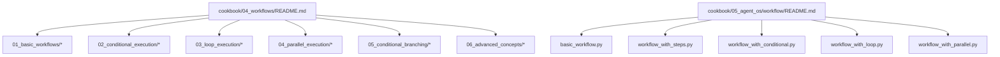
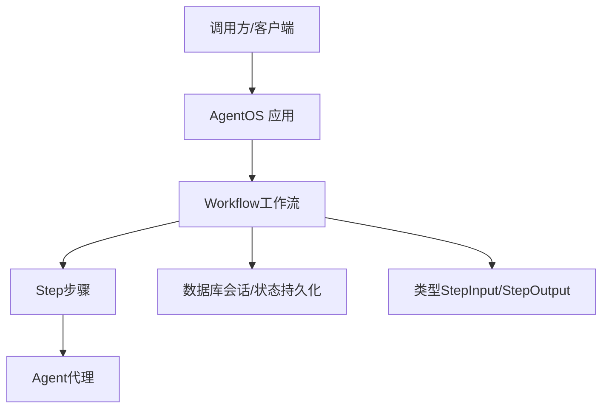
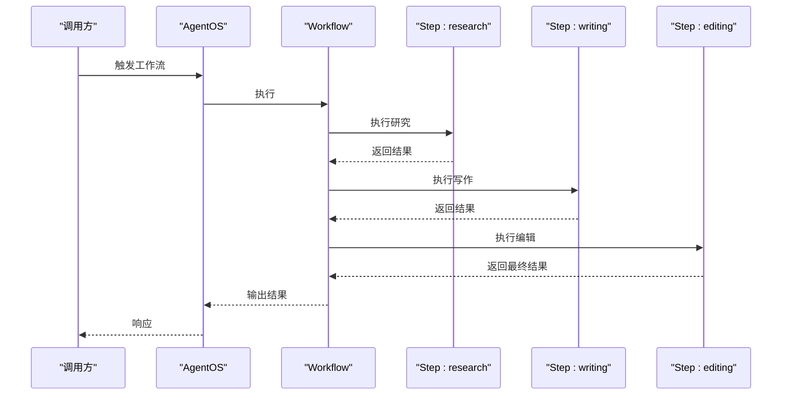
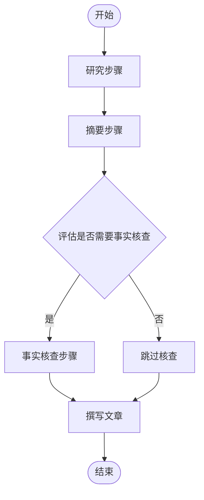
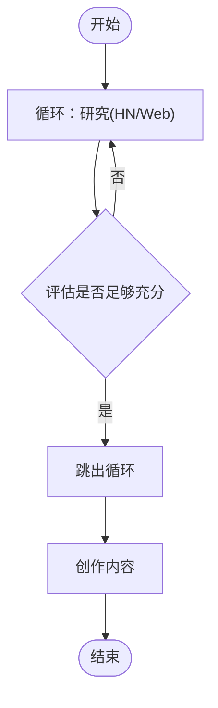
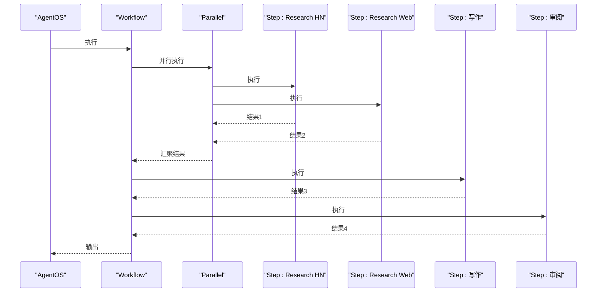
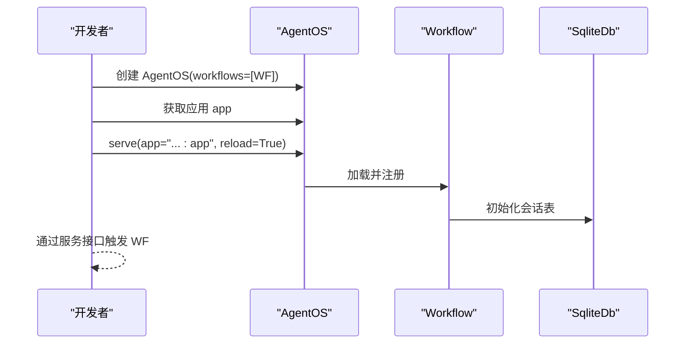
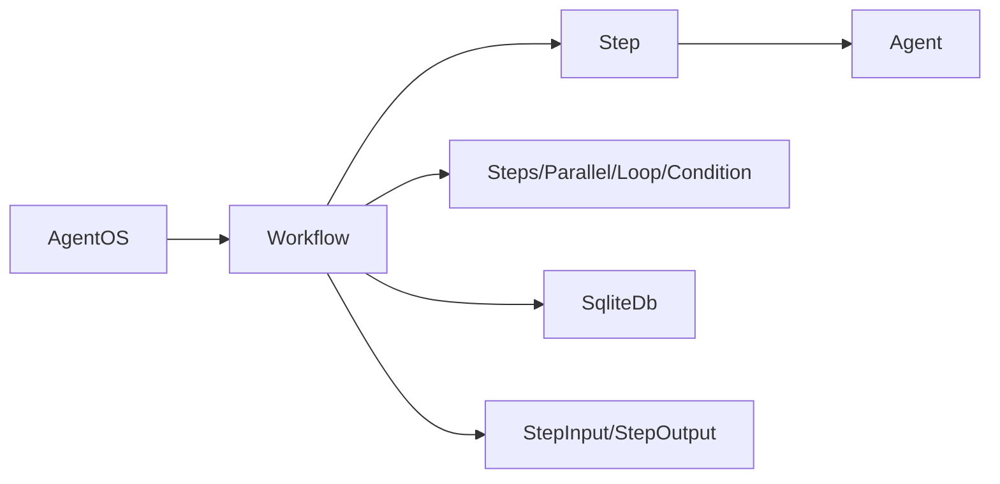

# 工作流集成

<cite>
**本文引用的文件**
- [cookbook/04_workflows/README.md](file://cookbook/04_workflows/README.md)
- [cookbook/05_agent_os/workflow/README.md](file://cookbook/05_agent_os/workflow/README.md)
- [cookbook/04_workflows/01_basic_workflows/01_sequence_of_steps/workflow_using_steps.py](file://cookbook/04_workflows/01_basic_workflows/01_sequence_of_steps/workflow_using_steps.py)
- [cookbook/05_agent_os/workflow/basic_workflow.py](file://cookbook/05_agent_os/workflow/basic_workflow.py)
- [cookbook/05_agent_os/workflow/workflow_with_steps.py](file://cookbook/05_agent_os/workflow/workflow_with_steps.py)
- [cookbook/05_agent_os/workflow/workflow_with_conditional.py](file://cookbook/05_agent_os/workflow/workflow_with_conditional.py)
- [cookbook/05_agent_os/workflow/workflow_with_loop.py](file://cookbook/05_agent_os/workflow/workflow_with_loop.py)
- [cookbook/05_agent_os/workflow/workflow_with_parallel.py](file://cookbook/05_agent_os/workflow/workflow_with_parallel.py)
- [libs/agno/workflow/workflow.py](file://libs/agno/workflow/workflow.py)
- [libs/agno/workflow/step.py](file://libs/agno/workflow/step.py)
- [libs/agno/workflow/steps.py](file://libs/agno/workflow/steps.py)
- [libs/agno/workflow/condition.py](file://libs/agno/workflow/condition.py)
- [libs/agno/workflow/loop.py](file://libs/agno/workflow/loop.py)
- [libs/agno/workflow/parallel.py](file://libs/agno/workflow/parallel.py)
- [libs/agno/workflow/types.py](file://libs/agno/workflow/types.py)
- [libs/agno/os/__init__.py](file://libs/agno/os/__init__.py)
- [libs/agno/db/sqlite.py](file://libs/agno/db/sqlite.py)
- [libs/agno/agent/agent.py](file://libs/agno/agent/agent.py)
</cite>

## 目录
1. [简介](#简介)
2. [项目结构](#项目结构)
3. [核心组件](#核心组件)
4. [架构总览](#架构总览)
5. [详细组件分析](#详细组件分析)
6. [依赖关系分析](#依赖关系分析)
7. [性能考虑](#性能考虑)
8. [故障排查指南](#故障排查指南)
9. [结论](#结论)
10. [附录](#附录)

## 简介
本文件面向在 AgentOS 中集成与运行工作流（Workflow）的开发者，系统性阐述工作流与 AgentOS 的集成方法与应用实践，覆盖基础工作流、条件工作流与循环工作流的实现方式；深入解释流程定义、执行控制与状态管理；并结合代理系统场景给出可复用的模式与最佳实践。文档同时提供可直接定位到源码示例路径的“章节来源”与“图示来源”，便于快速查阅与落地。

## 项目结构
工作流相关的示例主要分布在两个区域：
- cookbook/04_workflows：通用工作流示例集合，包含基础序列、条件执行、循环、并行、路由等主题。
- cookbook/05_agent_os/workflow：基于 AgentOS 的工作流示例，强调与 AgentOS 集成、会话状态持久化与服务化部署。

下图展示了与工作流集成相关的关键文件与目录关系：

图表来源
- [cookbook/04_workflows/README.md:1-19](file://cookbook/04_workflows/README.md#L1-L19)
- [cookbook/05_agent_os/workflow/README.md:1-26](file://cookbook/05_agent_os/workflow/README.md#L1-L26)

章节来源
- [cookbook/04_workflows/README.md:1-19](file://cookbook/04_workflows/README.md#L1-L19)
- [cookbook/05_agent_os/workflow/README.md:1-26](file://cookbook/05_agent_os/workflow/README.md#L1-L26)

## 核心组件
- 工作流（Workflow）：工作流的容器与编排单元，负责步骤的顺序执行、状态持久化与会话管理。
- 步骤（Step）：最小执行单元，封装一个 Agent 及其执行逻辑。
- 复合步骤（Steps/Parallel/Loop/Condition）：对 Step 进行组合或控制，形成更复杂流程。
- 类型与输入输出（types.StepInput/StepOutput）：标准化步骤间的数据传递与状态访问。
- 数据库适配（SqliteDb）：用于会话状态与中间结果的持久化。
- AgentOS：将工作流注册到系统中，提供服务化入口与运行时环境。

章节来源
- [libs/agno/workflow/workflow.py](file://libs/agno/workflow/workflow.py)
- [libs/agno/workflow/step.py](file://libs/agno/workflow/step.py)
- [libs/agno/workflow/steps.py](file://libs/agno/workflow/steps.py)
- [libs/agno/workflow/parallel.py](file://libs/agno/workflow/parallel.py)
- [libs/agno/workflow/loop.py](file://libs/agno/workflow/loop.py)
- [libs/agno/workflow/condition.py](file://libs/agno/workflow/condition.py)
- [libs/agno/workflow/types.py](file://libs/agno/workflow/types.py)
- [libs/agno/db/sqlite.py](file://libs/agno/db/sqlite.py)
- [libs/agno/agent/agent.py](file://libs/agno/agent/agent.py)

## 架构总览
下图展示了从“调用方”到“工作流执行”的端到端链路，以及 AgentOS 如何承载工作流并提供服务化能力。

图表来源
- [libs/agno/os/__init__.py](file://libs/agno/os/__init__.py)
- [libs/agno/workflow/workflow.py](file://libs/agno/workflow/workflow.py)
- [libs/agno/workflow/step.py](file://libs/agno/workflow/step.py)
- [libs/agno/agent/agent.py](file://libs/agno/agent/agent.py)
- [libs/agno/db/sqlite.py](file://libs/agno/db/sqlite.py)
- [libs/agno/workflow/types.py](file://libs/agno/workflow/types.py)

## 详细组件分析

### 基础工作流（线性步骤）
- 特点：按顺序执行多个 Step，适合“研究—写作—编辑”等串行流程。
- 关键点：使用 Steps 将多个 Step 组合为一个复合步骤，Workflow 负责编排。
- 示例路径：
  - [cookbook/04_workflows/01_basic_workflows/01_sequence_of_steps/workflow_using_steps.py](file://cookbook/04_workflows/01_basic_workflows/01_sequence_of_steps/workflow_using_steps.py)
  - [cookbook/05_agent_os/workflow/workflow_with_steps.py](file://cookbook/05_agent_os/workflow/workflow_with_steps.py)

图表来源
- [cookbook/04_workflows/01_basic_workflows/01_sequence_of_steps/workflow_using_steps.py:60-73](file://cookbook/04_workflows/01_basic_workflows/01_sequence_of_steps/workflow_using_steps.py#L60-L73)
- [cookbook/05_agent_os/workflow/workflow_with_steps.py:61-76](file://cookbook/05_agent_os/workflow/workflow_with_steps.py#L61-L76)

章节来源
- [cookbook/04_workflows/01_basic_workflows/01_sequence_of_steps/workflow_using_steps.py:1-92](file://cookbook/04_workflows/01_basic_workflows/01_sequence_of_steps/workflow_using_steps.py#L1-L92)
- [cookbook/05_agent_os/workflow/workflow_with_steps.py:1-91](file://cookbook/05_agent_os/workflow/workflow_with_steps.py#L1-L91)

### 条件工作流（Condition）
- 特点：根据上一步输出动态决定是否执行某分支，适合“是否需要事实核查”等判断场景。
- 关键点：通过 Condition 包裹一组步骤，并提供评估函数以判定是否进入该分支。
- 示例路径：
  - [cookbook/05_agent_os/workflow/workflow_with_conditional.py](file://cookbook/05_agent_os/workflow/workflow_with_conditional.py)

图表来源
- [cookbook/05_agent_os/workflow/workflow_with_conditional.py:98-117](file://cookbook/05_agent_os/workflow/workflow_with_conditional.py#L98-L117)

章节来源
- [cookbook/05_agent_os/workflow/workflow_with_conditional.py:1-132](file://cookbook/05_agent_os/workflow/workflow_with_conditional.py#L1-L132)

### 循环工作流（Loop）
- 特点：在满足条件前重复执行一组步骤，适合“持续研究直到满意”等场景。
- 关键点：通过 Loop 定义内部步骤与结束条件函数，支持最大迭代次数。
- 示例路径：
  - [cookbook/05_agent_os/workflow/workflow_with_loop.py](file://cookbook/05_agent_os/workflow/workflow_with_loop.py)

图表来源
- [cookbook/05_agent_os/workflow/workflow_with_loop.py:86-103](file://cookbook/05_agent_os/workflow/workflow_with_loop.py#L86-L103)

章节来源
- [cookbook/05_agent_os/workflow/workflow_with_loop.py:1-118](file://cookbook/05_agent_os/workflow/workflow_with_loop.py#L1-L118)

### 并行工作流（Parallel）
- 特点：在同一阶段并行执行多个步骤，提升吞吐，适合“多来源并行研究”。
- 关键点：通过 Parallel 将多个 Step 同时调度，后续步骤可聚合其结果。
- 示例路径：
  - [cookbook/05_agent_os/workflow/workflow_with_parallel.py](file://cookbook/05_agent_os/workflow/workflow_with_parallel.py)

图表来源
- [cookbook/05_agent_os/workflow/workflow_with_parallel.py:33-45](file://cookbook/05_agent_os/workflow/workflow_with_parallel.py#L33-L45)

章节来源
- [cookbook/05_agent_os/workflow/workflow_with_parallel.py:1-60](file://cookbook/05_agent_os/workflow/workflow_with_parallel.py#L1-L60)

### 基础工作流（AgentOS 集成）
- 特点：将 Workflow 注册到 AgentOS，提供服务化入口，支持会话状态持久化。
- 关键点：通过 AgentOS 初始化并挂载工作流，使用 SQLite 持久化会话。
- 示例路径：
  - [cookbook/05_agent_os/workflow/basic_workflow.py](file://cookbook/05_agent_os/workflow/basic_workflow.py)

图表来源
- [cookbook/05_agent_os/workflow/basic_workflow.py:60-65](file://cookbook/05_agent_os/workflow/basic_workflow.py#L60-L65)

章节来源
- [cookbook/05_agent_os/workflow/basic_workflow.py:1-73](file://cookbook/05_agent_os/workflow/basic_workflow.py#L1-L73)

## 依赖关系分析
- 组件内聚与耦合
  - Workflow 对 Step/Steps/Parallel/Loop/Condition 等进行组合，保持较高内聚。
  - Step 依赖 Agent 与工具集，Workflow 通过 Step 抽象屏蔽具体执行细节。
  - Workflow 与数据库适配器解耦，通过配置注入实现会话持久化。
- 外部依赖
  - AgentOS 提供运行时环境与服务化能力。
  - 数据库适配器（如 SqliteDb）用于会话状态与中间结果存储。
- 接口契约
  - StepInput/StepOutput 标准化步骤间数据交换，保证不同步骤间的可替换性。

图表来源
- [libs/agno/workflow/workflow.py](file://libs/agno/workflow/workflow.py)
- [libs/agno/workflow/step.py](file://libs/agno/workflow/step.py)
- [libs/agno/workflow/steps.py](file://libs/agno/workflow/steps.py)
- [libs/agno/workflow/parallel.py](file://libs/agno/workflow/parallel.py)
- [libs/agno/workflow/loop.py](file://libs/agno/workflow/loop.py)
- [libs/agno/workflow/condition.py](file://libs/agno/workflow/condition.py)
- [libs/agno/workflow/types.py](file://libs/agno/workflow/types.py)
- [libs/agno/db/sqlite.py](file://libs/agno/db/sqlite.py)
- [libs/agno/os/__init__.py](file://libs/agno/os/__init__.py)

章节来源
- [libs/agno/workflow/workflow.py](file://libs/agno/workflow/workflow.py)
- [libs/agno/workflow/step.py](file://libs/agno/workflow/step.py)
- [libs/agno/workflow/steps.py](file://libs/agno/workflow/steps.py)
- [libs/agno/workflow/parallel.py](file://libs/agno/workflow/parallel.py)
- [libs/agno/workflow/loop.py](file://libs/agno/workflow/loop.py)
- [libs/agno/workflow/condition.py](file://libs/agno/workflow/condition.py)
- [libs/agno/workflow/types.py](file://libs/agno/workflow/types.py)
- [libs/agno/db/sqlite.py](file://libs/agno/db/sqlite.py)
- [libs/agno/os/__init__.py](file://libs/agno/os/__init__.py)

## 性能考虑
- 并行化策略
  - 在不共享资源冲突的前提下，优先使用 Parallel 提升吞吐。
  - 控制并发度，避免对下游模型或工具造成过载。
- 循环控制
  - 为 Loop 设置合理的最大迭代次数与评估阈值，防止无限循环。
  - 使用轻量级评估函数，减少每轮开销。
- 会话持久化
  - 合理选择数据库与表结构，避免频繁写入影响性能。
  - 对中间结果进行必要裁剪，降低存储与传输成本。
- 异步执行
  - 利用异步接口进行非阻塞调用，提升整体响应速度。

## 故障排查指南
- 常见问题
  - 步骤未按预期执行：检查 Step 的输入/输出是否符合 StepInput/StepOutput 约定。
  - 条件分支不生效：确认 Condition 的评估函数返回值与逻辑分支一致。
  - 循环无法退出：核对结束条件函数与最大迭代次数设置。
  - 会话状态异常：确认数据库初始化与表名配置正确。
- 调试建议
  - 在关键步骤打印 StepInput/StepOutput，定位数据流转问题。
  - 逐步拆分复合步骤（Steps/Parallel/Loop/Condition），缩小问题范围。
  - 使用同步与异步两种方式分别验证执行路径差异。

章节来源
- [libs/agno/workflow/types.py](file://libs/agno/workflow/types.py)
- [libs/agno/workflow/condition.py](file://libs/agno/workflow/condition.py)
- [libs/agno/workflow/loop.py](file://libs/agno/workflow/loop.py)
- [libs/agno/db/sqlite.py](file://libs/agno/db/sqlite.py)

## 结论
通过将 Step、Steps、Parallel、Loop、Condition 等组件与 AgentOS 集成，可以构建从简单到复杂的多样化工作流。配合会话状态持久化与服务化部署，工作流能够在真实业务场景中稳定运行并持续演进。建议在设计阶段明确流程边界与数据契约，优先采用并行化与条件化策略提升效率与灵活性。

## 附录
- 快速参考
  - 基础序列：[workflow_using_steps.py](file://cookbook/04_workflows/01_basic_workflows/01_sequence_of_steps/workflow_using_steps.py)、[workflow_with_steps.py](file://cookbook/05_agent_os/workflow/workflow_with_steps.py)
  - 条件执行：[workflow_with_conditional.py](file://cookbook/05_agent_os/workflow/workflow_with_conditional.py)
  - 循环执行：[workflow_with_loop.py](file://cookbook/05_agent_os/workflow/workflow_with_loop.py)
  - 并行执行：[workflow_with_parallel.py](file://cookbook/05_agent_os/workflow/workflow_with_parallel.py)
  - AgentOS 集成：[basic_workflow.py](file://cookbook/05_agent_os/workflow/basic_workflow.py)