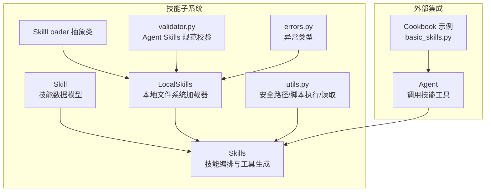
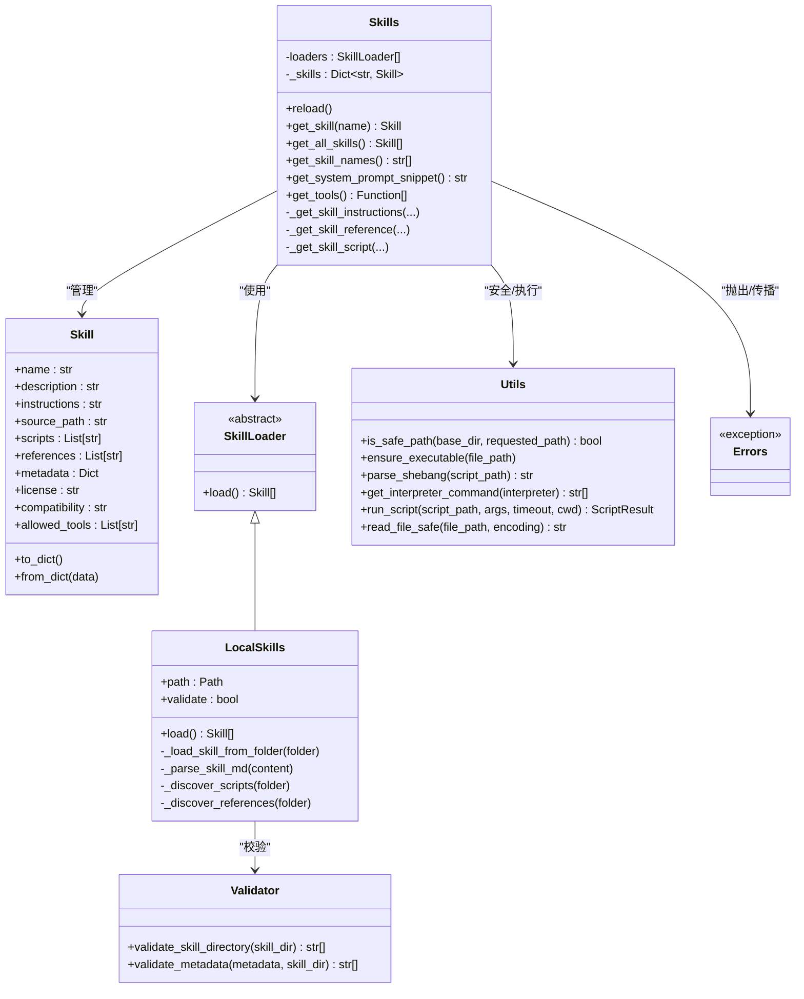
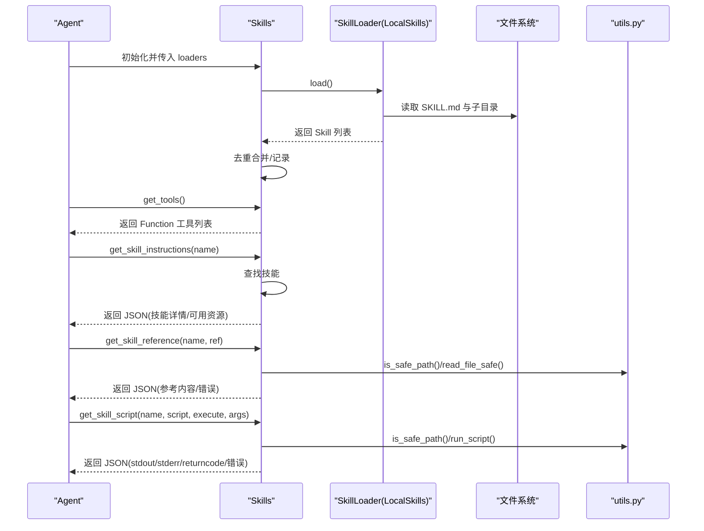
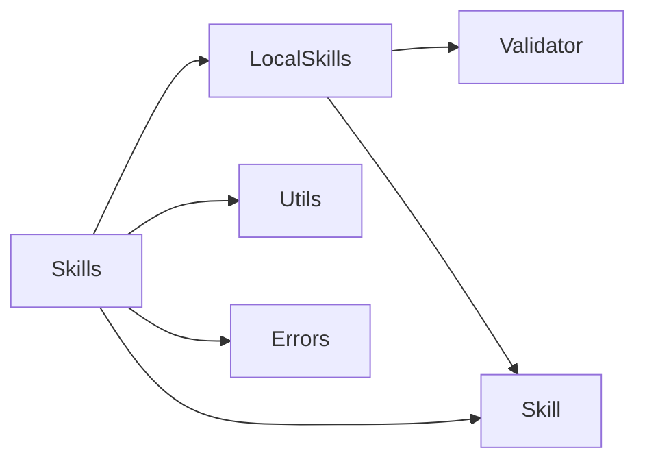
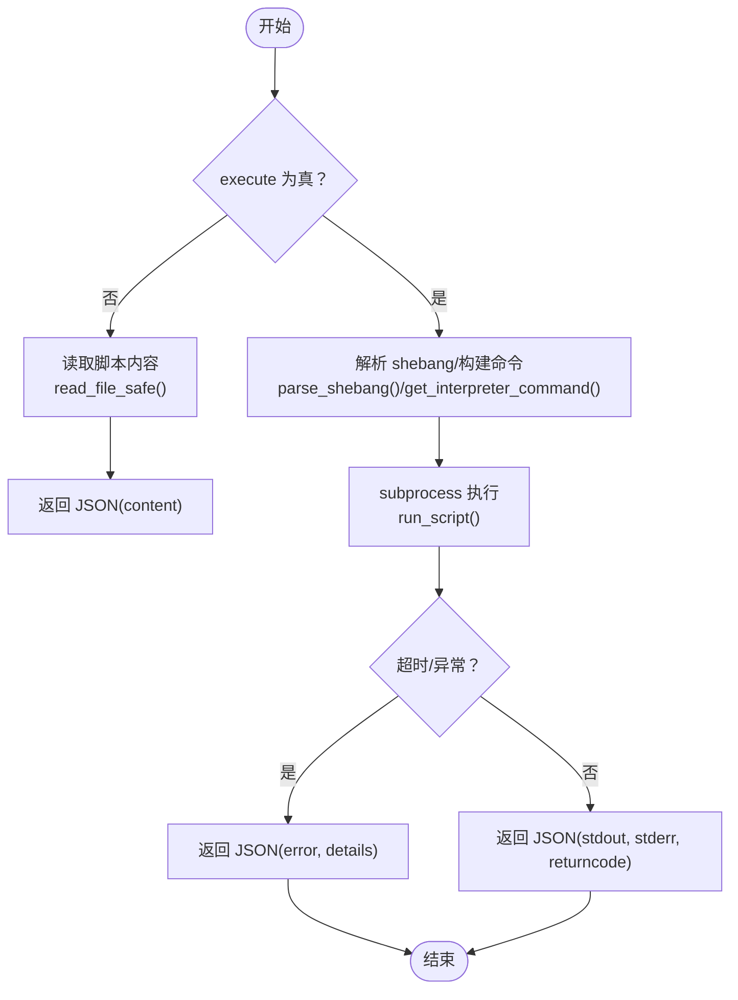

# 技能系统

<cite>
**本文引用的文件**
- [skill.py](file://libs/agno/agno/skills/skill.py)
- [agent_skills.py](file://libs/agno/agno/skills/agent_skills.py)
- [base.py](file://libs/agno/agno/skills/loaders/base.py)
- [local.py](file://libs/agno/agno/skills/loaders/local.py)
- [utils.py](file://libs/agno/agno/skills/utils.py)
- [validator.py](file://libs/agno/agno/skills/validator.py)
- [errors.py](file://libs/agno/agno/skills/errors.py)
- [basic_skills.py](file://cookbook/02_agents/16_skills/basic_skills.py)
- [test_skill.py](file://libs/agno/tests/unit/skills/test_skill.py)
- [test_agent_skills.py](file://libs/agno/tests/unit/skills/test_agent_skills.py)
</cite>

## 目录
1. [简介](#简介)
2. [项目结构](#项目结构)
3. [核心组件](#核心组件)
4. [架构总览](#架构总览)
5. [详细组件分析](#详细组件分析)
6. [依赖关系分析](#依赖关系分析)
7. [性能考虑](#性能考虑)
8. [故障排查指南](#故障排查指南)
9. [结论](#结论)
10. [附录](#附录)

## 简介
本文件系统性地阐述 AgentOS 技能系统的设计与实现，覆盖技能的定义、加载、管理与使用，包括内置技能与自定义技能的实现方式；详解技能注册、技能组合与技能优化策略；并结合 Cookbook 示例与单元测试，给出可操作的配置、调用与性能优化建议。读者将理解技能系统如何通过“工具化访问”隔离执行风险、通过“渐进式发现”降低认知负担，并通过“规范化的目录与元数据”保障可维护性与可扩展性。

## 项目结构
技能系统位于 agno 库的 skills 子模块中，围绕以下关键文件组织：
- 数据模型：Skill（技能实体）
- 加载器：SkillLoader 抽象类与 LocalSkills 实现
- 核心编排：Skills 类（技能注册、工具生成、系统提示片段）
- 工具函数：路径安全校验、脚本执行、读取等
- 校验规则：Agent Skills 规范校验
- 错误类型：统一异常体系
- 示例与测试：Cookbook 基础示例与单元测试

图表来源
- [skill.py:1-66](file://libs/agno/agno/skills/skill.py#L1-L66)
- [agent_skills.py:1-383](file://libs/agno/agno/skills/agent_skills.py#L1-L383)
- [base.py:1-28](file://libs/agno/agno/skills/loaders/base.py#L1-L28)
- [local.py:1-217](file://libs/agno/agno/skills/loaders/local.py#L1-L217)
- [utils.py:1-206](file://libs/agno/agno/skills/utils.py#L1-L206)
- [validator.py:1-278](file://libs/agno/agno/skills/validator.py#L1-L278)
- [errors.py:1-33](file://libs/agno/agno/skills/errors.py#L1-L33)
- [basic_skills.py:1-47](file://cookbook/02_agents/16_skills/basic_skills.py#L1-L47)

章节来源
- [skill.py:1-66](file://libs/agno/agno/skills/skill.py#L1-L66)
- [agent_skills.py:1-383](file://libs/agno/agno/skills/agent_skills.py#L1-L383)
- [base.py:1-28](file://libs/agno/agno/skills/loaders/base.py#L1-L28)
- [local.py:1-217](file://libs/agno/agno/skills/loaders/local.py#L1-L217)
- [utils.py:1-206](file://libs/agno/agno/skills/utils.py#L1-L206)
- [validator.py:1-278](file://libs/agno/agno/skills/validator.py#L1-L278)
- [errors.py:1-33](file://libs/agno/agno/skills/errors.py#L1-L33)
- [basic_skills.py:1-47](file://cookbook/02_agents/16_skills/basic_skills.py#L1-L47)

## 核心组件
- Skill：技能实体，包含名称、描述、指令正文、来源路径、脚本清单、参考清单、元数据、许可证、兼容性、允许使用的工具等字段，并提供字典序列化/反序列化能力。
- Skills：技能编排器，负责从多个加载器加载技能、去重合并、生成工具函数、构建系统提示片段、提供检索接口。
- SkillLoader 与 LocalSkills：抽象加载器与本地文件系统加载器，支持单技能目录或技能集合目录，解析 SKILL.md 的 YAML 前言与正文，发现 scripts 与 references 子目录。
- 工具函数：is_safe_path 防路径穿越、run_script 跨平台脚本执行、read_file_safe 安全读取、脚本解释器推断与命令构建。
- 校验规则：遵循 Agent Skills 规范，对名称、描述、兼容性、许可证、allowed-tools、metadata 字段进行格式与长度校验，并校验目录名与 name 匹配。
- 异常体系：SkillError 基类，SkillParseError 解析失败，SkillValidationError 校验失败（携带多条错误信息）。

章节来源
- [skill.py:1-66](file://libs/agno/agno/skills/skill.py#L1-L66)
- [agent_skills.py:1-383](file://libs/agno/agno/skills/agent_skills.py#L1-L383)
- [base.py:1-28](file://libs/agno/agno/skills/loaders/base.py#L1-L28)
- [local.py:1-217](file://libs/agno/agno/skills/loaders/local.py#L1-L217)
- [utils.py:1-206](file://libs/agno/agno/skills/utils.py#L1-L206)
- [validator.py:1-278](file://libs/agno/agno/skills/validator.py#L1-L278)
- [errors.py:1-33](file://libs/agno/agno/skills/errors.py#L1-L33)

## 架构总览
技能系统采用“加载器-编排器-工具”的分层架构：
- 加载器层：负责从不同来源（本地文件系统等）产出标准化的 Skill 对象。
- 编排层：Skills 统一管理技能集合，提供检索、系统提示生成、工具函数生成。
- 工具层：以 Function 形式的工具暴露给 Agent 使用，屏蔽直接文件系统访问与执行风险。
- 安全层：路径安全校验、脚本执行超时与返回码捕获、跨平台解释器识别。

图表来源
- [skill.py:1-66](file://libs/agno/agno/skills/skill.py#L1-L66)
- [agent_skills.py:1-383](file://libs/agno/agno/skills/agent_skills.py#L1-L383)
- [base.py:1-28](file://libs/agno/agno/skills/loaders/base.py#L1-L28)
- [local.py:1-217](file://libs/agno/agno/skills/loaders/local.py#L1-L217)
- [utils.py:1-206](file://libs/agno/agno/skills/utils.py#L1-L206)
- [validator.py:1-278](file://libs/agno/agno/skills/validator.py#L1-L278)
- [errors.py:1-33](file://libs/agno/agno/skills/errors.py#L1-L33)

## 详细组件分析

### 数据模型：Skill
- 字段语义明确，支持可选字段与默认值，便于灵活扩展。
- 提供 to_dict/from_dict，便于持久化与跨进程传输。
- 单元测试覆盖了最小字段、完整字段、序列化/反序列化一致性与相等性比较。

章节来源
- [skill.py:1-66](file://libs/agno/agno/skills/skill.py#L1-L66)
- [test_skill.py:1-191](file://libs/agno/tests/unit/skills/test_skill.py#L1-L191)

### 加载器：SkillLoader 与 LocalSkills
- 抽象基类定义统一接口，便于扩展远程/网络加载器。
- LocalSkills 支持两种模式：
  - 单技能目录：存在 SKILL.md 即视为技能根。
  - 多技能目录：遍历子目录，筛选含 SKILL.md 的目录作为技能。
- 解析 SKILL.md 的 YAML 前言与正文，提取 name、description、license、metadata、compatibility、allowed-tools 等字段。
- 自动发现 scripts 与 references 子目录中的文件列表。
- 可选严格校验：遵循 Agent Skills 规范，不满足即抛出 SkillValidationError。

章节来源
- [base.py:1-28](file://libs/agno/agno/skills/loaders/base.py#L1-L28)
- [local.py:1-217](file://libs/agno/agno/skills/loaders/local.py#L1-L217)
- [validator.py:1-278](file://libs/agno/agno/skills/validator.py#L1-L278)
- [errors.py:1-33](file://libs/agno/agno/skills/errors.py#L1-L33)

### 核心编排：Skills
- 初始化即“急加载”，从所有加载器收集技能，重复名称后者覆盖前者。
- 提供检索接口：按名称获取、列出全部、列出名称。
- 生成系统提示片段：以 XML 片段形式输出可用技能摘要与使用指引，避免泄露详细 instructions。
- 工具生成：生成三个 Function 工具：
  - get_skill_instructions：按需加载技能的完整 instructions 与元数据。
  - get_skill_reference：安全读取 references 下的参考文档。
  - get_skill_script：读取或执行 scripts 下的脚本，支持参数与超时控制。
- 执行安全：
  - 路径安全校验防止路径穿越。
  - 脚本执行在 Windows 上解析 shebang 并显式调用解释器；Unix 上确保可执行位。
  - 捕获超时、找不到解释器/脚本、执行错误等异常并返回结构化错误信息。

图表来源
- [agent_skills.py:1-383](file://libs/agno/agno/skills/agent_skills.py#L1-L383)
- [local.py:1-217](file://libs/agno/agno/skills/loaders/local.py#L1-L217)
- [utils.py:1-206](file://libs/agno/agno/skills/utils.py#L1-L206)

章节来源
- [agent_skills.py:1-383](file://libs/agno/agno/skills/agent_skills.py#L1-L383)
- [test_agent_skills.py:1-563](file://libs/agno/tests/unit/skills/test_agent_skills.py#L1-L563)

### 工具函数与安全
- is_safe_path：基于路径解析与相对性判断，阻断路径穿越。
- run_script：跨平台脚本执行，自动处理 shebang 与解释器映射，捕获超时与错误。
- read_file_safe：统一编码读取，避免乱码与权限问题。
- ensure_executable/parse_shebang/get_interpreter_command：保证 Unix 可执行位与 Windows 解释器识别。

章节来源
- [utils.py:1-206](file://libs/agno/agno/skills/utils.py#L1-L206)

### 校验规则与错误处理
- validator.py：严格遵循 Agent Skills 规范，校验字段类型、长度、命名规则、目录名匹配等。
- errors.py：统一异常类型，支持多错误聚合显示，便于调试与自动化处理。

章节来源
- [validator.py:1-278](file://libs/agno/agno/skills/validator.py#L1-L278)
- [errors.py:1-33](file://libs/agno/agno/skills/errors.py#L1-L33)

### 使用示例与最佳实践
- Cookbook 基础示例展示了如何创建 Agent 并注入 Skills，加载本地技能目录，随后发起任务请求。
- 最佳实践：
  - 将技能按领域拆分为独立目录，每个目录包含 SKILL.md 与可选的 scripts/references。
  - 在 SKILL.md 中使用 YAML 前言声明 name、description、license、metadata、compatibility、allowed-tools。
  - 仅在需要时调用 get_skill_instructions，减少上下文开销。
  - 使用 get_skill_reference 获取参考文档，使用 get_skill_script 读取或执行脚本。
  - 为脚本添加 shebang 以便跨平台执行；必要时在 Windows 环境安装对应解释器。

章节来源
- [basic_skills.py:1-47](file://cookbook/02_agents/16_skills/basic_skills.py#L1-L47)

## 依赖关系分析
- 组件内聚高：Skills 与工具函数紧密协作，形成“加载-编排-工具-安全”的闭环。
- 组件耦合清晰：通过 SkillLoader 抽象解耦不同来源；通过工具函数封装安全与执行细节。
- 外部依赖：
  - yaml（可选，用于解析 SKILL.md 前言）。
  - subprocess（执行脚本）。
  - platform/sys/os/stat（跨平台与权限处理）。

图表来源
- [local.py:1-217](file://libs/agno/agno/skills/loaders/local.py#L1-L217)
- [validator.py:1-278](file://libs/agno/agno/skills/validator.py#L1-L278)
- [agent_skills.py:1-383](file://libs/agno/agno/skills/agent_skills.py#L1-L383)
- [utils.py:1-206](file://libs/agno/agno/skills/utils.py#L1-L206)
- [errors.py:1-33](file://libs/agno/agno/skills/errors.py#L1-L33)

章节来源
- [local.py:1-217](file://libs/agno/agno/skills/loaders/local.py#L1-L217)
- [validator.py:1-278](file://libs/agno/agno/skills/validator.py#L1-L278)
- [agent_skills.py:1-383](file://libs/agno/agno/skills/agent_skills.py#L1-L383)
- [utils.py:1-206](file://libs/agno/agno/skills/utils.py#L1-L206)
- [errors.py:1-33](file://libs/agno/agno/skills/errors.py#L1-L33)

## 性能考虑
- 加载阶段：
  - 本地加载为 O(N)（N 为技能数量），主要开销在文件系统扫描与 YAML 解析。
  - 建议：将技能目录结构扁平化，避免深层嵌套；仅启用必要的加载器。
- 运行阶段：
  - get_skill_instructions 仅在需要时触发，避免一次性加载大量 instructions。
  - get_skill_reference/get_skill_script 采用延迟读取/执行，减少内存占用。
  - 脚本执行设置合理超时，避免长时间阻塞。
- 缓存与复用：
  - 可在应用层缓存已读取的 references 内容，减少重复 IO。
  - 对于频繁调用的脚本，建议预热解释器环境。

## 故障排查指南
- 校验失败（SkillValidationError）：
  - 检查 SKILL.md 是否以 YAML 前言开头与闭合，字段是否符合规范。
  - 确认目录名与 name 是否一致，名称是否包含非法字符或连续连字符。
- 路径穿越与权限问题：
  - 确保 requested_path 未包含 “../” 等越界片段；检查 references/scripts 子目录权限。
- 脚本执行失败：
  - 检查 shebang 是否正确；Windows 环境下确认解释器在 PATH 中。
  - 关注超时与非零返回码；查看 stderr 输出定位错误。
- 工具调用返回错误：
  - 根据返回的 JSON 中的 error 字段与 available_* 列表修正调用参数或技能名称。

章节来源
- [test_agent_skills.py:1-563](file://libs/agno/tests/unit/skills/test_agent_skills.py#L1-L563)
- [utils.py:1-206](file://libs/agno/agno/skills/utils.py#L1-L206)
- [validator.py:1-278](file://libs/agno/agno/skills/validator.py#L1-L278)

## 结论
AgentOS 技能系统通过“规范化目录结构 + YAML 前言 + 工具化访问 + 安全执行”的设计，实现了可维护、可扩展、可审计的技能库。它既支持内置技能的快速接入，也允许用户以最小成本扩展自定义技能；通过系统提示片段与工具函数，帮助 Agent 以“渐进式发现”的方式高效利用技能，同时将执行风险降到最低。建议在生产环境中启用严格校验、合理设置超时、完善监控与日志，持续优化技能目录与工具链。

## 附录

### 技能目录规范（Agent Skills 规范要点）
- 必备文件：SKILL.md（前言必须以 YAML 三短横线包裹）。
- 前言字段（示例）：name、description、license、allowed-tools、metadata、compatibility。
- 目录与名称：目录名需与 name 一致。
- 其他：scripts 与 references 子目录可选，包含可执行脚本与参考文档。

章节来源
- [validator.py:1-278](file://libs/agno/agno/skills/validator.py#L1-L278)
- [local.py:1-217](file://libs/agno/agno/skills/loaders/local.py#L1-L217)

### 工具函数调用流程（脚本执行）

图表来源
- [agent_skills.py:272-383](file://libs/agno/agno/skills/agent_skills.py#L272-L383)
- [utils.py:144-187](file://libs/agno/agno/skills/utils.py#L144-L187)