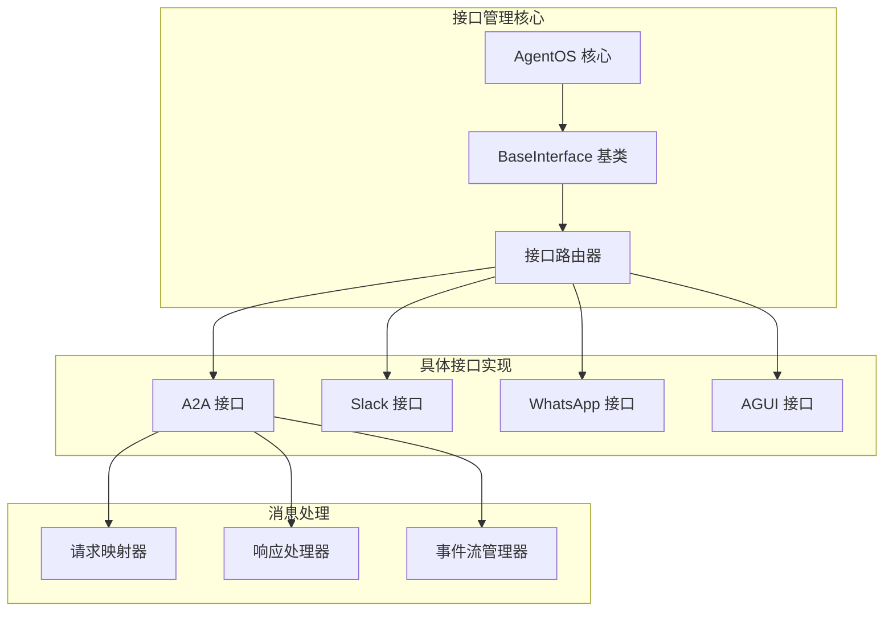
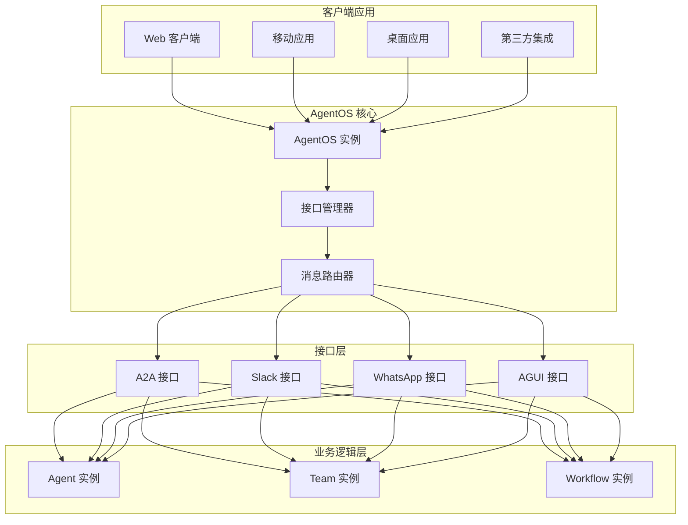
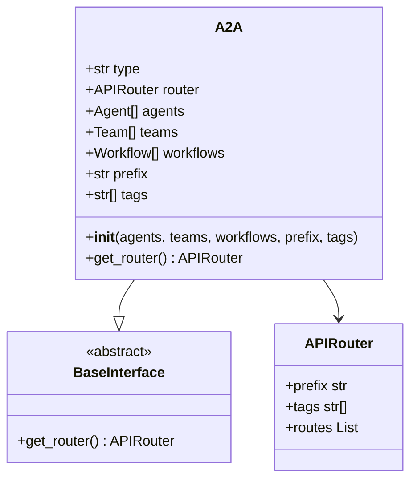
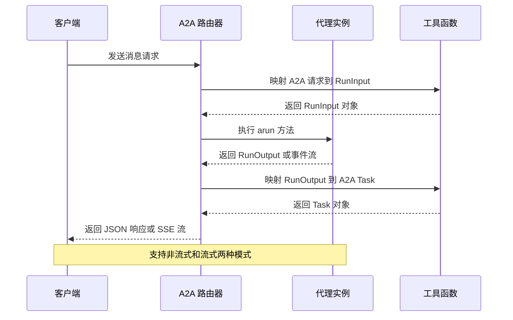
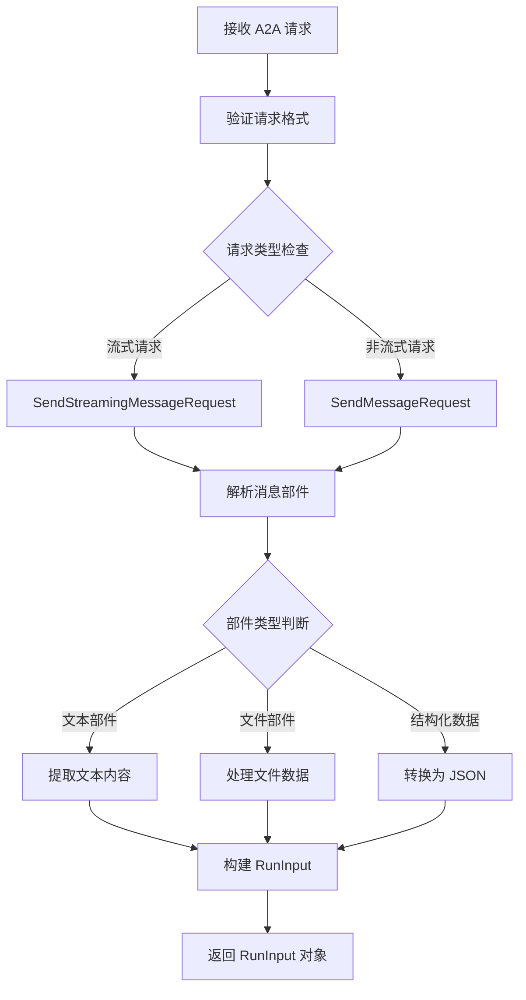
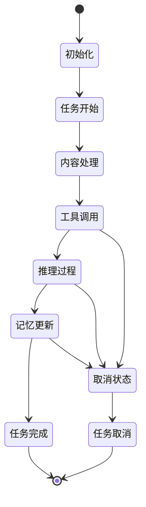
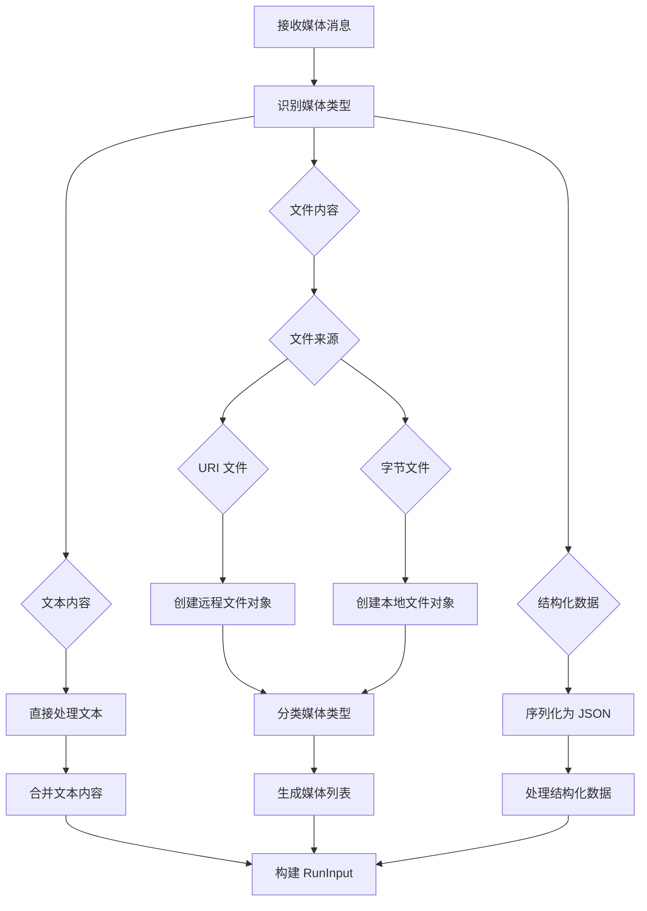
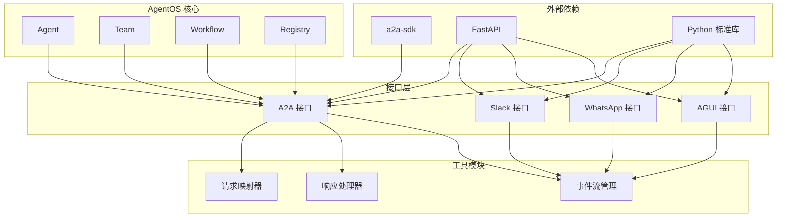

# 接口管理

<cite>
**本文档引用的文件**
- [all_interfaces.py](file://cookbook/05_agent_os/interfaces/all_interfaces.py)
- [README.md](file://cookbook/05_agent_os/interfaces/README.md)
- [a2a/basic.py](file://cookbook/05_agent_os/interfaces/a2a/basic.py)
- [agui/basic.py](file://cookbook/05_agent_os/interfaces/agui/basic.py)
- [slack/basic.py](file://cookbook/05_agent_os/interfaces/slack/basic.py)
- [whatsapp/basic.py](file://cookbook/05_agent_os/interfaces/whatsapp/basic.py)
- [a2a.py](file://libs/agno/agno/os/interfaces/a2a/a2a.py)
- [router.py](file://libs/agno/agno/os/interfaces/a2a/router.py)
- [utils.py](file://libs/agno/agno/os/interfaces/a2a/utils.py)
</cite>

## 目录
1. [简介](#简介)
2. [项目结构](#项目结构)
3. [核心组件](#核心组件)
4. [架构概览](#架构概览)
5. [详细组件分析](#详细组件分析)
6. [依赖关系分析](#依赖关系分析)
7. [性能考虑](#性能考虑)
8. [故障排除指南](#故障排除指南)
9. [结论](#结论)

## 简介

AgentOS 接口管理是该平台的核心功能模块，负责统一管理和协调各种用户界面和通信接口。本文档深入介绍了 A2A 接口、Slack 集成、WhatsApp 集成和 AGUI 界面的实现原理和使用方法。

AgentOS 接口管理的主要目标是：
- 提供统一的接口抽象层，支持多种通信协议
- 实现标准化的消息处理和用户交互流程
- 支持多模态输入输出（文本、图像、音频、视频）
- 提供可扩展的接口架构，便于添加新的接口类型

## 项目结构

AgentOS 接口管理模块采用分层架构设计，主要包含以下结构：

**图表来源**
- [all_interfaces.py:88-107](file://cookbook/05_agent_os/interfaces/all_interfaces.py#L88-L107)
- [a2a.py:16-44](file://libs/agno/agno/os/interfaces/a2a/a2a.py#L16-L44)

**章节来源**
- [README.md:1-12](file://cookbook/05_agent_os/interfaces/README.md#L1-L12)
- [all_interfaces.py:1-117](file://cookbook/05_agent_os/interfaces/all_interfaces.py#L1-L117)

## 核心组件

### A2A 接口系统

A2A（Agent-to-Agent）接口是 AgentOS 的核心通信协议，实现了标准化的代理间通信规范。

#### 主要特性
- **标准化协议**：基于 A2A SDK 规范实现
- **多实体支持**：支持 Agent、Team 和 Workflow
- **流式处理**：支持实时消息流和事件推送
- **任务管理**：完整的任务生命周期管理

#### 关键接口方法
- `/agents/{id}/v1/message:send` - 非流式消息发送
- `/agents/{id}/v1/message:stream` - 流式消息处理
- `/agents/{id}/v1/tasks:get` - 任务状态查询
- `/agents/{id}/v1/tasks:cancel` - 任务取消

**章节来源**
- [a2a.py:16-44](file://libs/agno/agno/os/interfaces/a2a/a2a.py#L16-L44)
- [router.py:37-800](file://libs/agno/agno/os/interfaces/a2a/router.py#L37-L800)

### Slack 集成

Slack 接口提供了与 Slack 平台的深度集成，支持机器人消息处理和用户交互。

#### 核心功能
- **提及响应**：仅响应包含机器人提及的消息
- **会话持久化**：使用 SQLite 存储对话历史
- **上下文管理**：自动添加时间戳和历史记录到提示词
- **权限控制**：支持多种 Slack 权限范围

#### 配置选项
- `reply_to_mentions_only`：是否仅响应提及
- `add_history_to_context`：是否将历史添加到上下文
- `num_history_runs`：历史运行次数
- `add_datetime_to_context`：是否添加时间信息

**章节来源**
- [slack/basic.py:1-62](file://cookbook/05_agent_os/interfaces/slack/basic.py#L1-L62)

### WhatsApp 集成

WhatsApp 接口实现了与 WhatsApp Business API 的集成，支持多媒体消息处理。

#### 支持的媒体类型
- **文本消息**：标准文本回复
- **图片**：支持 JPEG、PNG 等格式
- **视频**：支持 MP4、AVI 等格式
- **音频**：支持 MP3、WAV 等格式
- **文件**：支持 PDF、DOC 等文档格式

#### 配置特点
- **会话存储**：使用 SQLite 进行持久化
- **历史记录**：自动维护对话历史
- **Markdown 支持**：支持富文本格式
- **多模态输入**：支持混合媒体输入

**章节来源**
- [whatsapp/basic.py:1-50](file://cookbook/05_agent_os/interfaces/whatsapp/basic.py#L1-L50)

### AGUI 界面

AGUI（Agent Graphical User Interface）提供了直观的图形用户界面，支持可视化代理操作。

#### 主要功能
- **实时预览**：显示代理运行状态
- **交互控制**：提供用户友好的操作界面
- **配置管理**：支持代理参数的动态调整
- **调试工具**：内置开发和调试功能

#### 技术特点
- **端口配置**：默认运行在 9001 端口
- **配置查看**：通过 `/config` 端点查看系统配置
- **热重载**：支持开发时的代码热更新

**章节来源**
- [agui/basic.py:1-45](file://cookbook/05_agent_os/interfaces/agui/basic.py#L1-L45)

## 架构概览

AgentOS 接口管理采用模块化架构设计，实现了高度解耦和可扩展的接口系统。

**图表来源**
- [all_interfaces.py:96-107](file://cookbook/05_agent_os/interfaces/all_interfaces.py#L96-L107)
- [router.py:37-800](file://libs/agno/agno/os/interfaces/a2a/router.py#L37-L800)

## 详细组件分析

### A2A 接口实现详解

A2A 接口是 AgentOS 的标准化通信协议，实现了完整的代理间通信规范。

#### 类结构设计

**图表来源**
- [a2a.py:16-44](file://libs/agno/agno/os/interfaces/a2a/a2a.py#L16-L44)

#### 消息处理流程

**图表来源**
- [router.py:113-184](file://libs/agno/agno/os/interfaces/a2a/router.py#L113-L184)
- [utils.py:86-178](file://libs/agno/agno/os/interfaces/a2a/utils.py#L86-L178)

#### 请求映射机制

A2A 接口实现了复杂的请求映射机制，支持多种媒体类型的处理：

**图表来源**
- [utils.py:86-178](file://libs/agno/agno/os/interfaces/a2a/utils.py#L86-L178)

**章节来源**
- [a2a.py:16-44](file://libs/agno/agno/os/interfaces/a2a/a2a.py#L16-L44)
- [router.py:37-800](file://libs/agno/agno/os/interfaces/a2a/router.py#L37-L800)
- [utils.py:1-942](file://libs/agno/agno/os/interfaces/a2a/utils.py#L1-L942)

### 消息路由和状态管理

A2A 接口实现了完整的消息路由和状态管理系统，支持复杂的异步处理流程。

#### 事件流处理

**图表来源**
- [utils.py:304-800](file://libs/agno/agno/os/interfaces/a2a/utils.py#L304-L800)

#### 状态映射机制

A2A 接口将内部运行状态映射到标准化的任务状态：

| Agno 状态 | A2A 任务状态 | 描述 |
|-----------|--------------|------|
| pending | submitted | 任务已提交等待执行 |
| running | working | 任务正在执行中 |
| completed | completed | 任务执行完成 |
| error | failed | 任务执行失败 |
| cancelled | canceled | 任务被取消 |
| paused | working | 任务暂停状态 |

**章节来源**
- [utils.py:180-193](file://libs/agno/agno/os/interfaces/a2a/utils.py#L180-L193)

### 多模态消息处理

A2A 接口支持多种媒体类型的处理，实现了完整的多模态消息系统。

#### 媒体类型处理流程

**图表来源**
- [utils.py:132-177](file://libs/agno/agno/os/interfaces/a2a/utils.py#L132-L177)

**章节来源**
- [utils.py:132-177](file://libs/agno/agno/os/interfaces/a2a/utils.py#L132-L177)

## 依赖关系分析

AgentOS 接口管理模块具有清晰的依赖层次结构，实现了良好的模块化设计。

**图表来源**
- [router.py:11-34](file://libs/agno/agno/os/interfaces/a2a/router.py#L11-L34)
- [a2a.py:8-14](file://libs/agno/agno/os/interfaces/a2a/a2a.py#L8-L14)

### 组件耦合度分析

| 组件 | 内聚性 | 耦合度 | 设计质量 |
|------|--------|--------|----------|
| A2A 接口 | 高 | 中等 | 优秀 |
| Slack 接口 | 中等 | 低 | 良好 |
| WhatsApp 接口 | 中等 | 低 | 良好 |
| AGUI 接口 | 中等 | 低 | 良好 |
| 请求映射器 | 高 | 高 | 优秀 |

**章节来源**
- [router.py:11-34](file://libs/agno/agno/os/interfaces/a2a/router.py#L11-L34)
- [a2a.py:8-14](file://libs/agno/agno/os/interfaces/a2a/a2a.py#L8-L14)

## 性能考虑

AgentOS 接口管理在设计时充分考虑了性能优化，采用了多种策略来提升系统的响应速度和吞吐量。

### 流式处理优化

A2A 接口实现了高效的流式处理机制，通过以下方式优化性能：

- **事件驱动架构**：使用异步事件流减少内存占用
- **增量响应**：实时传输中间结果，避免长时间等待
- **并行处理**：支持多个并发请求的独立处理
- **资源池管理**：复用连接和资源，减少创建开销

### 缓存策略

接口层实现了多层次的缓存机制：

- **会话缓存**：缓存活跃会话的状态信息
- **媒体缓存**：缓存常用的媒体文件和资源
- **配置缓存**：缓存接口配置和元数据
- **响应缓存**：缓存重复的计算结果

### 错误处理和恢复

系统实现了完善的错误处理机制：

- **优雅降级**：在网络异常时提供基本功能
- **超时控制**：设置合理的超时阈值防止资源泄露
- **重试机制**：对临时性错误进行自动重试
- **监控告警**：实时监控系统状态并及时告警

## 故障排除指南

### 常见问题诊断

#### A2A 接口问题

**问题症状**：A2A 接口无法启动或响应超时

**诊断步骤**：
1. 检查 `a2a-sdk` 依赖是否正确安装
2. 验证 Agent、Team 或 Workflow 实例是否正确初始化
3. 确认路由前缀和标签配置是否正确
4. 检查网络连接和端口占用情况

**解决方案**：
- 安装缺失的依赖包：`pip install -U a2a-sdk`
- 验证接口实例的构造参数
- 检查防火墙和安全组设置
- 查看详细的错误日志信息

#### Slack 集成问题

**问题症状**：Slack 机器人无法接收消息或响应错误

**诊断步骤**：
1. 验证 Slack Bot Token 是否有效
2. 检查必要的 OAuth Scopes 是否已授权
3. 确认机器人是否已添加到目标频道
4. 验证消息过滤规则配置

**解决方案**：
- 重新安装和授权 Slack 应用
- 更新权限范围并重新授权
- 检查频道成员和权限设置
- 调整消息处理逻辑

#### WhatsApp 集成问题

**问题症状**：WhatsApp 消息处理异常或媒体文件传输失败

**诊断步骤**：
1. 检查 WhatsApp Business API 凭据
2. 验证会话存储配置
3. 确认媒体文件格式支持
4. 检查网络连接和带宽限制

**解决方案**：
- 更新有效的 API 凭据
- 配置正确的数据库连接
- 支持更多媒体格式或转换文件
- 优化网络配置和带宽分配

#### AGUI 界面问题

**问题症状**：AGUI 界面无法访问或功能异常

**诊断步骤**：
1. 检查端口 9001 是否被占用
2. 验证静态文件服务配置
3. 确认浏览器兼容性
4. 检查跨域资源共享设置

**解决方案**：
- 更改 AGUI 端口配置
- 修复静态文件路径配置
- 更新浏览器版本或使用兼容模式
- 配置正确的 CORS 规则

**章节来源**
- [router.py:21-22](file://libs/agno/agno/os/interfaces/a2a/router.py#L21-L22)
- [router.py:162-184](file://libs/agno/agno/os/interfaces/a2a/router.py#L162-L184)

## 结论

AgentOS 接口管理模块展现了优秀的软件架构设计，通过模块化和标准化的方法实现了多种接口类型的统一管理。该系统的主要优势包括：

### 设计优势

1. **高度模块化**：每个接口都是独立的模块，便于维护和扩展
2. **标准化协议**：A2A 接口实现了行业标准的通信协议
3. **多模态支持**：全面支持文本、图像、音频、视频等多种媒体类型
4. **异步处理**：采用事件驱动架构，支持高并发和实时响应

### 扩展性特点

- **插件化架构**：新的接口类型可以轻松添加到现有框架中
- **配置驱动**：通过配置文件即可启用或禁用特定功能
- **API 兼容**：遵循标准 API 规范，便于第三方集成
- **云原生支持**：支持容器化部署和微服务架构

### 最佳实践建议

1. **接口选择**：根据应用场景选择合适的接口类型
2. **性能优化**：合理配置缓存和资源池参数
3. **监控告警**：建立完善的监控和告警机制
4. **安全防护**：实施多层次的安全防护措施
5. **文档维护**：保持接口文档的及时更新

通过持续的优化和改进，AgentOS 接口管理模块将继续为用户提供强大而灵活的接口管理能力，支持各种复杂的代理应用需求。