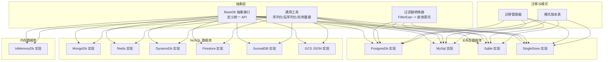
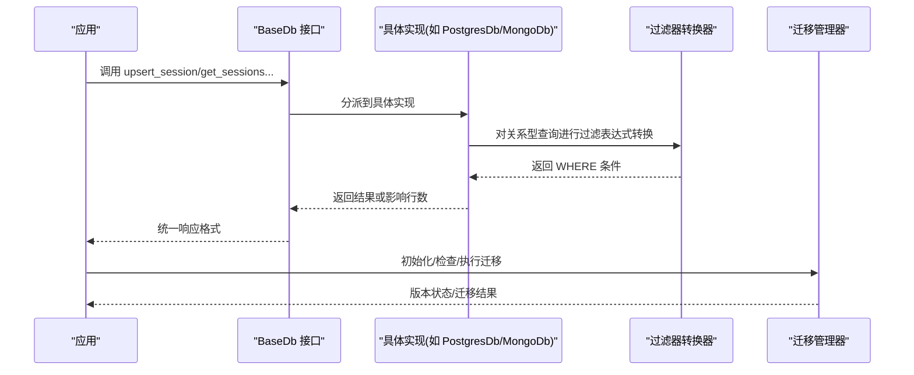
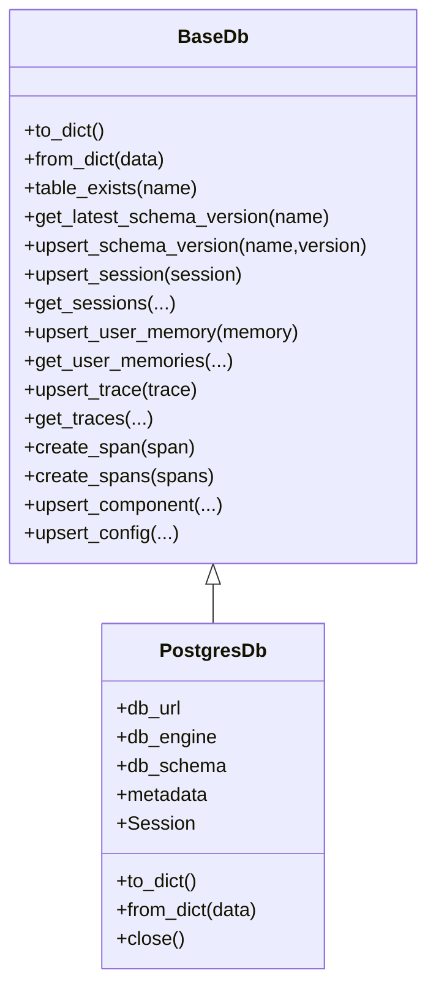
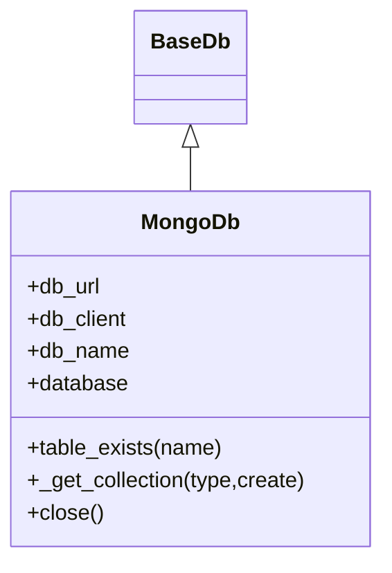
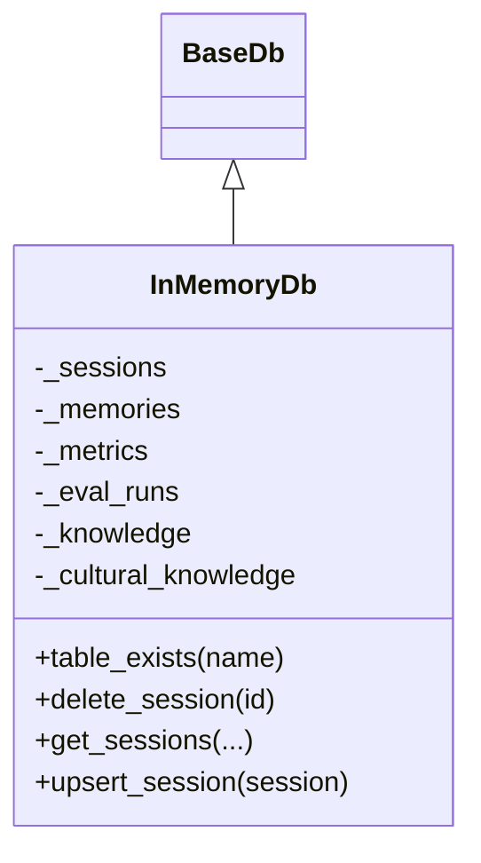
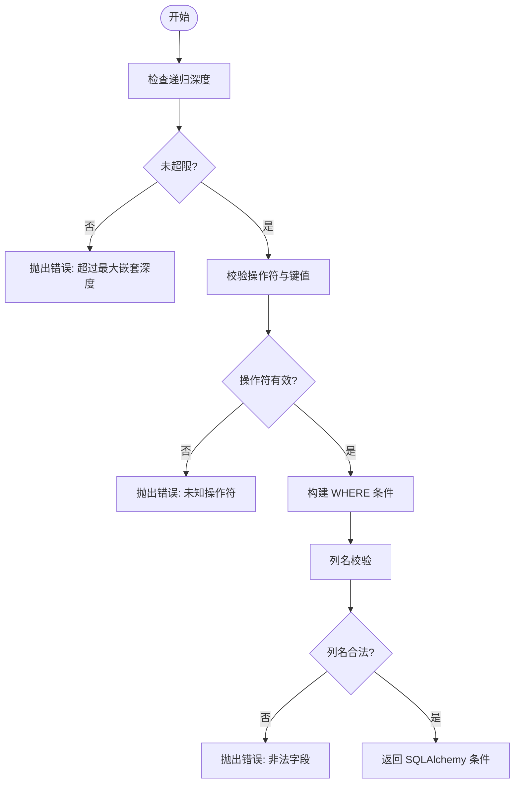
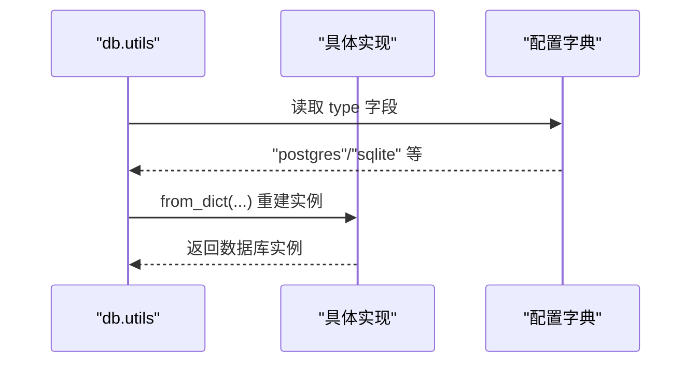
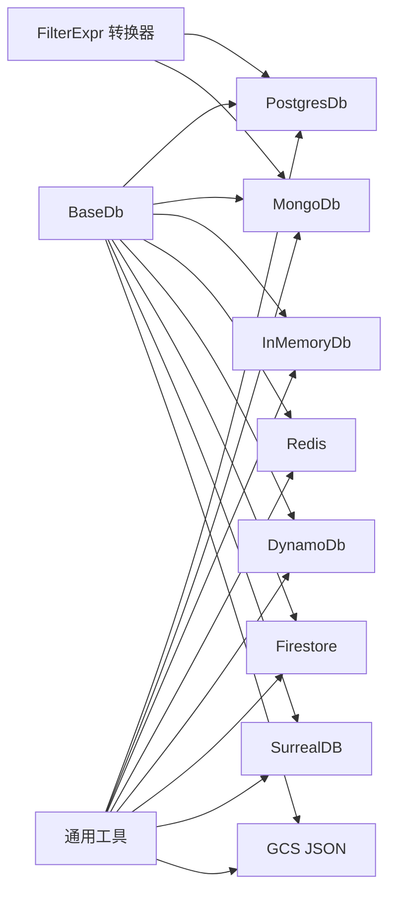

# 数据库集成

<cite>
**本文引用的文件**
- [libs/agno/agno/db/base.py](file://libs/agno/agno/db/base.py)
- [libs/agno/agno/db/utils.py](file://libs/agno/agno/db/utils.py)
- [libs/agno/agno/db/filter_converter.py](file://libs/agno/agno/db/filter_converter.py)
- [libs/agno/agno/db/postgres/postgres.py](file://libs/agno/agno/db/postgres/postgres.py)
- [libs/agno/agno/db/mongo/mongo.py](file://libs/agno/agno/db/mongo/mongo.py)
- [libs/agno/agno/db/in_memory/in_memory_db.py](file://libs/agno/agno/db/in_memory/in_memory_db.py)
- [libs/agno/agno/db/schemas/__init__.py](file://libs/agno/agno/db/schemas/__init__.py)
- [libs/agno/migrations/v1_to_v2/migrate_vectordbs_to_v2.py](file://libs/agno/migrations/v1_to_v2/migrate_vectordbs_to_v2.py)
- [cookbook/01_demo/db.py](file://cookbook/01_demo/db.py)
- [cookbook/05_agent_os/dbs/agentos_default_db.py](file://cookbook/05_agent_os/dbs/agentos_default_db.py)
- [cookbook/05_agent_os/dbs/json_db.py](file://cookbook/05_agent_os/dbs/json_db.py)
- [cookbook/05_agent_os/dbs/redis_db.py](file://cookbook/05_agent_os/dbs/redis_db.py)
- [cookbook/05_agent_os/dbs/surreal_db/db.py](file://cookbook/05_agent_os/dbs/surreal_db/db.py)
- [cookbook/05_agent_os/tracing/dbs/basic_agent_with_postgresdb.py](file://cookbook/05_agent_os/tracing/dbs/basic_agent_with_postgresdb.py)
- [cookbook/05_agent_os/tracing/dbs/basic_agent_with_mongodb.py](file://cookbook/05_agent_os/tracing/dbs/basic_agent_with_mongodb.py)
- [cookbook/06_storage/mongo/mongodb_for_agent.py](file://cookbook/06_storage/mongo/mongodb_for_agent.py)
- [cookbook/06_storage/surrealdb/surrealdb_for_agent.py](file://cookbook/06_storage/surrealdb/surrealdb_for_agent.py)
</cite>

## 目录
1. [简介](#简介)
2. [项目结构](#项目结构)
3. [核心组件](#核心组件)
4. [架构总览](#架构总览)
5. [详细组件分析](#详细组件分析)
6. [依赖分析](#依赖分析)
7. [性能考量](#性能考量)
8. [故障排查指南](#故障排查指南)
9. [结论](#结论)
10. [附录](#附录)

## 简介
本文件系统性梳理 AgentOS 的数据库集成能力，覆盖关系型数据库（PostgreSQL、MySQL、SQLite、SingleStore）、NoSQL 数据库（MongoDB、Redis、DynamoDB、Firestore、SurrealDB、GCS JSON）与内存数据库（In-Memory），并深入讲解连接池管理、数据迁移与版本控制、事务处理、过滤器转换、序列化与反序列化、以及安全与备份恢复等主题。文档同时提供可直接定位到源码路径的示例，帮助读者快速上手。

## 项目结构
AgentOS 将数据库抽象定义在统一接口中，并针对不同后端提供具体实现；迁移与工具函数位于独立模块，示例与教程位于 cookbook 中。

图示来源
- [libs/agno/agno/db/base.py:30-800](file://libs/agno/agno/db/base.py#L30-L800)
- [libs/agno/agno/db/filter_converter.py:1-145](file://libs/agno/agno/db/filter_converter.py#L1-L145)
- [libs/agno/agno/db/utils.py:166-196](file://libs/agno/agno/db/utils.py#L166-L196)
- [libs/agno/agno/db/postgres/postgres.py:60-200](file://libs/agno/agno/db/postgres/postgres.py#L60-L200)
- [libs/agno/agno/db/mongo/mongo.py:48-200](file://libs/agno/agno/db/mongo/mongo.py#L48-L200)
- [libs/agno/agno/db/in_memory/in_memory_db.py:27-200](file://libs/agno/agno/db/in_memory/in_memory_db.py#L27-L200)

章节来源
- [libs/agno/agno/db/base.py:30-800](file://libs/agno/agno/db/base.py#L30-L800)
- [libs/agno/agno/db/filter_converter.py:1-145](file://libs/agno/agno/db/filter_converter.py#L1-L145)
- [libs/agno/agno/db/utils.py:166-196](file://libs/agno/agno/db/utils.py#L166-L196)

## 核心组件
- 统一抽象接口：所有数据库实现均继承自 BaseDb，提供会话、记忆、指标、评估、知识、文化知识、追踪与跨度、组件与配置等一致的 CRUD 与查询 API。
- 过滤器转换器：将通用 FilterExpr 转换为 SQLAlchemy 可用的 WHERE 条件，支持 AND/OR/NOT、比较与包含等操作。
- 通用工具：JSON 序列化编码器、字段序列化/反序列化、从字典重建数据库实例等。
- 具体实现：Postgres、Mongo、InMemory 等，分别面向生产级关系型、文档型与内存场景。
- 迁移与版本：迁移管理器与版本表，确保模式演进与兼容。

章节来源
- [libs/agno/agno/db/base.py:30-800](file://libs/agno/agno/db/base.py#L30-L800)
- [libs/agno/agno/db/filter_converter.py:1-145](file://libs/agno/agno/db/filter_converter.py#L1-L145)
- [libs/agno/agno/db/utils.py:16-196](file://libs/agno/agno/db/utils.py#L16-L196)

## 架构总览
下图展示了 AgentOS 数据库层的整体交互：应用通过统一接口调用，具体实现根据后端类型执行；过滤器转换器用于关系型数据库的复杂查询；迁移管理器负责模式升级。

图示来源
- [libs/agno/agno/db/base.py:149-800](file://libs/agno/agno/db/base.py#L149-L800)
- [libs/agno/agno/db/filter_converter.py:47-145](file://libs/agno/agno/db/filter_converter.py#L47-L145)
- [libs/agno/agno/db/postgres/postgres.py:60-200](file://libs/agno/agno/db/postgres/postgres.py#L60-L200)
- [libs/agno/agno/db/mongo/mongo.py:48-200](file://libs/agno/agno/db/mongo/mongo.py#L48-L200)

## 详细组件分析

### 关系型数据库：PostgreSQL
- 连接与引擎
  - 支持传入已有的 SQLAlchemy Engine 或通过数据库 URL 创建引擎。
  - 默认启用 pool_pre_ping 与 pool_recycle，提升连接稳定性。
  - 使用自定义 JSON 编码器处理日期、时间、UUID、消息与指标对象。
- 模式与表
  - 通过元数据与模式名组织表；可选择自动创建模式与表。
  - 提供表存在性检查、批量插入、分页排序、统计计算等。
- 过滤与查询
  - 借助过滤器转换器将 FilterExpr 转为 SQLAlchemy WHERE 子句。
- 迁移与版本
  - 使用迁移管理器与版本表记录模式版本，保障升级一致性。

图示来源
- [libs/agno/agno/db/base.py:30-800](file://libs/agno/agno/db/base.py#L30-L800)
- [libs/agno/agno/db/postgres/postgres.py:60-200](file://libs/agno/agno/db/postgres/postgres.py#L60-L200)

章节来源
- [libs/agno/agno/db/postgres/postgres.py:60-200](file://libs/agno/agno/db/postgres/postgres.py#L60-L200)
- [libs/agno/agno/db/utils.py:37-101](file://libs/agno/agno/db/utils.py#L37-L101)

### 文档型数据库：MongoDB
- 客户端与集合
  - 支持传入已有的 MongoClient 或通过数据库 URL 创建客户端。
  - 通过集合名管理 sessions、memories、metrics、evals、knowledge、culture、traces、spans 等。
  - 首次访问时惰性创建集合并建立索引。
- 过滤与分页
  - 提供排序、分页、日期范围与多字段过滤。
- 序列化
  - 使用通用工具对文化知识等对象进行序列化/反序列化。

图示来源
- [libs/agno/agno/db/mongo/mongo.py:48-200](file://libs/agno/agno/db/mongo/mongo.py#L48-L200)
- [libs/agno/agno/db/base.py:30-800](file://libs/agno/agno/db/base.py#L30-L800)

章节来源
- [libs/agno/agno/db/mongo/mongo.py:48-200](file://libs/agno/agno/db/mongo/mongo.py#L48-L200)

### 内存数据库：InMemoryDb
- 存储结构
  - 使用内存列表存储会话、记忆、指标、评估、知识、文化知识等。
- 行为特征
  - table_exists 总返回真；适合测试与临时场景。
  - 提供删除单条/批量、按条件过滤、分页与排序、反序列化等。

图示来源
- [libs/agno/agno/db/in_memory/in_memory_db.py:27-200](file://libs/agno/agno/db/in_memory/in_memory_db.py#L27-L200)
- [libs/agno/agno/db/base.py:30-800](file://libs/agno/agno/db/base.py#L30-L800)

章节来源
- [libs/agno/agno/db/in_memory/in_memory_db.py:27-200](file://libs/agno/agno/db/in_memory/in_memory_db.py#L27-L200)

### 过滤器转换器：FilterExpr -> SQLAlchemy
- 功能
  - 将通用 FilterExpr 字典转换为 SQLAlchemy WHERE 条件，支持 EQ、NEQ、GT、GTE、LT、LTE、CONTAINS、STARTSWITH、IN、AND、OR、NOT。
  - 限制最大递归深度，防止栈溢出攻击。
  - 列名校验，避免非法字段。
- 适用后端
  - 当前支持 SQLAlchemy 后端（SQLite、PostgreSQL、MySQL、SingleStore）。

图示来源
- [libs/agno/agno/db/filter_converter.py:47-145](file://libs/agno/agno/db/filter_converter.py#L47-L145)

章节来源
- [libs/agno/agno/db/filter_converter.py:1-145](file://libs/agno/agno/db/filter_converter.py#L1-L145)

### 通用工具：序列化与实例重建
- JSON 编码器
  - 处理 UUID、date/datetime、Message、Metrics、类型对象等非标准 JSON 类型。
- 字段序列化/反序列化
  - 对 Session 的多个 JSON 字段进行序列化与反序列化，保证跨版本兼容。
- 实例重建
  - 根据字典重建数据库实例，当前支持 postgres 与 sqlite。

图示来源
- [libs/agno/agno/db/utils.py:166-196](file://libs/agno/agno/db/utils.py#L166-L196)

章节来源
- [libs/agno/agno/db/utils.py:16-196](file://libs/agno/agno/db/utils.py#L16-L196)

### 迁移与版本控制
- 迁移管理器
  - 负责模式版本检查与升级，确保数据库结构与应用版本匹配。
- 版本表
  - 记录各表的最新 schema 版本，避免重复迁移与版本冲突。
- 示例迁移
  - 包含向量数据库从 v1 升级到 v2 的迁移脚本，体现迁移流程与注意事项。

章节来源
- [libs/agno/migrations/v1_to_v2/migrate_vectordbs_to_v2.py](file://libs/agno/migrations/v1_to_v2/migrate_vectordbs_to_v2.py)

### NoSQL 与云数据库概览
- Redis、DynamoDB、Firestore、SurrealDB、GCS JSON 等均有独立实现模块，遵循 BaseDb 接口，提供会话、记忆、指标、评估、知识、文化知识、追踪与跨度等能力。
- 适配场景
  - Redis：高性能键值/缓存场景。
  - DynamoDB：无服务器、高可用文档存储。
  - Firestore：实时文档数据库。
  - SurrealDB：跨模型数据库（图/文档/键值）。
  - GCS JSON：基于 Google Cloud Storage 的 JSON 文件存储。

章节来源
- [libs/agno/agno/db/redis/redis.py](file://libs/agno/agno/db/redis/redis.py)
- [libs/agno/agno/db/dynamo/dynamo.py](file://libs/agno/agno/db/dynamo/dynamo.py)
- [libs/agno/agno/db/firestore/firestore.py](file://libs/agno/agno/db/firestore/firestore.py)
- [libs/agno/agno/db/surrealdb/surrealdb.py](file://libs/agno/agno/db/surrealdb/surrealdb.py)
- [libs/agno/agno/db/gcs_json/gcs_json_db.py](file://libs/agno/agno/db/gcs_json/gcs_json_db.py)

## 依赖分析
- 组件耦合
  - 所有具体实现均依赖 BaseDb 抽象，降低上层调用复杂度。
  - 过滤器转换器仅依赖 SQLAlchemy，关系型后端复用该能力。
  - 通用工具被关系型与文档型实现共同使用，提升一致性。
- 外部依赖
  - SQLAlchemy（Postgres/MySQL/SQLite/SingleStore）
  - PyMongo（MongoDB）
  - 其他后端依赖对应官方驱动（如 Redis、DynamoDB、Firestore、SurrealDB、GCS）

图示来源
- [libs/agno/agno/db/base.py:30-800](file://libs/agno/agno/db/base.py#L30-L800)
- [libs/agno/agno/db/filter_converter.py:1-145](file://libs/agno/agno/db/filter_converter.py#L1-L145)
- [libs/agno/agno/db/utils.py:16-196](file://libs/agno/agno/db/utils.py#L16-L196)

## 性能考量
- 连接池与引擎参数
  - PostgreSQL 引擎默认启用 pool_pre_ping 与 pool_recycle，建议结合业务并发与延迟要求调整。
  - MongoDB 客户端生命周期管理需在应用关闭时显式 close，避免资源泄漏。
- 批量写入
  - 提供批量 upsert 接口（如 upsert_sessions、upsert_memories），减少网络往返。
- 索引与查询
  - MongoDB 在首次访问时创建集合与索引，合理设计索引可显著提升查询性能。
- 序列化成本
  - 大对象（如 Session 的 JSON 字段）序列化/反序列化存在 CPU 成本，建议按需序列化与缓存热点数据。

[本节为通用指导，不直接分析具体文件]

## 故障排查指南
- 连接失败
  - 检查数据库 URL/凭据是否正确；确认网络可达与防火墙策略。
  - 对于 PostgreSQL，确认 JSON 编码器与引擎参数设置。
- 迁移异常
  - 查看迁移日志与版本表状态；必要时回滚到上一个稳定版本。
- 查询异常
  - 对关系型数据库，确认 FilterExpr 结构与列名；检查最大递归深度限制。
- 序列化/反序列化问题
  - 检查自定义编码器是否覆盖了目标类型；关注历史数据的兼容性。
- 资源释放
  - 应用退出时调用 close 方法释放连接池或客户端。

章节来源
- [libs/agno/agno/db/utils.py:166-196](file://libs/agno/agno/db/utils.py#L166-L196)
- [libs/agno/agno/db/filter_converter.py:71-77](file://libs/agno/agno/db/filter_converter.py#L71-L77)

## 结论
AgentOS 的数据库层以统一抽象为核心，配合过滤器转换器与通用工具，实现了对多种数据库后端的一致支持。通过迁移管理器与版本表，保障了模式演进的可控性。在实际部署中，应结合业务场景选择合适的后端，合理配置连接池与索引，并重视序列化兼容与资源释放，以获得稳定与高性能的数据持久化体验。

[本节为总结性内容，不直接分析具体文件]

## 附录

### 数据库选择指南
- 生产级关系型：PostgreSQL（功能完备、生态成熟）
- 轻量与本地：SQLite（开发/测试友好）
- 文档型需求：MongoDB（灵活模式、高扩展）
- 缓存与键值：Redis（低延迟、原子操作）
- 无服务器文档：DynamoDB（弹性伸缩）
- 云原生文档：Firestore（实时同步）
- 多模型：SurrealDB（统一语法支持多种模型）
- 对象存储 JSON：GCS JSON（低成本、可审计）

[本节为概念性内容，不直接分析具体文件]

### 配置与使用示例（路径指引）
- PostgreSQL 快速开始
  - [libs/agno/agno/db/postgres/postgres.py:60-200](file://libs/agno/agno/db/postgres/postgres.py#L60-L200)
  - [cookbook/05_agent_os/tracing/dbs/basic_agent_with_postgresdb.py](file://cookbook/05_agent_os/tracing/dbs/basic_agent_with_postgresdb.py)
- MongoDB 快速开始
  - [libs/agno/agno/db/mongo/mongo.py:48-200](file://libs/agno/agno/db/mongo/mongo.py#L48-L200)
  - [cookbook/05_agent_os/tracing/dbs/basic_agent_with_mongodb.py](file://cookbook/05_agent_os/tracing/dbs/basic_agent_with_mongodb.py)
- 内存数据库
  - [libs/agno/agno/db/in_memory/in_memory_db.py:27-200](file://libs/agno/agno/db/in_memory/in_memory_db.py#L27-L200)
- AgentOS 默认数据库与示例
  - [cookbook/05_agent_os/dbs/agentos_default_db.py](file://cookbook/05_agent_os/dbs/agentos_default_db.py)
  - [cookbook/05_agent_os/dbs/json_db.py](file://cookbook/05_agent_os/dbs/json_db.py)
  - [cookbook/05_agent_os/dbs/redis_db.py](file://cookbook/05_agent_os/dbs/redis_db.py)
  - [cookbook/05_agent_os/dbs/surreal_db/db.py](file://cookbook/05_agent_os/dbs/surreal_db/db.py)
- 其他后端示例
  - [cookbook/06_storage/mongo/mongodb_for_agent.py](file://cookbook/06_storage/mongo/mongodb_for_agent.py)
  - [cookbook/06_storage/surrealdb/surrealdb_for_agent.py](file://cookbook/06_storage/surrealdb/surrealdb_for_agent.py)

### 安全与备份恢复
- 安全
  - 严格最小权限原则；使用只读账号用于查询，写入账号单独管理。
  - 加密传输（TLS/SSL）与凭据管理（环境变量/密钥管理服务）。
  - 输入校验与参数绑定，避免注入风险。
- 备份与恢复
  - 定期逻辑/物理备份；验证恢复流程。
  - 对关键表（会话、记忆、评估、追踪）制定差异化备份策略。
  - 迁移前后进行一致性校验。

[本节为通用指导，不直接分析具体文件]