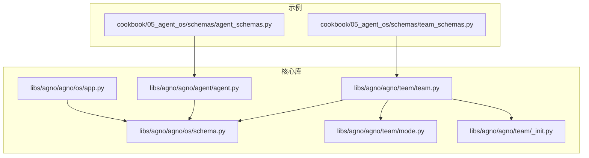
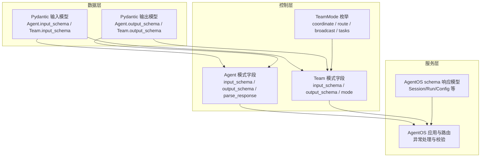
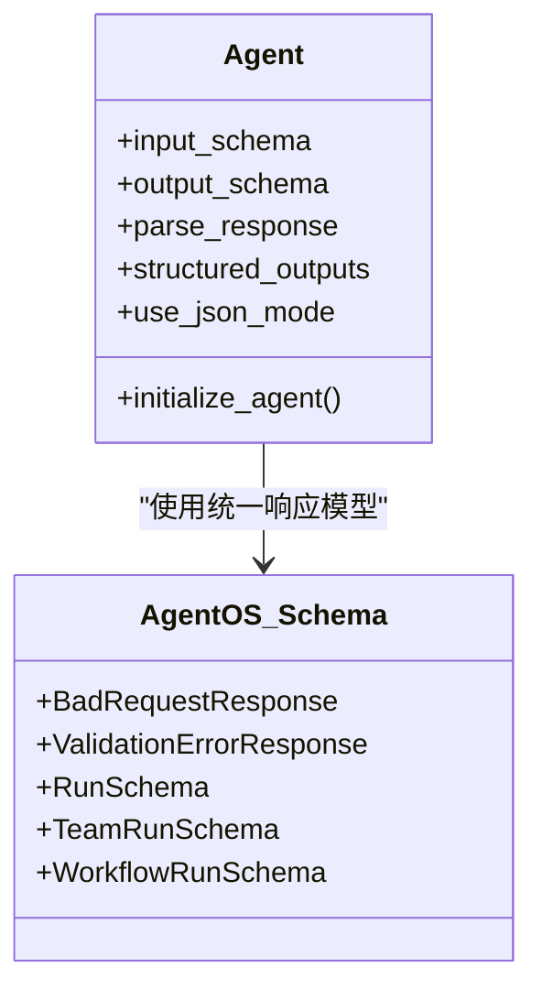
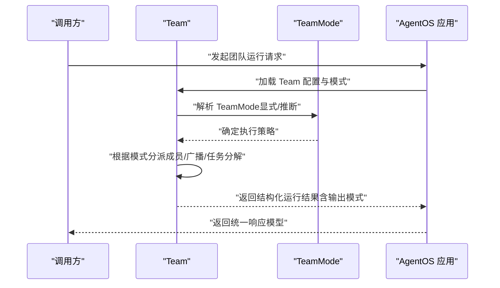
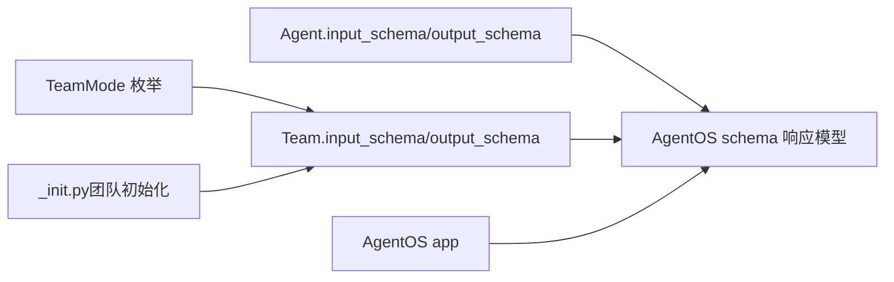

# 模式定义

<cite>
**本文引用的文件**
- [agent_schemas.py](file://cookbook/05_agent_os/schemas/agent_schemas.py)
- [team_schemas.py](file://cookbook/05_agent_os/schemas/team_schemas.py)
- [schema.py](file://libs/agno/agno/os/schema.py)
- [app.py](file://libs/agno/agno/os/app.py)
- [agent.py](file://libs/agno/agno/agent/agent.py)
- [team.py](file://libs/agno/agno/team/team.py)
- [mode.py](file://libs/agno/agno/team/mode.py)
- [_init.py（团队初始化）](file://libs/agno/agno/team/_init.py)
</cite>

## 目录
1. [引言](#引言)
2. [项目结构](#项目结构)
3. [核心组件](#核心组件)
4. [架构总览](#架构总览)
5. [详细组件分析](#详细组件分析)
6. [依赖关系分析](#依赖关系分析)
7. [性能考量](#性能考量)
8. [故障排查指南](#故障排查指南)
9. [结论](#结论)
10. [附录](#附录)

## 引言
本文件围绕 AgentOS 的“模式定义”能力进行系统化说明，重点覆盖两类核心模式：代理模式与团队模式。我们将从数据模式与结构定义入手，阐述如何通过 Pydantic 模型对输入输出进行强约束与类型安全保证；随后解析模式系统在运行期如何参与数据验证、结构约束与类型安全；并结合示例文件展示如何在实际场景中设计合理的数据结构以支撑不同功能需求。最后给出模式验证、错误处理与版本管理的最佳实践。

## 项目结构
本主题涉及的关键位置包括：
- 示例层：cookbook 中的 AgentOS 模式示例，分别演示了代理级与团队级的输入/输出模式。
- 核心库层：AgentOS 的模式与响应模型定义、Agent/Team 的模式字段、团队执行模式枚举与初始化逻辑。

图表来源
- [agent_schemas.py:1-85](file://cookbook/05_agent_os/schemas/agent_schemas.py#L1-L85)
- [team_schemas.py:1-142](file://cookbook/05_agent_os/schemas/team_schemas.py#L1-L142)
- [schema.py:1-732](file://libs/agno/agno/os/schema.py#L1-L732)
- [app.py:1-800](file://libs/agno/agno/os/app.py#L1-L800)
- [agent.py:280-305](file://libs/agno/agno/agent/agent.py#L280-L305)
- [team.py:260-285](file://libs/agno/agno/team/team.py#L260-L285)
- [mode.py:1-24](file://libs/agno/agno/team/mode.py#L1-L24)
- [_init.py（团队初始化）:190-215](file://libs/agno/agno/team/_init.py#L190-L215)

章节来源
- [agent_schemas.py:1-85](file://cookbook/05_agent_os/schemas/agent_schemas.py#L1-L85)
- [team_schemas.py:1-142](file://cookbook/05_agent_os/schemas/team_schemas.py#L1-L142)
- [schema.py:1-732](file://libs/agno/agno/os/schema.py#L1-L732)
- [app.py:1-800](file://libs/agno/agno/os/app.py#L1-L800)
- [agent.py:280-305](file://libs/agno/agno/agent/agent.py#L280-L305)
- [team.py:260-285](file://libs/agno/agno/team/team.py#L260-L285)
- [mode.py:1-24](file://libs/agno/agno/team/mode.py#L1-L24)
- [_init.py（团队初始化）:190-215](file://libs/agno/agno/team/_init.py#L190-L215)

## 核心组件
- 代理模式（Agent Mode）
  - 通过 Agent.input_schema 与 Agent.output_schema 对输入与输出进行结构化约束与类型安全校验。
  - 运行时可启用结构化输出或 JSON 模式，确保模型返回符合预设结构的数据。
- 团队模式（Team Mode）
  - 通过 TeamMode 枚举控制团队执行策略（协调、路由、广播、任务），并在初始化阶段将布尔标志归一化到具体模式。
  - Team.input_schema 与 Team.output_schema 同样用于输入输出的结构化约束。
- AgentOS 模式与响应
  - AgentOS 在 schema.py 中定义了统一的响应模型（如健康检查、会话、运行记录等），并作为 API 层的契约保障类型安全。
  - AgentOS.app 负责装配路由与异常处理，确保模式相关的请求/响应在服务端得到一致处理。

章节来源
- [agent.py:280-305](file://libs/agno/agno/agent/agent.py#L280-L305)
- [team.py:260-285](file://libs/agno/agno/team/team.py#L260-L285)
- [mode.py:1-24](file://libs/agno/agno/team/mode.py#L1-L24)
- [schema.py:1-732](file://libs/agno/agno/os/schema.py#L1-L732)
- [app.py:1-800](file://libs/agno/agno/os/app.py#L1-L800)

## 架构总览
AgentOS 的模式系统贯穿三层：
- 数据层：以 Pydantic 模型定义输入/输出结构，提供字段级约束（必填、范围、格式等）。
- 控制层：Agent/Team 的模式字段与 TeamMode 决定执行策略与上下文构建方式。
- 服务层：AgentOS 将模式约束映射为 API 契约，并在运行期进行验证与错误处理。

图表来源
- [agent.py:280-305](file://libs/agno/agno/agent/agent.py#L280-L305)
- [team.py:260-285](file://libs/agno/agno/team/team.py#L260-L285)
- [mode.py:1-24](file://libs/agno/agno/team/mode.py#L1-L24)
- [schema.py:1-732](file://libs/agno/agno/os/schema.py#L1-L732)
- [app.py:1-800](file://libs/agno/agno/os/app.py#L1-L800)

## 详细组件分析

### 代理模式（Agent Mode）
- 定义要点
  - input_schema：对进入代理的输入进行结构化校验，确保字段存在性、类型与范围约束。
  - output_schema：对代理的输出进行结构化约束，保证下游消费方拿到稳定的数据形态。
  - parse_response：控制是否将模型输出解析为 Pydantic 模型实例，或保持字符串形式。
  - structured_outputs/use_json_mode：在支持的模型上启用结构化输出或 JSON 模式，进一步提升一致性。
- 典型应用
  - 示例中通过 ResearchTopic 与 MovieScript 定义输入/输出结构，AgentOS 在运行前对请求体进行校验，失败时返回标准化错误响应。
- 类图概览

图表来源
- [agent.py:280-305](file://libs/agno/agno/agent/agent.py#L280-L305)
- [schema.py:27-75](file://libs/agno/agno/os/schema.py#L27-L75)
- [schema.py:357-477](file://libs/agno/agno/os/schema.py#L357-L477)
- [schema.py:480-532](file://libs/agno/agno/os/schema.py#L480-L532)

章节来源
- [agent.py:280-305](file://libs/agno/agno/agent/agent.py#L280-L305)
- [schema.py:27-75](file://libs/agno/agno/os/schema.py#L27-L75)
- [schema.py:357-477](file://libs/agno/agno/os/schema.py#L357-L477)
- [schema.py:480-532](file://libs/agno/agno/os/schema.py#L480-L532)

### 团队模式（Team Mode）
- 定义要点
  - TeamMode 枚举定义四种执行模式：协调（coordinate）、路由（route）、广播（broadcast）、任务（tasks）。
  - 初始化时，TeamMode 可显式指定，也可由布尔标志推断并归一化，避免配置冲突。
  - Team.input_schema / output_schema 与 Agent 类似，用于输入输出的结构化约束。
- 执行流程示意

图表来源
- [mode.py:1-24](file://libs/agno/agno/team/mode.py#L1-L24)
- [_init.py（团队初始化）:190-215](file://libs/agno/agno/team/_init.py#L190-L215)
- [team.py:260-285](file://libs/agno/agno/team/team.py#L260-L285)
- [app.py:1-800](file://libs/agno/agno/os/app.py#L1-L800)

章节来源
- [mode.py:1-24](file://libs/agno/agno/team/mode.py#L1-L24)
- [_init.py（团队初始化）:190-215](file://libs/agno/agno/team/_init.py#L190-L215)
- [team.py:260-285](file://libs/agno/agno/team/team.py#L260-L285)
- [app.py:1-800](file://libs/agno/agno/os/app.py#L1-L800)

### 模式系统核心功能
- 数据验证
  - 通过 Pydantic 字段描述（如必填、范围、正则、列表长度等）在运行前进行严格校验。
  - AgentOS 在 FastAPI 层捕获校验异常并返回标准化错误响应。
- 结构约束
  - input_schema/output_schema 将自然语言输入/模型输出转换为结构化数据，便于下游处理与持久化。
- 类型安全
  - 统一的响应模型（如 RunSchema、TeamRunSchema、WorkflowRunSchema）确保 API 返回字段一致且可被客户端稳定消费。
- 版本管理
  - 组件响应模型包含版本与阶段信息（如 current_version、stage），便于在 AgentOS 中进行版本追踪与发布管理。

章节来源
- [schema.py:27-75](file://libs/agno/agno/os/schema.py#L27-L75)
- [schema.py:357-477](file://libs/agno/agno/os/schema.py#L357-L477)
- [schema.py:480-532](file://libs/agno/agno/os/schema.py#L480-L532)
- [schema.py:591-626](file://libs/agno/agno/os/schema.py#L591-L626)

### 不同模式类型的特点与应用场景
- 协调（coordinate）
  - 适合需要“总控+汇总”的复杂任务，Leader 统筹成员工作并合成最终结果。
- 路由（route）
  - 适合“专家直连”，Leader 将任务路由给最合适的成员，直接返回其结果。
- 广播（broadcast）
  - 适合“并行收集+统一决策”，Leader 同时委托所有成员，再综合结果。
- 任务（tasks）
  - 适合“自治任务流”，Leader 将目标拆解为任务清单，成员协作完成直至收敛。

章节来源
- [mode.py:1-24](file://libs/agno/agno/team/mode.py#L1-L24)
- [_init.py（团队初始化）:190-215](file://libs/agno/agno/team/_init.py#L190-L215)

### 设计原则与最佳实践
- 明确边界：input_schema 仅约束入口参数，output_schema 仅约束出口形态，避免跨边界耦合。
- 渐进增强：先以 JSON 模式/结构化输出满足基本一致性，再按需引入 Pydantic 模型以获得更强约束。
- 可观测性：利用 RunSchema/TeamRunSchema 记录关键指标（tokens、事件、消息历史），便于排障与优化。
- 版本演进：通过组件响应模型的版本与阶段字段，配合 AgentOS 的注册表与组件管理，实现平滑升级。

章节来源
- [schema.py:357-477](file://libs/agno/agno/os/schema.py#L357-L477)
- [schema.py:480-532](file://libs/agno/agno/os/schema.py#L480-L532)
- [schema.py:591-626](file://libs/agno/agno/os/schema.py#L591-L626)

## 依赖关系分析
- Agent/Team 依赖 Pydantic 模型进行输入/输出约束。
- AgentOS 的 schema.py 提供统一响应模型，app.py 负责路由与异常处理。
- TeamMode 与团队初始化逻辑共同决定执行策略与上下文构建。

图表来源
- [agent.py:280-305](file://libs/agno/agno/agent/agent.py#L280-L305)
- [team.py:260-285](file://libs/agno/agno/team/team.py#L260-L285)
- [mode.py:1-24](file://libs/agno/agno/team/mode.py#L1-L24)
- [_init.py（团队初始化）:190-215](file://libs/agno/agno/team/_init.py#L190-L215)
- [schema.py:1-732](file://libs/agno/agno/os/schema.py#L1-L732)
- [app.py:1-800](file://libs/agno/agno/os/app.py#L1-L800)

章节来源
- [agent.py:280-305](file://libs/agno/agno/agent/agent.py#L280-L305)
- [team.py:260-285](file://libs/agno/agno/team/team.py#L260-L285)
- [mode.py:1-24](file://libs/agno/agno/team/mode.py#L1-L24)
- [_init.py（团队初始化）:190-215](file://libs/agno/agno/team/_init.py#L190-L215)
- [schema.py:1-732](file://libs/agno/agno/os/schema.py#L1-L732)
- [app.py:1-800](file://libs/agno/agno/os/app.py#L1-L800)

## 性能考量
- 模式验证成本：Pydantic 校验在请求进入 Agent/Team 之前进行，建议在高频路径中尽量减少不必要的深度嵌套与复杂约束。
- 解析开销：parse_response 与结构化输出会带来序列化/反序列化成本，可根据场景选择 JSON 模式或直接使用字典。
- 上下文压缩：团队与代理均支持上下文压缩与会话摘要，有助于降低长上下文带来的延迟与成本。

## 故障排查指南
- 校验错误
  - 当请求不符合 input_schema 或模型输出不符合 output_schema 时，AgentOS 会返回标准化错误响应（如 BadRequestResponse、ValidationErrorResponse）。
  - 建议在本地联调时开启调试日志，定位字段缺失、类型不匹配或格式不符等问题。
- 运行异常
  - AgentOS 在应用层捕获 FastAPI 的校验异常与 HTTP 异常，统一转化为结构化错误响应，便于前端或上游系统处理。
- 版本与注册
  - 若出现组件无法重载或版本不一致问题，检查组件响应模型中的版本与阶段字段，确保与当前 AgentOS 实例一致。

章节来源
- [schema.py:27-75](file://libs/agno/agno/os/schema.py#L27-L75)
- [app.py:781-800](file://libs/agno/agno/os/app.py#L781-L800)

## 结论
AgentOS 的模式定义体系以 Pydantic 模型为核心，结合 Agent/Team 的模式字段与 TeamMode 执行策略，在数据层、控制层与服务层形成闭环。通过严格的输入/输出约束与统一的响应模型，系统在保证类型安全的同时提升了可观测性与可维护性。遵循本文的设计原则与最佳实践，可在不同业务场景中高效落地代理模式与团队模式，并为后续演进提供清晰的版本管理基础。

## 附录
- 示例参考
  - 代理模式示例：[agent_schemas.py:1-85](file://cookbook/05_agent_os/schemas/agent_schemas.py#L1-L85)
  - 团队模式示例：[team_schemas.py:1-142](file://cookbook/05_agent_os/schemas/team_schemas.py#L1-L142)
- 核心实现参考
  - 代理模式字段：[agent.py:280-305](file://libs/agno/agno/agent/agent.py#L280-L305)
  - 团队模式字段与模式枚举：[team.py:260-285](file://libs/agno/agno/team/team.py#L260-L285)、[mode.py:1-24](file://libs/agno/agno/team/mode.py#L1-L24)
  - 统一响应模型与应用层：[schema.py:1-732](file://libs/agno/agno/os/schema.py#L1-L732)、[app.py:1-800](file://libs/agno/agno/os/app.py#L1-L800)