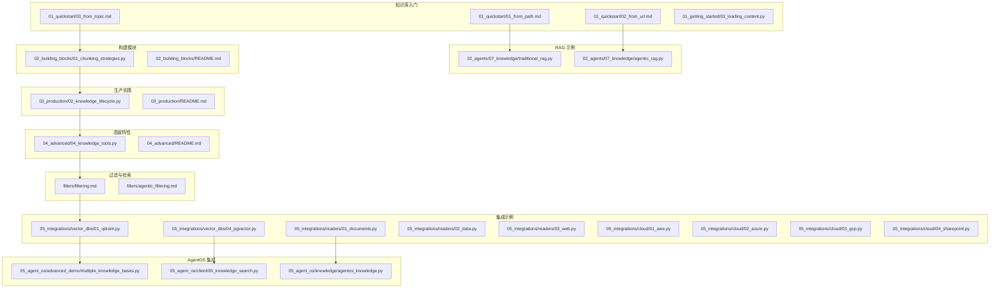
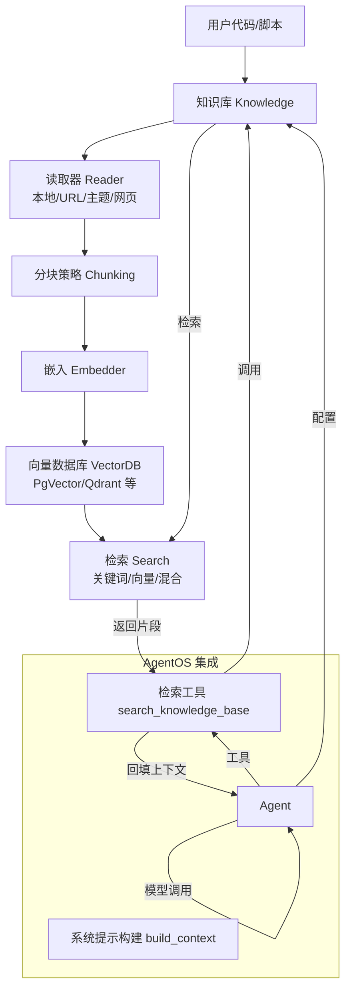
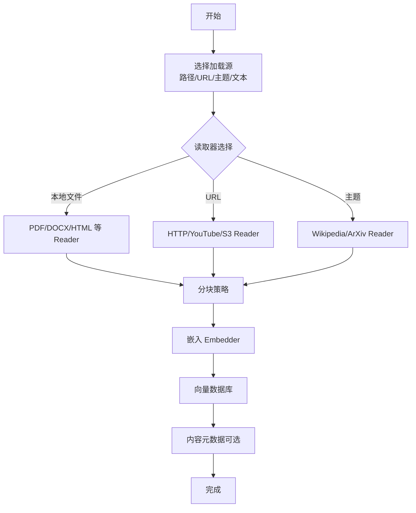
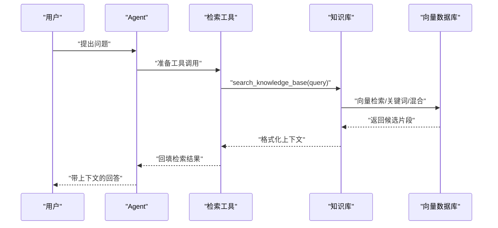
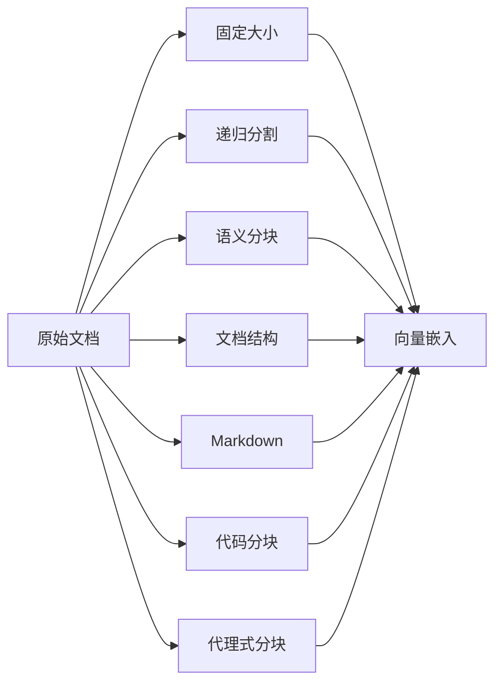
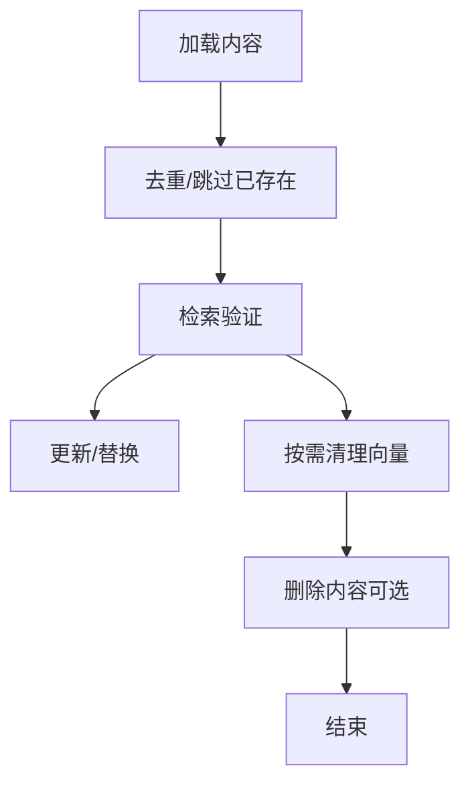
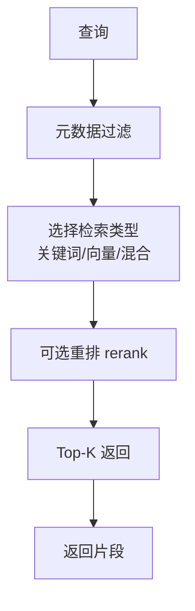
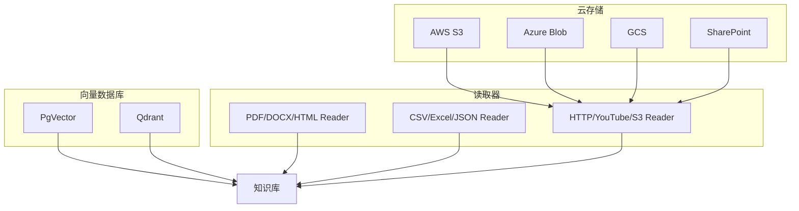
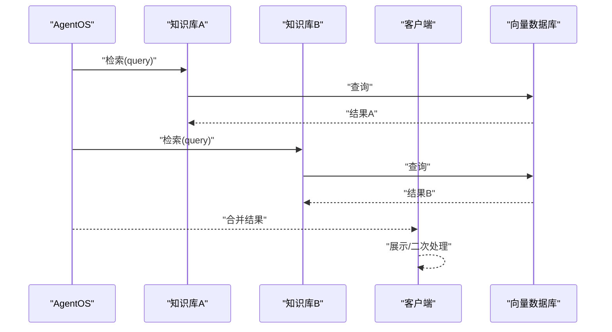
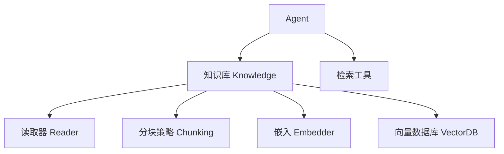

# 知识库集成

<cite>
**本文引用的文件**
- [03_loading_content.py](file://cookbook/07_knowledge/01_getting_started/03_loading_content.py)
- [01_from_path.md](file://cookbook/07_knowledge/01_quickstart/01_from_path.md)
- [02_from_url.md](file://cookbook/07_knowledge/01_quickstart/02_from_url.md)
- [03_from_topic.md](file://cookbook/07_knowledge/01_quickstart/03_from_topic.md)
- [traditional_rag.py](file://cookbook/02_agents/07_knowledge/traditional_rag.py)
- [agentic_rag.py](file://cookbook/02_agents/07_knowledge/agentic_rag.py)
- [01_chunking_strategies.py](file://cookbook/07_knowledge/02_building_blocks/01_chunking_strategies.py)
- [02_building_blocks/README.md](file://cookbook/07_knowledge/02_building_blocks/README.md)
- [03_production/02_knowledge_lifecycle.py](file://cookbook/07_knowledge/03_production/02_knowledge_lifecycle.py)
- [03_production/README.md](file://cookbook/07_knowledge/03_production/README.md)
- [04_advanced/04_knowledge_tools.py](file://cookbook/07_knowledge/04_advanced/04_knowledge_tools.py)
- [04_advanced/README.md](file://cookbook/07_knowledge/04_advanced/README.md)
- [filters/filtering.md](file://cookbook/07_knowledge/filters/filtering.md)
- [filters/agentic_filtering.md](file://cookbook/07_knowledge/filters/agentic_filtering.md)
- [05_integrations/vector_dbs/01_qdrant.py](file://cookbook/07_knowledge/05_integrations/vector_dbs/01_qdrant.py)
- [05_integrations/vector_dbs/04_pgvector.py](file://cookbook/07_knowledge/05_integrations/vector_dbs/04_pgvector.py)
- [05_integrations/readers/01_documents.py](file://cookbook/07_knowledge/05_integrations/readers/01_documents.py)
- [05_integrations/readers/02_data.py](file://cookbook/07_knowledge/05_integrations/readers/02_data.py)
- [05_integrations/readers/03_web.py](file://cookbook/07_knowledge/05_integrations/readers/03_web.py)
- [05_integrations/cloud/01_aws.py](file://cookbook/07_knowledge/05_integrations/cloud/01_aws.py)
- [05_integrations/cloud/02_azure.py](file://cookbook/07_knowledge/05_integrations/cloud/02_azure.py)
- [05_integrations/cloud/03_gcp.py](file://cookbook/07_knowledge/05_integrations/cloud/03_gcp.py)
- [05_integrations/cloud/04_sharepoint.py](file://cookbook/07_knowledge/05_integrations/cloud/04_sharepoint.py)
- [05_agent_os/advanced_demo/multiple_knowledge_bases.py](file://cookbook/05_agent_os/advanced_demo/multiple_knowledge_bases.py)
- [05_agent_os/client/05_knowledge_search.py](file://cookbook/05_agent_os/client/05_knowledge_search.py)
- [05_agent_os/knowledge/agentos_knowledge.py](file://cookbook/05_agent_os/knowledge/agentos_knowledge.py)
- [07_knowledge/README.md](file://cookbook/07_knowledge/README.md)
</cite>

## 目录
1. [简介](#简介)
2. [项目结构](#项目结构)
3. [核心组件](#核心组件)
4. [架构总览](#架构总览)
5. [详细组件分析](#详细组件分析)
6. [依赖分析](#依赖分析)
7. [性能考量](#性能考量)
8. [故障排查指南](#故障排查指南)
9. [结论](#结论)
10. [附录](#附录)

## 简介
本文件面向希望在 AgentOS 中集成并高效使用知识库的开发者与产品团队，系统讲解知识库与 AgentOS 的集成方法与应用实践，覆盖内容加载、知识提取、智能检索与多源整合等关键环节。文档重点围绕以下目标展开：
- 解释知识库集成的核心能力：内容加载（本地文件、URL、主题）、知识抽取与分块策略、检索与排序、以及内容管理与生命周期。
- 说明不同知识库的接入方式：Excel/文档知识库、云存储与文档服务、向量数据库对接、以及检索器与过滤器的扩展。
- 提供可直接参考的代码示例路径，帮助快速落地典型场景：传统 RAG、代理式 RAG、分布式 RAG、以及多知识库协同。
- 总结最佳实践与性能优化建议，指导生产级部署与运维。

## 项目结构
知识库相关能力主要分布在 cookbook 的“知识”专题下，涵盖入门、构建模块、生产实践、高级特性与集成示例。下图给出与 AgentOS 知识库集成密切相关的目录与文件概览：

**图表来源**
- [01_from_path.md](file://cookbook/07_knowledge/01_quickstart/01_from_path.md)
- [02_from_url.md](file://cookbook/07_knowledge/01_quickstart/02_from_url.md)
- [03_from_topic.md](file://cookbook/07_knowledge/01_quickstart/03_from_topic.md)
- [traditional_rag.py](file://cookbook/02_agents/07_knowledge/traditional_rag.py)
- [agentic_rag.py](file://cookbook/02_agents/07_knowledge/agentic_rag.py)
- [01_chunking_strategies.py](file://cookbook/07_knowledge/02_building_blocks/01_chunking_strategies.py)
- [03_production/02_knowledge_lifecycle.py](file://cookbook/07_knowledge/03_production/02_knowledge_lifecycle.py)
- [04_advanced/04_knowledge_tools.py](file://cookbook/07_knowledge/04_advanced/04_knowledge_tools.py)
- [filters/filtering.md](file://cookbook/07_knowledge/filters/filtering.md)
- [05_integrations/vector_dbs/01_qdrant.py](file://cookbook/07_knowledge/05_integrations/vector_dbs/01_qdrant.py)
- [05_integrations/vector_dbs/04_pgvector.py](file://cookbook/07_knowledge/05_integrations/vector_dbs/04_pgvector.py)
- [05_integrations/readers/01_documents.py](file://cookbook/07_knowledge/05_integrations/readers/01_documents.py)
- [05_integrations/readers/02_data.py](file://cookbook/07_knowledge/05_integrations/readers/02_data.py)
- [05_integrations/readers/03_web.py](file://cookbook/07_knowledge/05_integrations/readers/03_web.py)
- [05_agent_os/advanced_demo/multiple_knowledge_bases.py](file://cookbook/05_agent_os/advanced_demo/multiple_knowledge_bases.py)
- [05_agent_os/client/05_knowledge_search.py](file://cookbook/05_agent_os/client/05_knowledge_search.py)
- [05_agent_os/knowledge/agentos_knowledge.py](file://cookbook/05_agent_os/knowledge/agentos_knowledge.py)

**章节来源**
- [07_knowledge/README.md](file://cookbook/07_knowledge/README.md)

## 核心组件
- 知识库核心类：负责内容加载、分块、嵌入、写入向量数据库与内容元数据持久化，并在 Agent 中注入检索工具与上下文提示。
- 读取器（Reader）：根据输入源（本地文件、URL、主题、网页等）抓取与解析内容，支持多种格式与来源。
- 分块策略（Chunking）：决定如何将文档切分为适合嵌入与检索的片段，影响召回质量与检索效率。
- 向量数据库（VectorDB）：存储向量与元数据，提供相似度检索与可选重排（rerank）。
- Agent 集成：通过工具调用或上下文注入的方式启用检索增强生成（RAG），支持传统 RAG 与代理式 RAG。
- 过滤与检索：支持基于元数据与语义的过滤、检索类型切换（关键词/向量/混合）与重排。

**章节来源**
- [01_from_path.md](file://cookbook/07_knowledge/01_quickstart/01_from_path.md)
- [02_from_url.md](file://cookbook/07_knowledge/01_quickstart/02_from_url.md)
- [03_from_topic.md](file://cookbook/07_knowledge/01_quickstart/03_from_topic.md)
- [01_chunking_strategies.py](file://cookbook/07_knowledge/02_building_blocks/01_chunking_strategies.py)

## 架构总览
下图展示从内容加载到检索增强生成的整体流程，以及与 AgentOS 的交互位置：

**图表来源**
- [01_from_path.md](file://cookbook/07_knowledge/01_quickstart/01_from_path.md)
- [02_from_url.md](file://cookbook/07_knowledge/01_quickstart/02_from_url.md)
- [03_from_topic.md](file://cookbook/07_knowledge/01_quickstart/03_from_topic.md)
- [traditional_rag.py](file://cookbook/02_agents/07_knowledge/traditional_rag.py)
- [agentic_rag.py](file://cookbook/02_agents/07_knowledge/agentic_rag.py)

## 详细组件分析

### 内容加载与知识提取
- 本地文件加载：通过路径参数自动识别文件类型并选择对应读取器，完成分块与向量化后写入向量数据库，同时可持久化内容元数据。
- URL 加载：根据 URL 类型与内容类型自动路由至相应读取器（PDF/YouTube/S3 等），支持批量清理向量。
- 主题加载：结合 Wikipedia/ArXiv 等 Reader，按主题名批量抓取并写入，支持去重与批量插入。
- 批量加载：支持 insert_many 与异步变体，提升吞吐与并发效率。

**图表来源**
- [03_loading_content.py](file://cookbook/07_knowledge/01_getting_started/03_loading_content.py)
- [01_from_path.md](file://cookbook/07_knowledge/01_quickstart/01_from_path.md)
- [02_from_url.md](file://cookbook/07_knowledge/01_quickstart/02_from_url.md)
- [03_from_topic.md](file://cookbook/07_knowledge/01_quickstart/03_from_topic.md)

**章节来源**
- [03_loading_content.py](file://cookbook/07_knowledge/01_getting_started/03_loading_content.py)
- [01_from_path.md](file://cookbook/07_knowledge/01_quickstart/01_from_path.md)
- [02_from_url.md](file://cookbook/07_knowledge/01_quickstart/02_from_url.md)
- [03_from_topic.md](file://cookbook/07_knowledge/01_quickstart/03_from_topic.md)

### 检索与 RAG 集成
- 传统 RAG：通过配置向量数据库与嵌入器，启用 add_knowledge_to_context，将检索到的上下文直接拼接到用户问题中。
- 代理式 RAG：通过 search_knowledge=True 注入检索工具，使模型在推理过程中自主决定是否调用检索，提升灵活性与准确性。
- 分布式/多源 RAG：在多知识库或多向量库场景下协调检索与重排，提升跨源一致性与召回质量。

**图表来源**
- [traditional_rag.py](file://cookbook/02_agents/07_knowledge/traditional_rag.py)
- [agentic_rag.py](file://cookbook/02_agents/07_knowledge/agentic_rag.py)

**章节来源**
- [traditional_rag.py](file://cookbook/02_agents/07_knowledge/traditional_rag.py)
- [agentic_rag.py](file://cookbook/02_agents/07_knowledge/agentic_rag.py)

### 分块策略与质量控制
- 固定大小、递归分割、语义分块、文档结构分块、Markdown 分块、代码分块、代理式分块等策略各有适用场景，需结合内容类型与召回质量进行权衡。
- 通过对比示例可直观评估不同策略对检索效果的影响。

**图表来源**
- [01_chunking_strategies.py](file://cookbook/07_knowledge/02_building_blocks/01_chunking_strategies.py)
- [02_building_blocks/README.md](file://cookbook/07_knowledge/02_building_blocks/README.md)

**章节来源**
- [01_chunking_strategies.py](file://cookbook/07_knowledge/02_building_blocks/01_chunking_strategies.py)
- [02_building_blocks/README.md](file://cookbook/07_knowledge/02_building_blocks/README.md)

### 内容管理与生命周期
- 生命周期管理：从加载、去重、检索、到清理（按名称/元数据/全部清空）形成闭环，确保知识库的可控性与可维护性。
- 生产实践：在多源、多租户、错误处理与可观测性方面提供工程化保障。

**图表来源**
- [03_production/02_knowledge_lifecycle.py](file://cookbook/07_knowledge/03_production/02_knowledge_lifecycle.py)
- [03_production/README.md](file://cookbook/07_knowledge/03_production/README.md)

**章节来源**
- [03_production/02_knowledge_lifecycle.py](file://cookbook/07_knowledge/03_production/02_knowledge_lifecycle.py)
- [03_production/README.md](file://cookbook/07_knowledge/03_production/README.md)

### 过滤与检索优化
- 元数据过滤：基于内容元数据进行筛选，减少无关片段进入检索。
- 代理式过滤：利用模型判断是否相关，进一步提升检索质量。
- 检索类型：关键词、向量、混合检索，结合重排提升排序质量。

**图表来源**
- [filters/filtering.md](file://cookbook/07_knowledge/filters/filtering.md)
- [filters/agentic_filtering.md](file://cookbook/07_knowledge/filters/agentic_filtering.md)

**章节来源**
- [filters/filtering.md](file://cookbook/07_knowledge/filters/filtering.md)
- [filters/agentic_filtering.md](file://cookbook/07_knowledge/filters/agentic_filtering.md)

### 不同知识库的集成方式
- 向量数据库集成：PgVector、Qdrant 等，支持表/集合命名、搜索类型与嵌入器配置。
- 读取器集成：文档类（PDF/DOCX/HTML）、数据类（CSV/Excel/JSON）、网页类（HTTP/YouTube/S3）等。
- 云存储与文档服务：AWS/Azure/GCP 对象存储与 SharePoint 等，适配多云与企业环境。

**图表来源**
- [05_integrations/vector_dbs/01_qdrant.py](file://cookbook/07_knowledge/05_integrations/vector_dbs/01_qdrant.py)
- [05_integrations/vector_dbs/04_pgvector.py](file://cookbook/07_knowledge/05_integrations/vector_dbs/04_pgvector.py)
- [05_integrations/readers/01_documents.py](file://cookbook/07_knowledge/05_integrations/readers/01_documents.py)
- [05_integrations/readers/02_data.py](file://cookbook/07_knowledge/05_integrations/readers/02_data.py)
- [05_integrations/readers/03_web.py](file://cookbook/07_knowledge/05_integrations/readers/03_web.py)
- [05_integrations/cloud/01_aws.py](file://cookbook/07_knowledge/05_integrations/cloud/01_aws.py)
- [05_integrations/cloud/02_azure.py](file://cookbook/07_knowledge/05_integrations/cloud/02_azure.py)
- [05_integrations/cloud/03_gcp.py](file://cookbook/07_knowledge/05_integrations/cloud/03_gcp.py)
- [05_integrations/cloud/04_sharepoint.py](file://cookbook/07_knowledge/05_integrations/cloud/04_sharepoint.py)

**章节来源**
- [05_integrations/vector_dbs/01_qdrant.py](file://cookbook/07_knowledge/05_integrations/vector_dbs/01_qdrant.py)
- [05_integrations/vector_dbs/04_pgvector.py](file://cookbook/07_knowledge/05_integrations/vector_dbs/04_pgvector.py)
- [05_integrations/readers/01_documents.py](file://cookbook/07_knowledge/05_integrations/readers/01_documents.py)
- [05_integrations/readers/02_data.py](file://cookbook/07_knowledge/05_integrations/readers/02_data.py)
- [05_integrations/readers/03_web.py](file://cookbook/07_knowledge/05_integrations/readers/03_web.py)
- [05_integrations/cloud/01_aws.py](file://cookbook/07_knowledge/05_integrations/cloud/01_aws.py)
- [05_integrations/cloud/02_azure.py](file://cookbook/07_knowledge/05_integrations/cloud/02_azure.py)
- [05_integrations/cloud/03_gcp.py](file://cookbook/07_knowledge/05_integrations/cloud/03_gcp.py)
- [05_integrations/cloud/04_sharepoint.py](file://cookbook/07_knowledge/05_integrations/cloud/04_sharepoint.py)

### AgentOS 知识库集成
- 多知识库：在同一 AgentOS 中协同多个知识库，实现跨域检索与统一上下文。
- 客户端检索：通过客户端 API 直接检索知识库，便于前端或外部系统集成。
- 知识库封装：在 AgentOS 中对知识库进行抽象与封装，统一配置与访问接口。

**图表来源**
- [05_agent_os/advanced_demo/multiple_knowledge_bases.py](file://cookbook/05_agent_os/advanced_demo/multiple_knowledge_bases.py)
- [05_agent_os/client/05_knowledge_search.py](file://cookbook/05_agent_os/client/05_knowledge_search.py)
- [05_agent_os/knowledge/agentos_knowledge.py](file://cookbook/05_agent_os/knowledge/agentos_knowledge.py)

**章节来源**
- [05_agent_os/advanced_demo/multiple_knowledge_bases.py](file://cookbook/05_agent_os/advanced_demo/multiple_knowledge_bases.py)
- [05_agent_os/client/05_knowledge_search.py](file://cookbook/05_agent_os/client/05_knowledge_search.py)
- [05_agent_os/knowledge/agentos_knowledge.py](file://cookbook/05_agent_os/knowledge/agentos_knowledge.py)

## 依赖分析
- 组件耦合：知识库与读取器、分块策略、嵌入器、向量数据库之间为松耦合设计，可通过配置灵活组合。
- 外部依赖：向量数据库（PgVector/Qdrant）、云存储（S3/Azure/GCS）、文档服务（YouTube/Wikipedia/ArXiv）等。
- 可能的循环依赖：当前示例以脚本形式运行，未见直接循环依赖；在复杂工程中应避免知识库与 Agent 的双向强引用。

**图表来源**
- [01_from_path.md](file://cookbook/07_knowledge/01_quickstart/01_from_path.md)
- [02_from_url.md](file://cookbook/07_knowledge/01_quickstart/02_from_url.md)
- [03_from_topic.md](file://cookbook/07_knowledge/01_quickstart/03_from_topic.md)
- [agentic_rag.py](file://cookbook/02_agents/07_knowledge/agentic_rag.py)

**章节来源**
- [01_from_path.md](file://cookbook/07_knowledge/01_quickstart/01_from_path.md)
- [02_from_url.md](file://cookbook/07_knowledge/01_quickstart/02_from_url.md)
- [03_from_topic.md](file://cookbook/07_knowledge/01_quickstart/03_from_topic.md)
- [agentic_rag.py](file://cookbook/02_agents/07_knowledge/agentic_rag.py)

## 性能考量
- 分块策略：针对不同内容类型选择合适策略，平衡召回质量与检索延迟。
- 搜索类型：在关键词与向量检索间权衡，混合检索通常效果更佳但成本更高。
- 去重与缓存：合理使用 skip_if_exists 与内容指纹，减少重复嵌入与查询。
- 并发与批处理：使用异步插入与批量操作，提升吞吐。
- 向量库优化：合理设置维度、索引与分区，结合重排提升排序质量。
- 传输与网络：对远端 URL/云存储读取进行超时与重试策略配置。

## 故障排查指南
- 检索不到相关内容：检查向量库是否正确写入、索引是否建立、查询是否匹配元数据过滤条件。
- 重复内容：确认是否开启 skip_if_exists，核对内容指纹与名称字段。
- 权限与连接：校验向量数据库与云存储的认证信息与网络连通性。
- 读取失败：确认读取器与文件格式兼容，必要时更换分块策略或预处理文件。
- Agent 工具未触发：确认 Agent 的 search_knowledge 配置与系统提示构建逻辑。

## 结论
通过上述组件与流程，AgentOS 能够以模块化方式集成多源知识库，覆盖从内容加载、分块、嵌入到检索与 RAG 的全链路需求。结合生产实践与工程化手段，可在保证质量的同时提升性能与可维护性。建议在实际项目中优先确定内容类型与检索目标，选择合适的分块与检索策略，并建立完善的生命周期与监控体系。

## 附录
- 快速参考示例路径（不含代码内容，仅路径）：
  - [本地文件加载示例](file://cookbook/07_knowledge/01_getting_started/03_loading_content.py)
  - [URL 加载与向量清理示例](file://cookbook/07_knowledge/01_quickstart/02_from_url.md)
  - [主题加载与批量插入示例](file://cookbook/07_knowledge/01_quickstart/03_from_topic.md)
  - [传统 RAG 示例](file://cookbook/02_agents/07_knowledge/traditional_rag.py)
  - [代理式 RAG 示例](file://cookbook/02_agents/07_knowledge/agentic_rag.py)
  - [分块策略对比示例](file://cookbook/07_knowledge/02_building_blocks/01_chunking_strategies.py)
  - [知识库生命周期管理示例](file://cookbook/07_knowledge/03_production/02_knowledge_lifecycle.py)
  - [知识库工具与协议示例](file://cookbook/07_knowledge/04_advanced/04_knowledge_tools.py)
  - [向量数据库集成示例（Qdrant/PgVector）](file://cookbook/07_knowledge/05_integrations/vector_dbs/01_qdrant.py)
  - [读取器集成示例（文档/数据/网页）](file://cookbook/07_knowledge/05_integrations/readers/01_documents.py)
  - [云存储与文档服务集成示例（AWS/Azure/GCP/SharePoint）](file://cookbook/07_knowledge/05_integrations/cloud/01_aws.py)
  - [AgentOS 多知识库与客户端检索示例](file://cookbook/05_agent_os/advanced_demo/multiple_knowledge_bases.py)
  - [AgentOS 知识库封装示例](file://cookbook/05_agent_os/knowledge/agentos_knowledge.py)