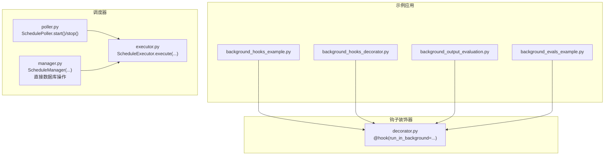
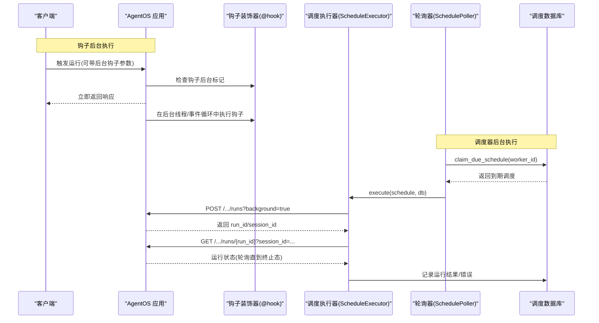
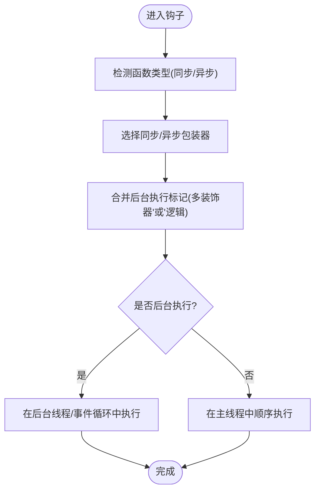
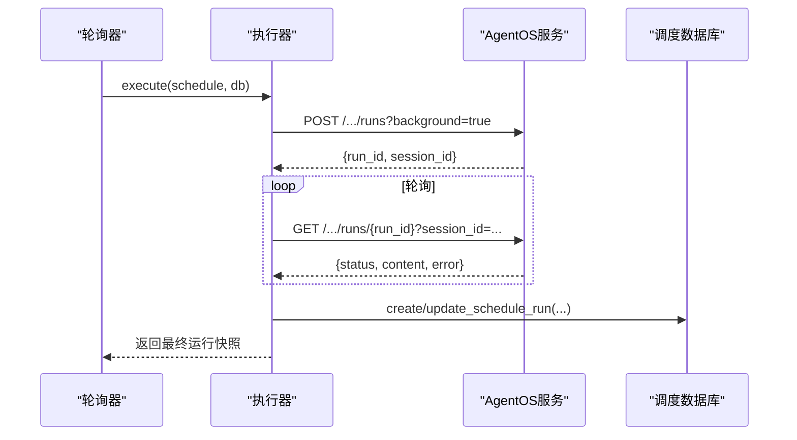
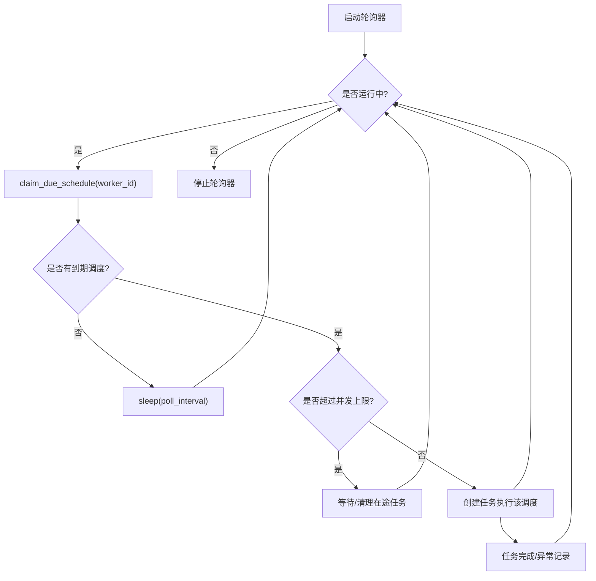
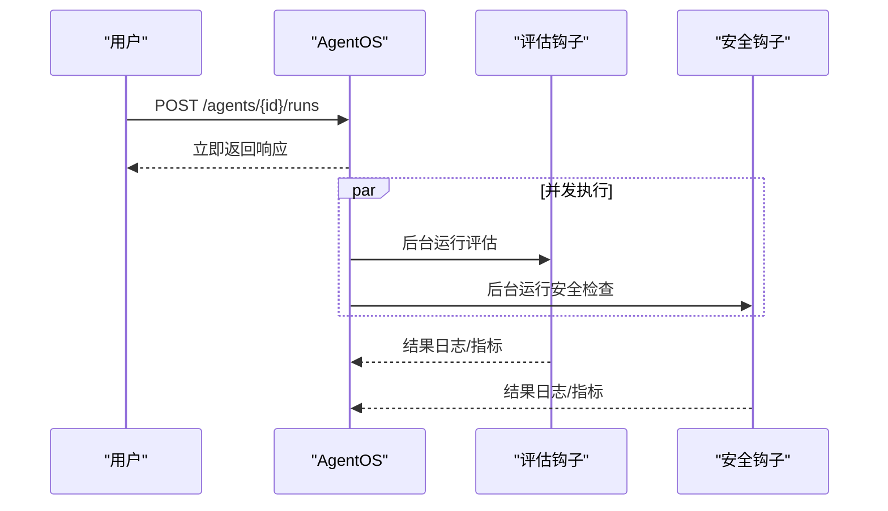
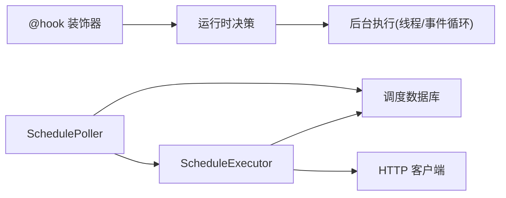

# 背景任务

<cite>
**本文引用的文件**
- [background_hooks_example.py](file://cookbook/05_agent_os/background_tasks/background_hooks_example.py)
- [background_hooks_decorator.py](file://cookbook/05_agent_os/background_tasks/background_hooks_decorator.py)
- [background_output_evaluation.py](file://cookbook/05_agent_os/background_tasks/background_output_evaluation.py)
- [background_evals_example.py](file://cookbook/05_agent_os/background_tasks/background_evals_example.py)
- [decorator.py](file://libs/agno/agno/hooks/decorator.py)
- [executor.py](file://libs/agno/agno/scheduler/executor.py)
- [manager.py](file://libs/agno/agno/scheduler/manager.py)
- [poller.py](file://libs/agno/agno/scheduler/poller.py)
</cite>

## 目录
1. [引言](#引言)
2. [项目结构](#项目结构)
3. [核心组件](#核心组件)
4. [架构总览](#架构总览)
5. [详细组件分析](#详细组件分析)
6. [依赖关系分析](#依赖关系分析)
7. [性能考量](#性能考量)
8. [故障排查指南](#故障排查指南)
9. [结论](#结论)
10. [附录](#附录)

## 引言
本文件面向 AgentOS 的“背景任务”体系，系统性阐述后台任务的调度与执行机制，覆盖任务创建、调度策略、状态管理、异步执行、队列与并发控制、状态跟踪、监控与错误处理，以及与前台任务的区别与最佳实践。文中结合示例代码路径，帮助读者快速理解并落地实现高质量的后台任务系统。

## 项目结构
AgentOS 的背景任务能力由两部分构成：
- 钩子级后台执行：通过装饰器标记钩子在后台运行，适用于 Agent/Team/Workflow 的前置/后置钩子。
- 定时调度后台执行：通过调度器周期性触发资源运行（如 /agents/*/runs），并在后台轮询运行状态，适合周期性任务或批量触发。

**图示来源**
- [background_hooks_example.py:1-101](file://cookbook/05_agent_os/background_tasks/background_hooks_example.py#L1-L101)
- [background_hooks_decorator.py:1-91](file://cookbook/05_agent_os/background_tasks/background_hooks_decorator.py#L1-L91)
- [background_output_evaluation.py:1-201](file://cookbook/05_agent_os/background_tasks/background_output_evaluation.py#L1-L201)
- [background_evals_example.py:1-85](file://cookbook/05_agent_os/background_tasks/background_evals_example.py#L1-L85)
- [decorator.py:56-135](file://libs/agno/agno/hooks/decorator.py#L56-L135)
- [executor.py:75-286](file://libs/agno/agno/scheduler/executor.py#L75-L286)
- [poller.py:14-149](file://libs/agno/agno/scheduler/poller.py#L14-L149)
- [manager.py:29-376](file://libs/agno/agno/scheduler/manager.py#L29-L376)

**章节来源**
- [background_hooks_example.py:1-101](file://cookbook/05_agent_os/background_tasks/background_hooks_example.py#L1-L101)
- [background_hooks_decorator.py:1-91](file://cookbook/05_agent_os/background_tasks/background_hooks_decorator.py#L1-L91)
- [background_output_evaluation.py:1-201](file://cookbook/05_agent_os/background_tasks/background_output_evaluation.py#L1-L201)
- [background_evals_example.py:1-85](file://cookbook/05_agent_os/background_tasks/background_evals_example.py#L1-L85)
- [decorator.py:1-165](file://libs/agno/agno/hooks/decorator.py#L1-L165)
- [executor.py:1-495](file://libs/agno/agno/scheduler/executor.py#L1-L495)
- [manager.py:1-376](file://libs/agno/agno/scheduler/manager.py#L1-L376)
- [poller.py:1-149](file://libs/agno/agno/scheduler/poller.py#L1-L149)

## 核心组件
- 钩子装饰器与后台执行
  - 通过装饰器对钩子函数进行标记，支持同步/异步钩子，并允许每个钩子独立控制是否后台运行。
  - 提供统一查询接口判断钩子是否应后台执行，便于在运行时按需调度。
- 调度器执行器
  - 对定时调度进行 HTTP 请求触发，针对运行类端点自动设置后台模式并轮询运行状态，直至终止态。
  - 支持重试、超时、锁释放、错误记录等稳健机制。
- 调度器轮询器
  - 周期性从数据库“认领”到期的调度，限制并发度，异步执行，优雅停止与取消。
- 调度器管理器
  - 提供直接数据库访问的 Python 接口，用于创建/更新/启用/禁用/删除/查询调度及其运行历史，便于脚本化与 CLI 管理。

**章节来源**
- [decorator.py:56-165](file://libs/agno/agno/hooks/decorator.py#L56-L165)
- [executor.py:37-495](file://libs/agno/agno/scheduler/executor.py#L37-L495)
- [poller.py:14-149](file://libs/agno/agno/scheduler/poller.py#L14-L149)
- [manager.py:29-376](file://libs/agno/agno/scheduler/manager.py#L29-L376)

## 架构总览
下图展示了“钩子后台执行”与“调度器后台执行”的整体交互流程。

**图示来源**
- [background_hooks_example.py:70-93](file://cookbook/05_agent_os/background_tasks/background_hooks_example.py#L70-L93)
- [background_hooks_decorator.py:70-83](file://cookbook/05_agent_os/background_tasks/background_hooks_decorator.py#L70-L83)
- [executor.py:249-474](file://libs/agno/agno/scheduler/executor.py#L249-L474)
- [poller.py:90-148](file://libs/agno/agno/scheduler/poller.py#L90-L148)
- [manager.py:100-236](file://libs/agno/agno/scheduler/manager.py#L100-L236)

## 详细组件分析

### 组件一：钩子装饰器与后台执行
- 功能要点
  - 支持三种调用形式：@hook、@hook()、@hook(run_in_background=True)，后者决定钩子是否在后台执行。
  - 自动识别同步/异步函数，分别包装为同步/异步执行体。
  - 多层装饰器叠加时采用“或逻辑”合并后台标记，确保只要任一装饰器要求后台执行，最终即为后台执行。
  - 提供查询函数判断钩子是否应后台执行，便于运行时决策。
- 使用场景
  - 后置钩子：日志、通知、指标上报、输出质量评估等非关键路径任务。
  - 前置钩子：请求预处理、限流、审计等可在后台执行的非阻塞任务。
- 示例参考
  - [background_hooks_example.py:57-93](file://cookbook/05_agent_os/background_tasks/background_hooks_example.py#L57-L93)
  - [background_hooks_decorator.py:52-83](file://cookbook/05_agent_os/background_tasks/background_hooks_decorator.py#L52-L83)

**图示来源**
- [decorator.py:56-135](file://libs/agno/agno/hooks/decorator.py#L56-L135)

**章节来源**
- [decorator.py:56-165](file://libs/agno/agno/hooks/decorator.py#L56-L165)
- [background_hooks_example.py:1-101](file://cookbook/05_agent_os/background_tasks/background_hooks_example.py#L1-L101)
- [background_hooks_decorator.py:1-91](file://cookbook/05_agent_os/background_tasks/background_hooks_decorator.py#L1-L91)

### 组件二：调度器执行器（ScheduleExecutor）
- 功能要点
  - 针对运行类端点（/agents/*/runs、/teams/*/runs、/workflows/*/runs）自动设置 background=true 并轮询运行状态，直至终止态（成功/失败/取消/暂停）。
  - 非运行类端点使用简单请求/响应模式。
  - 支持重试、超时、锁释放、错误记录与运行记录持久化。
  - 将运行输入/输出/需求提取并写入调度运行记录，便于监控与审计。
- 关键流程
  - 发起后台运行请求 → 校验响应 → 提取 run_id/session_id → 循环轮询 → 达到终止态后汇总结果 → 更新运行记录。

**图示来源**
- [executor.py:75-474](file://libs/agno/agno/scheduler/executor.py#L75-L474)

**章节来源**
- [executor.py:37-495](file://libs/agno/agno/scheduler/executor.py#L37-L495)

### 组件三：调度器轮询器（SchedulePoller）
- 功能要点
  - 周期性调用数据库“认领”到期调度；达到并发上限则等待；为每个调度创建独立任务并发执行。
  - 支持优雅停止：取消主循环、等待/取消在途任务、关闭执行器客户端。
  - 提供手动触发接口，立即以异步任务执行指定调度。
- 并发与稳定性
  - 通过集合维护在途任务，定期清理已完成任务，避免泄漏。
  - 错误捕获与日志记录，保证轮询循环持续运行。

**图示来源**
- [poller.py:76-148](file://libs/agno/agno/scheduler/poller.py#L76-L148)

**章节来源**
- [poller.py:14-149](file://libs/agno/agno/scheduler/poller.py#L14-L149)

### 组件四：调度器管理器（ScheduleManager）
- 功能要点
  - 提供 Pythonic 的数据库直连 API：创建/列出/获取/更新/删除/启用/禁用/查询运行历史。
  - 支持同步与异步调用，内部自动桥接线程池或事件循环。
  - 参数校验：Cron 表达式与时区合法性检查。
- 典型用途
  - 脚本化创建周期性任务、批量启停、导出运行报告、集成 CLI 控制台。

**章节来源**
- [manager.py:29-376](file://libs/agno/agno/scheduler/manager.py#L29-L376)

### 组件五：后台输出评估与钩子装饰器示例
- 功能要点
  - 展示如何将“输出质量评估”“安全检查”等作为后台钩子，不阻塞响应延迟。
  - 使用结构化输出模型定义评估结果，便于后续存储与分析。
- 流程说明
  - 用户请求到达 → Agent 生成响应 → 立即返回给用户 → 后台并发执行多个钩子（评估、安全检查等）→ 日志/指标/数据库记录。

**图示来源**
- [background_output_evaluation.py:68-172](file://cookbook/05_agent_os/background_tasks/background_output_evaluation.py#L68-L172)

**章节来源**
- [background_output_evaluation.py:1-201](file://cookbook/05_agent_os/background_tasks/background_output_evaluation.py#L1-L201)

## 依赖关系分析
- 钩子装饰器依赖
  - 通过属性标记与包装器实现，不依赖外部框架，仅在运行时被 Agent/Team/Workflow 读取。
- 调度器组件依赖
  - 执行器依赖 HTTP 客户端库进行请求与轮询。
  - 轮询器依赖数据库的“认领到期调度”接口，以及执行器提供的执行入口。
  - 管理器依赖数据库适配器的调度相关方法，支持同步/异步透明调用。

**图示来源**
- [decorator.py:56-165](file://libs/agno/agno/hooks/decorator.py#L56-L165)
- [poller.py:14-149](file://libs/agno/agno/scheduler/poller.py#L14-L149)
- [executor.py:13-72](file://libs/agno/agno/scheduler/executor.py#L13-L72)

**章节来源**
- [decorator.py:1-165](file://libs/agno/agno/hooks/decorator.py#L1-L165)
- [executor.py:1-495](file://libs/agno/agno/scheduler/executor.py#L1-L495)
- [poller.py:1-149](file://libs/agno/agno/scheduler/poller.py#L1-L149)

## 性能考量
- 钩子后台执行
  - 将非关键路径任务移至后台，显著降低响应延迟，提升用户体验。
  - 对于高并发请求，建议将耗时的后置钩子（如远程评估、通知）标记为后台执行。
- 调度器并发控制
  - 轮询器通过并发上限限制同时执行的任务数，避免资源争用与抖动。
  - 执行器对运行类端点自动设置后台模式并轮询，减少阻塞。
- 资源与网络
  - 执行器复用 HTTP 客户端，减少连接开销；合理设置超时与重试间隔。
  - 数据库访问采用线程池桥接异步上下文，避免阻塞事件循环。

[本节为通用性能建议，无需特定文件引用]

## 故障排查指南
- 钩子未按预期后台执行
  - 检查是否正确使用装饰器标记；确认运行时配置（如 AgentOS 的全局后台开关）与单个钩子标记一致。
  - 参考：[decorator.py:56-165](file://libs/agno/agno/hooks/decorator.py#L56-L165)
- 调度任务长时间未完成
  - 查看轮询器日志与并发上限；确认数据库“认领到期调度”接口可用。
  - 参考：[poller.py:76-148](file://libs/agno/agno/scheduler/poller.py#L76-L148)
- 运行类端点轮询失败
  - 检查执行器返回的 run_id/session_id 是否存在；关注轮询超时与状态码。
  - 参考：[executor.py:249-474](file://libs/agno/agno/scheduler/executor.py#L249-L474)
- 调度记录缺失或异常
  - 核对调度器管理器的运行记录写入逻辑；检查数据库适配器实现。
  - 参考：[manager.py:100-236](file://libs/agno/agno/scheduler/manager.py#L100-L236)

**章节来源**
- [decorator.py:56-165](file://libs/agno/agno/hooks/decorator.py#L56-L165)
- [executor.py:75-495](file://libs/agno/agno/scheduler/executor.py#L75-L495)
- [poller.py:76-148](file://libs/agno/agno/scheduler/poller.py#L76-L148)
- [manager.py:100-236](file://libs/agno/agno/scheduler/manager.py#L100-L236)

## 结论
AgentOS 的背景任务体系通过“钩子装饰器 + 调度器”双通道实现了灵活高效的异步执行：前者聚焦于请求生命周期内的非关键路径任务，后者聚焦于周期性与批量触发的后台运行。配合并发控制、重试与状态轮询、运行记录持久化，可满足生产环境对低延迟、可观测与高可靠的严格要求。

[本节为总结性内容，无需特定文件引用]

## 附录
- 快速上手建议
  - 钩子后台执行：对后置钩子（日志、通知、评估）使用装饰器标记后台运行。
  - 输出评估：将“输出质量评估”“安全检查”等作为后台钩子，不阻塞响应。
  - 定时任务：使用调度器管理器创建 Cron 任务，轮询器自动并发执行。
- 示例参考
  - 钩子后台执行（全局开关）：[background_hooks_example.py:70-93](file://cookbook/05_agent_os/background_tasks/background_hooks_example.py#L70-L93)
  - 钩子后台执行（装饰器）：[background_hooks_decorator.py:52-83](file://cookbook/05_agent_os/background_tasks/background_hooks_decorator.py#L52-L83)
  - 输出评估与安全检查：[background_output_evaluation.py:68-172](file://cookbook/05_agent_os/background_tasks/background_output_evaluation.py#L68-L172)
  - 评估任务示例（AgentAsJudgeEval）：[background_evals_example.py:23-63](file://cookbook/05_agent_os/background_tasks/background_evals_example.py#L23-L63)

[本节为补充信息，无需特定文件引用]