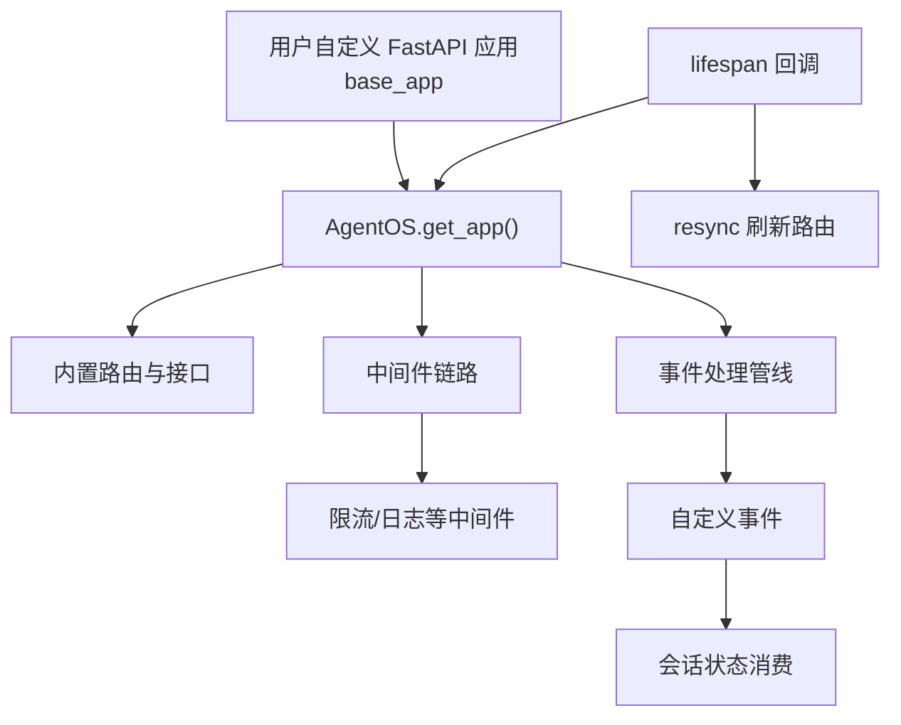
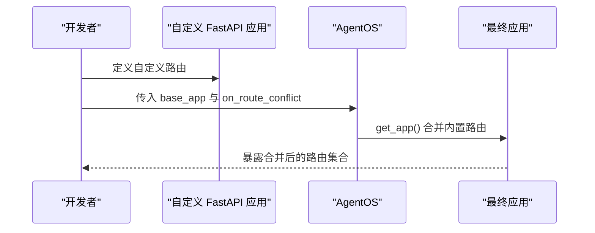
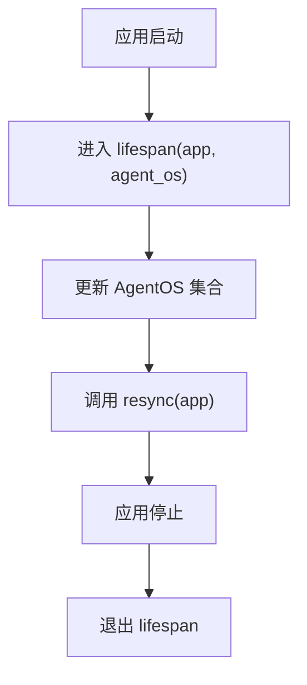
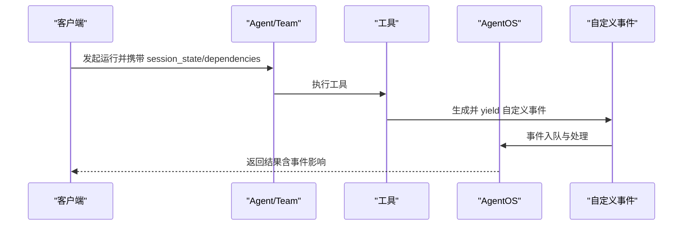
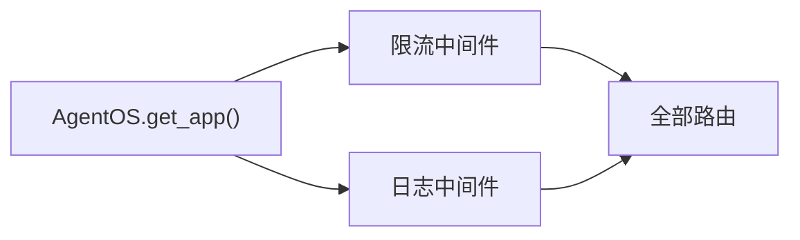
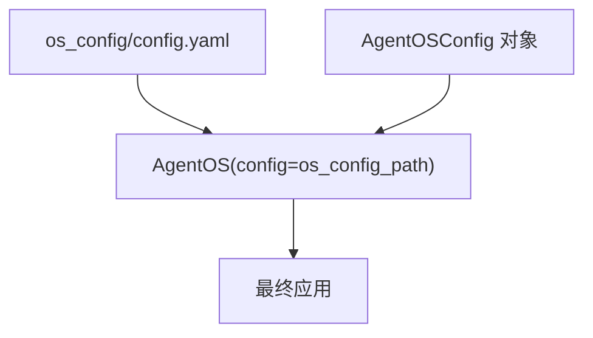
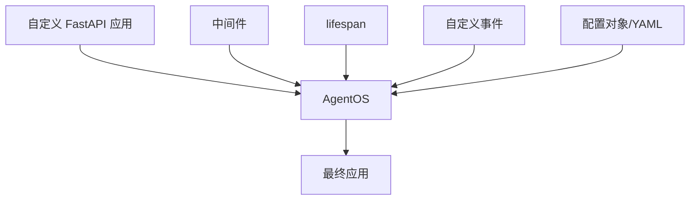

# 自定义配置

<cite>
**本文引用的文件**
- [custom_fastapi_app.py](file://cookbook/05_agent_os/customize/custom_fastapi_app.py)
- [custom_lifespan.py](file://cookbook/05_agent_os/customize/custom_lifespan.py)
- [handle_custom_events.py](file://cookbook/05_agent_os/customize/handle_custom_events.py)
- [override_routes.py](file://cookbook/05_agent_os/customize/override_routes.py)
- [custom_health_endpoint.py](file://cookbook/05_agent_os/customize/custom_health_endpoint.py)
- [pass_dependencies_to_agent.py](file://cookbook/05_agent_os/customize/pass_dependencies_to_agent.py)
- [update_from_lifespan.py](file://cookbook/05_agent_os/customize/update_from_lifespan.py)
- [agent_os_with_custom_middleware.py](file://cookbook/05_agent_os/middleware/agent_os_with_custom_middleware.py)
- [basic.py](file://cookbook/05_agent_os/os_config/basic.py)
- [yaml_config.py](file://cookbook/05_agent_os/os_config/yaml_config.py)
- [config.yaml](file://cookbook/05_agent_os/os_config/config.yaml)
</cite>

## 目录
1. [简介](#简介)
2. [项目结构](#项目结构)
3. [核心组件](#核心组件)
4. [架构总览](#架构总览)
5. [详细组件分析](#详细组件分析)
6. [依赖分析](#依赖分析)
7. [性能考虑](#性能考虑)
8. [故障排查指南](#故障排查指南)
9. [结论](#结论)
10. [附录](#附录)

## 简介
本章节面向需要对 AgentOS 进行运行时自定义配置的开发者，系统性讲解如何通过自定义 FastAPI 应用、生命周期管理、事件处理、中间件、健康检查端点、路由覆盖与运行时更新等手段，在不破坏核心功能的前提下扩展 AgentOS 能力。文档结合示例路径，帮助读者快速落地从基础配置到高级扩展的各类场景。

## 项目结构
围绕“自定义配置”的示例主要位于 cookbook/05_agent_os 下的 customize、middleware、os_config 三个子目录中，分别覆盖了：
- 自定义 FastAPI 应用与路由覆盖
- 生命周期与运行时更新
- 事件处理与依赖注入
- 中间件配置
- 配置文件（YAML）与运行时配置对象

```mermaid
graph TB
subgraph "自定义配置示例"
A["customize/custom_fastapi_app.py"]
B["customize/custom_lifespan.py"]
C["customize/handle_custom_events.py"]
D["customize/override_routes.py"]
E["customize/custom_health_endpoint.py"]
F["customize/pass_dependencies_to_agent.py"]
G["customize/update_from_lifespan.py"]
H["middleware/agent_os_with_custom_middleware.py"]
I["os_config/basic.py"]
J["os_config/yaml_config.py"]
K["os_config/config.yaml"]
end
A --> |"使用 base_app 构建"| L["AgentOS.get_app()"]
D --> |"使用 on_route_conflict"| L
E --> |"include_router 健康路由"| L
B --> |"lifespan 回调"| L
G --> |"lifespan 内 resync"| L
H --> |"app.add_middleware"| L
I --> |"AgentOSConfig 对象"| L
J --> |"config=os_config_path"| L
```

图表来源
- [custom_fastapi_app.py:36-67](file://cookbook/05_agent_os/customize/custom_fastapi_app.py#L36-L67)
- [override_routes.py:44-74](file://cookbook/05_agent_os/customize/override_routes.py#L44-L74)
- [custom_health_endpoint.py:34-53](file://cookbook/05_agent_os/customize/custom_health_endpoint.py#L34-L53)
- [custom_lifespan.py:30-44](file://cookbook/05_agent_os/customize/custom_lifespan.py#L30-L44)
- [update_from_lifespan.py:37-57](file://cookbook/05_agent_os/customize/update_from_lifespan.py#L37-L57)
- [agent_os_with_custom_middleware.py:135-153](file://cookbook/05_agent_os/middleware/agent_os_with_custom_middleware.py#L135-L153)
- [basic.py:62-91](file://cookbook/05_agent_os/os_config/basic.py#L62-L91)
- [yaml_config.py:64-74](file://cookbook/05_agent_os/os_config/yaml_config.py#L64-L74)

章节来源
- [custom_fastapi_app.py:1-82](file://cookbook/05_agent_os/customize/custom_fastapi_app.py#L1-L82)
- [override_routes.py:1-92](file://cookbook/05_agent_os/customize/override_routes.py#L1-L92)
- [custom_health_endpoint.py:1-66](file://cookbook/05_agent_os/customize/custom_health_endpoint.py#L1-L66)
- [custom_lifespan.py:1-59](file://cookbook/05_agent_os/customize/custom_lifespan.py#L1-L59)
- [update_from_lifespan.py:1-66](file://cookbook/05_agent_os/customize/update_from_lifespan.py#L1-L66)
- [agent_os_with_custom_middleware.py:1-192](file://cookbook/05_agent_os/middleware/agent_os_with_custom_middleware.py#L1-L192)
- [basic.py:1-106](file://cookbook/05_agent_os/os_config/basic.py#L1-L106)
- [yaml_config.py:1-89](file://cookbook/05_agent_os/os_config/yaml_config.py#L1-L89)
- [config.yaml](file://cookbook/05_agent_os/os_config/config.yaml)

## 核心组件
- 自定义 FastAPI 应用：通过传入 base_app 参数，将用户自定义的 FastAPI 实例交由 AgentOS 统一托管，可自由添加路由、中间件与静态资源。
- 生命周期管理：支持注入 lifespan 回调，在应用启动前/关闭后执行初始化与清理逻辑；可在 lifespan 中动态增删 Agent/Team/Workflow 并触发 resync。
- 事件处理：工具可通过生成自定义事件并 yield，AgentOS 将其作为内部事件统一处理，便于在会话状态中传递与消费。
- 中间件配置：在 AgentOS 生成的 app 上追加自定义中间件，实现限流、日志、鉴权等横切能力。
- 健康检查端点：既可沿用内置 /health，也可通过 include_router 添加自定义路径的健康检查。
- 路由覆盖策略：当自定义路由与 AgentOS 内置路由冲突时，可通过 on_route_conflict 控制保留顺序（保留 base_app 或保留 AgentOS）。
- 依赖注入：通过 dependencies 参数向 Agent/Team/Workflow 注入运行时依赖，或在工具中直接消费 RunContext 的 session_state。
- 运行时更新：在 lifespan 中修改 AgentOS 的集合并调用 resync，使新注册的路由与资源即时生效。

章节来源
- [custom_fastapi_app.py:36-67](file://cookbook/05_agent_os/customize/custom_fastapi_app.py#L36-L67)
- [custom_lifespan.py:30-44](file://cookbook/05_agent_os/customize/custom_lifespan.py#L30-L44)
- [handle_custom_events.py:26-83](file://cookbook/05_agent_os/customize/handle_custom_events.py#L26-L83)
- [agent_os_with_custom_middleware.py:135-153](file://cookbook/05_agent_os/middleware/agent_os_with_custom_middleware.py#L135-L153)
- [custom_health_endpoint.py:41-53](file://cookbook/05_agent_os/customize/custom_health_endpoint.py#L41-L53)
- [override_routes.py:66-72](file://cookbook/05_agent_os/customize/override_routes.py#L66-L72)
- [pass_dependencies_to_agent.py:23-28](file://cookbook/05_agent_os/customize/pass_dependencies_to_agent.py#L23-L28)
- [update_from_lifespan.py:37-57](file://cookbook/05_agent_os/customize/update_from_lifespan.py#L37-L57)

## 架构总览
下图展示了自定义配置在 AgentOS 中的集成方式：用户自定义的 FastAPI 应用作为 base_app，AgentOS 在其上挂载内置路由与接口；生命周期回调在启动/关闭阶段参与初始化与更新；中间件在请求链路中拦截处理；事件在工具侧产生并通过 AgentOS 统一调度。

图表来源
- [custom_fastapi_app.py:60-67](file://cookbook/05_agent_os/customize/custom_fastapi_app.py#L60-L67)
- [custom_lifespan.py:37-44](file://cookbook/05_agent_os/customize/custom_lifespan.py#L37-L44)
- [update_from_lifespan.py:39-46](file://cookbook/05_agent_os/customize/update_from_lifespan.py#L39-L46)
- [agent_os_with_custom_middleware.py:142-153](file://cookbook/05_agent_os/middleware/agent_os_with_custom_middleware.py#L142-L153)
- [handle_custom_events.py:36-54](file://cookbook/05_agent_os/customize/handle_custom_events.py#L36-L54)

## 详细组件分析

### 自定义 FastAPI 应用与路由覆盖
- 自定义应用：通过 FastAPI 创建实例并传入 AgentOS 的 base_app 参数，随后调用 get_app 获取最终托管的应用。
- 路由覆盖策略：当自定义路由与内置路由冲突时，可通过 on_route_conflict 控制保留顺序（保留 base_app 或保留 AgentOS），避免覆盖关键端点。
- 健康检查：可选择保留内置 /health 或通过 include_router 添加自定义路径的健康端点，两者可并存。

图表来源
- [custom_fastapi_app.py:36-67](file://cookbook/05_agent_os/customize/custom_fastapi_app.py#L36-L67)
- [override_routes.py:66-72](file://cookbook/05_agent_os/customize/override_routes.py#L66-L72)
- [custom_health_endpoint.py:41-53](file://cookbook/05_agent_os/customize/custom_health_endpoint.py#L41-L53)

章节来源
- [custom_fastapi_app.py:36-67](file://cookbook/05_agent_os/customize/custom_fastapi_app.py#L36-L67)
- [override_routes.py:1-92](file://cookbook/05_agent_os/customize/override_routes.py#L1-L92)
- [custom_health_endpoint.py:1-66](file://cookbook/05_agent_os/customize/custom_health_endpoint.py#L1-L66)

### 生命周期管理与运行时更新
- 生命周期回调：通过 lifespan 接收 app 与 AgentOS 实例，在启动前注入资源、在关闭前清理资源。
- 运行时更新：在 lifespan 中向 AgentOS 集合追加新的 Agent/Team/Workflow，并调用 resync 使路由与接口即时生效。
- 注意事项：在使用 lifespan 时避免启用热重载，以免导致生命周期行为异常。

图表来源
- [update_from_lifespan.py:37-57](file://cookbook/05_agent_os/customize/update_from_lifespan.py#L37-L57)
- [custom_lifespan.py:30-44](file://cookbook/05_agent_os/customize/custom_lifespan.py#L30-L44)

章节来源
- [update_from_lifespan.py:1-66](file://cookbook/05_agent_os/customize/update_from_lifespan.py#L1-L66)
- [custom_lifespan.py:1-59](file://cookbook/05_agent_os/customize/custom_lifespan.py#L1-L59)

### 事件处理机制与依赖注入
- 自定义事件：工具可通过 yield 自定义事件，AgentOS 将其作为内部事件统一处理；事件数据可来自 RunContext 的 session_state。
- 依赖注入：支持在 Agent/Team/Workflow 层面注入依赖，或在请求参数中通过 dependencies 传入临时依赖，满足不同场景下的上下文需求。
- 会话状态：事件与依赖均可基于 session_state 动态获取，实现上下文感知的运行时行为。

图表来源
- [handle_custom_events.py:36-83](file://cookbook/05_agent_os/customize/handle_custom_events.py#L36-L83)
- [pass_dependencies_to_agent.py:23-28](file://cookbook/05_agent_os/customize/pass_dependencies_to_agent.py#L23-L28)

章节来源
- [handle_custom_events.py:1-110](file://cookbook/05_agent_os/customize/handle_custom_events.py#L1-L110)
- [pass_dependencies_to_agent.py:1-45](file://cookbook/05_agent_os/customize/pass_dependencies_to_agent.py#L1-L45)

### 中间件配置
- 中间件接入：在 AgentOS 生成的 app 上通过 add_middleware 追加自定义中间件，如限流与请求/响应日志。
- 作用范围：中间件对所有已注册路由生效，适合统一实现安全、可观测性与质量控制。

图表来源
- [agent_os_with_custom_middleware.py:135-153](file://cookbook/05_agent_os/middleware/agent_os_with_custom_middleware.py#L135-L153)

章节来源
- [agent_os_with_custom_middleware.py:1-192](file://cookbook/05_agent_os/middleware/agent_os_with_custom_middleware.py#L1-L192)

### 配置文件与运行时配置对象
- 运行时配置对象：通过 AgentOSConfig、ChatConfig、MemoryConfig 等对象在代码中声明配置，适用于需要强类型约束与版本化管理的场景。
- YAML 配置：通过 config=os_config_path 指定外部 YAML 文件，实现环境隔离与多环境切换；同时可叠加接口与工作流等运行时对象。

图表来源
- [yaml_config.py:64-74](file://cookbook/05_agent_os/os_config/yaml_config.py#L64-L74)
- [basic.py:62-91](file://cookbook/05_agent_os/os_config/basic.py#L62-L91)

章节来源
- [yaml_config.py:1-89](file://cookbook/05_agent_os/os_config/yaml_config.py#L1-L89)
- [basic.py:1-106](file://cookbook/05_agent_os/os_config/basic.py#L1-L106)
- [config.yaml](file://cookbook/05_agent_os/os_config/config.yaml)

## 依赖分析
- 组件耦合度：自定义配置通过 AgentOS 的统一入口进行整合，保持较低耦合；生命周期与中间件属于横切关注点，对业务路由影响最小。
- 外部依赖：示例主要依赖 FastAPI、Starlette 中间件基类与数据库连接器；事件与会话状态依赖 AgentOS 的运行时上下文。
- 路由冲突：当自定义路由与内置路由冲突时，on_route_conflict 提供明确的保留策略，避免默认覆盖带来的不可预期行为。

图表来源
- [custom_fastapi_app.py:60-67](file://cookbook/05_agent_os/customize/custom_fastapi_app.py#L60-L67)
- [agent_os_with_custom_middleware.py:142-153](file://cookbook/05_agent_os/middleware/agent_os_with_custom_middleware.py#L142-L153)
- [custom_lifespan.py:37-44](file://cookbook/05_agent_os/customize/custom_lifespan.py#L37-L44)
- [handle_custom_events.py:77-83](file://cookbook/05_agent_os/customize/handle_custom_events.py#L77-L83)
- [yaml_config.py:64-74](file://cookbook/05_agent_os/os_config/yaml_config.py#L64-L74)

## 性能考虑
- 中间件链路：中间件数量与复杂度直接影响请求延迟，建议按需启用并优化日志与限流策略。
- 生命周期开销：在 lifespan 中进行大量初始化操作可能延长启动时间，建议异步化与懒加载。
- 事件处理：自定义事件应避免重型计算，必要时采用后台任务或异步处理。
- 路由合并：合理设置 on_route_conflict，减少重复路由与冲突带来的额外处理成本。

## 故障排查指南
- 路由冲突问题：若发现自定义路由未生效，请检查 on_route_conflict 设置与冲突端点列表，确认是否被内置路由覆盖。
- 生命周期异常：在使用 lifespan 时禁用热重载，避免重复初始化与资源泄漏。
- 中间件错误：检查中间件返回值与响应头设置，确保不会阻断后续中间件或路由处理。
- 事件未到达：确认工具中正确 yield 自定义事件，并在会话状态中提供所需键值。
- 健康检查不可用：若自定义健康端点无法访问，检查 include_router 的路径与 app.include_router 的调用时机。

章节来源
- [override_routes.py:1-92](file://cookbook/05_agent_os/customize/override_routes.py#L1-L92)
- [custom_lifespan.py:50-59](file://cookbook/05_agent_os/customize/custom_lifespan.py#L50-L59)
- [agent_os_with_custom_middleware.py:159-191](file://cookbook/05_agent_os/middleware/agent_os_with_custom_middleware.py#L159-L191)
- [handle_custom_events.py:89-109](file://cookbook/05_agent_os/customize/handle_custom_events.py#L89-L109)
- [custom_health_endpoint.py:59-66](file://cookbook/05_agent_os/customize/custom_health_endpoint.py#L59-L66)

## 结论
通过自定义 FastAPI 应用、生命周期管理、事件处理、中间件与配置文件等多种手段，AgentOS 提供了灵活且强大的运行时扩展能力。遵循本文的最佳实践，可以在不破坏核心功能的前提下，快速实现从基础路由扩展到高级运行时更新的各类需求。

## 附录
- 快速参考清单
  - 自定义应用与路由：传入 base_app，必要时设置 on_route_conflict。
  - 健康检查：沿用 /health 或 include_router 自定义路径。
  - 生命周期：在 lifespan 中增删对象并调用 resync，注意禁用热重载。
  - 中间件：在 app 上 add_middleware，实现限流与日志。
  - 事件与依赖：在工具中 yield 自定义事件，或通过 dependencies 注入。
  - 配置：优先使用 AgentOSConfig 对象，或通过 YAML 文件集中管理。