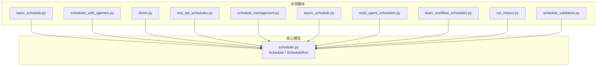
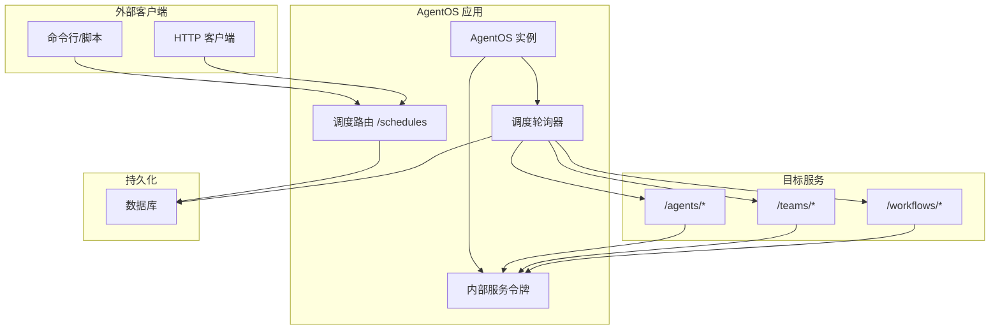
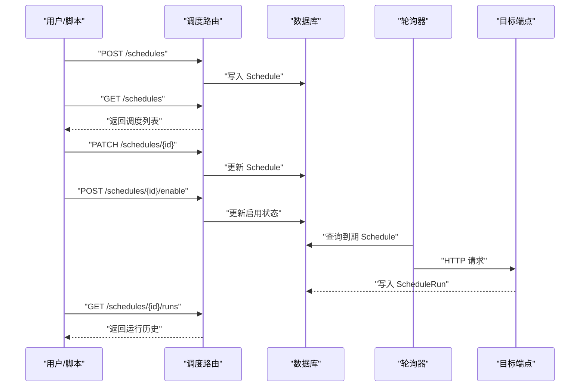
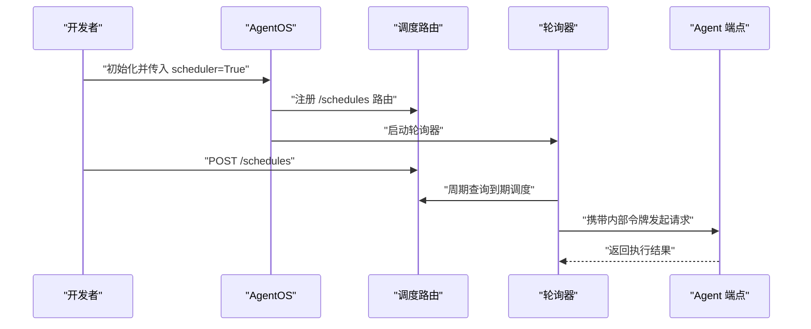
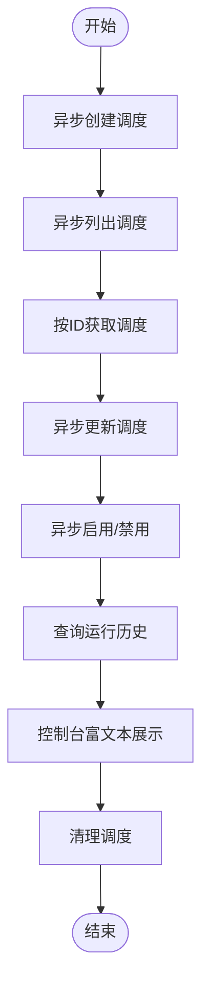
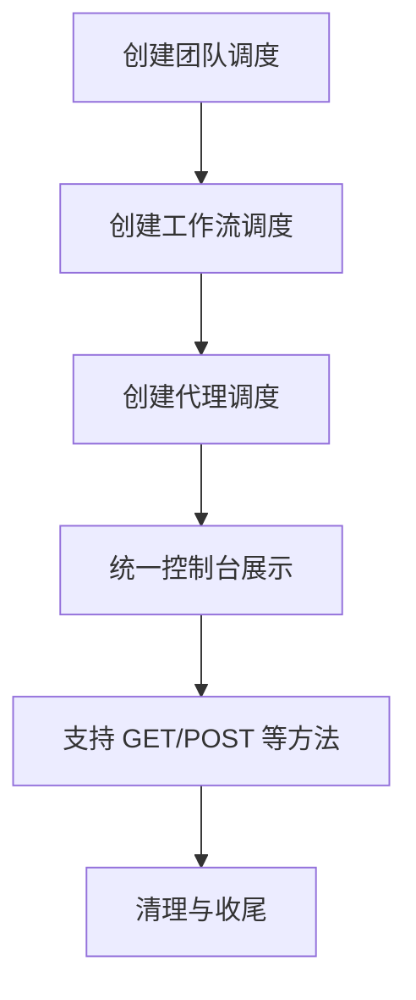
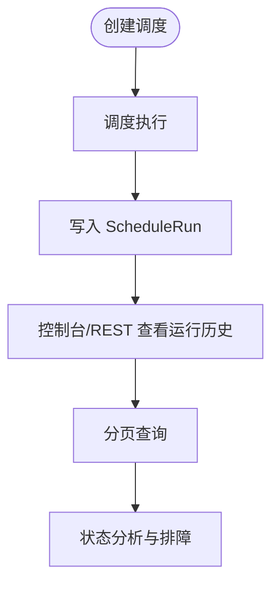
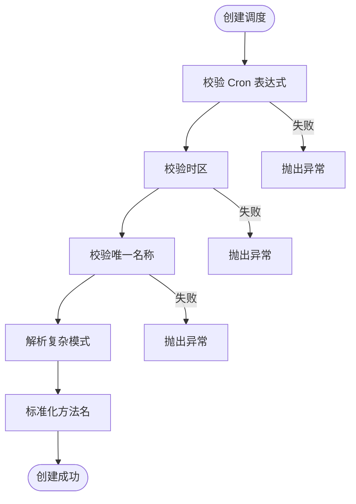
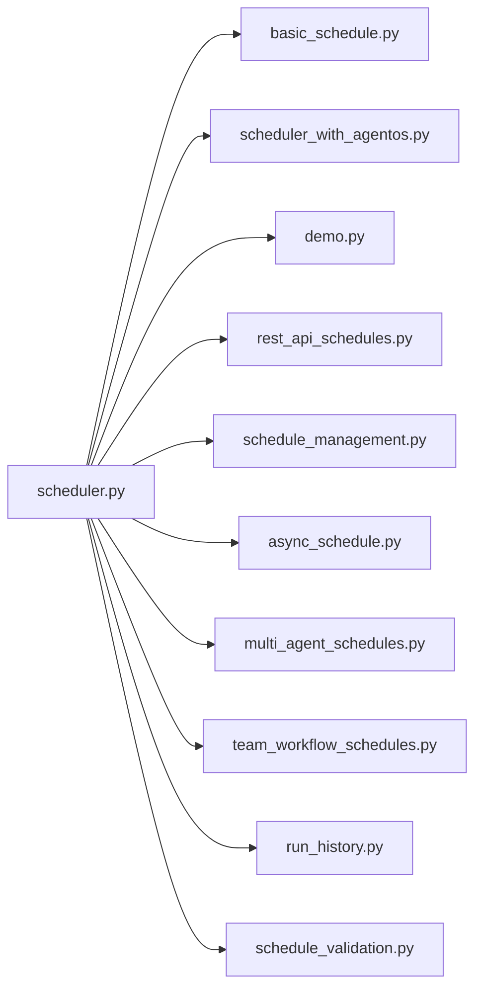

# 调度器系统

<cite>
**本文引用的文件**
- [demo.py](file://cookbook/05_agent_os/scheduler/demo.py)
- [basic_schedule.py](file://cookbook/05_agent_os/scheduler/basic_schedule.py)
- [async_schedule.py](file://cookbook/05_agent_os/scheduler/async_schedule.py)
- [team_workflow_schedules.py](file://cookbook/05_agent_os/scheduler/team_workflow_schedules.py)
- [scheduler_with_agentos.py](file://cookbook/05_agent_os/scheduler/scheduler_with_agentos.py)
- [schedule_management.py](file://cookbook/05_agent_os/scheduler/schedule_management.py)
- [schedule_validation.py](file://cookbook/05_agent_os/scheduler/schedule_validation.py)
- [run_history.py](file://cookbook/05_agent_os/scheduler/run_history.py)
- [rest_api_schedules.py](file://cookbook/05_agent_os/scheduler/rest_api_schedules.py)
- [multi_agent_schedules.py](file://cookbook/05_agent_os/scheduler/multi_agent_schedules.py)
- [scheduler.py](file://libs/agno/agno/db/schemas/scheduler.py)
</cite>

## 目录
1. [简介](#简介)
2. [项目结构](#项目结构)
3. [核心组件](#核心组件)
4. [架构总览](#架构总览)
5. [详细组件分析](#详细组件分析)
6. [依赖分析](#依赖分析)
7. [性能考虑](#性能考虑)
8. [故障排查指南](#故障排查指南)
9. [结论](#结论)
10. [附录](#附录)

## 简介
本文件系统性梳理 AgentOS 调度器系统，围绕任务调度与时间管理展开，覆盖基础调度、异步调度、团队工作流调度等场景；解释调度器的核心能力：任务计划、执行监控与状态跟踪；给出复杂调度需求（如优先级、重试、超时）的实现思路与最佳实践；并提供可直接参考的代码示例路径与可视化图示。

## 项目结构
调度器相关示例集中在 cookbook/05_agent_os/scheduler 目录，核心数据模型位于 libs/agno/agno/db/schemas/scheduler.py。示例按“运行模式”与“目标对象”划分：
- 基础运行模式：AgentOS 内置调度器、REST API 管理、手动触发、运行历史查看
- 目标对象：单智能体、多智能体、团队、工作流
- 工具与验证：异步 CRUD、验证与错误处理、控制台输出

**图表来源**
- [basic_schedule.py:1-64](file://cookbook/05_agent_os/scheduler/basic_schedule.py#L1-L64)
- [scheduler_with_agentos.py:1-68](file://cookbook/05_agent_os/scheduler/scheduler_with_agentos.py#L1-L68)
- [demo.py:1-81](file://cookbook/05_agent_os/scheduler/demo.py#L1-L81)
- [rest_api_schedules.py:1-161](file://cookbook/05_agent_os/scheduler/rest_api_schedules.py#L1-L161)
- [schedule_management.py:1-114](file://cookbook/05_agent_os/scheduler/schedule_management.py#L1-L114)
- [async_schedule.py:1-79](file://cookbook/05_agent_os/scheduler/async_schedule.py#L1-L79)
- [multi_agent_schedules.py:1-114](file://cookbook/05_agent_os/scheduler/multi_agent_schedules.py#L1-L114)
- [team_workflow_schedules.py:1-104](file://cookbook/05_agent_os/scheduler/team_workflow_schedules.py#L1-L104)
- [run_history.py:1-117](file://cookbook/05_agent_os/scheduler/run_history.py#L1-L117)
- [schedule_validation.py:1-95](file://cookbook/05_agent_os/scheduler/schedule_validation.py#L1-L95)
- [scheduler.py:1-152](file://libs/agno/agno/db/schemas/scheduler.py#L1-L152)

**章节来源**
- [basic_schedule.py:1-64](file://cookbook/05_agent_os/scheduler/basic_schedule.py#L1-L64)
- [scheduler_with_agentos.py:1-68](file://cookbook/05_agent_os/scheduler/scheduler_with_agentos.py#L1-L68)
- [demo.py:1-81](file://cookbook/05_agent_os/scheduler/demo.py#L1-L81)
- [scheduler.py:1-152](file://libs/agno/agno/db/schemas/scheduler.py#L1-L152)

## 核心组件
- 调度模型
  - Schedule：描述一次调度任务，包含名称、Cron 表达式、目标端点、HTTP 方法、载荷、时区、超时、最大重试次数、重试间隔、启用状态、下次运行时间、锁信息与时间戳等字段
  - ScheduleRun：描述一次执行尝试，包含触发时间、完成时间、状态（running/success/failed/paused/timeout）、状态码、关联 run_id/session_id、错误信息、输入输出与要求等
- 管理接口
  - 同步/异步 CRUD：create/list/get/update/delete
  - 启用/禁用：enable/disable
  - 运行历史：get_runs
  - 手动触发：trigger
- 控制台输出：SchedulerConsole 提供富文本表格展示调度与运行历史

这些组件共同构成调度器的数据层、业务层与展示层，支撑从计划到执行再到可观测性的完整闭环。

**章节来源**
- [scheduler.py:7-84](file://libs/agno/agno/db/schemas/scheduler.py#L7-L84)
- [scheduler.py:86-152](file://libs/agno/agno/db/schemas/scheduler.py#L86-L152)

## 架构总览
调度器在 AgentOS 中以“内置服务”的形式运行，通过以下路径协同：
- 配置阶段：AgentOS 初始化时注册调度 REST 端点、生成内部服务令牌、启动轮询器
- 计划阶段：通过 REST 或程序化接口创建 Schedule，计算 next_run_at
- 执行阶段：轮询器周期性检查到期任务，调用目标端点（/agents/*、/teams/*、/workflows/*），记录 ScheduleRun
- 监控阶段：通过 REST 或控制台查看运行历史、状态与统计

**图表来源**
- [scheduler_with_agentos.py:36-50](file://cookbook/05_agent_os/scheduler/scheduler_with_agentos.py#L36-L50)
- [rest_api_schedules.py:28-52](file://cookbook/05_agent_os/scheduler/rest_api_schedules.py#L28-L52)
- [demo.py:64-72](file://cookbook/05_agent_os/scheduler/demo.py#L64-L72)

## 详细组件分析

### 组件A：基础调度（REST 管理）
- 功能要点
  - 在独立应用中启用调度器，使用 REST API 创建、列出、更新、启用/禁用、手动触发与删除调度
  - 支持时区、重试与超时参数
- 关键流程（序列图）

**图表来源**
- [schedule_management.py:26-106](file://cookbook/05_agent_os/scheduler/schedule_management.py#L26-L106)
- [rest_api_schedules.py:28-156](file://cookbook/05_agent_os/scheduler/rest_api_schedules.py#L28-L156)
- [scheduler.py:7-84](file://libs/agno/agno/db/schemas/scheduler.py#L7-L84)

**章节来源**
- [schedule_management.py:1-114](file://cookbook/05_agent_os/scheduler/schedule_management.py#L1-L114)
- [rest_api_schedules.py:1-161](file://cookbook/05_agent_os/scheduler/rest_api_schedules.py#L1-L161)

### 组件B：AgentOS 内置调度器
- 功能要点
  - 在 AgentOS 中设置 scheduler=True 自动启用轮询器与调度路由
  - 自动生成内部服务令牌用于调度器与目标端点之间的认证
  - 可通过 REST 或程序化接口创建调度
- 关键流程（序列图）

**图表来源**
- [scheduler_with_agentos.py:36-50](file://cookbook/05_agent_os/scheduler/scheduler_with_agentos.py#L36-L50)
- [demo.py:64-72](file://cookbook/05_agent_os/scheduler/demo.py#L64-L72)

**章节来源**
- [scheduler_with_agentos.py:1-68](file://cookbook/05_agent_os/scheduler/scheduler_with_agentos.py#L1-L68)
- [demo.py:1-81](file://cookbook/05_agent_os/scheduler/demo.py#L1-L81)

### 组件C：异步调度管理
- 功能要点
  - 使用异步 ScheduleManager API：acreate、alist、aget、aupdate、adelete、aenable、adisable、aget_runs
  - 结合 SchedulerConsole 富文本展示
- 流程（流程图）

**图表来源**
- [async_schedule.py:17-79](file://cookbook/05_agent_os/scheduler/async_schedule.py#L17-L79)

**章节来源**
- [async_schedule.py:1-79](file://cookbook/05_agent_os/scheduler/async_schedule.py#L1-L79)

### 组件D：多智能体与团队/工作流调度
- 功能要点
  - 针对 /agents/*、/teams/*、/workflows/* 的不同端点进行调度
  - 支持不同负载结构（如 teams/workflows 的消息与流开关）
  - 支持非 run 端点（如 GET /health）的调度
- 流程（流程图）

**图表来源**
- [team_workflow_schedules.py:20-95](file://cookbook/05_agent_os/scheduler/team_workflow_schedules.py#L20-L95)

**章节来源**
- [team_workflow_schedules.py:1-104](file://cookbook/05_agent_os/scheduler/team_workflow_schedules.py#L1-L104)
- [multi_agent_schedules.py:1-114](file://cookbook/05_agent_os/scheduler/multi_agent_schedules.py#L1-L114)

### 组件E：运行历史与监控
- 功能要点
  - 模拟运行记录插入，展示富文本运行历史
  - 支持分页查询运行历史
  - 展示不同状态（成功、失败、运行中、暂停、超时）
- 流程（流程图）

**图表来源**
- [run_history.py:23-112](file://cookbook/05_agent_os/scheduler/run_history.py#L23-L112)
- [scheduler.py:86-152](file://libs/agno/agno/db/schemas/scheduler.py#L86-L152)

**章节来源**
- [run_history.py:1-117](file://cookbook/05_agent_os/scheduler/run_history.py#L1-L117)

### 组件F：调度验证与错误处理
- 功能要点
  - 验证无效 Cron、无效时区、重复名称
  - 支持复杂 Cron 模式（范围、步长、列表）
  - 方法名自动大写化
- 流程（流程图）

**图表来源**
- [schedule_validation.py:20-86](file://cookbook/05_agent_os/scheduler/schedule_validation.py#L20-L86)

**章节来源**
- [schedule_validation.py:1-95](file://cookbook/05_agent_os/scheduler/schedule_validation.py#L1-L95)

## 依赖分析
- 数据模型依赖
  - Schedule 与 ScheduleRun 作为核心数据结构，贯穿所有示例与测试
- 示例间耦合
  - 多数示例共享同一调度模型，彼此低耦合，便于替换运行环境（SQLite/Postgres）
- 外部依赖
  - HTTP 客户端（httpx）、数据库（SQLite/Postgres）、uvicorn 服务器

**图表来源**
- [scheduler.py:1-152](file://libs/agno/agno/db/schemas/scheduler.py#L1-L152)
- [basic_schedule.py:1-64](file://cookbook/05_agent_os/scheduler/basic_schedule.py#L1-L64)
- [scheduler_with_agentos.py:1-68](file://cookbook/05_agent_os/scheduler/scheduler_with_agentos.py#L1-L68)
- [demo.py:1-81](file://cookbook/05_agent_os/scheduler/demo.py#L1-L81)
- [rest_api_schedules.py:1-161](file://cookbook/05_agent_os/scheduler/rest_api_schedules.py#L1-L161)
- [schedule_management.py:1-114](file://cookbook/05_agent_os/scheduler/schedule_management.py#L1-L114)
- [async_schedule.py:1-79](file://cookbook/05_agent_os/scheduler/async_schedule.py#L1-L79)
- [multi_agent_schedules.py:1-114](file://cookbook/05_agent_os/scheduler/multi_agent_schedules.py#L1-L114)
- [team_workflow_schedules.py:1-104](file://cookbook/05_agent_os/scheduler/team_workflow_schedules.py#L1-L104)
- [run_history.py:1-117](file://cookbook/05_agent_os/scheduler/run_history.py#L1-L117)
- [schedule_validation.py:1-95](file://cookbook/05_agent_os/scheduler/schedule_validation.py#L1-L95)

**章节来源**
- [scheduler.py:1-152](file://libs/agno/agno/db/schemas/scheduler.py#L1-L152)

## 性能考虑
- 轮询间隔
  - scheduler_poll_interval 控制轮询频率，默认 15 秒，可根据任务紧急程度调整
- 并发与锁
  - Schedule 支持 locked_by/locked_at 字段，避免并发重复执行
- 超时与重试
  - timeout_seconds 与 max_retries/retry_delay_seconds 用于提升可靠性与资源占用平衡
- 数据库与网络
  - SQLite 适合演示，生产建议使用 Postgres 等具备更好并发与事务能力的数据库
- 观测性
  - 通过运行历史与控制台输出进行性能与稳定性评估

[本节为通用指导，不直接分析具体文件]

## 故障排查指南
- 常见问题与定位
  - Cron 表达式错误：检查表达式格式与合法范围
  - 时区无效：确认 IANA 时区字符串正确
  - 重复名称：确保调度名称唯一
  - 503 触发失败：轮询器尚未就绪或目标端点不可用
  - 运行失败：查看 ScheduleRun 的 status、status_code、error 字段
- 排查步骤
  - 使用 REST 列表与详情接口核对调度状态
  - 通过运行历史接口分页查看最近执行记录
  - 使用 SchedulerConsole 富文本快速定位异常
- 相关示例路径
  - [schedule_validation.py:20-86](file://cookbook/05_agent_os/scheduler/schedule_validation.py#L20-L86)
  - [rest_api_schedules.py:109-125](file://cookbook/05_agent_os/scheduler/rest_api_schedules.py#L109-L125)
  - [run_history.py:88-112](file://cookbook/05_agent_os/scheduler/run_history.py#L88-L112)

**章节来源**
- [schedule_validation.py:1-95](file://cookbook/05_agent_os/scheduler/schedule_validation.py#L1-L95)
- [rest_api_schedules.py:109-125](file://cookbook/05_agent_os/scheduler/rest_api_schedules.py#L109-L125)
- [run_history.py:88-112](file://cookbook/05_agent_os/scheduler/run_history.py#L88-L112)

## 结论
AgentOS 调度器系统以简洁的模型与丰富的示例覆盖了从基础到高级的多种调度场景。通过统一的 Schedule/ScheduleRun 数据模型、灵活的 REST 接口与内置轮询机制，系统实现了“计划—执行—监控”的闭环。结合异步管理、多目标端点与运行历史分析，可满足从单智能体到团队/工作流的复杂调度需求，并为扩展与运维提供了清晰的路径。

[本节为总结性内容，不直接分析具体文件]

## 附录
- 快速上手
  - 基础示例：[basic_schedule.py:1-64](file://cookbook/05_agent_os/scheduler/basic_schedule.py#L1-L64)
  - AgentOS 内置：[scheduler_with_agentos.py:1-68](file://cookbook/05_agent_os/scheduler/scheduler_with_agentos.py#L1-L68)
  - 程序化创建：[demo.py:1-81](file://cookbook/05_agent_os/scheduler/demo.py#L1-L81)
  - REST 管理：[rest_api_schedules.py:1-161](file://cookbook/05_agent_os/scheduler/rest_api_schedules.py#L1-L161)
  - 异步管理：[async_schedule.py:1-79](file://cookbook/05_agent_os/scheduler/async_schedule.py#L1-L79)
  - 多目标调度：[multi_agent_schedules.py:1-114](file://cookbook/05_agent_os/scheduler/multi_agent_schedules.py#L1-L114)
  - 团队/工作流：[team_workflow_schedules.py:1-104](file://cookbook/05_agent_os/scheduler/team_workflow_schedules.py#L1-L104)
  - 运行历史：[run_history.py:1-117](file://cookbook/05_agent_os/scheduler/run_history.py#L1-L117)
  - 验证与错误处理：[schedule_validation.py:1-95](file://cookbook/05_agent_os/scheduler/schedule_validation.py#L1-L95)
- 数据模型
  - [scheduler.py:1-152](file://libs/agno/agno/db/schemas/scheduler.py#L1-L152)