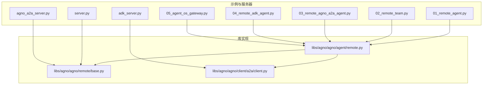
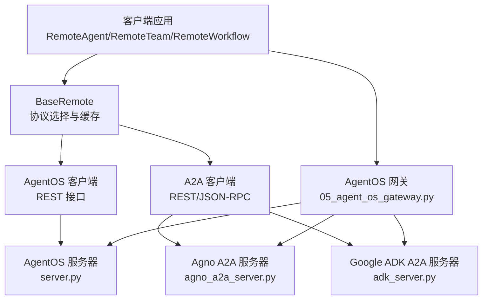
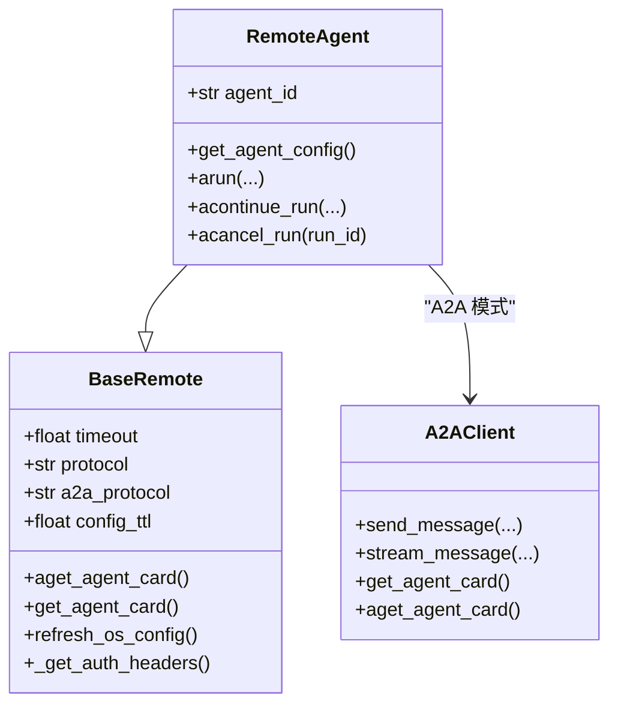
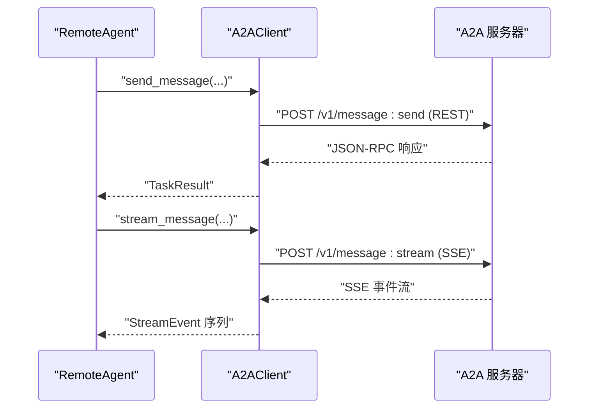
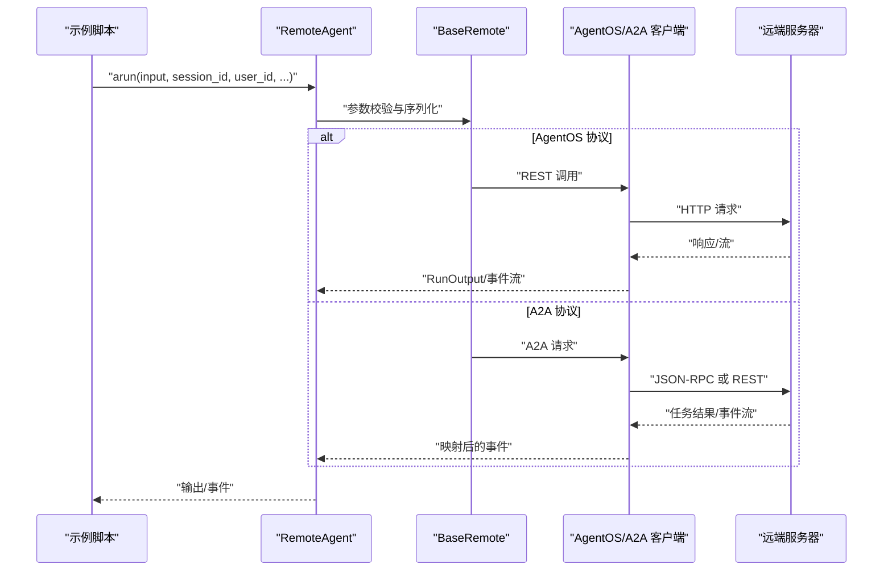
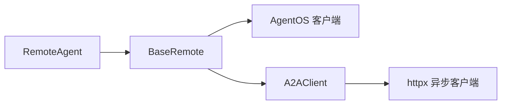

# 远程集成

<cite>
**本文引用的文件**
- [cookbook/05_agent_os/remote/README.md](file://cookbook/05_agent_os/remote/README.md)
- [cookbook/05_agent_os/remote/01_remote_agent.py](file://cookbook/05_agent_os/remote/01_remote_agent.py)
- [cookbook/05_agent_os/remote/02_remote_team.py](file://cookbook/05_agent_os/remote/02_remote_team.py)
- [cookbook/05_agent_os/remote/03_remote_agno_a2a_agent.py](file://cookbook/05_agent_os/remote/03_remote_agno_a2a_agent.py)
- [cookbook/05_agent_os/remote/04_remote_adk_agent.py](file://cookbook/05_agent_os/remote/04_remote_adk_agent.py)
- [cookbook/05_agent_os/remote/05_agent_os_gateway.py](file://cookbook/05_agent_os/remote/05_agent_os_gateway.py)
- [cookbook/05_agent_os/remote/server.py](file://cookbook/05_agent_os/remote/server.py)
- [cookbook/05_agent_os/remote/agno_a2a_server.py](file://cookbook/05_agent_os/remote/agno_a2a_server.py)
- [cookbook/05_agent_os/remote/adk_server.py](file://cookbook/05_agent_os/remote/adk_server.py)
- [libs/agno/agno/agent/remote.py](file://libs/agno/agno/agent/remote.py)
- [libs/agno/agno/remote/base.py](file://libs/agno/agno/remote/base.py)
- [libs/agno/agno/client/a2a/client.py](file://libs/agno/agno/client/a2a/client.py)
</cite>

## 目录
1. [简介](#简介)
2. [项目结构](#项目结构)
3. [核心组件](#核心组件)
4. [架构总览](#架构总览)
5. [详细组件分析](#详细组件分析)
6. [依赖关系分析](#依赖关系分析)
7. [性能考量](#性能考量)
8. [故障排查指南](#故障排查指南)
9. [结论](#结论)
10. [附录](#附录)

## 简介
本文件系统性阐述 AgentOS 的远程集成功能，覆盖远程代理与网关的实现方法，包括基于 AgentOS 协议的远程代理、Agno A2A 代理与 Google ADK A2A 代理网关。文档重点解释远程通信机制、网络协议选择（REST 与 JSON-RPC）、安全与认证、跨框架互操作性，以及在不同远程集成场景下的实现差异与注意事项。同时给出服务器配置、客户端连接与故障恢复策略，并总结设计原则与性能优化建议。

## 项目结构
该远程集成示例位于 cookbook/05_agent_os/remote 目录，包含多个示例脚本与配套的本地服务器脚本，用于演示不同协议与场景下的远程调用与网关聚合能力。

图表来源
- [cookbook/05_agent_os/remote/01_remote_agent.py:1-72](file://cookbook/05_agent_os/remote/01_remote_agent.py#L1-L72)
- [cookbook/05_agent_os/remote/02_remote_team.py:1-71](file://cookbook/05_agent_os/remote/02_remote_team.py#L1-L71)
- [cookbook/05_agent_os/remote/03_remote_agno_a2a_agent.py:1-109](file://cookbook/05_agent_os/remote/03_remote_agno_a2a_agent.py#L1-L109)
- [cookbook/05_agent_os/remote/04_remote_adk_agent.py:1-109](file://cookbook/05_agent_os/remote/04_remote_adk_agent.py#L1-L109)
- [cookbook/05_agent_os/remote/05_agent_os_gateway.py:1-174](file://cookbook/05_agent_os/remote/05_agent_os_gateway.py#L1-L174)
- [cookbook/05_agent_os/remote/server.py:1-142](file://cookbook/05_agent_os/remote/server.py#L1-L142)
- [cookbook/05_agent_os/remote/agno_a2a_server.py:1-106](file://cookbook/05_agent_os/remote/agno_a2a_server.py#L1-L106)
- [cookbook/05_agent_os/remote/adk_server.py:1-58](file://cookbook/05_agent_os/remote/adk_server.py#L1-L58)
- [libs/agno/agno/agent/remote.py:1-527](file://libs/agno/agno/agent/remote.py#L1-L527)
- [libs/agno/agno/remote/base.py:1-600](file://libs/agno/agno/remote/base.py#L1-L600)
- [libs/agno/agno/client/a2a/client.py:1-555](file://libs/agno/agno/client/a2a/client.py#L1-L555)

章节来源
- [cookbook/05_agent_os/remote/README.md:1-19](file://cookbook/05_agent_os/remote/README.md#L1-L19)

## 核心组件
- 远程代理（RemoteAgent）
  - 支持两种协议：AgentOS 原生 REST（默认）与 A2A（Agent-to-Agent）协议。
  - A2A 协议可选择 REST 风格或 Google ADK 的 JSON-RPC 风格。
  - 提供非流式与流式执行接口，支持会话上下文、媒体输入、工具执行续跑与取消。
- 基类（BaseRemote）
  - 统一封装远程客户端初始化、配置缓存（TTL）、认证头生成、A2A 能力卡获取等通用逻辑。
- A2A 客户端（A2AClient）
  - 实现 A2A 协议请求构建、JSON-RPC/REST 端点拼接、SSE 流解析、任务结果解析与错误映射。

章节来源
- [libs/agno/agno/agent/remote.py:21-65](file://libs/agno/agno/agent/remote.py#L21-L65)
- [libs/agno/agno/remote/base.py:364-444](file://libs/agno/agno/remote/base.py#L364-L444)
- [libs/agno/agno/client/a2a/client.py:27-73](file://libs/agno/agno/client/a2a/client.py#L27-L73)

## 架构总览
下图展示了从客户端到不同远程后端（AgentOS、Agno A2A、Google ADK A2A）的调用路径与协议选择：

图表来源
- [libs/agno/agno/agent/remote.py:289-351](file://libs/agno/agno/agent/remote.py#L289-L351)
- [libs/agno/agno/client/a2a/client.py:60-73](file://libs/agno/agno/client/a2a/client.py#L60-L73)
- [cookbook/05_agent_os/remote/server.py:120-127](file://cookbook/05_agent_os/remote/server.py#L120-L127)
- [cookbook/05_agent_os/remote/agno_a2a_server.py:85-91](file://cookbook/05_agent_os/remote/agno_a2a_server.py#L85-L91)
- [cookbook/05_agent_os/remote/adk_server.py:48-57](file://cookbook/05_agent_os/remote/adk_server.py#L48-L57)
- [cookbook/05_agent_os/remote/05_agent_os_gateway.py:117-153](file://cookbook/05_agent_os/remote/05_agent_os_gateway.py#L117-L153)

## 详细组件分析

### 远程代理（RemoteAgent）分析
- 协议选择与路由
  - 当 protocol="agentos" 时，使用 AgentOS 客户端进行 REST 调用；当 protocol="a2a" 时，使用 A2A 客户端进行消息发送或流式事件消费。
- 配置与缓存
  - 支持配置 TTL 缓存，减少重复查询；A2A 模式通过标准能力卡端点获取元数据。
- 输入序列化与认证
  - 对输入进行校验与序列化，支持通过 auth_token 注入 Authorization 头。
- 执行模式
  - 支持非流式与流式两种执行路径；流式路径将 A2A 事件映射为统一的运行事件类型。
- 续跑与取消
  - 支持基于 run_id 的工具执行续跑与取消，仅在 AgentOS 模式可用。

图表来源
- [libs/agno/agno/agent/remote.py:21-65](file://libs/agno/agno/agent/remote.py#L21-L65)
- [libs/agno/agno/remote/base.py:364-444](file://libs/agno/agno/remote/base.py#L364-L444)
- [libs/agno/agno/client/a2a/client.py:27-555](file://libs/agno/agno/client/a2a/client.py#L27-L555)

章节来源
- [libs/agno/agno/agent/remote.py:70-141](file://libs/agno/agno/agent/remote.py#L70-L141)
- [libs/agno/agno/agent/remote.py:289-351](file://libs/agno/agno/agent/remote.py#L289-L351)
- [libs/agno/agno/agent/remote.py:353-437](file://libs/agno/agno/agent/remote.py#L353-L437)
- [libs/agno/agno/agent/remote.py:463-503](file://libs/agno/agno/agent/remote.py#L463-L503)

### A2A 客户端（A2AClient）分析
- 端点与协议
  - protocol="json-rpc" 时直接使用根路径；否则使用 REST 风格路径前缀。
- 请求构建
  - 将文本与多模态输入（图片/音频/视频/文件）封装为标准消息对象，支持上下文 ID 与用户 ID。
- 响应解析
  - 非流式：解析任务结果，提取内容与制品信息。
  - 流式：按行解析 SSE，识别状态更新、内容片段与最终任务结果。
- 错误处理
  - 将连接失败与超时映射为统一的远端服务不可用异常。

图表来源
- [libs/agno/agno/client/a2a/client.py:323-392](file://libs/agno/agno/client/a2a/client.py#L323-L392)
- [libs/agno/agno/client/a2a/client.py:393-500](file://libs/agno/agno/client/a2a/client.py#L393-L500)

章节来源
- [libs/agno/agno/client/a2a/client.py:60-73](file://libs/agno/agno/client/a2a/client.py#L60-L73)
- [libs/agno/agno/client/a2a/client.py:178-229](file://libs/agno/agno/client/a2a/client.py#L178-L229)
- [libs/agno/agno/client/a2a/client.py:231-321](file://libs/agno/agno/client/a2a/client.py#L231-L321)

### 远程 Agent/Team/Workflow 示例流程
- 远程 Agent 示例
  - 展示通过 RemoteAgent 调用远端 AgentOS 实例上的代理，支持普通与流式响应。
- 远程 Team 示例
  - 展示通过 RemoteTeam 调用远端团队实例。
- A2A 场景
  - Agno A2A 与 Google ADK A2A 分别演示 REST 与 JSON-RPC 两种协议风格。
- 网关示例
  - 将多个远程源（AgentOS、Agno A2A、Google ADK A2A）与本地资源聚合为单一入口。

图表来源
- [cookbook/05_agent_os/remote/01_remote_agent.py:16-48](file://cookbook/05_agent_os/remote/01_remote_agent.py#L16-L48)
- [cookbook/05_agent_os/remote/02_remote_team.py:16-46](file://cookbook/05_agent_os/remote/02_remote_team.py#L16-L46)
- [cookbook/05_agent_os/remote/03_remote_agno_a2a_agent.py:25-65](file://cookbook/05_agent_os/remote/03_remote_agno_a2a_agent.py#L25-L65)
- [cookbook/05_agent_os/remote/04_remote_adk_agent.py:25-65](file://cookbook/05_agent_os/remote/04_remote_adk_agent.py#L25-L65)
- [libs/agno/agno/agent/remote.py:289-351](file://libs/agno/agno/agent/remote.py#L289-L351)

章节来源
- [cookbook/05_agent_os/remote/01_remote_agent.py:1-72](file://cookbook/05_agent_os/remote/01_remote_agent.py#L1-L72)
- [cookbook/05_agent_os/remote/02_remote_team.py:1-71](file://cookbook/05_agent_os/remote/02_remote_team.py#L1-L71)
- [cookbook/05_agent_os/remote/03_remote_agno_a2a_agent.py:1-109](file://cookbook/05_agent_os/remote/03_remote_agno_a2a_agent.py#L1-L109)
- [cookbook/05_agent_os/remote/04_remote_adk_agent.py:1-109](file://cookbook/05_agent_os/remote/04_remote_adk_agent.py#L1-L109)
- [cookbook/05_agent_os/remote/05_agent_os_gateway.py:1-174](file://cookbook/05_agent_os/remote/05_agent_os_gateway.py#L1-L174)

## 依赖关系分析
- 组件耦合
  - RemoteAgent 依赖 BaseRemote 进行协议选择与缓存管理；在 A2A 模式下进一步依赖 A2AClient。
- 外部依赖
  - A2A 客户端依赖 httpx 异步客户端进行网络请求；远端服务器需正确实现 A2A 能力卡与端点。
- 可能的循环依赖
  - 当前实现中，RemoteAgent 与 BaseRemote 为单向依赖，A2AClient 与 RemoteAgent 通过协议分支间接交互，未见循环依赖迹象。

图表来源
- [libs/agno/agno/agent/remote.py:21-65](file://libs/agno/agno/agent/remote.py#L21-L65)
- [libs/agno/agno/remote/base.py:412-443](file://libs/agno/agno/remote/base.py#L412-L443)
- [libs/agno/agno/client/a2a/client.py:18-22](file://libs/agno/agno/client/a2a/client.py#L18-L22)

章节来源
- [libs/agno/agno/agent/remote.py:1-527](file://libs/agno/agno/agent/remote.py#L1-L527)
- [libs/agno/agno/remote/base.py:1-600](file://libs/agno/agno/remote/base.py#L1-L600)
- [libs/agno/agno/client/a2a/client.py:1-555](file://libs/agno/agno/client/a2a/client.py#L1-L555)

## 性能考量
- 配置缓存（TTL）
  - BaseRemote 与 RemoteAgent 内置配置与能力卡缓存，降低重复查询开销。
- 流式传输
  - A2A 流式事件映射为统一事件模型，有助于前端实时渲染与用户体验优化。
- 超时与重试
  - A2A 客户端设置合理超时；示例中 RemoteAgent 支持 retries 参数（在 AgentOS 模式下传递），可结合业务需求进行重试策略设计。
- 并发与连接池
  - 使用默认异步客户端，建议在高并发场景下评估连接池与并发上限，避免阻塞。
- 网络抖动与带宽
  - 多模态输入（图片/音频/视频/文件）会增加传输负载，建议对大文件采用分块或外部存储方案。

[本节为通用指导，不直接分析具体文件]

## 故障排查指南
- 连接失败与超时
  - A2A 客户端在连接错误与超时时抛出统一异常，便于上层捕获与降级。
- 认证问题
  - 通过 auth_token 注入 Authorization 头；若远端启用了鉴权，需确保令牌有效且权限匹配。
- 端点与协议不匹配
  - A2A 协议需根据服务器实现选择 REST 或 JSON-RPC；错误的协议会导致请求失败。
- 网关受限
  - 网关示例提示：若远端服务器启用鉴权且保护了关键端点，部分网关功能可能无法正常工作，需调整远端权限策略。

章节来源
- [libs/agno/agno/client/a2a/client.py:380-391](file://libs/agno/agno/client/a2a/client.py#L380-L391)
- [libs/agno/agno/client/a2a/client.py:489-500](file://libs/agno/agno/client/a2a/client.py#L489-L500)
- [libs/agno/agno/agent/remote.py:515-526](file://libs/agno/agno/agent/remote.py#L515-L526)
- [cookbook/05_agent_os/remote/05_agent_os_gateway.py:15-17](file://cookbook/05_agent_os/remote/05_agent_os_gateway.py#L15-L17)

## 结论
AgentOS 的远程集成功能通过统一的 RemoteAgent 抽象，实现了对 AgentOS 原生 REST 与 A2A 协议的无缝支持。借助 BaseRemote 的配置缓存与认证头管理，以及 A2AClient 的标准化请求/响应解析，开发者可以快速接入不同框架的远程代理与团队。网关模式进一步将多源能力聚合为单一入口，便于统一治理与扩展。在实际部署中，建议关注协议选择、认证与鉴权、流式体验与网络性能，并结合业务场景制定合理的重试与降级策略。

[本节为总结性内容，不直接分析具体文件]

## 附录
- 快速开始
  - 启动各示例所需的本地服务器：AgentOS 服务器、Agno A2A 服务器、Google ADK A2A 服务器。
  - 在示例脚本中指定正确的 base_url 与 agent_id/团队/工作流 ID。
- 安全与鉴权
  - 使用 auth_token 注入 Bearer 令牌；如需网关聚合，请确保远端受保护端点的访问策略允许网关发现与调用。
- 多模态输入
  - RemoteAgent 支持图片/音频/视频/文件输入；注意网络带宽与远端接收限制。

章节来源
- [cookbook/05_agent_os/remote/README.md:15-19](file://cookbook/05_agent_os/remote/README.md#L15-L19)
- [cookbook/05_agent_os/remote/server.py:140-142](file://cookbook/05_agent_os/remote/server.py#L140-L142)
- [cookbook/05_agent_os/remote/agno_a2a_server.py:104-106](file://cookbook/05_agent_os/remote/agno_a2a_server.py#L104-L106)
- [cookbook/05_agent_os/remote/adk_server.py:54-57](file://cookbook/05_agent_os/remote/adk_server.py#L54-L57)