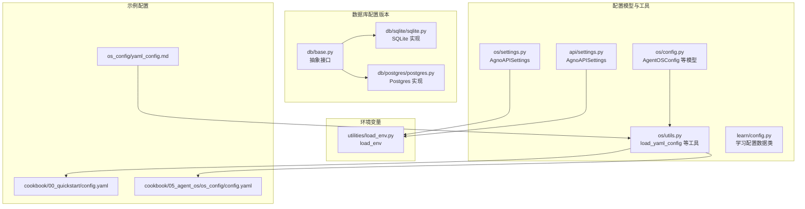
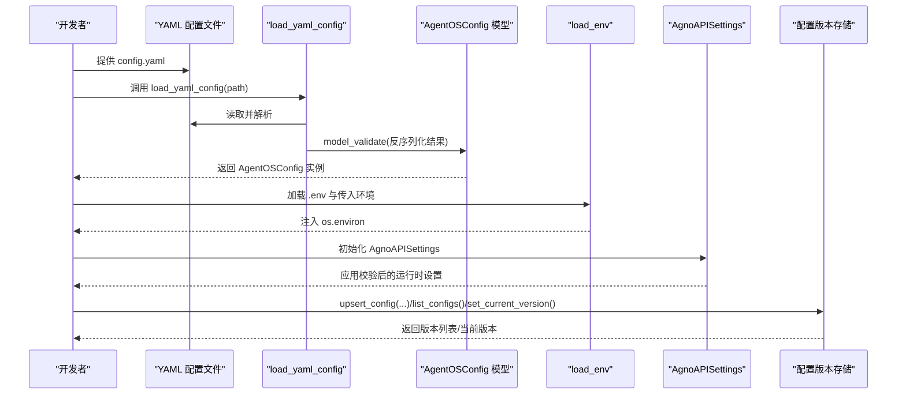
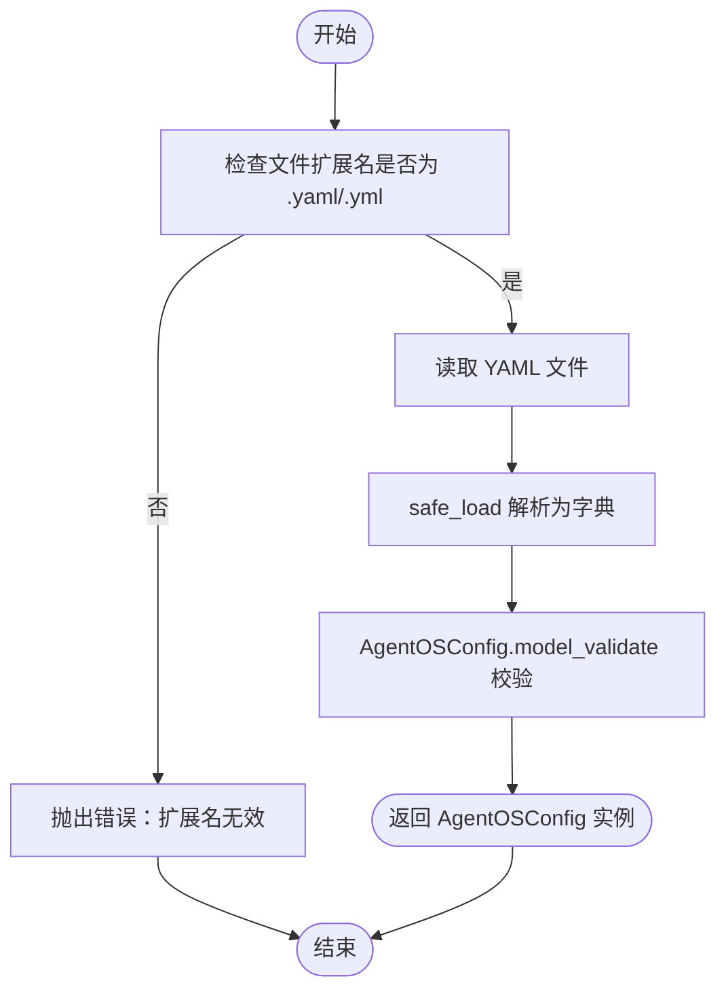
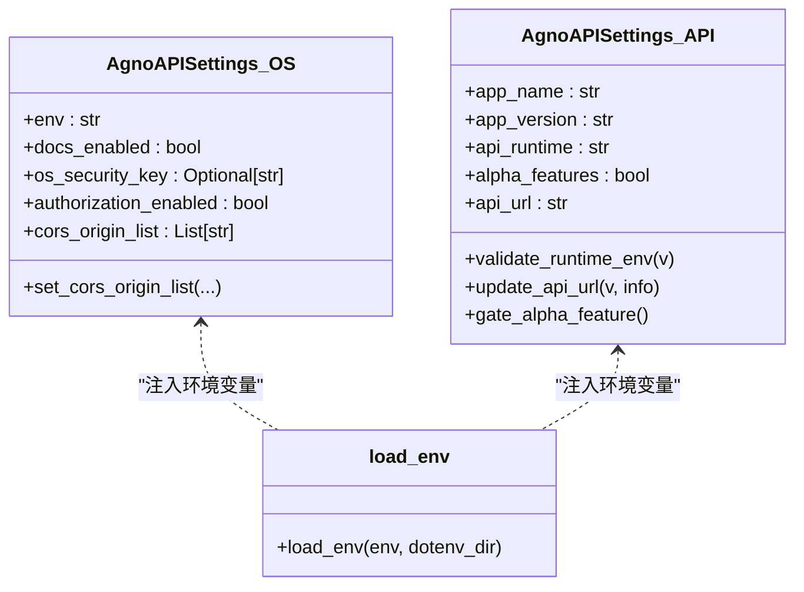
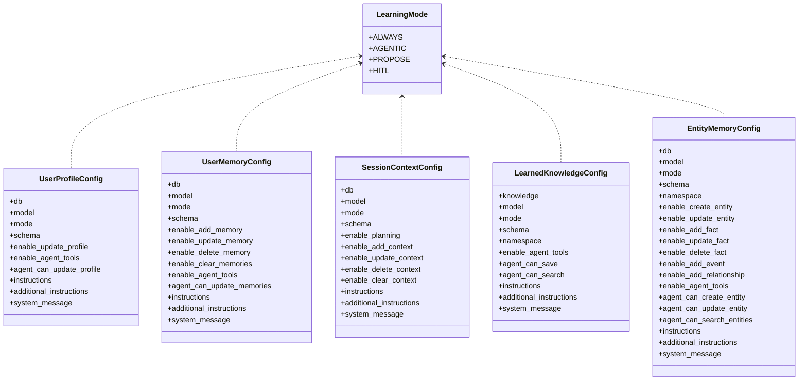
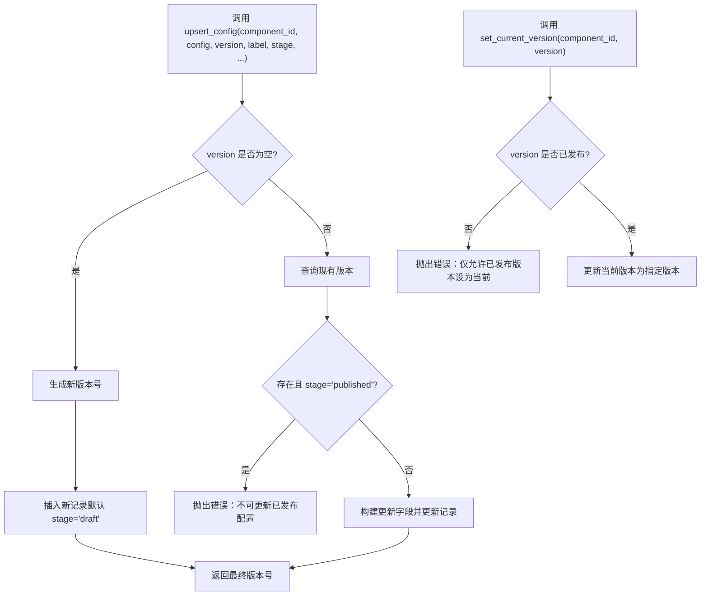
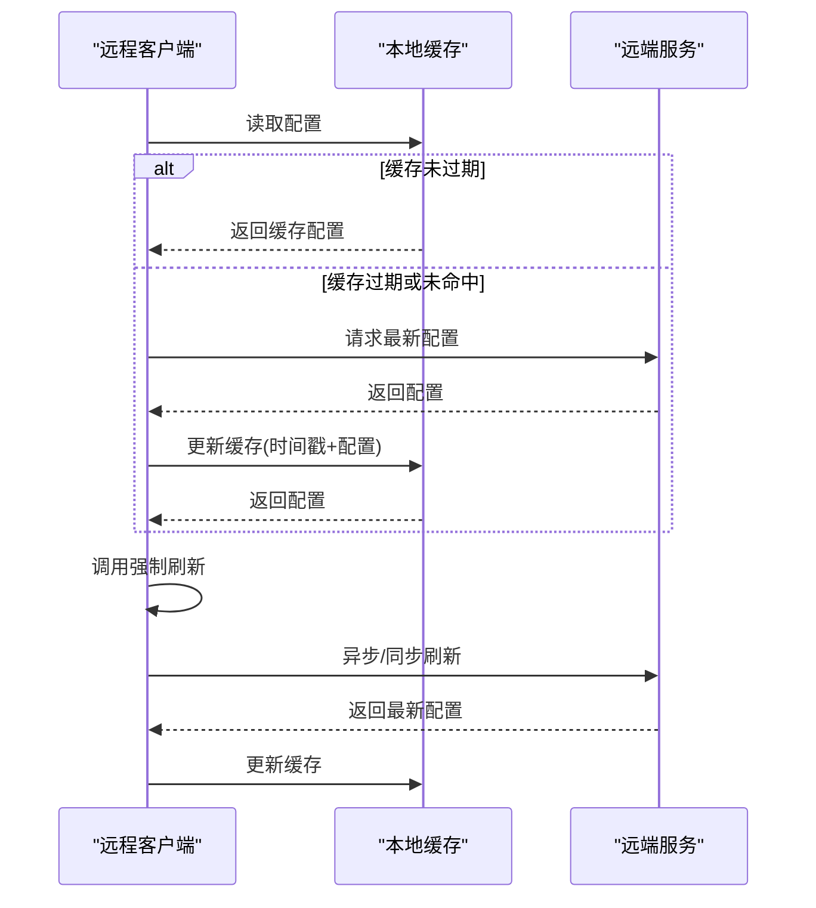
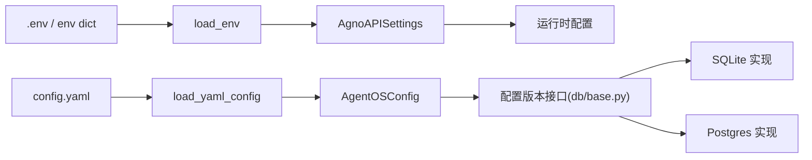

# 配置管理

<cite>
**本文引用的文件**
- [libs/agno/agno/os/config.py](file://libs/agno/agno/os/config.py)
- [libs/agno/agno/os/utils.py](file://libs/agno/agno/os/utils.py)
- [libs/agno/agno/os/settings.py](file://libs/agno/agno/os/settings.py)
- [libs/agno/agno/api/settings.py](file://libs/agno/agno/api/settings.py)
- [libs/agno/agno/learn/config.py](file://libs/agno/agno/learn/config.py)
- [libs/agno_infra/agno/utilities/load_env.py](file://libs/agno_infra/agno/utilities/load_env.py)
- [libs/agno/agno/db/base.py](file://libs/agno/agno/db/base.py)
- [libs/agno/agno/db/sqlite/sqlite.py](file://libs/agno/agno/db/sqlite/sqlite.py)
- [libs/agno/agno/db/postgres/postgres.py](file://libs/agno/agno/db/postgres/postgres.py)
- [cookbook/00_quickstart/config.yaml](file://cookbook/00_quickstart/config.yaml)
- [cookbook/05_agent_os/os_config/config.yaml](file://cookbook/05_agent_os/os_config/config.yaml)
- [cookbook/05_agent_os/os_config/yaml_config.md](file://cookbook/05_agent_os/os_config/yaml_config.md)
</cite>

## 目录
1. [简介](#简介)
2. [项目结构](#项目结构)
3. [核心组件](#核心组件)
4. [架构总览](#架构总览)
5. [详细组件分析](#详细组件分析)
6. [依赖分析](#依赖分析)
7. [性能考量](#性能考量)
8. [故障排查指南](#故障排查指南)
9. [结论](#结论)
10. [附录](#附录)

## 简介
本章节面向 AgentOS 的配置管理，系统性阐述配置的定义、加载、校验与动态更新机制，覆盖基础配置模型、YAML 配置文件、环境变量注入、数据库配置版本控制与回滚、以及运行时修改策略。文档以“可操作”为目标，既提供高层架构视图，也给出具体实现路径与最佳实践。

## 项目结构
围绕配置管理的关键目录与文件如下：
- 配置模型与工具：os/config.py、os/utils.py、os/settings.py、api/settings.py、learn/config.py
- 环境变量与 dotenv：utilities/load_env.py
- 数据库配置版本：db/base.py、db/sqlite/sqlite.py、db/postgres/postgres.py
- 示例配置：cookbook 中的多个 config.yaml 与 os_config 文档

**图表来源**
- [libs/agno/agno/os/config.py:135-146](file://libs/agno/agno/os/config.py#L135-L146)
- [libs/agno/agno/os/utils.py:751-764](file://libs/agno/agno/os/utils.py#L751-L764)
- [libs/agno/agno/os/settings.py:9-47](file://libs/agno/agno/os/settings.py#L9-L47)
- [libs/agno/agno/api/settings.py:12-54](file://libs/agno/agno/api/settings.py#L12-L54)
- [libs/agno/agno/learn/config.py:1-464](file://libs/agno/agno/learn/config.py#L1-L464)
- [libs/agno_infra/agno/utilities/load_env.py:5-19](file://libs/agno_infra/agno/utilities/load_env.py#L5-L19)
- [libs/agno/agno/db/base.py:697-811](file://libs/agno/agno/db/base.py#L697-L811)
- [libs/agno/agno/db/sqlite/sqlite.py:3652-3790](file://libs/agno/agno/db/sqlite/sqlite.py#L3652-L3790)
- [libs/agno/agno/db/postgres/postgres.py:3784-3926](file://libs/agno/agno/db/postgres/postgres.py#L3784-L3926)
- [cookbook/00_quickstart/config.yaml:1-57](file://cookbook/00_quickstart/config.yaml#L1-L57)
- [cookbook/05_agent_os/os_config/config.yaml:1-14](file://cookbook/05_agent_os/os_config/config.yaml#L1-L14)
- [cookbook/05_agent_os/os_config/yaml_config.md:25-61](file://cookbook/05_agent_os/os_config/yaml_config.md#L25-L61)

**章节来源**
- [libs/agno/agno/os/config.py:1-146](file://libs/agno/agno/os/config.py#L1-L146)
- [libs/agno/agno/os/utils.py:751-764](file://libs/agno/agno/os/utils.py#L751-L764)
- [libs/agno/agno/os/settings.py:1-47](file://libs/agno/agno/os/settings.py#L1-L47)
- [libs/agno/agno/api/settings.py:1-54](file://libs/agno/agno/api/settings.py#L1-L54)
- [libs/agno/agno/learn/config.py:1-464](file://libs/agno/agno/learn/config.py#L1-L464)
- [libs/agno_infra/agno/utilities/load_env.py:1-19](file://libs/agno_infra/agno/utilities/load_env.py#L1-L19)
- [libs/agno/agno/db/base.py:697-811](file://libs/agno/agno/db/base.py#L697-L811)
- [libs/agno/agno/db/sqlite/sqlite.py:3652-3790](file://libs/agno/agno/db/sqlite/sqlite.py#L3652-L3790)
- [libs/agno/agno/db/postgres/postgres.py:3784-3926](file://libs/agno/agno/db/postgres/postgres.py#L3784-L3926)
- [cookbook/00_quickstart/config.yaml:1-57](file://cookbook/00_quickstart/config.yaml#L1-L57)
- [cookbook/05_agent_os/os_config/config.yaml:1-14](file://cookbook/05_agent_os/os_config/config.yaml#L1-L14)
- [cookbook/05_agent_os/os_config/yaml_config.md:25-61](file://cookbook/05_agent_os/os_config/yaml_config.md#L25-L61)

## 核心组件
- 配置模型层
  - AgentOSConfig：顶层配置容器，包含各域（evals、knowledge、memory、session、metrics、traces、chat 等）的配置项与数据库映射。
  - 各域配置子模型：如 EvalsConfig、KnowledgeConfig、MemoryConfig、SessionConfig、MetricsConfig、TracesConfig、ChatConfig 等。
  - 学习配置：UserProfileConfig、UserMemoryConfig、SessionContextConfig、LearnedKnowledgeConfig、EntityMemoryConfig 等数据类。
- 工具与加载
  - load_yaml_config：从 YAML 文件加载并反序列化为 AgentOSConfig。
  - os/settings.py 与 api/settings.py：基于 pydantic-settings 的环境变量驱动设置，含字段校验与默认值处理。
- 环境变量注入
  - load_env：按目录加载 .env 并合并传入的环境字典，统一写入 os.environ。
- 数据库配置版本
  - 抽象接口：get_config、upsert_config、delete_config、list_configs、set_current_version。
  - SQLite/Postgres 实现：遵循“草稿可编辑、已发布不可变、发布即设为当前版本”的规则，并进行标签唯一性与链接完整性校验。

**章节来源**
- [libs/agno/agno/os/config.py:135-146](file://libs/agno/agno/os/config.py#L135-L146)
- [libs/agno/agno/learn/config.py:52-464](file://libs/agno/agno/learn/config.py#L52-L464)
- [libs/agno/agno/os/utils.py:751-764](file://libs/agno/agno/os/utils.py#L751-L764)
- [libs/agno/agno/os/settings.py:9-47](file://libs/agno/agno/os/settings.py#L9-L47)
- [libs/agno/agno/api/settings.py:12-54](file://libs/agno/agno/api/settings.py#L12-L54)
- [libs/agno/agno/db/base.py:697-811](file://libs/agno/agno/db/base.py#L697-L811)
- [libs/agno/agno/db/sqlite/sqlite.py:3652-3790](file://libs/agno/agno/db/sqlite/sqlite.py#L3652-L3790)
- [libs/agno/agno/db/postgres/postgres.py:3784-3926](file://libs/agno/agno/db/postgres/postgres.py#L3784-L3926)

## 架构总览
AgentOS 的配置管理由“模型定义—文件加载—环境注入—运行时应用—持久化版本控制”构成闭环。下图展示了从 YAML 到运行时配置的关键交互：

**图表来源**
- [libs/agno/agno/os/utils.py:751-764](file://libs/agno/agno/os/utils.py#L751-L764)
- [libs/agno/agno/os/config.py:135-146](file://libs/agno/agno/os/config.py#L135-L146)
- [libs/agno_infra/agno/utilities/load_env.py:5-19](file://libs/agno_infra/agno/utilities/load_env.py#L5-L19)
- [libs/agno/agno/os/settings.py:9-47](file://libs/agno/agno/os/settings.py#L9-L47)
- [libs/agno/agno/api/settings.py:12-54](file://libs/agno/agno/api/settings.py#L12-L54)
- [libs/agno/agno/db/base.py:697-811](file://libs/agno/agno/db/base.py#L697-L811)

## 详细组件分析

### 组件一：AgentOS 配置模型与 YAML 加载
- AgentOSConfig 作为顶层容器，聚合各域配置与数据库映射；ChatConfig 包含 quick_prompts 并通过字段校验限制数量。
- load_yaml_config 将 YAML 文件路径转换为 AgentOSConfig 实例，内部执行类型校验与字段约束。
- os_config 文档说明了 YAML 配置在 AgentOS.get_app() 中的加载流程，强调传入 YAML 路径与传入对象等价。

**图表来源**
- [libs/agno/agno/os/utils.py:751-764](file://libs/agno/agno/os/utils.py#L751-L764)
- [libs/agno/agno/os/config.py:120-146](file://libs/agno/agno/os/config.py#L120-L146)
- [cookbook/05_agent_os/os_config/yaml_config.md:46-61](file://cookbook/05_agent_os/os_config/yaml_config.md#L46-L61)

**章节来源**
- [libs/agno/agno/os/config.py:135-146](file://libs/agno/agno/os/config.py#L135-L146)
- [libs/agno/agno/os/utils.py:751-764](file://libs/agno/agno/os/utils.py#L751-L764)
- [cookbook/00_quickstart/config.yaml:1-57](file://cookbook/00_quickstart/config.yaml#L1-L57)
- [cookbook/05_agent_os/os_config/config.yaml:1-14](file://cookbook/05_agent_os/os_config/config.yaml#L1-L14)
- [cookbook/05_agent_os/os_config/yaml_config.md:25-61](file://cookbook/05_agent_os/os_config/yaml_config.md#L25-L61)

### 组件二：环境变量与设置校验
- AgnoAPISettings（os/settings.py 与 api/settings.py）分别用于 API 应用与通用 API 设置，支持通过环境变量注入与前缀区分。
- 字段校验包括运行时环境枚举校验、API URL 基于运行时自动推导、CORS 域白名单合并等。
- load_env 支持从指定目录加载 .env，并与传入的 env 字典合并到 os.environ。

**图表来源**
- [libs/agno/agno/os/settings.py:9-47](file://libs/agno/agno/os/settings.py#L9-L47)
- [libs/agno/agno/api/settings.py:12-54](file://libs/agno/agno/api/settings.py#L12-L54)
- [libs/agno_infra/agno/utilities/load_env.py:5-19](file://libs/agno_infra/agno/utilities/load_env.py#L5-L19)

**章节来源**
- [libs/agno/agno/os/settings.py:1-47](file://libs/agno/agno/os/settings.py#L1-L47)
- [libs/agno/agno/api/settings.py:1-54](file://libs/agno/agno/api/settings.py#L1-L54)
- [libs/agno_infra/agno/utilities/load_env.py:1-19](file://libs/agno_infra/agno/utilities/load_env.py#L1-L19)

### 组件三：学习配置的数据类设计
- 使用 dataclass 定义学习类型的配置，避免 Pydantic 运行时开销与异常中断代理运行。
- 包含模式选择（LearningMode）、数据库后端、提示词定制、工具开关、命名空间与共享边界等。

**图表来源**
- [libs/agno/agno/learn/config.py:32-464](file://libs/agno/agno/learn/config.py#L32-L464)

**章节来源**
- [libs/agno/agno/learn/config.py:1-464](file://libs/agno/agno/learn/config.py#L1-L464)

### 组件四：配置版本控制与动态更新
- 抽象接口定义了获取、创建/更新、删除、列出与设置当前版本的能力。
- SQLite/Postgres 实现遵循“草稿可编辑、已发布不可变、发布即设为当前版本”的规则，并对标签唯一性与链接完整性进行校验。
- 支持通过 set_current_version 回滚到历史已发布版本。

**图表来源**
- [libs/agno/agno/db/base.py:697-811](file://libs/agno/agno/db/base.py#L697-L811)
- [libs/agno/agno/db/sqlite/sqlite.py:3652-3790](file://libs/agno/agno/db/sqlite/sqlite.py#L3652-L3790)
- [libs/agno/agno/db/postgres/postgres.py:3784-3926](file://libs/agno/agno/db/postgres/postgres.py#L3784-L3926)

**章节来源**
- [libs/agno/agno/db/base.py:697-811](file://libs/agno/agno/db/base.py#L697-L811)
- [libs/agno/agno/db/sqlite/sqlite.py:3652-3790](file://libs/agno/agno/db/sqlite/sqlite.py#L3652-L3790)
- [libs/agno/agno/db/postgres/postgres.py:3784-3926](file://libs/agno/agno/db/postgres/postgres.py#L3784-L3926)

### 组件五：运行时修改与缓存刷新
- 远程客户端支持缓存 AgentOS 配置与单个 Agent 配置，提供强制刷新接口，避免频繁网络请求。
- 通过 TTL 控制缓存有效期，提升响应速度与稳定性。

**图表来源**
- [libs/agno/agno/remote/base.py:450-489](file://libs/agno/agno/remote/base.py#L450-L489)
- [libs/agno/agno/agent/remote.py:105-141](file://libs/agno/agno/agent/remote.py#L105-L141)

**章节来源**
- [libs/agno/agno/remote/base.py:450-489](file://libs/agno/agno/remote/base.py#L450-L489)
- [libs/agno/agno/agent/remote.py:105-141](file://libs/agno/agno/agent/remote.py#L105-L141)

## 依赖分析
- 配置模型与工具
  - os/config.py 为所有配置提供强类型定义；os/utils.py 提供 YAML 加载入口；os/settings.py 与 api/settings.py 提供运行时设置与校验。
- 环境变量
  - load_env 为上述设置提供统一的环境变量注入能力，确保 .env 与外部传入环境的一致性。
- 数据库配置版本
  - db/base.py 定义抽象接口，sqlite 与 postgres 实现遵循统一规则，保证跨存储后端的一致行为。

**图表来源**
- [libs/agno/agno/os/utils.py:751-764](file://libs/agno/agno/os/utils.py#L751-L764)
- [libs/agno/agno/os/config.py:135-146](file://libs/agno/agno/os/config.py#L135-L146)
- [libs/agno_infra/agno/utilities/load_env.py:5-19](file://libs/agno_infra/agno/utilities/load_env.py#L5-L19)
- [libs/agno/agno/os/settings.py:9-47](file://libs/agno/agno/os/settings.py#L9-L47)
- [libs/agno/agno/db/base.py:697-811](file://libs/agno/agno/db/base.py#L697-L811)
- [libs/agno/agno/db/sqlite/sqlite.py:3652-3790](file://libs/agno/agno/db/sqlite/sqlite.py#L3652-L3790)
- [libs/agno/agno/db/postgres/postgres.py:3784-3926](file://libs/agno/agno/db/postgres/postgres.py#L3784-L3926)

**章节来源**
- [libs/agno/agno/os/utils.py:751-764](file://libs/agno/agno/os/utils.py#L751-L764)
- [libs/agno/agno/os/config.py:135-146](file://libs/agno/agno/os/config.py#L135-L146)
- [libs/agno_infra/agno/utilities/load_env.py:1-19](file://libs/agno_infra/agno/utilities/load_env.py#L1-L19)
- [libs/agno/agno/os/settings.py:1-47](file://libs/agno/agno/os/settings.py#L1-L47)
- [libs/agno/agno/db/base.py:697-811](file://libs/agno/agno/db/base.py#L697-L811)
- [libs/agno/agno/db/sqlite/sqlite.py:3652-3790](file://libs/agno/agno/db/sqlite/sqlite.py#L3652-L3790)
- [libs/agno/agno/db/postgres/postgres.py:3784-3926](file://libs/agno/agno/db/postgres/postgres.py#L3784-L3926)

## 性能考量
- YAML 加载与模型校验
  - load_yaml_config 在大体量配置时建议缓存解析结果，避免重复 IO 与校验开销。
- 环境变量注入
  - load_env 仅在初始化阶段执行一次，后续通过 os.environ 访问，避免重复解析。
- 数据库配置版本
  - upsert_config 与 list_configs 查询应配合索引优化（按 component_id、version、stage），减少全表扫描。
- 远程配置缓存
  - 合理设置 TTL，平衡实时性与网络开销；批量刷新时采用异步策略降低阻塞。

## 故障排查指南
- YAML 配置加载失败
  - 症状：扩展名不被接受或解析失败。
  - 排查：确认文件扩展名为 .yaml 或 .yml；检查 YAML 语法与缩进；使用 model_validate 输出的错误定位字段。
  - 参考：[libs/agno/agno/os/utils.py:751-764](file://libs/agno/agno/os/utils.py#L751-L764)
- 环境变量未生效
  - 症状：AgnoAPISettings 未按预期取值。
  - 排查：确认 .env 文件存在且位于指定目录；检查 AGNO_ 前缀是否正确；验证 load_env 是否在初始化前调用。
  - 参考：[libs/agno/agno/os/settings.py:9-47](file://libs/agno/agno/os/settings.py#L9-L47)、[libs/agno/agno/api/settings.py:12-54](file://libs/agno/agno/api/settings.py#L12-L54)、[libs/agno_infra/agno/utilities/load_env.py:5-19](file://libs/agno_infra/agno/utilities/load_env.py#L5-L19)
- 配置版本更新异常
  - 症状：更新已发布配置失败或标签冲突。
  - 排查：确认目标版本状态；检查标签唯一性；核对链接完整性（child_version）。
  - 参考：[libs/agno/agno/db/base.py:697-811](file://libs/agno/agno/db/base.py#L697-L811)、[libs/agno/agno/db/sqlite/sqlite.py:3652-3790](file://libs/agno/agno/db/sqlite/sqlite.py#L3652-L3790)、[libs/agno/agno/db/postgres/postgres.py:3784-3926](file://libs/agno/agno/db/postgres/postgres.py#L3784-L3926)
- 远程配置未刷新
  - 症状：本地缓存陈旧导致行为异常。
  - 排查：调用强制刷新接口；检查 TTL 设置；确认网络连通性。
  - 参考：[libs/agno/agno/remote/base.py:450-489](file://libs/agno/agno/remote/base.py#L450-L489)、[libs/agno/agno/agent/remote.py:105-141](file://libs/agno/agno/agent/remote.py#L105-L141)

**章节来源**
- [libs/agno/agno/os/utils.py:751-764](file://libs/agno/agno/os/utils.py#L751-L764)
- [libs/agno/agno/os/settings.py:1-47](file://libs/agno/agno/os/settings.py#L1-L47)
- [libs/agno/agno/api/settings.py:1-54](file://libs/agno/agno/api/settings.py#L1-L54)
- [libs/agno_infra/agno/utilities/load_env.py:1-19](file://libs/agno_infra/agno/utilities/load_env.py#L1-L19)
- [libs/agno/agno/db/base.py:697-811](file://libs/agno/agno/db/base.py#L697-L811)
- [libs/agno/agno/db/sqlite/sqlite.py:3652-3790](file://libs/agno/agno/db/sqlite/sqlite.py#L3652-L3790)
- [libs/agno/agno/db/postgres/postgres.py:3784-3926](file://libs/agno/agno/db/postgres/postgres.py#L3784-L3926)
- [libs/agno/agno/remote/base.py:450-489](file://libs/agno/agno/remote/base.py#L450-L489)
- [libs/agno/agno/agent/remote.py:105-141](file://libs/agno/agno/agent/remote.py#L105-L141)

## 结论
AgentOS 的配置管理以强类型模型为核心，结合 YAML 文件与环境变量注入，形成“静态配置 + 动态设置 + 版本化持久化”的完整体系。通过严格的字段校验、版本规则与缓存策略，既保障了易用性，又兼顾了生产环境的稳定性与可维护性。建议在实际工程中遵循本文最佳实践，确保配置变更可控、可观测、可回滚。

## 附录
- 配置文件格式要点
  - YAML 必须包含顶层键（如 chat、knowledge、memory、session、metrics、traces 等），并满足对应模型的字段要求。
  - quick_prompts 数量限制在模型层进行校验，超出将触发错误。
- 环境变量与前缀
  - API 设置类支持 AGNO_ 前缀注入；运行时环境与 API URL 会根据 api_runtime 自动调整。
- 配置继承与覆盖
  - YAML 与环境变量共同作用时，后者优先级更高；学习配置采用 dataclass，便于在运行时以实例属性方式覆盖默认值。
- 最佳实践
  - 将敏感信息放入 .env 并通过 load_env 注入；对 YAML 做最小必要字段配置；为配置版本启用标签与注释；定期回滚演练；对远程配置设置合理 TTL。