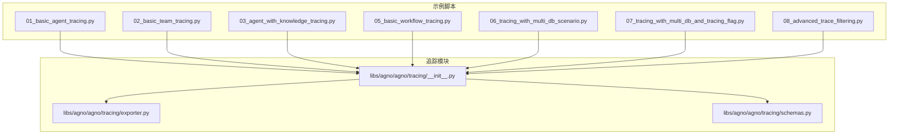
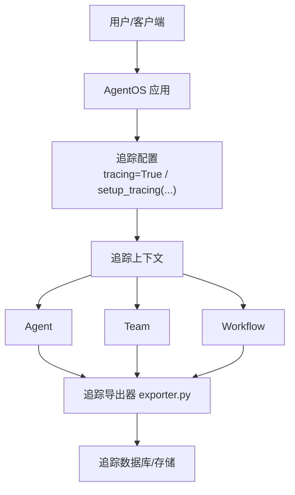
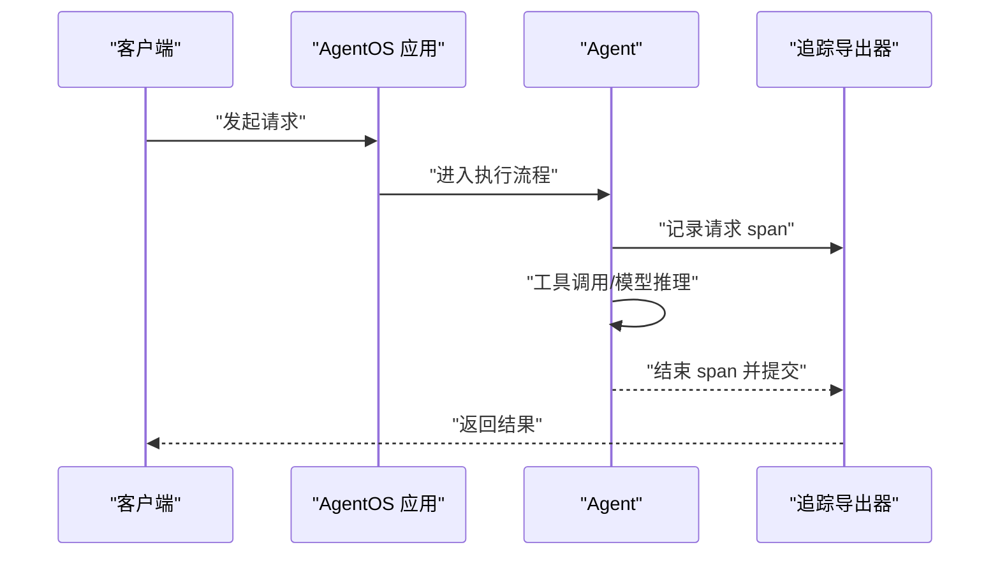
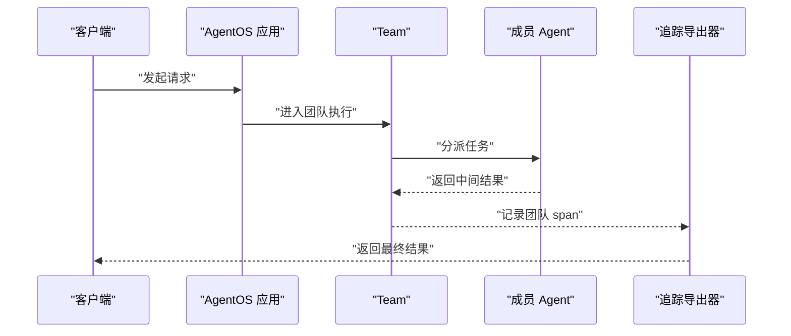
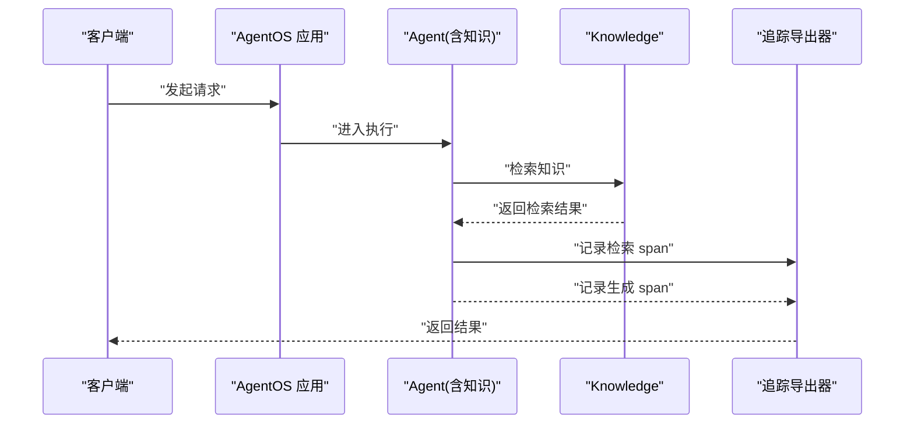
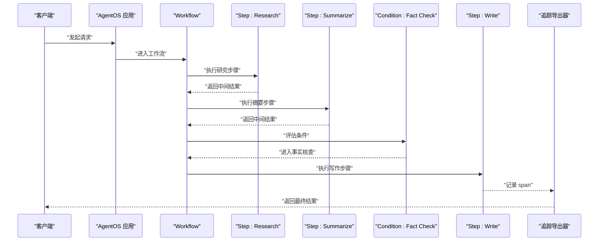
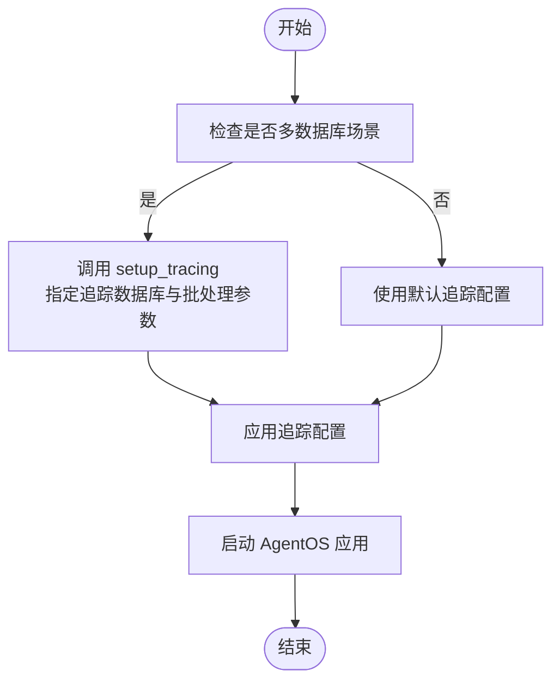
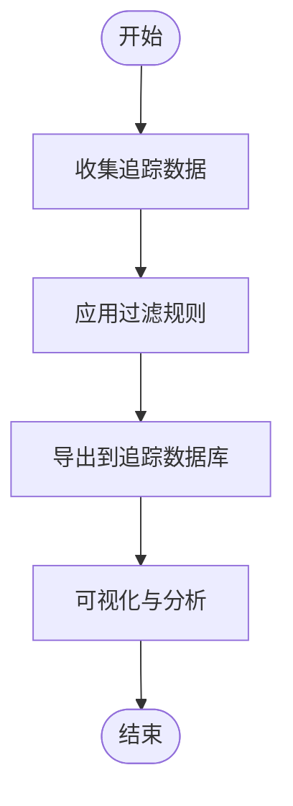
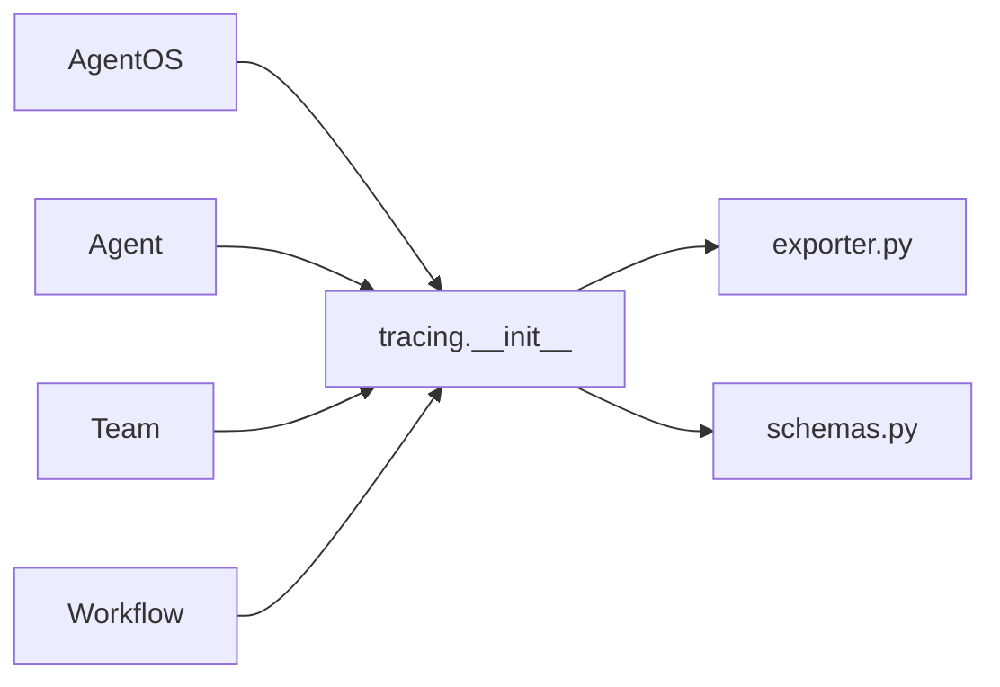

# 链路追踪

<cite>
**本文引用的文件**
- [01_basic_agent_tracing.py](file://cookbook/05_agent_os/tracing/01_basic_agent_tracing.py)
- [02_basic_team_tracing.py](file://cookbook/05_agent_os/tracing/02_basic_team_tracing.py)
- [03_agent_with_knowledge_tracing.py](file://cookbook/05_agent_os/tracing/03_agent_with_knowledge_tracing.py)
- [05_basic_workflow_tracing.py](file://cookbook/05_agent_os/tracing/05_basic_workflow_tracing.py)
- [06_tracing_with_multi_db_scenario.py](file://cookbook/05_agent_os/tracing/06_tracing_with_multi_db_scenario.py)
- [07_tracing_with_multi_db_and_tracing_flag.py](file://cookbook/05_agent_os/tracing/07_tracing_with_multi_db_and_tracing_flag.py)
- [08_advanced_trace_filtering.py](file://cookbook/05_agent_os/tracing/08_advanced_trace_filtering.py)
- [README.md](file://cookbook/05_agent_os/tracing/README.md)
- [__init__.py](file://libs/agno/agno/tracing/__init__.py)
- [exporter.py](file://libs/agno/agno/tracing/exporter.py)
- [schemas.py](file://libs/agno/agno/tracing/schemas.py)
</cite>

## 目录
1. [简介](#简介)
2. [项目结构](#项目结构)
3. [核心组件](#核心组件)
4. [架构总览](#架构总览)
5. [详细组件分析](#详细组件分析)
6. [依赖分析](#依赖分析)
7. [性能考量](#性能考量)
8. [故障排查指南](#故障排查指南)
9. [结论](#结论)
10. [附录](#附录)

## 简介
本文件面向 AgentOS 的链路追踪系统，系统性阐述分布式追踪与监控在代理（Agent）、团队（Team）与工作流（Workflow）中的实现方式与最佳实践。内容覆盖请求跟踪、性能监控与调试支持，解释不同追踪场景的特点与实现要点，并给出配置、数据采集与可视化的指导。文中所有示例均基于仓库中的示例脚本与追踪模块源码，避免凭空假设，确保可操作性与可验证性。

## 项目结构
AgentOS 的链路追踪示例集中在 cookbook/05_agent_os/tracing 目录，包含基础代理追踪、团队追踪、带知识检索的代理追踪、工作流追踪，以及多数据库场景下的追踪配置与高级过滤等示例。追踪能力由 libs/agno/agno/tracing 模块提供，包含导出器与数据模型定义。

图表来源
- [01_basic_agent_tracing.py:1-43](file://cookbook/05_agent_os/tracing/01_basic_agent_tracing.py#L1-L43)
- [02_basic_team_tracing.py:1-54](file://cookbook/05_agent_os/tracing/02_basic_team_tracing.py#L1-L54)
- [03_agent_with_knowledge_tracing.py:1-153](file://cookbook/05_agent_os/tracing/03_agent_with_knowledge_tracing.py#L1-L153)
- [05_basic_workflow_tracing.py:1-112](file://cookbook/05_agent_os/tracing/05_basic_workflow_tracing.py#L1-L112)
- [06_tracing_with_multi_db_scenario.py:1-63](file://cookbook/05_agent_os/tracing/06_tracing_with_multi_db_scenario.py#L1-L63)
- [07_tracing_with_multi_db_and_tracing_flag.py:1-59](file://cookbook/05_agent_os/tracing/07_tracing_with_multi_db_and_tracing_flag.py#L1-L59)
- [__init__.py](file://libs/agno/agno/tracing/__init__.py)
- [exporter.py](file://libs/agno/agno/tracing/exporter.py)
- [schemas.py](file://libs/agno/agno/tracing/schemas.py)

章节来源
- [README.md](file://cookbook/05_agent_os/tracing/README.md)
- [01_basic_agent_tracing.py:1-43](file://cookbook/05_agent_os/tracing/01_basic_agent_tracing.py#L1-L43)
- [02_basic_team_tracing.py:1-54](file://cookbook/05_agent_os/tracing/02_basic_team_tracing.py#L1-L54)
- [03_agent_with_knowledge_tracing.py:1-153](file://cookbook/05_agent_os/tracing/03_agent_with_knowledge_tracing.py#L1-L153)
- [05_basic_workflow_tracing.py:1-112](file://cookbook/05_agent_os/tracing/05_basic_workflow_tracing.py#L1-L112)
- [06_tracing_with_multi_db_scenario.py:1-63](file://cookbook/05_agent_os/tracing/06_tracing_with_multi_db_scenario.py#L1-L63)
- [07_tracing_with_multi_db_and_tracing_flag.py:1-59](file://cookbook/05_agent_os/tracing/07_tracing_with_multi_db_and_tracing_flag.py#L1-L59)
- [__init__.py](file://libs/agno/agno/tracing/__init__.py)
- [exporter.py](file://libs/agno/agno/tracing/exporter.py)
- [schemas.py](file://libs/agno/agno/tracing/schemas.py)

## 核心组件
- 追踪开关与应用装配
  - 在 AgentOS 构造时设置 tracing=True，即可对应用内的所有 Agent、Team、Workflow 自动启用追踪。
  - 示例路径：[01_basic_agent_tracing.py:30-34](file://cookbook/05_agent_os/tracing/01_basic_agent_tracing.py#L30-L34)、[02_basic_team_tracing.py:41-45](file://cookbook/05_agent_os/tracing/02_basic_team_tracing.py#L41-L45)、[05_basic_workflow_tracing.py:99-103](file://cookbook/05_agent_os/tracing/05_basic_workflow_tracing.py#L99-L103)、[07_tracing_with_multi_db_and_tracing_flag.py:45-50](file://cookbook/05_agent_os/tracing/07_tracing_with_multi_db_and_tracing_flag.py#L45-L50)
- 追踪导出与批处理
  - 使用 setup_tracing 可自定义追踪导出行为，如批量处理、队列大小与批次大小等参数，适用于多数据库或多实例场景。
  - 示例路径：[06_tracing_with_multi_db_scenario.py:26-28](file://cookbook/05_agent_os/tracing/06_tracing_with_multi_db_scenario.py#L26-L28)
- 数据库隔离与一致性
  - 将追踪写入与读取统一到专用数据库，确保跨多 Agent/Team 实例的一致性与可查询性。
  - 示例路径：[06_tracing_with_multi_db_scenario.py:23-28](file://cookbook/05_agent_os/tracing/06_tracing_with_multi_db_scenario.py#L23-L28)、[07_tracing_with_multi_db_and_tracing_flag.py:45-50](file://cookbook/05_agent_os/tracing/07_tracing_with_multi_db_and_tracing_flag.py#L45-L50)
- 知识检索与工具调用追踪
  - 带知识检索与推理工具的代理同样受全局 tracing 控制，便于端到端观测检索、生成与工具调用链路。
  - 示例路径：[03_agent_with_knowledge_tracing.py:130-134](file://cookbook/05_agent_os/tracing/03_agent_with_knowledge_tracing.py#L130-L134)

章节来源
- [01_basic_agent_tracing.py:30-34](file://cookbook/05_agent_os/tracing/01_basic_agent_tracing.py#L30-L34)
- [02_basic_team_tracing.py:41-45](file://cookbook/05_agent_os/tracing/02_basic_team_tracing.py#L41-L45)
- [03_agent_with_knowledge_tracing.py:130-134](file://cookbook/05_agent_os/tracing/03_agent_with_knowledge_tracing.py#L130-L134)
- [05_basic_workflow_tracing.py:99-103](file://cookbook/05_agent_os/tracing/05_basic_workflow_tracing.py#L99-L103)
- [06_tracing_with_multi_db_scenario.py:23-28](file://cookbook/05_agent_os/tracing/06_tracing_with_multi_db_scenario.py#L23-L28)
- [07_tracing_with_multi_db_and_tracing_flag.py:45-50](file://cookbook/05_agent_os/tracing/07_tracing_with_multi_db_and_tracing_flag.py#L45-L50)

## 架构总览
下图展示了从应用入口到追踪导出的整体链路：AgentOS 在构造时注入追踪能力；运行时各组件（Agent/Team/Workflow）通过统一的追踪上下文记录 span；最终由追踪导出器将 span 写入指定数据库或后端。

图表来源
- [01_basic_agent_tracing.py:30-34](file://cookbook/05_agent_os/tracing/01_basic_agent_tracing.py#L30-L34)
- [02_basic_team_tracing.py:41-45](file://cookbook/05_agent_os/tracing/02_basic_team_tracing.py#L41-L45)
- [05_basic_workflow_tracing.py:99-103](file://cookbook/05_agent_os/tracing/05_basic_workflow_tracing.py#L99-L103)
- [06_tracing_with_multi_db_scenario.py:26-28](file://cookbook/05_agent_os/tracing/06_tracing_with_multi_db_scenario.py#L26-L28)
- [exporter.py](file://libs/agno/agno/tracing/exporter.py)

## 详细组件分析

### 组件一：代理追踪（Agent）
- 功能要点
  - 通过 AgentOS(tracing=True) 启用全局追踪，无需逐个 Agent 设置。
  - 支持工具调用、消息交互、模型推理等关键节点的 span 记录。
- 关键流程（序列图）

图表来源
- [01_basic_agent_tracing.py:30-34](file://cookbook/05_agent_os/tracing/01_basic_agent_tracing.py#L30-L34)
- [exporter.py](file://libs/agno/agno/tracing/exporter.py)

章节来源
- [01_basic_agent_tracing.py:17-34](file://cookbook/05_agent_os/tracing/01_basic_agent_tracing.py#L17-L34)

### 组件二：团队追踪（Team）
- 功能要点
  - 团队作为协调者，其内部成员的调用也会被纳入同一追踪上下文，便于观察团队协作链路。
  - 全局 tracing=True 即可自动启用团队级追踪。
- 关键流程（序列图）

图表来源
- [02_basic_team_tracing.py:41-45](file://cookbook/05_agent_os/tracing/02_basic_team_tracing.py#L41-L45)
- [exporter.py](file://libs/agno/agno/tracing/exporter.py)

章节来源
- [02_basic_team_tracing.py:22-45](file://cookbook/05_agent_os/tracing/02_basic_team_tracing.py#L22-L45)

### 组件三：知识追踪（Agent + Knowledge）
- 功能要点
  - 知识检索与生成过程被完整纳入追踪，便于定位检索效率、命中质量与生成稳定性问题。
  - 通过统一 tracing 开关控制，无需额外配置。
- 关键流程（序列图）

图表来源
- [03_agent_with_knowledge_tracing.py:130-134](file://cookbook/05_agent_os/tracing/03_agent_with_knowledge_tracing.py#L130-L134)
- [exporter.py](file://libs/agno/agno/tracing/exporter.py)

章节来源
- [03_agent_with_knowledge_tracing.py:104-134](file://cookbook/05_agent_os/tracing/03_agent_with_knowledge_tracing.py#L104-L134)

### 组件四：工作流追踪（Workflow）
- 功能要点
  - 工作流中的步骤（Step）与条件（Condition）均可被追踪，便于分析分支与迭代逻辑。
  - 通过 tracing=True 启用工作流级追踪。
- 关键流程（序列图）

图表来源
- [05_basic_workflow_tracing.py:99-103](file://cookbook/05_agent_os/tracing/05_basic_workflow_tracing.py#L99-L103)
- [exporter.py](file://libs/agno/agno/tracing/exporter.py)

章节来源
- [05_basic_workflow_tracing.py:80-103](file://cookbook/05_agent_os/tracing/05_basic_workflow_tracing.py#L80-L103)

### 组件五：多数据库与追踪配置
- 功能要点
  - 多 Agent/Team 使用独立数据库时，建议使用 setup_tracing 明确追踪数据库与批处理策略，保证数据一致性与吞吐。
  - 也可通过 AgentOS(db=...) 指定追踪默认数据库，确保读写一致。
- 关键流程（流程图）

图表来源
- [06_tracing_with_multi_db_scenario.py:26-28](file://cookbook/05_agent_os/tracing/06_tracing_with_multi_db_scenario.py#L26-L28)
- [07_tracing_with_multi_db_and_tracing_flag.py:45-50](file://cookbook/05_agent_os/tracing/07_tracing_with_multi_db_and_tracing_flag.py#L45-L50)

章节来源
- [06_tracing_with_multi_db_scenario.py:19-55](file://cookbook/05_agent_os/tracing/06_tracing_with_multi_db_scenario.py#L19-L55)
- [07_tracing_with_multi_db_and_tracing_flag.py:18-50](file://cookbook/05_agent_os/tracing/07_tracing_with_multi_db_and_tracing_flag.py#L18-L50)

### 组件六：高级过滤与可观测性
- 功能要点
  - 通过高级过滤策略，可在大规模追踪数据中聚焦关键路径与异常事件，提升调试效率。
  - 结合数据库隔离与批处理参数，平衡性能与可观测性。
- 关键流程（流程图）

图表来源
- [08_advanced_trace_filtering.py](file://cookbook/05_agent_os/tracing/08_advanced_trace_filtering.py)

章节来源
- [08_advanced_trace_filtering.py](file://cookbook/05_agent_os/tracing/08_advanced_trace_filtering.py)

## 依赖分析
- 组件耦合
  - AgentOS 作为入口，向上游提供 tracing 开关与数据库配置；向下游各组件（Agent/Team/Workflow）注入追踪上下文。
  - 追踪模块内部通过导出器与数据模型进行解耦，便于扩展与替换。
- 外部依赖
  - 示例脚本依赖 OpenTelemetry 相关包以完成链路追踪的采集与导出（示例注释中已列出安装要求）。
- 潜在循环依赖
  - 追踪模块与业务组件通过接口注入，未见直接循环依赖迹象。

图表来源
- [__init__.py](file://libs/agno/agno/tracing/__init__.py)
- [exporter.py](file://libs/agno/agno/tracing/exporter.py)
- [schemas.py](file://libs/agno/agno/tracing/schemas.py)

章节来源
- [__init__.py](file://libs/agno/agno/tracing/__init__.py)
- [exporter.py](file://libs/agno/agno/tracing/exporter.py)
- [schemas.py](file://libs/agno/agno/tracing/schemas.py)

## 性能考量
- 批量导出与队列
  - 使用 setup_tracing 的批量处理参数可降低导出开销，提高吞吐；需根据实例规模与数据库承载能力调整队列大小与批次大小。
  - 示例路径：[06_tracing_with_multi_db_scenario.py:26-28](file://cookbook/05_agent_os/tracing/06_tracing_with_multi_db_scenario.py#L26-L28)
- 数据库选择
  - 对于高并发场景，建议将追踪数据库与业务数据库分离，避免相互影响。
  - 示例路径：[06_tracing_with_multi_db_scenario.py:23-28](file://cookbook/05_agent_os/tracing/06_tracing_with_multi_db_scenario.py#L23-L28)、[07_tracing_with_multi_db_and_tracing_flag.py:45-50](file://cookbook/05_agent_os/tracing/07_tracing_with_multi_db_and_tracing_flag.py#L45-L50)
- 资源占用
  - 追踪会带来额外的 CPU 与 I/O 开销，应结合实际负载评估开启范围与采样策略。

## 故障排查指南
- 追踪未生效
  - 确认 AgentOS 构造时已设置 tracing=True 或已调用 setup_tracing。
  - 示例路径：[01_basic_agent_tracing.py:30-34](file://cookbook/05_agent_os/tracing/01_basic_agent_tracing.py#L30-L34)、[06_tracing_with_multi_db_scenario.py:26-28](file://cookbook/05_agent_os/tracing/06_tracing_with_multi_db_scenario.py#L26-L28)
- 数据不一致或丢失
  - 在多数据库场景下，确保追踪写入与读取使用同一数据库；必要时通过 AgentOS(db=...) 指定追踪默认数据库。
  - 示例路径：[06_tracing_with_multi_db_scenario.py:50-54](file://cookbook/05_agent_os/tracing/06_tracing_with_multi_db_scenario.py#L50-L54)、[07_tracing_with_multi_db_and_tracing_flag.py:45-50](file://cookbook/05_agent_os/tracing/07_tracing_with_multi_db_and_tracing_flag.py#L45-L50)
- 导出性能问题
  - 调整批量参数与队列大小，观察数据库写入压力与延迟变化。
  - 示例路径：[06_tracing_with_multi_db_scenario.py:26-28](file://cookbook/05_agent_os/tracing/06_tracing_with_multi_db_scenario.py#L26-L28)
- 可视化与查询
  - 使用示例脚本提供的服务端点进行测试与验证，确认追踪数据可被正确采集与查询。
  - 示例路径：[01_basic_agent_tracing.py:41-43](file://cookbook/05_agent_os/tracing/01_basic_agent_tracing.py#L41-L43)、[05_basic_workflow_tracing.py:110-112](file://cookbook/05_agent_os/tracing/05_basic_workflow_tracing.py#L110-L112)

章节来源
- [01_basic_agent_tracing.py:30-43](file://cookbook/05_agent_os/tracing/01_basic_agent_tracing.py#L30-L43)
- [05_basic_workflow_tracing.py:99-112](file://cookbook/05_agent_os/tracing/05_basic_workflow_tracing.py#L99-L112)
- [06_tracing_with_multi_db_scenario.py:23-54](file://cookbook/05_agent_os/tracing/06_tracing_with_multi_db_scenario.py#L23-L54)
- [07_tracing_with_multi_db_and_tracing_flag.py:45-59](file://cookbook/05_agent_os/tracing/07_tracing_with_multi_db_and_tracing_flag.py#L45-L59)

## 结论
AgentOS 的链路追踪通过“全局开关 + 统一导出”的设计，在代理、团队与工作流等复杂场景下提供了统一的可观测性入口。配合多数据库隔离与批处理参数，可在保证性能的同时获得完整的请求跟踪、性能监控与调试支持。建议在生产环境中结合业务规模与资源约束，合理配置追踪范围与导出策略，并通过高级过滤与可视化持续优化观测效果。

## 附录
- 快速上手
  - 在 AgentOS 构造时设置 tracing=True，即可对应用内所有组件启用追踪。
  - 示例路径：[02_basic_team_tracing.py:41-45](file://cookbook/05_agent_os/tracing/02_basic_team_tracing.py#L41-L45)
- 数据模型参考
  - 追踪数据模型与导出器位于 libs/agno/agno/tracing，可据此扩展自定义导出器或适配其他后端。
  - 文件路径：[__init__.py](file://libs/agno/agno/tracing/__init__.py)、[exporter.py](file://libs/agno/agno/tracing/exporter.py)、[schemas.py](file://libs/agno/agno/tracing/schemas.py)