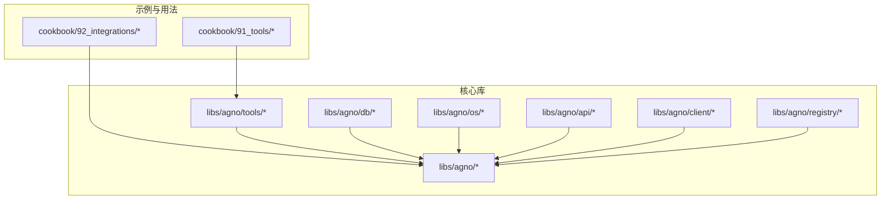
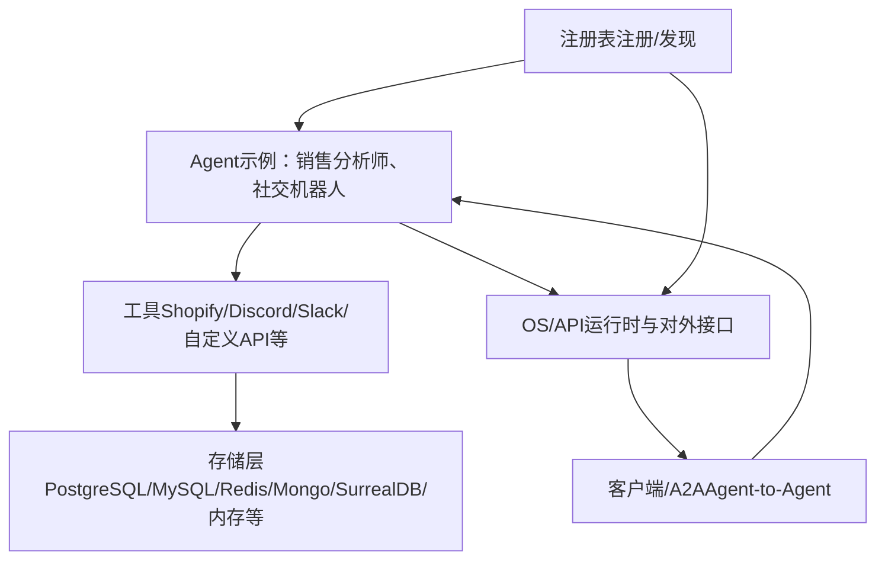
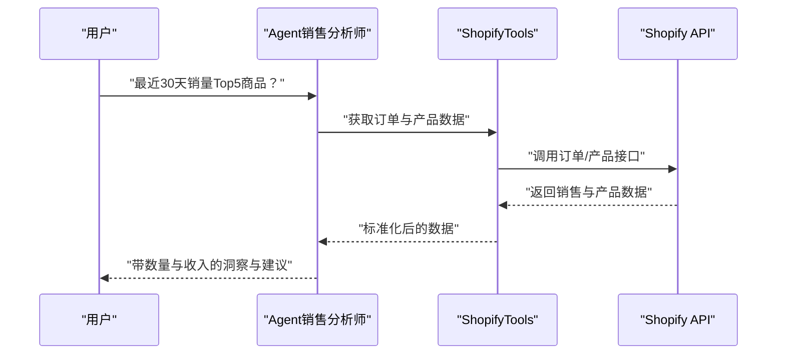
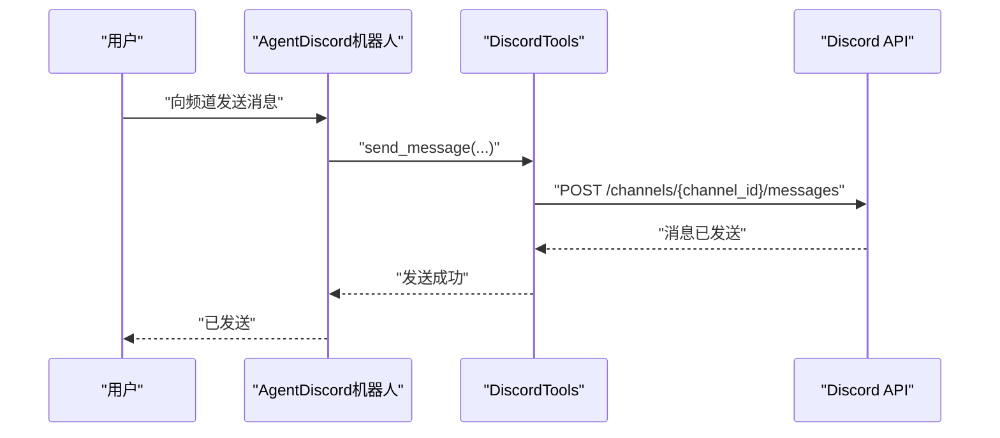
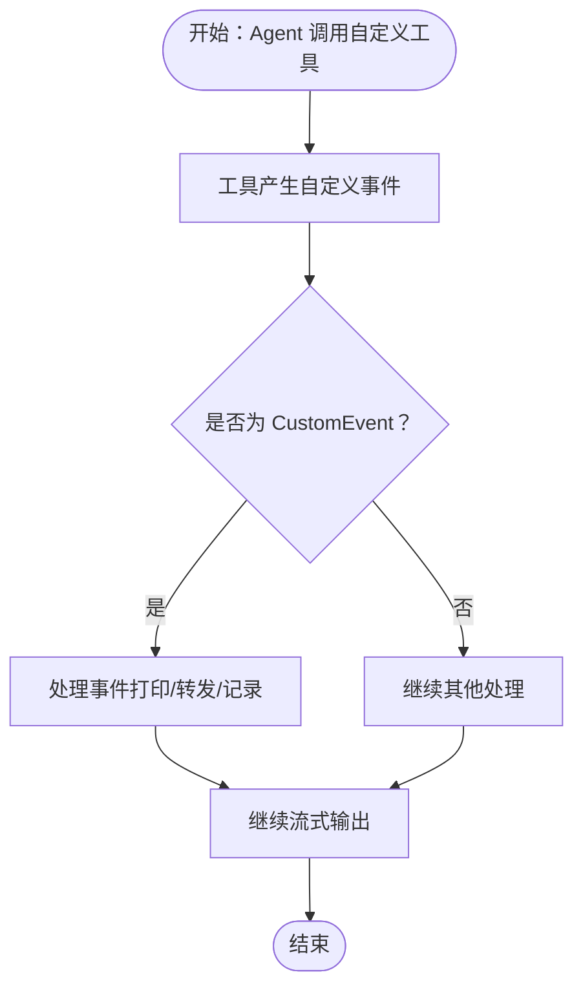
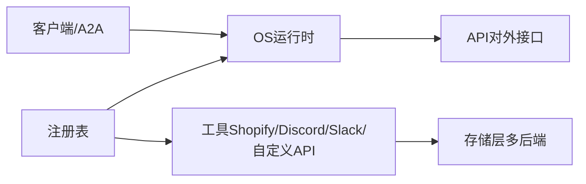

# 集成工具

<cite>
**本文引用的文件**
- [cookbook/92_integrations/README.md](file://cookbook/92_integrations/README.md)
- [cookbook/92_integrations/a2a/basic_agent/basic_agent.py](file://cookbook/92_integrations/a2a/basic_agent/basic_agent.py)
- [cookbook/92_integrations/a2a/basic_agent/client.py](file://cookbook/92_integrations/a2a/basic_agent/client.py)
- [cookbook/92_integrations/discord/agent_with_media.py](file://cookbook/92_integrations/discord/agent_with_media.py)
- [cookbook/92_integrations/discord/agent_with_user_memory.py](file://cookbook/92_integrations/discord/agent_with_user_memory.py)
- [cookbook/92_integrations/memory/mem0_integration.py](file://cookbook/92_integrations/memory/mem0_integration.py)
- [cookbook/92_integrations/memory/memori_integration.py](file://cookbook/92_integrations/memory/memori_integration.py)
- [cookbook/92_integrations/memory/zep_integration.py](file://cookbook/92_integrations/memory/zep_integration.py)
- [cookbook/92_integrations/observability/langfuse_via_openinference.py](file://cookbook/92_integrations/observability/langfuse_via_openinference.py)
- [cookbook/92_integrations/rag/local_rag_langchain_qdrant.py](file://cookbook/92_integrations/rag/local_rag_langchain_qdrant.py)
- [cookbook/92_integrations/surrealdb/memory_creation.py](file://cookbook/92_integrations/surrealdb/memory_creation.py)
- [cookbook/91_tools/shopify_tools.py](file://cookbook/91_tools/shopify_tools.py)
- [cookbook/91_tools/discord_tools.py](file://cookbook/91_tools/discord_tools.py)
- [cookbook/91_tools/slack_tools.py](file://cookbook/91_tools/slack_tools.py)
- [cookbook/91_tools/custom_api_tools.py](file://cookbook/91_tools/custom_api_tools.py)
- [cookbook/91_tools/custom_tool_events.py](file://cookbook/91_tools/custom_tool_events.py)
- [libs/agno/tools/__init__.py](file://libs/agno/tools/__init__.py)
- [libs/agno/integrations/discord/__init__.py](file://libs/agno/integrations/discord/__init__.py)
- [libs/agno/os/__init__.py](file://libs/agno/os/__init__.py)
- [libs/agno/api/os.py](file://libs/agno/api/os.py)
- [libs/agno/client/os.py](file://libs/agno/client/os.py)
- [libs/agno/client/a2a/__init__.py](file://libs/agno/client/a2a/__init__.py)
- [libs/agno/client/a2a/client.py](file://libs/agno/client/a2a/client.py)
- [libs/agno/client/a2a/server.py](file://libs/agno/client/a2a/server.py)
- [libs/agno/registry/__init__.py](file://libs/agno/registry/__init__.py)
- [libs/agno/registry/registry.py](file://libs/agno/registry/registry.py)
- [libs/agno/db/base.py](file://libs/agno/db/base.py)
- [libs/agno/db/json/base.py](file://libs/agno/db/json/base.py)
- [libs/agno/db/postgres/base.py](file://libs/agno/db/postgres/base.py)
- [libs/agno/db/mysql/base.py](file://libs/agno/db/mysql/base.py)
- [libs/agno/db/sqlite/base.py](file://libs/agno/db/sqlite/base.py)
- [libs/agno/db/redis/base.py](file://libs/agno/db/redis/base.py)
- [libs/agno/db/mongo/base.py](file://libs/agno/db/mongo/base.py)
- [libs/agno/db/surrealdb/base.py](file://libs/agno/db/surrealdb/base.py)
- [libs/agno/db/dynamo/base.py](file://libs/agno/db/dynamo/base.py)
- [libs/agno/db/firestore/base.py](file://libs/agno/db/firestore/base.py)
- [libs/agno/db/gcs_json/base.py](file://libs/agno/db/gcs_json/base.py)
- [libs/agno/db/singlestore/base.py](file://libs/agno/db/singlestore/base.py)
- [libs/agno/db/async_postgres/base.py](file://libs/agno/db/async_postgres/base.py)
- [libs/agno/db/in_memory/base.py](file://libs/agno/db/in_memory/base.py)
- [libs/agno/db/utils.py](file://libs/agno/db/utils.py)
- [libs/agno/db/filter_converter.py](file://libs/agno/db/filter_converter.py)
- [libs/agno/db/schemas/__init__.py](file://libs/agno/db/schemas/__init__.py)
- [libs/agno/db/schemas/schema.py](file://libs/agno/db/schemas/schema.py)
- [libs/agno/db/schemas/types.py](file://libs/agno/db/schemas/types.py)
- [libs/agno/db/schemas/fields.py](file://libs/agno/db/schemas/fields.py)
- [libs/agno/db/schemas/validators.py](file://libs/agno/db/schemas/validators.py)
- [libs/agno/db/schemas/exceptions.py](file://libs/agno/db/schemas/exceptions.py)
- [libs/agno/db/schemas/operations.py](file://libs/agno/db/schemas/operations.py)
- [libs/agno/db/schemas/query.py](file://libs/agno/db/schemas/query.py)
- [libs/agno/db/schemas/migrations.py](file://libs/agno/db/schemas/migrations.py)
- [libs/agno/db/schemas/migration_ops.py](file://libs/agno/db/schemas/migration_ops.py)
- [libs/agno/db/schemas/migration_ops.py](file://libs/agno/db/schemas/migration_ops.py)
- [libs/agno/db/schemas/migration_ops.py](file://libs/agno/db/schemas/migration_ops.py)
- [libs/agno/db/schemas/migration_ops.py](file://libs/agno/db/schemas/migration_ops.py)
- [libs/agno/db/schemas/migration_ops.py](file://libs/agno/db/schemas/migration_ops.py)
- [libs/agno/db/schemas/migration_ops.py](file://libs/agno/db/schemas/migration_ops.py)
- [libs/agno/db/schemas/migration_ops.py](file://libs/agno/db/schemas/migration_ops.py)
- [libs/agno/db/schemas/migration_ops.py](file://libs/agno/db/schemas/migration_ops.py)
- [libs/agno/db/schemas/migration_ops.py](file://libs/agno/db/schemas/migration_ops.py)
- [libs/agno/db/schemas/migration_ops.py](file://libs/agno/db/schemas/migration_ops.py)
- [libs/agno/db/schemas/migration_ops.py](file://libs/agno/db/schemas/migration_ops.py)
- [libs/agno/db/schemas/migration_ops.py](file://libs/agno/db/schemas/migration_ops.py)
- [libs/agno/db/schemas/migration_ops.py](file://libs/agno/db/schemas/migration_ops.py)
- [libs/agno/db/schemas/migration_ops.py](file://libs/agno/db/schemas/migration_ops.py)
- [libs/agno/db/schemas/migration_ops.py](file://libs/agno/db/schemas/migration_ops.py)
- [libs/agno/db/schemas/migration_ops.py](file://libs/agno/db/schemas/migration_ops.py)
- [libs/agno/db/schemas/migration_ops.py](file://libs/agno/db/schemas/migration_ops.py)
- [libs/agno/db/schemas/migration_ops.py](file://libs/agno/db/schemas/migration_ops.py)
- [libs/agno/db/schemas/migration_ops.py](file://libs/agno/db/schemas/migration_ops.py)
- [libs/agno/db/schemas/migration_ops.py](file://libs/agno/db/schemas/migration_ops.py)
- [libs/agno/db/schemas/m......](file://libs/agno/db/schemas/migration_ops.py)
</cite>

## 目录
1. [简介](#简介)
2. [项目结构](#项目结构)
3. [核心组件](#核心组件)
4. [架构总览](#架构总览)
5. [详细组件分析](#详细组件分析)
6. [依赖关系分析](#依赖关系分析)
7. [性能考虑](#性能考虑)
8. [故障排查指南](#故障排查指南)
9. [结论](#结论)
10. [附录](#附录)

## 简介
本文件面向使用 AgentOS 的开发者与集成工程师，系统性梳理第三方系统集成的方法论与实践路径，覆盖电商系统（以 Shopify 为例）、社交媒体平台（Discord、Slack）以及其他外部服务（自定义 API、内存服务、可观测性、RAG、数据库等）。文档从设计原则、集成策略、API 集成、数据同步、事件处理到错误处理与性能优化进行全栈讲解，并提供可直接参考的代码示例路径与可视化图示。

## 项目结构
本仓库中与“集成工具”相关的内容主要分布在以下区域：
- cookbook/92_integrations：官方集成示例集合，包含 A2A、Discord、内存服务、可观测性、RAG、SurrealDB 等子目录
- cookbook/91_tools：各类第三方工具封装示例，如 Shopify、Discord、Slack、自定义 API 等
- libs/agno：核心库，包含工具体系、存储层、API/OS 客户端、注册表等基础设施

下图给出与“集成工具”相关的高层结构视图：

图表来源
- [cookbook/92_integrations/README.md:1-40](file://cookbook/92_integrations/README.md#L1-L40)
- [libs/agno/tools/__init__.py](file://libs/agno/tools/__init__.py)
- [libs/agno/db/base.py](file://libs/agno/db/base.py)
- [libs/agno/os/__init__.py](file://libs/agno/os/__init__.py)
- [libs/agno/api/os.py](file://libs/agno/api/os.py)
- [libs/agno/client/os.py](file://libs/agno/client/os.py)
- [libs/agno/registry/registry.py](file://libs/agno/registry/registry.py)

章节来源
- [cookbook/92_integrations/README.md:1-40](file://cookbook/92_integrations/README.md#L1-L40)

## 核心组件
- 工具体系（Tools）
  - 提供对第三方服务的统一抽象与调用接口，便于在 Agent 中以工具形式使用
  - 示例：ShopifyTools、DiscordTools、SlackTools、CustomApiTools 等
- 存储与数据库（DB）
  - 支持多种持久化后端（PostgreSQL、MySQL、SQLite、Redis、Mongo、DynamoDB、Firestore、GCS JSON、SingleStore、SurrealDB、内存等），用于会话、知识、状态、事件等数据的落盘与查询
- OS 与 API
  - 提供 AgentOS 的运行时环境、路由与对外 API 能力，支持多 Agent/Team/Workflow 的编排与访问
- 客户端与 A2A
  - 支持 Agent-to-Agent 协议，便于跨进程/跨服务通信
- 注册表（Registry）
  - 统一管理 Agent/Team/Workflow 的注册与检索，支撑运行时发现与加载

章节来源
- [libs/agno/tools/__init__.py](file://libs/agno/tools/__init__.py)
- [libs/agno/db/base.py](file://libs/agno/db/base.py)
- [libs/agno/os/__init__.py](file://libs/agno/os/__init__.py)
- [libs/agno/api/os.py](file://libs/agno/api/os.py)
- [libs/agno/client/os.py](file://libs/agno/client/os.py)
- [libs/agno/registry/registry.py](file://libs/agno/registry/registry.py)

## 架构总览
下图展示 AgentOS 集成工具的整体架构：Agent 通过工具调用第三方服务，借助存储层持久化状态与结果，通过 OS/API 暴露能力，客户端或 A2A 协议实现跨进程协作，注册表负责资源管理与发现。

图表来源
- [libs/agno/tools/__init__.py](file://libs/agno/tools/__init__.py)
- [libs/agno/db/base.py](file://libs/agno/db/base.py)
- [libs/agno/os/__init__.py](file://libs/agno/os/__init__.py)
- [libs/agno/api/os.py](file://libs/agno/api/os.py)
- [libs/agno/client/os.py](file://libs/agno/client/os.py)
- [libs/agno/registry/registry.py](file://libs/agno/registry/registry.py)

## 详细组件分析

### 电商系统集成：Shopify
- 设计目标
  - 将 Shopify 数据（订单、产品、客户、分析）纳入 Agent 的上下文，支持销售趋势分析、捆绑推荐、库存预警等场景
- 关键能力
  - 订单与销售数据分析
  - 产品信息与组合关联分析
  - 库存水平监控与低库存识别
  - 销售报告与趋势生成
- 配置要点
  - 环境变量：商店名、访问令牌
  - 权限范围：读取订单、产品、客户、分析
- 使用方式
  - 在 Agent 中注入 ShopifyTools，按需调用工具函数获取数据，再由模型生成洞察与建议

图表来源
- [cookbook/91_tools/shopify_tools.py:33-75](file://cookbook/91_tools/shopify_tools.py#L33-L75)

章节来源
- [cookbook/91_tools/shopify_tools.py:1-75](file://cookbook/91_tools/shopify_tools.py#L1-L75)

### 社交媒体平台集成：Discord
- 设计目标
  - 将 Discord 的消息发送、频道管理、历史读取、消息删除等能力封装为工具，支持构建智能机器人
- 功能开关
  - 全量启用/按需启用（发送消息、读取历史、获取频道信息、列出频道、删除消息）
- 使用方式
  - 通过 DiscordTools 的构造参数控制权限，结合 Agent 的指令完成自动化任务

图表来源
- [cookbook/91_tools/discord_tools.py:29-82](file://cookbook/91_tools/discord_tools.py#L29-L82)

章节来源
- [cookbook/91_tools/discord_tools.py:1-125](file://cookbook/91_tools/discord_tools.py#L1-L125)

### 社交媒体平台集成：Slack
- 设计目标
  - 封装 Slack 的消息发送、频道列表、历史读取、文件上传/下载等能力
- 功能开关
  - 全量启用/按需启用（发送消息、列出频道、读取历史、上传/下载文件）
- 使用方式
  - 通过 SlackTools 的构造参数控制权限，结合 Agent 的指令完成工作流自动化

章节来源
- [cookbook/91_tools/slack_tools.py:1-69](file://cookbook/91_tools/slack_tools.py#L1-L69)

### 自定义 API 集成：CustomApiTools
- 设计目标
  - 为任意第三方 REST API 提供统一的请求封装，支持认证（Basic/Key）、默认头、SSL 校验、超时等
- 使用方式
  - 指定 base_url，启用 enable_make_request 或 all，即可在 Agent 中发起 GET/POST 请求

章节来源
- [cookbook/91_tools/custom_api_tools.py:1-45](file://cookbook/91_tools/custom_api_tools.py#L1-L45)

### 事件处理：自定义工具事件
- 设计目标
  - 在自定义工具中产出结构化事件，供 Agent 流式消费与响应
- 实现要点
  - 定义继承自 CustomEvent 的事件类
  - 在工具函数中 yield 事件实例
  - 在 Agent 运行时捕获并处理事件

图表来源
- [cookbook/91_tools/custom_tool_events.py:47-62](file://cookbook/91_tools/custom_tool_events.py#L47-L62)

章节来源
- [cookbook/91_tools/custom_tool_events.py:1-62](file://cookbook/91_tools/custom_tool_events.py#L1-L62)

### 内存服务集成：Mem0/Memori/Zep
- 设计目标
  - 将外部记忆服务接入 Agent，实现跨会话、跨设备的用户记忆与上下文持久化
- 集成方式
  - 分别提供 Mem0、Memori、Zep 的集成示例，展示初始化、写入、查询与清理流程

章节来源
- [cookbook/92_integrations/memory/mem0_integration.py](file://cookbook/92_integrations/memory/mem0_integration.py)
- [cookbook/92_integrations/memory/memori_integration.py](file://cookbook/92_integrations/memory/memori_integration.py)
- [cookbook/92_integrations/memory/zep_integration.py](file://cookbook/92_integrations/memory/zep_integration.py)

### 可观测性集成：Langfuse/OpenInference
- 设计目标
  - 通过 OpenInference/OpenLLMTracing 将 Agent/Workflow 执行过程与指标上报至 Langfuse 等平台
- 集成方式
  - 在示例中启用 OpenInference Tracer，并配置 Langfuse 导出器

章节来源
- [cookbook/92_integrations/observability/langfuse_via_openinference.py](file://cookbook/92_integrations/observability/langfuse_via_openinference.py)

### RAG 与检索增强：LangChain + Qdrant
- 设计目标
  - 将本地 RAG 流水线与向量数据库（Qdrant）结合，提升检索质量与性能
- 集成方式
  - 展示本地 RAG 的构建与执行流程

章节来源
- [cookbook/92_integrations/rag/local_rag_langchain_qdrant.py](file://cookbook/92_integrations/rag/local_rag_langchain_qdrant.py)

### 基于 SurrealDB 的记忆管理
- 设计目标
  - 使用 SurrealDB 作为记忆后端，支持独立记忆创建、搜索与控制
- 集成方式
  - 提供独立记忆与搜索示例，展示数据库工具与记忆的联动

章节来源
- [cookbook/92_integrations/surrealdb/memory_creation.py](file://cookbook/92_integrations/surrealdb/memory_creation.py)

### A2A（Agent-to-Agent）协议
- 设计目标
  - 支持 Agent 间的安全通信与协作，示例包含基础服务端/客户端交互
- 集成方式
  - 通过 A2A 客户端/服务端模块建立连接，传递消息与工具调用

章节来源
- [cookbook/92_integrations/a2a/basic_agent/basic_agent.py](file://cookbook/92_integrations/a2a/basic_agent/basic_agent.py)
- [cookbook/92_integrations/a2a/basic_agent/client.py](file://cookbook/92_integrations/a2a/basic_agent/client.py)
- [libs/agno/client/a2a/client.py](file://libs/agno/client/a2a/client.py)
- [libs/agno/client/a2a/server.py](file://libs/agno/client/a2a/server.py)

## 依赖关系分析
- 工具与存储
  - 工具链通过统一接口访问存储层，支持多种后端；存储层提供通用的模式定义与迁移能力
- OS/API 与客户端
  - OS 提供运行时与路由，API 模块暴露对外接口；客户端模块负责与远端 OS 交互
- 注册表
  - 注册表贯穿资源生命周期，支撑 Agent/Team/Workflow 的注册、发现与加载

图表来源
- [libs/agno/tools/__init__.py](file://libs/agno/tools/__init__.py)
- [libs/agno/db/base.py](file://libs/agno/db/base.py)
- [libs/agno/os/__init__.py](file://libs/agno/os/__init__.py)
- [libs/agno/api/os.py](file://libs/agno/api/os.py)
- [libs/agno/client/os.py](file://libs/agno/client/os.py)
- [libs/agno/registry/registry.py](file://libs/agno/registry/registry.py)

章节来源
- [libs/agno/db/schemas/schema.py](file://libs/agno/db/schemas/schema.py)
- [libs/agno/db/schemas/types.py](file://libs/agno/db/schemas/types.py)
- [libs/agno/db/schemas/fields.py](file://libs/agno/db/schemas/fields.py)
- [libs/agno/db/schemas/validators.py](file://libs/agno/db/schemas/validators.py)
- [libs/agno/db/schemas/exceptions.py](file://libs/agno/db/schemas/exceptions.py)
- [libs/agno/db/schemas/operations.py](file://libs/agno/db/schemas/operations.py)
- [libs/agno/db/schemas/query.py](file://libs/agno/db/schemas/query.py)
- [libs/agno/db/schemas/migrations.py](file://libs/agno/db/schemas/migrations.py)
- [libs/agno/db/schemas/migration_ops.py](file://libs/agno/db/schemas/migration_ops.py)

## 性能考虑
- 并发与流式
  - 利用异步工具与流式输出减少等待时间，提升用户体验
- 缓存与去重
  - 对高频查询结果进行缓存，避免重复请求第三方 API
- 超时与重试
  - 合理设置请求超时与指数退避重试，增强鲁棒性
- 数据分页与批量
  - 对分页接口采用批量拉取策略，降低网络往返次数
- 存储索引
  - 在向量数据库与关系型数据库中建立必要索引，优化查询性能

## 故障排查指南
- 环境变量缺失
  - 确保 Shopify 的商店名与访问令牌、Discord 的 Bot Token 等关键凭据已正确配置
- 权限不足
  - 检查 Shopify 的权限范围与 Discord/Slack 的权限开关，确保工具具备所需操作能力
- 网络与超时
  - 若出现请求超时，适当增大超时阈值并开启重试；检查代理与防火墙设置
- 事件未被消费
  - 确认 Agent 的运行循环中正确处理 CustomEvent 类型事件
- 存储异常
  - 检查数据库连接字符串、迁移脚本与权限；确认模式定义与字段类型匹配

章节来源
- [cookbook/91_tools/shopify_tools.py:10-22](file://cookbook/91_tools/shopify_tools.py#L10-L22)
- [cookbook/91_tools/discord_tools.py:18-27](file://cookbook/91_tools/discord_tools.py#L18-L27)
- [cookbook/91_tools/custom_tool_events.py:47-62](file://cookbook/91_tools/custom_tool_events.py#L47-L62)

## 结论
通过统一的工具抽象、灵活的存储后端、完善的 OS/API 与客户端机制，AgentOS 能够高效地集成电商、社交媒体及其他外部服务。结合事件驱动与可观测性，可在复杂业务场景中实现高可用、可维护的智能 Agent 解决方案。建议在生产环境中遵循权限最小化、超时与重试、缓存与索引等最佳实践，持续优化性能与稳定性。

## 附录
- 快速运行示例
  - 参考集成示例的 README，使用 demo 环境运行相应脚本
- 模式校验
  - 可使用 cookbook 的模式检查器验证示例一致性

章节来源
- [cookbook/92_integrations/README.md:25-40](file://cookbook/92_integrations/README.md#L25-L40)