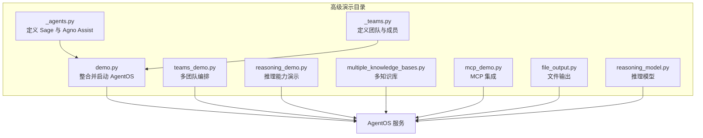
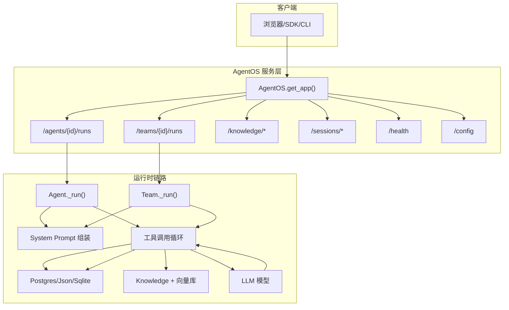
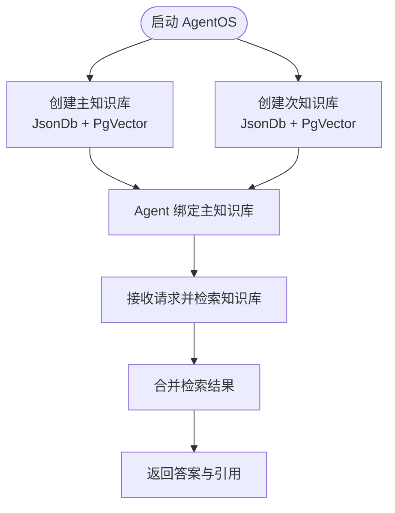
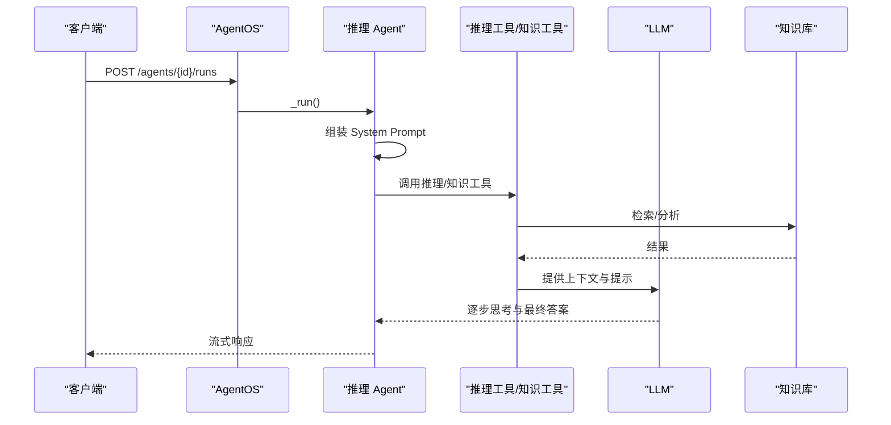
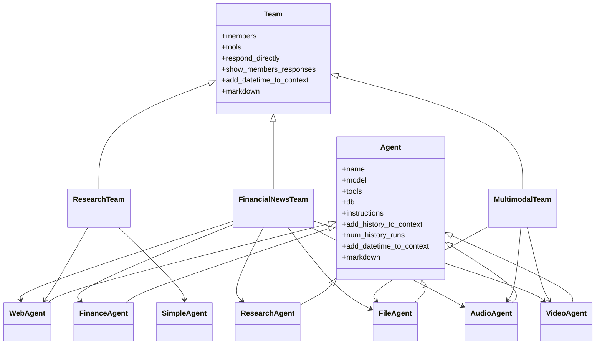
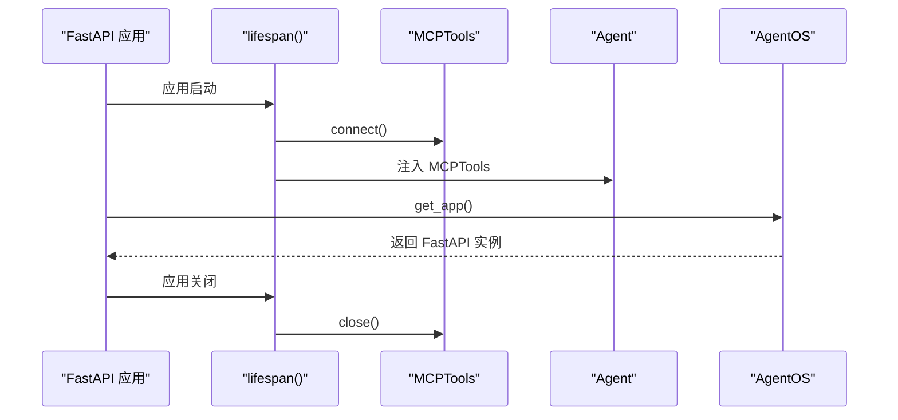
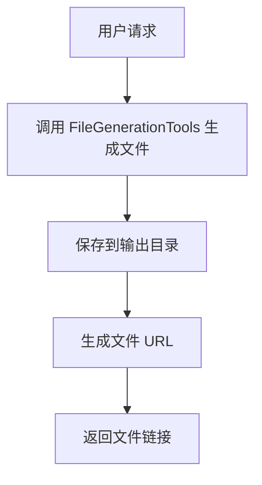
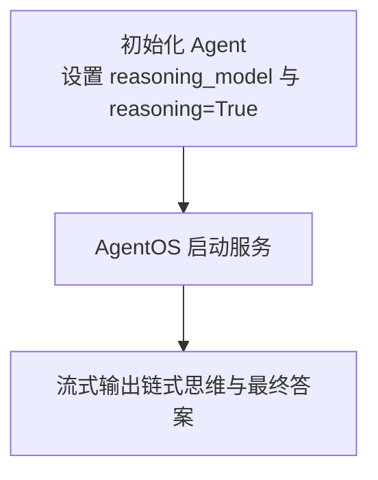
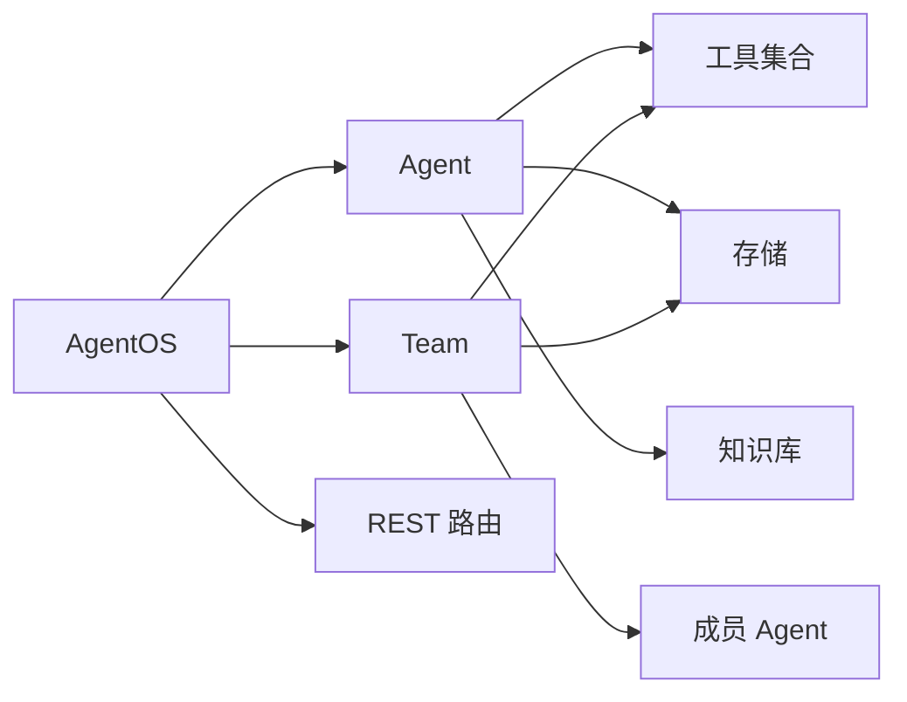

# 高级演示

<cite>
**本文引用的文件**
- [demo.py](file://cookbook/05_agent_os/demo.py)
- [demo.md](file://cookbook/05_agent_os/demo.md)
- [advanced_demo/demo.py](file://cookbook/05_agent_os/advanced_demo/demo.py)
- [advanced_demo/_agents.py](file://cookbook/05_agent_os/advanced_demo/_agents.py)
- [advanced_demo/_teams.py](file://cookbook/05_agent_os/advanced_demo/_teams.py)
- [advanced_demo/teams_demo.py](file://cookbook/05_agent_os/advanced_demo/teams_demo.py)
- [advanced_demo/reasoning_demo.py](file://cookbook/05_agent_os/advanced_demo/reasoning_demo.py)
- [advanced_demo/multiple_knowledge_bases.py](file://cookbook/05_agent_os/advanced_demo/multiple_knowledge_bases.py)
- [advanced_demo/mcp_demo.py](file://cookbook/05_agent_os/advanced_demo/mcp_demo.py)
- [advanced_demo/file_output.py](file://cookbook/05_agent_os/advanced_demo/file_output.py)
- [advanced_demo/reasoning_model.py](file://cookbook/05_agent_os/advanced_demo/reasoning_model.py)
- [advanced_demo/README.md](file://cookbook/05_agent_os/advanced_demo/README.md)
</cite>

## 目录
1. [简介](#简介)
2. [项目结构](#项目结构)
3. [核心组件](#核心组件)
4. [架构总览](#架构总览)
5. [详细组件分析](#详细组件分析)
6. [依赖关系分析](#依赖关系分析)
7. [性能考虑](#性能考虑)
8. [故障排查指南](#故障排查指南)
9. [结论](#结论)
10. [附录](#附录)

## 简介
本章节面向希望构建复杂智能代理系统的开发者，系统性讲解 AgentOS 高级演示中的多代理协作、团队编排与高级推理能力。文档覆盖以下主题：
- 多知识库集成：并行使用不同向量数据库与内容存储，支持混合检索与跨库检索。
- 推理演示：链式思维（CoT）、推理模型、推理工具与知识工具的组合使用。
- 团队协作演示：多模态团队、金融新闻团队、研究团队等编排模式。
- 高级配置与扩展：MCP 集成、文件输出、会话与记忆管理、并发与资源控制。
- 性能优化与资源管理：数据库连接池、向量检索优化、流式响应与生命周期管理。
- 从演示到实战：如何将示例中的技术迁移到真实项目。

## 项目结构
Advanced Demo 目录包含多个独立示例脚本，每个脚本聚焦一个特定能力或场景，并通过 AgentOS 将 Agent/Team 暴露为 REST API 服务。核心文件如下：
- advanced_demo/_agents.py：定义 Sage 与 Agno Assist 两个 Agent，配置工具、上下文与知识库。
- advanced_demo/_teams.py：定义 Reasoning Team Leader 及其成员，引入推理工具。
- advanced_demo/demo.py：整合 Agent 与 Team，构建 AgentOS 并启动服务。
- advanced_demo/teams_demo.py：更丰富的团队编排示例，包含多模态与金融新闻团队。
- advanced_demo/reasoning_demo.py：推理相关 Agent 与团队，演示多种推理方式。
- advanced_demo/multiple_knowledge_bases.py：多知识库示例，展示不同内容/向量存储的组合。
- advanced_demo/mcp_demo.py：MCP 工具集成示例，演示外部 MCP 服务器的生命周期管理。
- advanced_demo/file_output.py：文件输出工具示例，演示生成文件与返回链接。
- advanced_demo/reasoning_model.py：启用推理模型与链式思维的 Agent 示例。
- advanced_demo/README.md：高级演示概览与文件清单。

**图表来源**
- [advanced_demo/_agents.py:1-180](file://cookbook/05_agent_os/advanced_demo/_agents.py#L1-L180)
- [advanced_demo/_teams.py:1-59](file://cookbook/05_agent_os/advanced_demo/_teams.py#L1-L59)
- [advanced_demo/demo.py:1-56](file://cookbook/05_agent_os/advanced_demo/demo.py#L1-L56)
- [advanced_demo/teams_demo.py:1-197](file://cookbook/05_agent_os/advanced_demo/teams_demo.py#L1-L197)
- [advanced_demo/reasoning_demo.py:1-159](file://cookbook/05_agent_os/advanced_demo/reasoning_demo.py#L1-L159)
- [advanced_demo/multiple_knowledge_bases.py:1-66](file://cookbook/05_agent_os/advanced_demo/multiple_knowledge_bases.py#L1-L66)
- [advanced_demo/mcp_demo.py:1-91](file://cookbook/05_agent_os/advanced_demo/mcp_demo.py#L1-L91)
- [advanced_demo/file_output.py:1-41](file://cookbook/05_agent_os/advanced_demo/file_output.py#L1-L41)
- [advanced_demo/reasoning_model.py:1-47](file://cookbook/05_agent_os/advanced_demo/reasoning_model.py#L1-L47)

**章节来源**
- [advanced_demo/README.md:1-20](file://cookbook/05_agent_os/advanced_demo/README.md#L1-L20)

## 核心组件
- Agent：智能体，负责对话、工具调用、记忆与知识检索。示例中包含 Sage、Agno Assist、Web Agent、Finance Agent 等。
- Team：团队，协调多个 Agent 完成复杂任务，可启用推理工具、显示成员响应、直接回复等。
- Knowledge：知识库，结合内容数据库与向量数据库，支持检索与引用。
- AgentOS：统一的服务层，将 Agent/Team 暴露为 REST API，内置路由与健康检查。
- 工具集：WebSearch、Exa、YFinance、FileGeneration、Reasoning、MCP、KnowledgeTools 等。
- 存储：PostgresDb、JsonDb、SqliteDb；向量库：PgVector、LanceDb。

**章节来源**
- [advanced_demo/_agents.py:121-172](file://cookbook/05_agent_os/advanced_demo/_agents.py#L121-L172)
- [advanced_demo/_teams.py:22-51](file://cookbook/05_agent_os/advanced_demo/_teams.py#L22-L51)
- [advanced_demo/demo.py:21-26](file://cookbook/05_agent_os/advanced_demo/demo.py#L21-L26)
- [advanced_demo/teams_demo.py:178-187](file://cookbook/05_agent_os/advanced_demo/teams_demo.py#L178-L187)
- [advanced_demo/reasoning_demo.py:138-148](file://cookbook/05_agent_os/advanced_demo/reasoning_demo.py#L138-L148)
- [advanced_demo/multiple_knowledge_bases.py:29-50](file://cookbook/05_agent_os/advanced_demo/multiple_knowledge_bases.py#L29-L50)
- [advanced_demo/mcp_demo.py:59-81](file://cookbook/05_agent_os/advanced_demo/mcp_demo.py#L59-L81)
- [advanced_demo/file_output.py:20-32](file://cookbook/05_agent_os/advanced_demo/file_output.py#L20-L32)
- [advanced_demo/reasoning_model.py:18-31](file://cookbook/05_agent_os/advanced_demo/reasoning_model.py#L18-L31)

## 架构总览
下图展示了 AgentOS 如何将 Agent/Team 注册为 REST API，并在运行时通过工具链与存储进行交互。

**图表来源**
- [advanced_demo/demo.py:21-27](file://cookbook/05_agent_os/advanced_demo/demo.py#L21-L27)
- [advanced_demo/_agents.py:121-172](file://cookbook/05_agent_os/advanced_demo/_agents.py#L121-L172)
- [advanced_demo/_teams.py:40-51](file://cookbook/05_agent_os/advanced_demo/_teams.py#L40-L51)
- [advanced_demo/teams_demo.py:178-187](file://cookbook/05_agent_os/advanced_demo/teams_demo.py#L178-L187)
- [advanced_demo/reasoning_demo.py:138-148](file://cookbook/05_agent_os/advanced_demo/reasoning_demo.py#L138-L148)
- [advanced_demo/multiple_knowledge_bases.py:29-50](file://cookbook/05_agent_os/advanced_demo/multiple_knowledge_bases.py#L29-L50)
- [advanced_demo/mcp_demo.py:59-81](file://cookbook/05_agent_os/advanced_demo/mcp_demo.py#L59-L81)
- [advanced_demo/file_output.py:20-32](file://cookbook/05_agent_os/advanced_demo/file_output.py#L20-L32)
- [advanced_demo/reasoning_model.py:18-31](file://cookbook/05_agent_os/advanced_demo/reasoning_model.py#L18-L31)

## 详细组件分析

### 多知识库集成
该示例演示在同一 AgentOS 中使用多个知识库，分别管理内容与向量索引，支持不同存储后端的组合使用。

- 内容存储：JsonDb（主/次两套），用于元数据与文档元信息。
- 向量存储：PgVector（主/次两张表），用于嵌入检索。
- Agent：绑定主知识库，启用时间戳与 Markdown 输出。
- API：通过 /knowledge/{id}/documents 等端点管理与查询文档。

**图表来源**
- [advanced_demo/multiple_knowledge_bases.py:29-50](file://cookbook/05_agent_os/advanced_demo/multiple_knowledge_bases.py#L29-L50)

**章节来源**
- [advanced_demo/multiple_knowledge_bases.py:1-66](file://cookbook/05_agent_os/advanced_demo/multiple_knowledge_bases.py#L1-L66)

### 推理演示
该示例展示了多种推理方式：
- 链式思维（CoT）：通过 Agent 的 reasoning=True 启用逐步思考。
- 推理模型：为 Agent 指定独立的 reasoning_model，用于深度推理。
- 推理工具：ReasoningTools，增强推理指令与结构化输出。
- 知识工具：KnowledgeTools，结合检索与分析，提升回答质量。
- 团队推理：Team 使用 ReasoningTools，聚合成员输出并给出最终结论。

**图表来源**
- [advanced_demo/reasoning_demo.py:40-75](file://cookbook/05_agent_os/advanced_demo/reasoning_demo.py#L40-L75)
- [advanced_demo/reasoning_demo.py:114-134](file://cookbook/05_agent_os/advanced_demo/reasoning_demo.py#L114-L134)

**章节来源**
- [advanced_demo/reasoning_demo.py:1-159](file://cookbook/05_agent_os/advanced_demo/reasoning_demo.py#L1-L159)

### 团队协作演示
该示例包含多个团队：
- 研究团队：Web Agent + Simple Agent，Leader 使用 ReasoningTools。
- 多模态团队：File、Audio、Video Agent 协同，直接响应用户。
- 金融新闻团队：综合 Web、Finance、Research、File、Audio、Video Agent，按输入类型路由至对应成员。

**图表来源**
- [advanced_demo/teams_demo.py:118-174](file://cookbook/05_agent_os/advanced_demo/teams_demo.py#L118-L174)
- [advanced_demo/_teams.py:40-51](file://cookbook/05_agent_os/advanced_demo/_teams.py#L40-L51)

**章节来源**
- [advanced_demo/teams_demo.py:1-197](file://cookbook/05_agent_os/advanced_demo/teams_demo.py#L1-L197)
- [advanced_demo/_teams.py:1-59](file://cookbook/05_agent_os/advanced_demo/_teams.py#L1-L59)

### MCP 集成
该示例通过 FastAPI 生命周期管理 MCP 连接，动态注入 MCPTools 到 Agent，实现与外部 MCP 服务器的无缝通信。

**图表来源**
- [advanced_demo/mcp_demo.py:41-56](file://cookbook/05_agent_os/advanced_demo/mcp_demo.py#L41-L56)
- [advanced_demo/mcp_demo.py:59-81](file://cookbook/05_agent_os/advanced_demo/mcp_demo.py#L59-L81)

**章节来源**
- [advanced_demo/mcp_demo.py:1-91](file://cookbook/05_agent_os/advanced_demo/mcp_demo.py#L1-L91)

### 文件输出
该示例通过 FileGenerationTools 生成文件并将结果以 URL 形式返回，适合报告、图表等产物的自动化产出。

**图表来源**
- [advanced_demo/file_output.py:20-32](file://cookbook/05_agent_os/advanced_demo/file_output.py#L20-L32)

**章节来源**
- [advanced_demo/file_output.py:1-41](file://cookbook/05_agent_os/advanced_demo/file_output.py#L1-L41)

### 推理模型
该示例为 Agent 指定独立的推理模型（如 Claude），并在 AgentOS 中启用推理能力，实现链式思维的实时流式输出。

**图表来源**
- [advanced_demo/reasoning_model.py:18-31](file://cookbook/05_agent_os/advanced_demo/reasoning_model.py#L18-L31)

**章节来源**
- [advanced_demo/reasoning_model.py:1-47](file://cookbook/05_agent_os/advanced_demo/reasoning_model.py#L1-L47)

## 依赖关系分析
- Agent 与 Team 共享存储：PostgresDb/JsonDb/SqliteDb，确保会话与记忆的一致性。
- 知识库与向量库解耦：内容存储与向量存储可独立配置，支持混合检索与跨库查询。
- 工具链解耦：MCP、WebSearch、Exa、YFinance、Reasoning、FileGeneration 等工具可按需组合。
- AgentOS 路由：统一暴露 /agents、/teams、/knowledge、/sessions、/health、/config 端点。

**图表来源**
- [advanced_demo/demo.py:21-27](file://cookbook/05_agent_os/advanced_demo/demo.py#L21-L27)
- [advanced_demo/_agents.py:121-172](file://cookbook/05_agent_os/advanced_demo/_agents.py#L121-L172)
- [advanced_demo/_teams.py:40-51](file://cookbook/05_agent_os/advanced_demo/_teams.py#L40-L51)
- [advanced_demo/teams_demo.py:178-187](file://cookbook/05_agent_os/advanced_demo/teams_demo.py#L178-L187)

**章节来源**
- [advanced_demo/demo.py:1-56](file://cookbook/05_agent_os/advanced_demo/demo.py#L1-L56)
- [advanced_demo/_agents.py:1-180](file://cookbook/05_agent_os/advanced_demo/_agents.py#L1-L180)
- [advanced_demo/_teams.py:1-59](file://cookbook/05_agent_os/advanced_demo/_teams.py#L1-L59)
- [advanced_demo/teams_demo.py:1-197](file://cookbook/05_agent_os/advanced_demo/teams_demo.py#L1-L197)

## 性能考虑
- 数据库连接与事务
  - 使用连接池与长生命周期管理，避免频繁建立/断开连接。
  - 在 AgentOS 中通过 lifespan 管理数据库与 MCP 连接，减少启动/关闭开销。
- 向量检索优化
  - 合理选择向量库与检索策略（如 hybrid），控制返回数量与过滤条件。
  - 对高并发场景，建议对检索结果进行缓存与去重。
- 流式响应
  - 使用流式输出（stream=True）降低首字节延迟，提升用户体验。
  - 控制工具调用次数与长度，避免过长的中间响应。
- 资源隔离
  - 不同 Agent/Team 使用独立会话表或知识库表，避免锁竞争。
  - 对大文件/视频/音频处理，建议异步化与队列化。
- 并发与限流
  - 在网关或反向代理层设置请求速率限制，防止突发流量压垮后端。
  - 对工具调用（如 WebSearch、YFinance）设置超时与重试策略。

[本节为通用指导，无需具体文件来源]

## 故障排查指南
- 环境变量缺失
  - MCP 示例要求 GITHUB_TOKEN 环境变量，未设置会导致连接失败。
- 数据库不可达
  - 确认 Postgres/Json/Sqlite 地址与权限正确，必要时预创建表。
- 知识库未初始化
  - 在推理/多知识库示例中，先插入文档再发起检索。
- 工具调用异常
  - 检查工具参数与网络访问权限，必要时开启日志与重试。
- 流式输出中断
  - 检查客户端 SSE 支持与网络稳定性，适当增加超时与重连。

**章节来源**
- [advanced_demo/mcp_demo.py:30-37](file://cookbook/05_agent_os/advanced_demo/mcp_demo.py#L30-L37)
- [advanced_demo/reasoning_demo.py:157-158](file://cookbook/05_agent_os/advanced_demo/reasoning_demo.py#L157-L158)

## 结论
Advanced Demo 展示了 AgentOS 在多代理协作、团队编排与高级推理方面的完整能力。通过模块化的 Agent/Team/Knowledge/Tools/Storage 设计，开发者可以快速搭建复杂智能系统，并将其作为服务对外提供。结合本文的性能与运维建议，可在生产环境中稳定、高效地运行这些能力。

[本节为总结，无需具体文件来源]

## 附录
- 从演示到实战的迁移要点
  - 将示例中的 Agent/Team/Knowledge/Tools 抽象为可配置模块，便于复用。
  - 引入统一的配置中心与环境变量管理，避免硬编码。
  - 加强监控与日志，对关键路径（检索、工具调用、流式输出）埋点。
  - 对外暴露最小 API 面，内部通过队列/工作流处理耗时任务。

[本节为概念性内容，无需具体文件来源]