# Cookbook Examples

<cite>
**本文档引用的文件**
- [README.md](file://README.md)
- [cookbook/README.md](file://cookbook/README.md)
- [cookbook/00_quickstart/README.md](file://cookbook/00_quickstart/README.md)
- [cookbook/01_demo/README.md](file://cookbook/01_demo/README.md)
- [cookbook/02_agents/README.md](file://cookbook/02_agents/README.md)
- [cookbook/00_quickstart/agent_with_tools.py](file://cookbook/00_quickstart/agent_with_tools.py)
- [cookbook/00_quickstart/agent_with_structured_output.py](file://cookbook/00_quickstart/agent_with_structured_output.py)
- [cookbook/00_quickstart/agent_with_memory.py](file://cookbook/00_quickstart/agent_with_memory.py)
- [cookbook/00_quickstart/multi_agent_team.py](file://cookbook/00_quickstart/multi_agent_team.py)
- [cookbook/00_quickstart/sequential_workflow.py](file://cookbook/00_quickstart/sequential_workflow.py)
- [cookbook/00_quickstart/agent_search_over_knowledge.py](file://cookbook/00_quickstart/agent_search_over_knowledge.py)
- [cookbook/00_quickstart/human_in_the_loop.py](file://cookbook/00_quickstart/human_in_the_loop.py)
- [cookbook/00_quickstart/agent_with_guardrails.py](file://cookbook/00_quickstart/agent_with_guardrails.py)
- [cookbook/00_quickstart/custom_tool_for_self_learning.py](file://cookbook/00_quickstart/custom_tool_for_self_learning.py)
- [cookbook/01_demo/run.py](file://cookbook/01_demo/run.py)
</cite>

## 目录
1. [简介](#简介)
2. [项目结构](#项目结构)
3. [核心组件](#核心组件)
4. [架构总览](#架构总览)
5. [详细组件分析](#详细组件分析)
6. [依赖关系分析](#依赖关系分析)
7. [性能考虑](#性能考虑)
8. [故障排除指南](#故障排除指南)
9. [结论](#结论)
10. [附录](#附录)

## 简介
本文件系统化梳理 Agno 代码库中的 Cookbook 示例，帮助用户从单智能体起步，逐步掌握工具使用、结构化输出、记忆与学习、知识检索、守卫机制、人机协作、多智能体团队与工作流编排等能力，并通过 Demo 展示生产级部署与管理。示例覆盖快速入门、专题深化与实战演示，适合不同阶段的学习者按路径推进。

## 项目结构
- 根 README 提供整体定位：框架层（构建）、运行时（服务）、控制平面（AgentOS UI）三段式能力。
- cookbook 目录提供分层次的示例集合：
  - 快速入门：12 个循序渐进示例，涵盖工具、结构化输出、存储、记忆、状态、知识、自学习、守卫、人机协作、多智能体团队、顺序工作流。
  - 深度专题：Agents、Teams、Workflows、AgentOS、存储、知识、学习、评估、推理、内存、模型、工具、集成等。
  - Demo：包含 5 个智能体、1 个团队、1 个工作流，统一通过 AgentOS 提供 Web 界面与调度能力。

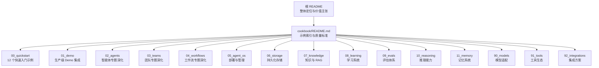

**图表来源**
- [README.md:25-34](file://README.md#L25-L34)
- [cookbook/README.md:1-101](file://cookbook/README.md#L1-L101)

**章节来源**
- [README.md:1-178](file://README.md#L1-L178)
- [cookbook/README.md:1-101](file://cookbook/README.md#L1-L101)

## 核心组件
- 智能体（Agent）：可配置指令、工具、存储、记忆、知识、守卫、上下文注入等，支持同步/异步执行与流式响应。
- 团队（Team）：由多个成员智能体组成，由领导智能体协调，支持动态协作与合成输出。
- 工作流（Workflow）：以步骤（Step）串联多个智能体或函数，强调确定性顺序与数据流转。
- 知识库（Knowledge）：基于向量数据库的可检索文档集合，支持混合检索与嵌入器。
- 记忆管理（MemoryManager）：从对话中抽取并持久化用户偏好与上下文，支持代理式记忆与即时更新。
- 守卫（Guardrails）：前置钩子对输入进行 PII 检测、提示注入检测与自定义规则校验。
- 人机协作（Human-in-the-Loop）：对敏感或不可逆操作要求人工确认后执行。
- AgentOS：将智能体、团队、工作流暴露为 Web API，提供可视化界面、追踪与调度。

**章节来源**
- [cookbook/00_quickstart/agent_with_tools.py:18-67](file://cookbook/00_quickstart/agent_with_tools.py#L18-L67)
- [cookbook/00_quickstart/multi_agent_team.py:87-117](file://cookbook/00_quickstart/multi_agent_team.py#L87-L117)
- [cookbook/00_quickstart/sequential_workflow.py:126-134](file://cookbook/00_quickstart/sequential_workflow.py#L126-L134)
- [cookbook/00_quickstart/agent_search_over_knowledge.py:30-94](file://cookbook/00_quickstart/agent_search_over_knowledge.py#L30-L94)
- [cookbook/00_quickstart/agent_with_memory.py:37-100](file://cookbook/00_quickstart/agent_with_memory.py#L37-L100)
- [cookbook/00_quickstart/agent_with_guardrails.py:90-102](file://cookbook/00_quickstart/agent_with_guardrails.py#L90-L102)
- [cookbook/00_quickstart/human_in_the_loop.py:141-156](file://cookbook/00_quickstart/human_in_the_loop.py#L141-L156)
- [cookbook/01_demo/run.py:23-32](file://cookbook/01_demo/run.py#L23-L32)

## 架构总览
下图展示从示例到运行时的整体架构：示例脚本创建智能体/团队/工作流，通过 AgentOS 暴露为 Web 应用，结合数据库与向量数据库实现会话、记忆与知识检索。

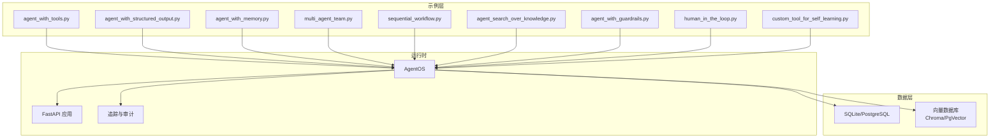

**图表来源**
- [cookbook/00_quickstart/agent_with_tools.py:60-67](file://cookbook/00_quickstart/agent_with_tools.py#L60-L67)
- [cookbook/00_quickstart/sequential_workflow.py:126-134](file://cookbook/00_quickstart/sequential_workflow.py#L126-L134)
- [cookbook/00_quickstart/multi_agent_team.py:87-117](file://cookbook/00_quickstart/multi_agent_team.py#L87-L117)
- [cookbook/00_quickstart/agent_search_over_knowledge.py:30-49](file://cookbook/00_quickstart/agent_search_over_knowledge.py#L30-L49)
- [cookbook/00_quickstart/agent_with_memory.py:37-43](file://cookbook/00_quickstart/agent_with_memory.py#L37-L43)
- [cookbook/00_quickstart/human_in_the_loop.py:141-156](file://cookbook/00_quickstart/human_in_the_loop.py#L141-L156)
- [cookbook/00_quickstart/agent_with_guardrails.py:90-102](file://cookbook/00_quickstart/agent_with_guardrails.py#L90-L102)
- [cookbook/01_demo/run.py:23-32](file://cookbook/01_demo/run.py#L23-L32)

## 详细组件分析

### 组件 A：工具型智能体（agent_with_tools）
- 目标：为智能体赋予外部数据访问能力，如实时市场数据查询。
- 关键点：
  - 使用工具工厂一次性注入多种工具。
  - 在指令中明确工作流与规则，确保输出结构化、可解释。
  - 支持流式输出与多轮对话。
- 典型流程：解析请求 → 选择工具 → 执行 → 合成回答。

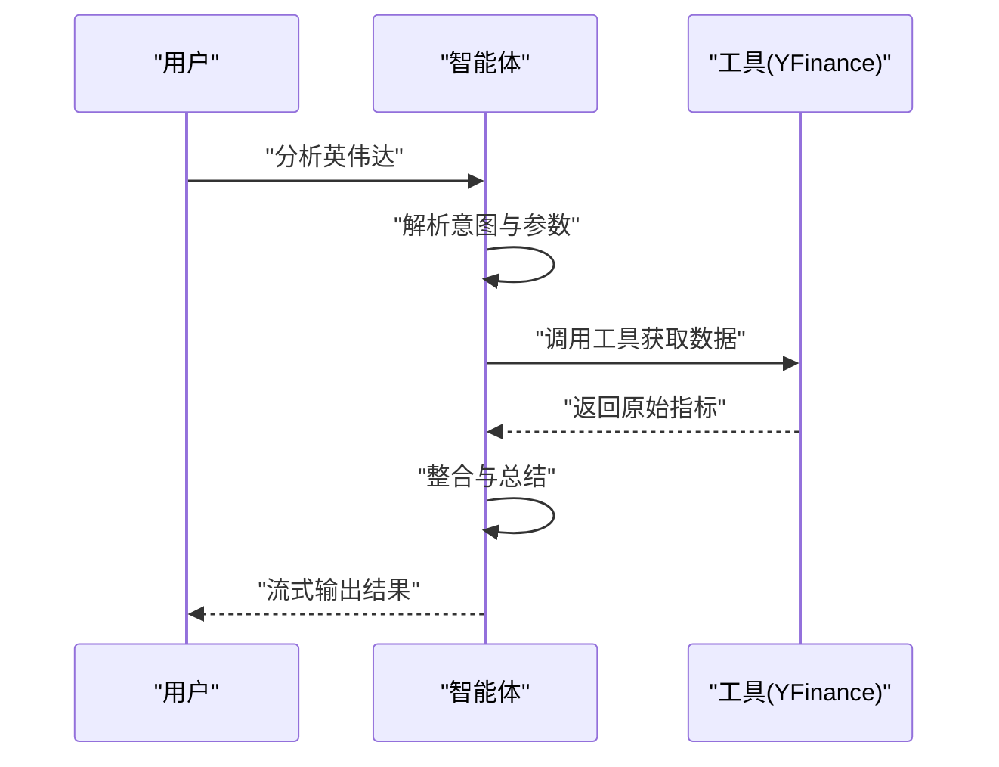

**图表来源**
- [cookbook/00_quickstart/agent_with_tools.py:18-67](file://cookbook/00_quickstart/agent_with_tools.py#L18-L67)

**章节来源**
- [cookbook/00_quickstart/agent_with_tools.py:1-98](file://cookbook/00_quickstart/agent_with_tools.py#L1-L98)

### 组件 B：结构化输出智能体（agent_with_structured_output）
- 目标：通过 Pydantic 模型约束输出结构，便于程序化消费与存储。
- 关键点：
  - 定义输出模式类，保证字段完整性与类型安全。
  - 结合历史会话与时间戳增强上下文。
  - 输出内容可通过模型反序列化直接使用。
- 典型流程：接收问题 → 调用工具 → 生成结构化分析 → 解析为强类型对象。

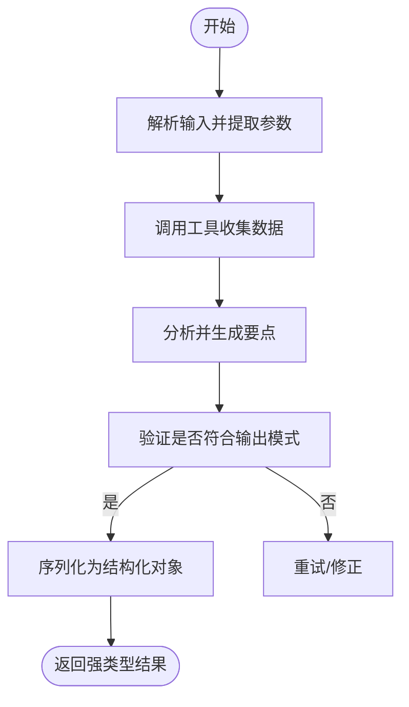

**图表来源**
- [cookbook/00_quickstart/agent_with_structured_output.py:38-99](file://cookbook/00_quickstart/agent_with_structured_output.py#L38-L99)

**章节来源**
- [cookbook/00_quickstart/agent_with_structured_output.py:1-155](file://cookbook/00_quickstart/agent_with_structured_output.py#L1-L155)

### 组件 C：带记忆的智能体（agent_with_memory）
- 目标：在跨会话场景中记住用户偏好与上下文，提升个性化体验。
- 关键点：
  - MemoryManager 负责从对话中抽取与存储记忆。
  - 可启用代理式记忆（按需决策保存）或即时更新（每次响应后保存）。
  - 通过 user_id 实现用户隔离。
- 典型流程：用户表达偏好 → 智能体记录记忆 → 新会话读取记忆 → 个性化建议。

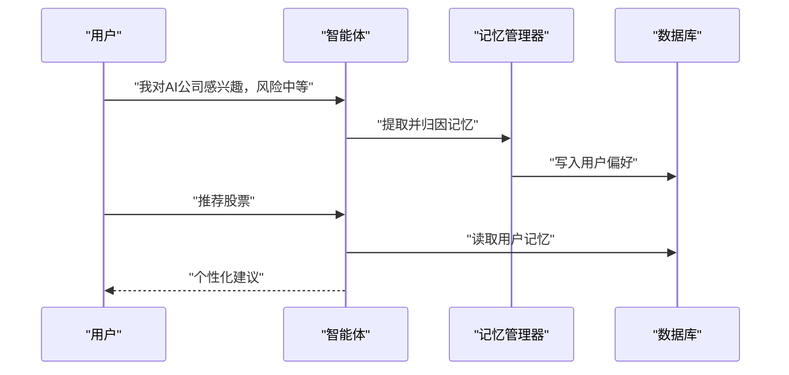

**图表来源**
- [cookbook/00_quickstart/agent_with_memory.py:37-100](file://cookbook/00_quickstart/agent_with_memory.py#L37-L100)

**章节来源**
- [cookbook/00_quickstart/agent_with_memory.py:1-158](file://cookbook/00_quickstart/agent_with_memory.py#L1-L158)

### 组件 D：多智能体团队（multi_agent_team）
- 目标：通过角色分工与领导协调，实现对抗式或多视角分析。
- 关键点：
  - 成员智能体具备专门角色（如做多/做空分析师）。
  - 领导智能体负责汇总、合成并给出平衡建议。
  - 支持显示成员独立输出，便于溯源与审计。
- 典型流程：提出议题 → 分发给成员 → 独立分析 → 汇总合成 → 最终报告。

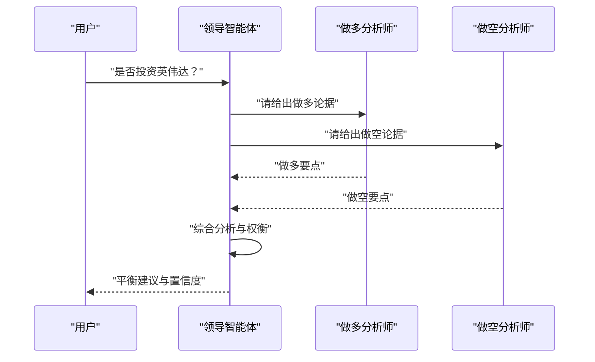

**图表来源**
- [cookbook/00_quickstart/multi_agent_team.py:87-117](file://cookbook/00_quickstart/multi_agent_team.py#L87-L117)

**章节来源**
- [cookbook/00_quickstart/multi_agent_team.py:1-167](file://cookbook/00_quickstart/multi_agent_team.py#L1-L167)

### 组件 E：顺序工作流（sequential_workflow）
- 目标：以固定顺序串联多个专业智能体，形成可重复的处理管线。
- 关键点：
  - 步骤（Step）封装特定任务的智能体。
  - 数据从前一步自然流入下一步，便于审计与调试。
  - 适用于“采集→分析→报告”的标准化流程。
- 典型流程：输入目标 → 数据采集 → 专业分析 → 报告撰写 → 结果交付。

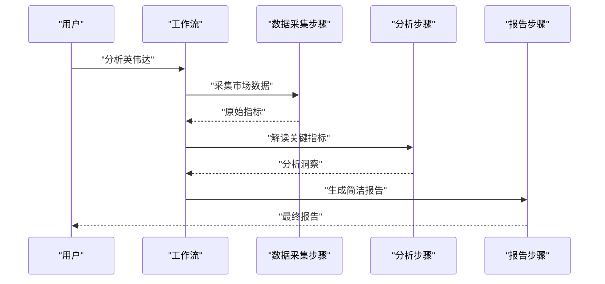

**图表来源**
- [cookbook/00_quickstart/sequential_workflow.py:126-134](file://cookbook/00_quickstart/sequential_workflow.py#L126-L134)

**章节来源**
- [cookbook/00_quickstart/sequential_workflow.py:1-171](file://cookbook/00_quickstart/sequential_workflow.py#L1-L171)

### 组件 F：知识检索智能体（agent_search_over_knowledge）
- 目标：为智能体注入可检索的知识库，实现“按需搜索、按需引用”的智能问答。
- 关键点：
  - 基于向量数据库与嵌入器构建知识库。
  - 支持混合检索（语义相似 + 关键词匹配），并融合排序。
  - 智能体根据上下文决定何时检索与引用。
- 典型流程：加载文档 → 指定检索策略 → 查询知识库 → 合成答案。

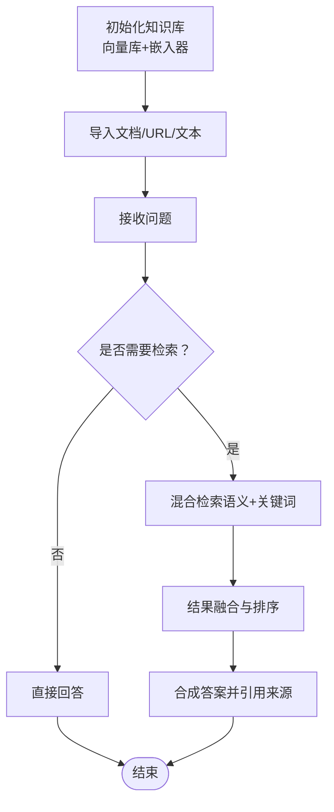

**图表来源**
- [cookbook/00_quickstart/agent_search_over_knowledge.py:30-94](file://cookbook/00_quickstart/agent_search_over_knowledge.py#L30-L94)

**章节来源**
- [cookbook/00_quickstart/agent_search_over_knowledge.py:1-133](file://cookbook/00_quickstart/agent_search_over_knowledge.py#L1-L133)

### 组件 G：守卫机制（agent_with_guardrails）
- 目标：在输入进入智能体前进行安全与合规检查，阻断敏感信息与攻击性提示。
- 关键点：
  - 内置守卫：PII 检测、提示注入检测。
  - 自定义守卫：继承基类实现检查逻辑，抛出异常阻断请求。
  - 支持同步与异步检查。
- 典型流程：接收输入 → 多路守卫检查 → 通过则继续 → 触发则拦截并反馈原因。

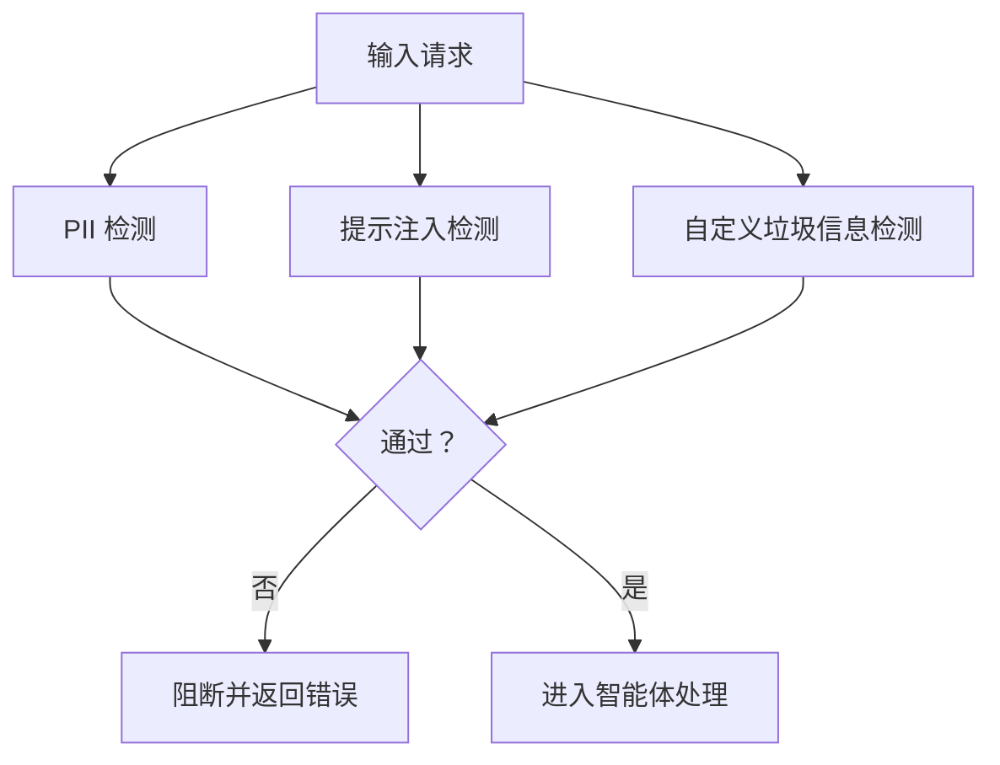

**图表来源**
- [cookbook/00_quickstart/agent_with_guardrails.py:90-102](file://cookbook/00_quickstart/agent_with_guardrails.py#L90-L102)

**章节来源**
- [cookbook/00_quickstart/agent_with_guardrails.py:1-174](file://cookbook/00_quickstart/agent_with_guardrails.py#L1-L174)

### 组件 H：人机协作（human_in_the_loop）
- 目标：对敏感或不可逆操作强制人工确认，确保可控与可审计。
- 关键点：
  - 工具标注 requires_confirmation=True。
  - 运行时检查待确认需求，交互式询问用户，再继续执行。
  - 支持拒绝与批准两种分支。
- 典型流程：触发潜在危险动作 → 弹出确认 → 用户决策 → 继续或终止。

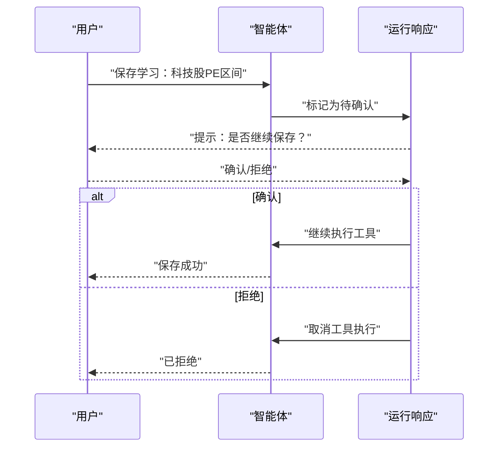

**图表来源**
- [cookbook/00_quickstart/human_in_the_loop.py:141-207](file://cookbook/00_quickstart/human_in_the_loop.py#L141-L207)

**章节来源**
- [cookbook/00_quickstart/human_in_the_loop.py:1-240](file://cookbook/00_quickstart/human_in_the_loop.py#L1-L240)

### 组件 I：自定义工具与自我学习（custom_tool_for_self_learning）
- 目标：通过编写自定义工具扩展智能体能力，并实现“学习—保存—复用”的闭环。
- 关键点：
  - 工具即函数，具备类型注解与文档字符串，用于指导智能体调用。
  - 将可复用洞察保存至知识库，后续可被检索与引用。
  - 指令中引导智能体识别可沉淀的学习点。
- 典型流程：产生洞察 → 提议保存 → 用户确认 → 写入知识库 → 后续检索复用。

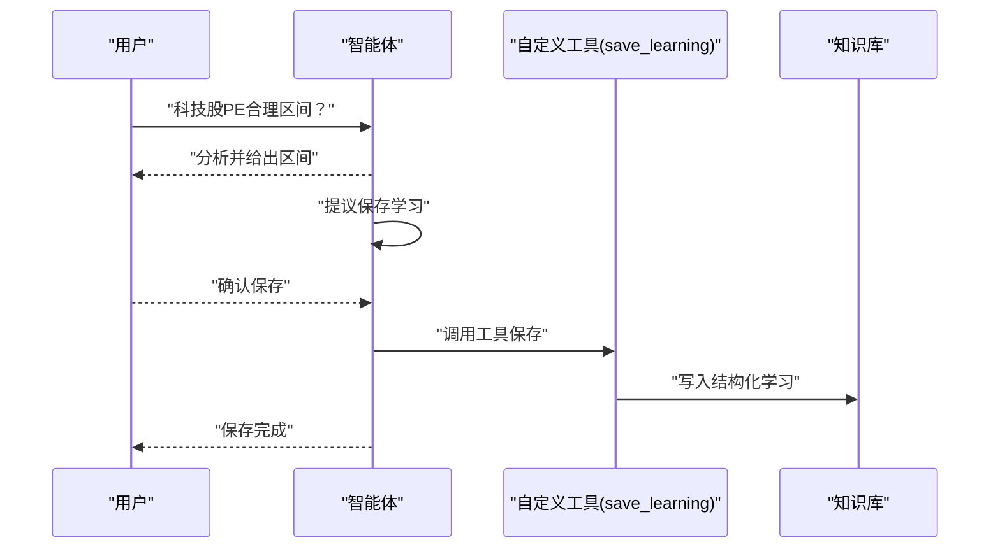

**图表来源**
- [cookbook/00_quickstart/custom_tool_for_self_learning.py:144-159](file://cookbook/00_quickstart/custom_tool_for_self_learning.py#L144-L159)

**章节来源**
- [cookbook/00_quickstart/custom_tool_for_self_learning.py:1-215](file://cookbook/00_quickstart/custom_tool_for_self_learning.py#L1-L215)

### 组件 J：Demo 部署入口（01_demo/run.py）
- 目标：将多个智能体、团队与工作流统一注册到 AgentOS，提供 Web API 与可视化管理。
- 关键点：
  - 注册 5 个智能体、1 个研究团队、1 个日常简报工作流。
  - 开启追踪与调度，连接 PostgreSQL + 向量数据库。
  - 通过本地 AgentOS UI 连接与监控。
- 典型流程：启动入口 → 初始化 AgentOS → 暴露 FastAPI 应用 → 可视化管理。

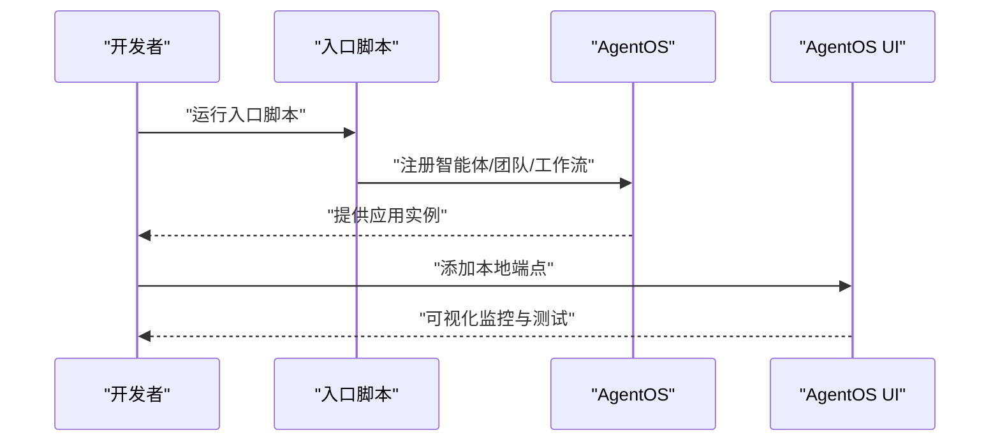

**图表来源**
- [cookbook/01_demo/run.py:23-32](file://cookbook/01_demo/run.py#L23-L32)

**章节来源**
- [cookbook/01_demo/run.py:1-38](file://cookbook/01_demo/run.py#L1-L38)

## 依赖关系分析
- 示例与运行时的耦合：
  - 示例脚本通过统一的智能体 API 构建组件，运行时由 AgentOS 统一托管。
  - 数据层依赖 SQLite/PostgreSQL 存储会话与知识元数据；向量数据库支撑知识检索。
- 组件内聚与解耦：
  - 知识库、记忆管理、守卫、工具均作为可插拔模块注入，降低耦合度。
  - 工作流与团队通过抽象接口组合，便于替换与扩展。

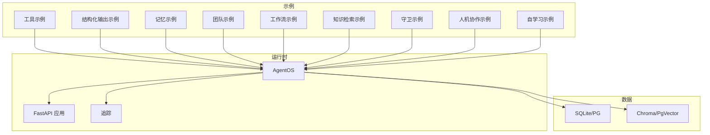

**图表来源**
- [cookbook/00_quickstart/agent_with_tools.py:60-67](file://cookbook/00_quickstart/agent_with_tools.py#L60-L67)
- [cookbook/00_quickstart/agent_search_over_knowledge.py:30-49](file://cookbook/00_quickstart/agent_search_over_knowledge.py#L30-L49)
- [cookbook/00_quickstart/agent_with_memory.py:37-43](file://cookbook/00_quickstart/agent_with_memory.py#L37-L43)
- [cookbook/00_quickstart/human_in_the_loop.py:141-156](file://cookbook/00_quickstart/human_in_the_loop.py#L141-L156)
- [cookbook/00_quickstart/agent_with_guardrails.py:90-102](file://cookbook/00_quickstart/agent_with_guardrails.py#L90-L102)
- [cookbook/01_demo/run.py:23-32](file://cookbook/01_demo/run.py#L23-L32)

**章节来源**
- [cookbook/00_quickstart/agent_with_tools.py:1-98](file://cookbook/00_quickstart/agent_with_tools.py#L1-L98)
- [cookbook/00_quickstart/agent_search_over_knowledge.py:1-133](file://cookbook/00_quickstart/agent_search_over_knowledge.py#L1-L133)
- [cookbook/00_quickstart/agent_with_memory.py:1-158](file://cookbook/00_quickstart/agent_with_memory.py#L1-L158)
- [cookbook/00_quickstart/human_in_the_loop.py:1-240](file://cookbook/00_quickstart/human_in_the_loop.py#L1-L240)
- [cookbook/00_quickstart/agent_with_guardrails.py:1-174](file://cookbook/00_quickstart/agent_with_guardrails.py#L1-L174)
- [cookbook/01_demo/run.py:1-38](file://cookbook/01_demo/run.py#L1-L38)

## 性能考虑
- 流式输出与长轮询：优先采用流式响应以改善用户体验，避免长时间等待。
- 工具调用与并发：对高延迟外部 API 调用应设置超时与重试策略，必要时并行执行独立工具。
- 知识检索优化：合理设置最大返回条数与混合检索参数，减少无关结果带来的上下文膨胀。
- 记忆与存储：代理式记忆更高效，但需确保关键信息的即时更新；对高频写入场景建议批量提交。
- 守卫与前置检查：将守卫置于输入端，尽早阻断无效请求，降低后端压力。
- 部署与伸缩：AgentOS 无状态设计支持水平扩展，结合数据库与向量库的连接池配置提升吞吐。

## 故障排除指南
- 输入被阻断（守卫）：检查守卫规则与触发条件，确认是否误判正常请求。
- 工具调用失败：核对工具参数与权限，查看外部服务可用性与配额限制。
- 知识检索不准确：调整嵌入器、检索策略与融合参数，增加高质量文档训练。
- 人机协作未生效：确认工具是否标注为需要确认，运行响应中是否存在待确认项。
- 记忆未命中：检查 user_id 是否一致，数据库连接与表结构是否正确。
- AgentOS 无法连接：确认本地端点地址、网络连通性与 UI 添加流程。

**章节来源**
- [cookbook/00_quickstart/agent_with_guardrails.py:107-131](file://cookbook/00_quickstart/agent_with_guardrails.py#L107-L131)
- [cookbook/00_quickstart/human_in_the_loop.py:164-207](file://cookbook/00_quickstart/human_in_the_loop.py#L164-L207)
- [cookbook/00_quickstart/agent_search_over_knowledge.py:100-109](file://cookbook/00_quickstart/agent_search_over_knowledge.py#L100-L109)
- [cookbook/00_quickstart/agent_with_memory.py:120-125](file://cookbook/00_quickstart/agent_with_memory.py#L120-L125)
- [cookbook/01_demo/run.py:84-89](file://cookbook/01_demo/run.py#L84-L89)

## 结论
Agno 的 Cookbook 以“从简单到复杂”的路径，系统展示了构建智能体、团队与工作流的关键能力：工具、结构化输出、记忆、知识、守卫、人机协作与生产级部署。通过 Demo 的端到端实践，用户可以快速掌握如何在真实业务场景中落地可观察、可治理、可扩展的智能体系统。

## 附录
- 快速入门清单（按顺序运行）：
  - 工具型智能体 → 结构化输出 → 存储与会话 → 记忆与个性化 → 状态管理 → 知识检索 → 自定义工具与自学习 → 守卫机制 → 人机协作 → 多智能体团队 → 顺序工作流
- 深入专题建议：
  - 02_agents：按功能域深入（输入输出、上下文管理、工具、状态、记忆学习、知识、守卫、钩子、人机协作、审批、多模态、推理、高级特性、依赖、技能）
  - 03_teams：团队快速入门、模式、工具、结构化输入输出、知识、记忆、会话、流式、上下文管理、上下文压缩、学习、钩子、运行控制、分布式 RAG、搜索协调、依赖、守卫、多模态、人类协作、状态、指标
  - 04_workflows：基础工作流、条件执行、循环执行、并行执行、条件分支、高级概念、CEL 表达式、人机协作

**章节来源**
- [cookbook/00_quickstart/README.md:1-155](file://cookbook/00_quickstart/README.md#L1-L155)
- [cookbook/02_agents/README.md:1-39](file://cookbook/02_agents/README.md#L1-L39)
- [cookbook/01_demo/README.md:1-122](file://cookbook/01_demo/README.md#L1-L122)