# Google Calendar Tools

<cite>
**本文档引用的文件**
- [libs/agno/agno/tools/google/calendar.py](file://libs/agno/agno/tools/google/calendar.py)
- [cookbook/91_tools/googlecalendar_tools.py](file://cookbook/91_tools/googlecalendar_tools.py)
- [libs/agno/tests/unit/tools/test_google_calendar.py](file://libs/agno/tests/unit/tools/test_google_calendar.py)
- [libs/agno/agno/tools/googlecalendar.py](file://libs/agno/agno/tools/googlecalendar.py)
- [cookbook/91_tools/google/calendar_daily_briefing.py](file://cookbook/91_tools/google/calendar_daily_briefing.py)
- [cookbook/91_tools/google/calendar_event_creator.py](file://cookbook/91_tools/google/calendar_event_creator.py)
- [cookbook/91_tools/google/calendar_meeting_scheduler.py](file://cookbook/91_tools/google/calendar_meeting_scheduler.py)
</cite>

## 目录
1. [简介](#简介)
2. [项目结构](#项目结构)
3. [核心组件](#核心组件)
4. [架构概览](#架构概览)
5. [详细组件分析](#详细组件分析)
6. [依赖关系分析](#依赖关系分析)
7. [性能考虑](#性能考虑)
8. [故障排除指南](#故障排除指南)
9. [结论](#结论)
10. [附录](#附录)

## 简介

Google Calendar Tools 是一个功能完整的日历管理工具包，基于 Google Calendar API v3 构建。该工具包提供了丰富的日历操作能力，包括事件创建、更新、删除、查询、可用性检查等核心功能，同时支持多用户协作、会议安排和智能调度。

该工具包采用模块化设计，支持多种认证方式（OAuth 2.0 和服务账号），提供灵活的工具选择机制，允许开发者根据需要启用或禁用特定功能。所有操作都返回标准化的 JSON 格式响应，便于集成到各种应用场景中。

## 项目结构

Google Calendar Tools 位于项目的 `libs/agno/agno/tools/google/` 目录下，主要包含以下关键文件：

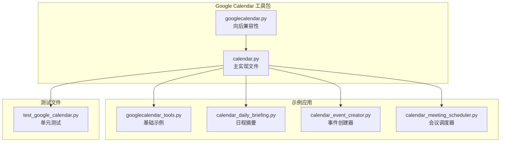

**图表来源**
- [libs/agno/agno/tools/google/calendar.py:1-1065](file://libs/agno/agno/tools/google/calendar.py#L1-L1065)
- [cookbook/91_tools/googlecalendar_tools.py:1-119](file://cookbook/91_tools/googlecalendar_tools.py#L1-L119)

**章节来源**
- [libs/agno/agno/tools/google/calendar.py:1-1065](file://libs/agno/agno/tools/google/calendar.py#L1-L1065)
- [cookbook/91_tools/googlecalendar_tools.py:1-119](file://cookbook/91_tools/googlecalendar_tools.py#L1-L119)

## 核心组件

Google Calendar Tools 的核心是一个名为 `GoogleCalendarTools` 的类，继承自 `Toolkit` 基类。该类提供了完整的日历管理功能，包括：

### 主要功能模块

1. **事件管理**：创建、获取、更新、删除日历事件
2. **查询功能**：列出事件、搜索事件、获取事件详情
3. **可用性检查**：检查个人和多人的日程空闲时间
4. **日程分析**：查找可用时间段、分析工作时间
5. **多日历支持**：管理多个日历账户
6. **会议功能**：处理参会者、RSVP 状态、会议链接

### 认证机制

工具包支持两种主要认证方式：
- **OAuth 2.0 流程**：适用于个人用户和桌面应用
- **服务账号认证**：适用于服务器间通信和批量操作

**章节来源**
- [libs/agno/agno/tools/google/calendar.py:60-203](file://libs/agno/agno/tools/google/calendar.py#L60-L203)
- [libs/agno/agno/tools/google/calendar.py:204-271](file://libs/agno/agno/tools/google/calendar.py#L204-L271)

## 架构概览

Google Calendar Tools 采用分层架构设计，确保了良好的可扩展性和维护性：

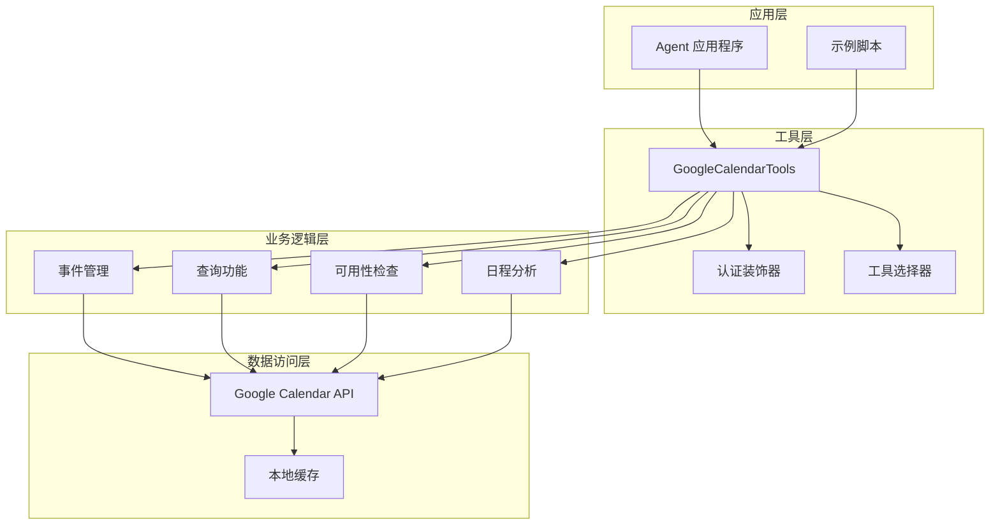

**图表来源**
- [libs/agno/agno/tools/google/calendar.py:42-57](file://libs/agno/agno/tools/google/calendar.py#L42-L57)
- [libs/agno/agno/tools/google/calendar.py:60-172](file://libs/agno/agno/tools/google/calendar.py#L60-L172)

### 数据流架构

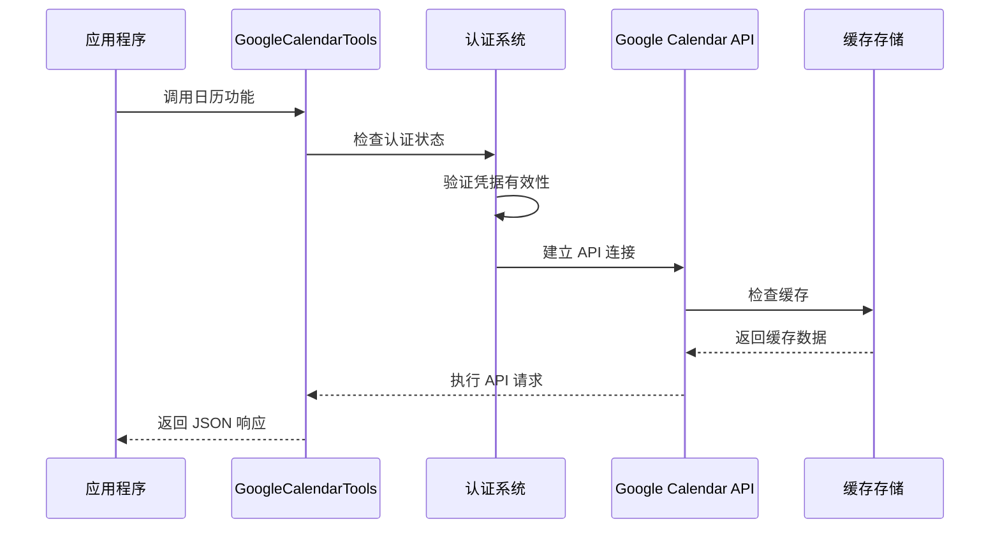

**图表来源**
- [libs/agno/agno/tools/google/calendar.py:42-57](file://libs/agno/agno/tools/google/calendar.py#L42-L57)
- [libs/agno/agno/tools/google/calendar.py:204-271](file://libs/agno/agno/tools/google/calendar.py#L204-L271)

## 详细组件分析

### GoogleCalendarTools 类

`GoogleCalendarTools` 是整个工具包的核心类，提供了完整的日历管理功能：

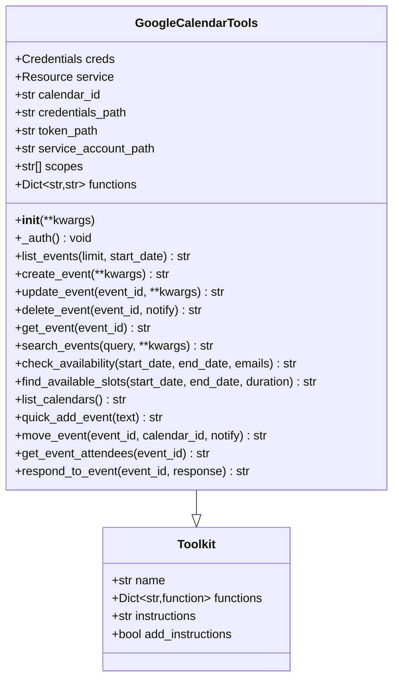

**图表来源**
- [libs/agno/agno/tools/google/calendar.py:60-172](file://libs/agno/agno/tools/google/calendar.py#L60-L172)

#### 认证系统

认证系统是 Google Calendar Tools 的重要组成部分，支持多种认证方式：

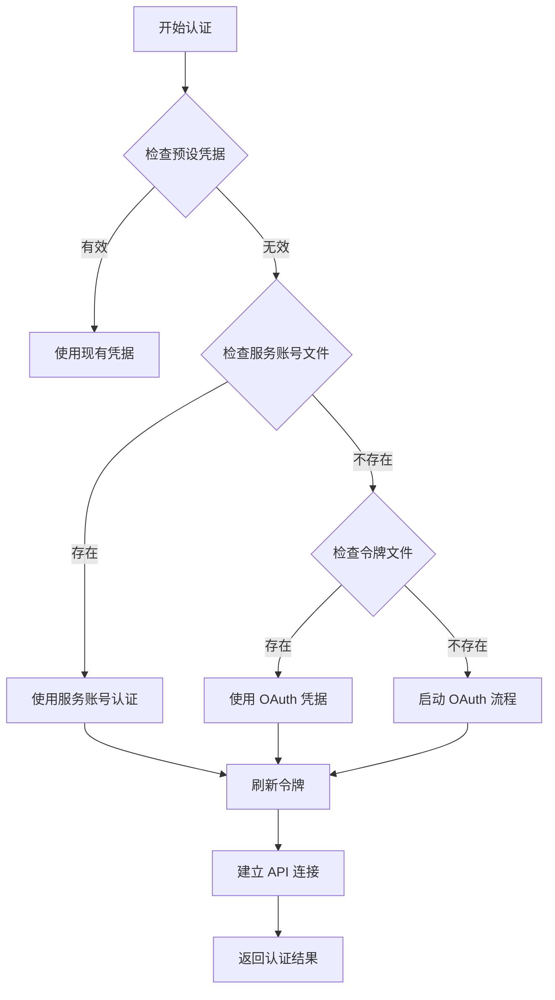

**图表来源**
- [libs/agno/agno/tools/google/calendar.py:204-271](file://libs/agno/agno/tools/google/calendar.py#L204-L271)

**章节来源**
- [libs/agno/agno/tools/google/calendar.py:60-203](file://libs/agno/agno/tools/google/calendar.py#L60-L203)
- [libs/agno/agno/tools/google/calendar.py:204-271](file://libs/agno/agno/tools/google/calendar.py#L204-L271)

### 事件管理功能

事件管理是 Google Calendar Tools 的核心功能之一，提供了完整的 CRUD 操作：

#### 事件创建流程

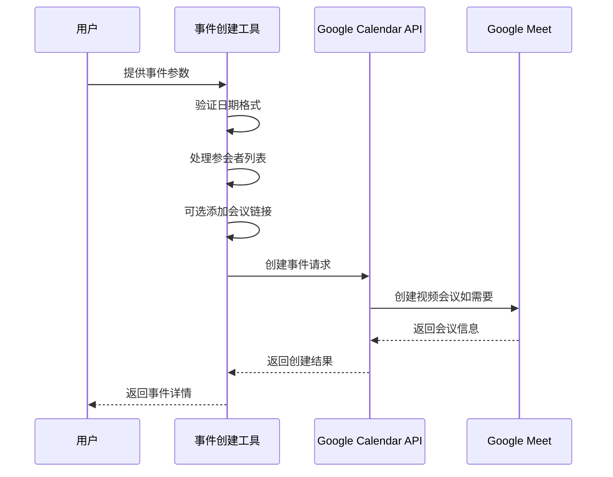

**图表来源**
- [libs/agno/agno/tools/google/calendar.py:317-390](file://libs/agno/agno/tools/google/calendar.py#L317-L390)

#### 事件更新流程

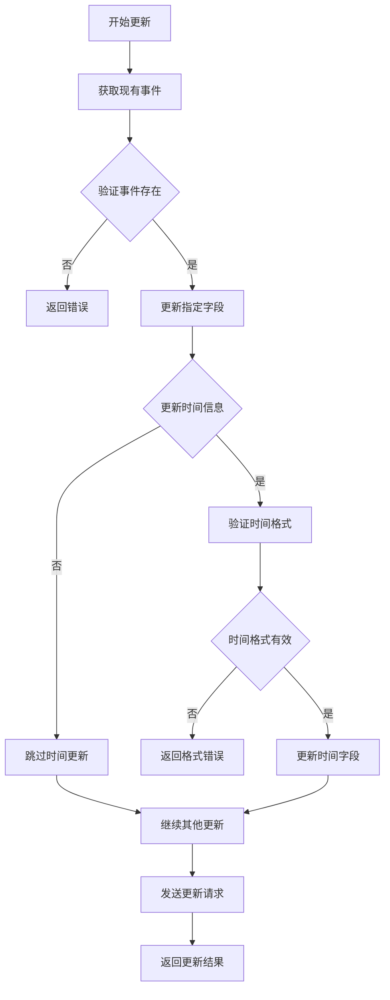

**图表来源**
- [libs/agno/agno/tools/google/calendar.py:392-465](file://libs/agno/agno/tools/google/calendar.py#L392-L465)

**章节来源**
- [libs/agno/agno/tools/google/calendar.py:317-465](file://libs/agno/agno/tools/google/calendar.py#L317-L465)

### 查询和搜索功能

Google Calendar Tools 提供了多种查询和搜索选项：

#### 事件搜索算法

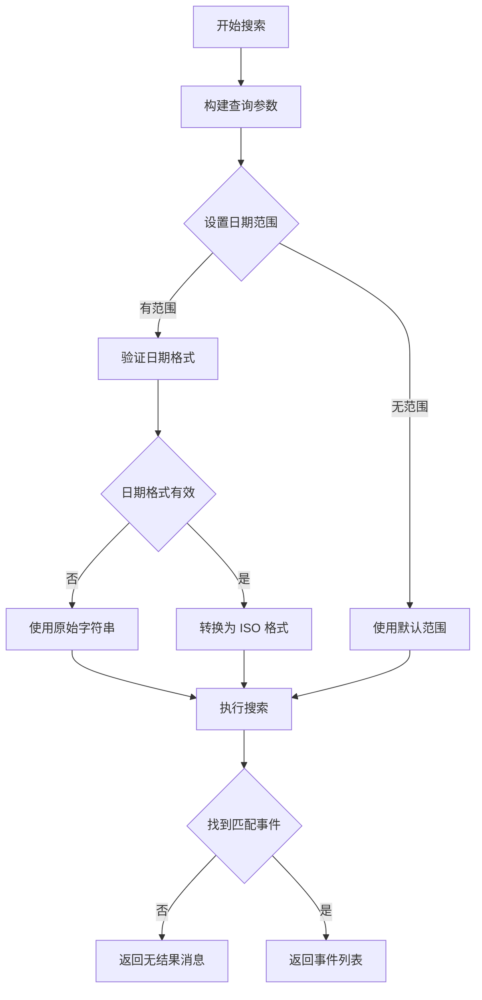

**图表来源**
- [libs/agno/agno/tools/google/calendar.py:871-931](file://libs/agno/agno/tools/google/calendar.py#L871-L931)

**章节来源**
- [libs/agno/agno/tools/google/calendar.py:871-931](file://libs/agno/agno/tools/google/calendar.py#L871-L931)

### 可用性检查功能

可用性检查功能支持单人和多人的日程分析：

#### 多人可用性检查流程

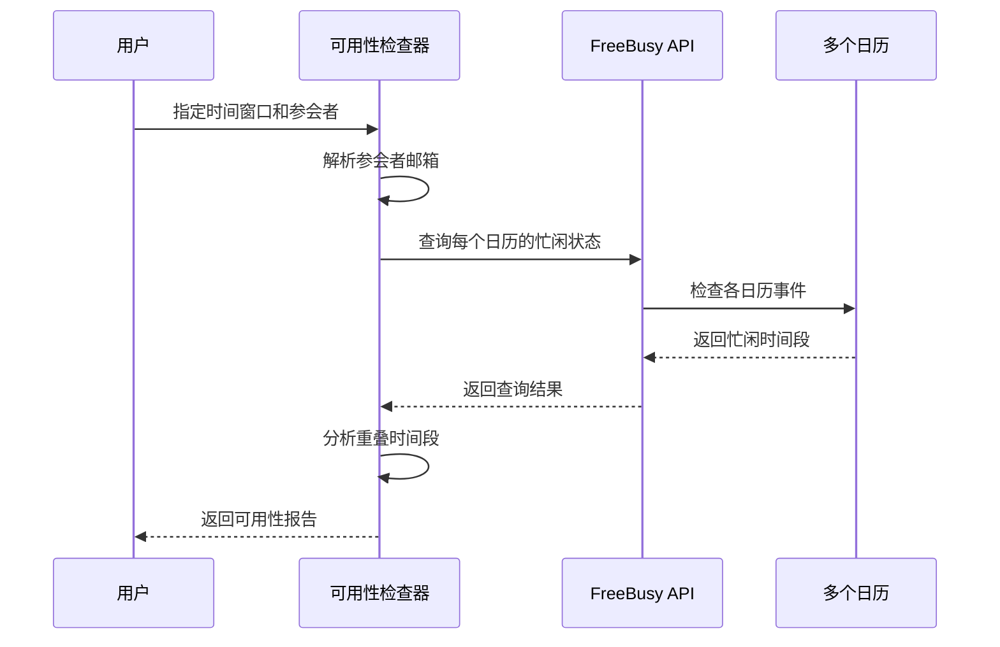

**图表来源**
- [libs/agno/agno/tools/google/calendar.py:800-869](file://libs/agno/agno/tools/google/calendar.py#L800-L869)

**章节来源**
- [libs/agno/agno/tools/google/calendar.py:800-869](file://libs/agno/agno/tools/google/calendar.py#L800-L869)

## 依赖关系分析

Google Calendar Tools 的依赖关系相对简洁，主要依赖于 Google 官方的 Python SDK：

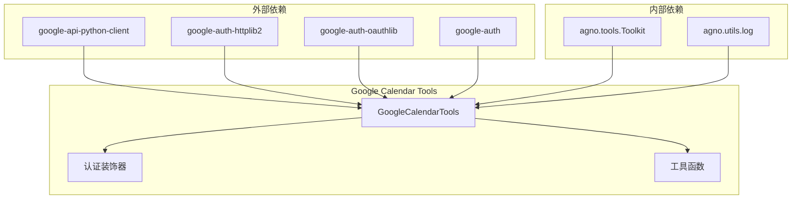

**图表来源**
- [libs/agno/agno/tools/google/calendar.py:13-24](file://libs/agno/agno/tools/google/calendar.py#L13-L24)

### 版本兼容性

工具包提供了向后兼容性支持，确保旧代码的正常运行：

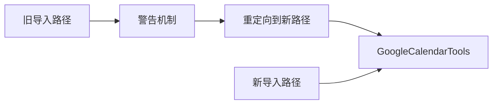

**图表来源**
- [libs/agno/agno/tools/googlecalendar.py:1-16](file://libs/agno/agno/tools/googlecalendar.py#L1-L16)

**章节来源**
- [libs/agno/agno/tools/googlecalendar.py:1-16](file://libs/agno/agno/tools/googlecalendar.py#L1-L16)

## 性能考虑

Google Calendar Tools 在设计时充分考虑了性能优化：

### 缓存策略

- **令牌缓存**：OAuth 令牌自动保存到本地文件，避免重复认证
- **API 响应缓存**：合理利用 Google Calendar API 的缓存机制
- **连接复用**：建立一次连接后可执行多次 API 调用

### 错误处理和重试

- **HTTP 错误处理**：对常见的 403、404、5xx 错误进行专门处理
- **超时控制**：合理设置 API 调用超时时间
- **重试机制**：对临时性错误实施指数退避重试

### 内存管理

- **分页处理**：大量数据时使用分页机制，避免内存溢出
- **流式处理**：对大型响应进行流式处理
- **及时释放**：确保 API 连接和资源及时释放

## 故障排除指南

### 常见问题和解决方案

#### 认证相关问题

**问题**：OAuth 认证失败
- **原因**：客户端凭据配置错误或令牌过期
- **解决方案**：重新运行认证流程，检查环境变量设置

**问题**：服务账号认证失败
- **原因**：服务账号文件路径错误或权限不足
- **解决方案**：验证服务账号文件路径，检查 Google Cloud 项目权限

#### API 调用错误

**问题**：403 Forbidden 错误
- **原因**：缺少必要的 OAuth 范围或权限不足
- **解决方案**：检查并添加所需的 Google Calendar API 范围

**问题**：404 Not Found 错误
- **原因**：尝试访问不存在的日历或事件
- **解决方案**：验证日历 ID 和事件 ID 的正确性

#### 数据格式错误

**问题**：日期时间格式错误
- **原因**：使用了不支持的日期时间格式
- **解决方案**：确保使用 ISO 8601 格式的日期时间字符串

**章节来源**
- [libs/agno/tests/unit/tools/test_google_calendar.py:254-265](file://libs/agno/tests/unit/tools/test_google_calendar.py#L254-L265)
- [libs/agno/tests/unit/tools/test_google_calendar.py:275-286](file://libs/agno/tests/unit/tools/test_google_calendar.py#L275-L286)

### 调试技巧

1. **启用详细日志**：使用 `log_debug` 和 `log_error` 函数查看详细的执行过程
2. **检查 API 限制**：监控 Google Calendar API 的使用配额
3. **验证输入参数**：在调用前验证所有必需的参数
4. **测试小规模数据**：先在小范围内测试功能，再扩展到生产环境

## 结论

Google Calendar Tools 是一个功能完整、设计良好的日历管理工具包。它提供了丰富的日历操作功能，支持多种认证方式，具有良好的错误处理机制和性能优化。通过模块化的架构设计，开发者可以根据需要灵活地启用或禁用特定功能。

该工具包特别适合用于构建智能日程管理应用、会议调度系统和团队协作工具。其标准化的 JSON 响应格式使得集成到各种应用程序中变得非常简单。

## 附录

### 使用示例

#### 基础使用

```python
from agno.agent import Agent
from agno.tools.google.calendar import GoogleCalendarTools

agent = Agent(
    tools=[GoogleCalendarTools(allow_update=True)],
    instructions=["帮助用户管理 Google 日历"],
)
```

#### 高级配置

```python
tools = GoogleCalendarTools(
    credentials_path="credentials.json",
    token_path="token.json",
    scopes=["https://www.googleapis.com/auth/calendar"],
    calendar_id="primary",
    oauth_port=8080,
    login_hint="user@example.com"
)
```

### 最佳实践

1. **安全第一**：妥善保管 OAuth 凭据和服务账号密钥
2. **错误处理**：始终检查 API 调用的返回结果
3. **性能优化**：合理使用分页和缓存机制
4. **用户隐私**：遵循 Google 的数据使用政策
5. **测试覆盖**：为关键功能编写单元测试