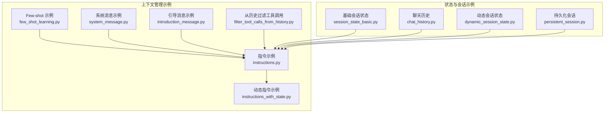
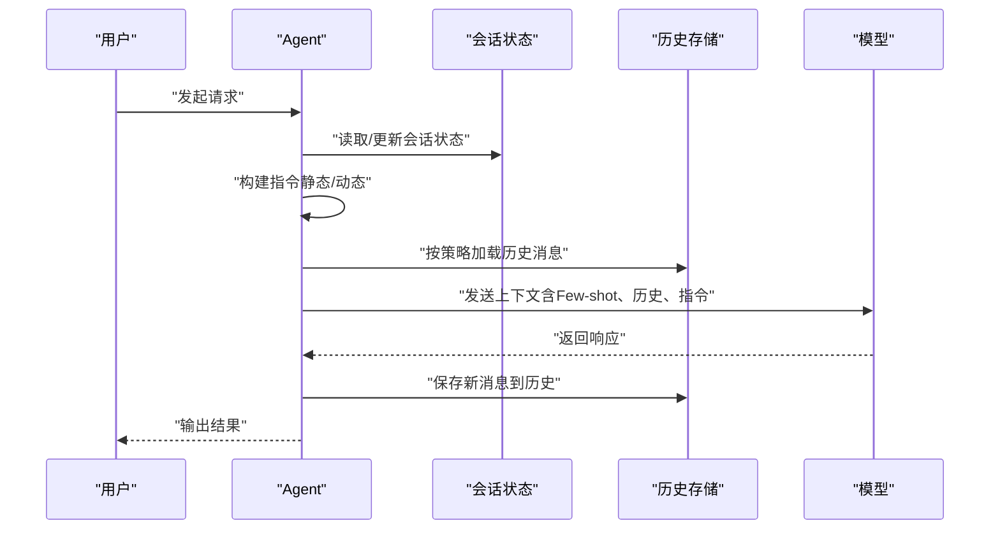
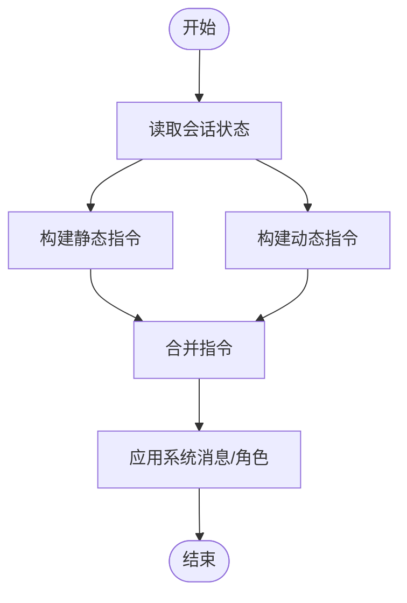
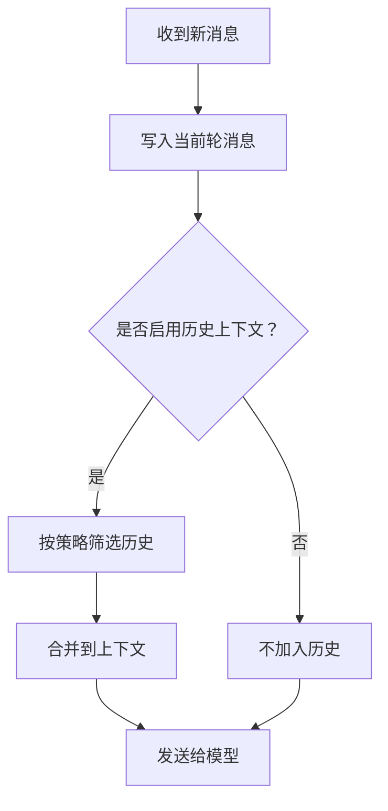
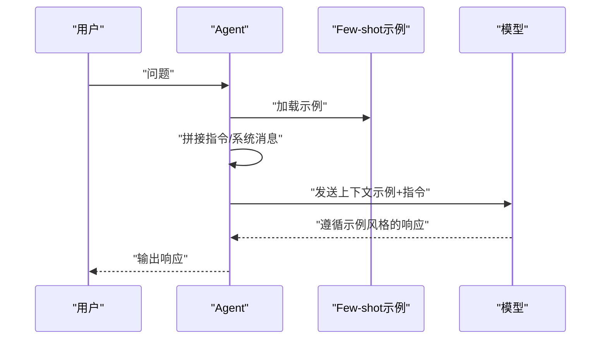
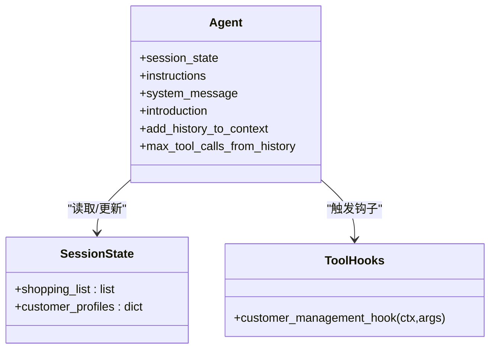
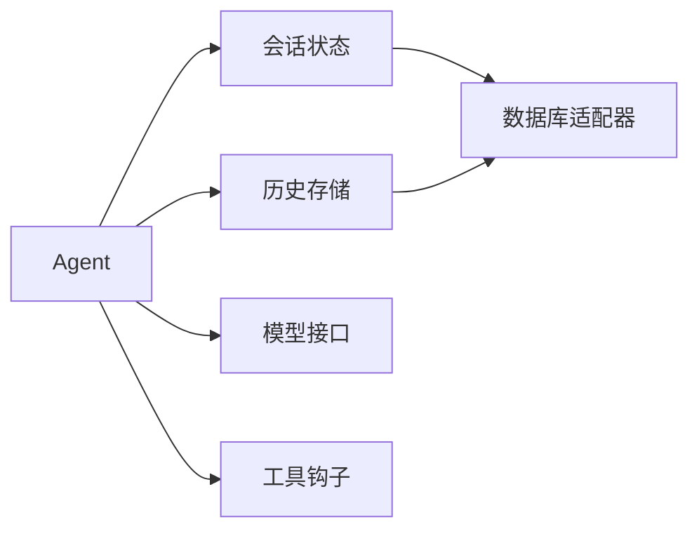

# 上下文管理

<cite>
**本文引用的文件**
- [cookbook/02_agents/03_context_management/instructions.py](file://cookbook/02_agents/03_context_management/instructions.py)
- [cookbook/02_agents/03_context_management/few_shot_learning.py](file://cookbook/02_agents/03_context_management/few_shot_learning.py)
- [cookbook/02_agents/03_context_management/system_message.py](file://cookbook/02_agents/03_context_management/system_message.py)
- [cookbook/02_agents/03_context_management/introduction_message.py](file://cookbook/02_agents/03_context_management/introduction_message.py)
- [cookbook/02_agents/03_context_management/instructions_with_state.py](file://cookbook/02_agents/03_context_management/instructions_with_state.py)
- [cookbook/02_agents/03_context_management/filter_tool_calls_from_history.py](file://cookbook/02_agents/03_context_management/filter_tool_calls_from_history.py)
- [cookbook/02_agents/05_state_and_session/session_state_basic.py](file://cookbook/02_agents/05_state_and_session/session_state_basic.py)
- [cookbook/02_agents/05_state_and_session/chat_history.py](file://cookbook/02_agents/05_state_and_session/chat_history.py)
- [cookbook/02_agents/05_state_and_session/dynamic_session_state.py](file://cookbook/02_agents/05_state_and_session/dynamic_session_state.py)
- [cookbook/02_agents/05_state_and_session/persistent_session.py](file://cookbook/02_agents/05_state_and_session/persistent_session.py)
</cite>

## 目录
1. 引言
2. 项目结构
3. 核心组件
4. 架构总览
5. 详细组件分析
6. 依赖分析
7. 性能考量
8. 故障排查指南
9. 结论
10. 附录

## 引言
本文件围绕代理的上下文管理系统进行系统化说明，重点覆盖以下方面：
- 指令系统：系统指令、用户指令与动态指令的管理方式
- 历史记录管理：消息历史、会话历史与上下文压缩策略
- 系统消息配置：角色设定、行为约束与输出格式控制
- Few-shot 学习：原理与应用实践
- 上下文长度优化、历史清理与性能调优最佳实践
- 通过具体示例展示如何有效管理代理的上下文信息

## 项目结构
本项目的上下文管理相关内容主要集中在 cookbook 的“上下文管理”与“状态与会话”两个模块中，涵盖指令、系统消息、引导消息、Few-shot 示例、工具调用过滤、聊天历史与持久化会话等主题。

图表来源
- [cookbook/02_agents/03_context_management/instructions.py:1-27](file://cookbook/02_agents/03_context_management/instructions.py#L1-L27)
- [cookbook/02_agents/03_context_management/few_shot_learning.py:1-100](file://cookbook/02_agents/03_context_management/few_shot_learning.py#L1-L100)
- [cookbook/02_agents/03_context_management/system_message.py:1-31](file://cookbook/02_agents/03_context_management/system_message.py#L1-L31)
- [cookbook/02_agents/03_context_management/introduction_message.py:1-32](file://cookbook/02_agents/03_context_management/introduction_message.py#L1-L32)
- [cookbook/02_agents/03_context_management/instructions_with_state.py:1-50](file://cookbook/02_agents/03_context_management/instructions_with_state.py#L1-L50)
- [cookbook/02_agents/03_context_management/filter_tool_calls_from_history.py:1-104](file://cookbook/02_agents/03_context_management/filter_tool_calls_from_history.py#L1-L104)
- [cookbook/02_agents/05_state_and_session/session_state_basic.py:1-49](file://cookbook/02_agents/05_state_and_session/session_state_basic.py#L1-L49)
- [cookbook/02_agents/05_state_and_session/chat_history.py:1-36](file://cookbook/02_agents/05_state_and_session/chat_history.py#L1-L36)
- [cookbook/02_agents/05_state_and_session/dynamic_session_state.py:1-95](file://cookbook/02_agents/05_state_and_session/dynamic_session_state.py#L1-L95)
- [cookbook/02_agents/05_state_and_session/persistent_session.py:1-31](file://cookbook/02_agents/05_state_and_session/persistent_session.py#L1-L31)

章节来源
- [cookbook/02_agents/03_context_management/instructions.py:1-27](file://cookbook/02_agents/03_context_management/instructions.py#L1-L27)
- [cookbook/02_agents/03_context_management/few_shot_learning.py:1-100](file://cookbook/02_agents/03_context_management/few_shot_learning.py#L1-L100)
- [cookbook/02_agents/03_context_management/system_message.py:1-31](file://cookbook/02_agents/03_context_management/system_message.py#L1-L31)
- [cookbook/02_agents/03_context_management/introduction_message.py:1-32](file://cookbook/02_agents/03_context_management/introduction_message.py#L1-L32)
- [cookbook/02_agents/03_context_management/instructions_with_state.py:1-50](file://cookbook/02_agents/03_context_management/instructions_with_state.py#L1-L50)
- [cookbook/02_agents/03_context_management/filter_tool_calls_from_history.py:1-104](file://cookbook/02_agents/03_context_management/filter_tool_calls_from_history.py#L1-L104)
- [cookbook/02_agents/05_state_and_session/session_state_basic.py:1-49](file://cookbook/02_agents/05_state_and_session/session_state_basic.py#L1-L49)
- [cookbook/02_agents/05_state_and_session/chat_history.py:1-36](file://cookbook/02_agents/05_state_and_session/chat_history.py#L1-L36)
- [cookbook/02_agents/05_state_and_session/dynamic_session_state.py:1-95](file://cookbook/02_agents/05_state_and_session/dynamic_session_state.py#L1-L95)
- [cookbook/02_agents/05_state_and_session/persistent_session.py:1-31](file://cookbook/02_agents/05_state_and_session/persistent_session.py#L1-L31)

## 核心组件
- 指令系统
  - 静态指令：在初始化时直接传入字符串或字符串列表，用于定义代理的角色、行为与输出规范。
  - 动态指令：通过函数接收运行上下文构建指令，使指令随会话状态变化而动态调整。
- 历史记录管理
  - 消息历史：记录每次交互的消息序列，支持按需加入上下文。
  - 会话历史：以会话为单位持久化历史，便于跨轮对话保持一致性。
  - 上下文压缩：通过限制工具调用数量、裁剪历史等方式降低输入长度。
- 系统消息
  - 自定义系统消息与角色，用于约束代理的行为与输出风格。
- Few-shot 学习
  - 通过额外输入注入示例，引导模型遵循特定模式生成响应。
- 工具调用过滤
  - 控制进入模型输入的历史工具调用数量，平衡成本与效果。

章节来源
- [cookbook/02_agents/03_context_management/instructions.py:14-18](file://cookbook/02_agents/03_context_management/instructions.py#L14-L18)
- [cookbook/02_agents/03_context_management/instructions_with_state.py:16-31](file://cookbook/02_agents/03_context_management/instructions_with_state.py#L16-L31)
- [cookbook/02_agents/03_context_management/few_shot_learning.py:85-97](file://cookbook/02_agents/03_context_management/few_shot_learning.py#L85-L97)
- [cookbook/02_agents/03_context_management/system_message.py:14-21](file://cookbook/02_agents/03_context_management/system_message.py#L14-L21)
- [cookbook/02_agents/03_context_management/filter_tool_calls_from_history.py:42-52](file://cookbook/02_agents/03_context_management/filter_tool_calls_from_history.py#L42-L52)

## 架构总览
下图展示了上下文管理的关键流程：Agent 初始化时设置指令、系统消息、引导消息与历史策略；运行时根据会话状态与历史记录动态构建上下文，并通过数据库持久化会话与消息。

图表来源
- [cookbook/02_agents/03_context_management/instructions_with_state.py:16-31](file://cookbook/02_agents/03_context_management/instructions_with_state.py#L16-L31)
- [cookbook/02_agents/03_context_management/few_shot_learning.py:85-97](file://cookbook/02_agents/03_context_management/few_shot_learning.py#L85-L97)
- [cookbook/02_agents/03_context_management/filter_tool_calls_from_history.py:42-52](file://cookbook/02_agents/03_context_management/filter_tool_calls_from_history.py#L42-L52)
- [cookbook/02_agents/05_state_and_session/session_state_basic.py:27-36](file://cookbook/02_agents/05_state_and_session/session_state_basic.py#L27-L36)
- [cookbook/02_agents/05_state_and_session/chat_history.py:19-25](file://cookbook/02_agents/05_state_and_session/chat_history.py#L19-L25)

## 详细组件分析

### 指令系统
- 静态指令
  - 在 Agent 初始化时以字符串或字符串列表形式提供，适合固定角色与规则。
  - 示例路径：[cookbook/02_agents/03_context_management/instructions.py:14-18](file://cookbook/02_agents/03_context_management/instructions.py#L14-L18)
- 动态指令
  - 使用函数接收运行上下文，基于会话状态动态拼装指令，适合多场景、多角色切换。
  - 示例路径：[cookbook/02_agents/03_context_management/instructions_with_state.py:16-31](file://cookbook/02_agents/03_context_management/instructions_with_state.py#L16-L31)
- 指令与系统消息的关系
  - 系统消息用于底层角色与行为约束，指令用于任务导向的显式规则；二者可组合使用。
  - 示例路径：[cookbook/02_agents/03_context_management/system_message.py:14-21](file://cookbook/02_agents/03_context_management/system_message.py#L14-L21)

图表来源
- [cookbook/02_agents/03_context_management/instructions_with_state.py:16-31](file://cookbook/02_agents/03_context_management/instructions_with_state.py#L16-L31)
- [cookbook/02_agents/03_context_management/system_message.py:14-21](file://cookbook/02_agents/03_context_management/system_message.py#L14-L21)

章节来源
- [cookbook/02_agents/03_context_management/instructions.py:14-18](file://cookbook/02_agents/03_context_management/instructions.py#L14-L18)
- [cookbook/02_agents/03_context_management/instructions_with_state.py:16-31](file://cookbook/02_agents/03_context_management/instructions_with_state.py#L16-L31)
- [cookbook/02_agents/03_context_management/system_message.py:14-21](file://cookbook/02_agents/03_context_management/system_message.py#L14-L21)

### 历史记录管理
- 消息历史
  - 通过开关参数将历史消息加入上下文，减少重复输入，提升一致性。
  - 示例路径：[cookbook/02_agents/03_context_management/filter_tool_calls_from_history.py:42-52](file://cookbook/02_agents/03_context_management/filter_tool_calls_from_history.py#L42-L52)
- 会话历史
  - 使用数据库持久化会话，支持跨轮对话与状态恢复。
  - 示例路径：[cookbook/02_agents/05_state_and_session/chat_history.py:19-25](file://cookbook/02_agents/05_state_and_session/chat_history.py#L19-L25)
- 上下文压缩
  - 限制历史中的工具调用数量，仅保留最近若干次调用，降低输入长度与成本。
  - 示例路径：[cookbook/02_agents/03_context_management/filter_tool_calls_from_history.py:42-52](file://cookbook/02_agents/03_context_management/filter_tool_calls_from_history.py#L42-L52)

图表来源
- [cookbook/02_agents/03_context_management/filter_tool_calls_from_history.py:42-52](file://cookbook/02_agents/03_context_management/filter_tool_calls_from_history.py#L42-L52)
- [cookbook/02_agents/05_state_and_session/chat_history.py:19-25](file://cookbook/02_agents/05_state_and_session/chat_history.py#L19-L25)

章节来源
- [cookbook/02_agents/03_context_management/filter_tool_calls_from_history.py:42-52](file://cookbook/02_agents/03_context_management/filter_tool_calls_from_history.py#L42-L52)
- [cookbook/02_agents/05_state_and_session/chat_history.py:19-25](file://cookbook/02_agents/05_state_and_session/chat_history.py#L19-L25)

### 系统消息与引导消息
- 系统消息
  - 可自定义系统消息内容与角色，用于约束代理行为与输出风格。
  - 示例路径：[cookbook/02_agents/03_context_management/system_message.py:14-21](file://cookbook/02_agents/03_context_management/system_message.py#L14-L21)
- 引导消息
  - 作为首次对话的问候语，增强用户体验与上下文连贯性。
  - 示例路径：[cookbook/02_agents/03_context_management/introduction_message.py:14-19](file://cookbook/02_agents/03_context_management/introduction_message.py#L14-L19)

章节来源
- [cookbook/02_agents/03_context_management/system_message.py:14-21](file://cookbook/02_agents/03_context_management/system_message.py#L14-L21)
- [cookbook/02_agents/03_context_management/introduction_message.py:14-19](file://cookbook/02_agents/03_context_management/introduction_message.py#L14-L19)

### Few-shot 学习
- 原理
  - 通过在提示中注入少量高质量示例，引导模型遵循一致的思维与表达模式。
- 应用
  - 将示例作为额外输入传递给 Agent，结合指令与系统消息，形成稳定的输出风格。
- 示例路径：[cookbook/02_agents/03_context_management/few_shot_learning.py:85-97](file://cookbook/02_agents/03_context_management/few_shot_learning.py#L85-L97)

图表来源
- [cookbook/02_agents/03_context_management/few_shot_learning.py:85-97](file://cookbook/02_agents/03_context_management/few_shot_learning.py#L85-L97)

章节来源
- [cookbook/02_agents/03_context_management/few_shot_learning.py:85-97](file://cookbook/02_agents/03_context_management/few_shot_learning.py#L85-L97)

### 会话状态与动态上下文
- 基础会话状态
  - 初始化时设置默认状态，工具调用可更新状态并在后续指令中使用。
  - 示例路径：[cookbook/02_agents/05_state_and_session/session_state_basic.py:27-36](file://cookbook/02_agents/05_state_and_session/session_state_basic.py#L27-L36)
- 动态会话状态
  - 通过工具钩子在运行时更新状态，确保系统提示中不包含未完成的临时数据。
  - 示例路径：[cookbook/02_agents/05_state_and_session/dynamic_session_state.py:35-78](file://cookbook/02_agents/05_state_and_session/dynamic_session_state.py#L35-L78)
- 持久化会话
  - 使用数据库存储会话与历史，支持跨进程/重启恢复。
  - 示例路径：[cookbook/02_agents/05_state_and_session/persistent_session.py:19-24](file://cookbook/02_agents/05_state_and_session/persistent_session.py#L19-L24)

图表来源
- [cookbook/02_agents/05_state_and_session/session_state_basic.py:27-36](file://cookbook/02_agents/05_state_and_session/session_state_basic.py#L27-L36)
- [cookbook/02_agents/05_state_and_session/dynamic_session_state.py:35-78](file://cookbook/02_agents/05_state_and_session/dynamic_session_state.py#L35-L78)

章节来源
- [cookbook/02_agents/05_state_and_session/session_state_basic.py:27-36](file://cookbook/02_agents/05_state_and_session/session_state_basic.py#L27-L36)
- [cookbook/02_agents/05_state_and_session/dynamic_session_state.py:35-78](file://cookbook/02_agents/05_state_and_session/dynamic_session_state.py#L35-L78)
- [cookbook/02_agents/05_state_and_session/persistent_session.py:19-24](file://cookbook/02_agents/05_state_and_session/persistent_session.py#L19-L24)

## 依赖分析
- 组件耦合
  - Agent 对会话状态、历史存储与模型接口存在直接依赖；通过工具钩子与动态指令降低耦合度。
- 外部依赖
  - 数据库适配器（如 SQLite、Postgres、内存存储）用于持久化会话与历史。
- 关键参数
  - add_history_to_context、max_tool_calls_from_history、additional_input、system_message 等决定上下文规模与质量。

图表来源
- [cookbook/02_agents/05_state_and_session/session_state_basic.py:27-36](file://cookbook/02_agents/05_state_and_session/session_state_basic.py#L27-L36)
- [cookbook/02_agents/05_state_and_session/chat_history.py:19-25](file://cookbook/02_agents/05_state_and_session/chat_history.py#L19-L25)
- [cookbook/02_agents/03_context_management/filter_tool_calls_from_history.py:42-52](file://cookbook/02_agents/03_context_management/filter_tool_calls_from_history.py#L42-L52)

章节来源
- [cookbook/02_agents/05_state_and_session/session_state_basic.py:27-36](file://cookbook/02_agents/05_state_and_session/session_state_basic.py#L27-L36)
- [cookbook/02_agents/05_state_and_session/chat_history.py:19-25](file://cookbook/02_agents/05_state_and_session/chat_history.py#L19-L25)
- [cookbook/02_agents/03_context_management/filter_tool_calls_from_history.py:42-52](file://cookbook/02_agents/03_context_management/filter_tool_calls_from_history.py#L42-L52)

## 性能考量
- 上下文长度优化
  - 使用 max_tool_calls_from_history 限制进入模型输入的历史工具调用数量，显著降低 token 消耗。
  - 示例路径：[cookbook/02_agents/03_context_management/filter_tool_calls_from_history.py:42-52](file://cookbook/02_agents/03_context_management/filter_tool_calls_from_history.py#L42-L52)
- 历史清理
  - 仅在必要时加载历史；对非关键历史采用分页或采样策略。
  - 示例路径：[cookbook/02_agents/05_state_and_session/chat_history.py:19-25](file://cookbook/02_agents/05_state_and_session/chat_history.py#L19-L25)
- 输出格式控制
  - 通过系统消息与指令约束输出风格（如 Markdown、要点式），减少无效内容。
  - 示例路径：[cookbook/02_agents/03_context_management/system_message.py:14-21](file://cookbook/02_agents/03_context_management/system_message.py#L14-L21)
- 持久化与缓存
  - 使用数据库持久化会话，避免重复计算与重复输入；在内存中缓存热点状态。
  - 示例路径：[cookbook/02_agents/05_state_and_session/persistent_session.py:19-24](file://cookbook/02_agents/05_state_and_session/persistent_session.py#L19-L24)

## 故障排查指南
- 指令未生效
  - 检查是否正确传入静态或动态指令；确认动态指令函数返回值类型与上下文可用性。
  - 参考路径：[cookbook/02_agents/03_context_management/instructions_with_state.py:16-31](file://cookbook/02_agents/03_context_management/instructions_with_state.py#L16-L31)
- 历史未被加入上下文
  - 确认 add_history_to_context 开关已启用；检查数据库连接与表名。
  - 参考路径：[cookbook/02_agents/05_state_and_session/chat_history.py:19-25](file://cookbook/02_agents/05_state_and_session/chat_history.py#L19-L25)
- 工具调用过多导致上下文过长
  - 调整 max_tool_calls_from_history；必要时对历史进行采样或裁剪。
  - 参考路径：[cookbook/02_agents/03_context_management/filter_tool_calls_from_history.py:42-52](file://cookbook/02_agents/03_context_management/filter_tool_calls_from_history.py#L42-L52)
- 会话状态未更新
  - 检查工具钩子是否注册与执行；确认 session_state 初始化与访问路径。
  - 参考路径：[cookbook/02_agents/05_state_and_session/dynamic_session_state.py:35-78](file://cookbook/02_agents/05_state_and_session/dynamic_session_state.py#L35-L78)

章节来源
- [cookbook/02_agents/03_context_management/instructions_with_state.py:16-31](file://cookbook/02_agents/03_context_management/instructions_with_state.py#L16-L31)
- [cookbook/02_agents/05_state_and_session/chat_history.py:19-25](file://cookbook/02_agents/05_state_and_session/chat_history.py#L19-L25)
- [cookbook/02_agents/03_context_management/filter_tool_calls_from_history.py:42-52](file://cookbook/02_agents/03_context_management/filter_tool_calls_from_history.py#L42-L52)
- [cookbook/02_agents/05_state_and_session/dynamic_session_state.py:35-78](file://cookbook/02_agents/05_state_and_session/dynamic_session_state.py#L35-L78)

## 结论
通过将指令系统、系统消息、Few-shot 示例与会话状态有机结合，并配合历史过滤与持久化策略，可以有效管理代理的上下文，实现稳定、可控且高效的对话体验。建议在实际部署中优先采用动态指令与工具钩子，结合上下文压缩与历史采样，持续优化性能与成本。

## 附录
- 快速参考
  - 指令示例：[cookbook/02_agents/03_context_management/instructions.py:14-18](file://cookbook/02_agents/03_context_management/instructions.py#L14-L18)
  - 动态指令示例：[cookbook/02_agents/03_context_management/instructions_with_state.py:16-31](file://cookbook/02_agents/03_context_management/instructions_with_state.py#L16-L31)
  - Few-shot 示例：[cookbook/02_agents/03_context_management/few_shot_learning.py:85-97](file://cookbook/02_agents/03_context_management/few_shot_learning.py#L85-L97)
  - 系统消息示例：[cookbook/02_agents/03_context_management/system_message.py:14-21](file://cookbook/02_agents/03_context_management/system_message.py#L14-L21)
  - 引导消息示例：[cookbook/02_agents/03_context_management/introduction_message.py:14-19](file://cookbook/02_agents/03_context_management/introduction_message.py#L14-L19)
  - 历史与过滤示例：[cookbook/02_agents/03_context_management/filter_tool_calls_from_history.py:42-52](file://cookbook/02_agents/03_context_management/filter_tool_calls_from_history.py#L42-L52)
  - 会话状态示例：[cookbook/02_agents/05_state_and_session/session_state_basic.py:27-36](file://cookbook/02_agents/05_state_and_session/session_state_basic.py#L27-L36)
  - 聊天历史示例：[cookbook/02_agents/05_state_and_session/chat_history.py:19-25](file://cookbook/02_agents/05_state_and_session/chat_history.py#L19-L25)
  - 动态会话状态示例：[cookbook/02_agents/05_state_and_session/dynamic_session_state.py:35-78](file://cookbook/02_agents/05_state_and_session/dynamic_session_state.py#L35-L78)
  - 持久化会话示例：[cookbook/02_agents/05_state_and_session/persistent_session.py:19-24](file://cookbook/02_agents/05_state_and_session/persistent_session.py#L19-L24)