# 人机协作

<cite>
**本文引用的文件**
- [cookbook/02_agents/10_human_in_the_loop/confirmation_required.py](file://cookbook/02_agents/10_human_in_the_loop/confirmation_required.py)
- [cookbook/02_agents/10_human_in_the_loop/confirmation_advanced.py](file://cookbook/02_agents/10_human_in_the_loop/confirmation_advanced.py)
- [cookbook/02_agents/10_human_in_the_loop/confirmation_toolkit.md](file://cookbook/02_agents/10_human_in_the_loop/confirmation_toolkit.md)
- [cookbook/02_agents/10_human_in_the_loop/external_tool_execution.py](file://cookbook/02_agents/10_human_in_the_loop/external_tool_execution.py)
- [cookbook/02_agents/10_human_in_the_loop/user_input.py](file://cookbook/02_agents/10_human_in_the_loop/user_input.py)
- [cookbook/02_agents/10_human_in_the_loop/user_feedback.py](file://cookbook/02_agents/10_human_in_the_loop/user_feedback.py)
- [cookbook/02_agents/11_approvals/approval_basic.py](file://cookbook/02_agents/11_approvals/approval_basic.py)
- [cookbook/02_agents/11_approvals/approval_list_and_resolve.py](file://cookbook/02_agents/11_approvals/approval_list_and_resolve.py)
- [cookbook/04_workflows/_07_human_in_the_loop/confirmation/01_basic_step_confirmation.md](file://cookbook/04_workflows/_07_human_in_the_loop/confirmation/01_basic_step_confirmation.md)
- [cookbook/04_workflows/_07_human_in_the_loop/loop/01_loop_confirmation.md](file://cookbook/04_workflows/_07_human_in_the_loop/loop/01_loop_confirmation.md)
- [cookbook/91_tools/tool_hooks/pre_and_post_hooks.md](file://cookbook/91_tools/tool_hooks/pre_and_post_hooks.md)
- [libs/agno/agno/utils/mcp.py](file://libs/agno/agno/utils/mcp.py)
- [libs/agno/agno/tools/mcp/multi_mcp.py](file://libs/agno/agno/tools/mcp/multi_mcp.py)
- [cookbook/91_tools/mcp_tools.md](file://cookbook/91_tools/mcp_tools.md)
- [cookbook/02_agents/05_state_and_session/session_state_basic.py](file://cookbook/02_agents/05_state_and_session/session_state_basic.py)
- [cookbook/02_agents/05_state_and_session/session_state_advanced.py](file://cookbook/02_agents/05_state_and_session/session_state_advanced.py)
- [libs/agno/tests/integration/agent/test_tool_hooks.py](file://libs/agno/tests/integration/agent/test_tool_hooks.py)
- [cookbook/00_quickstart/agent_with_guardrails.py](file://cookbook/00_quickstart/agent_with_guardrails.py)
- [cookbook/00_quickstart/agent_with_guardrails.md](file://cookbook/00_quickstart/agent_with_guardrails.md)
- [cookbook/02_agents/08_guardrails/custom_guardrail.py](file://cookbook/02_agents/08_guardrails/custom_guardrail.py)
- [libs/agno/agno/workflow/types.py](file://libs/agno/agno/workflow/types.py)
</cite>

## 目录
1. [引言](#引言)
2. [项目结构](#项目结构)
3. [核心组件](#核心组件)
4. [架构总览](#架构总览)
5. [详细组件分析](#详细组件分析)
6. [依赖分析](#依赖分析)
7. [性能考量](#性能考量)
8. [故障排查指南](#故障排查指南)
9. [结论](#结论)
10. [附录](#附录)

## 引言
本文件面向“人机协作系统”的设计与实现，围绕以下目标展开：工具确认机制（确认流程、用户交互与自动化处理）、用户输入处理（输入验证、格式转换与响应生成）、审批流程配置与管理（审批规则、权限控制与状态跟踪）、外部工具执行集成（工具调用、状态监控与结果处理）、确认所需机制（确认对话、用户反馈与决策支持）。文档提供多场景应用示例路径，并总结用户体验优化、交互设计与安全性最佳实践。

## 项目结构
本仓库以“食谱式教程”组织了大量可直接运行的示例，覆盖代理（Agent）、团队（Team）、工作流（Workflow）、工具（Tool）、会话与状态（Session/State）、审批（Approval）、MCP 工具集成、护栏（Guardrails）等模块。与“人机协作”密切相关的示例主要集中在：
- 人类在回路（HITL）：工具确认、用户输入、用户反馈、外部工具执行
- 审批（Approval）：基于工具确认的持久化审批记录与状态流转
- 工作流（Workflow）：步骤与循环级别的确认暂停
- 工具钩子（Tool Hooks）：函数级前后置钩子与拦截
- MCP 工具：外部工具的协议化集成
- 会话与状态：跨轮次的状态保持与指令注入
- 护栏（Guardrails）：输入/输出安全检查

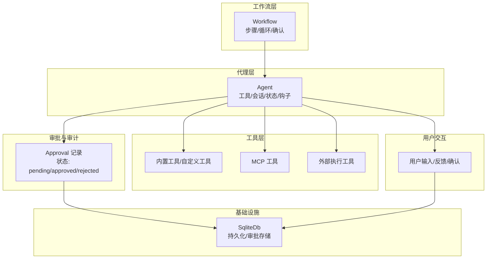

图示来源
- [cookbook/02_agents/10_human_in_the_loop/confirmation_required.py:1-96](file://cookbook/02_agents/10_human_in_the_loop/confirmation_required.py#L1-L96)
- [cookbook/02_agents/11_approvals/approval_basic.py:1-132](file://cookbook/02_agents/11_approvals/approval_basic.py#L1-L132)
- [cookbook/04_workflows/_07_human_in_the_loop/confirmation/01_basic_step_confirmation.md:1-41](file://cookbook/04_workflows/_07_human_in_the_loop/confirmation/01_basic_step_confirmation.md#L1-L41)
- [libs/agno/agno/tools/mcp/multi_mcp.py:64-602](file://libs/agno/agno/tools/mcp/multi_mcp.py#L64-L602)

章节来源
- [cookbook/02_agents/10_human_in_the_loop/confirmation_required.py:1-96](file://cookbook/02_agents/10_human_in_the_loop/confirmation_required.py#L1-L96)
- [cookbook/02_agents/11_approvals/approval_basic.py:1-132](file://cookbook/02_agents/11_approvals/approval_basic.py#L1-L132)
- [cookbook/04_workflows/_07_human_in_the_loop/confirmation/01_basic_step_confirmation.md:1-41](file://cookbook/04_workflows/_07_human_in_the_loop/confirmation/01_basic_step_confirmation.md#L1-L41)

## 核心组件
- 工具确认（requires_confirmation）
  - 通过装饰器或 Toolkit 选项启用，使工具调用在执行前暂停，等待用户确认或拒绝。
  - 支持拒绝时跳过步骤或取消整个工作流。
- 用户输入与反馈
  - 用户输入：根据 schema 动态收集字段值，支持类型校验与必填约束。
  - 用户反馈：结构化问题与选项，支持单选/多选。
- 审批（Approval）
  - 工具调用触发审批记录，持久化到数据库；管理员可查询、筛选、批准/拒绝、删除。
- 外部工具执行
  - 工具声明 external_execution，代理暂停后由外部自行执行并回填结果。
- 工具钩子（Tool Hooks）
  - 函数级 pre/post 钩子与 Agent 级 tool_hooks，用于拦截、日志、二次确认等。
- MCP 工具集成
  - 通过 Model Context Protocol 连接外部工具服务器，支持 stdio/SSE，异步生命周期管理。
- 会话与状态
  - 代理/工作流维护 session_state，支持跨轮次状态共享与指令注入。

章节来源
- [cookbook/02_agents/10_human_in_the_loop/confirmation_required.py:23-47](file://cookbook/02_agents/10_human_in_the_loop/confirmation_required.py#L23-L47)
- [cookbook/02_agents/10_human_in_the_loop/user_input.py:72-108](file://cookbook/02_agents/10_human_in_the_loop/user_input.py#L72-L108)
- [cookbook/02_agents/10_human_in_the_loop/user_feedback.py:32-83](file://cookbook/02_agents/10_human_in_the_loop/user_feedback.py#L32-L83)
- [cookbook/02_agents/11_approvals/approval_basic.py:22-42](file://cookbook/02_agents/11_approvals/approval_basic.py#L22-L42)
- [cookbook/02_agents/10_human_in_the_loop/external_tool_execution.py:18-32](file://cookbook/02_agents/10_human_in_the_loop/external_tool_execution.py#L18-L32)
- [cookbook/91_tools/tool_hooks/pre_and_post_hooks.md:1-82](file://cookbook/91_tools/tool_hooks/pre_and_post_hooks.md#L1-L82)
- [libs/agno/agno/utils/mcp.py:42-255](file://libs/agno/agno/utils/mcp.py#L42-L255)
- [cookbook/02_agents/05_state_and_session/session_state_basic.py:27-36](file://cookbook/02_agents/05_state_and_session/session_state_basic.py#L27-L36)

## 架构总览
下图展示了从“用户意图”到“工具执行/外部执行/审批/反馈”的端到端流程，以及与数据库、MCP 服务器的交互。

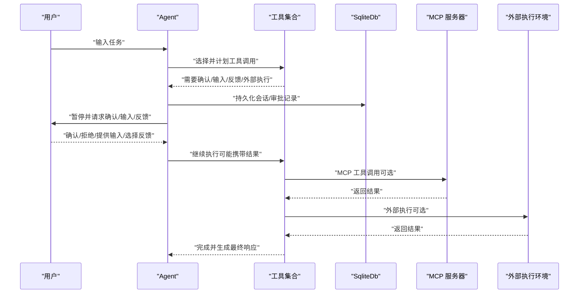

图示来源
- [cookbook/02_agents/10_human_in_the_loop/confirmation_required.py:63-96](file://cookbook/02_agents/10_human_in_the_loop/confirmation_required.py#L63-L96)
- [cookbook/02_agents/11_approvals/approval_basic.py:78-132](file://cookbook/02_agents/11_approvals/approval_basic.py#L78-L132)
- [cookbook/02_agents/10_human_in_the_loop/external_tool_execution.py:47-72](file://cookbook/02_agents/10_human_in_the_loop/external_tool_execution.py#L47-L72)
- [libs/agno/agno/utils/mcp.py:42-255](file://libs/agno/agno/utils/mcp.py#L42-L255)

## 详细组件分析

### 工具确认机制（requires_confirmation）
- 启用方式
  - 函数级：装饰器标记工具为需要确认。
  - Toolkit 级：通过 requires_confirmation_tools 列表批量标记。
- 交互流程
  - 代理运行产生 active_requirements；遍历需求，询问用户是否确认；确认后继续，拒绝可跳过或取消。
- 与审批联动
  - 工具同时被 @approval 装饰时，先创建审批记录，用户确认后再继续，管理员可在数据库中审核与更新状态。

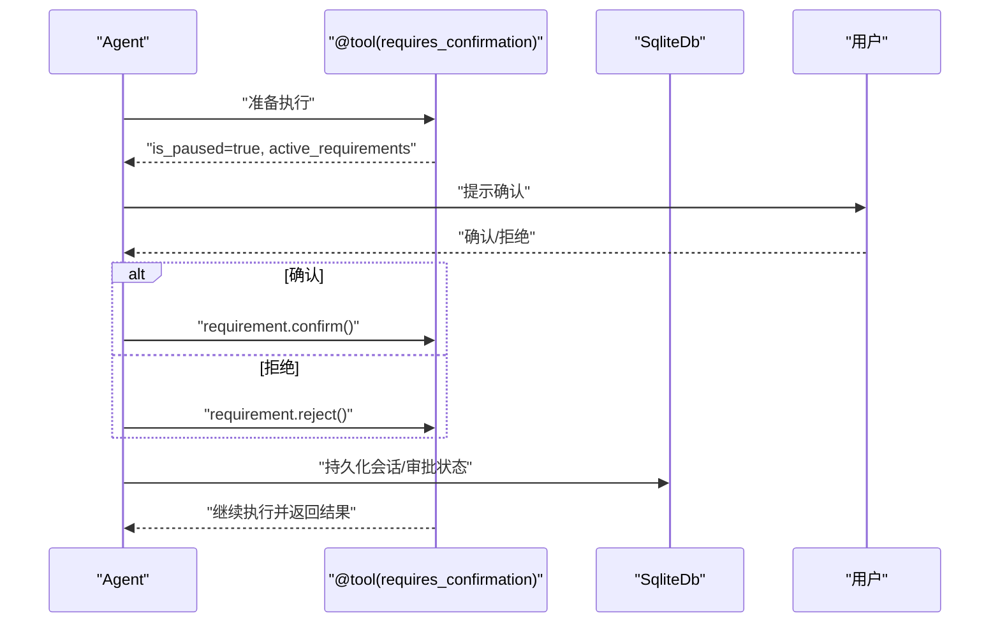

图示来源
- [cookbook/02_agents/10_human_in_the_loop/confirmation_required.py:63-96](file://cookbook/02_agents/10_human_in_the_loop/confirmation_required.py#L63-L96)
- [cookbook/02_agents/10_human_in_the_loop/confirmation_advanced.py:66-97](file://cookbook/02_agents/10_human_in_the_loop/confirmation_advanced.py#L66-L97)
- [cookbook/02_agents/10_human_in_the_loop/confirmation_toolkit.md:50-93](file://cookbook/02_agents/10_human_in_the_loop/confirmation_toolkit.md#L50-L93)
- [cookbook/02_agents/11_approvals/approval_basic.py:78-132](file://cookbook/02_agents/11_approvals/approval_basic.py#L78-L132)

章节来源
- [cookbook/02_agents/10_human_in_the_loop/confirmation_required.py:23-47](file://cookbook/02_agents/10_human_in_the_loop/confirmation_required.py#L23-L47)
- [cookbook/02_agents/10_human_in_the_loop/confirmation_advanced.py:23-47](file://cookbook/02_agents/10_human_in_the_loop/confirmation_advanced.py#L23-L47)
- [cookbook/02_agents/10_human_in_the_loop/confirmation_toolkit.md:50-93](file://cookbook/02_agents/10_human_in_the_loop/confirmation_toolkit.md#L50-L93)
- [libs/agno/tests/integration/agent/test_tool_hooks.py:72-155](file://libs/agno/tests/integration/agent/test_tool_hooks.py#L72-L155)

### 用户输入处理（schema 驱动）
- 输入收集
  - 当 requirement.needs_user_input 为真时，读取 user_input_schema，逐字段提示用户输入并更新值。
- 格式转换与验证
  - 使用字段类型与允许值进行校验；不满足要求时抛出错误，驱动用户重新输入。
- 响应生成
  - 输入完成后继续运行，生成最终响应。

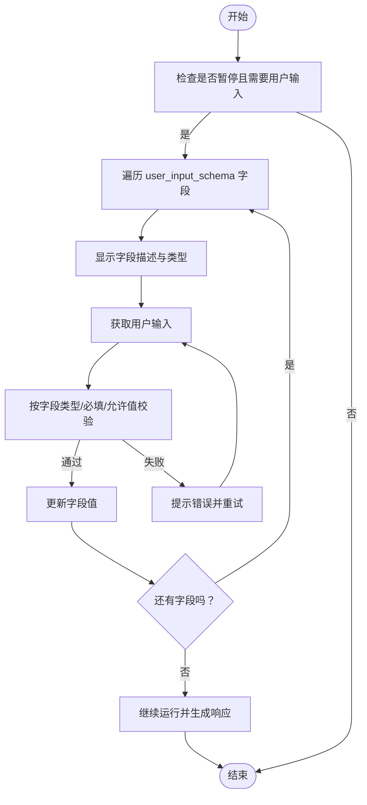

图示来源
- [cookbook/02_agents/10_human_in_the_loop/user_input.py:72-145](file://cookbook/02_agents/10_human_in_the_loop/user_input.py#L72-L145)
- [libs/agno/agno/workflow/types.py:662-703](file://libs/agno/agno/workflow/types.py#L662-L703)

章节来源
- [cookbook/02_agents/10_human_in_the_loop/user_input.py:72-145](file://cookbook/02_agents/10_human_in_the_loop/user_input.py#L72-L145)
- [libs/agno/agno/workflow/types.py:662-703](file://libs/agno/agno/workflow/types.py#L662-L703)

### 用户反馈（结构化问题）
- 交互流程
  - 代理暂停并提供问题与选项；用户选择后，将选择结果提供给 requirement，继续运行。
- 适用场景
  - 旅行规划、偏好采集、风险评估等需要明确选项的场景。

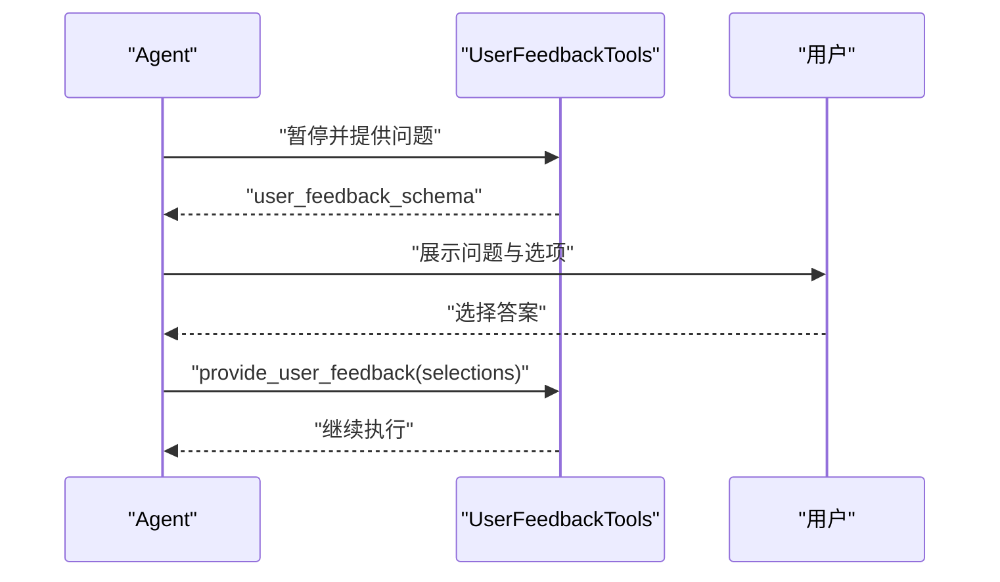

图示来源
- [cookbook/02_agents/10_human_in_the_loop/user_feedback.py:32-83](file://cookbook/02_agents/10_human_in_the_loop/user_feedback.py#L32-L83)

章节来源
- [cookbook/02_agents/10_human_in_the_loop/user_feedback.py:32-83](file://cookbook/02_agents/10_human_in_the_loop/user_feedback.py#L32-L83)

### 审批流程配置与管理
- 触发与记录
  - 工具被 @approval 装饰并在需要确认时触发审批记录创建。
- 查询与筛选
  - 支持按状态、run_id 等条件查询与计数。
- 解决与删除
  - 管理员可批准/拒绝；支持预期状态守卫避免并发冲突；最后可删除记录。
- 与确认配合
  - 用户确认后继续执行；审批记录作为审计依据。

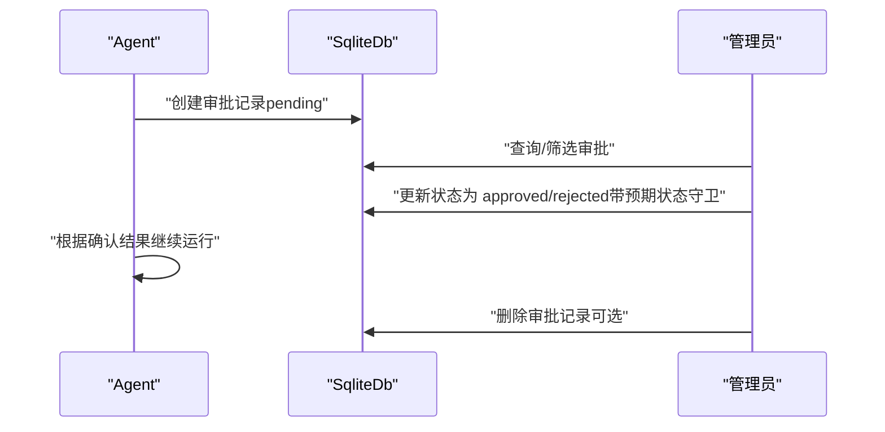

图示来源
- [cookbook/02_agents/11_approvals/approval_basic.py:78-132](file://cookbook/02_agents/11_approvals/approval_basic.py#L78-L132)
- [cookbook/02_agents/11_approvals/approval_list_and_resolve.py:78-198](file://cookbook/02_agents/11_approvals/approval_list_and_resolve.py#L78-L198)

章节来源
- [cookbook/02_agents/11_approvals/approval_basic.py:22-42](file://cookbook/02_agents/11_approvals/approval_basic.py#L22-L42)
- [cookbook/02_agents/11_approvals/approval_list_and_resolve.py:20-41](file://cookbook/02_agents/11_approvals/approval_list_and_resolve.py#L20-L41)

### 外部工具执行集成
- 启用方式
  - 工具声明 external_execution=True；代理暂停后由外部自行执行工具并回填结果。
- 监控与结果处理
  - 外部执行完成后，通过 requirement.set_external_execution_result 设置结果，代理继续运行。

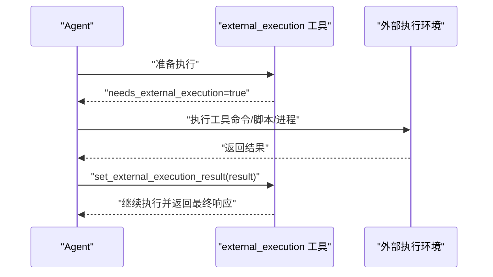

图示来源
- [cookbook/02_agents/10_human_in_the_loop/external_tool_execution.py:47-72](file://cookbook/02_agents/10_human_in_the_loop/external_tool_execution.py#L47-L72)

章节来源
- [cookbook/02_agents/10_human_in_the_loop/external_tool_execution.py:18-32](file://cookbook/02_agents/10_human_in_the_loop/external_tool_execution.py#L18-L32)

### 工具钩子（拦截与增强）
- 函数级 pre/post 钩子
  - 仅作用于单个工具，可访问 FunctionCall 实例，支持同步/异步，可修改结果或阻止执行。
- Agent 级 tool_hooks
  - 拦截所有工具调用，适合统一的日志、二次确认、限流等策略。
- 示例要点
  - pre_hook 在 entrypoint 前执行；post_hook 在 entrypoint 后执行；可组合多个钩子。

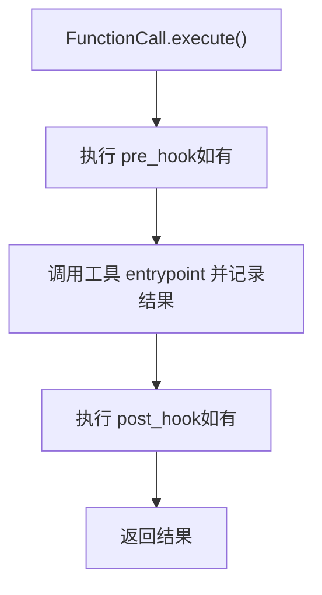

图示来源
- [cookbook/91_tools/tool_hooks/pre_and_post_hooks.md:55-72](file://cookbook/91_tools/tool_hooks/pre_and_post_hooks.md#L55-L72)
- [libs/agno/tests/integration/agent/test_tool_hooks.py:72-155](file://libs/agno/tests/integration/agent/test_tool_hooks.py#L72-L155)

章节来源
- [cookbook/91_tools/tool_hooks/pre_and_post_hooks.md:1-82](file://cookbook/91_tools/tool_hooks/pre_and_post_hooks.md#L1-L82)
- [libs/agno/tests/integration/agent/test_tool_hooks.py:72-155](file://libs/agno/tests/integration/agent/test_tool_hooks.py#L72-L155)

### MCP 工具集成
- 连接方式
  - 支持 SSE（远程）与 stdio（本地）两种传输；异步生命周期管理。
- 系统提示组装
  - 通过 instructions、markdown 与动态工具说明组装最终系统提示。
- 命令白名单与安全
  - 对命令进行白名单与路径校验，防止任意命令执行。

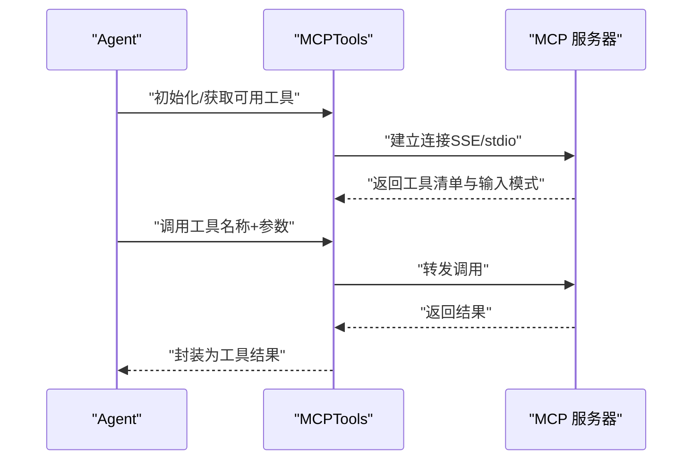

图示来源
- [libs/agno/agno/utils/mcp.py:42-255](file://libs/agno/agno/utils/mcp.py#L42-L255)
- [libs/agno/agno/tools/mcp/multi_mcp.py:587-602](file://libs/agno/agno/tools/mcp/multi_mcp.py#L587-L602)
- [cookbook/91_tools/mcp_tools.md:18-54](file://cookbook/91_tools/mcp_tools.md#L18-L54)

章节来源
- [libs/agno/agno/utils/mcp.py:42-255](file://libs/agno/agno/utils/mcp.py#L42-L255)
- [libs/agno/agno/tools/mcp/multi_mcp.py:64-602](file://libs/agno/agno/tools/mcp/multi_mcp.py#L64-L602)
- [cookbook/91_tools/mcp_tools.md:1-54](file://cookbook/91_tools/mcp_tools.md#L1-L54)

### 会话与状态（跨轮次上下文）
- 代理层
  - 初始化 session_state，指令中可注入变量；工具可通过 RunContext 访问与更新。
- 工作流层
  - 支持会话切换与状态持久化，便于长流程的上下文保持。

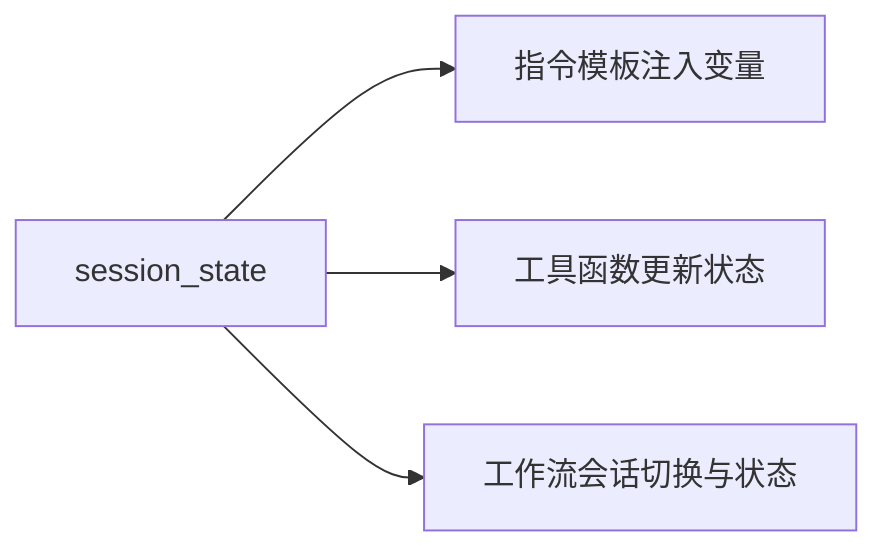

图示来源
- [cookbook/02_agents/05_state_and_session/session_state_basic.py:27-36](file://cookbook/02_agents/05_state_and_session/session_state_basic.py#L27-L36)
- [cookbook/02_agents/05_state_and_session/session_state_advanced.py:64-79](file://cookbook/02_agents/05_state_and_session/session_state_advanced.py#L64-L79)

章节来源
- [cookbook/02_agents/05_state_and_session/session_state_basic.py:14-49](file://cookbook/02_agents/05_state_and_session/session_state_basic.py#L14-L49)
- [cookbook/02_agents/05_state_and_session/session_state_advanced.py:17-103](file://cookbook/02_agents/05_state_and_session/session_state_advanced.py#L17-L103)

### 工作流中的确认（步骤/循环）
- 步骤确认
  - Step(requires_confirmation=True) 在执行前暂停，支持拒绝时跳过或取消。
- 循环确认
  - Loop(requires_confirmation=True) 在首次迭代前暂停，用户确认后执行，拒绝则跳过整个循环。

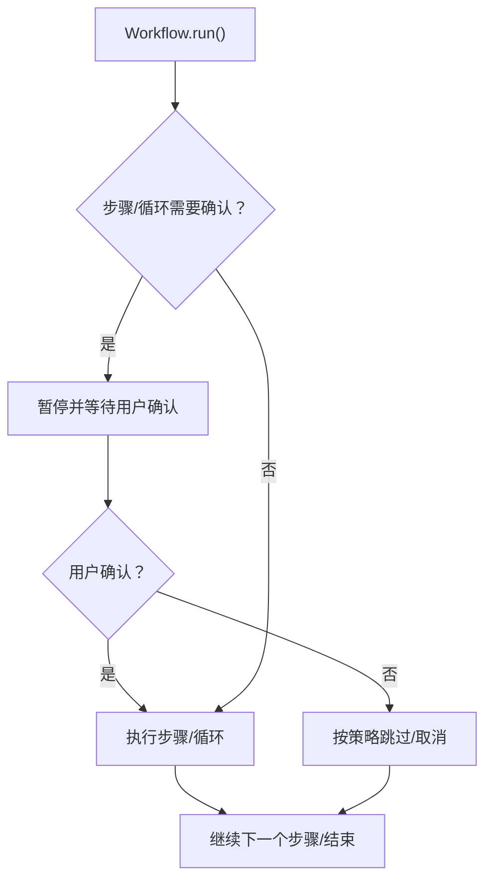

图示来源
- [cookbook/04_workflows/_07_human_in_the_loop/confirmation/01_basic_step_confirmation.md:21-41](file://cookbook/04_workflows/_07_human_in_the_loop/confirmation/01_basic_step_confirmation.md#L21-L41)
- [cookbook/04_workflows/_07_human_in_the_loop/loop/01_loop_confirmation.md:21-45](file://cookbook/04_workflows/_07_human_in_the_loop/loop/01_loop_confirmation.md#L21-L45)

章节来源
- [cookbook/04_workflows/_07_human_in_the_loop/confirmation/01_basic_step_confirmation.md:1-41](file://cookbook/04_workflows/_07_human_in_the_loop/confirmation/01_basic_step_confirmation.md#L1-L41)
- [cookbook/04_workflows/_07_human_in_the_loop/loop/01_loop_confirmation.md:1-45](file://cookbook/04_workflows/_07_human_in_the_loop/loop/01_loop_confirmation.md#L1-L45)

## 依赖分析
- 组件耦合
  - 工具确认与审批强耦合：工具被 @approval 装饰时，确认与审批记录共同生效。
  - 用户输入/反馈与工具确认并行存在：两者都可能导致代理暂停。
  - 外部工具执行与工具确认互斥：当 needs_external_execution 为真时，由外部执行并回填结果。
- 外部依赖
  - 数据库：SqliteDb 用于持久化会话与审批记录。
  - MCP 服务器：通过 stdio/SSE 连接外部工具。
- 潜在循环依赖
  - 工具钩子与护栏在运行期通过 hooks 机制注入，避免直接循环导入。

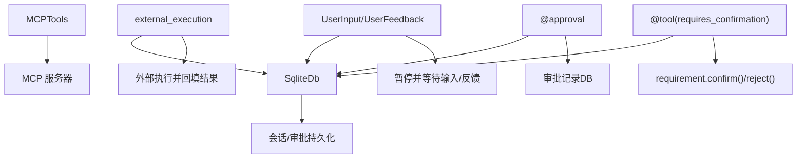

图示来源
- [cookbook/02_agents/10_human_in_the_loop/confirmation_required.py:63-96](file://cookbook/02_agents/10_human_in_the_loop/confirmation_required.py#L63-L96)
- [cookbook/02_agents/11_approvals/approval_basic.py:78-132](file://cookbook/02_agents/11_approvals/approval_basic.py#L78-L132)
- [cookbook/02_agents/10_human_in_the_loop/external_tool_execution.py:47-72](file://cookbook/02_agents/10_human_in_the_loop/external_tool_execution.py#L47-L72)
- [libs/agno/agno/utils/mcp.py:42-255](file://libs/agno/agno/utils/mcp.py#L42-L255)

章节来源
- [cookbook/02_agents/11_approvals/approval_basic.py:48-76](file://cookbook/02_agents/11_approvals/approval_basic.py#L48-L76)
- [libs/agno/agno/utils/mcp.py:42-255](file://libs/agno/agno/utils/mcp.py#L42-L255)

## 性能考量
- 工具确认与审批
  - 批量工具确认时，建议采用 Toolkit.requires_confirmation_tools 列表化管理，减少重复装饰。
  - 审批查询与更新使用分页/过滤，避免全表扫描。
- 外部工具执行
  - 外部执行应尽量短小、幂等；结果回填需及时，避免长时间阻塞。
- MCP 工具
  - 连接复用与超时控制；合理设置 header_provider，避免频繁重建会话。
- 用户输入/反馈
  - schema 校验前置，减少无效轮次；提供默认值与示例提升效率。

## 故障排查指南
- 输入校验失败
  - 现象：用户输入不符合 schema，抛出校验错误。
  - 处理：检查字段类型、必填与允许值；引导用户提供正确格式。
- 审批状态异常
  - 现象：双写/并发导致状态不一致。
  - 处理：使用预期状态守卫；必要时重试或人工介入。
- 工具钩子拦截
  - 现象：工具被 pre/post 钩子阻止或结果被修改。
  - 处理：检查钩子逻辑；必要时临时禁用或调整顺序。
- MCP 命令安全
  - 现象：命令不在白名单或路径非法。
  - 处理：核对 ALLOWED_COMMANDS；使用相对/绝对路径或 PATH 中存在的二进制。

章节来源
- [libs/agno/agno/workflow/types.py:662-703](file://libs/agno/agno/workflow/types.py#L662-L703)
- [cookbook/02_agents/11_approvals/approval_list_and_resolve.py:134-144](file://cookbook/02_agents/11_approvals/approval_list_and_resolve.py#L134-L144)
- [libs/agno/tests/integration/agent/test_tool_hooks.py:72-155](file://libs/agno/tests/integration/agent/test_tool_hooks.py#L72-L155)
- [libs/agno/agno/utils/mcp.py:220-255](file://libs/agno/agno/utils/mcp.py#L220-L255)

## 结论
本系统通过“工具确认 + 用户输入/反馈 + 审批 + 外部执行 + 工具钩子 + MCP 集成 + 会话状态”的组合，实现了高可控、可观测、可审计的人机协作闭环。建议在生产环境中：
- 明确确认阈值与审批规则，结合权限模型与审计日志；
- 优先使用 schema 驱动的输入与反馈，确保交互一致性；
- 对外部执行与 MCP 工具实施严格的命令白名单与超时控制；
- 通过会话状态与工作流确认，保障复杂流程的可追溯性与容错能力。

## 附录
- 典型应用场景示例（路径）
  - 工具确认：[confirmation_required.py:63-96](file://cookbook/02_agents/10_human_in_the_loop/confirmation_required.py#L63-L96)
  - 多工具确认与拒绝理由：[confirmation_advanced.py:66-97](file://cookbook/02_agents/10_human_in_the_loop/confirmation_advanced.py#L66-L97)
  - Toolkit 级确认传播：[confirmation_toolkit.md:50-93](file://cookbook/02_agents/10_human_in_the_loop/confirmation_toolkit.md#L50-L93)
  - 用户输入收集与校验：[user_input.py:72-145](file://cookbook/02_agents/10_human_in_the_loop/user_input.py#L72-L145)
  - 用户反馈（结构化问题）：[user_feedback.py:32-83](file://cookbook/02_agents/10_human_in_the_loop/user_feedback.py#L32-L83)
  - 审批基本流程：[approval_basic.py:78-132](file://cookbook/02_agents/11_approvals/approval_basic.py#L78-L132)
  - 审批生命周期（查询/筛选/解决/删除）：[approval_list_and_resolve.py:90-198](file://cookbook/02_agents/11_approvals/approval_list_and_resolve.py#L90-L198)
  - 工作流步骤确认：[01_basic_step_confirmation.md:21-41](file://cookbook/04_workflows/_07_human_in_the_loop/confirmation/01_basic_step_confirmation.md#L21-L41)
  - 工作流循环确认：[01_loop_confirmation.md:21-45](file://cookbook/04_workflows/_07_human_in_the_loop/loop/01_loop_confirmation.md#L21-L45)
  - 工具钩子（pre/post）：[pre_and_post_hooks.md:43-72](file://cookbook/91_tools/tool_hooks/pre_and_post_hooks.md#L43-L72)
  - MCP 工具集成：[mcp_tools.md:18-54](file://cookbook/91_tools/mcp_tools.md#L18-L54)
  - MCP 工具调用入口与命令校验：[mcp.py:42-255](file://libs/agno/agno/utils/mcp.py#L42-L255)
  - 会话状态（基础/高级）：[session_state_basic.py:27-36](file://cookbook/02_agents/05_state_and_session/session_state_basic.py#L27-L36)、[session_state_advanced.py:64-79](file://cookbook/02_agents/05_state_and_session/session_state_advanced.py#L64-L79)
  - 护栏（自定义/护栏基类）：[custom_guardrail.py:14-28](file://cookbook/02_agents/08_guardrails/custom_guardrail.py#L14-L28)、[agent_with_guardrails.py:36-69](file://cookbook/00_quickstart/agent_with_guardrails.py#L36-L69)