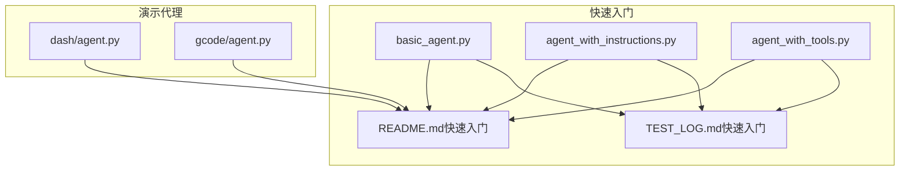
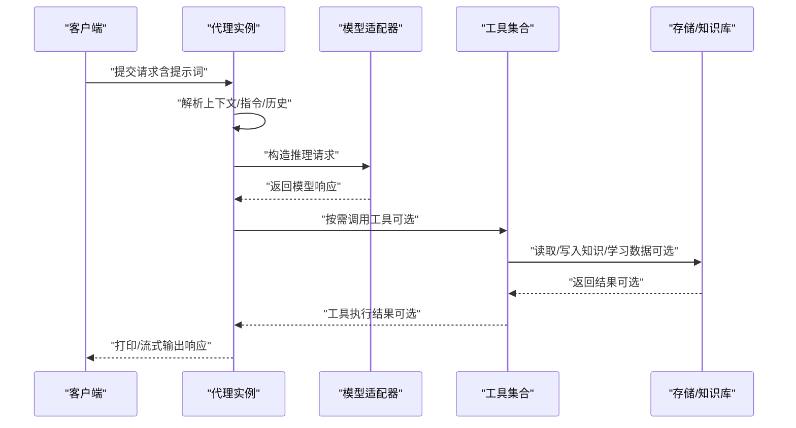
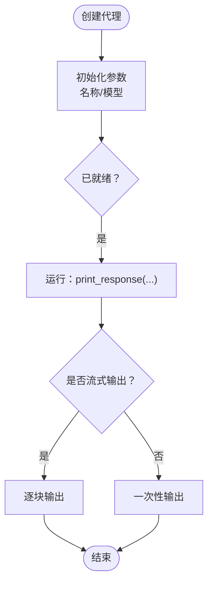
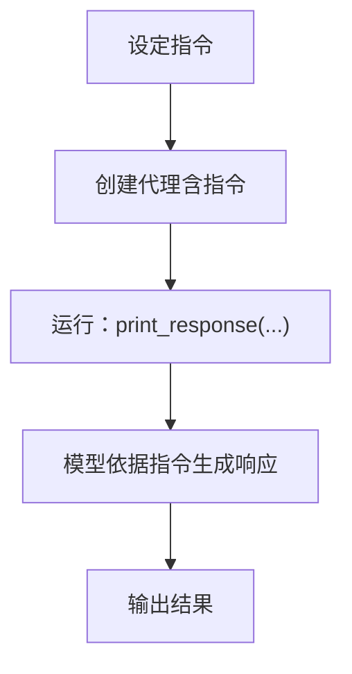
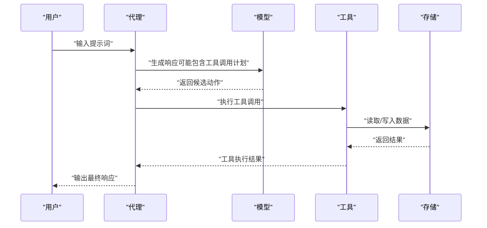
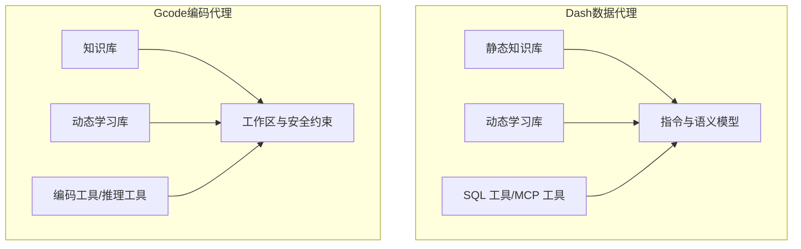
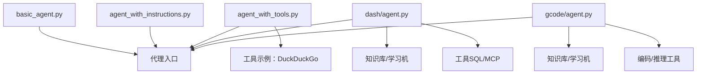

# 代理基础

<cite>
**本文引用的文件**
- [basic_agent.py](file://cookbook/02_agents/01_quickstart/basic_agent.py)
- [agent_with_instructions.py](file://cookbook/02_agents/01_quickstart/agent_with_instructions.py)
- [agent_with_tools.py](file://cookbook/02_agents/01_quickstart/agent_with_tools.py)
- [README.md（快速入门）](file://cookbook/02_agents/01_quickstart/README.md)
- [TEST_LOG.md（快速入门）](file://cookbook/02_agents/01_quickstart/TEST_LOG.md)
- [dash/agent.py](file://cookbook/01_demo/agents/dash/agent.py)
- [gcode/agent.py](file://cookbook/01_demo/agents/gcode/agent.py)
</cite>

## 目录
1. [简介](#简介)
2. [项目结构](#项目结构)
3. [核心组件](#核心组件)
4. [架构总览](#架构总览)
5. [详细组件分析](#详细组件分析)
6. [依赖分析](#依赖分析)
7. [性能考虑](#性能考虑)
8. [故障排查指南](#故障排查指南)
9. [结论](#结论)
10. [附录](#附录)

## 简介
本章节面向“代理基础”能力，系统性阐述智能代理的核心概念与基本实现，覆盖以下主题：
- 代理的创建方法、初始化参数与基本属性
- 代理生命周期管理：启动、运行、暂停与销毁
- 基础配置选项：模型选择、参数设置与行为控制
- 通过具体示例展示如何创建与配置基础代理
- 代理与其他组件的关系及其在系统中的作用
- 常见问题的解决方案与最佳实践

## 项目结构
本仓库提供了多样的代理示例与演示，其中“快速入门”示例集中展示了基础代理的创建与运行；“演示代理”展示了更复杂的场景，包含工具、知识库、学习机等扩展能力。下图给出与“代理基础”直接相关的文件组织概览：

图表来源
- [basic_agent.py:1-26](file://cookbook/02_agents/01_quickstart/basic_agent.py#L1-L26)
- [agent_with_instructions.py:1-33](file://cookbook/02_agents/01_quickstart/agent_with_instructions.py#L1-L33)
- [agent_with_tools.py:1-28](file://cookbook/02_agents/01_quickstart/agent_with_tools.py#L1-L28)
- [README.md（快速入门）:1-17](file://cookbook/02_agents/01_quickstart/README.md#L1-L17)
- [TEST_LOG.md（快速入门）:1-34](file://cookbook/02_agents/01_quickstart/TEST_LOG.md#L1-L34)
- [dash/agent.py:1-192](file://cookbook/01_demo/agents/dash/agent.py#L1-L192)
- [gcode/agent.py:1-180](file://cookbook/01_demo/agents/gcode/agent.py#L1-L180)

章节来源
- [README.md（快速入门）:1-17](file://cookbook/02_agents/01_quickstart/README.md#L1-L17)

## 核心组件
本节聚焦“代理基础”的核心要素：代理对象、模型、工具、上下文与运行时行为。以下要点来自示例文件与演示文件的共同实践：

- 代理对象
  - 通过统一入口创建代理实例，随后可调用打印/流式输出接口进行交互。
  - 示例路径：[basic_agent.py:14-25](file://cookbook/02_agents/01_quickstart/basic_agent.py#L14-L25)、[agent_with_instructions.py:22-26](file://cookbook/02_agents/01_quickstart/agent_with_instructions.py#L22-L26)、[agent_with_tools.py:15-19](file://cookbook/02_agents/01_quickstart/agent_with_tools.py#L15-L19)。

- 模型选择
  - 使用模型适配器指定推理后端与模型标识，便于切换不同供应商或版本。
  - 示例路径：[basic_agent.py](file://cookbook/02_agents/01_quickstart/basic_agent.py#L16)、[agent_with_instructions.py](file://cookbook/02_agents/01_quickstart/agent_with_instructions.py#L24)、[agent_with_tools.py](file://cookbook/02_agents/01_quickstart/agent_with_tools.py#L17)。

- 工具集成
  - 可向代理注入工具列表以扩展其外部执行能力（如网络检索、数据库查询、文件操作等）。
  - 示例路径：[agent_with_tools.py](file://cookbook/02_agents/01_quickstart/agent_with_tools.py#L18)、[dash/agent.py:55-60](file://cookbook/01_demo/agents/dash/agent.py#L55-L60)、[gcode/agent.py](file://cookbook/01_demo/agents/gcode/agent.py#L162)。

- 上下文与指令
  - 通过“指令”明确代理的行为边界与风格；通过“知识库/学习机”提供静态与动态知识。
  - 示例路径：[agent_with_instructions.py:14-17](file://cookbook/02_agents/01_quickstart/agent_with_instructions.py#L14-L17)、[dash/agent.py:160-178](file://cookbook/01_demo/agents/dash/agent.py#L160-L178)、[gcode/agent.py:150-169](file://cookbook/01_demo/agents/gcode/agent.py#L150-L169)。

- 运行时行为控制
  - 支持流式输出、历史上下文注入、时间戳注入、Markdown 渲染等行为开关。
  - 示例路径：[basic_agent.py:23-25](file://cookbook/02_agents/01_quickstart/basic_agent.py#L23-L25)、[agent_with_tools.py:24-27](file://cookbook/02_agents/01_quickstart/agent_with_tools.py#L24-L27)、[dash/agent.py:172-177](file://cookbook/01_demo/agents/dash/agent.py#L172-L177)、[gcode/agent.py:163-168](file://cookbook/01_demo/agents/gcode/agent.py#L163-L168)。

章节来源
- [basic_agent.py:14-25](file://cookbook/02_agents/01_quickstart/basic_agent.py#L14-L25)
- [agent_with_instructions.py:14-26](file://cookbook/02_agents/01_quickstart/agent_with_instructions.py#L14-L26)
- [agent_with_tools.py:15-19](file://cookbook/02_agents/01_quickstart/agent_with_tools.py#L15-L19)
- [dash/agent.py:160-178](file://cookbook/01_demo/agents/dash/agent.py#L160-L178)
- [gcode/agent.py:150-169](file://cookbook/01_demo/agents/gcode/agent.py#L150-L169)

## 架构总览
下图从系统视角展示“代理基础”的典型交互流程：客户端通过代理发起请求，代理根据配置选择模型与工具，结合上下文与指令生成响应，并支持流式输出与历史记录等行为。

图表来源
- [basic_agent.py:22-25](file://cookbook/02_agents/01_quickstart/basic_agent.py#L22-L25)
- [agent_with_tools.py:24-27](file://cookbook/02_agents/01_quickstart/agent_with_tools.py#L24-L27)
- [dash/agent.py:160-178](file://cookbook/01_demo/agents/dash/agent.py#L160-L178)
- [gcode/agent.py:150-169](file://cookbook/01_demo/agents/gcode/agent.py#L150-L169)

## 详细组件分析

### 组件一：基础代理（最小可用）
- 创建方式
  - 通过构造函数传入名称与模型适配器，即可得到一个可运行的基础代理。
  - 示例路径：[basic_agent.py:14-17](file://cookbook/02_agents/01_quickstart/basic_agent.py#L14-L17)。
- 初始化参数
  - 关键参数：名称、模型适配器。
  - 示例路径：同上。
- 基本属性
  - 名称、模型、工具（初始为空）、上下文注入策略（默认关闭）。
  - 示例路径：同上。
- 生命周期
  - 启动：导入模块即完成初始化。
  - 运行：调用打印/流式输出接口。
  - 暂停/销毁：示例中未显式暂停/销毁逻辑，通常由运行时环境管理。
  - 示例路径：[basic_agent.py:22-25](file://cookbook/02_agents/01_quickstart/basic_agent.py#L22-L25)。

图表来源
- [basic_agent.py:14-25](file://cookbook/02_agents/01_quickstart/basic_agent.py#L14-L25)

章节来源
- [basic_agent.py:14-25](file://cookbook/02_agents/01_quickstart/basic_agent.py#L14-L25)

### 组件二：带指令的代理
- 目标
  - 通过“指令”约束代理行为风格与输出格式，提升可控性。
- 配置要点
  - 在构造函数中传入指令字符串。
  - 示例路径：[agent_with_instructions.py:14-26](file://cookbook/02_agents/01_quickstart/agent_with_instructions.py#L14-L26)。
- 行为影响
  - 指令作为系统消息的一部分参与推理，影响输出风格与结构。
  - 示例路径：同上。
- 生命周期
  - 同基础代理，启动后通过打印接口运行。
  - 示例路径：[agent_with_instructions.py:31-32](file://cookbook/02_agents/01_quickstart/agent_with_instructions.py#L31-L32)。

图表来源
- [agent_with_instructions.py:14-26](file://cookbook/02_agents/01_quickstart/agent_with_instructions.py#L14-L26)

章节来源
- [agent_with_instructions.py:14-26](file://cookbook/02_agents/01_quickstart/agent_with_instructions.py#L14-L26)

### 组件三：带工具的代理
- 目标
  - 通过工具扩展代理的外部执行能力，实现检索、计算、文件操作等。
- 配置要点
  - 在构造函数中传入工具列表。
  - 示例路径：[agent_with_tools.py:15-19](file://cookbook/02_agents/01_quickstart/agent_with_tools.py#L15-L19)。
- 行为影响
  - 代理可在推理过程中调用工具，工具可访问外部资源或存储。
  - 示例路径：同上。
- 生命周期
  - 同基础代理，启动后通过打印接口运行。
  - 示例路径：[agent_with_tools.py:24-27](file://cookbook/02_agents/01_quickstart/agent_with_tools.py#L24-L27)。

图表来源
- [agent_with_tools.py:15-19](file://cookbook/02_agents/01_quickstart/agent_with_tools.py#L15-L19)

章节来源
- [agent_with_tools.py:15-19](file://cookbook/02_agents/01_quickstart/agent_with_tools.py#L15-L19)

### 组件四：演示代理（Dash 与 Gcode）
- Dash：自学习数据代理
  - 特点：双知识体系（静态知识与动态学习）、SQL 查询、Schema 内省、验证查询保存、MCP 搜索工具等。
  - 示例路径：[dash/agent.py:160-178](file://cookbook/01_demo/agents/dash/agent.py#L160-L178)。
- Gcode：轻量级编码代理
  - 特点：沙盒工作区、代码编写/编辑/审查/测试、Shell 安全约束、学习项目约定与模式。
  - 示例路径：[gcode/agent.py:150-169](file://cookbook/01_demo/agents/gcode/agent.py#L150-L169)。

图表来源
- [dash/agent.py:160-178](file://cookbook/01_demo/agents/dash/agent.py#L160-L178)
- [gcode/agent.py:150-169](file://cookbook/01_demo/agents/gcode/agent.py#L150-L169)

章节来源
- [dash/agent.py:160-178](file://cookbook/01_demo/agents/dash/agent.py#L160-L178)
- [gcode/agent.py:150-169](file://cookbook/01_demo/agents/gcode/agent.py#L150-L169)

## 依赖分析
- 文件间依赖
  - 快速入门示例均依赖统一的代理入口与模型适配器。
  - 演示代理在快速入门基础上引入工具、知识库与学习机等扩展。
- 外部依赖
  - 示例运行需要加载环境变量与可选服务（如数据库、检索服务等），详见快速入门说明。
- 依赖可视化

图表来源
- [basic_agent.py:8-17](file://cookbook/02_agents/01_quickstart/basic_agent.py#L8-L17)
- [agent_with_instructions.py:8-26](file://cookbook/02_agents/01_quickstart/agent_with_instructions.py#L8-L26)
- [agent_with_tools.py:8-19](file://cookbook/02_agents/01_quickstart/agent_with_tools.py#L8-L19)
- [dash/agent.py:16-26](file://cookbook/01_demo/agents/dash/agent.py#L16-L26)
- [gcode/agent.py:17-26](file://cookbook/01_demo/agents/gcode/agent.py#L17-L26)

章节来源
- [README.md（快速入门）:10-16](file://cookbook/02_agents/01_quickstart/README.md#L10-L16)

## 性能考虑
- 流式输出
  - 对于长文本或工具调用较多的任务，启用流式输出可改善用户体验与感知延迟。
  - 示例路径：[basic_agent.py](file://cookbook/02_agents/01_quickstart/basic_agent.py#L24)、[agent_with_tools.py](file://cookbook/02_agents/01_quickstart/agent_with_tools.py#L26)。
- 工具调用开销
  - 工具调用会引入外部 I/O，建议在必要时才启用，并对工具调用次数与频率进行控制。
  - 示例路径：[agent_with_tools.py](file://cookbook/02_agents/01_quickstart/agent_with_tools.py#L18)。
- 上下文长度与历史注入
  - 注入历史与时间戳有助于增强上下文，但过长的历史会增加推理成本，应按需裁剪。
  - 示例路径：[dash/agent.py:172-177](file://cookbook/01_demo/agents/dash/agent.py#L172-L177)、[gcode/agent.py:163-168](file://cookbook/01_demo/agents/gcode/agent.py#L163-L168)。

## 故障排查指南
- 环境变量与密钥
  - 示例运行前需加载环境变量（如提供商 API 密钥），否则会因鉴权失败导致运行异常。
  - 参考路径：[README.md（快速入门）:10-12](file://cookbook/02_agents/01_quickstart/README.md#L10-L12)。
- 示例执行状态
  - 快速入门示例的测试日志显示各脚本成功运行，可作为本地复现的参考。
  - 参考路径：[TEST_LOG.md（快速入门）:8-31](file://cookbook/02_agents/01_quickstart/TEST_LOG.md#L8-L31)。
- 工具不可用
  - 若工具依赖外部服务或密钥，需确保服务可达且凭据正确。
  - 参考路径：[agent_with_tools.py](file://cookbook/02_agents/01_quickstart/agent_with_tools.py#L18)、[dash/agent.py:49-53](file://cookbook/01_demo/agents/dash/agent.py#L49-L53)。

章节来源
- [README.md（快速入门）:10-12](file://cookbook/02_agents/01_quickstart/README.md#L10-L12)
- [TEST_LOG.md（快速入门）:8-31](file://cookbook/02_agents/01_quickstart/TEST_LOG.md#L8-L31)
- [agent_with_tools.py](file://cookbook/02_agents/01_quickstart/agent_with_tools.py#L18)
- [dash/agent.py:49-53](file://cookbook/01_demo/agents/dash/agent.py#L49-L53)

## 结论
- 代理基础能力以“最小可用”为目标：通过名称与模型即可创建代理，再以打印/流式输出接口完成交互。
- 在此基础上，可通过“指令”“工具”“知识库/学习机”等扩展能力，逐步构建从简单到复杂的代理系统。
- 最佳实践建议：
  - 明确目标后再选择工具与知识来源，避免不必要的外部依赖。
  - 合理使用流式输出与上下文注入，兼顾性能与效果。
  - 将示例作为起点，结合自身业务场景迭代配置与行为。

## 附录
- 快速开始步骤与前置条件
  - 参考路径：[README.md（快速入门）:10-16](file://cookbook/02_agents/01_quickstart/README.md#L10-L16)。
- 示例运行结果参考
  - 参考路径：[TEST_LOG.md（快速入门）:8-31](file://cookbook/02_agents/01_quickstart/TEST_LOG.md#L8-L31)。