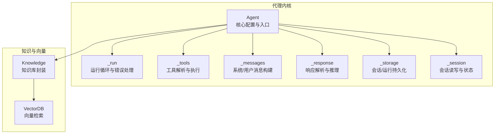
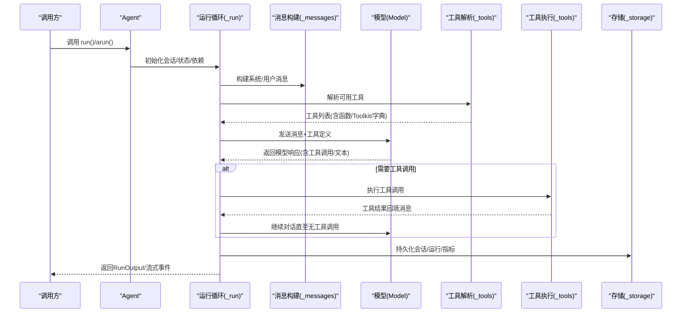
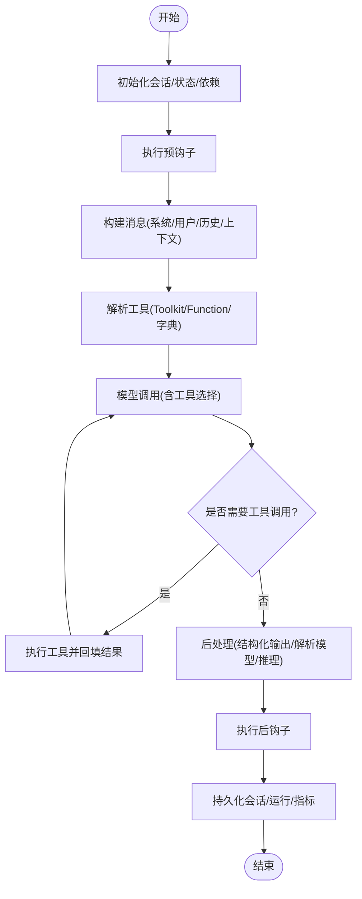
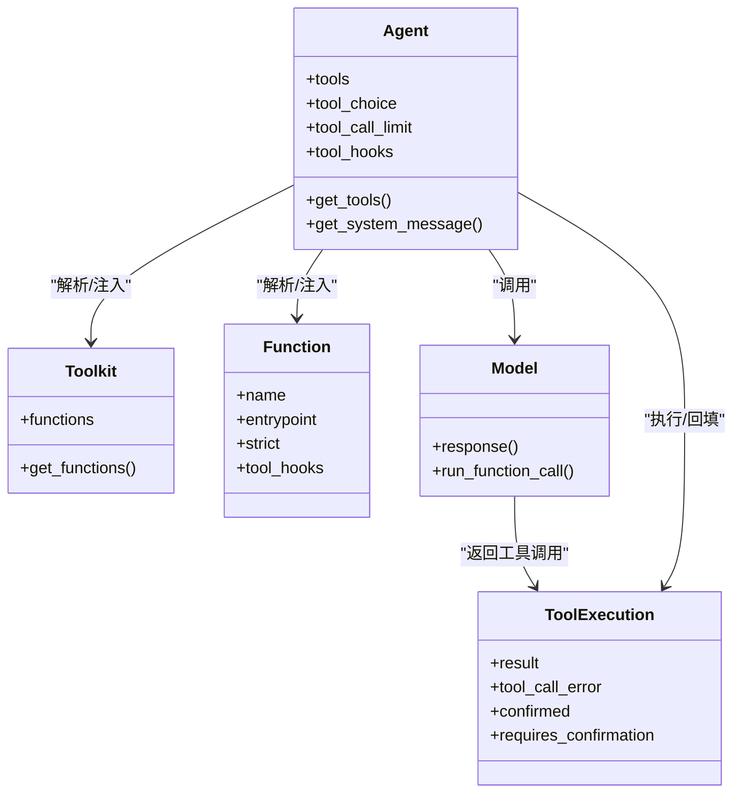
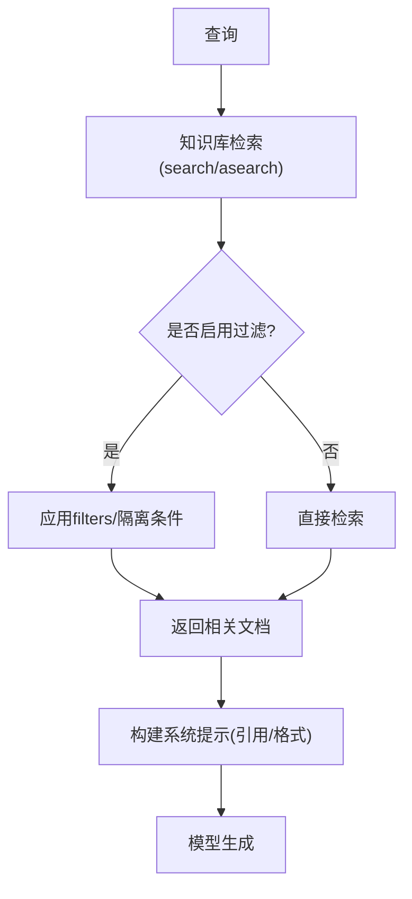
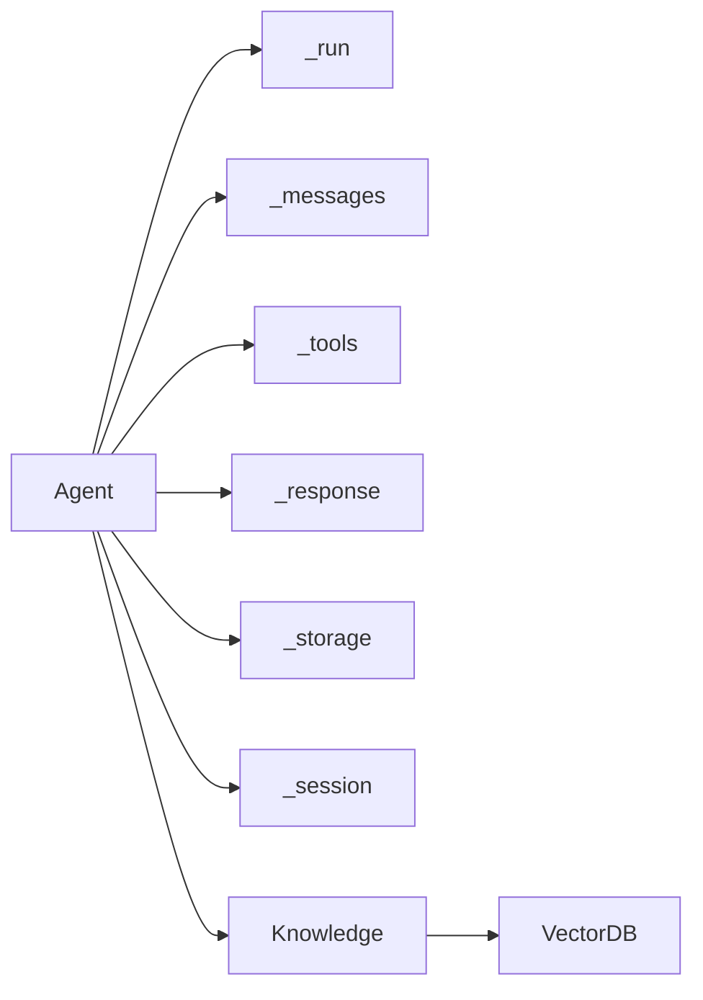

# 代理系统

<cite>
**本文档引用的文件**
- [agent.py](file://libs/agno/agno/agent/agent.py)
- [_run.py](file://libs/agno/agno/agent/_run.py)
- [_tools.py](file://libs/agno/agno/agent/_tools.py)
- [_session.py](file://libs/agno/agno/agent/_session.py)
- [_messages.py](file://libs/agno/agno/agent/_messages.py)
- [_response.py](file://libs/agno/agno/agent/_response.py)
- [_storage.py](file://libs/agno/agno/agent/_storage.py)
- [knowledge.py](file://libs/agno/agno/knowledge/knowledge.py)
</cite>

## 目录
1. [简介](#简介)
2. [项目结构](#项目结构)
3. [核心组件](#核心组件)
4. [架构总览](#架构总览)
5. [详细组件分析](#详细组件分析)
6. [依赖分析](#依赖分析)
7. [性能考虑](#性能考虑)
8. [故障排查指南](#故障排查指南)
9. [结论](#结论)
10. [附录](#附录)

## 简介
本文件面向 Agno Learn 的代理系统，系统性梳理单智能体的创建、配置与管理流程，覆盖输入输出处理、上下文构建、工具系统、会话状态与持久化、记忆与学习、知识检索增强（RAG）以及护栏、钩子、人机协作与多模态支持等高级能力。文档以代码级分析为基础，辅以图示帮助不同背景读者快速理解与落地。

## 项目结构
Agno Learn 的代理系统位于 libs/agno/agno/agent 目录下，围绕 Agent 类为核心，通过运行时模块（_run、_tools、_messages、_response、_storage、_session）协同完成一次完整的推理与执行闭环；同时集成知识库（knowledge）与向量数据库（vectordb），支撑检索增强生成与内容过滤。

**图表来源**
- [agent.py:67-706](file://libs/agno/agno/agent/agent.py#L67-L706)
- [_run.py:323-706](file://libs/agno/agno/agent/_run.py#L323-L706)
- [_tools.py:105-337](file://libs/agno/agno/agent/_tools.py#L105-L337)
- [_messages.py:106-450](file://libs/agno/agno/agent/_messages.py#L106-L450)
- [_response.py:70-340](file://libs/agno/agno/agent/_response.py#L70-L340)
- [_storage.py:280-403](file://libs/agno/agno/agent/_storage.py#L280-L403)
- [_session.py:46-144](file://libs/agno/agno/agent/_session.py#L46-L144)
- [knowledge.py:40-800](file://libs/agno/agno/knowledge/knowledge.py#L40-L800)

**章节来源**
- [agent.py:67-706](file://libs/agno/agno/agent/agent.py#L67-L706)
- [_run.py:323-706](file://libs/agno/agno/agent/_run.py#L323-L706)
- [_tools.py:105-337](file://libs/agno/agno/agent/_tools.py#L105-L337)
- [_messages.py:106-450](file://libs/agno/agno/agent/_messages.py#L106-L450)
- [_response.py:70-340](file://libs/agno/agno/agent/_response.py#L70-L340)
- [_storage.py:280-403](file://libs/agno/agno/agent/_storage.py#L280-L403)
- [_session.py:46-144](file://libs/agno/agno/agent/_session.py#L46-L144)
- [knowledge.py:40-800](file://libs/agno/agno/knowledge/knowledge.py#L40-L800)

## 核心组件
- Agent：代理配置中心，统一管理模型、工具、上下文、记忆、知识、学习、文化、会话、钩子、推理、流式与事件等。
- 运行时模块：负责运行循环、工具解析与执行、消息构建、响应解析与推理、会话与持久化、事件与指标。
- 知识系统：封装内容入库、异步加载、向量检索、过滤与隔离策略，支持 RAG 与传统检索。
- 多模态与媒体：支持图片、音频、视频、文件的收集与传递，可选择是否发送给模型或仅用于工具。

**章节来源**
- [agent.py:67-706](file://libs/agno/agno/agent/agent.py#L67-L706)
- [_run.py:323-706](file://libs/agno/agno/agent/_run.py#L323-L706)
- [_tools.py:105-337](file://libs/agno/agno/agent/_tools.py#L105-L337)
- [_messages.py:106-450](file://libs/agno/agno/agent/_messages.py#L106-L450)
- [_response.py:70-340](file://libs/agno/agno/agent/_response.py#L70-L340)
- [_storage.py:280-403](file://libs/agno/agno/agent/_storage.py#L280-L403)
- [_session.py:46-144](file://libs/agno/agno/agent/_session.py#L46-L144)
- [knowledge.py:40-800](file://libs/agno/agno/knowledge/knowledge.py#L40-L800)

## 架构总览
下图展示一次典型运行从 Agent 入口到工具执行与结果回填的消息流与职责划分。

**图表来源**
- [agent.py:363-706](file://libs/agno/agno/agent/agent.py#L363-L706)
- [_run.py:323-706](file://libs/agno/agno/agent/_run.py#L323-L706)
- [_messages.py:106-450](file://libs/agno/agno/agent/_messages.py#L106-L450)
- [_tools.py:105-337](file://libs/agno/agno/agent/_tools.py#L105-L337)
- [_storage.py:280-403](file://libs/agno/agno/agent/_storage.py#L280-L403)

**章节来源**
- [agent.py:363-706](file://libs/agno/agno/agent/agent.py#L363-L706)
- [_run.py:323-706](file://libs/agno/agno/agent/_run.py#L323-L706)
- [_messages.py:106-450](file://libs/agno/agno/agent/_messages.py#L106-L450)
- [_tools.py:105-337](file://libs/agno/agno/agent/_tools.py#L105-L337)
- [_storage.py:280-403](file://libs/agno/agno/agent/_storage.py#L280-L403)

## 详细组件分析

### 1) 代理创建与生命周期管理
- 创建与初始化
  - 支持直接传入模型、名称、ID、默认用户/会话ID、会话状态、缓存策略等。
  - 提供 set_id、initialize_agent、add_tool/set_tools、clear_callable_cache/aclear_callable_cache 等便捷接口。
- 生命周期阶段
  - 会话初始化与读取：read_or_create_session/aread_or_create_session，支持缓存与引入 introduction。
  - 运行循环：_run/_run_stream，包含重试、取消、钩子、推理、响应解析、后台任务（记忆/文化/学习）、会话摘要、持久化。
  - 事件与指标：事件过滤、跳过、存储；会话指标累加。
- 取消与清理
  - 支持同步/异步取消，清理跟踪与连接。

**图表来源**
- [_run.py:323-706](file://libs/agno/agno/agent/_run.py#L323-L706)
- [_messages.py:106-450](file://libs/agno/agno/agent/_messages.py#L106-L450)
- [_tools.py:105-337](file://libs/agno/agno/agent/_tools.py#L105-L337)
- [_storage.py:280-403](file://libs/agno/agno/agent/_storage.py#L280-L403)

**章节来源**
- [agent.py:363-706](file://libs/agno/agno/agent/agent.py#L363-L706)
- [_run.py:323-706](file://libs/agno/agno/agent/_run.py#L323-L706)
- [_storage.py:280-403](file://libs/agno/agno/agent/_storage.py#L280-L403)

### 2) 输入输出处理与类型安全
- 输入校验
  - 支持 input_schema（Pydantic）进行输入校验，触发 InputCheckError。
- 输出结构化
  - output_schema 或 output_model（可选）对主模型输出进行二次整形。
  - parser_model（可选）对主模型输出进行解析与清洗。
  - parse_response 控制是否将模型输出转为结构化对象。
  - structured_outputs/use_json_mode 控制原生结构化输出或 JSON 模式提示。
- 流式与事件
  - stream/stream_events 控制模型与工具调用的事件流式输出。
  - store_events/events_to_skip 控制事件存储与过滤。
- 媒体与存储
  - store_media/store_tool_messages/store_history_messages 控制媒体与工具消息的存储策略。

**章节来源**
- [agent.py:281-304](file://libs/agno/agno/agent/agent.py#L281-L304)
- [_response.py:364-526](file://libs/agno/agno/agent/_response.py#L364-L526)
- [_run.py:323-706](file://libs/agno/agno/agent/_run.py#L323-L706)

### 3) 上下文管理与 Few-shot 学习
- 系统消息构建
  - 支持字符串/可调用/Message 形式的 system_message。
  - 自动拼接描述、角色、指令、附加信息（时间/地点/名称）、工具说明、技能、记忆、文化、会话摘要、学习上下文、知识检索说明、模型特定系统消息。
  - resolve_in_context 支持在上下文中解析 session_state/dependencies/metadata。
- 用户消息与额外输入
  - user_message_role/build_user_context 控制用户消息构建。
  - additional_input 支持 Few-shot 示例与额外上下文注入。
- 历史与会话
  - add_history_to_context/num_history_runs/num_history_messages/max_tool_calls_from_history 控制历史消息与工具调用的纳入策略。
  - add_session_summary_to_context 与 session_summary_manager 控制会话摘要注入。

**章节来源**
- [_messages.py:106-450](file://libs/agno/agno/agent/_messages.py#L106-L450)
- [agent.py:227-280](file://libs/agno/agno/agent/agent.py#L227-L280)

### 4) 工具系统与组合
- 工具来源
  - tools 支持 Toolkit、Function、可调用函数、字典（内置工具）；支持可调用工厂与缓存键。
  - 默认工具：读历史、搜索知识、更新知识、读工具调用历史、会话状态更新、记忆/文化/学习工具等。
- 工具解析与严格模式
  - parse_tools 将 Toolkit/Function 转换为模型可用的函数定义，支持 strict 模式（原生结构化输出）。
  - tool_choice/tool_call_limit 控制工具选择与调用上限。
- 工具执行
  - run_tool/arun_tool 执行工具调用，支持事件流、审计审批、外部执行与用户输入。
  - handle_tool_call_updates 统一处理确认、外部执行、用户输入、反馈等场景。
- 钩子与装饰器
  - tool_hooks 在工具周围作为中间件执行。
  - @approval 装饰器与审计审批联动。

**图表来源**
- [_tools.py:105-337](file://libs/agno/agno/agent/_tools.py#L105-L337)
- [_run.py:622-754](file://libs/agno/agno/agent/_run.py#L622-L754)

**章节来源**
- [_tools.py:105-337](file://libs/agno/agno/agent/_tools.py#L105-L337)
- [_run.py:622-754](file://libs/agno/agno/agent/_run.py#L622-L754)

### 5) 会话状态管理与持久化
- 会话读写
  - get_session/aset_session/save_session/delete_session 提供同步/异步读写与删除。
  - read_or_create_session/aread_or_create_session 支持 introduction 注入与缓存。
- 状态与指标
  - load_session_state 支持与运行参数合并优先级。
  - update_metadata/update_session_metrics 累积会话指标。
- 名称与摘要
  - set_session_name/生成名称、get_session_summary/aget_session_summary。

**章节来源**
- [_session.py:75-144](file://libs/agno/agno/agent/_session.py#L75-L144)
- [_storage.py:122-194](file://libs/agno/agno/agent/_storage.py#L122-L194)
- [_storage.py:202-278](file://libs/agno/agno/agent/_storage.py#L202-L278)

### 6) 记忆与学习
- 记忆管理
  - enable_agentic_memory/add_memories_to_context 控制记忆工具与上下文注入。
  - update_memory_on_run 控制运行后更新用户记忆。
- 学习能力
  - learning/enable_user_memories/add_learnings_to_context 控制学习机器与上下文注入。
  - _learning_machine 属性延迟初始化，支持异步学习工具与上下文构建。

**章节来源**
- [agent.py:111-122](file://libs/agno/agno/agent/agent.py#L111-L122)
- [agent.py:256-261](file://libs/agno/agno/agent/agent.py#L256-L261)
- [_messages.py:388-408](file://libs/agno/agno/agent/_messages.py#L388-L408)

### 7) 知识管理与 RAG
- 知识库封装
  - Knowledge 支持插入（单条/批量/异步）、异步加载、向量检索、内容管理、过滤与隔离。
  - isolate_vector_search 支持多知识实例共享向量库时的隔离。
- 检索与过滤
  - search/asearch 支持 max_results/filters/search_type。
  - get_valid_filters/aget_valid_filters 动态发现有效过滤键。
- 与代理集成
  - agent.search_knowledge 控制是否启用知识搜索工具。
  - knowledge_filters/enable_agentic_knowledge_filters 控制过滤策略。
  - references_format 控制引用格式（JSON/YAML）。

**图表来源**
- [knowledge.py:507-590](file://libs/agno/agno/knowledge/knowledge.py#L507-L590)
- [_messages.py:409-424](file://libs/agno/agno/agent/_messages.py#L409-L424)

**章节来源**
- [knowledge.py:40-800](file://libs/agno/agno/knowledge/knowledge.py#L40-L800)
- [agent.py:137-151](file://libs/agno/agno/agent/agent.py#L137-L151)
- [_messages.py:409-424](file://libs/agno/agno/agent/_messages.py#L409-L424)

### 8) 护栏、钩子与人机协作
- 护栏
  - BaseGuardrail/预置 OpenAI Moderation/Prompt Injection/PII 检测等。
- 钩子
  - pre_hooks/post_hooks 支持同步/异步执行，可作为后台任务运行。
  - 工具钩子 tool_hooks 对工具调用前后进行拦截。
- 人机协作
  - get_user_input/ask_user 工具与 handle_user_input_update/handle_ask_user_tool_update。
  - 外部执行工具 handle_external_execution_update。
  - 审计审批 create_audit_approval/await acreate_audit_approval。

**章节来源**
- [agent.py:176-182](file://libs/agno/agno/agent/agent.py#L176-L182)
- [_tools.py:511-586](file://libs/agno/agno/agent/_tools.py#L511-L586)
- [_run.py:192-281](file://libs/agno/agno/agent/_run.py#L192-L281)

### 9) 多模态支持
- 媒体收集与传递
  - collect_joint_* 收集图片/音频/视频/文件，按需注入工具函数参数。
  - send_media_to_model 控制是否将媒体发送给模型。
  - store_media 控制媒体存储。
- 工具侧媒体
  - 工具函数可声明 images/videos/audios/files 参数以接收媒体。

**章节来源**
- [_tools.py:480-503](file://libs/agno/agno/agent/_tools.py#L480-L503)
- [agent.py:204-210](file://libs/agno/agno/agent/agent.py#L204-L210)

## 依赖分析
- 组件耦合
  - Agent 通过模块化依赖（_run/_tools/_messages/_response/_storage/_session）解耦运行、消息、工具、存储与会话。
  - 知识系统与向量库通过协议接口解耦，便于替换实现。
- 外部依赖
  - 数据库（BaseDb/AsyncBaseDb）、模型（Model）、事件与指标（RunOutput/SessionMetrics）、工具（Toolkit/Function）、媒体（Image/Audio/Video/File）等。
- 循环依赖
  - 未见直接循环导入；模块间通过函数调用与类型检查避免强耦合。

**图表来源**
- [agent.py:23-64](file://libs/agno/agno/agent/agent.py#L23-L64)
- [knowledge.py:40-800](file://libs/agno/agno/knowledge/knowledge.py#L40-L800)

**章节来源**
- [agent.py:23-64](file://libs/agno/agno/agent/agent.py#L23-L64)
- [knowledge.py:40-800](file://libs/agno/agno/knowledge/knowledge.py#L40-L800)

## 性能考虑
- 缓存与复用
  - cache_session 缓存会话，减少数据库访问。
  - cache_callables/callable_*_cache_key 缓存可调用工厂结果。
- 异步与并发
  - 异步数据库与异步工具执行路径，后台线程池处理记忆/文化/学习提取。
- 上下文压缩
  - compress_tool_results 与 CompressionManager 减少上下文长度。
- 指标与可观测
  - 会话指标累加与事件存储，便于定位性能瓶颈。

[本节为通用建议，不直接分析具体文件]

## 故障排查指南
- 输入/输出校验失败
  - 触发 InputCheckError/OutputCheckError，检查 input_schema/output_schema/parse_response 配置。
- 工具异步使用
  - 同步 Agent 使用异步工具会抛出异常，需改用异步运行接口。
- 会话/数据库问题
  - get_session/aread_session 抛错时检查 db 初始化与权限。
- 取消与重试
  - 运行被取消或异常重试时，检查 retries/delay/exponential_backoff 与取消信号。
- 事件与存储
  - store_events 与 events_to_skip 配置不当可能导致事件缺失，按需调整。

**章节来源**
- [_run.py:323-706](file://libs/agno/agno/agent/_run.py#L323-L706)
- [_tools.py:46-103](file://libs/agno/agno/agent/_tools.py#L46-L103)
- [_storage.py:122-194](file://libs/agno/agno/agent/_storage.py#L122-L194)

## 结论
Agno Learn 的代理系统以 Agent 为核心，通过模块化的运行、消息、工具、存储与会话管理，结合知识库与向量检索，提供了从输入校验、上下文构建、工具执行到输出解析与持久化的完整链路。其设计强调可插拔、可扩展与可观测，适合在复杂业务场景中实现稳健的智能体编排与工程化落地。

[本节为总结性内容，不直接分析具体文件]

## 附录
- 最佳实践
  - 明确输入/输出模式，优先使用 Pydantic schema 与 structured_outputs。
  - 合理设置历史与上下文长度，必要时开启 compress_tool_results。
  - 使用工具钩子与护栏系统保障安全性与可控性。
  - 利用会话摘要与学习上下文提升长期交互质量。
  - 多模态场景下谨慎控制媒体传递与存储成本。

[本节为通用建议，不直接分析具体文件]