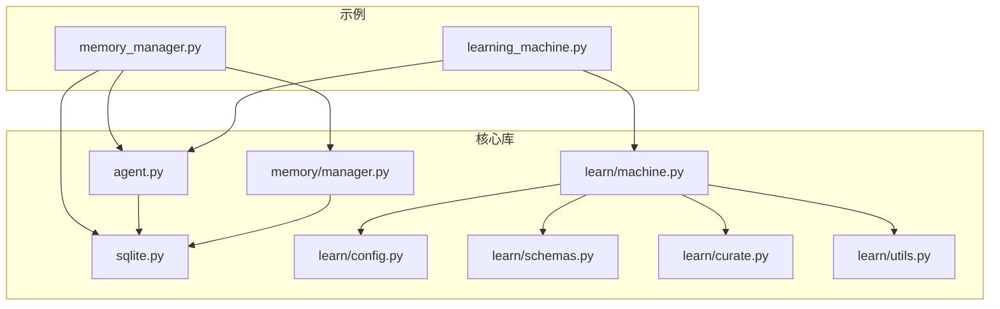
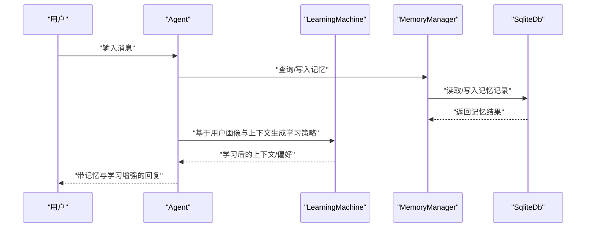
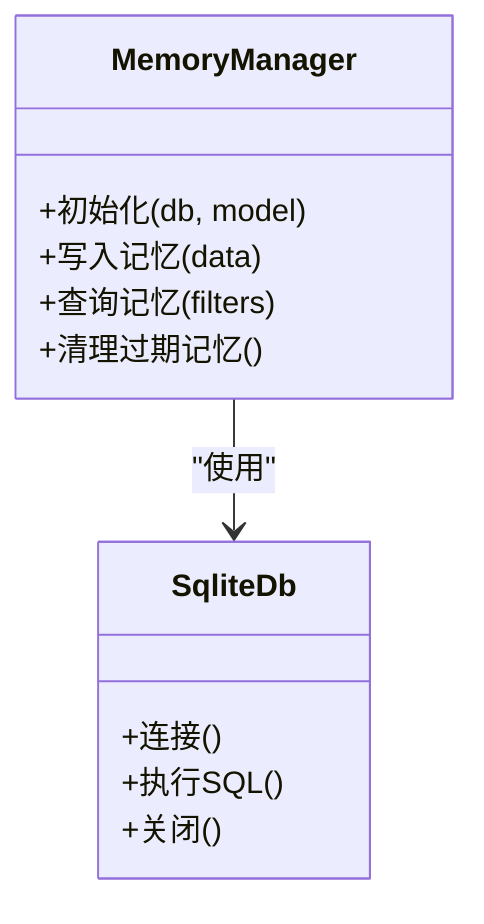
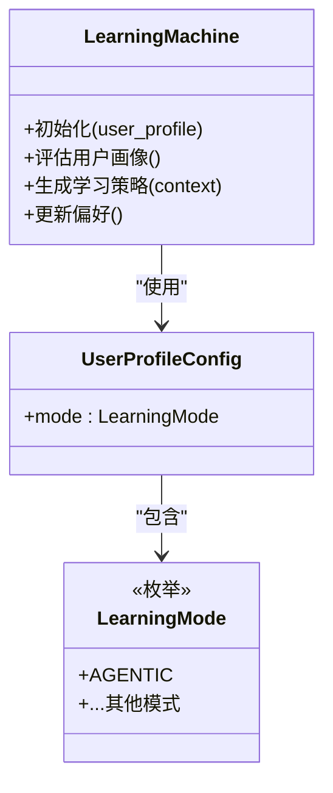
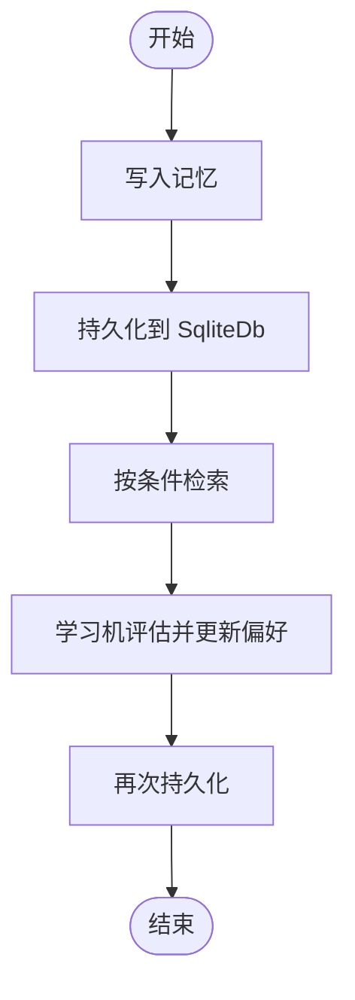
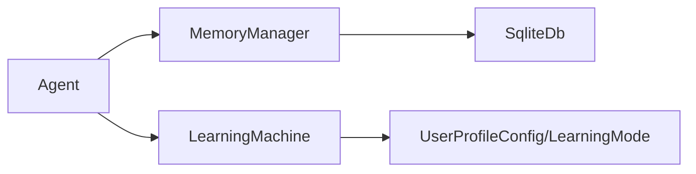

# 内存和学习

<cite>
**本文引用的文件**
- [memory_manager.py](file://cookbook/02_agents/06_memory_and_learning/memory_manager.py)
- [learning_machine.py](file://cookbook/02_agents/06_memory_and_learning/learning_machine.py)
- [machine.py](file://libs/agno/agno/learn/machine.py)
- [config.py](file://libs/agno/agno/learn/config.py)
- [schemas.py](file://libs/agno/agno/learn/schemas.py)
- [curate.py](file://libs/agno/agno/learn/curate.py)
- [utils.py](file://libs/agno/agno/learn/utils.py)
- [memory.py](file://libs/agno/agno/memory/memory.py)
- [manager.py](file://libs/agno/agno/memory/manager.py)
- [sqlite.py](file://libs/agno/agno/db/sqlite.py)
- [agent.py](file://libs/agno/agno/agent/agent.py)
</cite>

## 目录
1. [简介](#简介)
2. [项目结构](#项目结构)
3. [核心组件](#核心组件)
4. [架构总览](#架构总览)
5. [详细组件分析](#详细组件分析)
6. [依赖关系分析](#依赖关系分析)
7. [性能考虑](#性能考虑)
8. [故障排查指南](#故障排查指南)
9. [结论](#结论)
10. [附录](#附录)

## 简介
本文件围绕代理的“内存与学习”能力，系统性梳理并说明以下主题：
- 内存管理器的实现原理、使用方法与最佳实践（策略、清理、持久化、检索）
- 自学习功能的配置与使用（学习模式、频率、效果评估）
- 记忆持久化（存储、检索、更新）
- 用户画像与实体记忆的构建方法
- 学习算法选择与调优建议
- 性能优化与监控实践

目标是帮助读者在不深入源码细节的前提下，快速掌握如何在实际场景中正确配置与使用这些能力。

## 项目结构
本项目的“内存与学习”示例位于 cookbook 的“02_agents/06_memory_and_learning”目录下，分别提供了内存管理器与学习机的最小可运行示例；核心实现位于 libs/agno/agno 下的 learn 与 memory 子模块，并通过数据库层（如 SQLite）实现持久化。

图示来源
- [memory_manager.py:1-48](file://cookbook/02_agents/06_memory_and_learning/memory_manager.py#L1-L48)
- [learning_machine.py:1-50](file://cookbook/02_agents/06_memory_and_learning/learning_machine.py#L1-L50)
- [agent.py](file://libs/agno/agno/agent/agent.py)
- [sqlite.py](file://libs/agno/agno/db/sqlite.py)
- [manager.py](file://libs/agno/agno/memory/manager.py)
- [machine.py](file://libs/agno/agno/learn/machine.py)
- [config.py](file://libs/agno/agno/learn/config.py)
- [schemas.py](file://libs/agno/agno/learn/schemas.py)
- [curate.py](file://libs/agno/agno/learn/curate.py)
- [utils.py](file://libs/agno/agno/learn/utils.py)

章节来源
- [memory_manager.py:1-48](file://cookbook/02_agents/06_memory_and_learning/memory_manager.py#L1-L48)
- [learning_machine.py:1-50](file://cookbook/02_agents/06_memory_and_learning/learning_machine.py#L1-L50)

## 核心组件
- 内存管理器：负责结构化地存储、检索与清理代理的记忆，支持跨会话持久化。
- 学习机：根据用户画像与上下文动态调整输出风格与知识利用策略，支持多种学习模式。
- 数据库层：以 SQLite 为例，提供轻量级持久化能力，便于演示与本地开发。
- 代理：作为入口，整合模型、存储、内存与学习能力，统一对外提供响应。

章节来源
- [memory_manager.py:16-29](file://cookbook/02_agents/06_memory_and_learning/memory_manager.py#L16-L29)
- [learning_machine.py:21-29](file://cookbook/02_agents/06_memory_and_learning/learning_machine.py#L21-L29)
- [sqlite.py](file://libs/agno/agno/db/sqlite.py)
- [agent.py](file://libs/agno/agno/agent/agent.py)

## 架构总览
下面的序列图展示了从用户输入到代理返回响应的关键流程，以及内存与学习在其中的参与点。

图示来源
- [memory_manager.py:34-47](file://cookbook/02_agents/06_memory_and_learning/memory_manager.py#L34-L47)
- [learning_machine.py:34-49](file://cookbook/02_agents/06_memory_and_learning/learning_machine.py#L34-L49)
- [agent.py](file://libs/agno/agno/agent/agent.py)
- [manager.py](file://libs/agno/agno/memory/manager.py)
- [sqlite.py](file://libs/agno/agno/db/sqlite.py)

## 详细组件分析

### 内存管理器（MemoryManager）
- 职责
  - 结构化记忆的增删改查
  - 与数据库交互完成持久化
  - 支持跨会话的“智能记忆”（agentic memory），使代理能记住用户偏好、历史对话等
- 关键行为
  - 初始化时绑定数据库与模型，用于后续的记忆整理与检索
  - 在会话中自动或显式地写入/读取记忆
  - 可配合清理策略定期回收无用记忆，避免膨胀
- 使用要点
  - 将 MemoryManager 注入 Agent，开启 enable_agentic_memory
  - 示例中使用 SQLite 作为后端，适合演示与本地开发

图示来源
- [memory_manager.py:18-29](file://cookbook/02_agents/06_memory_and_learning/memory_manager.py#L18-L29)
- [manager.py](file://libs/agno/agno/memory/manager.py)
- [sqlite.py](file://libs/agno/agno/db/sqlite.py)

章节来源
- [memory_manager.py:16-47](file://cookbook/02_agents/06_memory_and_learning/memory_manager.py#L16-L47)

### 学习机（LearningMachine）
- 职责
  - 基于用户画像与上下文，动态调整输出风格与知识利用策略
  - 支持不同学习模式（如 AGENTIC），以适配不同业务场景
- 关键行为
  - 初始化时传入用户画像配置（含学习模式）
  - 在每次交互中评估并更新用户偏好，形成“学习效果”
- 使用要点
  - 将 LearningMachine 注入 Agent 的 learning 字段
  - 示例中使用 SQLite 作为后端，便于演示

图示来源
- [learning_machine.py:21-29](file://cookbook/02_agents/06_memory_and_learning/learning_machine.py#L21-L29)
- [machine.py](file://libs/agno/agno/learn/machine.py)
- [config.py](file://libs/agno/agno/learn/config.py)

章节来源
- [learning_machine.py:16-49](file://cookbook/02_agents/06_memory_and_learning/learning_machine.py#L16-L49)

### 记忆持久化（存储、检索、更新）
- 存储
  - 使用 SqliteDb 进行轻量级持久化，适合本地演示与小规模部署
  - MemoryManager 负责将结构化记忆写入数据库
- 检索
  - 通过 MemoryManager 查询过滤条件下的记忆条目
  - 支持按用户、会话、时间窗口等维度筛选
- 更新
  - 学习机在交互过程中根据反馈更新用户画像与偏好
  - MemoryManager 提供写入接口，确保变更持久化

图示来源
- [memory_manager.py:34-47](file://cookbook/02_agents/06_memory_and_learning/memory_manager.py#L34-L47)
- [sqlite.py](file://libs/agno/agno/db/sqlite.py)
- [machine.py](file://libs/agno/agno/learn/machine.py)

章节来源
- [memory_manager.py:16-47](file://cookbook/02_agents/06_memory_and_learning/memory_manager.py#L16-L47)
- [sqlite.py](file://libs/agno/agno/db/sqlite.py)

### 用户画像与实体记忆构建
- 用户画像
  - 由 UserProfileConfig 驱动，包含学习模式等关键参数
  - 学习机根据交互内容动态完善画像要素（如偏好、风格、领域）
- 实体记忆
  - 通过 MemoryManager 将“人/组织/任务”等实体的相关信息结构化存储
  - 支持跨会话检索与更新，提升上下文一致性与个性化

章节来源
- [config.py](file://libs/agno/agno/learn/config.py)
- [schemas.py](file://libs/agno/agno/learn/schemas.py)
- [curate.py](file://libs/agno/agno/learn/curate.py)

### 学习算法选择与调优
- 模式选择
  - AGENTIC 模式强调“以代理为中心”的学习，适合需要持续优化对话体验的场景
  - 其他模式可根据业务需求扩展（需参考具体实现）
- 调优方向
  - 学习频率：控制每次交互是否触发学习更新
  - 学习强度：影响偏好更新幅度与持久化周期
  - 评估指标：结合准确率、一致性、用户满意度等进行效果评估
- 工具与辅助
  - utils 与 curate 提供清洗、归一化与偏好整理的通用能力

章节来源
- [machine.py](file://libs/agno/agno/learn/machine.py)
- [config.py](file://libs/agno/agno/learn/config.py)
- [utils.py](file://libs/agno/agno/learn/utils.py)
- [curate.py](file://libs/agno/agno/learn/curate.py)

## 依赖关系分析
- 组件耦合
  - Agent 依赖 MemoryManager 与 LearningMachine 完成记忆与学习
  - MemoryManager 依赖 SqliteDb 完成持久化
  - LearningMachine 依赖配置与模式定义
- 外部依赖
  - 数据库：SQLite（示例），可替换为其他数据库适配器
  - 模型：示例中使用 OpenAIResponses，可替换为其他模型适配器

图示来源
- [agent.py](file://libs/agno/agno/agent/agent.py)
- [manager.py](file://libs/agno/agno/memory/manager.py)
- [machine.py](file://libs/agno/agno/learn/machine.py)
- [config.py](file://libs/agno/agno/learn/config.py)
- [sqlite.py](file://libs/agno/agno/db/sqlite.py)

章节来源
- [agent.py](file://libs/agno/agno/agent/agent.py)
- [manager.py](file://libs/agno/agno/memory/manager.py)
- [machine.py](file://libs/agno/agno/learn/machine.py)
- [config.py](file://libs/agno/agno/learn/config.py)
- [sqlite.py](file://libs/agno/agno/db/sqlite.py)

## 性能考虑
- 内存与存储
  - 使用合适的索引与查询条件，避免全表扫描
  - 控制单次检索的记忆数量，必要时分页或限制时间窗口
- 学习频率
  - 频繁学习会增加写入开销，应结合业务场景设置合理的更新节奏
- 模型与数据库
  - 对于高并发场景，优先选择高性能数据库与连接池
  - 将学习机的计算逻辑尽量异步化，减少对主流程的影响
- 清理策略
  - 定期清理过期或低价值记忆，防止数据库膨胀
  - 基于访问频率与时效性制定清理规则

## 故障排查指南
- 记忆未生效
  - 检查是否启用 agentic memory，确认 MemoryManager 已注入
  - 核对数据库连接与权限
- 学习未生效
  - 确认 LearningMachine 的用户画像配置正确
  - 检查学习模式是否匹配当前场景
- 性能问题
  - 分析查询路径与索引使用情况
  - 评估学习频率与批量更新策略

章节来源
- [memory_manager.py:18-29](file://cookbook/02_agents/06_memory_and_learning/memory_manager.py#L18-L29)
- [learning_machine.py:21-29](file://cookbook/02_agents/06_memory_and_learning/learning_machine.py#L21-L29)

## 结论
通过将 MemoryManager 与 LearningMachine 有机集成到 Agent 中，可以在本地或小规模环境中快速实现“有记忆、可学习”的智能代理。结合合适的数据库与清理策略，可在保证性能的同时持续优化用户体验。建议在生产环境中进一步扩展数据库适配器、引入监控与评估体系，并根据业务场景细化学习模式与更新策略。

## 附录
- 快速上手
  - 内存示例：参考 memory_manager.py 的最小可运行脚本
  - 学习示例：参考 learning_machine.py 的最小可运行脚本
- 进一步阅读
  - learn 与 memory 子模块的实现细节与扩展点

章节来源
- [memory_manager.py:34-47](file://cookbook/02_agents/06_memory_and_learning/memory_manager.py#L34-L47)
- [learning_machine.py:34-49](file://cookbook/02_agents/06_memory_and_learning/learning_machine.py#L34-L49)