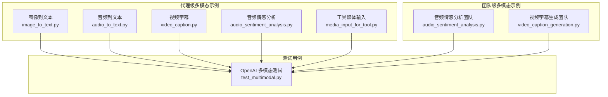
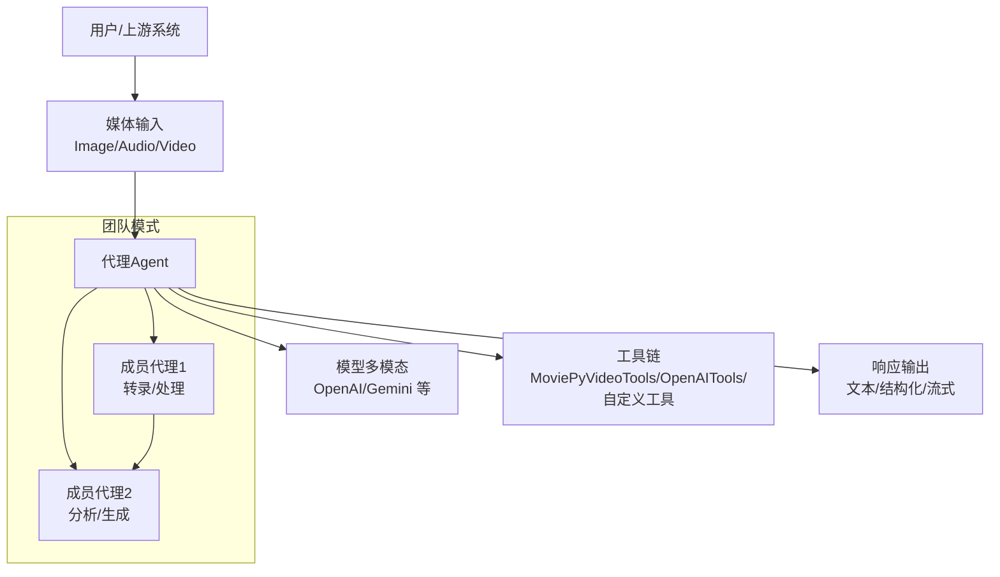
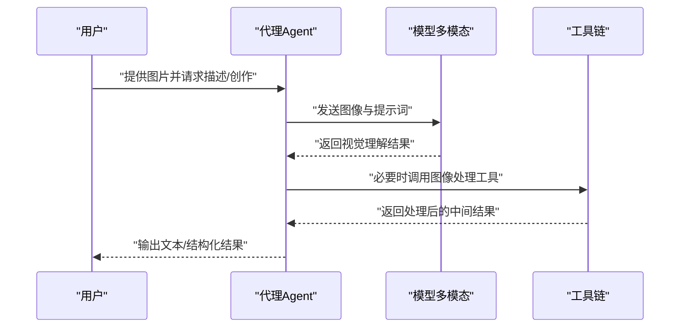
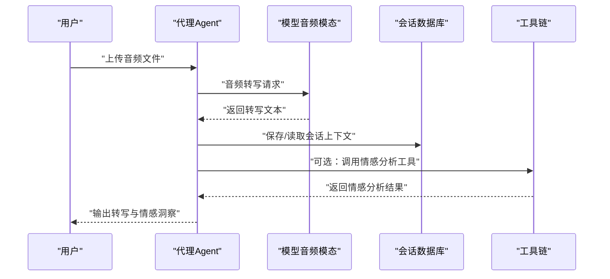
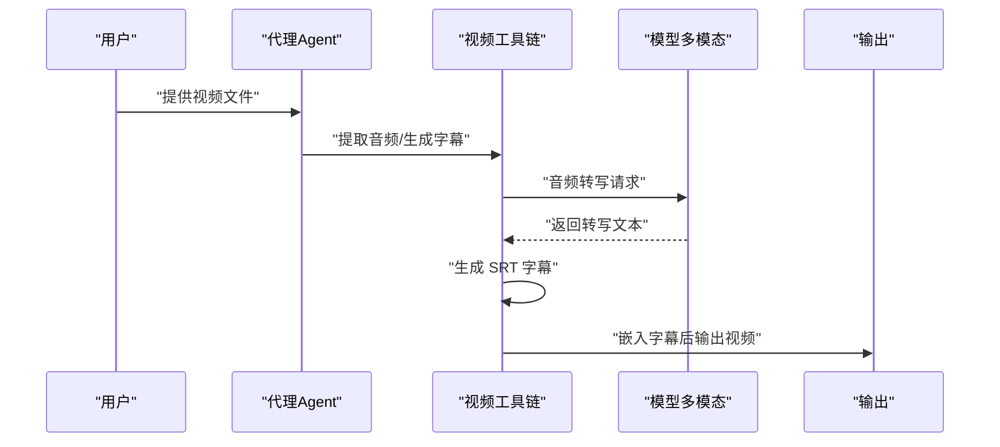
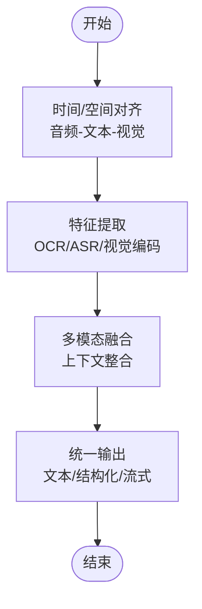
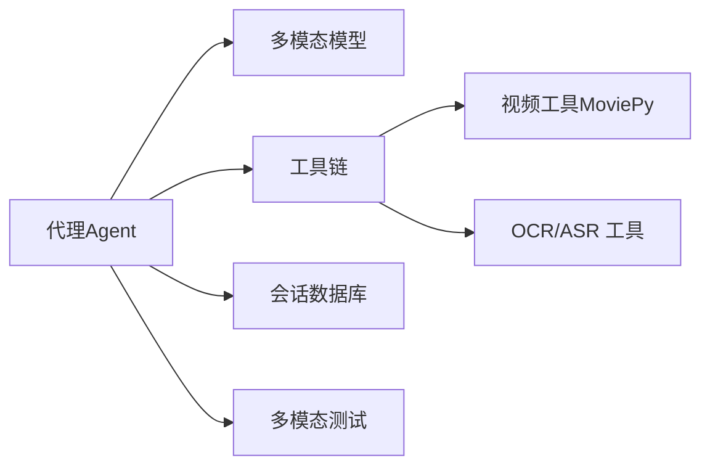

# 多模态支持

<cite>
**本文引用的文件**
- [cookbook/02_agents/12_multimodal/README.md](file://cookbook/02_agents/12_multimodal/README.md)
- [cookbook/03_teams/19_multimodal/README.md](file://cookbook/03_teams/19_multimodal/README.md)
- [cookbook/02_agents/12_multimodal/image_to_text.py](file://cookbook/02_agents/12_multimodal/image_to_text.py)
- [cookbook/02_agents/12_multimodal/audio_to_text.py](file://cookbook/02_agents/12_multimodal/audio_to_text.py)
- [cookbook/02_agents/12_multimodal/video_caption.py](file://cookbook/02_agents/12_multimodal/video_caption.py)
- [cookbook/02_agents/12_multimodal/audio_sentiment_analysis.py](file://cookbook/02_agents/12_multimodal/audio_sentiment_analysis.py)
- [cookbook/02_agents/12_multimodal/media_input_for_tool.py](file://cookbook/02_agents/12_multimodal/media_input_for_tool.py)
- [cookbook/03_teams/19_multimodal/audio_sentiment_analysis.py](file://cookbook/03_teams/19_multimodal/audio_sentiment_analysis.py)
- [cookbook/03_teams/19_multimodal/video_caption_generation.py](file://cookbook/03_teams/19_multimodal/video_caption_generation.py)
- [libs/agno/tests/integration/models/openai/chat/test_multimodal.py](file://libs/agno/tests/integration/models/openai/chat/test_multimodal.py)
</cite>

## 目录
1. [简介](#简介)
2. [项目结构](#项目结构)
3. [核心组件](#核心组件)
4. [架构总览](#架构总览)
5. [详细组件分析](#详细组件分析)
6. [依赖关系分析](#依赖关系分析)
7. [性能考虑](#性能考虑)
8. [故障排查指南](#故障排查指南)
9. [结论](#结论)
10. [附录](#附录)

## 简介
本文件面向“代理的多模态支持系统”，围绕图像处理（输入、分析、生成）、音频分析（输入、语音识别、情感分析）、视频理解（输入、内容分析、字幕生成）以及多模态数据融合（对齐、特征提取、结果整合）进行系统化说明，并结合仓库中的示例脚本与测试用例，给出可操作的实践路径与最佳实践建议。

## 项目结构
本项目在“食谱（cookbook）”中提供了多模态能力的示例与团队协作模式：
- 代理级多模态示例：位于 cookbook/02_agents/12_multimodal，涵盖图像到文本、音频到文本、视频字幕、音频情感分析、工具媒体输入等。
- 团队级多模态示例：位于 cookbook/03_teams/19_multimodal，展示基于团队的音频情感分析流水线与视频字幕生成流水线。
- 测试用例：libs/agno/tests/integration/models/openai/chat/test_multimodal.py 展示了 OpenAI 模型在图像与音频输入上的多模态能力验证。

图表来源
- [cookbook/02_agents/12_multimodal/README.md:1-24](file://cookbook/02_agents/12_multimodal/README.md#L1-L24)
- [cookbook/03_teams/19_multimodal/README.md:1-21](file://cookbook/03_teams/19_multimodal/README.md#L1-L21)
- [libs/agno/tests/integration/models/openai/chat/test_multimodal.py:1-82](file://libs/agno/tests/integration/models/openai/chat/test_multimodal.py#L1-L82)

章节来源
- [cookbook/02_agents/12_multimodal/README.md:1-24](file://cookbook/02_agents/12_multimodal/README.md#L1-L24)
- [cookbook/03_teams/19_multimodal/README.md:1-21](file://cookbook/03_teams/19_multimodal/README.md#L1-L21)

## 核心组件
- 图像处理组件
  - 输入：通过 Image 媒体对象传入图片路径或二进制内容。
  - 分析：调用支持多模态的模型（如 OpenAI Responses）执行视觉理解任务。
  - 生成：结合工具链与模型指令，完成图像到文本、图像到图像、图像到结构化输出等任务。
- 音频分析组件
  - 输入：通过 Audio 媒体对象传入音频 URL 或二进制内容。
  - 语音识别：使用具备音频模态的模型（如 OpenAI Chat 的音频预览模型）进行转写。
  - 情感分析：结合会话记忆与工具，对对话双方进行情感与情绪分析。
- 视频理解组件
  - 输入：视频文件作为媒体输入。
  - 内容分析：拆解视频为音频，再进行转写与时间轴标注。
  - 字幕生成：生成 SRT 字幕并嵌入到视频中。
- 多模态融合
  - 数据对齐：以时间戳或帧序列为基准对齐音频、文本与视觉特征。
  - 特征提取：利用模型内置多模态编码器或外部工具抽取跨模态特征。
  - 结果整合：将各模态的分析结果合并为统一的上下文或结构化输出。

章节来源
- [cookbook/02_agents/12_multimodal/image_to_text.py:1-32](file://cookbook/02_agents/12_multimodal/image_to_text.py#L1-L32)
- [cookbook/02_agents/12_multimodal/audio_to_text.py:1-37](file://cookbook/02_agents/12_multimodal/audio_to_text.py#L1-L37)
- [cookbook/02_agents/12_multimodal/video_caption.py:1-47](file://cookbook/02_agents/12_multimodal/video_caption.py#L1-L47)
- [cookbook/02_agents/12_multimodal/audio_sentiment_analysis.py:1-47](file://cookbook/02_agents/12_multimodal/audio_sentiment_analysis.py#L1-L47)
- [cookbook/02_agents/12_multimodal/media_input_for_tool.py:1-122](file://cookbook/02_agents/12_multimodal/media_input_for_tool.py#L1-L122)
- [cookbook/03_teams/19_multimodal/audio_sentiment_analysis.py:1-77](file://cookbook/03_teams/19_multimodal/audio_sentiment_analysis.py#L1-L77)
- [cookbook/03_teams/19_multimodal/video_caption_generation.py:1-65](file://cookbook/03_teams/19_multimodal/video_caption_generation.py#L1-L65)
- [libs/agno/tests/integration/models/openai/chat/test_multimodal.py:1-82](file://libs/agno/tests/integration/models/openai/chat/test_multimodal.py#L1-L82)

## 架构总览
下图展示了从“媒体输入”到“多模态处理与输出”的整体流程，覆盖代理与团队两种形态：

图表来源
- [cookbook/02_agents/12_multimodal/image_to_text.py:17-31](file://cookbook/02_agents/12_multimodal/image_to_text.py#L17-L31)
- [cookbook/02_agents/12_multimodal/audio_to_text.py:16-36](file://cookbook/02_agents/12_multimodal/audio_to_text.py#L16-L36)
- [cookbook/02_agents/12_multimodal/video_caption.py:22-38](file://cookbook/02_agents/12_multimodal/video_caption.py#L22-L38)
- [cookbook/03_teams/19_multimodal/video_caption_generation.py:17-56](file://cookbook/03_teams/19_multimodal/video_caption_generation.py#L17-L56)

## 详细组件分析

### 图像处理（输入、分析、生成）
- 输入方式
  - 使用 Image 对象传入本地文件路径或二进制内容。
- 分析与生成
  - 调用多模态模型（如 OpenAI Responses）执行视觉理解任务。
  - 可结合工具链完成图像到文本、图像到图像、图像到结构化输出等。
- 示例参考
  - [图像到文本示例:17-31](file://cookbook/02_agents/12_multimodal/image_to_text.py#L17-L31)

图表来源
- [cookbook/02_agents/12_multimodal/image_to_text.py:17-31](file://cookbook/02_agents/12_multimodal/image_to_text.py#L17-L31)

章节来源
- [cookbook/02_agents/12_multimodal/image_to_text.py:1-32](file://cookbook/02_agents/12_multimodal/image_to_text.py#L1-L32)

### 音频分析（输入、语音识别、情感分析）
- 输入与转写
  - 使用 Audio 对象传入音频 URL 或二进制内容。
  - 选择具备音频模态的模型（如 OpenAI Chat 的音频预览模型）进行转写。
- 情感分析
  - 利用会话数据库与多轮上下文，对对话双方分别进行情感与情绪分析。
- 示例参考
  - [音频到文本示例:16-36](file://cookbook/02_agents/12_multimodal/audio_to_text.py#L16-L36)
  - [音频情感分析示例（代理）:17-46](file://cookbook/02_agents/12_multimodal/audio_sentiment_analysis.py#L17-L46)
  - [音频情感分析示例（团队）:18-76](file://cookbook/03_teams/19_multimodal/audio_sentiment_analysis.py#L18-L76)

图表来源
- [cookbook/02_agents/12_multimodal/audio_to_text.py:16-36](file://cookbook/02_agents/12_multimodal/audio_to_text.py#L16-L36)
- [cookbook/02_agents/12_multimodal/audio_sentiment_analysis.py:17-46](file://cookbook/02_agents/12_multimodal/audio_sentiment_analysis.py#L17-L46)
- [cookbook/03_teams/19_multimodal/audio_sentiment_analysis.py:18-76](file://cookbook/03_teams/19_multimodal/audio_sentiment_analysis.py#L18-L76)

章节来源
- [cookbook/02_agents/12_multimodal/audio_to_text.py:1-37](file://cookbook/02_agents/12_multimodal/audio_to_text.py#L1-L37)
- [cookbook/02_agents/12_multimodal/audio_sentiment_analysis.py:1-47](file://cookbook/02_agents/12_multimodal/audio_sentiment_analysis.py#L1-L47)
- [cookbook/03_teams/19_multimodal/audio_sentiment_analysis.py:1-77](file://cookbook/03_teams/19_multimodal/audio_sentiment_analysis.py#L1-L77)

### 视频理解（输入、内容分析、字幕生成）
- 输入与处理
  - 使用视频文件作为输入，借助视频工具链提取音频、进行转写与字幕生成。
- 内容分析与字幕生成
  - 生成 SRT 字幕并嵌入到视频中，形成带字幕的最终视频。
- 示例参考
  - [视频字幕示例（代理）:13-38](file://cookbook/02_agents/12_multimodal/video_caption.py#L13-L38)
  - [视频字幕生成示例（团队）:17-56](file://cookbook/03_teams/19_multimodal/video_caption_generation.py#L17-L56)

图表来源
- [cookbook/02_agents/12_multimodal/video_caption.py:13-38](file://cookbook/02_agents/12_multimodal/video_caption.py#L13-L38)
- [cookbook/03_teams/19_multimodal/video_caption_generation.py:17-56](file://cookbook/03_teams/19_multimodal/video_caption_generation.py#L17-L56)

章节来源
- [cookbook/02_agents/12_multimodal/video_caption.py:1-47](file://cookbook/02_agents/12_multimodal/video_caption.py#L1-L47)
- [cookbook/03_teams/19_multimodal/video_caption_generation.py:1-65](file://cookbook/03_teams/19_multimodal/video_caption_generation.py#L1-L65)

### 多模态数据融合（对齐、特征提取、结果整合）
- 数据对齐
  - 以时间戳对齐音频片段与视觉帧；以语义相似度对齐文本与图像区域。
- 特征提取
  - 使用模型内置多模态编码器或外部 OCR/ASR 工具抽取跨模态特征。
- 结果整合
  - 将各模态的分析结果合并为统一的上下文或结构化输出，便于后续推理与决策。
- 示例参考
  - [工具媒体输入示例（文件/媒体访问）:20-71](file://cookbook/02_agents/12_multimodal/media_input_for_tool.py#L20-L71)

图表来源
- [cookbook/02_agents/12_multimodal/media_input_for_tool.py:20-71](file://cookbook/02_agents/12_multimodal/media_input_for_tool.py#L20-L71)

章节来源
- [cookbook/02_agents/12_multimodal/media_input_for_tool.py:1-122](file://cookbook/02_agents/12_multimodal/media_input_for_tool.py#L1-L122)

## 依赖关系分析
- 组件耦合
  - 代理与模型之间通过媒体对象解耦；工具链作为可插拔模块增强处理能力。
  - 团队模式下，成员代理职责清晰，通过统一的指令与上下文进行协作。
- 外部依赖
  - OpenAI、Google Gemini 等多模态模型服务。
  - MoviePy 等视频处理工具库。
- 测试验证
  - OpenAI 多模态测试覆盖图像与音频输入，确保令牌统计与返回内容的正确性。

图表来源
- [libs/agno/tests/integration/models/openai/chat/test_multimodal.py:19-82](file://libs/agno/tests/integration/models/openai/chat/test_multimodal.py#L19-L82)
- [cookbook/02_agents/12_multimodal/video_caption.py:10-27](file://cookbook/02_agents/12_multimodal/video_caption.py#L10-L27)
- [cookbook/02_agents/12_multimodal/audio_sentiment_analysis.py:10-25](file://cookbook/02_agents/12_multimodal/audio_sentiment_analysis.py#L10-L25)

章节来源
- [libs/agno/tests/integration/models/openai/chat/test_multimodal.py:1-82](file://libs/agno/tests/integration/models/openai/chat/test_multimodal.py#L1-L82)

## 性能考虑
- 模型选择
  - 根据任务复杂度选择合适的多模态模型；对音频与视频任务优先选用具备相应模态能力的模型。
- 资源管理
  - 合理设置并发与批处理大小，避免内存与带宽瓶颈；对大文件采用流式处理。
- 缓存与复用
  - 对重复的转写与 OCR 结果进行缓存，减少重复计算与外部调用成本。
- 上下文压缩
  - 在长对话或多轮分析中，定期清理历史上下文，保留关键片段以控制令牌消耗。

## 故障排查指南
- 常见问题
  - 媒体格式不支持：检查输入的媒体格式与模型支持范围。
  - 网络与鉴权：确认 API 密钥与网络连通性。
  - 会话存储：检查数据库文件权限与表结构。
- 定位手段
  - 开启调试模式，查看媒体注入与工具调用日志。
  - 使用测试用例验证最小可运行场景，逐步扩大输入规模。
- 示例参考
  - [OpenAI 多模态测试（验证令牌统计与返回内容）:64-82](file://libs/agno/tests/integration/models/openai/chat/test_multimodal.py#L64-L82)

章节来源
- [libs/agno/tests/integration/models/openai/chat/test_multimodal.py:64-82](file://libs/agno/tests/integration/models/openai/chat/test_multimodal.py#L64-L82)

## 结论
本系统通过代理与团队两种形态，完整覆盖图像、音频、视频的多模态处理需求，并提供可扩展的工具链与测试验证机制。实践中应根据任务特性选择合适模型与工具，重视媒体对齐与特征融合，结合缓存与上下文压缩提升性能与稳定性。

## 附录
- 快速上手
  - 运行示例前请加载环境变量并通过 demo 环境运行示例脚本。
  - 部分示例需要额外服务（如 PostgreSQL、LanceDB、Infinity）或特定提供商的 API 密钥。
- 示例清单
  - 代理级：图像到文本、音频到文本、视频字幕、音频情感分析、工具媒体输入。
  - 团队级：音频情感分析（团队）、视频字幕生成（团队）。
- 测试清单
  - OpenAI 多模态测试：图像输入、音频字节输入、音频 URL 输入、音频令牌统计。

章节来源
- [cookbook/02_agents/12_multimodal/README.md:17-24](file://cookbook/02_agents/12_multimodal/README.md#L17-L24)
- [cookbook/03_teams/19_multimodal/README.md:5-9](file://cookbook/03_teams/19_multimodal/README.md#L5-L9)