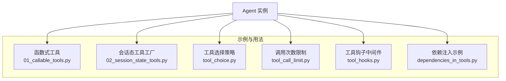
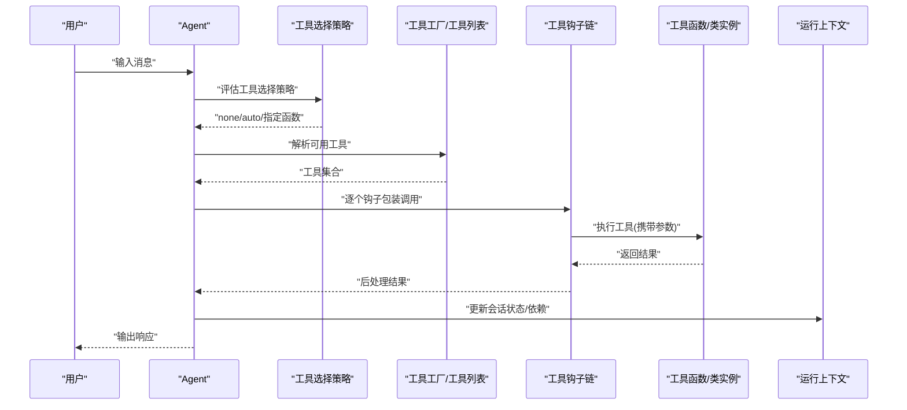
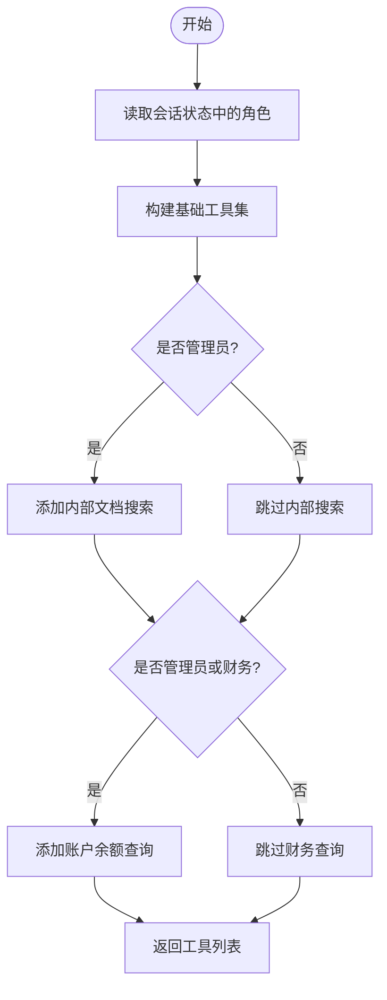
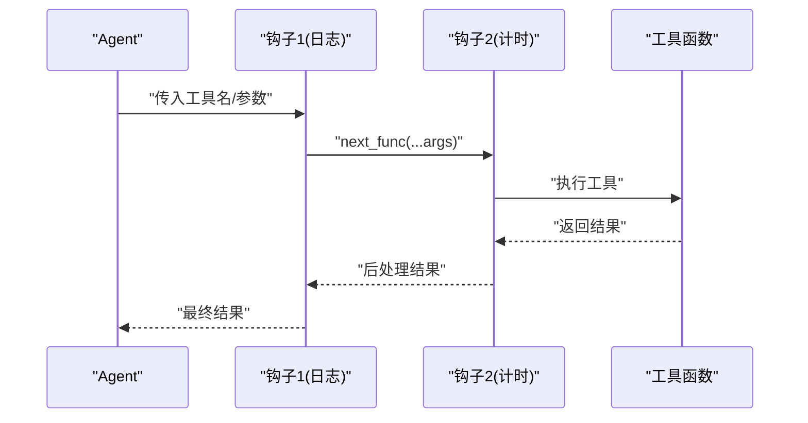
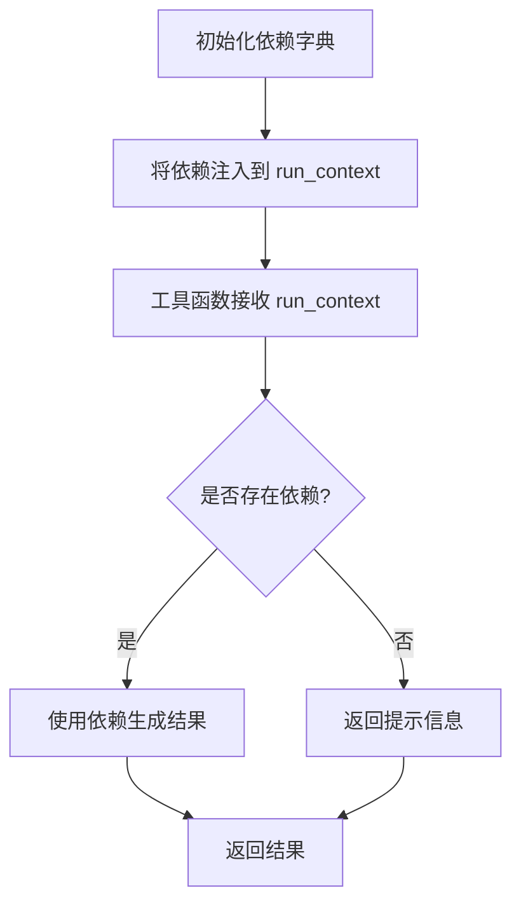
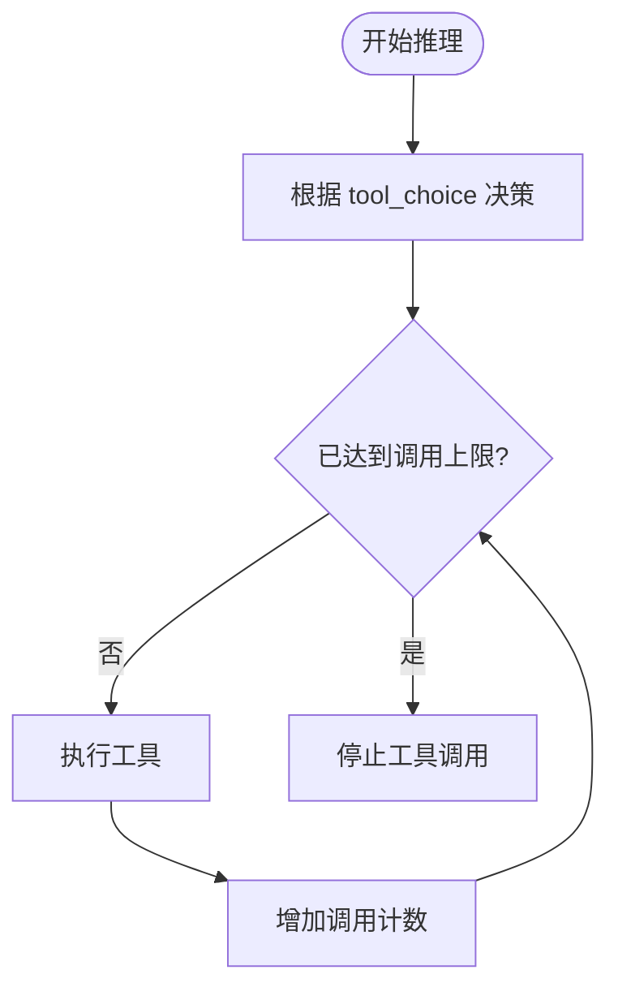
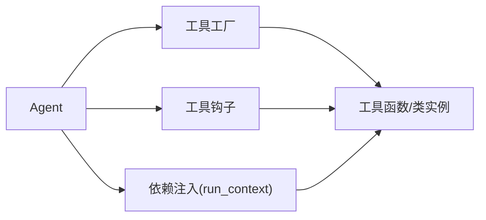

# 工具系统

<cite>
**本文引用的文件**
- [cookbook/02_agents/04_tools/01_callable_tools.py](file://cookbook/02_agents/04_tools/01_callable_tools.py)
- [cookbook/02_agents/04_tools/02_session_state_tools.py](file://cookbook/02_agents/04_tools/02_session_state_tools.py)
- [cookbook/02_agents/04_tools/tool_call_limit.py](file://cookbook/02_agents/04_tools/tool_call_limit.py)
- [cookbook/02_agents/04_tools/tool_choice.py](file://cookbook/02_agents/04_tools/tool_choice.py)
- [cookbook/02_agents/09_hooks/tool_hooks.py](file://cookbook/02_agents/09_hooks/tool_hooks.py)
- [cookbook/02_agents/15_dependencies/dependencies_in_tools.py](file://cookbook/02_agents/15_dependencies/dependencies_in_tools.py)
- [cookbook/00_quickstart/agent_with_tools.py](file://cookbook/00_quickstart/agent_with_tools.py)
- [cookbook/02_agents/10_human_in_the_loop/confirmation_required_mcp_toolkit.py](file://cookbook/02_agents/10_human_in_the_loop/confirmation_required_mcp_toolkit.py)
- [cookbook/02_agents/10_human_in_the_loop/confirmation_toolkit.py](file://cookbook/02_agents/10_human_in_the_loop/confirmation_toolkit.py)
- [cookbook/02_agents/10_human_in_the_loop/external_tool_execution.py](file://cookbook/02_agents/10_human_in_the_loop/external_tool_execution.py)
- [cookbook/02_agents/10_human_in_the_loop/mixed_external_and_regular_tools.py](file://cookbook/02_agents/10_human_in_the_loop/mixed_external_and_regular_tools.py)
- [cookbook/02_agents/12_multimodal/media_input_for_tool.py](file://cookbook/02_agents/12_multimodal/media_input_for_tool.py)
- [cookbook/02_agents/14_advanced/tool_call_compression.py](file://cookbook/02_agents/14_advanced/tool_call_compression.py)
- [cookbook/02_agents/14_advanced/tool_call_metrics.py](file://cookbook/02_agents/14_advanced/tool_call_metrics.py)
- [cookbook/02_agents/03_context_management/filter_tool_calls_from_history.py](file://cookbook/02_agents/03_context_management/filter_tool_calls_from_history.py)
- [cookbook/02_agents/04_tools/04_tools_with_literal_type_param.py](file://cookbook/02_agents/04_tools/04_tools_with_literal_type_param.py)
- [cookbook/02_agents/04_tools/03_team_callable_members.py](file://cookbook/02_agents/04_tools/03_team_callable_members.py)
- [cookbook/02_agents/04_tools/02_session_state_tools.py](file://cookbook/02_agents/04_tools/02_session_state_tools.py)
- [cookbook/02_agents/04_tools/01_callable_tools.py](file://cookbook/02_agents/04_tools/01_callable_tools.py)
- [cookbook/02_agents/04_tools/tool_call_limit.py](file://cookbook/02_agents/04_tools/tool_call_limit.py)
- [cookbook/02_agents/04_tools/tool_choice.py](file://cookbook/02_agents/04_tools/tool_choice.py)
- [cookbook/02_agents/09_hooks/tool_hooks.py](file://cookbook/02_agents/09_hooks/tool_hooks.py)
- [cookbook/02_agents/15_dependencies/dependencies_in_tools.py](file://cookbook/02_agents/15_dependencies/dependencies_in_tools.py)
</cite>

## 目录
1. [简介](#简介)
2. [项目结构](#项目结构)
3. [核心组件](#核心组件)
4. [架构总览](#架构总览)
5. [详细组件分析](#详细组件分析)
6. [依赖分析](#依赖分析)
7. [性能考虑](#性能考虑)
8. [故障排查指南](#故障排查指南)
9. [结论](#结论)
10. [附录](#附录)

## 简介
本文件系统性梳理代理工具系统的设计与实现，覆盖函数式工具的定义与使用、工具装饰器（钩子）的原理与应用、工具包管理（按角色/会话动态选择）、工具组合与链式调用、安全与权限控制、性能优化与最佳实践。文档以示例路径为主，避免直接粘贴代码，便于读者在仓库中定位到具体实现。

## 项目结构
工具系统主要分布在 cookbook 的“工具”“钩子”“依赖注入”等章节中，围绕 Agent 的 tools 参数与运行时上下文展开。核心模式包括：
- 函数式工具：普通可调用对象作为工具
- 工具工厂：根据用户/会话状态动态返回工具集合
- 钩子中间件：对每次工具调用进行前置/后置处理
- 依赖注入：通过 run_context.dependencies 向工具提供外部数据源
- 控制选项：工具选择策略、调用次数限制、人类确认与外部工具执行

**图示来源**
- [cookbook/02_agents/04_tools/01_callable_tools.py:1-94](file://cookbook/02_agents/04_tools/01_callable_tools.py#L1-L94)
- [cookbook/02_agents/04_tools/02_session_state_tools.py:1-70](file://cookbook/02_agents/04_tools/02_session_state_tools.py#L1-L70)
- [cookbook/02_agents/04_tools/tool_choice.py:1-48](file://cookbook/02_agents/04_tools/tool_choice.py#L1-L48)
- [cookbook/02_agents/04_tools/tool_call_limit.py:1-30](file://cookbook/02_agents/04_tools/tool_call_limit.py#L1-L30)
- [cookbook/02_agents/09_hooks/tool_hooks.py:1-53](file://cookbook/02_agents/09_hooks/tool_hooks.py#L1-L53)
- [cookbook/02_agents/15_dependencies/dependencies_in_tools.py:1-109](file://cookbook/02_agents/15_dependencies/dependencies_in_tools.py#L1-L109)

**章节来源**
- [cookbook/02_agents/04_tools/01_callable_tools.py:1-94](file://cookbook/02_agents/04_tools/01_callable_tools.py#L1-L94)
- [cookbook/02_agents/04_tools/02_session_state_tools.py:1-70](file://cookbook/02_agents/04_tools/02_session_state_tools.py#L1-L70)
- [cookbook/02_agents/04_tools/tool_choice.py:1-48](file://cookbook/02_agents/04_tools/tool_choice.py#L1-L48)
- [cookbook/02_agents/04_tools/tool_call_limit.py:1-30](file://cookbook/02_agents/04_tools/tool_call_limit.py#L1-L30)
- [cookbook/02_agents/09_hooks/tool_hooks.py:1-53](file://cookbook/02_agents/09_hooks/tool_hooks.py#L1-L53)
- [cookbook/02_agents/15_dependencies/dependencies_in_tools.py:1-109](file://cookbook/02_agents/15_dependencies/dependencies_in_tools.py#L1-L109)

## 核心组件
- 函数式工具：以 Python 可调用对象（函数/类实例）作为工具，支持类型注解与文档字符串，便于 LLM 理解签名与用途。
- 工具工厂：接收 run_context 或 session_state，按用户角色/会话状态动态返回工具列表；可配置缓存策略。
- 工具钩子：在工具调用前后插入中间件逻辑（如计时、日志、鉴权），形成链式调用。
- 依赖注入：通过 run_context.dependencies 将外部数据源（如用户画像、上下文信息）注入工具。
- 工具选择与限制：支持 none/auto/指定函数三种工具选择策略，以及最大工具调用次数限制。
- 人类确认与外部工具：在关键操作前要求人工确认，或委托外部系统执行工具。

**章节来源**
- [cookbook/02_agents/04_tools/01_callable_tools.py:24-55](file://cookbook/02_agents/04_tools/01_callable_tools.py#L24-L55)
- [cookbook/02_agents/04_tools/02_session_state_tools.py:29-37](file://cookbook/02_agents/04_tools/02_session_state_tools.py#L29-L37)
- [cookbook/02_agents/09_hooks/tool_hooks.py:19-31](file://cookbook/02_agents/09_hooks/tool_hooks.py#L19-L31)
- [cookbook/02_agents/15_dependencies/dependencies_in_tools.py:38-67](file://cookbook/02_agents/15_dependencies/dependencies_in_tools.py#L38-L67)
- [cookbook/02_agents/04_tools/tool_choice.py:19-38](file://cookbook/02_agents/04_tools/tool_choice.py#L19-L38)
- [cookbook/02_agents/04_tools/tool_call_limit.py:15-19](file://cookbook/02_agents/04_tools/tool_call_limit.py#L15-L19)
- [cookbook/02_agents/10_human_in_the_loop/confirmation_required_mcp_toolkit.py](file://cookbook/02_agents/10_human_in_the_loop/confirmation_required_mcp_toolkit.py)
- [cookbook/02_agents/10_human_in_the_loop/confirmation_toolkit.py](file://cookbook/02_agents/10_human_in_the_loop/confirmation_toolkit.py)
- [cookbook/02_agents/10_human_in_the_loop/external_tool_execution.py](file://cookbook/02_agents/10_human_in_the_loop/external_tool_execution.py)
- [cookbook/02_agents/10_human_in_the_loop/mixed_external_and_regular_tools.py](file://cookbook/02_agents/10_human_in_the_loop/mixed_external_and_regular_tools.py)

## 架构总览
下图展示了从 Agent 到工具调用的关键流程：Agent 解析指令，根据工具选择策略决定是否调用工具；若启用工具，按工厂/钩子/依赖注入完成调用；最后根据调用次数限制与人类确认策略终止或继续。

**图示来源**
- [cookbook/02_agents/04_tools/tool_choice.py:19-38](file://cookbook/02_agents/04_tools/tool_choice.py#L19-L38)
- [cookbook/02_agents/04_tools/01_callable_tools.py:44-55](file://cookbook/02_agents/04_tools/01_callable_tools.py#L44-L55)
- [cookbook/02_agents/09_hooks/tool_hooks.py:19-31](file://cookbook/02_agents/09_hooks/tool_hooks.py#L19-L31)
- [cookbook/02_agents/15_dependencies/dependencies_in_tools.py:38-67](file://cookbook/02_agents/15_dependencies/dependencies_in_tools.py#L38-L67)

## 详细组件分析

### 函数式工具与工厂
- 定义规范：工具函数应具备清晰的类型注解与文档字符串，便于 LLM 理解参数与返回值。
- 工厂模式：通过工具工厂按用户角色/会话状态动态返回不同工具集；可设置缓存策略以提升性能。
- 示例路径：
  - [函数式工具与工厂示例:24-55](file://cookbook/02_agents/04_tools/01_callable_tools.py#L24-L55)
  - [基于会话态的工厂示例:29-37](file://cookbook/02_agents/04_tools/02_session_state_tools.py#L29-L37)

**图示来源**
- [cookbook/02_agents/04_tools/01_callable_tools.py:44-55](file://cookbook/02_agents/04_tools/01_callable_tools.py#L44-L55)

**章节来源**
- [cookbook/02_agents/04_tools/01_callable_tools.py:24-55](file://cookbook/02_agents/04_tools/01_callable_tools.py#L24-L55)
- [cookbook/02_agents/04_tools/02_session_state_tools.py:29-37](file://cookbook/02_agents/04_tools/02_session_state_tools.py#L29-L37)

### 工具钩子（中间件）
- 原理：每个工具调用被包裹在钩子链中，钩子可修改参数、记录日志、测量耗时、进行鉴权等。
- 使用技巧：钩子顺序即执行顺序，先注册的先执行；可在钩子中抛出异常中断后续执行。
- 示例路径：
  - [工具钩子示例:19-31](file://cookbook/02_agents/09_hooks/tool_hooks.py#L19-L31)

**图示来源**
- [cookbook/02_agents/09_hooks/tool_hooks.py:19-31](file://cookbook/02_agents/09_hooks/tool_hooks.py#L19-L31)

**章节来源**
- [cookbook/02_agents/09_hooks/tool_hooks.py:19-31](file://cookbook/02_agents/09_hooks/tool_hooks.py#L19-L31)

### 依赖注入与运行上下文
- 机制：通过 run_context.dependencies 向工具注入外部数据源（如用户画像、当前时间等）。
- 处理方式：工具函数可声明 run_context 参数以获取依赖；工具内部根据依赖存在性决定行为。
- 示例路径：
  - [依赖注入示例:38-67](file://cookbook/02_agents/15_dependencies/dependencies_in_tools.py#L38-L67)

**图示来源**
- [cookbook/02_agents/15_dependencies/dependencies_in_tools.py:38-67](file://cookbook/02_agents/15_dependencies/dependencies_in_tools.py#L38-L67)

**章节来源**
- [cookbook/02_agents/15_dependencies/dependencies_in_tools.py:15-67](file://cookbook/02_agents/15_dependencies/dependencies_in_tools.py#L15-L67)

### 工具选择与调用限制
- 工具选择策略：none（不使用工具）、auto（自动选择）、指定函数（强制使用某工具）。
- 调用限制：通过 tool_call_limit 控制单次推理最多调用工具的次数。
- 示例路径：
  - [工具选择策略示例:19-38](file://cookbook/02_agents/04_tools/tool_choice.py#L19-38)
  - [调用次数限制示例:15-19](file://cookbook/02_agents/04_tools/tool_call_limit.py#L15-19)

**图示来源**
- [cookbook/02_agents/04_tools/tool_call_limit.py:15-19](file://cookbook/02_agents/04_tools/tool_call_limit.py#L15-L19)
- [cookbook/02_agents/04_tools/tool_choice.py:19-38](file://cookbook/02_agents/04_tools/tool_choice.py#L19-L38)

**章节来源**
- [cookbook/02_agents/04_tools/tool_choice.py:19-38](file://cookbook/02_agents/04_tools/tool_choice.py#L19-L38)
- [cookbook/02_agents/04_tools/tool_call_limit.py:15-19](file://cookbook/02_agents/04_tools/tool_call_limit.py#L15-L19)

### 人类确认与外部工具执行
- 人类确认：在关键工具调用前要求人工确认，确保安全可控。
- 外部工具：将工具执行委托给外部系统，适用于高风险或复杂任务。
- 示例路径：
  - [确认式 MCP 工具示例](file://cookbook/02_agents/10_human_in_the_loop/confirmation_required_mcp_toolkit.py)
  - [确认式工具示例](file://cookbook/02_agents/10_human_in_the_loop/confirmation_toolkit.py)
  - [外部工具执行示例](file://cookbook/02_agents/10_human_in_the_loop/external_tool_execution.py)
  - [混合外部与常规工具示例](file://cookbook/02_agents/10_human_in_the_loop/mixed_external_and_regular_tools.py)

**章节来源**
- [cookbook/02_agents/10_human_in_the_loop/confirmation_required_mcp_toolkit.py](file://cookbook/02_agents/10_human_in_the_loop/confirmation_required_mcp_toolkit.py)
- [cookbook/02_agents/10_human_in_the_loop/confirmation_toolkit.py](file://cookbook/02_agents/10_human_in_the_loop/confirmation_toolkit.py)
- [cookbook/02_agents/10_human_in_the_loop/external_tool_execution.py](file://cookbook/02_agents/10_human_in_the_loop/external_tool_execution.py)
- [cookbook/02_agents/10_human_in_the_loop/mixed_external_and_regular_tools.py](file://cookbook/02_agents/10_human_in_the_loop/mixed_external_and_regular_tools.py)

### 多模态输入与工具
- 场景：工具可接收多模态输入（图像/音频/视频），用于更丰富的交互。
- 示例路径：
  - [多模态输入工具示例](file://cookbook/02_agents/12_multimodal/media_input_for_tool.py)

**章节来源**
- [cookbook/02_agents/12_multimodal/media_input_for_tool.py](file://cookbook/02_agents/12_multimodal/media_input_for_tool.py)

### 工具压缩与指标
- 工具调用压缩：减少冗余调用，合并相似请求。
- 指标采集：统计工具调用次数、耗时、成功率等，辅助优化。
- 示例路径：
  - [工具调用压缩示例](file://cookbook/02_agents/14_advanced/tool_call_compression.py)
  - [工具调用指标示例](file://cookbook/02_agents/14_advanced/tool_call_metrics.py)

**章节来源**
- [cookbook/02_agents/14_advanced/tool_call_compression.py](file://cookbook/02_agents/14_advanced/tool_call_compression.py)
- [cookbook/02_agents/14_advanced/tool_call_metrics.py](file://cookbook/02_agents/14_advanced/tool_call_metrics.py)

### 上下文过滤与类型参数
- 过滤历史中的工具调用：仅保留必要上下文，避免上下文污染。
- 字面量类型参数：通过 Literal 类型约束参数取值，提升安全性与可维护性。
- 示例路径：
  - [从历史过滤工具调用示例](file://cookbook/02_agents/03_context_management/filter_tool_calls_from_history.py)
  - [字面量类型参数示例](file://cookbook/02_agents/04_tools/04_tools_with_literal_type_param.py)

**章节来源**
- [cookbook/02_agents/03_context_management/filter_tool_calls_from_history.py](file://cookbook/02_agents/03_context_management/filter_tool_calls_from_history.py)
- [cookbook/02_agents/04_tools/04_tools_with_literal_type_param.py](file://cookbook/02_agents/04_tools/04_tools_with_literal_type_param.py)

### 团队成员工具
- 团队协作：多个可调用成员共享工具集，按角色/权限分发任务。
- 示例路径：
  - [团队可调用成员示例](file://cookbook/02_agents/04_tools/03_team_callable_members.py)

**章节来源**
- [cookbook/02_agents/04_tools/03_team_callable_members.py](file://cookbook/02_agents/04_tools/03_team_callable_members.py)

## 依赖分析
- 组件耦合：工具工厂与会话状态强耦合；钩子与工具解耦；依赖注入通过 run_context 松耦合。
- 外部依赖：示例中使用第三方工具包（如 YFinanceTools、WebSearchTools），需注意版本与许可证。
- 循环依赖：示例未见循环导入；建议在自定义工具中避免相互引用。

**图示来源**
- [cookbook/02_agents/04_tools/01_callable_tools.py:44-55](file://cookbook/02_agents/04_tools/01_callable_tools.py#L44-L55)
- [cookbook/02_agents/09_hooks/tool_hooks.py:19-31](file://cookbook/02_agents/09_hooks/tool_hooks.py#L19-L31)
- [cookbook/02_agents/15_dependencies/dependencies_in_tools.py:38-67](file://cookbook/02_agents/15_dependencies/dependencies_in_tools.py#L38-L67)

**章节来源**
- [cookbook/02_agents/04_tools/01_callable_tools.py:44-55](file://cookbook/02_agents/04_tools/01_callable_tools.py#L44-L55)
- [cookbook/02_agents/09_hooks/tool_hooks.py:19-31](file://cookbook/02_agents/09_hooks/tool_hooks.py#L19-L31)
- [cookbook/02_agents/15_dependencies/dependencies_in_tools.py:38-67](file://cookbook/02_agents/15_dependencies/dependencies_in_tools.py#L38-L67)

## 性能考虑
- 缓存策略：工具工厂默认按 user_id/session_id 缓存工具集，降低重复构造成本；当需要实时变更时可关闭缓存。
- 钩子开销：钩子链越长，调用延迟越高；建议仅在必要时启用计时/日志钩子。
- 依赖懒加载：将昂贵的依赖（如数据库连接）延迟到首次使用，减少启动时间。
- 调用限制：合理设置 tool_call_limit，避免过度调用导致资源浪费。
- 压缩与去重：对相似工具调用进行压缩，减少重复计算与网络请求。

[本节为通用指导，无需特定文件来源]

## 故障排查指南
- 工具未生效
  - 检查工具选择策略是否为 none；确认工具工厂返回了正确工具集。
  - 参考：[工具选择策略示例:19-38](file://cookbook/02_agents/04_tools/tool_choice.py#L19-38)
- 工具调用次数超限
  - 检查 tool_call_limit 设置；确认工具链中是否出现循环调用。
  - 参考：[调用次数限制示例:15-19](file://cookbook/02_agents/04_tools/tool_call_limit.py#L15-19)
- 钩子未执行
  - 确认钩子顺序与参数传递；检查钩子是否正确调用 next_func。
  - 参考：[工具钩子示例:19-31](file://cookbook/02_agents/09_hooks/tool_hooks.py#L19-31)
- 依赖未注入
  - 确认 run_context.dependencies 是否正确传入；工具函数是否声明了 run_context 参数。
  - 参考：[依赖注入示例:38-67](file://cookbook/02_agents/15_dependencies/dependencies_in_tools.py#L38-67)
- 人类确认阻塞
  - 检查确认流程是否正确触发；确认外部系统可达且返回预期结果。
  - 参考：[确认式工具示例](file://cookbook/02_agents/10_human_in_the_loop/confirmation_toolkit.py)

**章节来源**
- [cookbook/02_agents/04_tools/tool_choice.py:19-38](file://cookbook/02_agents/04_tools/tool_choice.py#L19-L38)
- [cookbook/02_agents/04_tools/tool_call_limit.py:15-19](file://cookbook/02_agents/04_tools/tool_call_limit.py#L15-L19)
- [cookbook/02_agents/09_hooks/tool_hooks.py:19-31](file://cookbook/02_agents/09_hooks/tool_hooks.py#L19-L31)
- [cookbook/02_agents/15_dependencies/dependencies_in_tools.py:38-67](file://cookbook/02_agents/15_dependencies/dependencies_in_tools.py#L38-L67)
- [cookbook/02_agents/10_human_in_the_loop/confirmation_toolkit.py](file://cookbook/02_agents/10_human_in_the_loop/confirmation_toolkit.py)

## 结论
工具系统通过函数式工具、工厂化装配、钩子中间件、依赖注入与控制策略，实现了灵活、可观测、可扩展的代理能力。结合人类确认与外部执行，进一步提升了安全性与实用性。建议在实际项目中遵循缓存策略、最小钩子原则与严格的依赖管理，持续优化工具调用链路与性能指标。

[本节为总结性内容，无需特定文件来源]

## 附录
- 快速上手示例
  - [快速开始：带工具的代理](file://cookbook/00_quickstart/agent_with_tools.py)
- 更多工具示例
  - [函数式工具与工厂:24-55](file://cookbook/02_agents/04_tools/01_callable_tools.py#L24-L55)
  - [会话态工具工厂:29-37](file://cookbook/02_agents/04_tools/02_session_state_tools.py#L29-L37)
  - [工具选择策略:19-38](file://cookbook/02_agents/04_tools/tool_choice.py#L19-38)
  - [调用次数限制:15-19](file://cookbook/02_agents/04_tools/tool_call_limit.py#L15-19)
  - [工具钩子中间件:19-31](file://cookbook/02_agents/09_hooks/tool_hooks.py#L19-31)
  - [依赖注入示例:38-67](file://cookbook/02_agents/15_dependencies/dependencies_in_tools.py#L38-67)
  - [人类确认与外部工具](file://cookbook/02_agents/10_human_in_the_loop/confirmation_toolkit.py)
  - [多模态输入工具](file://cookbook/02_agents/12_multimodal/media_input_for_tool.py)
  - [工具压缩与指标](file://cookbook/02_agents/14_advanced/tool_call_compression.py)
  - [上下文过滤与类型参数](file://cookbook/02_agents/03_context_management/filter_tool_calls_from_history.py)