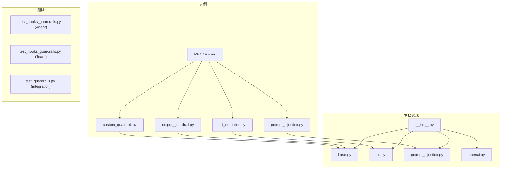
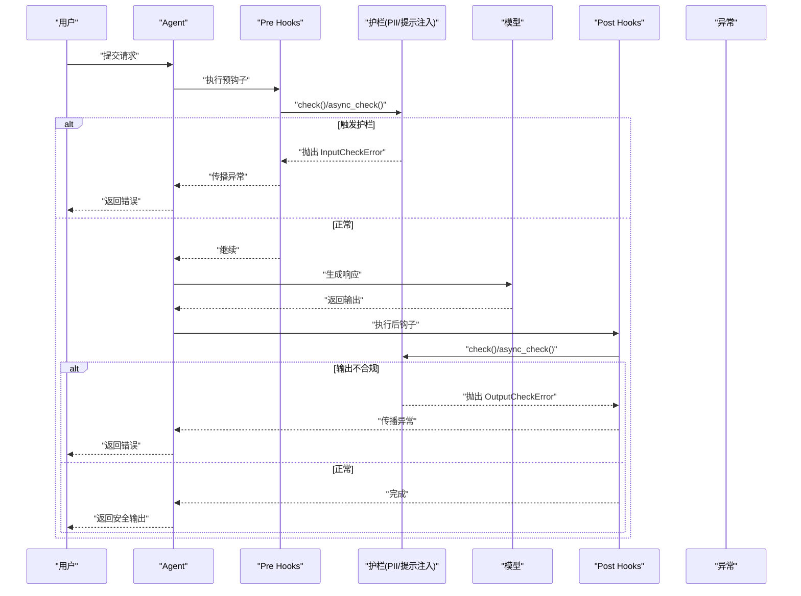
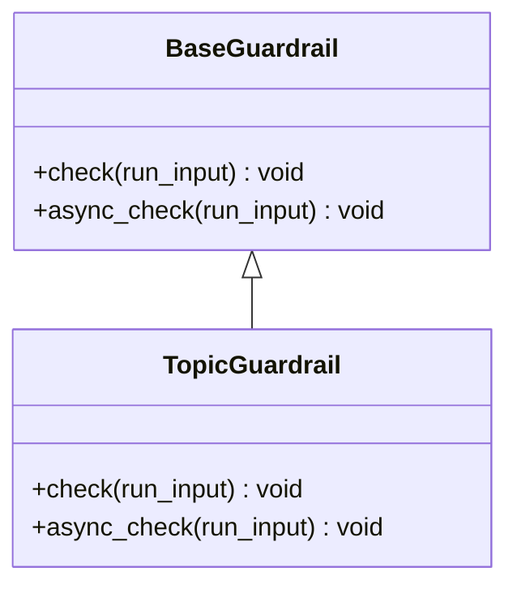
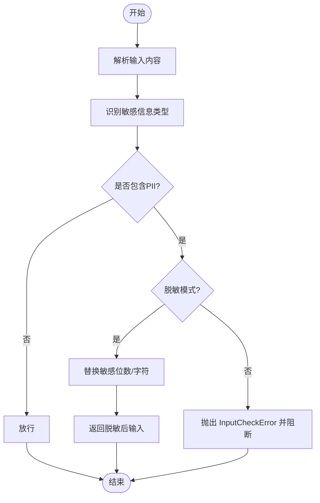
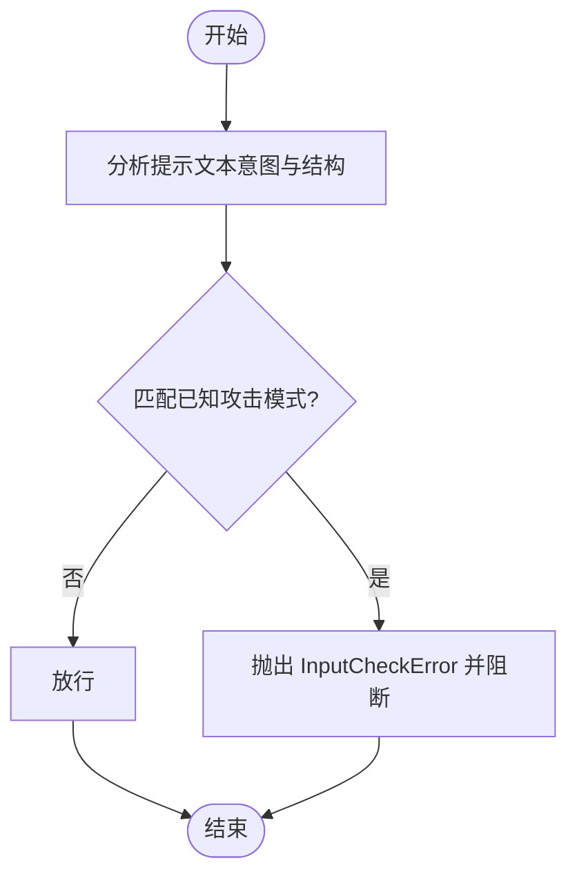
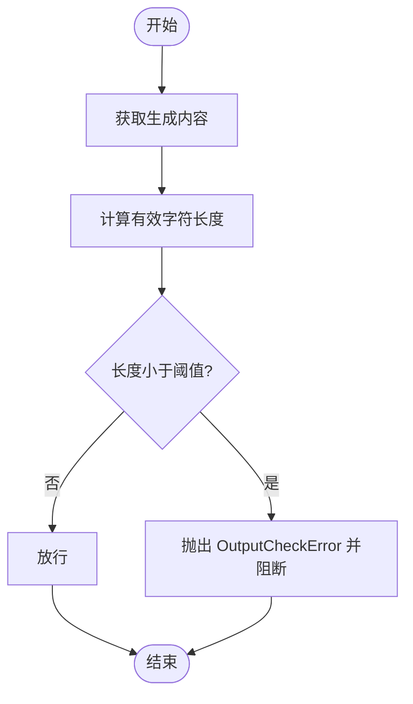
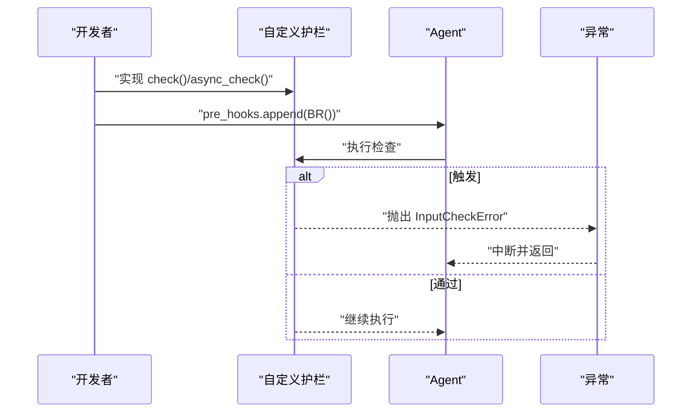
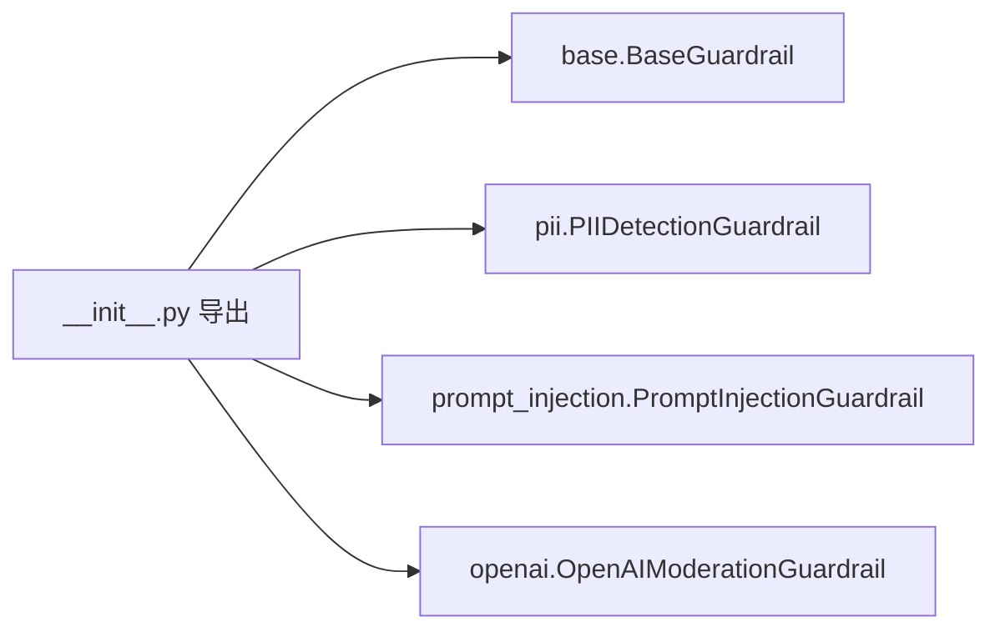

# 护栏系统

<cite>
**本文引用的文件**
- [cookbook/02_agents/08_guardrails/README.md](file://cookbook/02_agents/08_guardrails/README.md)
- [cookbook/02_agents/08_guardrails/custom_guardrail.py](file://cookbook/02_agents/08_guardrails/custom_guardrail.py)
- [cookbook/02_agents/08_guardrails/pii_detection.py](file://cookbook/02_agents/08_guardrails/pii_detection.py)
- [cookbook/02_agents/08_guardrails/prompt_injection.py](file://cookbook/02_agents/08_guardrails/prompt_injection.py)
- [cookbook/02_agents/08_guardrails/output_guardrail.py](file://cookbook/02_agents/08_guardrails/output_guardrail.py)
- [libs/agno/agno/guardrails/__init__.py](file://libs/agno/agno/guardrails/__init__.py)
- [libs/agno/agno/guardrails/base.py](file://libs/agno/agno/guardrails/base.py)
- [libs/agno/agno/guardrails/pii.py](file://libs/agno/agno/guardrails/pii.py)
- [libs/agno/agno/guardrails/prompt_injection.py](file://libs/agno/agno/guardrails/prompt_injection.py)
- [libs/agno/agno/guardrails/openai.py](file://libs/agno/agno/guardrails/openai.py)
- [libs/agno/tests/unit/agent/test_hooks_guardrails.py](file://libs/agno/tests/unit/agent/test_hooks_guardrails.py)
- [libs/agno/tests/unit/team/test_hooks_guardrails.py](file://libs/agno/tests/unit/team/test_hooks_guardrails.py)
- [libs/agno/tests/integration/agent/test_guardrails.py](file://libs/agno/tests/integration/agent/test_guardrails.py)
</cite>

## 目录
1. [简介](#简介)
2. [项目结构](#项目结构)
3. [核心组件](#核心组件)
4. [架构总览](#架构总览)
5. [详细组件分析](#详细组件分析)
6. [依赖分析](#依赖分析)
7. [性能考虑](#性能考虑)
8. [故障排查指南](#故障排查指南)
9. [结论](#结论)
10. [附录](#附录)

## 简介
本文件系统化梳理代理护栏（Guardrails）体系，覆盖输入验证、PII（个人身份信息）检测与脱敏、提示注入防护、输出质量控制以及自定义护栏的开发与评估方法。文档以仓库中的护栏示例与核心实现为基础，结合测试用例与源码路径，帮助读者快速理解并正确配置护栏系统，确保在生产环境中实现安全、合规与稳定的运行。

## 项目结构
护栏相关示例集中在 cookbook 的“guardrails”目录中，核心护栏实现位于 libs/agno/agno/guardrails 模块。单元与集成测试覆盖护栏钩子在 Agent 与 Team 中的行为。

**图示来源**
- [cookbook/02_agents/08_guardrails/README.md](file://cookbook/02_agents/08_guardrails/README.md)
- [cookbook/02_agents/08_guardrails/custom_guardrail.py](file://cookbook/02_agents/08_guardrails/custom_guardrail.py)
- [cookbook/02_agents/08_guardrails/pii_detection.py](file://cookbook/02_agents/08_guardrails/pii_detection.py)
- [cookbook/02_agents/08_guardrails/prompt_injection.py](file://cookbook/02_agents/08_guardrails/prompt_injection.py)
- [cookbook/02_agents/08_guardrails/output_guardrail.py](file://cookbook/02_agents/08_guardrails/output_guardrail.py)
- [libs/agno/agno/guardrails/__init__.py](file://libs/agno/agno/guardrails/__init__.py)
- [libs/agno/agno/guardrails/base.py](file://libs/agno/agno/guardrails/base.py)
- [libs/agno/agno/guardrails/pii.py](file://libs/agno/agno/guardrails/pii.py)
- [libs/agno/agno/guardrails/prompt_injection.py](file://libs/agno/agno/guardrails/prompt_injection.py)
- [libs/agno/agno/guardrails/openai.py](file://libs/agno/agno/guardrails/openai.py)
- [libs/agno/tests/unit/agent/test_hooks_guardrails.py](file://libs/agno/tests/unit/agent/test_hooks_guardrails.py)
- [libs/agno/tests/unit/team/test_hooks_guardrails.py](file://libs/agno/tests/unit/team/test_hooks_guardrails.py)
- [libs/agno/tests/integration/agent/test_guardrails.py](file://libs/agno/tests/integration/agent/test_guardrails.py)

**章节来源**
- [cookbook/02_agents/08_guardrails/README.md](file://cookbook/02_agents/08_guardrails/README.md)

## 核心组件
- 基础护栏接口：定义护栏的统一检查协议与异常类型，支持同步与异步检查。
- 输入护栏：用于拦截危险或不合规输入，如敏感词、提示注入等。
- 输出护栏：对生成结果进行质量与合规性检查，如长度阈值、内容合法性。
- PII 护栏：识别并阻断或脱敏个人身份信息（如社会安全号、信用卡号、邮箱、电话等）。
- 提示注入护栏：检测并阻止通过提示词注入的恶意指令或越狱尝试。
- 钩子集成：通过 pre_hooks/post_hooks 将护栏无缝接入代理生命周期。

**章节来源**
- [libs/agno/agno/guardrails/base.py](file://libs/agno/agno/guardrails/base.py)
- [libs/agno/agno/guardrails/pii.py](file://libs/agno/agno/guardrails/pii.py)
- [libs/agno/agno/guardrails/prompt_injection.py](file://libs/agno/agno/guardrails/prompt_injection.py)
- [cookbook/02_agents/08_guardrails/custom_guardrail.py](file://cookbook/02_agents/08_guardrails/custom_guardrail.py)
- [cookbook/02_agents/08_guardrails/output_guardrail.py](file://cookbook/02_agents/08_guardrails/output_guardrail.py)

## 架构总览
护栏系统围绕“钩子（Hooks）+ 护栏（Guardrails）+ 异常（Exceptions）”展开，Agent/Team 在执行前/后分别调用护栏，若触发异常则中断流程并返回错误信息。

**图示来源**
- [cookbook/02_agents/08_guardrails/pii_detection.py](file://cookbook/02_agents/08_guardrails/pii_detection.py)
- [cookbook/02_agents/08_guardrails/prompt_injection.py](file://cookbook/02_agents/08_guardrails/prompt_injection.py)
- [cookbook/02_agents/08_guardrails/output_guardrail.py](file://cookbook/02_agents/08_guardrails/output_guardrail.py)
- [libs/agno/agno/guardrails/base.py](file://libs/agno/agno/guardrails/base.py)

## 详细组件分析

### 输入验证与护栏基类
- 统一接口：护栏需实现同步/异步检查方法；失败时抛出输入或输出检查异常，携带触发原因。
- 集成方式：通过 pre_hooks 注入到 Agent/Team 生命周期，在请求进入模型前执行。
- 自定义护栏示例：演示如何基于关键词匹配实现敏感内容拦截。

**图示来源**
- [libs/agno/agno/guardrails/base.py](file://libs/agno/agno/guardrails/base.py)
- [cookbook/02_agents/08_guardrails/custom_guardrail.py](file://cookbook/02_agents/08_guardrails/custom_guardrail.py)

**章节来源**
- [libs/agno/agno/guardrails/base.py](file://libs/agno/agno/guardrails/base.py)
- [cookbook/02_agents/08_guardrails/custom_guardrail.py](file://cookbook/02_agents/08_guardrails/custom_guardrail.py)

### PII（个人身份信息）检测与脱敏
- 功能概述：识别并阻断或脱敏多种敏感信息类型（如社会安全号、信用卡号、邮箱、电话等），支持掩码模式与严格拦截模式。
- 使用方式：在 Agent 的 pre_hooks 中添加 PII 护栏实例，可选择启用 mask_pii 参数。
- 测试覆盖：示例脚本包含多场景测试（正常请求、含SSN、信用卡、邮箱、电话、混合PII、不同格式等），验证拦截与脱敏行为。

**图示来源**
- [cookbook/02_agents/08_guardrails/pii_detection.py](file://cookbook/02_agents/08_guardrails/pii_detection.py)
- [libs/agno/agno/guardrails/pii.py](file://libs/agno/agno/guardrails/pii.py)

**章节来源**
- [cookbook/02_agents/08_guardrails/pii_detection.py](file://cookbook/02_agents/08_guardrails/pii_detection.py)
- [libs/agno/agno/guardrails/pii.py](file://libs/agno/agno/guardrails/pii.py)

### 提示注入防护
- 功能概述：检测并阻断提示注入、越狱尝试与对抗性提示，保护模型按既定指令运行。
- 使用方式：在 Agent 的 pre_hooks 中添加提示注入护栏实例。
- 测试覆盖：示例脚本覆盖正常请求、基础注入、高级注入、越狱尝试与微妙注入场景，验证拦截效果。

**图示来源**
- [cookbook/02_agents/08_guardrails/prompt_injection.py](file://cookbook/02_agents/08_guardrails/prompt_injection.py)
- [libs/agno/agno/guardrails/prompt_injection.py](file://libs/agno/agno/guardrails/prompt_injection.py)

**章节来源**
- [cookbook/02_agents/08_guardrails/prompt_injection.py](file://cookbook/02_agents/08_guardrails/prompt_injection.py)
- [libs/agno/agno/guardrails/prompt_injection.py](file://libs/agno/agno/guardrails/prompt_injection.py)

### 输出护栏与质量控制
- 功能概述：对生成内容进行质量与合规性检查（如长度阈值），避免无意义或过短输出。
- 使用方式：通过 post_hooks 注入输出护栏函数，对 RunOutput 进行检查。
- 示例：非空/短输出拦截示例，展示如何在生成完成后进行二次把关。

**图示来源**
- [cookbook/02_agents/08_guardrails/output_guardrail.py](file://cookbook/02_agents/08_guardrails/output_guardrail.py)

**章节来源**
- [cookbook/02_agents/08_guardrails/output_guardrail.py](file://cookbook/02_agents/08_guardrails/output_guardrail.py)

### 自定义护栏开发指南
- 定义护栏：继承护栏基类，实现 check 与 async_check 方法；在异常中设置合适的触发原因。
- 执行逻辑：在 pre_hooks 中注册，必要时在 post_hooks 中补充输出检查。
- 效果评估：通过多场景测试（正常、边界、对抗样例）验证拦截率与误报率；结合日志与异常信息定位问题。

**图示来源**
- [cookbook/02_agents/08_guardrails/custom_guardrail.py](file://cookbook/02_agents/08_guardrails/custom_guardrail.py)
- [libs/agno/agno/guardrails/base.py](file://libs/agno/agno/guardrails/base.py)

**章节来源**
- [cookbook/02_agents/08_guardrails/custom_guardrail.py](file://cookbook/02_agents/08_guardrails/custom_guardrail.py)
- [libs/agno/agno/guardrails/base.py](file://libs/agno/agno/guardrails/base.py)

## 依赖分析
护栏模块通过统一的初始化入口导出核心护栏类，便于在示例与业务中直接引用。

**图示来源**
- [libs/agno/agno/guardrails/__init__.py](file://libs/agno/agno/guardrails/__init__.py)

**章节来源**
- [libs/agno/agno/guardrails/__init__.py](file://libs/agno/agno/guardrails/__init__.py)

## 性能考虑
- 护栏前置检查会增加少量延迟，建议：
  - 合理选择护栏数量与复杂度，优先使用轻量规则（如关键词匹配）。
  - 对高并发场景，优先采用异步护栏与缓存命中逻辑（如外部服务命中）。
  - 将昂贵的护栏（如外部API调用）置于可选开关或降级路径。
- 输出护栏应尽量避免重复计算，复用已有的内容长度统计。
- 日志与监控：记录护栏触发次数与耗时，辅助容量规划与优化。

## 故障排查指南
- 常见问题
  - 护栏未生效：确认护栏是否正确注册到 pre_hooks 或 post_hooks。
  - 误报/漏报：调整规则阈值或关键词集合；增加边界样例回归测试。
  - 异常堆栈：查看异常类型与触发原因，定位具体护栏与触发点。
- 调试方法
  - 单元测试：参考护栏钩子测试，验证 Agent/Team 场景下的护栏行为。
  - 集成测试：在端到端流程中验证护栏对真实请求的影响。
  - 日志与指标：记录护栏触发事件与耗时，持续观察稳定性。

**章节来源**
- [libs/agno/tests/unit/agent/test_hooks_guardrails.py](file://libs/agno/tests/unit/agent/test_hooks_guardrails.py)
- [libs/agno/tests/unit/team/test_hooks_guardrails.py](file://libs/agno/tests/unit/team/test_hooks_guardrails.py)
- [libs/agno/tests/integration/agent/test_guardrails.py](file://libs/agno/tests/integration/agent/test_guardrails.py)

## 结论
护栏系统通过“钩子 + 规则 + 异常”的设计，将输入校验、PII 检测、提示注入防护与输出质量控制有机整合，既保证安全性与合规性，又保持良好的扩展性与可维护性。建议在生产环境分层部署护栏，结合测试与监控持续优化规则与性能。

## 附录
- 快速上手
  - 创建护栏：参考自定义护栏示例，实现 check/async_check 并注册到 Agent。
  - PII 护栏：在 pre_hooks 中添加 PII 护栏，必要时开启掩码模式。
  - 提示注入护栏：在 pre_hooks 中添加提示注入护栏。
  - 输出护栏：在 post_hooks 中添加输出检查函数。
- 参考示例路径
  - 自定义护栏：[custom_guardrail.py](file://cookbook/02_agents/08_guardrails/custom_guardrail.py)
  - PII 检测：[pii_detection.py](file://cookbook/02_agents/08_guardrails/pii_detection.py)
  - 提示注入：[prompt_injection.py](file://cookbook/02_agents/08_guardrails/prompt_injection.py)
  - 输出护栏：[output_guardrail.py](file://cookbook/02_agents/08_guardrails/output_guardrail.py)
- 核心实现路径
  - 基类与异常：[base.py](file://libs/agno/agno/guardrails/base.py)
  - PII 护栏：[pii.py](file://libs/agno/agno/guardrails/pii.py)
  - 提示注入护栏：[prompt_injection.py](file://libs/agno/agno/guardrails/prompt_injection.py)
  - 初始化导出：[__init__.py](file://libs/agno/agno/guardrails/__init__.py)
- 测试路径
  - 单元测试（Agent）：[test_hooks_guardrails.py](file://libs/agno/tests/unit/agent/test_hooks_guardrails.py)
  - 单元测试（Team）：[test_hooks_guardrails.py](file://libs/agno/tests/unit/team/test_hooks_guardrails.py)
  - 集成测试：[test_guardrails.py](file://libs/agno/tests/integration/agent/test_guardrails.py)