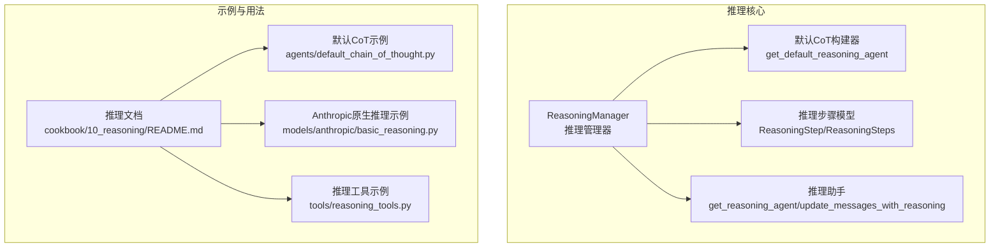
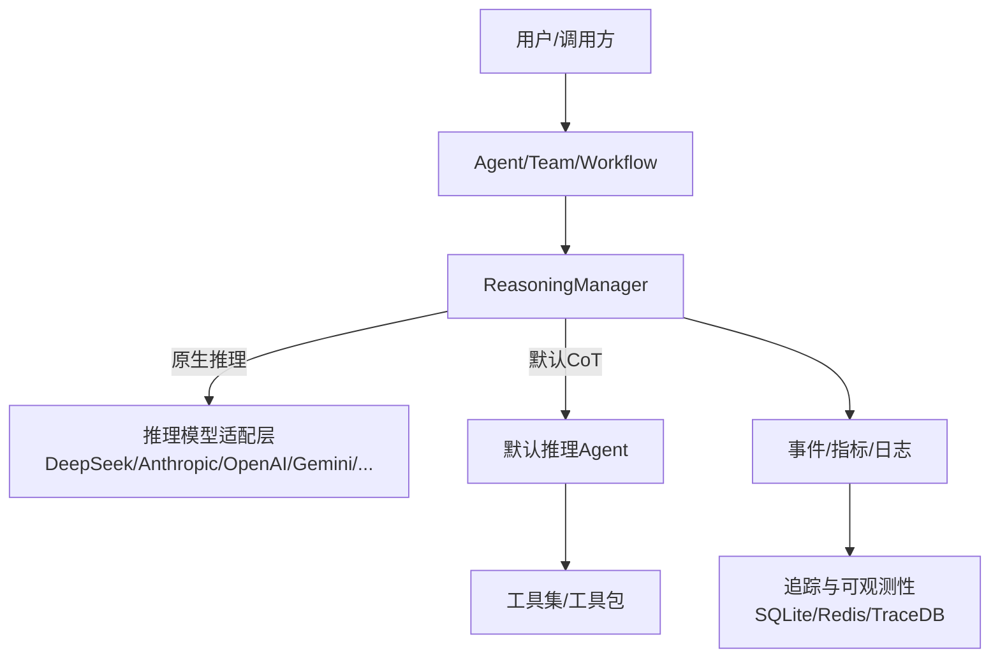
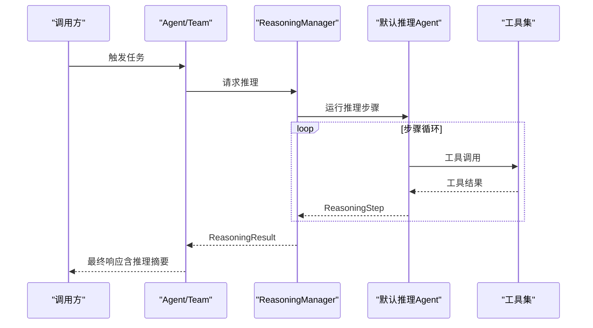
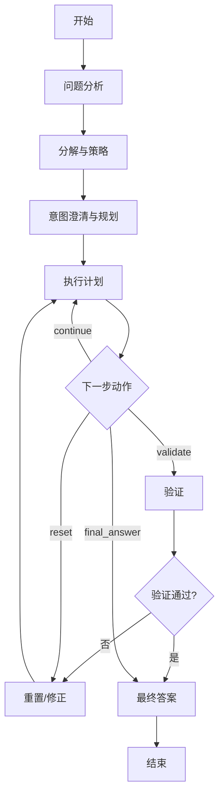
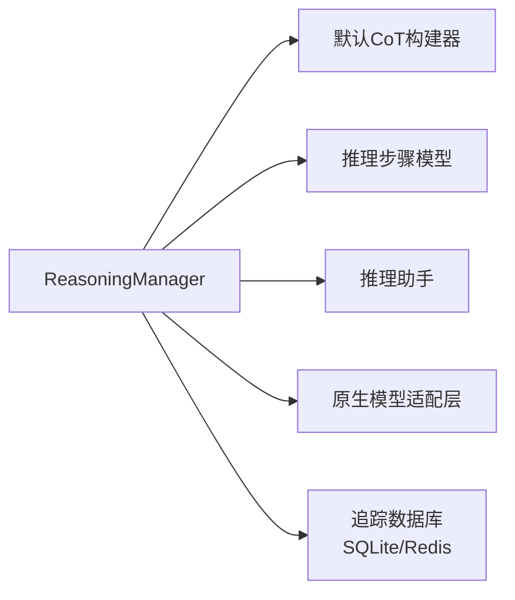

# 推理能力

<cite>
**本文引用的文件**
- [libs/agno/agno/reasoning/manager.py](file://libs/agno/agno/reasoning/manager.py)
- [libs/agno/agno/reasoning/default.py](file://libs/agno/agno/reasoning/default.py)
- [libs/agno/agno/reasoning/step.py](file://libs/agno/agno/reasoning/step.py)
- [libs/agno/agno/reasoning/helpers.py](file://libs/agno/agno/reasoning/helpers.py)
- [libs/agno/agno/db/sqlite/sqlite.py](file://libs/agno/agno/db/sqlite/sqlite.py)
- [libs/agno/agno/db/redis/redis.py](file://libs/agno/agno/db/redis/redis.py)
- [cookbook/10_reasoning/README.md](file://cookbook/10_reasoning/README.md)
- [cookbook/10_reasoning/agents/default_chain_of_thought.py](file://cookbook/10_reasoning/agents/default_chain_of_thought.py)
- [cookbook/10_reasoning/models/anthropic/basic_reasoning.py](file://cookbook/10_reasoning/models/anthropic/basic_reasoning.py)
- [cookbook/10_reasoning/tools/reasoning_tools.py](file://cookbook/10_reasoning/tools/reasoning_tools.py)
- [cookbook/92_integrations/observability/trace_to_database.md](file://cookbook/92_integrations/observability/trace_to_database.md)
- [cookbook/09_evals/performance/team_response_with_memory_simple.py.md](file://cookbook/09_evals/performance/team_response_with_memory_simple.py.md)
</cite>

## 目录
1. [简介](#简介)
2. [项目结构](#项目结构)
3. [核心组件](#核心组件)
4. [架构总览](#架构总览)
5. [详细组件分析](#详细组件分析)
6. [依赖分析](#依赖分析)
7. [性能考量](#性能考量)
8. [故障排查指南](#故障排查指南)
9. [结论](#结论)
10. [附录](#附录)

## 简介
本章节系统性介绍代理的推理能力，覆盖基础推理功能（逻辑推理、数学计算、问题求解）、模型推理配置与使用（推理模式选择、参数调优、结果验证）、思维链（Chain of Thought）的实现原理与应用方法（推理步骤分解、中间结果记录、最终答案生成）、推理过程的监控与调试（轨迹追踪、性能分析、错误诊断），并提供可直接定位到仓库中的示例路径，帮助读者在不同场景下快速上手与优化。

## 项目结构
围绕“推理”的核心代码集中在 reasoning 子模块，并通过 Agent/Team/Workflow 等上层组件协同工作；示例位于 cookbook/10_reasoning 下，涵盖模型原生推理、工具化推理与推理 Agent/Team 三种路径。

图表来源
- [libs/agno/agno/reasoning/manager.py:106-185](file://libs/agno/agno/reasoning/manager.py#L106-L185)
- [libs/agno/agno/reasoning/default.py:13-96](file://libs/agno/agno/reasoning/default.py#L13-L96)
- [libs/agno/agno/reasoning/step.py:7-32](file://libs/agno/agno/reasoning/step.py#L7-L32)
- [libs/agno/agno/reasoning/helpers.py:11-63](file://libs/agno/agno/reasoning/helpers.py#L11-L63)
- [cookbook/10_reasoning/README.md:1-39](file://cookbook/10_reasoning/README.md#L1-L39)
- [cookbook/10_reasoning/agents/default_chain_of_thought.py:1-48](file://cookbook/10_reasoning/agents/default_chain_of_thought.py#L1-L48)
- [cookbook/10_reasoning/models/anthropic/basic_reasoning.py:1-62](file://cookbook/10_reasoning/models/anthropic/basic_reasoning.py#L1-L62)
- [cookbook/10_reasoning/tools/reasoning_tools.py:1-89](file://cookbook/10_reasoning/tools/reasoning_tools.py#L1-L89)

章节来源
- [cookbook/10_reasoning/README.md:1-39](file://cookbook/10_reasoning/README.md#L1-L39)

## 核心组件
- 推理管理器（ReasoningManager）
  - 统一入口，支持原生推理模型（DeepSeek、Anthropic、OpenAI、Gemini、Groq、Ollama、Azure AI Foundry、VertexAI）与默认思维链（CoT）推理。
  - 提供同步/异步非流式与流式推理接口，事件化输出（started/content_delta/step/completed/error）。
  - 支持推理配置（最小/最大步数、工具、工具调用上限、JSON模式、遥测、调试等）。
- 默认思维链构建器（get_default_reasoning_agent）
  - 通过内置指令模板驱动结构化推理流程（问题分析、分解、意图澄清、执行计划、验证、最终答案）。
  - 输出严格遵循 ReasoningSteps 结构，便于统一处理与可视化。
- 推理步骤模型（ReasoningStep/ReasoningSteps）
  - 定义单步推理的标题、行动、结果、思考、下一步动作（continue/validate/final_answer/reset）、置信度。
  - 多步推理集合 ReasoningSteps，作为统一输出结构。
- 推理助手（helpers）
  - 将推理步骤注入到会话消息中，确保最终响应仅保留必要上下文。
  - 解析下一步动作（NextAction）并做容错处理。

章节来源
- [libs/agno/agno/reasoning/manager.py:106-185](file://libs/agno/agno/reasoning/manager.py#L106-L185)
- [libs/agno/agno/reasoning/default.py:13-96](file://libs/agno/agno/reasoning/default.py#L13-L96)
- [libs/agno/agno/reasoning/step.py:7-32](file://libs/agno/agno/reasoning/step.py#L7-L32)
- [libs/agno/agno/reasoning/helpers.py:11-63](file://libs/agno/agno/reasoning/helpers.py#L11-L63)

## 架构总览
推理在系统中的位置与交互如下：

图表来源
- [libs/agno/agno/reasoning/manager.py:198-272](file://libs/agno/agno/reasoning/manager.py#L198-L272)
- [libs/agno/agno/reasoning/default.py:13-96](file://libs/agno/agno/reasoning/default.py#L13-L96)
- [cookbook/92_integrations/observability/trace_to_database.md:21-44](file://cookbook/92_integrations/observability/trace_to_database.md#L21-L44)

## 详细组件分析

### 推理管理器（ReasoningManager）
- 职责
  - 识别原生推理模型类型并路由到对应适配器。
  - 提供统一的非流式与流式推理接口，支持事件化输出与指标聚合。
  - 在默认 CoT 模式下，循环执行推理步骤，收集中间消息与步骤，最终汇总为 ReasoningResult。
- 关键流程
  - 原生推理：按模型类型调用相应 get_*_reasoning 或 stream_*_reasoning。
  - 默认 CoT：循环执行推理 Agent，解析下一步动作，累积步骤与消息，更新会话消息，产出最终结果。
- 事件与结果
  - ReasoningEvent 类型：started、content_delta、step、completed、error。
  - ReasoningResult 包含 message/steps/reasoning_messages/success/error。

图表来源
- [libs/agno/agno/reasoning/manager.py:790-1010](file://libs/agno/agno/reasoning/manager.py#L790-L1010)
- [libs/agno/agno/reasoning/default.py:13-96](file://libs/agno/agno/reasoning/default.py#L13-L96)

章节来源
- [libs/agno/agno/reasoning/manager.py:106-185](file://libs/agno/agno/reasoning/manager.py#L106-L185)
- [libs/agno/agno/reasoning/manager.py:790-1010](file://libs/agno/agno/reasoning/manager.py#L790-L1010)

### 默认思维链（CoT）推理
- 指令模板
  - 明确六步法：问题分析、分解与策略、意图澄清与规划、执行计划、验证、最终答案。
  - 强制输出为 ReasoningSteps，保证结构化与一致性。
- 步骤模型
  - ReasoningStep 字段覆盖标题、行动、结果、思考、下一步动作、置信度。
- 执行流程
  - 循环直到达到最大步数或收到 final_answer。
  - 每步根据 next_action 决定继续、验证或终止。
  - 中间消息与步骤被收集，最终写回会话消息。

图表来源
- [libs/agno/agno/reasoning/default.py:30-82](file://libs/agno/agno/reasoning/default.py#L30-L82)
- [libs/agno/agno/reasoning/step.py:14-32](file://libs/agno/agno/reasoning/step.py#L14-L32)

章节来源
- [libs/agno/agno/reasoning/default.py:13-96](file://libs/agno/agno/reasoning/default.py#L13-L96)
- [libs/agno/agno/reasoning/step.py:7-32](file://libs/agno/agno/reasoning/step.py#L7-L32)

### 原生推理模型（以 Anthropic 为例）
- 使用模型的原生“扩展思考”能力，直接获得推理内容与消耗的 token 数量。
- 示例展示了普通回答 vs 启用扩展思考的差异，以及如何提取推理内容长度与片段。

章节来源
- [cookbook/10_reasoning/models/anthropic/basic_reasoning.py:16-55](file://cookbook/10_reasoning/models/anthropic/basic_reasoning.py#L16-L55)

### 推理工具（ReasoningTools）
- 通过给模型注入“推理工具”，为不具备原生推理能力的模型提供结构化思考空间。
- 示例展示了如何结合自定义指令与工具，引导模型进行多角度、可解释的推理。

章节来源
- [cookbook/10_reasoning/tools/reasoning_tools.py:18-58](file://cookbook/10_reasoning/tools/reasoning_tools.py#L18-L58)

### 默认 CoT 示例（Agent）
- 展示两种方式：显式指定 reasoning_model 与启用 reasoning=True。
- 两者均可输出完整推理过程并进行流式打印。

章节来源
- [cookbook/10_reasoning/agents/default_chain_of_thought.py:14-27](file://cookbook/10_reasoning/agents/default_chain_of_thought.py#L14-L27)

## 依赖分析
- 组件耦合
  - ReasoningManager 与默认 CoT 构建器、步骤模型、助手函数松耦合，通过统一接口与数据结构交互。
  - 原生推理路径按模型类型分发，避免集中式复杂分支。
- 外部依赖
  - 模型适配层（DeepSeek/Anthropic/OpenAI/Gemini/Groq/Ollama/Azure AI Foundry/VertexAI）。
  - 工具集（Toolkit/Function）用于执行外部操作与验证。
- 可观测性
  - SQLite/Redis 数据库提供追踪与跨度统计，支持按 trace/session 聚合与分页查询。

图表来源
- [libs/agno/agno/reasoning/manager.py:123-150](file://libs/agno/agno/reasoning/manager.py#L123-L150)
- [libs/agno/agno/db/sqlite/sqlite.py:2384-2411](file://libs/agno/agno/db/sqlite/sqlite.py#L2384-L2411)
- [libs/agno/agno/db/redis/redis.py:2046-2076](file://libs/agno/agno/db/redis/redis.py#L2046-L2076)

章节来源
- [libs/agno/agno/db/sqlite/sqlite.py:2384-2411](file://libs/agno/agno/db/sqlite/sqlite.py#L2384-L2411)
- [libs/agno/agno/db/redis/redis.py:2046-2076](file://libs/agno/agno/db/redis/redis.py#L2046-L2076)

## 性能考量
- 推理步数控制
  - 通过最小/最大步数限制，平衡推理深度与延迟。
- 工具调用成本
  - 合理设置工具调用上限，避免无效循环与资源浪费。
- 流式与非流式
  - 流式适合长推理过程的实时反馈；非流式适合一次性高吞吐。
- 指标与内存追踪
  - 使用评估框架对 Team/Agent 的运行时内存增长进行追踪，定位峰值与增长来源。

章节来源
- [cookbook/09_evals/performance/team_response_with_memory_simple.py.md:1-41](file://cookbook/09_evals/performance/team_response_with_memory_simple.py.md#L1-L41)

## 故障排查指南
- 常见错误与定位
  - 推理 Agent 输出结构不匹配：检查 output_schema 是否为 ReasoningSteps。
  - 推理内容为空或非结构化：确认模型返回内容类型与字段完整性。
  - 步骤为空或空循环：检查 next_action 是否正确返回 final_answer。
- 日志与事件
  - 使用 ReasoningEventType.error 获取错误事件，结合日志级别定位问题。
- 追踪与诊断
  - 利用追踪数据库（SQLite/Redis）查询 trace/session 统计，定位异常高峰与错误跨度。
  - 参考追踪到数据库的集成文档，理解端到端追踪链路。

章节来源
- [libs/agno/agno/reasoning/manager.py:828-850](file://libs/agno/agno/reasoning/manager.py#L828-L850)
- [libs/agno/agno/reasoning/manager.py:920-933](file://libs/agno/agno/reasoning/manager.py#L920-L933)
- [libs/agno/agno/db/sqlite/sqlite.py:2384-2411](file://libs/agno/agno/db/sqlite/sqlite.py#L2384-L2411)
- [libs/agno/agno/db/redis/redis.py:2046-2076](file://libs/agno/agno/db/redis/redis.py#L2046-L2076)
- [cookbook/92_integrations/observability/trace_to_database.md:21-44](file://cookbook/92_integrations/observability/trace_to_database.md#L21-L44)

## 结论
本文件从架构、组件、流程与实践四个维度梳理了代理的推理能力：以 ReasoningManager 为核心，结合默认 CoT 与原生模型推理路径，辅以工具化推理与可观测性支撑，形成可配置、可监控、可优化的完整推理体系。通过示例与最佳实践，读者可在不同场景下灵活选择推理模式并进行参数调优与效果评估。

## 附录
- 快速参考
  - 默认 CoT 示例：[示例路径:1-48](file://cookbook/10_reasoning/agents/default_chain_of_thought.py#L1-L48)
  - 原生推理（Anthropic）：[示例路径:1-62](file://cookbook/10_reasoning/models/anthropic/basic_reasoning.py#L1-L62)
  - 推理工具（ReasoningTools）：[示例路径:1-89](file://cookbook/10_reasoning/tools/reasoning_tools.py#L1-L89)
  - 推理文档总览：[文档路径:1-39](file://cookbook/10_reasoning/README.md#L1-L39)
  - 追踪到数据库集成：[文档路径:21-44](file://cookbook/92_integrations/observability/trace_to_database.md#L21-L44)
  - 内存增长追踪示例说明：[文档路径:1-41](file://cookbook/09_evals/performance/team_response_with_memory_simple.py.md#L1-L41)