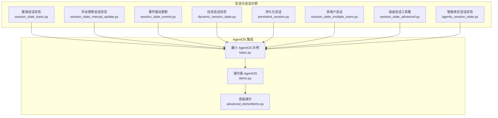
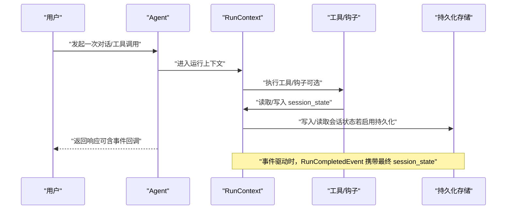
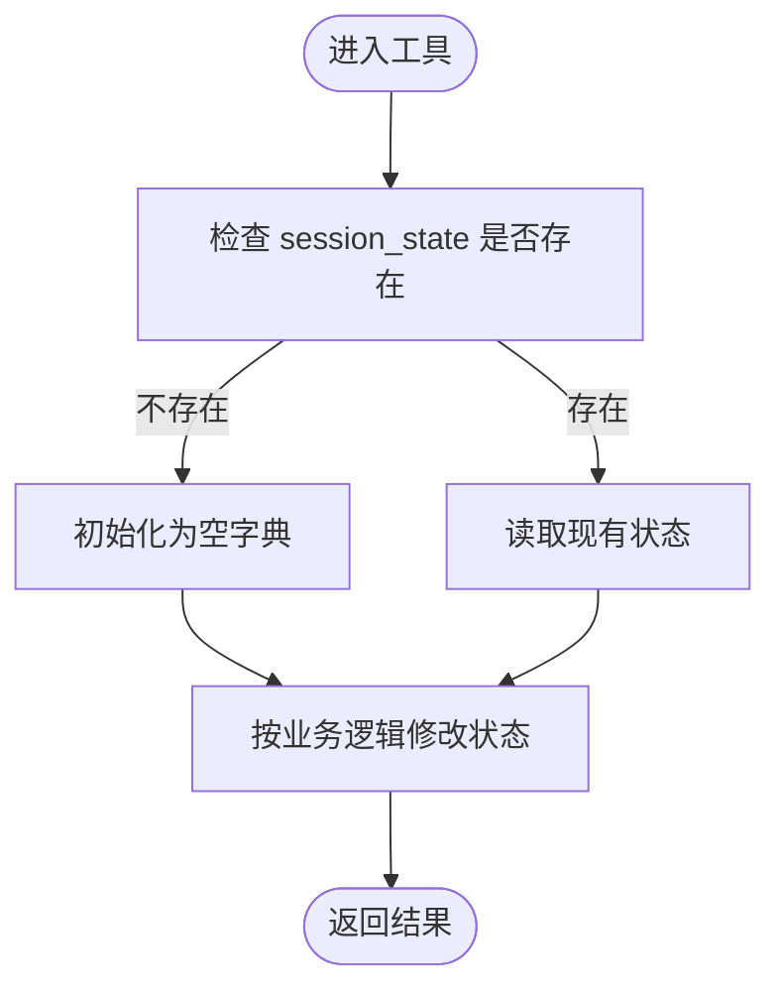
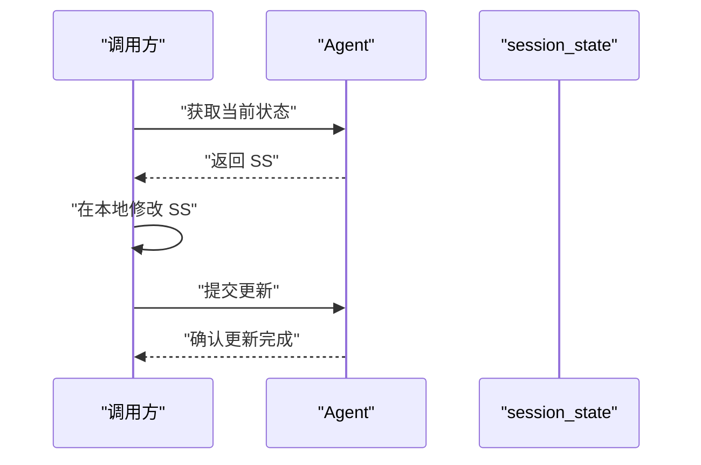
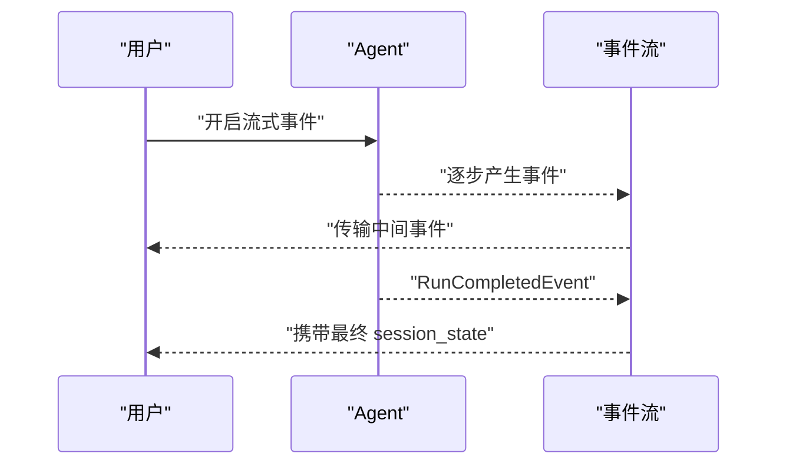
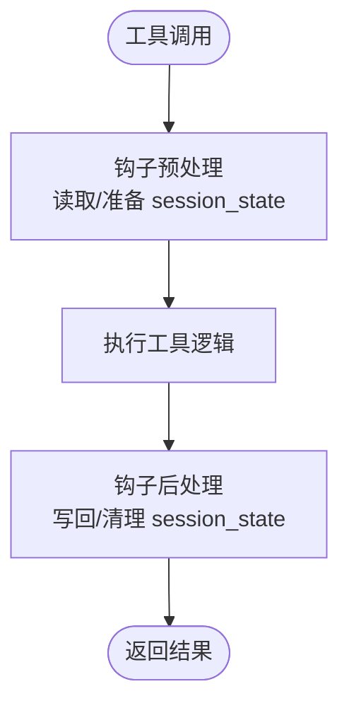
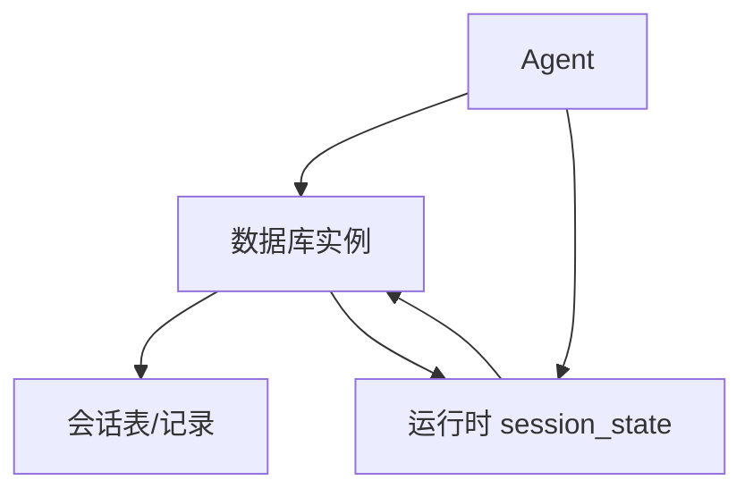
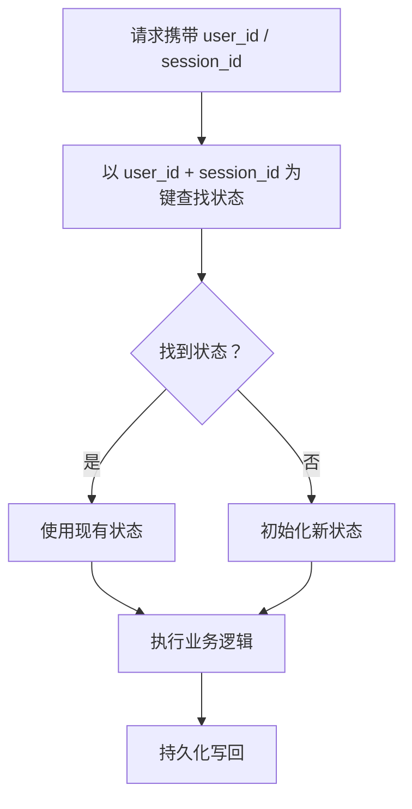
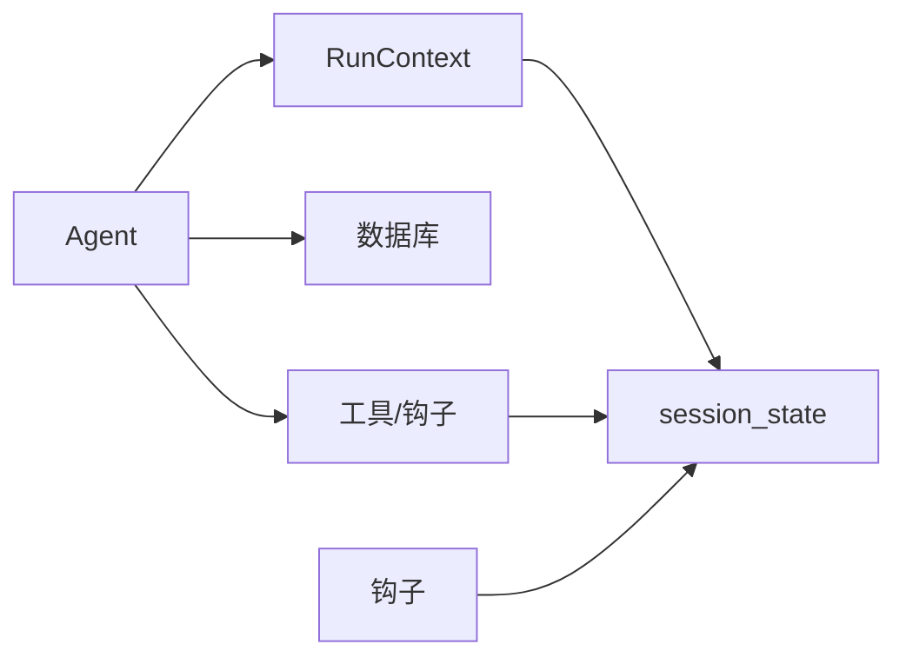

# 状态和会话

<cite>
**本文引用的文件**
- [cookbook/02_agents/05_state_and_session/session_state_basic.py](file://cookbook/02_agents/05_state_and_session/session_state_basic.py)
- [cookbook/02_agents/05_state_and_session/session_state_manual_update.py](file://cookbook/02_agents/05_state_and_session/session_state_manual_update.py)
- [cookbook/02_agents/05_state_and_session/session_state_events.py](file://cookbook/02_agents/05_state_and_session/session_state_events.py)
- [cookbook/02_agents/05_state_and_session/session_state_multiple_users.py](file://cookbook/02_agents/05_state_and_session/session_state_multiple_users.py)
- [cookbook/02_agents/05_state_and_session/dynamic_session_state.py](file://cookbook/02_agents/05_state_and_session/dynamic_session_state.py)
- [cookbook/02_agents/05_state_and_session/persistent_session.py](file://cookbook/02_agents/05_state_and_session/persistent_session.py)
- [cookbook/02_agents/05_state_and_session/session_state_advanced.py](file://cookbook/02_agents/05_state_and_session/session_state_advanced.py)
- [cookbook/02_agents/05_state_and_session/agentic_session_state.py](file://cookbook/02_agents/05_state_and_session/agentic_session_state.py)
- [cookbook/05_agent_os/basic.py](file://cookbook/05_agent_os/basic.py)
- [cookbook/05_agent_os/demo.py](file://cookbook/05_agent_os/demo.py)
- [cookbook/05_agent_os/advanced_demo/demo.py](file://cookbook/05_agent_os/advanced_demo/demo.py)
</cite>

## 目录
1. [简介](#简介)
2. [项目结构](#项目结构)
3. [核心组件](#核心组件)
4. [架构总览](#架构总览)
5. [详细组件分析](#详细组件分析)
6. [依赖关系分析](#依赖关系分析)
7. [性能考虑](#性能考虑)
8. [故障排查指南](#故障排查指南)
9. [结论](#结论)
10. [附录](#附录)

## 简介
本文件围绕代理的状态与会话管理系统，系统性阐述会话状态的存储、同步与恢复机制；动态状态更新（手动、自动、事件驱动）的实现方式；多用户支持（用户隔离、权限控制与数据安全）的设计；以及持久化存储的配置与使用（数据库连接、存储策略与备份建议）。同时提供可直接定位到仓库示例文件的路径，帮助读者在真实代码中快速落地。

## 项目结构
本项目的“状态与会话”主题主要集中在 cookbook 的“02_agents/05_state_and_session”目录下，覆盖从基础到高级的多种场景：基础会话状态、手动更新、事件驱动更新、动态状态、持久化会话、多用户隔离、智能体式会话状态等。此外，AgentOS 示例展示了如何在更高层的应用中集成数据库与会话能力。

图表来源
- [cookbook/02_agents/05_state_and_session/session_state_basic.py:1-49](file://cookbook/02_agents/05_state_and_session/session_state_basic.py#L1-L49)
- [cookbook/02_agents/05_state_and_session/session_state_manual_update.py:1-52](file://cookbook/02_agents/05_state_and_session/session_state_manual_update.py#L1-L52)
- [cookbook/02_agents/05_state_and_session/session_state_events.py:1-51](file://cookbook/02_agents/05_state_and_session/session_state_events.py#L1-L51)
- [cookbook/02_agents/05_state_and_session/dynamic_session_state.py:1-95](file://cookbook/02_agents/05_state_and_session/dynamic_session_state.py#L1-L95)
- [cookbook/02_agents/05_state_and_session/persistent_session.py:1-31](file://cookbook/02_agents/05_state_and_session/persistent_session.py#L1-L31)
- [cookbook/02_agents/05_state_and_session/session_state_multiple_users.py:1-135](file://cookbook/02_agents/05_state_and_session/session_state_multiple_users.py#L1-L135)
- [cookbook/02_agents/05_state_and_session/session_state_advanced.py:1-103](file://cookbook/02_agents/05_state_and_session/session_state_advanced.py#L1-L103)
- [cookbook/02_agents/05_state_and_session/agentic_session_state.py:1-33](file://cookbook/02_agents/05_state_and_session/agentic_session_state.py#L1-L33)
- [cookbook/05_agent_os/basic.py:1-74](file://cookbook/05_agent_os/basic.py#L1-L74)
- [cookbook/05_agent_os/demo.py:1-104](file://cookbook/05_agent_os/demo.py#L1-L104)
- [cookbook/05_agent_os/advanced_demo/demo.py:1-56](file://cookbook/05_agent_os/advanced_demo/demo.py#L1-L56)

章节来源
- [cookbook/02_agents/05_state_and_session/session_state_basic.py:1-49](file://cookbook/02_agents/05_state_and_session/session_state_basic.py#L1-L49)
- [cookbook/05_agent_os/basic.py:1-74](file://cookbook/05_agent_os/basic.py#L1-L74)

## 核心组件
- 会话状态容器与生命周期
  - 通过 Agent 构造时注入 session_state 初始化默认状态；运行期间由 run_context 提供访问入口，并在工具调用、钩子或事件中进行读写。
  - 参考路径：[会话状态初始化与工具使用:27-36](file://cookbook/02_agents/05_state_and_session/session_state_basic.py#L27-L36)

- 手动更新
  - 使用 get_session_state 获取当前状态，修改后通过 update_session_state 写回，确保状态变更立即生效。
  - 参考路径：[手动更新流程:45-47](file://cookbook/02_agents/05_state_and_session/session_state_manual_update.py#L45-L47)

- 事件驱动更新
  - 在启用流式事件时，RunCompletedEvent 中携带最终 session_state，便于外部监听器完成后续处理。
  - 参考路径：[事件驱动获取最终状态:43-50](file://cookbook/02_agents/05_state_and_session/session_state_events.py#L43-L50)

- 动态状态更新（工具钩子）
  - 通过 tool_hooks 在工具调用前/后动态修改 session_state，实现按需扩展与上下文增强。
  - 参考路径：[工具钩子动态更新:35-60](file://cookbook/02_agents/05_state_and_session/dynamic_session_state.py#L35-L60)

- 持久化存储
  - 使用数据库（如 SQLite、Postgres）作为会话状态后端，Agent 构造时传入 db 实例即可启用持久化。
  - 参考路径：[SQLite 持久化示例:31-31](file://cookbook/02_agents/05_state_and_session/session_state_basic.py#L31-L31)，[Postgres 持久化示例:14-24](file://cookbook/02_agents/05_state_and_session/persistent_session.py#L14-L24)

- 多用户与会话隔离
  - 通过 user_id 与 session_id 将状态按用户与会话维度隔离，避免交叉污染。
  - 参考路径：[多用户隔离与查询:78-132](file://cookbook/02_agents/05_state_and_session/session_state_multiple_users.py#L78-L132)

- 智能体式会话状态
  - 启用 enable_agentic_state 与 add_session_state_to_context，使系统提示能够感知并利用会话状态。
  - 参考路径：[智能体式会话状态:16-22](file://cookbook/02_agents/05_state_and_session/agentic_session_state.py#L16-L22)

章节来源
- [cookbook/02_agents/05_state_and_session/session_state_basic.py:1-49](file://cookbook/02_agents/05_state_and_session/session_state_basic.py#L1-L49)
- [cookbook/02_agents/05_state_and_session/session_state_manual_update.py:1-52](file://cookbook/02_agents/05_state_and_session/session_state_manual_update.py#L1-L52)
- [cookbook/02_agents/05_state_and_session/session_state_events.py:1-51](file://cookbook/02_agents/05_state_and_session/session_state_events.py#L1-L51)
- [cookbook/02_agents/05_state_and_session/dynamic_session_state.py:1-95](file://cookbook/02_agents/05_state_and_session/dynamic_session_state.py#L1-L95)
- [cookbook/02_agents/05_state_and_session/persistent_session.py:1-31](file://cookbook/02_agents/05_state_and_session/persistent_session.py#L1-L31)
- [cookbook/02_agents/05_state_and_session/session_state_multiple_users.py:1-135](file://cookbook/02_agents/05_state_and_session/session_state_multiple_users.py#L1-L135)
- [cookbook/02_agents/05_state_and_session/agentic_session_state.py:1-33](file://cookbook/02_agents/05_state_and_session/agentic_session_state.py#L1-L33)

## 架构总览
下图展示了从“用户请求”到“状态持久化”的整体流程，涵盖手动更新、事件驱动与动态钩子三种更新路径，以及多用户隔离与持久化存储的关键节点。

图表来源
- [cookbook/02_agents/05_state_and_session/session_state_events.py:43-50](file://cookbook/02_agents/05_state_and_session/session_state_events.py#L43-L50)
- [cookbook/02_agents/05_state_and_session/dynamic_session_state.py:35-60](file://cookbook/02_agents/05_state_and_session/dynamic_session_state.py#L35-L60)
- [cookbook/02_agents/05_state_and_session/session_state_manual_update.py:45-47](file://cookbook/02_agents/05_state_and_session/session_state_manual_update.py#L45-L47)
- [cookbook/02_agents/05_state_and_session/persistent_session.py:14-24](file://cookbook/02_agents/05_state_and_session/persistent_session.py#L14-L24)

## 详细组件分析

### 基础会话状态管理
- 设计要点
  - 在 Agent 构造时提供初始 session_state，工具函数通过 run_context.session_state 访问与修改。
  - 支持将状态变量注入指令模板，使模型在推理时可见当前状态。
- 典型应用
  - 购物清单管理：添加、移除、列出条目，状态随每次调用累积。
- 关键路径
  - [Agent 初始化与工具注册:27-36](file://cookbook/02_agents/05_state_and_session/session_state_basic.py#L27-L36)
  - [工具对 session_state 的读写:14-20](file://cookbook/02_agents/05_state_and_session/session_state_basic.py#L14-L20)

图表来源
- [cookbook/02_agents/05_state_and_session/session_state_basic.py:14-20](file://cookbook/02_agents/05_state_and_session/session_state_basic.py#L14-L20)

章节来源
- [cookbook/02_agents/05_state_and_session/session_state_basic.py:1-49](file://cookbook/02_agents/05_state_and_session/session_state_basic.py#L1-L49)

### 手动更新会话状态
- 设计要点
  - 通过 get_session_state 获取当前状态快照，修改后再调用 update_session_state 写回。
  - 适合在外部流程中对状态进行集中式校验或批量更新。
- 典型应用
  - 在工具链之外对 session_state 进行补充或修正，再统一提交。
- 关键路径
  - [获取与更新状态:45-47](file://cookbook/02_agents/05_state_and_session/session_state_manual_update.py#L45-L47)

图表来源
- [cookbook/02_agents/05_state_and_session/session_state_manual_update.py:45-47](file://cookbook/02_agents/05_state_and_session/session_state_manual_update.py#L45-L47)

章节来源
- [cookbook/02_agents/05_state_and_session/session_state_manual_update.py:1-52](file://cookbook/02_agents/05_state_and_session/session_state_manual_update.py#L1-L52)

### 事件驱动更新
- 设计要点
  - 启用流式事件后，RunCompletedEvent 中包含最终 session_state，便于外部监听器做后续处理（如日志、指标、通知）。
- 典型应用
  - 在长流程中按阶段输出中间状态，最终事件汇总完整状态。
- 关键路径
  - [事件遍历与状态提取:43-50](file://cookbook/02_agents/05_state_and_session/session_state_events.py#L43-L50)

图表来源
- [cookbook/02_agents/05_state_and_session/session_state_events.py:43-50](file://cookbook/02_agents/05_state_and_session/session_state_events.py#L43-L50)

章节来源
- [cookbook/02_agents/05_state_and_session/session_state_events.py:1-51](file://cookbook/02_agents/05_state_and_session/session_state_events.py#L1-L51)

### 动态会话状态（工具钩子）
- 设计要点
  - 通过 tool_hooks 在工具调用前后动态读取/写入 session_state，实现“按需扩展”的状态管理。
  - 工具内部可不感知状态细节，状态变化由钩子集中处理。
- 典型应用
  - 客户档案的创建/检索，状态仅在会话内有效且不泄露给系统提示。
- 关键路径
  - [钩子函数与状态操作:35-60](file://cookbook/02_agents/05_state_and_session/dynamic_session_state.py#L35-L60)
  - [Agent 注册钩子与工具:70-78](file://cookbook/02_agents/05_state_and_session/dynamic_session_state.py#L70-L78)

图表来源
- [cookbook/02_agents/05_state_and_session/dynamic_session_state.py:35-60](file://cookbook/02_agents/05_state_and_session/dynamic_session_state.py#L35-L60)

章节来源
- [cookbook/02_agents/05_state_and_session/dynamic_session_state.py:1-95](file://cookbook/02_agents/05_state_and_session/dynamic_session_state.py#L1-L95)

### 持久化会话状态
- 设计要点
  - 通过 db 参数为 Agent 注入持久化存储（如 SQLite、Postgres），会话状态在运行时写入/读取。
  - 可指定会话表名与会话 ID，实现跨进程/重启的状态恢复。
- 典型应用
  - 需要跨多次调用保持状态的长流程。
- 关键路径
  - [Postgres 持久化配置:14-24](file://cookbook/02_agents/05_state_and_session/persistent_session.py#L14-L24)
  - [SQLite 持久化配置:31-31](file://cookbook/02_agents/05_state_and_session/session_state_basic.py#L31-L31)

图表来源
- [cookbook/02_agents/05_state_and_session/persistent_session.py:14-24](file://cookbook/02_agents/05_state_and_session/persistent_session.py#L14-L24)
- [cookbook/02_agents/05_state_and_session/session_state_basic.py:31-31](file://cookbook/02_agents/05_state_and_session/session_state_basic.py#L31-L31)

章节来源
- [cookbook/02_agents/05_state_and_session/persistent_session.py:1-31](file://cookbook/02_agents/05_state_and_session/persistent_session.py#L1-L31)
- [cookbook/02_agents/05_state_and_session/session_state_basic.py:1-49](file://cookbook/02_agents/05_state_and_session/session_state_basic.py#L1-L49)

### 多用户与会话隔离
- 设计要点
  - 使用 user_id 与 session_id 组合作为状态键，确保不同用户与会话互不干扰。
  - 可在工具中读取 run_context.session_state 中的用户/会话标识，实现细粒度隔离。
- 典型应用
  - 多租户或多账号共享环境下的状态隔离。
- 关键路径
  - [多用户工具函数:20-48](file://cookbook/02_agents/05_state_and_session/session_state_multiple_users.py#L20-L48)
  - [用户与会话标识注入:71-76](file://cookbook/02_agents/05_state_and_session/session_state_multiple_users.py#L71-L76)

图表来源
- [cookbook/02_agents/05_state_and_session/session_state_multiple_users.py:20-48](file://cookbook/02_agents/05_state_and_session/session_state_multiple_users.py#L20-L48)

章节来源
- [cookbook/02_agents/05_state_and_session/session_state_multiple_users.py:1-135](file://cookbook/02_agents/05_state_and_session/session_state_multiple_users.py#L1-L135)

### 智能体式会话状态
- 设计要点
  - 启用 add_session_state_to_context 与 enable_agentic_state，使系统提示能够感知 session_state 并参与推理。
- 典型应用
  - 需要模型“记住”上下文并在后续对话中自然引用的场景。
- 关键路径
  - [智能体式会话状态配置:16-22](file://cookbook/02_agents/05_state_and_session/agentic_session_state.py#L16-L22)

章节来源
- [cookbook/02_agents/05_state_and_session/agentic_session_state.py:1-33](file://cookbook/02_agents/05_state_and_session/agentic_session_state.py#L1-L33)

### 高级会话工具集（购物清单）
- 设计要点
  - 提供增删查等工具，结合 session_state 实现复杂交互；支持大小写不敏感匹配与列表重置等高级行为。
- 典型应用
  - 交互式任务管理、知识整理等需要持续状态的场景。
- 关键路径
  - [工具定义与状态操作:17-57](file://cookbook/02_agents/05_state_and_session/session_state_advanced.py#L17-L57)

章节来源
- [cookbook/02_agents/05_state_and_session/session_state_advanced.py:1-103](file://cookbook/02_agents/05_state_and_session/session_state_advanced.py#L1-L103)

## 依赖关系分析
- 组件耦合
  - Agent 与 RunContext 强耦合：状态读写均通过 run_context.session_state 进行。
  - 工具与钩子对 session_state 的访问形成松耦合扩展点。
  - 数据库作为外部依赖，通过 db 参数注入，解耦存储实现。
- 外部依赖
  - 数据库驱动（如 SQLite、Postgres）与 ORM（如 SQLAlchemy）用于持久化。
  - AgentOS 层面提供统一应用入口与服务化部署能力。

图表来源
- [cookbook/02_agents/05_state_and_session/session_state_basic.py:14-36](file://cookbook/02_agents/05_state_and_session/session_state_basic.py#L14-L36)
- [cookbook/02_agents/05_state_and_session/dynamic_session_state.py:35-78](file://cookbook/02_agents/05_state_and_session/dynamic_session_state.py#L35-L78)
- [cookbook/02_agents/05_state_and_session/persistent_session.py:14-24](file://cookbook/02_agents/05_state_and_session/persistent_session.py#L14-L24)

章节来源
- [cookbook/02_agents/05_state_and_session/session_state_basic.py:1-49](file://cookbook/02_agents/05_state_and_session/session_state_basic.py#L1-L49)
- [cookbook/02_agents/05_state_and_session/dynamic_session_state.py:1-95](file://cookbook/02_agents/05_state_and_session/dynamic_session_state.py#L1-L95)
- [cookbook/02_agents/05_state_and_session/persistent_session.py:1-31](file://cookbook/02_agents/05_state_and_session/persistent_session.py#L1-L31)

## 性能考虑
- 状态规模控制
  - 对大型列表或嵌套结构，建议分页/截断策略，避免单次序列化体积过大。
- 更新频率与批处理
  - 高频小更新可合并为批次写入，降低数据库压力。
- 事件流与内存占用
  - 流式事件在长流程中可能积累较多中间事件，应合理设置事件窗口与清理策略。
- 存储选择
  - 开发/测试可用内存或轻量数据库；生产建议使用具备事务与索引的数据库，配合只读副本提升查询性能。
- 并发与锁
  - 多线程/多进程写入同一会话状态时，建议引入乐观锁或版本号字段，失败重试或合并策略。

## 故障排查指南
- 症状：状态未持久化
  - 排查项：是否正确传入 db；数据库连接字符串是否有效；表是否存在且可写。
  - 参考路径：[Postgres 持久化配置:14-24](file://cookbook/02_agents/05_state_and_session/persistent_session.py#L14-L24)
- 症状：多用户状态交叉污染
  - 排查项：是否在工具中显式读取 user_id/session_id；是否以 user_id+session_id 为键组织状态。
  - 参考路径：[多用户工具函数:20-48](file://cookbook/02_agents/05_state_and_session/session_state_multiple_users.py#L20-L48)
- 症状：事件中缺少最终状态
  - 排查项：是否启用流式事件；是否正确遍历 RunCompletedEvent。
  - 参考路径：[事件驱动示例:43-50](file://cookbook/02_agents/05_state_and_session/session_state_events.py#L43-L50)
- 症状：动态状态未生效
  - 排查项：钩子是否注册；arguments 是否包含所需参数；session_state 初始化是否正确。
  - 参考路径：[动态状态钩子:35-60](file://cookbook/02_agents/05_state_and_session/dynamic_session_state.py#L35-L60)

章节来源
- [cookbook/02_agents/05_state_and_session/persistent_session.py:1-31](file://cookbook/02_agents/05_state_and_session/persistent_session.py#L1-L31)
- [cookbook/02_agents/05_state_and_session/session_state_multiple_users.py:1-135](file://cookbook/02_agents/05_state_and_session/session_state_multiple_users.py#L1-L135)
- [cookbook/02_agents/05_state_and_session/session_state_events.py:1-51](file://cookbook/02_agents/05_state_and_session/session_state_events.py#L1-L51)
- [cookbook/02_agents/05_state_and_session/dynamic_session_state.py:1-95](file://cookbook/02_agents/05_state_and_session/dynamic_session_state.py#L1-L95)

## 结论
本系统通过“工具/钩子 + RunContext + 数据库”的组合，实现了灵活、可扩展且可持久化的会话状态管理。基础示例覆盖了初始化、手动更新、事件驱动与动态扩展；多用户示例展示了隔离与安全；持久化示例提供了生产可用的存储方案。结合最佳实践（状态规模控制、批处理、并发控制与备份），可在复杂场景中稳定运行。

## 附录
- AgentOS 集成参考
  - 最小示例：[AgentOS 最小示例:15-58](file://cookbook/05_agent_os/basic.py#L15-L58)
  - 演示示例：[AgentOS 演示:24-94](file://cookbook/05_agent_os/demo.py#L24-L94)
  - 高级演示：[AgentOS 高级演示:18-26](file://cookbook/05_agent_os/advanced_demo/demo.py#L18-L26)

章节来源
- [cookbook/05_agent_os/basic.py:1-74](file://cookbook/05_agent_os/basic.py#L1-L74)
- [cookbook/05_agent_os/demo.py:1-104](file://cookbook/05_agent_os/demo.py#L1-L104)
- [cookbook/05_agent_os/advanced_demo/demo.py:1-56](file://cookbook/05_agent_os/advanced_demo/demo.py#L1-L56)