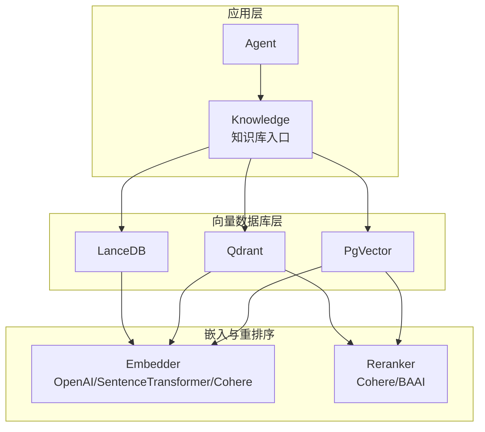
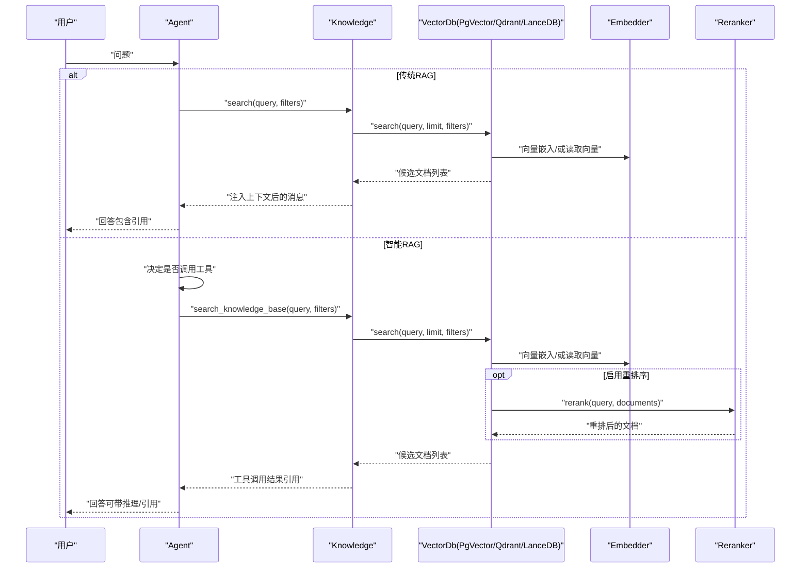
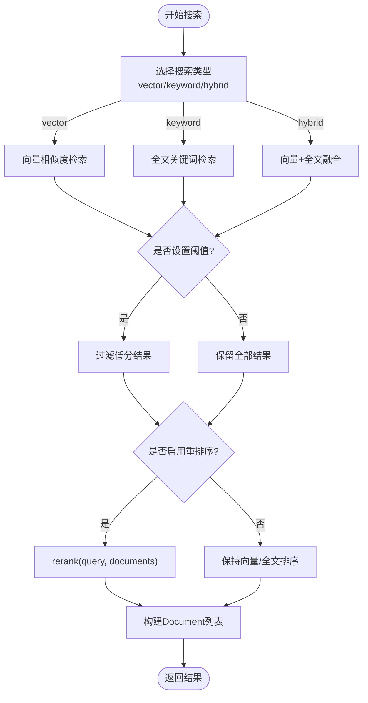
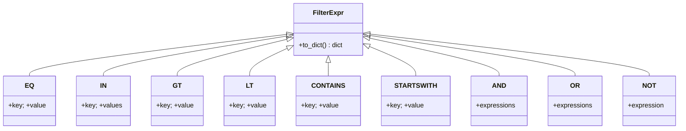
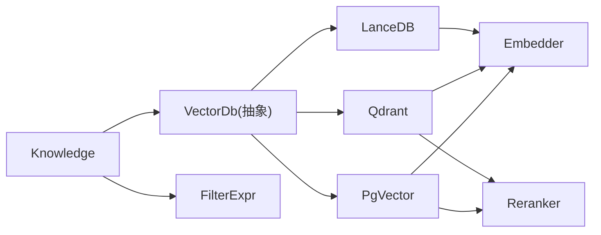

# 知识管理

<cite>
**本文引用的文件**
- [知识管理总览](file://cookbook/07_knowledge/01_getting_started/README.md)
- [传统RAG示例](file://cookbook/02_agents/07_knowledge/traditional_rag.py)
- [智能RAG示例](file://cookbook/02_agents/07_knowledge/agentic_rag.py)
- [智能RAG+推理示例](file://cookbook/02_agents/07_knowledge/agentic_rag_with_reasoning.py)
- [智能RAG+重排序示例](file://cookbook/02_agents/07_knowledge/agentic_rag_with_reranking.py)
- [知识过滤示例](file://cookbook/02_agents/07_knowledge/knowledge_filters.py)
- [向量搜索示例](file://cookbook/07_knowledge/09_archive/search_type/vector_search.py)
- [相似度阈值示例](file://cookbook/07_knowledge/09_archive/vector_dbs/pgvector_similarity_threshold.py)
- [分布式RAG-PgVector示例](file://cookbook/03_teams/15_distributed_rag/01_distributed_rag_pgvector.md)
- [知识库测试-文本知识](file://libs/agno/tests/integration/knowledge/test_text_knowledge.py)
- [知识类实现](file://libs/agno/agno/knowledge/knowledge.py)
- [PgVector向量数据库实现](file://libs/agno/agno/vectordb/pgvector/pgvector.py)
- [向量数据库基类](file://libs/agno/agno/vectordb/base.py)
- [过滤表达式定义](file://libs/agno/agno/filters.py)
- [Qdrant向量数据库实现（搜索结果构建）](file://libs/agno/agno/vectordb/qdrant/qdrant.py)
</cite>

## 目录
1. [简介](#简介)
2. [项目结构](#项目结构)
3. [核心组件](#核心组件)
4. [架构总览](#架构总览)
5. [详细组件分析](#详细组件分析)
6. [依赖关系分析](#依赖关系分析)
7. [性能考量](#性能考量)
8. [故障排查指南](#故障排查指南)
9. [结论](#结论)
10. [附录](#附录)

## 简介
本文件面向代理的知识管理系统，系统性阐述 RAG（检索增强生成）的实现原理与配置方法，覆盖向量嵌入、索引构建、查询优化、向量搜索机制（相似度计算、搜索策略、结果排序）、内容过滤（静态与动态）、传统RAG与智能RAG的区别与适用场景，并提供可直接参考的代码示例路径与最佳实践，帮助读者快速搭建、维护与优化知识库，同时说明与外部知识源的集成与数据同步策略。

## 项目结构
本项目的知识管理能力主要由以下模块构成：
- 知识库入口与检索：Knowledge 类负责内容加载、插入、删除、检索与过滤；对外暴露统一的 insert/insert_many/search 接口。
- 向量数据库适配层：PgVector、Qdrant、LanceDB 等具体实现，封装向量索引、嵌入、相似度计算、混合检索、重排序等细节。
- 过滤表达式：FilterExpr 家族（EQ、IN、GT/LT、CONTAINS、STARTSWITH、AND/OR/NOT）用于构建复杂过滤条件。
- 示例与用法：cookbook 中提供从基础到高级的多种 RAG 场景示例，涵盖传统RAG、智能RAG、带重排序/推理、过滤、分布式RAG等。

图表来源
- [知识类实现:40-120](file://libs/agno/agno/knowledge/knowledge.py#L40-L120)
- [PgVector向量数据库实现:39-165](file://libs/agno/agno/vectordb/pgvector/pgvector.py#L39-L165)
- [向量数据库基类:9-153](file://libs/agno/agno/vectordb/base.py#L9-L153)
- [过滤表达式定义:51-390](file://libs/agno/agno/filters.py#L51-L390)

章节来源
- [知识管理总览:1-38](file://cookbook/07_knowledge/01_getting_started/README.md#L1-L38)

## 核心组件
- Knowledge（知识库）
  - 提供 insert/insert_many/asearch 等统一接口，内部委派给向量数据库完成嵌入、索引与检索。
  - 支持隔离搜索（isolate_vector_search）、最大返回数（max_results）、内容元数据管理等。
- VectorDb（向量数据库抽象）
  - 定义 create/exists/insert/upsert/search/delete 等通用接口，具体实现负责索引、距离度量、过滤DSL转换等。
- Embedder（嵌入器）
  - 将文本转为向量，支持批量嵌入与异步嵌入，常见实现如 OpenAIEmbedder、SentenceTransformerEmbedder、CohereEmbedder。
- Reranker（重排序器）
  - 在向量召回后对候选进行再排序，提升相关性，常见实现如 CohereReranker、BAAI 系列本地重排。
- 过滤表达式（FilterExpr）
  - EQ/IN/GT/LT/CONTAINS/STARTSWITH 以及 AND/OR/NOT，支持复杂逻辑组合，PGVector/Qdrant 等会将其转换为底层查询。

章节来源
- [知识类实现:40-120](file://libs/agno/agno/knowledge/knowledge.py#L40-L120)
- [向量数据库基类:9-153](file://libs/agno/agno/vectordb/base.py#L9-L153)
- [PgVector向量数据库实现:39-165](file://libs/agno/agno/vectordb/pgvector/pgvector.py#L39-L165)
- [过滤表达式定义:51-390](file://libs/agno/agno/filters.py#L51-L390)

## 架构总览
下图展示了从“用户提问”到“返回带引用的答案”的端到端流程，涵盖传统RAG与智能RAG两条路径：

图表来源
- [传统RAG示例:14-47](file://cookbook/02_agents/07_knowledge/traditional_rag.py#L14-L47)
- [智能RAG示例:14-50](file://cookbook/02_agents/07_knowledge/agentic_rag.py#L14-L50)
- [智能RAG+推理示例:21-62](file://cookbook/02_agents/07_knowledge/agentic_rag_with_reasoning.py#L21-L62)
- [智能RAG+重排序示例:15-46](file://cookbook/02_agents/07_knowledge/agentic_rag_with_reranking.py#L15-L46)
- [知识类实现:507-590](file://libs/agno/agno/knowledge/knowledge.py#L507-L590)
- [PgVector向量数据库实现:745-774](file://libs/agno/agno/vectordb/pgvector/pgvector.py#L745-L774)

## 详细组件分析

### 传统RAG vs 智能RAG
- 传统RAG（add_knowledge_to_context=True）
  - 在构建用户消息前自动检索并注入上下文，适合简单可控、每次对话都需检索的场景。
  - 关键点：消息构建时触发检索、一次性注入、无工具调用。
- 智能RAG（search_knowledge=True，默认启用）
  - Agent 拥有“搜索知识库”工具，按需调用；可多次检索、可跳过检索；更灵活，适合复杂问答与多轮对话。
  - 关键点：工具调用触发检索、可多次检索、可结合推理/重排序。

章节来源
- [传统RAG示例:29-37](file://cookbook/02_agents/07_knowledge/traditional_rag.py#L29-L37)
- [智能RAG示例:28-35](file://cookbook/02_agents/07_knowledge/agentic_rag.py#L28-L35)
- [知识管理总览:29-32](file://cookbook/07_knowledge/01_getting_started/README.md#L29-L32)

### 向量嵌入与索引构建
- 嵌入
  - Knowledge.insert/insert_many 内部构造 Content/Document，调用 Embedder 生成向量；PgVector 支持批量嵌入与异步嵌入回退。
  - 常见嵌入器：OpenAIEmbedder、SentenceTransformerEmbedder、CohereEmbedder。
- 索引
  - PgVector 默认创建 pgvector 扩展与表结构，支持 HNSW/Ivfflat 索引；可配置距离度量（cosine 等）。
- 插入/更新
  - 支持 upsert（按 content_hash 去重），异步批量插入，失败回滚单批，保证一致性。

章节来源
- [知识类实现:90-156](file://libs/agno/agno/knowledge/knowledge.py#L90-L156)
- [PgVector向量数据库实现:312-414](file://libs/agno/agno/vectordb/pgvector/pgvector.py#L312-L414)
- [PgVector向量数据库实现:424-505](file://libs/agno/agno/vectordb/pgvector/pgvector.py#L424-L505)
- [PgVector向量数据库实现:533-602](file://libs/agno/agno/vectordb/pgvector/pgvector.py#L533-L602)

### 向量搜索机制
- 搜索类型
  - vector：纯向量相似度检索。
  - keyword：全文关键词检索。
  - hybrid：向量与全文的加权融合（PgVector 支持）。
- 相似度与阈值
  - 支持 similarity_threshold 过滤低分结果；PgVector 的向量分数与全文 rank 经权重融合后排序。
- 结果构建与重排序
  - Qdrant 的搜索结果构建会将 payload 转换为 Document，并在存在 reranker 时进行重排。
- 过滤策略
  - 支持字典与 FilterExpr DSL；PgVector 将 FilterExpr 转换为 JSONB 查询；Qdrant 将过滤键标准化为 meta_data.xxx。

图表来源
- [向量搜索示例:6-19](file://cookbook/07_knowledge/09_archive/search_type/vector_search.py#L6-L19)
- [相似度阈值示例:6-41](file://cookbook/07_knowledge/09_archive/vector_dbs/pgvector_similarity_threshold.py#L6-L41)
- [PgVector向量数据库实现:1055-1114](file://libs/agno/agno/vectordb/pgvector/pgvector.py#L1055-L1114)
- [Qdrant向量数据库实现（搜索结果构建）:706-728](file://libs/agno/agno/vectordb/qdrant/qdrant.py#L706-L728)

章节来源
- [向量搜索示例:6-19](file://cookbook/07_knowledge/09_archive/search_type/vector_search.py#L6-L19)
- [相似度阈值示例:6-41](file://cookbook/07_knowledge/09_archive/vector_dbs/pgvector_similarity_threshold.py#L6-L41)
- [PgVector向量数据库实现:745-774](file://libs/agno/agno/vectordb/pgvector/pgvector.py#L745-L774)
- [Qdrant向量数据库实现（搜索结果构建）:706-728](file://libs/agno/agno/vectordb/qdrant/qdrant.py#L706-L728)

### 内容过滤
- 静态过滤：在 Agent 创建时传入 knowledge_filters，所有检索均强制应用。
- 动态过滤：enable_agentic_knowledge_filters=true，由模型在推理过程中动态决定过滤条件。
- 过滤表达式：EQ、IN、GT/LT、CONTAINS、STARTSWITH、AND/OR/NOT，支持复杂组合。
- 底层实现：PgVector 将 FilterExpr 转为 JSONB 查询；Qdrant 将过滤键标准化为 meta_data.xxx。

图表来源
- [过滤表达式定义:51-390](file://libs/agno/agno/filters.py#L51-L390)

章节来源
- [知识过滤示例:18-52](file://cookbook/02_agents/07_knowledge/knowledge_filters.py#L18-L52)
- [PgVector向量数据库实现:775-794](file://libs/agno/agno/vectordb/pgvector/pgvector.py#L775-L794)
- [Qdrant向量数据库实现（搜索结果构建）:730-738](file://libs/agno/agno/vectordb/qdrant/qdrant.py#L730-L738)

### 传统RAG与智能RAG对比
- 触发方式：传统RAG在消息构建时自动检索；智能RAG通过工具按需触发。
- 注入位置：传统RAG注入到用户消息末尾；智能RAG作为工具调用结果返回。
- 模型感知：智能RAG注册了搜索工具，模型可多次检索或跳过。
- 系统提示：智能RAG包含搜索指令，传统RAG无。

章节来源
- [传统RAG示例:56-86](file://cookbook/02_agents/07_knowledge/traditional_rag.md#L56-L86)

### 分布式RAG与团队协作
- 多成员分工：不同成员分别负责向量检索、混合检索、数据验证、响应组合，通过 Team Leader 协调。
- 双知识库：一个向量库（PgVector，SearchType.vector），一个混合库（PgVector，SearchType.hybrid），互补提升精度。
- 数据同步：支持同步/异步写入，确保两个知识库一致。

章节来源
- [分布式RAG-PgVector示例:1-52](file://cookbook/03_teams/15_distributed_rag/01_distributed_rag_pgvector.md#L1-L52)

### 代码示例路径（不含代码内容）
- 传统RAG
  - [示例入口:14-47](file://cookbook/02_agents/07_knowledge/traditional_rag.py#L14-L47)
- 智能RAG
  - [示例入口:14-50](file://cookbook/02_agents/07_knowledge/agentic_rag.py#L14-L50)
- 智能RAG+推理
  - [示例入口:21-62](file://cookbook/02_agents/07_knowledge/agentic_rag_with_reasoning.py#L21-L62)
- 智能RAG+重排序
  - [示例入口:15-46](file://cookbook/02_agents/07_knowledge/agentic_rag_with_reranking.py#L15-L46)
- 知识过滤
  - [示例入口:18-71](file://cookbook/02_agents/07_knowledge/knowledge_filters.py#L18-L71)
- 向量搜索
  - [示例入口:6-19](file://cookbook/07_knowledge/09_archive/search_type/vector_search.py#L6-L19)
- 相似度阈值
  - [示例入口:6-41](file://cookbook/07_knowledge/09_archive/vector_dbs/pgvector_similarity_threshold.py#L6-L41)
- 分布式RAG（PgVector）
  - [示例说明:1-52](file://cookbook/03_teams/15_distributed_rag/01_distributed_rag_pgvector.md#L1-L52)
- 知识库测试（文本知识）
  - [测试入口:50-92](file://libs/agno/tests/integration/knowledge/test_text_knowledge.py#L50-L92)

## 依赖关系分析
- 组件耦合
  - Knowledge 依赖 VectorDb 抽象，具体实现（PgVector/Qdrant/LanceDB）解耦。
  - VectorDb 依赖 Embedder/Reranker，便于替换与扩展。
  - 过滤表达式独立于具体数据库，通过 DSL 转换实现跨实现兼容。
- 外部依赖
  - PgVector 依赖 SQLAlchemy 与 pgvector 扩展；Qdrant/LanceDB 依赖对应客户端库。
  - 嵌入与重排序可选云服务或本地模型，降低耦合度。

图表来源
- [知识类实现:40-120](file://libs/agno/agno/knowledge/knowledge.py#L40-L120)
- [向量数据库基类:9-153](file://libs/agno/agno/vectordb/base.py#L9-L153)
- [PgVector向量数据库实现:39-165](file://libs/agno/agno/vectordb/pgvector/pgvector.py#L39-L165)
- [过滤表达式定义:51-390](file://libs/agno/agno/filters.py#L51-L390)

章节来源
- [知识类实现:40-120](file://libs/agno/agno/knowledge/knowledge.py#L40-L120)
- [向量数据库基类:9-153](file://libs/agno/agno/vectordb/base.py#L9-L153)
- [PgVector向量数据库实现:39-165](file://libs/agno/agno/vectordb/pgvector/pgvector.py#L39-L165)
- [过滤表达式定义:51-390](file://libs/agno/agno/filters.py#L51-L390)

## 性能考量
- 向量索引与距离度量
  - HNSW/Ivfflat 索引的选择影响检索速度与精度；cosine 等距离度量需与嵌入维度匹配。
- 批量嵌入与异步处理
  - PgVector 支持批量嵌入与异步嵌入回退，减少 API 调用次数与等待时间。
- 混合检索权重
  - PgVector 的 vector_score_weight 控制向量与全文的融合比例，建议通过 A/B 测试确定最优权重。
- 相似度阈值
  - 设置 similarity_threshold 可过滤低质量召回，减少下游模型负担。
- 重排序
  - 在高召回率基础上进行重排序，显著提升最终相关性，但会增加延迟，需权衡吞吐与质量。

## 故障排查指南
- 常见错误与定位
  - “未提供向量数据库”：检查 Knowledge 初始化时 vector_db 是否正确传入。
  - “表不存在/扩展未安装”：确认 PgVector.create() 已执行，且数据库具备 pgvector 扩展。
  - “过滤条件无效”：确认 FilterExpr DSL 正确，字段名与 meta_data 结构一致。
  - “重排序失败”：确认 reranker 实例已配置且可用。
- 日志与调试
  - 使用日志级别查看嵌入批次、插入/更新状态、过滤转换与重排序过程。
- 单元测试参考
  - 文本知识库测试用例展示了插入、检索与工具调用的断言流程，可作为集成测试模板。

章节来源
- [知识库测试-文本知识:50-92](file://libs/agno/tests/integration/knowledge/test_text_knowledge.py#L50-L92)
- [向量数据库基类:130-144](file://libs/agno/agno/vectordb/base.py#L130-L144)

## 结论
本知识管理系统以 Knowledge 为核心，向上提供统一的检索与内容管理接口，向下对接多种向量数据库与嵌入/重排序方案。通过 FilterExpr 实现跨实现的过滤能力，结合传统RAG与智能RAG的不同模式，满足从简单到复杂的多样化应用场景。配合分布式RAG与团队协作模式，可在企业级精度与性能之间取得平衡。

## 附录
- 最佳实践
  - 知识库构建
    - 明确内容来源与格式，统一元数据结构；优先使用批量/异步插入提升效率。
    - 合理设置 max_results 与 similarity_threshold，避免噪声。
  - 维护与优化
    - 定期清理过期/重复内容，保持 content_hash 唯一性；根据业务调整 vector_score_weight。
    - 在高负载场景启用重排序并缓存热点查询结果。
  - 与外部知识源集成
    - 通过 Knowledge.insert_many/url/path/topics 等接口批量接入；支持远程存储配置。
    - 建立增量同步策略（基于时间戳/哈希），避免全量重索引。
- 适用场景
  - 传统RAG：简单可控、每次对话必检索。
  - 智能RAG：复杂问答、多轮对话、需要多次检索与工具编排。
  - 分布式RAG：高精度要求的企业级团队协作检索。