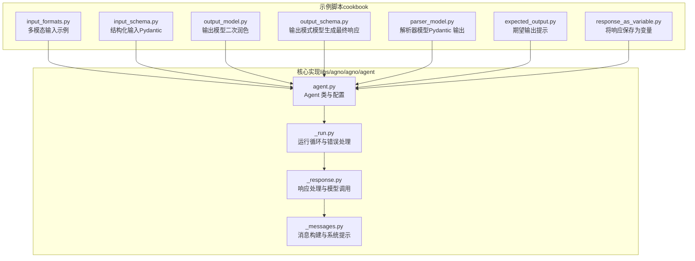
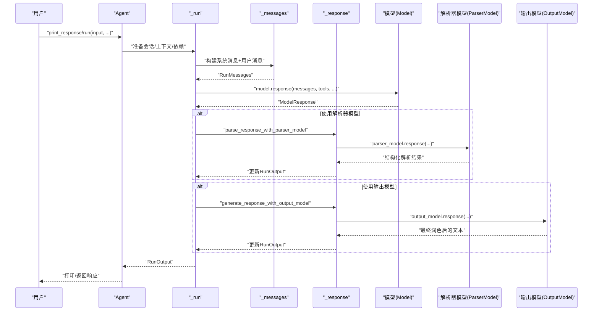
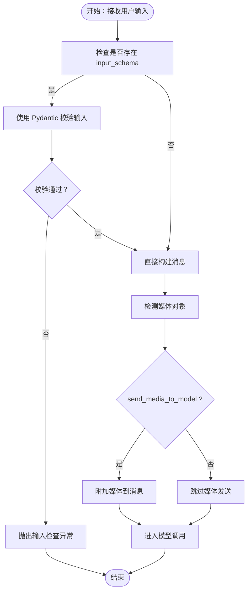
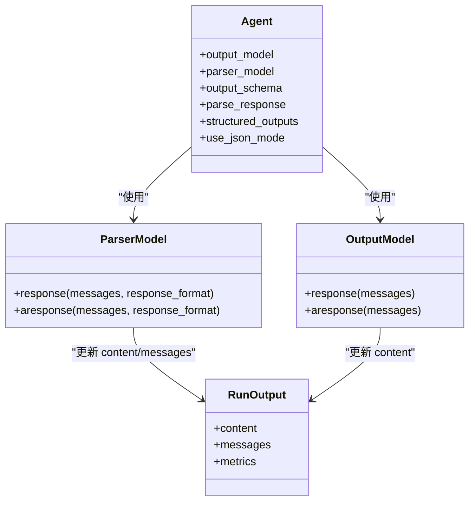
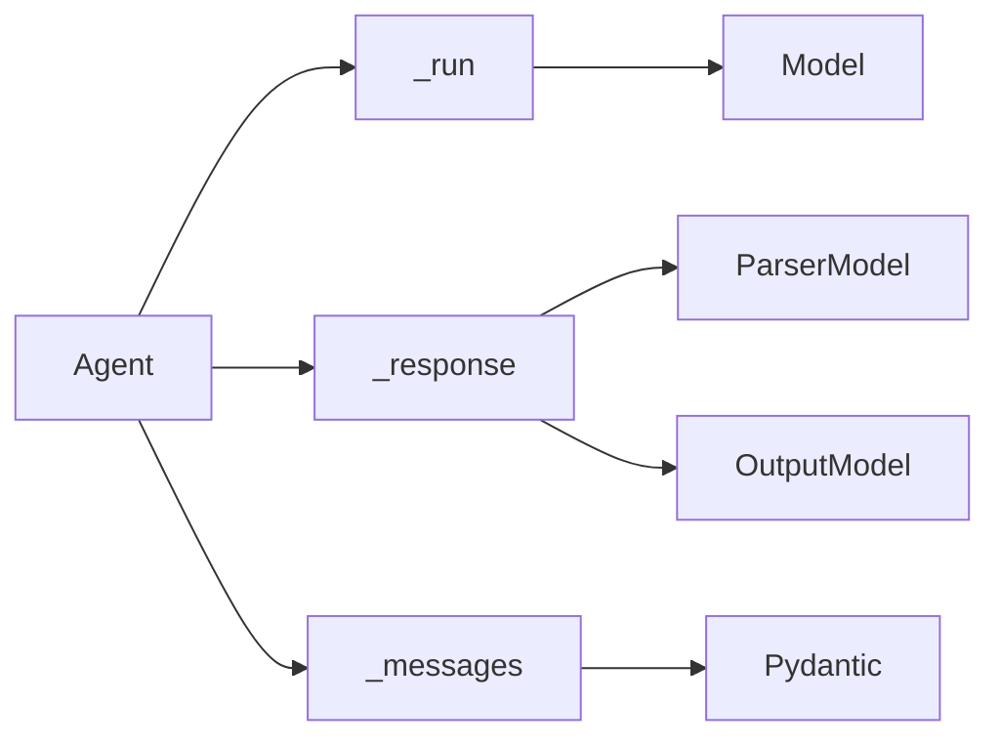

# 输入输出处理

<cite>
**本文引用的文件**
- [agent.py](file://libs/agno/agno/agent/agent.py)
- [_run.py](file://libs/agno/agno/agent/_run.py)
- [_response.py](file://libs/agno/agno/agent/_response.py)
- [_messages.py](file://libs/agno/agno/agent/_messages.py)
- [input_formats.py](file://cookbook/02_agents/02_input_output/input_formats.py)
- [input_schema.py](file://cookbook/02_agents/02_input_output/input_schema.py)
- [output_model.py](file://cookbook/02_agents/02_input_output/output_model.py)
- [output_schema.py](file://cookbook/02_agents/02_input_output/output_schema.py)
- [parser_model.py](file://cookbook/02_agents/02_input_output/parser_model.py)
- [expected_output.py](file://cookbook/02_agents/02_input_output/expected_output.py)
- [response_as_variable.py](file://cookbook/02_agents/02_input_output/response_as_variable.py)
</cite>

## 目录
1. [简介](#简介)
2. [项目结构](#项目结构)
3. [核心组件](#核心组件)
4. [架构总览](#架构总览)
5. [详细组件分析](#详细组件分析)
6. [依赖分析](#依赖分析)
7. [性能考虑](#性能考虑)
8. [故障排查指南](#故障排查指南)
9. [结论](#结论)
10. [附录](#附录)

## 简介
本章节面向代理的输入输出处理系统，系统性阐述以下主题：
- 输入格式的验证与处理：文本输入、结构化数据输入、多模态输入（图像/音频/视频/文件）。
- 结构化输出的实现：Pydantic 模型、JSON Schema、自定义输出格式。
- 类型安全与模式匹配：参数验证、返回值约束、错误处理。
- 与 API 接口的集成方式与最佳实践。
- 性能优化建议与常见问题解决方案。

## 项目结构
该仓库在“cookbook”中提供了大量输入输出处理的示例脚本，涵盖：
- 多模态输入（图像、音频、视频等）
- 结构化输入（Pydantic 模型）
- 结构化输出（输出模型、解析器模型、输出模式）

图表来源
- [agent.py:1-800](file://libs/agno/agno/agent/agent.py#L1-L800)
- [_run.py:1-800](file://libs/agno/agno/agent/_run.py#L1-L800)
- [_response.py:1-800](file://libs/agno/agno/agent/_response.py#L1-L800)
- [_messages.py:1-800](file://libs/agno/agno/agent/_messages.py#L1-L800)
- [input_formats.py:1-35](file://cookbook/02_agents/02_input_output/input_formats.py#L1-L35)
- [input_schema.py:1-60](file://cookbook/02_agents/02_input_output/input_schema.py#L1-L60)
- [output_model.py:1-35](file://cookbook/02_agents/02_input_output/output_model.py#L1-L35)
- [output_schema.py:1-26](file://cookbook/02_agents/02_input_output/output_schema.py#L1-L26)
- [parser_model.py:1-99](file://cookbook/02_agents/02_input_output/parser_model.py#L1-L99)
- [expected_output.py:1-29](file://cookbook/02_agents/02_input_output/expected_output.py#L1-L29)
- [response_as_variable.py:1-34](file://cookbook/02_agents/02_input_output/response_as_variable.py#L1-L34)

章节来源
- [agent.py:1-800](file://libs/agno/agno/agent/agent.py#L1-L800)
- [_run.py:1-800](file://libs/agno/agno/agent/_run.py#L1-L800)
- [_messages.py:1-800](file://libs/agno/agno/agent/_messages.py#L1-L800)

## 核心组件
- Agent 类：集中管理模型、工具、会话、记忆、知识、钩子、推理、流式输出、结构化输出等能力。
- 运行循环（_run）：负责会话初始化、依赖解析、预/后置钩子、消息构建、模型调用、媒体存储、结构化输出转换、事件与指标收集、清理与持久化。
- 响应处理（_response）：负责推理、解析器模型、输出模型、模型响应流式处理、事件转换与度量累积。
- 消息构建（_messages）：负责系统消息拼装、上下文注入、期望输出提示、JSON/Pydantic 输出格式提示、时间/地点/名称等上下文信息。

章节来源
- [agent.py:280-304](file://libs/agno/agno/agent/agent.py#L280-L304)
- [_run.py:323-705](file://libs/agno/agno/agent/_run.py#L323-L705)
- [_response.py:364-760](file://libs/agno/agno/agent/_response.py#L364-L760)
- [_messages.py:106-450](file://libs/agno/agno/agent/_messages.py#L106-L450)

## 架构总览
下图展示了从用户输入到最终输出的关键路径，以及结构化输出与多模态输入的集成点。

图表来源
- [_run.py:323-705](file://libs/agno/agno/agent/_run.py#L323-L705)
- [_messages.py:106-450](file://libs/agno/agno/agent/_messages.py#L106-L450)
- [_response.py:364-760](file://libs/agno/agno/agent/_response.py#L364-L760)

## 详细组件分析

### 输入格式验证与处理
- 文本输入
  - 支持字符串或结构化消息对象；当提供额外上下文时，系统消息会自动注入期望输出、技能、记忆、文化知识、知识检索提示等。
  - 参考：[系统消息构建:106-450](file://libs/agno/agno/agent/_messages.py#L106-L450)、[运行循环消息准备:450-467](file://libs/agno/agno/agent/_run.py#L450-L467)。
- 结构化数据输入（Pydantic）
  - 通过 input_schema 参数传入 Pydantic 模型，Agent 在运行前对输入进行校验，确保字段类型与范围符合预期。
  - 示例：[input_schema.py:16-59](file://cookbook/02_agents/02_input_output/input_schema.py#L16-L59)。
  - 实现要点：在运行循环中解析输入并使用 Pydantic 模型进行验证，失败抛出输入检查异常。
  - 参考：[输入校验与异常处理:634-652](file://libs/agno/agno/agent/_run.py#L634-L652)。
- 多模态输入（图像/音频/视频/文件）
  - 支持将媒体作为用户消息的一部分发送给模型；可控制是否将媒体发送至模型、是否存储媒体到运行输出。
  - 示例：[input_formats.py:19-34](file://cookbook/02_agents/02_input_output/input_formats.py#L19-L34)。
  - 实现要点：消息构建阶段识别媒体对象并按模型要求编码；运行循环中可选择存储媒体以供后续分析。
  - 参考：[媒体处理与存储开关:204-215](file://libs/agno/agno/agent/agent.py#L204-L215)、[媒体存储工具:560-561](file://libs/agno/agno/agent/_run.py#L560-L561)。

图表来源
- [_run.py:634-652](file://libs/agno/agno/agent/_run.py#L634-L652)
- [_messages.py:106-450](file://libs/agno/agno/agent/_messages.py#L106-L450)
- [agent.py:204-215](file://libs/agno/agno/agent/agent.py#L204-L215)
- [input_schema.py:16-59](file://cookbook/02_agents/02_input_output/input_schema.py#L16-L59)
- [input_formats.py:19-34](file://cookbook/02_agents/02_input_output/input_formats.py#L19-L34)

章节来源
- [input_schema.py:16-59](file://cookbook/02_agents/02_input_output/input_schema.py#L16-L59)
- [input_formats.py:19-34](file://cookbook/02_agents/02_input_output/input_formats.py#L19-L34)
- [_messages.py:106-450](file://libs/agno/agno/agent/_messages.py#L106-L450)
- [_run.py:634-652](file://libs/agno/agno/agent/_run.py#L634-L652)

### 结构化输出实现
- 输出模型（OutputModel）
  - 使用独立的“输出模型”对主模型的原始响应进行二次润色，适合低成本推理模型+高成本输出模型的组合。
  - 示例：[output_model.py:22-34](file://cookbook/02_agents/02_input_output/output_model.py#L22-L34)。
  - 实现要点：在运行循环中先由主模型生成响应，再调用输出模型对内容进行结构化润色。
  - 参考：[输出模型处理:597-676](file://libs/agno/agno/agent/_response.py#L597-L676)。
- 解析器模型（ParserModel）
  - 使用独立的“解析器模型”将主模型的非结构化输出解析为 Pydantic 模型实例，适用于需要强类型输出的场景。
  - 示例：[parser_model.py:17-98](file://cookbook/02_agents/02_input_output/parser_model.py#L17-L98)。
  - 实现要点：在运行循环中，若提供解析器模型且存在输出模式，则先用解析器模型将内容转为结构化，再写回运行输出。
  - 参考：[解析器模型处理:364-526](file://libs/agno/agno/agent/_response.py#L364-L526)。
- 输出模式（Output Schema）
  - 通过 output_schema 指定期望的结构化输出模式，系统会在系统消息中注入 JSON/Pydantic 输出格式提示，或启用模型原生结构化输出能力。
  - 示例：[output_schema.py:15-19](file://cookbook/02_agents/02_input_output/output_schema.py#L15-L19)。
  - 实现要点：消息构建阶段根据输出模式生成 JSON 输出提示或 Pydantic 格式提示；运行循环中可选择使用 JSON Mode 或模型原生结构化输出。
  - 参考：[系统消息中的输出提示:425-440](file://libs/agno/agno/agent/_messages.py#L425-L440)、[结构化输出开关:298-301](file://libs/agno/agno/agent/agent.py#L298-L301)。

图表来源
- [agent.py:280-304](file://libs/agno/agno/agent/agent.py#L280-L304)
- [_response.py:364-760](file://libs/agno/agno/agent/_response.py#L364-L760)
- [parser_model.py:17-98](file://cookbook/02_agents/02_input_output/parser_model.py#L17-L98)
- [output_model.py:22-34](file://cookbook/02_agents/02_input_output/output_model.py#L22-L34)
- [output_schema.py:15-19](file://cookbook/02_agents/02_input_output/output_schema.py#L15-L19)

章节来源
- [parser_model.py:17-98](file://cookbook/02_agents/02_input_output/parser_model.py#L17-L98)
- [output_model.py:22-34](file://cookbook/02_agents/02_input_output/output_model.py#L22-L34)
- [output_schema.py:15-19](file://cookbook/02_agents/02_input_output/output_schema.py#L15-L19)
- [_response.py:364-760](file://libs/agno/agno/agent/_response.py#L364-L760)

### 类型安全与模式匹配
- 参数验证
  - input_schema：在运行前对输入进行 Pydantic 验证，不符合模式则抛出输入检查异常。
  - 输出模式：当提供 output_schema 且未启用模型原生结构化输出时，系统注入 JSON/Pydantic 输出格式提示，确保模型输出可被解析。
- 返回值约束
  - parse_response 控制是否将模型输出转换为结构化对象；parse_response=False 时返回 JSON 字符串。
  - structured_outputs/use_json_mode 控制是否使用模型原生结构化输出或 JSON Mode。
- 错误处理
  - 输入/输出检查失败时设置 RunStatus.error 并记录事件；支持重试与指数退避。
  - 取消运行时正确清理并返回取消状态。

章节来源
- [agent.py:280-304](file://libs/agno/agno/agent/agent.py#L280-L304)
- [_messages.py:425-440](file://libs/agno/agno/agent/_messages.py#L425-L440)
- [_run.py:634-699](file://libs/agno/agno/agent/_run.py#L634-L699)

### 与 API 接口的集成与最佳实践
- 入口方法
  - print_response：便捷打印响应，适合快速调试与演示。
  - run：返回 RunOutput，便于进一步处理（如保存到变量、流式处理、事件收集）。
- 流式输出
  - stream/stream_events：开启流式响应与事件流，适合长文本、工具调用过程、推理步骤等的增量输出。
- 事件与指标
  - store_events/events_to_skip：控制事件存储与过滤；用于审计与可观测性。
- 最佳实践
  - 对外部输入统一使用 input_schema 校验，避免下游处理出错。
  - 对关键业务输出使用 output_schema + 解析器模型，确保强类型与一致性。
  - 合理使用输出模型进行最终文本润色，平衡成本与质量。
  - 使用 expected_output 提示模型遵循特定格式，减少歧义。

章节来源
- [expected_output.py:14-28](file://cookbook/02_agents/02_input_output/expected_output.py#L14-L28)
- [response_as_variable.py:17-33](file://cookbook/02_agents/02_input_output/response_as_variable.py#L17-L33)
- [_run.py:708-805](file://libs/agno/agno/agent/_run.py#L708-L805)

## 依赖分析
- 组件耦合
  - Agent 与 _run/_response/_messages 耦合紧密，前者提供配置，后者实现具体流程。
  - 解析器模型与输出模型作为可选组件，通过 Agent 的配置项注入。
- 外部依赖
  - Pydantic：用于输入/输出模式的验证与序列化。
  - 模型抽象（Model）：统一模型调用接口，支持原生结构化输出与流式响应。
- 潜在风险
  - 解析器模型依赖输出模式；若未提供输出模式而使用解析器模型，将发出警告并跳过解析。
  - 输出模型与解析器模型不可同时强制使用同一套模式，需明确职责边界。

图表来源
- [agent.py:1-800](file://libs/agno/agno/agent/agent.py#L1-L800)
- [_run.py:1-800](file://libs/agno/agno/agent/_run.py#L1-L800)
- [_response.py:1-800](file://libs/agno/agno/agent/_response.py#L1-L800)
- [_messages.py:1-800](file://libs/agno/agno/agent/_messages.py#L1-L800)

章节来源
- [agent.py:1-800](file://libs/agno/agno/agent/agent.py#L1-L800)
- [_run.py:1-800](file://libs/agno/agno/agent/_run.py#L1-L800)
- [_response.py:1-800](file://libs/agno/agno/agent/_response.py#L1-L800)
- [_messages.py:1-800](file://libs/agno/agno/agent/_messages.py#L1-L800)

## 性能考虑
- 模型成本控制
  - 使用低成本推理模型 + 高成本输出模型的组合，仅在最终阶段进行润色。
  - 参考：[output_model.py:22-27](file://cookbook/02_agents/02_input_output/output_model.py#L22-L27)。
- 结构化输出开销
  - 解析器模型会引入一次额外的模型调用；仅在必要时启用。
  - 若模型支持原生结构化输出，优先使用原生能力以降低往返次数。
- 流式处理
  - 开启 stream/stream_events 可以尽早感知中间结果，但会增加事件与网络传输开销。
- 媒体处理
  - send_media_to_model=true 会增大上下文长度与延迟；仅在需要时发送媒体。
  - 存储媒体到运行输出会增加存储与序列化成本，按需开启。

## 故障排查指南
- 输入校验失败
  - 现象：抛出输入检查异常，RunStatus.error。
  - 处理：检查 input_schema 定义与输入数据，确保字段类型与范围一致。
  - 参考：[_run.py 异常分支:634-652](file://libs/agno/agno/agent/_run.py#L634-L652)。
- 输出解析失败
  - 现象：解析器模型无法解析响应，日志警告。
  - 处理：确认 output_schema 与解析器模型提示一致；必要时调整提示词或关闭解析器模型。
  - 参考：[解析器模型处理:408-410](file://libs/agno/agno/agent/_response.py#L408-L410)。
- 取消运行
  - 现象：RunStatus.cancelled。
  - 处理：检查取消信号与重试策略；合理设置重试次数与退避。
  - 参考：[_run.py 取消处理:618-633](file://libs/agno/agno/agent/_run.py#L618-L633)。
- 媒体相关问题
  - 现象：媒体未发送或未存储。
  - 处理：检查 send_media_to_model 与 store_media 配置。
  - 参考：[媒体开关:204-215](file://libs/agno/agno/agent/agent.py#L204-L215)。

章节来源
- [_run.py:618-652](file://libs/agno/agno/agent/_run.py#L618-L652)
- [_response.py:408-410](file://libs/agno/agno/agent/_response.py#L408-L410)
- [agent.py:204-215](file://libs/agno/agno/agent/agent.py#L204-L215)

## 结论
本系统通过“输入校验 + 多模态消息 + 结构化输出”的组合，实现了类型安全、可扩展、可观察的代理输入输出处理。推荐在生产环境中：
- 对所有外部输入使用 input_schema；
- 对关键业务输出使用 output_schema + 解析器模型；
- 在成本敏感场景采用输出模型进行最终润色；
- 合理配置流式与事件存储，兼顾实时性与可观测性。

## 附录
- 示例脚本清单与用途
  - [input_formats.py:1-35](file://cookbook/02_agents/02_input_output/input_formats.py#L1-L35)：多模态输入示例（图像+文本）。
  - [input_schema.py:1-60](file://cookbook/02_agents/02_input_output/input_schema.py#L1-L60)：结构化输入（Pydantic）。
  - [output_model.py:1-35](file://cookbook/02_agents/02_input_output/output_model.py#L1-L35)：输出模型二次润色。
  - [output_schema.py:1-26](file://cookbook/02_agents/02_input_output/output_schema.py#L1-L26)：输出模式（模型生成最终响应）。
  - [parser_model.py:1-99](file://cookbook/02_agents/02_input_output/parser_model.py#L1-L99)：解析器模型（Pydantic 输出）。
  - [expected_output.py:1-29](file://cookbook/02_agents/02_input_output/expected_output.py#L1-L29)：期望输出提示。
  - [response_as_variable.py:1-34](file://cookbook/02_agents/02_input_output/response_as_variable.py#L1-L34)：将响应保存为变量。