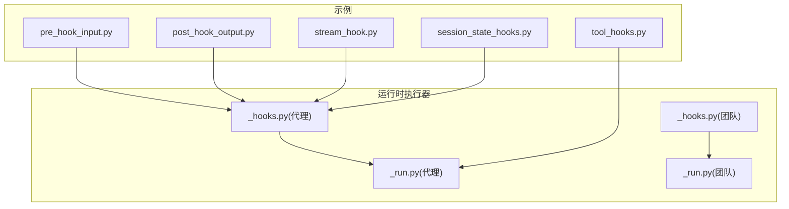
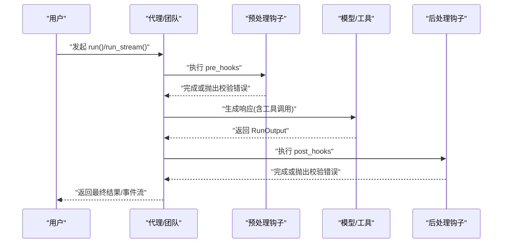
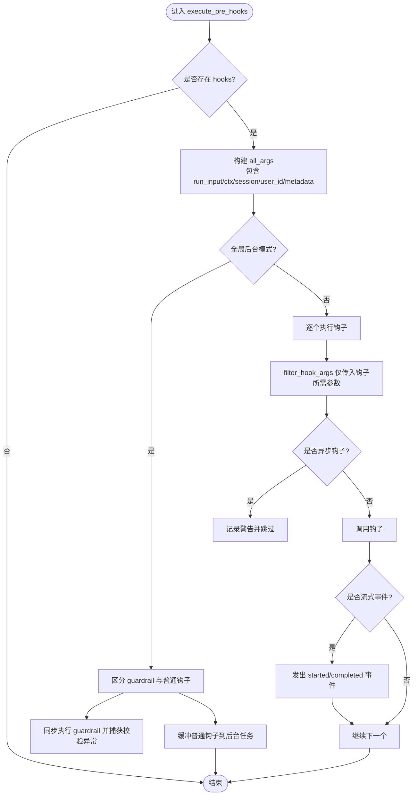
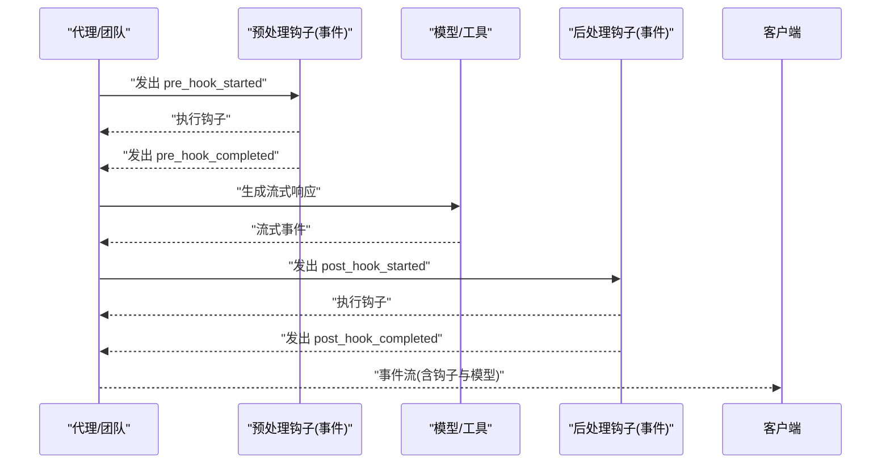
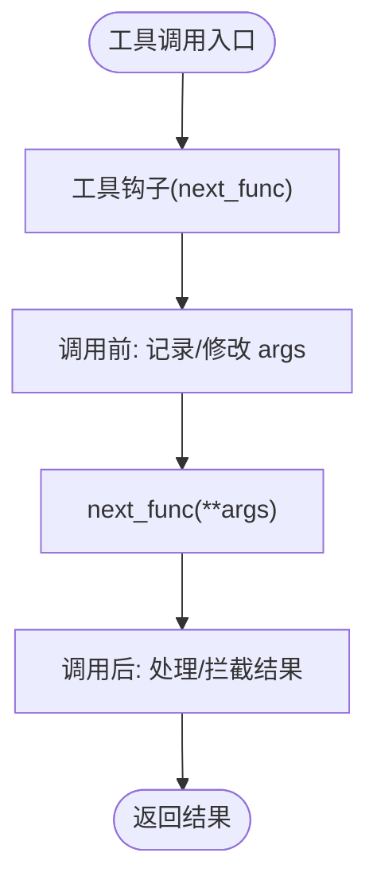
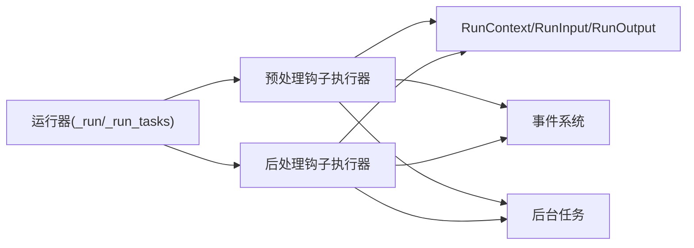

# 钩子系统

<cite>
**本文引用的文件**
- [libs/agno/agno/agent/_hooks.py](file://libs/agno/agno/agent/_hooks.py)
- [libs/agno/agno/team/_hooks.py](file://libs/agno/agno/team/_hooks.py)
- [libs/agno/agno/agent/_run.py](file://libs/agno/agno/agent/_run.py)
- [libs/agno/agno/team/_run.py](file://libs/agno/agno/team/_run.py)
- [cookbook/02_agents/09_hooks/pre_hook_input.py](file://cookbook/02_agents/09_hooks/pre_hook_input.py)
- [cookbook/02_agents/09_hooks/post_hook_output.py](file://cookbook/02_agents/09_hooks/post_hook_output.py)
- [cookbook/02_agents/09_hooks/stream_hook.py](file://cookbook/02_agents/09_hooks/stream_hook.py)
- [cookbook/02_agents/09_hooks/session_state_hooks.py](file://cookbook/02_agents/09_hooks/session_state_hooks.py)
- [cookbook/02_agents/09_hooks/tool_hooks.py](file://cookbook/02_agents/09_hooks/tool_hooks.py)
- [libs/agno/tests/integration/agent/test_event_streaming.py](file://libs/agno/tests/integration/agent/test_event_streaming.py)
- [libs/agno/tests/integration/teams/test_event_streaming.py](file://libs/agno/tests/integration/teams/test_event_streaming.py)
</cite>

## 目录
1. [简介](#简介)
2. [项目结构](#项目结构)
3. [核心组件](#核心组件)
4. [架构总览](#架构总览)
5. [详细组件分析](#详细组件分析)
6. [依赖关系分析](#依赖关系分析)
7. [性能考量](#性能考量)
8. [故障排查指南](#故障排查指南)
9. [结论](#结论)
10. [附录](#附录)

## 简介
本文件系统性阐述代理的钩子系统，覆盖以下主题：
- 预处理钩子：请求预处理、参数修改、前置检查
- 后处理钩子：响应后处理、结果转换、后置操作
- 流式钩子：实时数据处理、流式响应、状态更新
- 执行顺序与优先级：同步/异步、守护护栏与后台模式
- 实战示例：多场景应用、最佳实践、性能与调试建议
- 与中间件系统的集成与扩展机制

## 项目结构
钩子系统由“运行时执行器”和“示例/用法”两部分组成：
- 运行时执行器位于 libs/agno/agno 下，负责在 Agent/Team 的 run 生命周期中注入钩子逻辑，并支持事件流与后台任务
- 示例位于 cookbook/02_agents/09_hooks 下，演示输入校验、输出校验、会话状态更新、工具中间件等典型用法

图示来源
- [libs/agno/agno/agent/_hooks.py:1-470](file://libs/agno/agno/agent/_hooks.py#L1-L470)
- [libs/agno/agno/team/_hooks.py:1-624](file://libs/agno/agno/team/_hooks.py#L1-L624)
- [libs/agno/agno/agent/_run.py:323-705](file://libs/agno/agno/agent/_run.py#L323-L705)
- [libs/agno/agno/team/_run.py:174-474](file://libs/agno/agno/team/_run.py#L174-L474)
- [cookbook/02_agents/09_hooks/pre_hook_input.py:1-163](file://cookbook/02_agents/09_hooks/pre_hook_input.py#L1-L163)
- [cookbook/02_agents/09_hooks/post_hook_output.py:1-191](file://cookbook/02_agents/09_hooks/post_hook_output.py#L1-L191)
- [cookbook/02_agents/09_hooks/stream_hook.py:1-71](file://cookbook/02_agents/09_hooks/stream_hook.py#L1-L71)
- [cookbook/02_agents/09_hooks/session_state_hooks.py:1-89](file://cookbook/02_agents/09_hooks/session_state_hooks.py#L1-L89)
- [cookbook/02_agents/09_hooks/tool_hooks.py:1-53](file://cookbook/02_agents/09_hooks/tool_hooks.py#L1-L53)

章节来源
- [libs/agno/agno/agent/_hooks.py:1-470](file://libs/agno/agno/agent/_hooks.py#L1-L470)
- [libs/agno/agno/team/_hooks.py:1-624](file://libs/agno/agno/team/_hooks.py#L1-L624)
- [libs/agno/agno/agent/_run.py:323-705](file://libs/agno/agno/agent/_run.py#L323-L705)
- [libs/agno/agno/team/_run.py:174-474](file://libs/agno/agno/team/_run.py#L174-L474)

## 核心组件
- 预处理钩子执行器（代理/团队）
  - 负责按序执行 pre_hooks，支持过滤参数、事件流、守护护栏优先、后台任务
- 后处理钩子执行器（代理/团队）
  - 在模型响应生成后执行 post_hooks，同样支持过滤参数、事件流、守护护栏优先、后台任务
- 工具钩子（工具中间件）
  - 对每个工具调用进行包装，支持日志、计时、参数修改、结果拦截
- 运行时集成点
  - 代理：在 run() 与 run_stream() 中分别插入 pre_hooks 与 post_hooks
  - 团队：在任务循环前后插入 pre_hooks 与 post_hooks，并支持事件流

章节来源
- [libs/agno/agno/agent/_hooks.py:43-470](file://libs/agno/agno/agent/_hooks.py#L43-L470)
- [libs/agno/agno/team/_hooks.py:222-624](file://libs/agno/agno/team/_hooks.py#L222-L624)
- [libs/agno/agno/agent/_run.py:414-578](file://libs/agno/agno/agent/_run.py#L414-L578)
- [libs/agno/agno/team/_run.py:214-391](file://libs/agno/agno/team/_run.py#L214-L391)

## 架构总览
钩子系统在运行生命周期中的位置如下：

图示来源
- [libs/agno/agno/agent/_run.py:414-578](file://libs/agno/agno/agent/_run.py#L414-L578)
- [libs/agno/agno/team/_run.py:214-391](file://libs/agno/agno/team/_run.py#L214-L391)
- [libs/agno/agno/agent/_hooks.py:43-470](file://libs/agno/agno/agent/_hooks.py#L43-L470)
- [libs/agno/agno/team/_hooks.py:222-624](file://libs/agno/agno/team/_hooks.py#L222-L624)

## 详细组件分析

### 预处理钩子（Pre Hooks）
- 功能定位
  - 输入校验、参数增强、前置检查、会话状态初始化与更新
- 关键行为
  - 参数过滤：仅传递钩子函数签名所需的参数
  - 事件流：可选地发出“开始/完成”事件
  - 守护护栏优先：InputCheckError/OutputCheckError 必须同步传播，阻止后续副作用
  - 后台模式：@hook 装饰的钩子或全局后台模式下延迟执行非护栏钩子
  - 异步限制：同步 run() 不支持异步 pre_hook，会跳过并告警
- 典型用法
  - 输入验证：拒绝不安全/无关/信息不足的请求
  - 会话状态追踪：抽取话题、维护上下文
- 示例参考
  - 输入验证：[cookbook/02_agents/09_hooks/pre_hook_input.py:1-163](file://cookbook/02_agents/09_hooks/pre_hook_input.py#L1-L163)
  - 会话状态更新：[cookbook/02_agents/09_hooks/session_state_hooks.py:1-89](file://cookbook/02_agents/09_hooks/session_state_hooks.py#L1-L89)

图示来源
- [libs/agno/agno/agent/_hooks.py:43-154](file://libs/agno/agno/agent/_hooks.py#L43-L154)
- [libs/agno/agno/team/_hooks.py:222-320](file://libs/agno/agno/team/_hooks.py#L222-L320)

章节来源
- [libs/agno/agno/agent/_hooks.py:43-154](file://libs/agno/agno/agent/_hooks.py#L43-L154)
- [libs/agno/agno/team/_hooks.py:222-320](file://libs/agno/agno/team/_hooks.py#L222-L320)
- [cookbook/02_agents/09_hooks/pre_hook_input.py:26-81](file://cookbook/02_agents/09_hooks/pre_hook_input.py#L26-L81)
- [cookbook/02_agents/09_hooks/session_state_hooks.py:23-57](file://cookbook/02_agents/09_hooks/session_state_hooks.py#L23-L57)

### 后处理钩子（Post Hooks）
- 功能定位
  - 输出质量与安全校验、结果转换、副作用（如通知、归档）
- 关键行为
  - 与预处理钩子一致的参数过滤、事件流、守护护栏优先、后台模式
  - 异步限制：同步 run() 不支持异步 post_hook，会跳过并告警
- 典型用法
  - 输出质量校验（完整性、专业性、安全性）
  - 响应长度/格式约束
  - 发送通知、写入外部系统
- 示例参考
  - 输出质量校验：[cookbook/02_agents/09_hooks/post_hook_output.py:28-95](file://cookbook/02_agents/09_hooks/post_hook_output.py#L28-L95)
  - 简单长度校验：[cookbook/02_agents/09_hooks/post_hook_output.py:97-116](file://cookbook/02_agents/09_hooks/post_hook_output.py#L97-L116)
  - 流式通知：[cookbook/02_agents/09_hooks/stream_hook.py:17-33](file://cookbook/02_agents/09_hooks/stream_hook.py#L17-L33)

图示来源
- [libs/agno/agno/agent/_hooks.py:266-367](file://libs/agno/agno/agent/_hooks.py#L266-L367)
- [libs/agno/agno/team/_hooks.py:427-522](file://libs/agno/agno/team/_hooks.py#L427-L522)

章节来源
- [libs/agno/agno/agent/_hooks.py:266-367](file://libs/agno/agno/agent/_hooks.py#L266-L367)
- [libs/agno/agno/team/_hooks.py:427-522](file://libs/agno/agno/team/_hooks.py#L427-L522)
- [cookbook/02_agents/09_hooks/post_hook_output.py:28-95](file://cookbook/02_agents/09_hooks/post_hook_output.py#L28-L95)
- [cookbook/02_agents/09_hooks/post_hook_output.py:97-116](file://cookbook/02_agents/09_hooks/post_hook_output.py#L97-L116)
- [cookbook/02_agents/09_hooks/stream_hook.py:17-33](file://cookbook/02_agents/09_hooks/stream_hook.py#L17-L33)

### 流式钩子与事件流
- 事件流
  - 预/后处理钩子在执行开始与完成时可发出事件，便于前端或观测系统感知
- 流式响应
  - 代理/团队在 run_stream/_run_tasks_stream 中，将钩子事件与模型流式输出合并产出统一事件序列
- 示例参考
  - 事件流断言（代理/团队）：[libs/agno/tests/integration/agent/test_event_streaming.py:747-773](file://libs/agno/tests/integration/agent/test_event_streaming.py#L747-L773)、[libs/agno/tests/integration/teams/test_event_streaming.py:462-488](file://libs/agno/tests/integration/teams/test_event_streaming.py#L462-L488)

图示来源
- [libs/agno/agno/agent/_run.py:708-800](file://libs/agno/agno/agent/_run.py#L708-L800)
- [libs/agno/agno/team/_run.py:477-800](file://libs/agno/agno/team/_run.py#L477-L800)
- [libs/agno/agno/agent/_hooks.py:108-141](file://libs/agno/agno/agent/_hooks.py#L108-L141)
- [libs/agno/agno/team/_hooks.py:285-307](file://libs/agno/agno/team/_hooks.py#L285-L307)

章节来源
- [libs/agno/tests/integration/agent/test_event_streaming.py:747-773](file://libs/agno/tests/integration/agent/test_event_streaming.py#L747-L773)
- [libs/agno/tests/integration/teams/test_event_streaming.py:462-488](file://libs/agno/tests/integration/teams/test_event_streaming.py#L462-L488)

### 工具钩子（工具中间件）
- 作用域
  - 包裹每个工具调用，统一注入日志、计时、参数/结果拦截
- 行为特征
  - 接收函数名、原始函数、参数字典；必须调用 next_func(**args) 继续链路
  - 可在调用前后读取/修改参数与结果
- 示例参考
  - 日志与计时：[cookbook/02_agents/09_hooks/tool_hooks.py:19-32](file://cookbook/02_agents/09_hooks/tool_hooks.py#L19-L32)

图示来源
- [cookbook/02_agents/09_hooks/tool_hooks.py:19-32](file://cookbook/02_agents/09_hooks/tool_hooks.py#L19-L32)

章节来源
- [cookbook/02_agents/09_hooks/tool_hooks.py:1-53](file://cookbook/02_agents/09_hooks/tool_hooks.py#L1-L53)

### 执行顺序与优先级管理
- 顺序
  - 预处理 → 模型/工具 → 后处理
- 优先级
  - 守护护栏钩子（抛出 InputCheckError/OutputCheckError）必须同步执行，确保拒绝副作用提前发生
  - 普通钩子可缓冲至后台，待所有护栏通过后再执行
- 异步限制
  - 同步 run() 不支持异步钩子，异步钩子需使用 arun()/aprint_response()

章节来源
- [libs/agno/agno/agent/_hooks.py:74-98](file://libs/agno/agno/agent/_hooks.py#L74-L98)
- [libs/agno/agno/team/_hooks.py:255-276](file://libs/agno/agno/team/_hooks.py#L255-L276)
- [libs/agno/agno/agent/_hooks.py:341-346](file://libs/agno/agno/agent/_hooks.py#L341-L346)

## 依赖关系分析
- 组件耦合
  - 钩子执行器与运行器强耦合：在 run/_run_tasks 生命周期内被调用
  - 钩子与上下文解耦：通过参数过滤仅传递所需字段
- 外部依赖
  - 事件系统：用于流式事件与持久化
  - 后台任务：用于缓冲非护栏钩子
- 循环依赖
  - 无直接循环；钩子仅消费上下文，不反向依赖运行器

图示来源
- [libs/agno/agno/agent/_run.py:414-578](file://libs/agno/agno/agent/_run.py#L414-L578)
- [libs/agno/agno/team/_run.py:214-391](file://libs/agno/agno/team/_run.py#L214-L391)
- [libs/agno/agno/agent/_hooks.py:43-470](file://libs/agno/agno/agent/_hooks.py#L43-L470)
- [libs/agno/agno/team/_hooks.py:222-624](file://libs/agno/agno/team/_hooks.py#L222-L624)

章节来源
- [libs/agno/agno/agent/_run.py:414-578](file://libs/agno/agno/agent/_run.py#L414-L578)
- [libs/agno/agno/team/_run.py:214-391](file://libs/agno/agno/team/_run.py#L214-L391)

## 性能考量
- 同步 vs 异步
  - 同步 run() 不执行异步钩子，避免阻塞与竞态
- 后台模式
  - 将非护栏钩子放入后台，减少主路径延迟，提升吞吐
- 事件流
  - 事件发射与流式输出并行，注意事件序列与响应序列的合并成本
- 工具钩子
  - 日志/计时开销可控，建议仅在调试阶段启用

## 故障排查指南
- 常见问题
  - 钩子抛出 InputCheckError/OutputCheckError：立即终止并返回错误状态
  - 异步钩子在同步 run() 中被跳过：改用异步接口或移除异步钩子
  - 事件流缺失：确认 stream_events 开关与钩子事件发出逻辑
- 调试建议
  - 使用测试断言核对事件数量与顺序（见测试文件）
  - 在钩子内部记录元数据与上下文，便于回溯
  - 分离护栏钩子与副作用钩子，确保护栏钩子同步执行

章节来源
- [libs/agno/tests/integration/agent/test_event_streaming.py:747-773](file://libs/agno/tests/integration/agent/test_event_streaming.py#L747-L773)
- [libs/agno/tests/integration/teams/test_event_streaming.py:462-488](file://libs/agno/tests/integration/teams/test_event_streaming.py#L462-L488)
- [libs/agno/agno/agent/_hooks.py:143-148](file://libs/agno/agno/agent/_hooks.py#L143-L148)
- [libs/agno/agno/team/_hooks.py:311-314](file://libs/agno/agno/team/_hooks.py#L311-L314)

## 结论
钩子系统通过“守护护栏优先+后台缓冲”的策略，在保证安全与一致性的同时，兼顾性能与可观测性。预/后处理钩子与工具中间件共同构成可扩展的治理层，配合事件流与后台任务，满足从单代理到多成员团队的复杂场景。

## 附录

### 实战示例索引
- 输入验证（预处理钩子）
  - [cookbook/02_agents/09_hooks/pre_hook_input.py:1-163](file://cookbook/02_agents/09_hooks/pre_hook_input.py#L1-L163)
- 输出质量校验（后处理钩子）
  - [cookbook/02_agents/09_hooks/post_hook_output.py:1-191](file://cookbook/02_agents/09_hooks/post_hook_output.py#L1-L191)
- 流式通知（后处理钩子）
  - [cookbook/02_agents/09_hooks/stream_hook.py:1-71](file://cookbook/02_agents/09_hooks/stream_hook.py#L1-L71)
- 会话状态追踪（预处理钩子）
  - [cookbook/02_agents/09_hooks/session_state_hooks.py:1-89](file://cookbook/02_agents/09_hooks/session_state_hooks.py#L1-L89)
- 工具中间件（日志/计时）
  - [cookbook/02_agents/09_hooks/tool_hooks.py:1-53](file://cookbook/02_agents/09_hooks/tool_hooks.py#L1-L53)