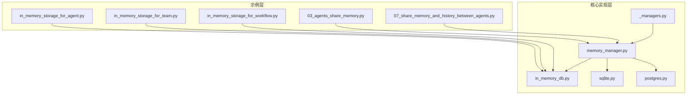
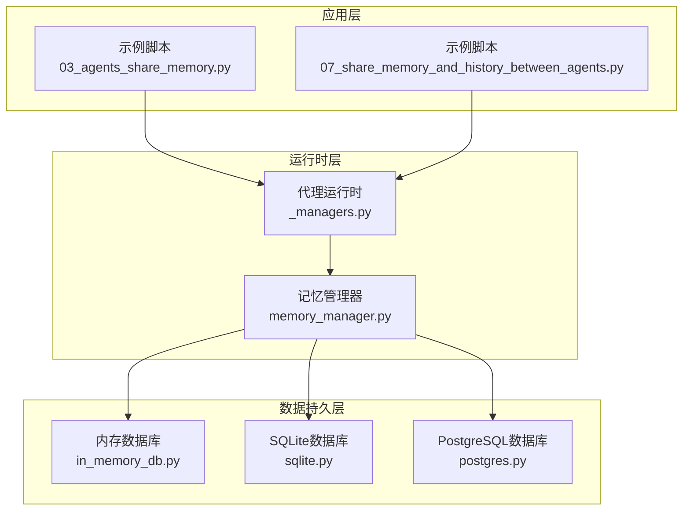
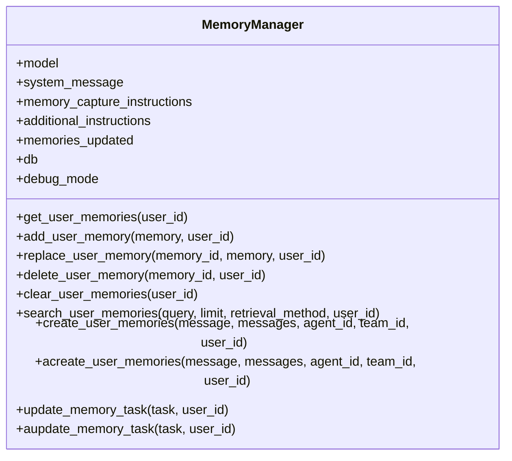
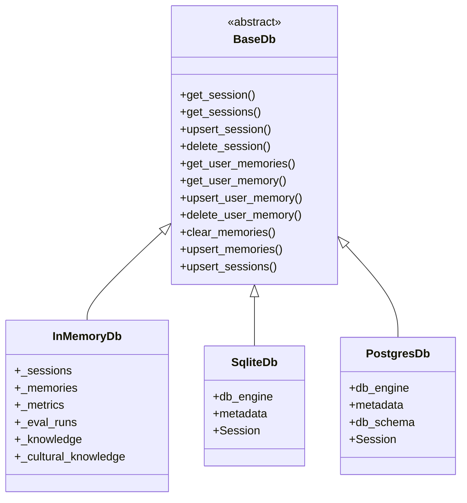
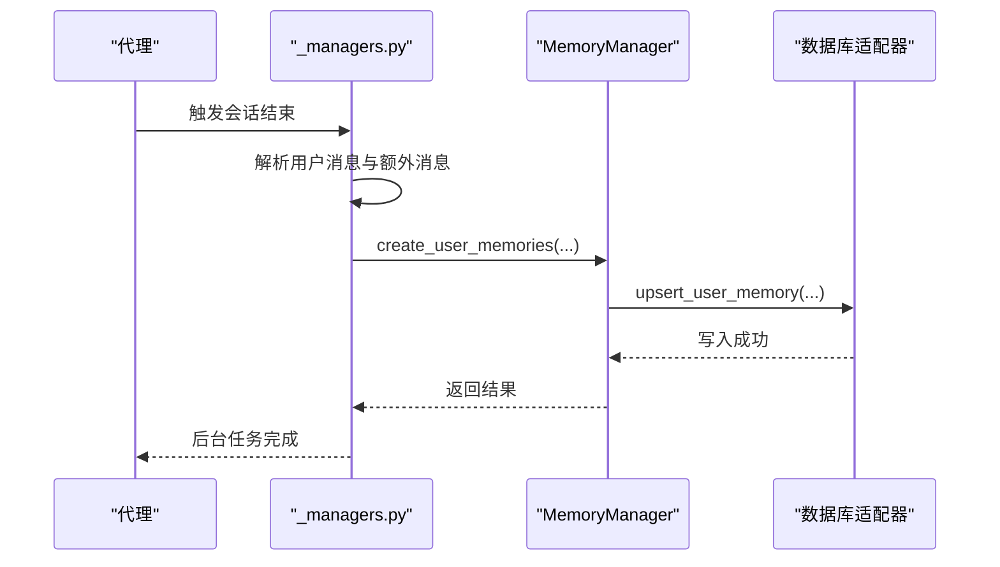
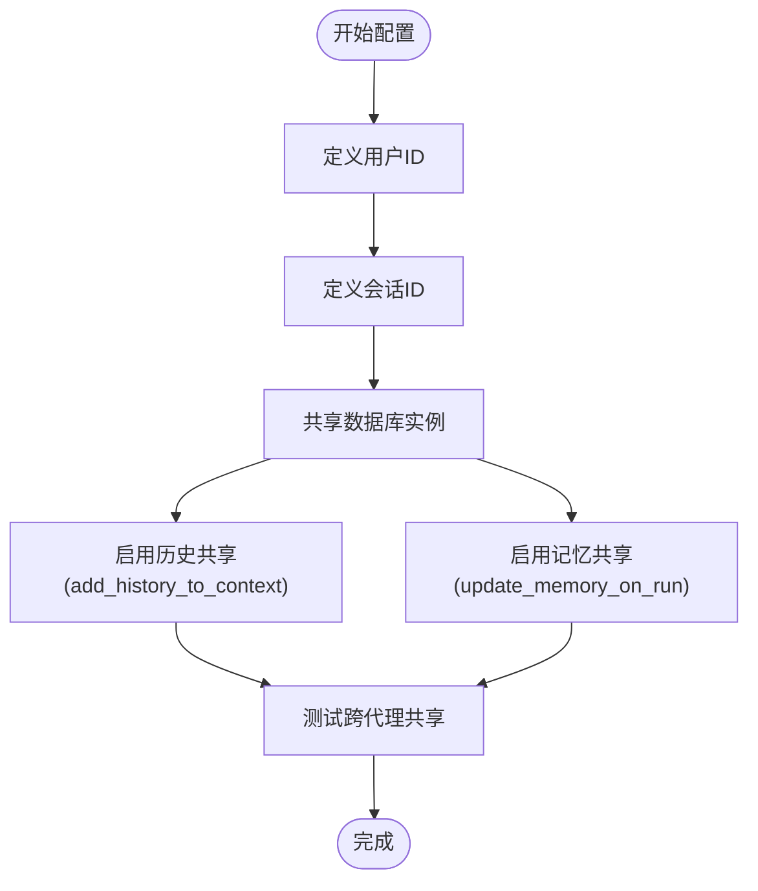
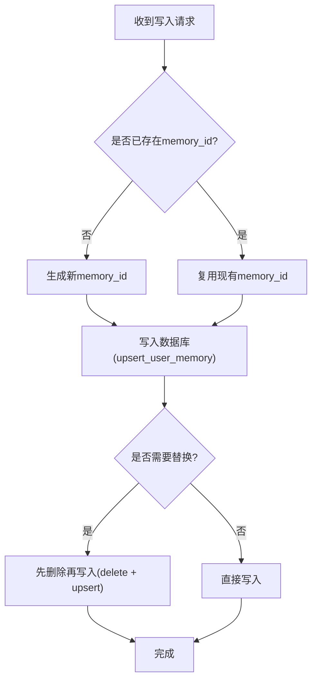
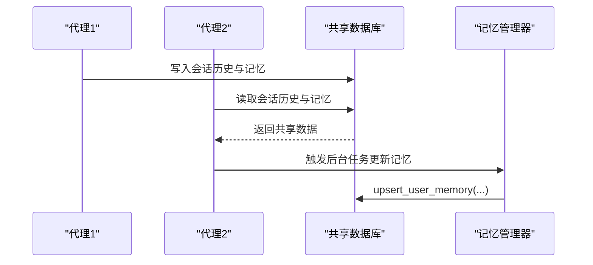
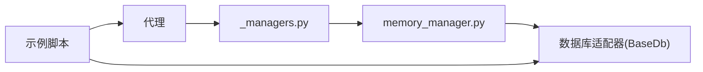

# 代理共享内存

<cite>
**本文档引用的文件**
- [03_agents_share_memory.py](file://cookbook/11_memory/03_agents_share_memory.py)
- [07_share_memory_and_history_between_agents.py](file://cookbook/11_memory/07_share_memory_and_history_between_agents.py)
- [memory_manager.py](file://libs/agno/agno/memory/manager.py)
- [in_memory_db.py](file://libs/agno/agno/db/in_memory/in_memory_db.py)
- [sqlite.py](file://libs/agno/agno/db/sqlite/sqlite.py)
- [postgres.py](file://libs/agno/agno/db/postgres/postgres.py)
- [_managers.py](file://libs/agno/agno/agent/_managers.py)
- [share_session_with_agent.md](file://cookbook/03_teams/07_session/share_session_with_agent.md)
- [in_memory_storage_for_agent.py](file://cookbook/06_storage/in_memory/in_memory_storage_for_agent.py)
- [in_memory_storage_for_team.py](file://cookbook/06_storage/in_memory/in_memory_storage_for_team.py)
- [in_memory_storage_for_workflow.py](file://cookbook/06_storage/in_memory/in_memory_storage_for_workflow.py)
- [README.md](file://cookbook/06_storage/in_memory/README.md)
</cite>

## 目录
1. [简介](#简介)
2. [项目结构](#项目结构)
3. [核心组件](#核心组件)
4. [架构总览](#架构总览)
5. [详细组件分析](#详细组件分析)
6. [依赖关系分析](#依赖关系分析)
7. [性能考虑](#性能考虑)
8. [故障排除指南](#故障排除指南)
9. [结论](#结论)
10. [附录](#附录)

## 简介
本文件系统性阐述代理共享内存功能的设计与实现，围绕以下主题展开：
- 代理间内存共享的机制与架构：如何通过共享数据库实现跨代理的记忆与会话历史共享
- 共享策略与访问控制：基于用户ID、会话ID的分区键策略，以及可选的权限控制思路
- 数据一致性保障：事务与幂等写入、批量操作优化
- 冲突解决机制：并发写入场景下的仲裁与解决方案
- 权限控制系统：角色管理、权限验证与访问审计的实现路径
- 多代理协作集成：状态同步、事件传播与协调机制
- 配置方法与最佳实践：共享范围定义、权限设置与安全策略

## 项目结构
本仓库提供了多种共享内存的示例与实现：
- 示例层：cookbook中的多个示例展示了不同场景下的共享方式（如两个代理共享记忆、同时共享会话历史与记忆）
- 核心实现层：内存管理器负责记忆的增删改查与检索；数据库适配器提供统一的持久化接口（SQLite、PostgreSQL、内存数据库）
- 代理运行时层：代理运行时在每次会话中触发后台任务，自动完成记忆的创建与更新

**图表来源**
- [03_agents_share_memory.py:1-61](file://cookbook/11_memory/03_agents_share_memory.py#L1-L61)
- [07_share_memory_and_history_between_agents.py:1-67](file://cookbook/11_memory/07_share_memory_and_history_between_agents.py#L1-L67)
- [memory_manager.py:44-120](file://libs/agno/agno/memory/manager.py#L44-L120)
- [in_memory_db.py:27-60](file://libs/agno/agno/db/in_memory/in_memory_db.py#L27-L60)
- [sqlite.py:44-120](file://libs/agno/agno/db/sqlite/sqlite.py#L44-L120)
- [postgres.py:60-120](file://libs/agno/agno/db/postgres/postgres.py#L60-L120)
- [_managers.py:29-81](file://libs/agno/agno/agent/_managers.py#L29-L81)

**章节来源**
- [03_agents_share_memory.py:1-61](file://cookbook/11_memory/03_agents_share_memory.py#L1-L61)
- [07_share_memory_and_history_between_agents.py:1-67](file://cookbook/11_memory/07_share_memory_and_history_between_agents.py#L1-L67)
- [memory_manager.py:44-120](file://libs/agno/agno/memory/manager.py#L44-L120)
- [in_memory_db.py:27-60](file://libs/agno/agno/db/in_memory/in_memory_db.py#L27-L60)
- [sqlite.py:44-120](file://libs/agno/agno/db/sqlite/sqlite.py#L44-L120)
- [postgres.py:60-120](file://libs/agno/agno/db/postgres/postgres.py#L60-L120)
- [_managers.py:29-81](file://libs/agno/agno/agent/_managers.py#L29-L81)

## 核心组件
- 内存管理器（MemoryManager）：负责记忆的创建、检索、更新、删除与搜索，支持同步与异步操作，并提供检索策略（最近N条、最早N条、智能检索）
- 数据库适配器：提供统一的持久化接口，支持SQLite、PostgreSQL与内存数据库三种实现
- 代理运行时管理器（_managers.py）：在每次会话运行后触发后台任务，自动将对话消息转换为记忆并写入数据库

关键职责与交互：
- 代理运行时在会话结束时调用后台任务，将用户消息与额外消息写入记忆管理器
- 记忆管理器通过数据库适配器进行读写，实现跨代理共享
- 通过用户ID与会话ID作为分区键，确保不同用户与会话的历史与记忆相互隔离

**章节来源**
- [memory_manager.py:165-243](file://libs/agno/agno/memory/manager.py#L165-L243)
- [memory_manager.py:588-791](file://libs/agno/agno/memory/manager.py#L588-L791)
- [_managers.py:29-81](file://libs/agno/agno/agent/_managers.py#L29-L81)
- [_managers.py:212-251](file://libs/agno/agno/agent/_managers.py#L212-L251)

## 架构总览
代理共享内存的整体架构由三层构成：
- 应用层：示例脚本与业务逻辑，定义用户ID、会话ID与数据库连接
- 运行时层：代理运行时在每次会话后触发记忆后台任务
- 数据持久层：数据库适配器统一提供会话与记忆的读写能力

**图表来源**
- [03_agents_share_memory.py:17-36](file://cookbook/11_memory/03_agents_share_memory.py#L17-L36)
- [07_share_memory_and_history_between_agents.py:18-37](file://cookbook/11_memory/07_share_memory_and_history_between_agents.py#L18-L37)
- [_managers.py:29-81](file://libs/agno/agno/agent/_managers.py#L29-L81)
- [memory_manager.py:44-120](file://libs/agno/agno/memory/manager.py#L44-L120)
- [in_memory_db.py:27-60](file://libs/agno/agno/db/in_memory/in_memory_db.py#L27-L60)
- [sqlite.py:44-120](file://libs/agno/agno/db/sqlite/sqlite.py#L44-L120)
- [postgres.py:60-120](file://libs/agno/agno/db/postgres/postgres.py#L60-L120)

## 详细组件分析

### 内存管理器（MemoryManager）
- 功能特性
  - 用户记忆的增删改查：add_user_memory、get_user_memories、replace_user_memory、delete_user_memory、clear_user_memories
  - 异步操作：acreate_user_memories、aupdate_memory_task、aget_user_memories
  - 检索策略：last_n、first_n、agentic（基于模型的语义检索）
  - 搜索响应格式：原生结构化输出、JSON Schema或JSON对象
- 并发与一致性
  - 批量操作：upsert_memories、upsert_sessions提供批量写入能力
  - 异常处理：对数据库异常进行捕获与告警
- 性能优化
  - 按需排序与分页：apply_sorting、分页参数
  - 智能检索：基于模型的agentic搜索减少无关数据扫描

**图表来源**
- [memory_manager.py:44-120](file://libs/agno/agno/memory/manager.py#L44-L120)
- [memory_manager.py:165-243](file://libs/agno/agno/memory/manager.py#L165-L243)
- [memory_manager.py:588-791](file://libs/agno/agno/memory/manager.py#L588-L791)

**章节来源**
- [memory_manager.py:165-243](file://libs/agno/agno/memory/manager.py#L165-L243)
- [memory_manager.py:588-791](file://libs/agno/agno/memory/manager.py#L588-L791)

### 数据库适配器（InMemoryDb、SqliteDb、PostgresDb）
- 共同接口
  - 会话管理：get_session、get_sessions、upsert_session、delete_session、rename_session
  - 记忆管理：get_user_memories、get_user_memory、upsert_user_memory、delete_user_memory、clear_memories
  - 批量操作：upsert_memories、upsert_sessions
- 一致性与事务
  - SQLite与PostgreSQL提供SQLAlchemy事务封装，确保写入一致性
  - 内存数据库采用深拷贝与列表操作，保证线程内一致性
- 性能特性
  - SQLite与PostgreSQL支持索引与分页，适合生产环境
  - 内存数据库适合本地开发与测试

**图表来源**
- [in_memory_db.py:27-60](file://libs/agno/agno/db/in_memory/in_memory_db.py#L27-L60)
- [sqlite.py:44-120](file://libs/agno/agno/db/sqlite/sqlite.py#L44-L120)
- [postgres.py:60-120](file://libs/agno/agno/db/postgres/postgres.py#L60-L120)

**章节来源**
- [in_memory_db.py:107-193](file://libs/agno/agno/db/in_memory/in_memory_db.py#L107-L193)
- [in_memory_db.py:490-543](file://libs/agno/agno/db/in_memory/in_memory_db.py#L490-L543)
- [sqlite.py:651-800](file://libs/agno/agno/db/sqlite/sqlite.py#L651-L800)
- [postgres.py:660-800](file://libs/agno/agno/db/postgres/postgres.py#L660-L800)

### 代理运行时管理器（_managers.py）
- 后台任务
  - make_memories：在会话结束后将用户消息与额外消息写入记忆管理器
  - 异步版本amake_memories：支持异步运行
  - 任务调度：取消旧任务并启动新任务，避免重复执行
- 与记忆管理器的协作
  - 条件触发：仅当启用记忆更新且未启用“代理式记忆”时才写入
  - 错误处理：对消息类型校验失败进行告警

**图表来源**
- [_managers.py:29-81](file://libs/agno/agno/agent/_managers.py#L29-L81)
- [memory_manager.py:368-422](file://libs/agno/agno/memory/manager.py#L368-L422)
- [in_memory_db.py:599-628](file://libs/agno/agno/db/in_memory/in_memory_db.py#L599-L628)

**章节来源**
- [_managers.py:29-81](file://libs/agno/agno/agent/_managers.py#L29-L81)
- [_managers.py:139-174](file://libs/agno/agno/agent/_managers.py#L139-L174)
- [_managers.py:212-251](file://libs/agno/agno/agent/_managers.py#L212-L251)

### 共享策略与配置方法
- 共享范围定义
  - 用户级共享：通过相同user_id实现跨代理的记忆共享
  - 会话级共享：通过相同session_id实现跨代理的会话历史共享
- 权限设置与安全策略
  - 当前实现未内置细粒度权限控制，建议通过外部鉴权服务或中间件在入口处进行权限校验
  - 数据库层面可通过表级权限与连接字符串限制访问范围
- 配置要点
  - 两个代理共享同一数据库实例（如PostgreSQL或SQLite）
  - 设置相同的user_id与session_id
  - 启用add_history_to_context与update_memory_on_run

**图表来源**
- [03_agents_share_memory.py:23-36](file://cookbook/11_memory/03_agents_share_memory.py#L23-L36)
- [07_share_memory_and_history_between_agents.py:23-37](file://cookbook/11_memory/07_share_memory_and_history_between_agents.py#L23-L37)

**章节来源**
- [03_agents_share_memory.py:23-36](file://cookbook/11_memory/03_agents_share_memory.py#L23-L36)
- [07_share_memory_and_history_between_agents.py:23-37](file://cookbook/11_memory/07_share_memory_and_history_between_agents.py#L23-L37)

### 冲突解决机制
- 并发写入场景
  - 内存数据库：采用列表操作与深拷贝，避免竞态条件
  - SQLite/PostgreSQL：通过事务与唯一约束保证幂等写入
- 仲裁策略
  - 基于时间戳的更新：updated_at字段确保最新写入覆盖旧数据
  - 批量写入：upsert_memories与upsert_sessions减少多次往返
- 解决方案
  - 写入前校验：检查memory_id是否存在，不存在则生成新ID
  - 删除与替换：delete_user_memory配合upsert_user_memory实现原子替换

**图表来源**
- [memory_manager.py:211-243](file://libs/agno/agno/memory/manager.py#L211-L243)
- [memory_manager.py:244-274](file://libs/agno/agno/memory/manager.py#L244-L274)
- [in_memory_db.py:599-628](file://libs/agno/agno/db/in_memory/in_memory_db.py#L599-L628)

**章节来源**
- [memory_manager.py:211-274](file://libs/agno/agno/memory/manager.py#L211-L274)
- [in_memory_db.py:599-628](file://libs/agno/agno/db/in_memory/in_memory_db.py#L599-L628)

### 权限控制系统
- 角色管理
  - 通过外部RBAC系统或中间件在入口处进行角色与权限校验
- 权限验证
  - 在数据库连接层限制访问范围（如只读/读写）
  - 在应用层对user_id与session_id进行白名单校验
- 访问审计
  - 记录数据库操作日志，包括写入时间、操作者、受影响的记录ID
  - 结合数据库审计功能（如PostgreSQL的审计扩展）

[本节为通用指导，不直接分析具体文件，故无“章节来源”]

### 多代理协作集成
- 状态同步
  - 通过共享数据库实现团队与成员的状态同步
  - 支持在团队层与成员层分别启用状态管理
- 事件传播
  - 代理运行时在会话结束时触发后台任务，自动传播记忆与文化知识
- 协调机制
  - 通过会话ID与用户ID实现跨代理的上下文共享
  - 示例中展示了两个代理共享会话历史与记忆的完整流程

**图表来源**
- [07_share_memory_and_history_between_agents.py:46-66](file://cookbook/11_memory/07_share_memory_and_history_between_agents.py#L46-L66)
- [_managers.py:29-81](file://libs/agno/agno/agent/_managers.py#L29-L81)
- [in_memory_db.py:490-543](file://libs/agno/agno/db/in_memory/in_memory_db.py#L490-L543)

**章节来源**
- [07_share_memory_and_history_between_agents.py:46-66](file://cookbook/11_memory/07_share_memory_and_history_between_agents.py#L46-L66)
- [_managers.py:29-81](file://libs/agno/agno/agent/_managers.py#L29-L81)

## 依赖关系分析
- 组件耦合
  - 代理运行时与记忆管理器松耦合：通过接口调用，便于替换实现
  - 记忆管理器与数据库适配器松耦合：通过BaseDb抽象，支持多后端
- 直接依赖
  - 代理运行时依赖记忆管理器
  - 记忆管理器依赖数据库适配器
  - 示例脚本依赖代理与数据库适配器
- 外部依赖
  - SQLAlchemy（SQLite/PostgreSQL）
  - 数据库驱动（PostgreSQL使用psycopg2）

**图表来源**
- [_managers.py:29-81](file://libs/agno/agno/agent/_managers.py#L29-L81)
- [memory_manager.py:44-120](file://libs/agno/agno/memory/manager.py#L44-L120)
- [sqlite.py:44-120](file://libs/agno/agno/db/sqlite/sqlite.py#L44-L120)
- [postgres.py:60-120](file://libs/agno/agno/db/postgres/postgres.py#L60-L120)

**章节来源**
- [_managers.py:29-81](file://libs/agno/agno/agent/_managers.py#L29-L81)
- [memory_manager.py:44-120](file://libs/agno/agno/memory/manager.py#L44-L120)
- [sqlite.py:44-120](file://libs/agno/agno/db/sqlite/sqlite.py#L44-L120)
- [postgres.py:60-120](file://libs/agno/agno/db/postgres/postgres.py#L60-L120)

## 性能考虑
- 读写路径
  - 读取：优先从数据库缓存（内存数据库）或索引（SQLite/PostgreSQL）获取
  - 写入：批量upsert减少往返次数，异步任务避免阻塞主线程
- 索引与分页
  - SQLite/PostgreSQL支持复合索引与分页，提升查询性能
- 并发与锁
  - 内存数据库采用列表与深拷贝，避免锁竞争
  - SQLite/PostgreSQL通过事务与唯一约束保证一致性

[本节提供通用指导，不直接分析具体文件，故无“章节来源”]

## 故障排除指南
- 常见问题
  - 记忆未更新：检查update_memory_on_run与enable_agentic_memory配置
  - 数据库连接失败：确认数据库URL与驱动安装
  - 权限不足：检查数据库用户权限与连接字符串
- 排查步骤
  - 启用调试日志：MemoryManager的debug_mode
  - 核对user_id与session_id：确保两个代理使用相同的分区键
  - 检查后台任务：确认_managers.py中的任务已启动

**章节来源**
- [memory_manager.py:154-160](file://libs/agno/agno/memory/manager.py#L154-L160)
- [03_agents_share_memory.py:23-36](file://cookbook/11_memory/03_agents_share_memory.py#L23-L36)
- [07_share_memory_and_history_between_agents.py:23-37](file://cookbook/11_memory/07_share_memory_and_history_between_agents.py#L23-L37)

## 结论
代理共享内存通过“共享数据库+分区键”的设计，在不引入复杂分布式锁的前提下实现了跨代理的记忆与会话历史共享。结合后台任务与检索策略，系统在可用性与性能之间取得平衡。对于更严格的权限控制与审计需求，建议在应用层与数据库层叠加安全措施。

[本节为总结性内容，不直接分析具体文件，故无“章节来源”]

## 附录

### 使用示例与最佳实践
- 示例脚本
  - 两个代理共享记忆：[03_agents_share_memory.py:1-61](file://cookbook/11_memory/03_agents_share_memory.py#L1-L61)
  - 两个代理共享会话历史与记忆：[07_share_memory_and_history_between_agents.py:1-67](file://cookbook/11_memory/07_share_memory_and_history_between_agents.py#L1-L67)
  - 内存数据库示例：[in_memory_storage_for_agent.py](file://cookbook/06_storage/in_memory/in_memory_storage_for_agent.py)
  - 团队与工作流示例：[in_memory_storage_for_team.py](file://cookbook/06_storage/in_memory/in_memory_storage_for_team.py)，[in_memory_storage_for_workflow.py](file://cookbook/06_storage/in_memory/in_memory_storage_for_workflow.py)
- 最佳实践
  - 明确共享范围：严格区分user_id与session_id的作用域
  - 启用异步任务：避免阻塞代理响应
  - 合理选择数据库：生产环境优先考虑SQLite/PostgreSQL
  - 审计与监控：记录数据库操作日志，定期检查一致性

**章节来源**
- [03_agents_share_memory.py:1-61](file://cookbook/11_memory/03_agents_share_memory.py#L1-L61)
- [07_share_memory_and_history_between_agents.py:1-67](file://cookbook/11_memory/07_share_memory_and_history_between_agents.py#L1-L67)
- [README.md:96-117](file://cookbook/06_storage/in_memory/README.md#L96-L117)