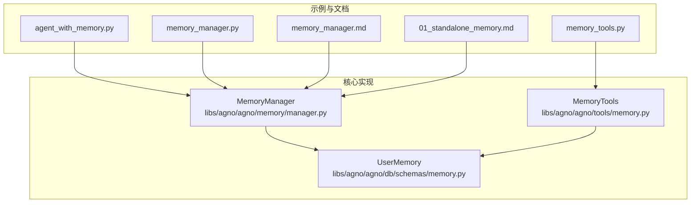
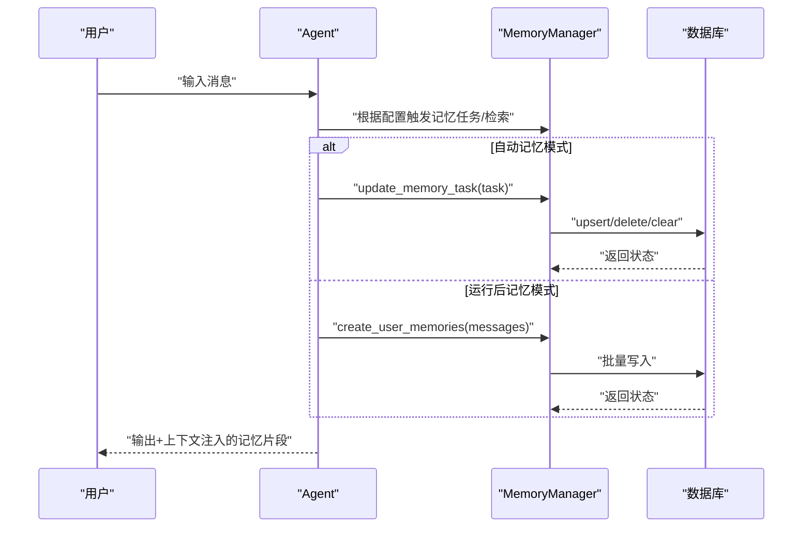
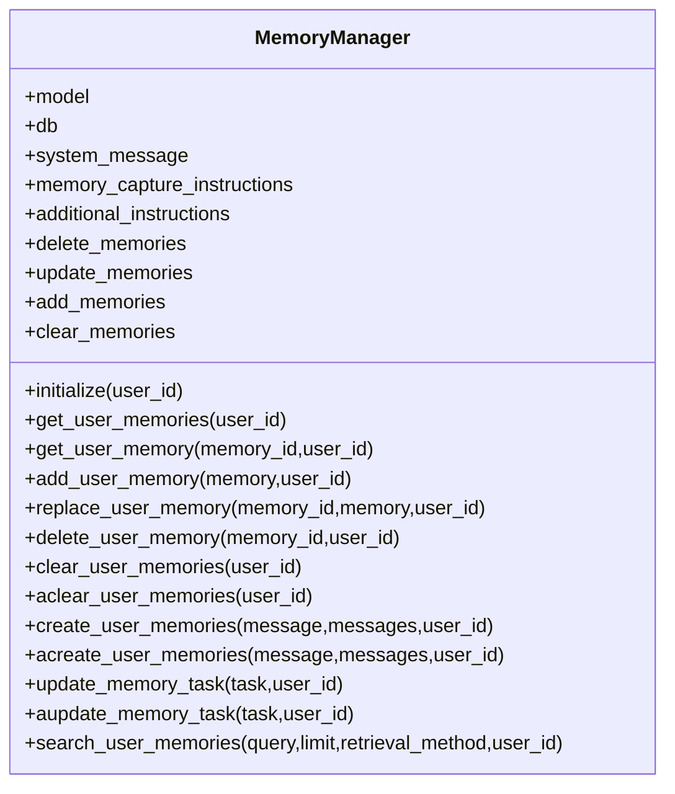
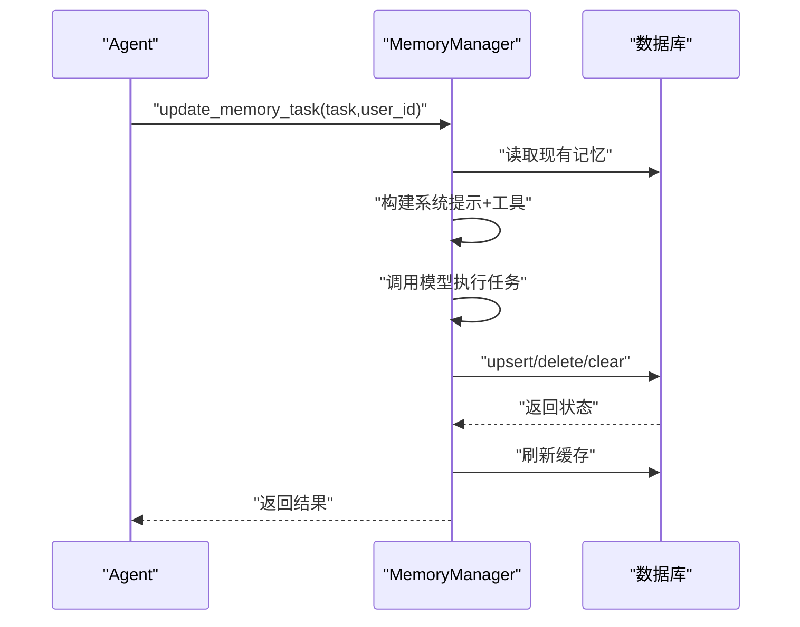
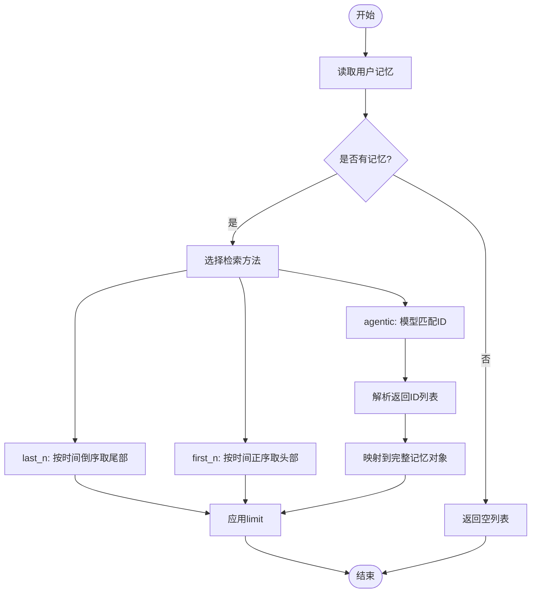
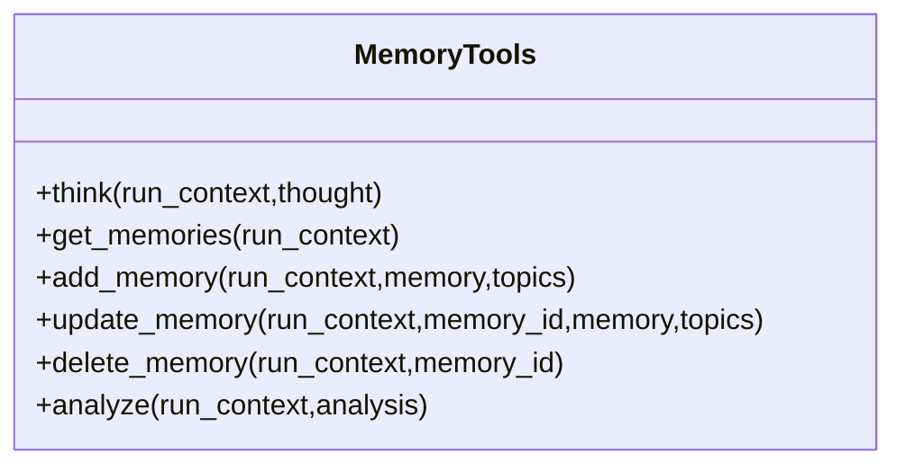
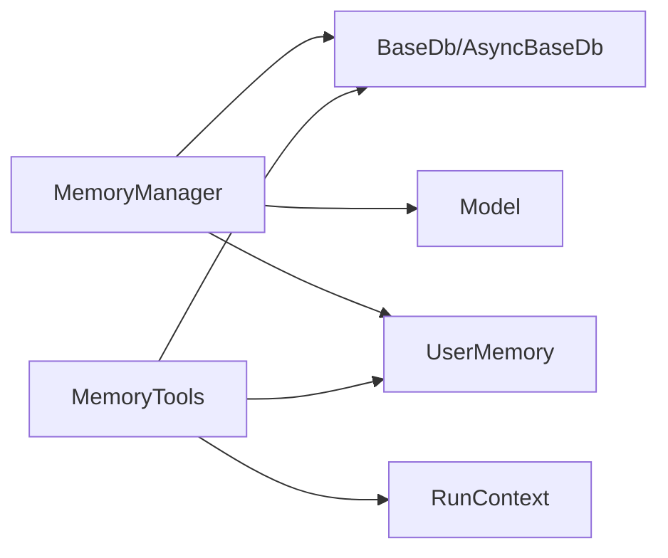

# 代理内存

<cite>
**本文引用的文件**
- [libs/agno/agno/memory/manager.py](file://libs/agno/agno/memory/manager.py)
- [libs/agno/agno/tools/memory.py](file://libs/agno/agno/tools/memory.py)
- [libs/agno/agno/db/schemas/memory.py](file://libs/agno/agno/db/schemas/memory.py)
- [cookbook/00_quickstart/agent_with_memory.py](file://cookbook/00_quickstart/agent_with_memory.py)
- [cookbook/02_agents/06_memory_and_learning/memory_manager.py](file://cookbook/02_agents/06_memory_and_learning/memory_manager.py)
- [cookbook/10_reasoning/tools/memory_tools.py](file://cookbook/10_reasoning/tools/memory_tools.py)
- [cookbook/11_memory/memory_manager/01_standalone_memory.md](file://cookbook/11_memory/memory_manager/01_standalone_memory.md)
- [cookbook/02_agents/06_memory_and_learning/memory_manager.md](file://cookbook/02_agents/06_memory_and_learning/memory_manager.md)
- [libs/agno/tests/integration/db/surrealdb/test_surrealdb_memory.py](file://libs/agno/tests/integration/db/surrealdb/test_surrealdb_memory.py)
</cite>

## 目录
1. [简介](#简介)
2. [项目结构](#项目结构)
3. [核心组件](#核心组件)
4. [架构总览](#架构总览)
5. [详细组件分析](#详细组件分析)
6. [依赖关系分析](#依赖关系分析)
7. [性能考量](#性能考量)
8. [故障排查指南](#故障排查指南)
9. [结论](#结论)
10. [附录](#附录)

## 简介
本文件系统化阐述代理内存（Agent Memory）的设计与实现，覆盖以下方面：
- 内存初始化与生命周期管理
- 记忆更新的触发条件、执行流程与冲突处理
- 记忆检索的实现原理、查询优化与结果排序
- 与会话管理、知识库、工具系统的集成方式
- 使用示例与最佳实践

目标是帮助开发者正确配置与使用代理内存功能，确保在不同运行模式下稳定、高效地持久化用户偏好与上下文。

## 项目结构
围绕代理内存的关键代码分布在如下模块：
- 记忆管理器：负责记忆的增删改查、检索与优化
- 记忆工具集：封装 CRUD 工具，供代理或人类在运行期直接调用
- 数据模型：统一的记忆数据结构与序列化
- 示例与文档：快速上手、架构分层与工作流说明

**图表来源**
- [cookbook/00_quickstart/agent_with_memory.py:1-158](file://cookbook/00_quickstart/agent_with_memory.py#L1-L158)
- [cookbook/02_agents/06_memory_and_learning/memory_manager.py:1-48](file://cookbook/02_agents/06_memory_and_learning/memory_manager.py#L1-L48)
- [cookbook/02_agents/06_memory_and_learning/memory_manager.md:19-147](file://cookbook/02_agents/06_memory_and_learning/memory_manager.md#L19-L147)
- [cookbook/10_reasoning/tools/memory_tools.py:1-60](file://cookbook/10_reasoning/tools/memory_tools.py#L1-L60)
- [cookbook/11_memory/memory_manager/01_standalone_memory.md:42-89](file://cookbook/11_memory/memory_manager/01_standalone_memory.md#L42-L89)
- [libs/agno/agno/memory/manager.py:1-800](file://libs/agno/agno/memory/manager.py#L1-L800)
- [libs/agno/agno/tools/memory.py:1-421](file://libs/agno/agno/tools/memory.py#L1-L421)
- [libs/agno/agno/db/schemas/memory.py:1-58](file://libs/agno/agno/db/schemas/memory.py#L1-L58)

**章节来源**
- [cookbook/00_quickstart/agent_with_memory.py:1-158](file://cookbook/00_quickstart/agent_with_memory.py#L1-L158)
- [cookbook/02_agents/06_memory_and_learning/memory_manager.py:1-48](file://cookbook/02_agents/06_memory_and_learning/memory_manager.py#L1-L48)
- [cookbook/02_agents/06_memory_and_learning/memory_manager.md:19-147](file://cookbook/02_agents/06_memory_and_learning/memory_manager.md#L19-L147)
- [cookbook/10_reasoning/tools/memory_tools.py:1-60](file://cookbook/10_reasoning/tools/memory_tools.py#L1-L60)
- [cookbook/11_memory/memory_manager/01_standalone_memory.md:42-89](file://cookbook/11_memory/memory_manager/01_standalone_memory.md#L42-L89)
- [libs/agno/agno/memory/manager.py:1-800](file://libs/agno/agno/memory/manager.py#L1-L800)
- [libs/agno/agno/tools/memory.py:1-421](file://libs/agno/agno/tools/memory.py#L1-L421)
- [libs/agno/agno/db/schemas/memory.py:1-58](file://libs/agno/agno/db/schemas/memory.py#L1-L58)

## 核心组件
- MemoryManager：记忆管理核心，提供 CRUD、检索、任务执行与优化等能力；支持同步与异步数据库接口；内置系统提示与工具开关。
- MemoryTools：面向运行期的工具集合，封装获取、新增、更新、删除与分析记忆的操作，便于代理或人类在对话中直接调用。
- UserMemory：记忆数据模型，包含记忆文本、主题标签、用户标识、时间戳与关联实体等字段，并提供序列化/反序列化。

**章节来源**
- [libs/agno/agno/memory/manager.py:44-115](file://libs/agno/agno/memory/manager.py#L44-L115)
- [libs/agno/agno/tools/memory.py:13-64](file://libs/agno/agno/tools/memory.py#L13-L64)
- [libs/agno/agno/db/schemas/memory.py:8-58](file://libs/agno/agno/db/schemas/memory.py#L8-L58)

## 架构总览
代理内存贯穿“配置—运行—持久化—检索—优化”的完整生命周期。示例展示了两种启用路径：
- 代理自动记忆（enable_agentic_memory=True）：通过工具调用决定何时存储/召回
- 运行后记忆（update_memory_on_run=True）：每次响应后由记忆管理器自动抓取

**图表来源**
- [cookbook/00_quickstart/agent_with_memory.py:88-100](file://cookbook/00_quickstart/agent_with_memory.py#L88-L100)
- [cookbook/02_agents/06_memory_and_learning/memory_manager.py:18-29](file://cookbook/02_agents/06_memory_and_learning/memory_manager.py#L18-L29)
- [libs/agno/agno/memory/manager.py:481-517](file://libs/agno/agno/memory/manager.py#L481-L517)

## 详细组件分析

### MemoryManager：初始化、配置与生命周期
- 初始化与默认模型
  - 支持显式传入模型或使用默认 OpenAIChat 模型；可通过环境变量控制调试日志级别。
  - 提供 initialize(user_id) 以按需设置用户上下文。
- 数据库与缓存
  - 通过 read_from_db()/aread_from_db() 从数据库读取并按 user_id 分组缓存；提供 get_user_memories()/get_user_memory() 获取单条记忆。
- 生命周期管理
  - add_user_memory()/replace_user_memory()：新增或完全替换；自动补全时间戳。
  - delete_user_memory()/clear_user_memories()/aclear_user_memories()：删除单条或批量清理。
  - clear()：清空所有记忆（同步 DB 接口）。

**图表来源**
- [libs/agno/agno/memory/manager.py:44-115](file://libs/agno/agno/memory/manager.py#L44-L115)
- [libs/agno/agno/memory/manager.py:161-366](file://libs/agno/agno/memory/manager.py#L161-L366)
- [libs/agno/agno/memory/manager.py:368-558](file://libs/agno/agno/memory/manager.py#L368-L558)
- [libs/agno/agno/memory/manager.py:588-791](file://libs/agno/agno/memory/manager.py#L588-L791)

**章节来源**
- [libs/agno/agno/memory/manager.py:76-115](file://libs/agno/agno/memory/manager.py#L76-L115)
- [libs/agno/agno/memory/manager.py:161-366](file://libs/agno/agno/memory/manager.py#L161-L366)
- [libs/agno/agno/memory/manager.py:368-558](file://libs/agno/agno/memory/manager.py#L368-L558)
- [libs/agno/agno/memory/manager.py:588-791](file://libs/agno/agno/memory/manager.py#L588-L791)

### 记忆更新：触发条件、执行流程与冲突处理
- 触发条件
  - 自动记忆模式：当代理工具链调用“更新用户记忆”工具时触发。
  - 运行后记忆模式：每次代理完成一次推理/输出后，自动抓取对话上下文生成记忆。
- 执行流程
  - update_memory_task()/aupdate_memory_task()：读取现有记忆，构建系统提示与可用工具，调用模型执行任务，最终刷新本地缓存。
  - create_user_memories()/acreate_user_memories()：将多轮消息转换为记忆并批量写入数据库。
- 冲突处理
  - 新增/更新时自动维护 updated_at；删除按 ID 精确操作，避免误删。
  - 批量清理前先读取 ID 列表，减少不必要往返。

**图表来源**
- [libs/agno/agno/memory/manager.py:481-517](file://libs/agno/agno/memory/manager.py#L481-L517)
- [libs/agno/agno/memory/manager.py:368-422](file://libs/agno/agno/memory/manager.py#L368-L422)
- [libs/agno/agno/memory/manager.py:423-479](file://libs/agno/agno/memory/manager.py#L423-L479)

**章节来源**
- [cookbook/02_agents/06_memory_and_learning/memory_manager.md:102-147](file://cookbook/02_agents/06_memory_and_learning/memory_manager.md#L102-L147)
- [libs/agno/agno/memory/manager.py:481-558](file://libs/agno/agno/memory/manager.py#L481-L558)

### 记忆检索：算法、优化与排序
- 检索方法
  - last_n：按 updated_at 最新优先返回若干条。
  - first_n：按 updated_at 最早优先返回若干条。
  - agentic：基于模型对“记忆列表+查询”进行匹配，返回最相关记忆 ID，再映射回完整记忆对象。
- 查询优化
  - 支持原生结构化输出或 JSON Schema 输出格式，提升解析稳定性。
  - 对空结果与解析失败进行容错处理。
- 结果排序
  - last_n：按 updated_at 升序取尾部子集。
  - first_n：按 updated_at 升序取头部子集。

**图表来源**
- [libs/agno/agno/memory/manager.py:588-791](file://libs/agno/agno/memory/manager.py#L588-L791)

**章节来源**
- [libs/agno/agno/memory/manager.py:588-791](file://libs/agno/agno/memory/manager.py#L588-L791)

### MemoryTools：运行期记忆操作工具
- 功能清单
  - Think/Analyze：记录思维与分析过程，便于复盘与迭代。
  - Get Memories/Add Memory/Update Memory/Delete Memory：对当前用户记忆进行 CRUD。
- 会话状态集成
  - 将每次操作结果写入 run_context.session_state，便于后续分析与审计。
- 使用建议
  - 在复杂记忆任务中，先 Think 明确策略，再执行具体操作，最后 Analyze 校验结果。

**图表来源**
- [libs/agno/agno/tools/memory.py:13-64](file://libs/agno/agno/tools/memory.py#L13-L64)
- [libs/agno/agno/tools/memory.py:97-307](file://libs/agno/agno/tools/memory.py#L97-L307)
- [libs/agno/agno/tools/memory.py:309-336](file://libs/agno/agno/tools/memory.py#L309-L336)

**章节来源**
- [libs/agno/agno/tools/memory.py:13-64](file://libs/agno/agno/tools/memory.py#L13-L64)
- [libs/agno/agno/tools/memory.py:97-307](file://libs/agno/agno/tools/memory.py#L97-L307)
- [libs/agno/agno/tools/memory.py:309-336](file://libs/agno/agno/tools/memory.py#L309-L336)

### 与会话管理、知识库、工具系统的集成
- 与会话管理
  - 通过 user_id 关联记忆；在多轮对话中保持上下文一致性；可结合历史消息注入增强检索效果。
- 与知识库
  - 记忆侧重用户级偏好与事实，知识库侧重外部文档与结构化知识；二者互补，分别服务于个性化与事实检索。
- 与工具系统
  - MemoryTools 作为工具注册到代理工具集中，允许在运行期直接调用；同时支持在系统提示中注入记忆检索说明，提升一致性。

**章节来源**
- [cookbook/00_quickstart/agent_with_memory.py:88-100](file://cookbook/00_quickstart/agent_with_memory.py#L88-L100)
- [cookbook/10_reasoning/tools/memory_tools.py:23-38](file://cookbook/10_reasoning/tools/memory_tools.py#L23-L38)

## 依赖关系分析
- 组件耦合
  - MemoryManager 依赖数据库接口（同步/异步），并依赖模型接口以执行记忆任务与检索。
  - MemoryTools 依赖数据库接口与运行期上下文，向代理暴露统一的工具调用入口。
- 外部依赖
  - 默认模型提供者为 OpenAIChat；可通过配置切换其他模型。
  - 数据库支持多种实现（SQLite、PostgreSQL、SurrealDB 等），通过统一接口适配。

**图表来源**
- [libs/agno/agno/memory/manager.py:9-29](file://libs/agno/agno/memory/manager.py#L9-L29)
- [libs/agno/agno/tools/memory.py:6-10](file://libs/agno/agno/tools/memory.py#L6-L10)
- [libs/agno/agno/db/schemas/memory.py:1-6](file://libs/agno/agno/db/schemas/memory.py#L1-L6)

**章节来源**
- [libs/agno/agno/memory/manager.py:9-29](file://libs/agno/agno/memory/manager.py#L9-L29)
- [libs/agno/agno/tools/memory.py:6-10](file://libs/agno/agno/tools/memory.py#L6-L10)
- [libs/agno/agno/db/schemas/memory.py:1-6](file://libs/agno/agno/db/schemas/memory.py#L1-L6)

## 性能考量
- 检索策略
  - last_n/first_n：O(n log n) 排序，适合中小规模记忆；limit 控制返回数量。
  - agentic：模型调用成本较高，建议在需要语义匹配时使用，并限制 limit。
- 写入策略
  - 批量写入优于逐条写入；清理前先读取 ID 列表，减少多次往返。
- 日志与调试
  - 通过环境变量开启调试模式，便于定位问题；生产环境建议关闭。

[本节为通用指导，无需列出章节来源]

## 故障排查指南
- 常见问题
  - 未提供数据库：初始化时报错或返回警告；请确保传入有效数据库实例。
  - 异步数据库不支持同步清理：调用 clear_user_memories() 会抛出异常；请使用 aclear_user_memories()。
  - 更新后 created_at 不变、updated_at 变化：符合预期行为，测试用例已验证。
- 建议
  - 在复杂记忆任务中，先 Think 再 Add/Update/Delete，最后 Analyze 校验。
  - 对于高并发场景，优先采用 last_n 或 first_n 快速检索，必要时再用 agentic 深度匹配。

**章节来源**
- [libs/agno/agno/memory/manager.py:313-316](file://libs/agno/agno/memory/manager.py#L313-L316)
- [libs/agno/tests/integration/db/surrealdb/test_surrealdb_memory.py:88-127](file://libs/agno/tests/integration/db/surrealdb/test_surrealdb_memory.py#L88-L127)
- [libs/agno/agno/tools/memory.py:66-96](file://libs/agno/agno/tools/memory.py#L66-L96)
- [libs/agno/agno/tools/memory.py:309-336](file://libs/agno/agno/tools/memory.py#L309-L336)

## 结论
代理内存通过 MemoryManager 与 MemoryTools 实现了从“感知—决策—执行—反馈”的闭环：在不同运行模式下灵活捕获用户偏好，在检索阶段提供多样化的匹配策略，并通过统一的数据模型与工具接口与会话、知识库、工具系统无缝集成。遵循本文的最佳实践，可在保证性能的同时提升个性化体验与长期价值。

[本节为总结性内容，无需列出章节来源]

## 附录

### 使用示例与最佳实践
- 快速上手
  - 在 Agent 中启用 enable_agentic_memory 并提供 MemoryManager，即可在工具调用时自动记忆。
  - 或启用 update_memory_on_run，确保每次响应后都进行记忆抓取。
- 最佳实践
  - 明确 user_id，确保跨会话记忆一致。
  - 使用 MemoryTools 的 Think/Analyze 形成“计划—执行—校验”的闭环。
  - 对高成本的 agentic 检索设置合理 limit，避免过度调用。
  - 在生产环境禁用调试日志，或仅在问题定位时开启。

**章节来源**
- [cookbook/00_quickstart/agent_with_memory.py:88-100](file://cookbook/00_quickstart/agent_with_memory.py#L88-L100)
- [cookbook/02_agents/06_memory_and_learning/memory_manager.py:18-29](file://cookbook/02_agents/06_memory_and_learning/memory_manager.py#L18-L29)
- [cookbook/10_reasoning/tools/memory_tools.py:23-38](file://cookbook/10_reasoning/tools/memory_tools.py#L23-L38)