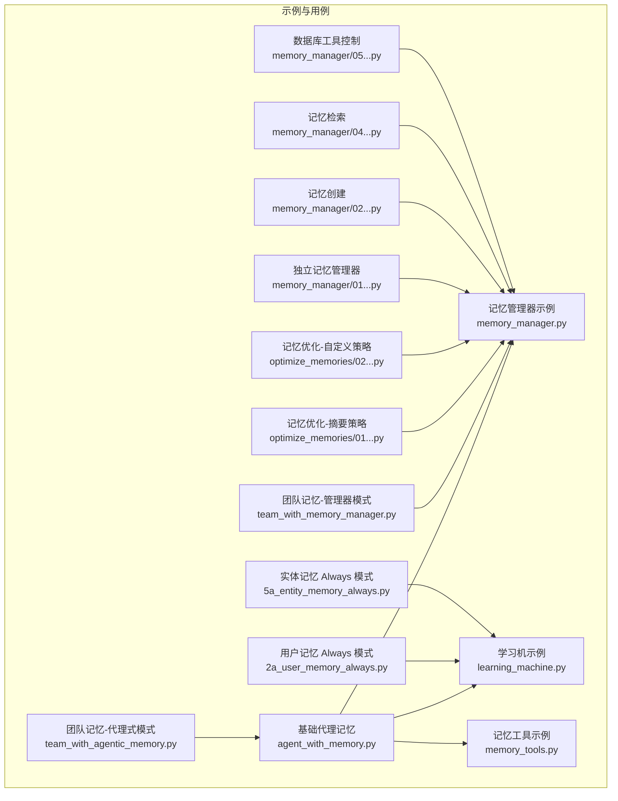
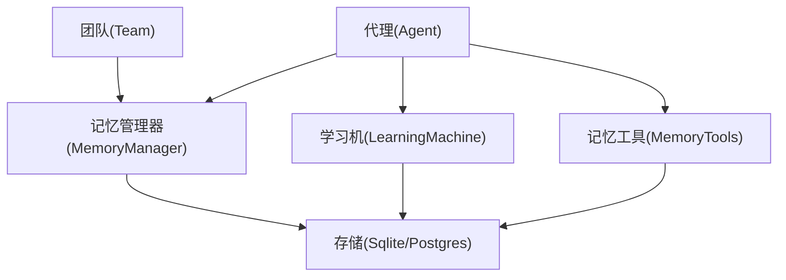
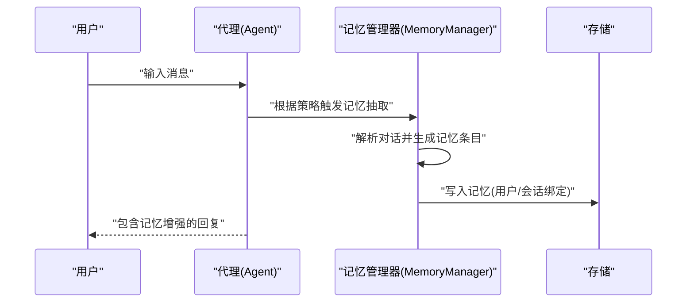
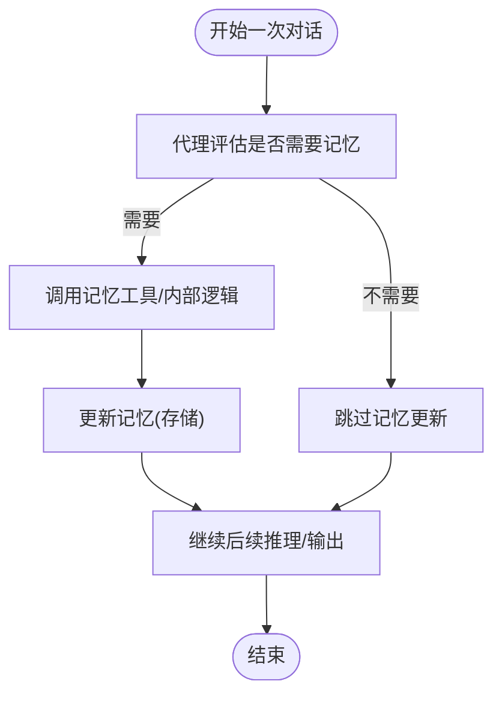
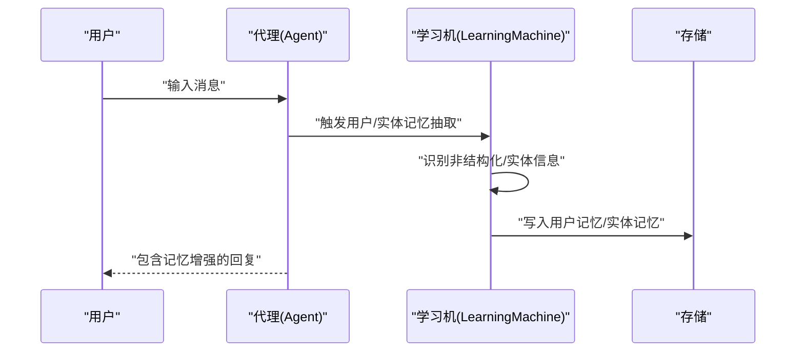
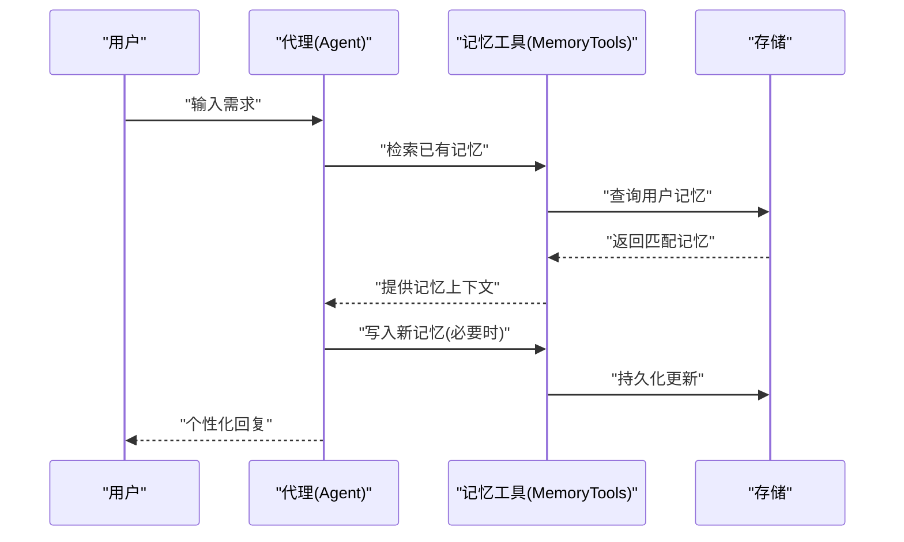
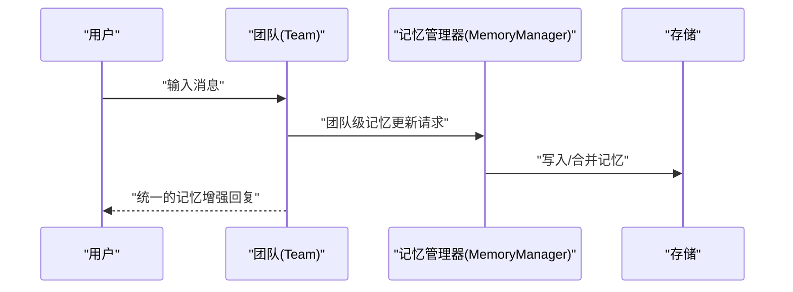
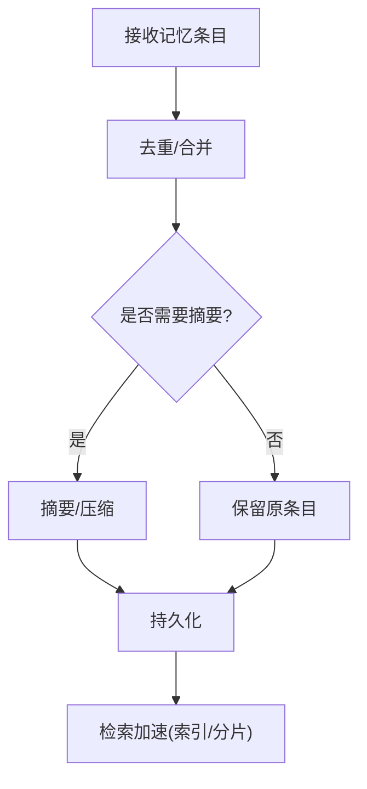
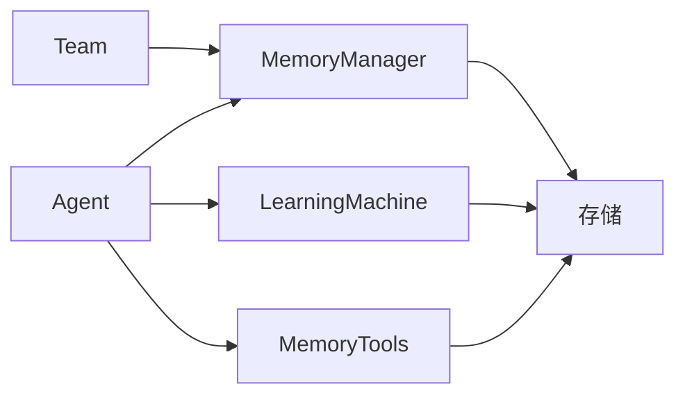

# 代理记忆

<cite>
**本文引用的文件**
- [cookbook/02_agents/06_memory_and_learning/memory_manager.py](file://cookbook/02_agents/06_memory_and_learning/memory_manager.py)
- [cookbook/02_agents/06_memory_and_learning/learning_machine.py](file://cookbook/02_agents/06_memory_and_learning/learning_machine.py)
- [cookbook/00_quickstart/agent_with_memory.py](file://cookbook/00_quickstart/agent_with_memory.py)
- [cookbook/10_reasoning/tools/memory_tools.py](file://cookbook/10_reasoning/tools/memory_tools.py)
- [cookbook/03_teams/06_memory/01_team_with_memory_manager.py](file://cookbook/03_teams/06_memory/01_team_with_memory_manager.py)
- [cookbook/03_teams/06_memory/02_team_with_agentic_memory.py](file://cookbook/03_teams/06_memory/02_team_with_agentic_memory.py)
- [cookbook/08_learning/01_basics/2a_user_memory_always.py](file://cookbook/08_learning/01_basics/2a_user_memory_always.py)
- [cookbook/08_learning/01_basics/5a_entity_memory_always.py](file://cookbook/08_learning/01_basics/5a_entity_memory_always.py)
- [cookbook/11_memory/optimize_memories/01_memory_summarize_strategy.py](file://cookbook/11_memory/optimize_memories/01_memory_summarize_strategy.py)
- [cookbook/11_memory/optimize_memories/02_custom_memory_strategy.py](file://cookbook/11_memory/optimize_memories/02_custom_memory_strategy.py)
- [cookbook/11_memory/memory_manager/01_standalone_memory.py](file://cookbook/11_memory/memory_manager/01_standalone_memory.py)
- [cookbook/11_memory/memory_manager/02_memory_creation.py](file://cookbook/11_memory/memory_manager/02_memory_creation.py)
- [cookbook/11_memory/memory_manager/04_memory_search.py](file://cookbook/11_memory/memory_manager/04_memory_search.py)
- [cookbook/11_memory/memory_manager/05_db_tools_control.py](file://cookbook/11_memory/memory_manager/05_db_tools_control.py)
- [libs/agno/README.md](file://libs/agno/README.md)
</cite>

## 目录
1. [简介](#简介)
2. [项目结构](#项目结构)
3. [核心组件](#核心组件)
4. [架构总览](#架构总览)
5. [详细组件分析](#详细组件分析)
6. [依赖关系分析](#依赖关系分析)
7. [性能考量](#性能考量)
8. [故障排查指南](#故障排查指南)
9. [结论](#结论)
10. [附录：配置与使用示例](#附录配置与使用示例)

## 简介
本文件系统性阐述代理记忆（Agent Memory）的高级能力与工程实践，覆盖记忆管理机制、记忆同步策略、记忆优化方法，并深入解释记忆分类、标签与优先级管理；同时说明与学习系统的集成路径，包括学习触发条件、记忆巩固与经验提取。文末提供完整配置指南与使用示例，帮助开发者高效落地代理记忆功能。

## 项目结构
本仓库围绕“代理记忆”提供了从基础示例到团队协作、从用户记忆到实体记忆、从手动工具到自动学习的多维度实践案例。核心示例分布如下：
- 基础代理记忆：快速上手、持久化用户偏好、跨会话记忆
- 团队记忆：团队级 MemoryManager 与代理式记忆
- 学习与记忆：用户记忆 Always 模式、实体记忆 Always 模式
- 记忆工具：显式记忆操作工具
- 记忆优化：记忆摘要策略与自定义策略
- 记忆管理：独立记忆管理器、记忆创建、检索与数据库控制

图表来源
- [cookbook/00_quickstart/agent_with_memory.py:1-158](file://cookbook/00_quickstart/agent_with_memory.py#L1-L158)
- [cookbook/02_agents/06_memory_and_learning/memory_manager.py:1-48](file://cookbook/02_agents/06_memory_and_learning/memory_manager.py#L1-L48)
- [cookbook/02_agents/06_memory_and_learning/learning_machine.py:1-50](file://cookbook/02_agents/06_memory_and_learning/learning_machine.py#L1-L50)
- [cookbook/10_reasoning/tools/memory_tools.py:1-60](file://cookbook/10_reasoning/tools/memory_tools.py#L1-L60)
- [cookbook/03_teams/06_memory/01_team_with_memory_manager.py:1-67](file://cookbook/03_teams/06_memory/01_team_with_memory_manager.py#L1-L67)
- [cookbook/03_teams/06_memory/02_team_with_agentic_memory.py:1-48](file://cookbook/03_teams/06_memory/02_team_with_agentic_memory.py#L1-L48)
- [cookbook/08_learning/01_basics/2a_user_memory_always.py:1-76](file://cookbook/08_learning/01_basics/2a_user_memory_always.py#L1-L76)
- [cookbook/08_learning/01_basics/5a_entity_memory_always.py:1-82](file://cookbook/08_learning/01_basics/5a_entity_memory_always.py#L1-L82)
- [cookbook/11_memory/optimize_memories/01_memory_summarize_strategy.py](file://cookbook/11_memory/optimize_memories/01_memory_summarize_strategy.py)
- [cookbook/11_memory/optimize_memories/02_custom_memory_strategy.py](file://cookbook/11_memory/optimize_memories/02_custom_memory_strategy.py)
- [cookbook/11_memory/memory_manager/01_standalone_memory.py](file://cookbook/11_memory/memory_manager/01_standalone_memory.py)
- [cookbook/11_memory/memory_manager/02_memory_creation.py](file://cookbook/11_memory/memory_manager/02_memory_creation.py)
- [cookbook/11_memory/memory_manager/04_memory_search.py](file://cookbook/11_memory/memory_manager/04_memory_search.py)
- [cookbook/11_memory/memory_manager/05_db_tools_control.py](file://cookbook/11_memory/memory_manager/05_db_tools_control.py)

章节来源
- [cookbook/00_quickstart/agent_with_memory.py:1-158](file://cookbook/00_quickstart/agent_with_memory.py#L1-L158)
- [cookbook/02_agents/06_memory_and_learning/memory_manager.py:1-48](file://cookbook/02_agents/06_memory_and_learning/memory_manager.py#L1-L48)
- [cookbook/02_agents/06_memory_and_learning/learning_machine.py:1-50](file://cookbook/02_agents/06_memory_and_learning/learning_machine.py#L1-L50)
- [cookbook/10_reasoning/tools/memory_tools.py:1-60](file://cookbook/10_reasoning/tools/memory_tools.py#L1-L60)
- [cookbook/03_teams/06_memory/01_team_with_memory_manager.py:1-67](file://cookbook/03_teams/06_memory/01_team_with_memory_manager.py#L1-L67)
- [cookbook/03_teams/06_memory/02_team_with_agentic_memory.py:1-48](file://cookbook/03_teams/06_memory/02_team_with_agentic_memory.py#L1-L48)
- [cookbook/08_learning/01_basics/2a_user_memory_always.py:1-76](file://cookbook/08_learning/01_basics/2a_user_memory_always.py#L1-L76)
- [cookbook/08_learning/01_basics/5a_entity_memory_always.py:1-82](file://cookbook/08_learning/01_basics/5a_entity_memory_always.py#L1-L82)
- [cookbook/11_memory/optimize_memories/01_memory_summarize_strategy.py](file://cookbook/11_memory/optimize_memories/01_memory_summarize_strategy.py)
- [cookbook/11_memory/optimize_memories/02_custom_memory_strategy.py](file://cookbook/11_memory/optimize_memories/02_custom_memory_strategy.py)
- [cookbook/11_memory/memory_manager/01_standalone_memory.py](file://cookbook/11_memory/memory_manager/01_standalone_memory.py)
- [cookbook/11_memory/memory_manager/02_memory_creation.py](file://cookbook/11_memory/memory_manager/02_memory_creation.py)
- [cookbook/11_memory/memory_manager/04_memory_search.py](file://cookbook/11_memory/memory_manager/04_memory_search.py)
- [cookbook/11_memory/memory_manager/05_db_tools_control.py](file://cookbook/11_memory/memory_manager/05_db_tools_control.py)

## 核心组件
- 记忆管理器（MemoryManager）
  - 负责从对话中抽取并结构化存储用户记忆，支持按需调用或在每次响应后自动更新
  - 支持附加指令以引导记忆抽取重点（如偏好、目标、风险等）
- 代理式记忆（enable_agentic_memory）
  - 由代理在工具调用中自主决定何时存储/召回记忆，更高效但需明确触发条件
- 学习机（LearningMachine）
  - 提供用户记忆与实体记忆的自动抽取模式（Always），无需显式工具调用
  - 支持用户画像配置与学习模式切换
- 记忆工具（MemoryTools）
  - 显式工具接口，用于主动读取、写入、清理用户记忆
- 团队记忆
  - 支持团队级 MemoryManager 或启用团队代理式记忆，实现跨成员共享与同步

章节来源
- [cookbook/00_quickstart/agent_with_memory.py:37-43](file://cookbook/00_quickstart/agent_with_memory.py#L37-L43)
- [cookbook/02_agents/06_memory_and_learning/memory_manager.py:24-27](file://cookbook/02_agents/06_memory_and_learning/memory_manager.py#L24-L27)
- [cookbook/02_agents/06_memory_and_learning/learning_machine.py:25-27](file://cookbook/02_agents/06_memory_and_learning/learning_machine.py#L25-L27)
- [cookbook/10_reasoning/tools/memory_tools.py:23-25](file://cookbook/10_reasoning/tools/memory_tools.py#L23-L25)
- [cookbook/03_teams/06_memory/01_team_with_memory_manager.py:40-44](file://cookbook/03_teams/06_memory/01_team_with_memory_manager.py#L40-L44)
- [cookbook/03_teams/06_memory/02_team_with_agentic_memory.py:30-35](file://cookbook/03_teams/06_memory/02_team_with_agentic_memory.py#L30-L35)

## 架构总览
下图展示代理记忆在不同场景下的关键交互：代理通过 MemoryManager 或 LearningMachine 进行记忆抽取与存储；MemoryTools 提供显式操作；团队模式下由 Team 统一协调记忆更新；存储层可选 SQLite/Postgres 等。

图表来源
- [cookbook/00_quickstart/agent_with_memory.py:88-100](file://cookbook/00_quickstart/agent_with_memory.py#L88-L100)
- [cookbook/02_agents/06_memory_and_learning/memory_manager.py:18-29](file://cookbook/02_agents/06_memory_and_learning/memory_manager.py#L18-L29)
- [cookbook/02_agents/06_memory_and_learning/learning_machine.py:21-29](file://cookbook/02_agents/06_memory_and_learning/learning_machine.py#L21-L29)
- [cookbook/10_reasoning/tools/memory_tools.py:27-38](file://cookbook/10_reasoning/tools/memory_tools.py#L27-L38)
- [cookbook/03_teams/06_memory/01_team_with_memory_manager.py:39-45](file://cookbook/03_teams/06_memory/01_team_with_memory_manager.py#L39-L45)

## 详细组件分析

### 记忆管理器（MemoryManager）
- 功能要点
  - 结构化抽取：基于模型与附加指令，从对话中抽取用户偏好、目标、上下文等
  - 更新策略：支持“按需”（enable_agentic_memory）与“每次响应后更新”（update_memory_on_run）
  - 多用户/多会话：通过 user_id 与 session_id 将记忆与具体会话关联
- 典型流程
  - 初始化 MemoryManager 并注入模型与存储
  - 在 Agent 中启用 memory_manager 与可选的 enable_agentic_memory
  - 运行时根据策略决定是否抽取与存储

图表来源
- [cookbook/00_quickstart/agent_with_memory.py:88-100](file://cookbook/00_quickstart/agent_with_memory.py#L88-L100)
- [cookbook/02_agents/06_memory_and_learning/memory_manager.py:18-29](file://cookbook/02_agents/06_memory_and_learning/memory_manager.py#L18-L29)

章节来源
- [cookbook/00_quickstart/agent_with_memory.py:37-43](file://cookbook/00_quickstart/agent_with_memory.py#L37-L43)
- [cookbook/02_agents/06_memory_and_learning/memory_manager.py:24-27](file://cookbook/02_agents/06_memory_and_learning/memory_manager.py#L24-L27)

### 代理式记忆（enable_agentic_memory）
- 特点
  - 由代理在工具调用中自行判断何时存储/召回记忆，避免不必要的开销
  - 需要明确的触发条件或工具调用约定
- 适用场景
  - 对延迟敏感、成本敏感的生产环境
  - 可通过工具设计实现“按需”记忆更新

图表来源
- [cookbook/00_quickstart/agent_with_memory.py:95-96](file://cookbook/00_quickstart/agent_with_memory.py#L95-L96)

章节来源
- [cookbook/00_quickstart/agent_with_memory.py:147-157](file://cookbook/00_quickstart/agent_with_memory.py#L147-L157)

### 学习机与自动记忆（LearningMachine）
- 用户记忆 Always 模式
  - 自动抽取非结构化观察（工作背景、沟通风格、兴趣等）
  - 无需显式工具调用，响应后自动更新
- 实体记忆 Always 模式
  - 自动发现并存储外部实体知识（公司、人物、事件、关系等）
  - 支持增量更新与检索

图表来源
- [cookbook/08_learning/01_basics/2a_user_memory_always.py:34-38](file://cookbook/08_learning/01_basics/2a_user_memory_always.py#L34-L38)
- [cookbook/08_learning/01_basics/5a_entity_memory_always.py:32-36](file://cookbook/08_learning/01_basics/5a_entity_memory_always.py#L32-L36)

章节来源
- [cookbook/08_learning/01_basics/2a_user_memory_always.py:28-38](file://cookbook/08_learning/01_basics/2a_user_memory_always.py#L28-L38)
- [cookbook/08_learning/01_basics/5a_entity_memory_always.py:26-36](file://cookbook/08_learning/01_basics/5a_entity_memory_always.py#L26-L36)

### 记忆工具（MemoryTools）
- 能力
  - 主动读取、写入、清理用户记忆
  - 与搜索工具组合，形成“检索-规划-记忆更新”的闭环
- 使用建议
  - 在个性化服务场景中作为显式控制手段
  - 与代理式记忆结合，实现“显式+隐式”的混合策略

图表来源
- [cookbook/10_reasoning/tools/memory_tools.py:27-38](file://cookbook/10_reasoning/tools/memory_tools.py#L27-L38)

章节来源
- [cookbook/10_reasoning/tools/memory_tools.py:23-25](file://cookbook/10_reasoning/tools/memory_tools.py#L23-L25)

### 团队记忆（Team-Level Memory）
- 管理器模式
  - 团队共享同一 MemoryManager，统一进行记忆抽取与更新
  - 适合需要跨成员一致记忆的协作场景
- 代理式模式
  - 团队启用 enable_agentic_memory，由成员在工具调用中协同更新记忆

图表来源
- [cookbook/03_teams/06_memory/01_team_with_memory_manager.py:39-45](file://cookbook/03_teams/06_memory/01_team_with_memory_manager.py#L39-L45)
- [cookbook/03_teams/06_memory/02_team_with_agentic_memory.py:30-35](file://cookbook/03_teams/06_memory/02_team_with_agentic_memory.py#L30-L35)

章节来源
- [cookbook/03_teams/06_memory/01_team_with_memory_manager.py:40-44](file://cookbook/03_teams/06_memory/01_team_with_memory_manager.py#L40-L44)
- [cookbook/03_teams/06_memory/02_team_with_agentic_memory.py:30-35](file://cookbook/03_teams/06_memory/02_team_with_agentic_memory.py#L30-L35)

### 记忆优化与存储策略
- 记忆摘要策略
  - 对高频/冗余记忆进行摘要与归并，降低存储与检索成本
- 自定义记忆策略
  - 基于业务规则定制记忆抽取、合并与淘汰策略
- 存储优化
  - 选择合适的存储后端（SQLite/Postgres），并结合索引与分片策略提升检索效率

图表来源
- [cookbook/11_memory/optimize_memories/01_memory_summarize_strategy.py](file://cookbook/11_memory/optimize_memories/01_memory_summarize_strategy.py)
- [cookbook/11_memory/optimize_memories/02_custom_memory_strategy.py](file://cookbook/11_memory/optimize_memories/02_custom_memory_strategy.py)

章节来源
- [cookbook/11_memory/optimize_memories/01_memory_summarize_strategy.py](file://cookbook/11_memory/optimize_memories/01_memory_summarize_strategy.py)
- [cookbook/11_memory/optimize_memories/02_custom_memory_strategy.py](file://cookbook/11_memory/optimize_memories/02_custom_memory_strategy.py)

### 记忆管理与检索（独立管理器）
- 独立记忆管理器
  - 可脱离代理直接运行，便于测试与离线处理
- 记忆创建与检索
  - 提供标准 API 创建、查询、更新与删除记忆
- 数据库工具控制
  - 通过数据库工具对底层存储进行批量操作与维护

章节来源
- [cookbook/11_memory/memory_manager/01_standalone_memory.py](file://cookbook/11_memory/memory_manager/01_standalone_memory.py)
- [cookbook/11_memory/memory_manager/02_memory_creation.py](file://cookbook/11_memory/memory_manager/02_memory_creation.py)
- [cookbook/11_memory/memory_manager/04_memory_search.py](file://cookbook/11_memory/memory_manager/04_memory_search.py)
- [cookbook/11_memory/memory_manager/05_db_tools_control.py](file://cookbook/11_memory/memory_manager/05_db_tools_control.py)

## 依赖关系分析
- 组件耦合
  - Agent 与 MemoryManager/LearningMachine 松耦合，通过配置注入实现
  - MemoryTools 作为可选依赖，按需启用
  - Team 与 MemoryManager 的耦合度更高，便于统一管理
- 外部依赖
  - 存储层：SqliteDb、PostgresDb 等
  - 模型层：OpenAIResponses、Gemini 等
- 循环依赖
  - 示例中未见循环导入；实际工程中应避免记忆模块与存储模块互相引用

图表来源
- [cookbook/00_quickstart/agent_with_memory.py:88-100](file://cookbook/00_quickstart/agent_with_memory.py#L88-L100)
- [cookbook/02_agents/06_memory_and_learning/memory_manager.py:18-29](file://cookbook/02_agents/06_memory_and_learning/memory_manager.py#L18-L29)
- [cookbook/02_agents/06_memory_and_learning/learning_machine.py:21-29](file://cookbook/02_agents/06_memory_and_learning/learning_machine.py#L21-L29)
- [cookbook/10_reasoning/tools/memory_tools.py:27-38](file://cookbook/10_reasoning/tools/memory_tools.py#L27-L38)
- [cookbook/03_teams/06_memory/01_team_with_memory_manager.py:39-45](file://cookbook/03_teams/06_memory/01_team_with_memory_manager.py#L39-L45)

章节来源
- [cookbook/00_quickstart/agent_with_memory.py:88-100](file://cookbook/00_quickstart/agent_with_memory.py#L88-L100)
- [cookbook/02_agents/06_memory_and_learning/memory_manager.py:18-29](file://cookbook/02_agents/06_memory_and_learning/memory_manager.py#L18-L29)
- [cookbook/02_agents/06_memory_and_learning/learning_machine.py:21-29](file://cookbook/02_agents/06_memory_and_learning/learning_machine.py#L21-L29)
- [cookbook/10_reasoning/tools/memory_tools.py:27-38](file://cookbook/10_reasoning/tools/memory_tools.py#L27-L38)
- [cookbook/03_teams/06_memory/01_team_with_memory_manager.py:39-45](file://cookbook/03_teams/06_memory/01_team_with_memory_manager.py#L39-L45)

## 性能考量
- 抽取频率与成本
  - Always 模式自动抽取，保证覆盖率但增加延迟与成本
  - 代理式模式按需抽取，更高效但需合理设计触发条件
- 存储与检索
  - 合理设置 user_id/session_id，避免跨用户/跨会话污染
  - 使用索引与分片策略优化检索性能
- 压缩与归并
  - 对重复/冗余记忆进行摘要与归并，减少存储与查询开销
- 并发与一致性
  - 团队模式下建议采用幂等写入与版本控制，避免竞态

## 故障排查指南
- 记忆未生效
  - 检查是否正确启用 enable_agentic_memory 或 update_memory_on_run
  - 确认 user_id/session_id 传递正确
- 记忆重复或冲突
  - 使用摘要策略或去重逻辑
  - 在团队模式下确保写入幂等
- 存储异常
  - 校验数据库连接与权限
  - 使用数据库工具进行批量修复与清理

章节来源
- [cookbook/00_quickstart/agent_with_memory.py:147-157](file://cookbook/00_quickstart/agent_with_memory.py#L147-L157)
- [cookbook/11_memory/memory_manager/05_db_tools_control.py](file://cookbook/11_memory/memory_manager/05_db_tools_control.py)

## 结论
代理记忆通过 MemoryManager、LearningMachine 与 MemoryTools 形成“抽取—存储—检索—更新”的闭环；结合团队模式与优化策略，可在保证一致性的同时兼顾性能与成本。开发者可根据场景选择 Always 模式或代理式模式，并配合存储与检索优化，构建稳定高效的智能代理记忆系统。

## 附录：配置与使用示例

- 基础代理记忆（持久化用户偏好）
  - 关键点：启用 memory_manager、enable_agentic_memory、附加指令引导记忆抽取
  - 示例参考：[cookbook/00_quickstart/agent_with_memory.py:37-43](file://cookbook/00_quickstart/agent_with_memory.py#L37-L43)

- 记忆管理器示例
  - 关键点：初始化 MemoryManager 并注入模型与存储
  - 示例参考：[cookbook/02_agents/06_memory_and_learning/memory_manager.py:24-27](file://cookbook/02_agents/06_memory_and_learning/memory_manager.py#L24-L27)

- 学习机示例（Always 模式）
  - 关键点：LearningMachine 配置用户记忆/实体记忆 Always 模式
  - 示例参考：[cookbook/02_agents/06_memory_and_learning/learning_machine.py:25-27](file://cookbook/02_agents/06_memory_and_learning/learning_machine.py#L25-L27)

- 记忆工具示例
  - 关键点：MemoryTools 与搜索工具组合使用
  - 示例参考：[cookbook/10_reasoning/tools/memory_tools.py:23-25](file://cookbook/10_reasoning/tools/memory_tools.py#L23-L25)

- 团队记忆（管理器模式）
  - 关键点：Team 注入 MemoryManager，统一记忆更新
  - 示例参考：[cookbook/03_teams/06_memory/01_team_with_memory_manager.py:40-44](file://cookbook/03_teams/06_memory/01_team_with_memory_manager.py#L40-L44)

- 团队记忆（代理式模式）
  - 关键点：Team 启用 enable_agentic_memory
  - 示例参考：[cookbook/03_teams/06_memory/02_team_with_agentic_memory.py:30-35](file://cookbook/03_teams/06_memory/02_team_with_agentic_memory.py#L30-L35)

- 用户记忆 Always 模式
  - 关键点：自动抽取非结构化观察
  - 示例参考：[cookbook/08_learning/01_basics/2a_user_memory_always.py:34-38](file://cookbook/08_learning/01_basics/2a_user_memory_always.py#L34-L38)

- 实体记忆 Always 模式
  - 关键点：自动抽取外部实体知识
  - 示例参考：[cookbook/08_learning/01_basics/5a_entity_memory_always.py:32-36](file://cookbook/08_learning/01_basics/5a_entity_memory_always.py#L32-L36)

- 记忆优化（摘要与自定义策略）
  - 关键点：摘要策略与自定义策略结合
  - 示例参考：[cookbook/11_memory/optimize_memories/01_memory_summarize_strategy.py](file://cookbook/11_memory/optimize_memories/01_memory_summarize_strategy.py)、[cookbook/11_memory/optimize_memories/02_custom_memory_strategy.py](file://cookbook/11_memory/optimize_memories/02_custom_memory_strategy.py)

- 独立记忆管理器与检索
  - 关键点：独立运行、创建、检索与数据库工具控制
  - 示例参考：[cookbook/11_memory/memory_manager/01_standalone_memory.py](file://cookbook/11_memory/memory_manager/01_standalone_memory.py)、[cookbook/11_memory/memory_manager/02_memory_creation.py](file://cookbook/11_memory/memory_manager/02_memory_creation.py)、[cookbook/11_memory/memory_manager/04_memory_search.py](file://cookbook/11_memory/memory_manager/04_memory_search.py)、[cookbook/11_memory/memory_manager/05_db_tools_control.py](file://cookbook/11_memory/memory_manager/05_db_tools_control.py)