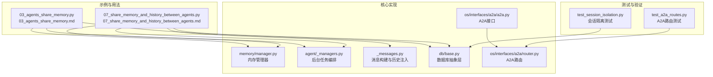
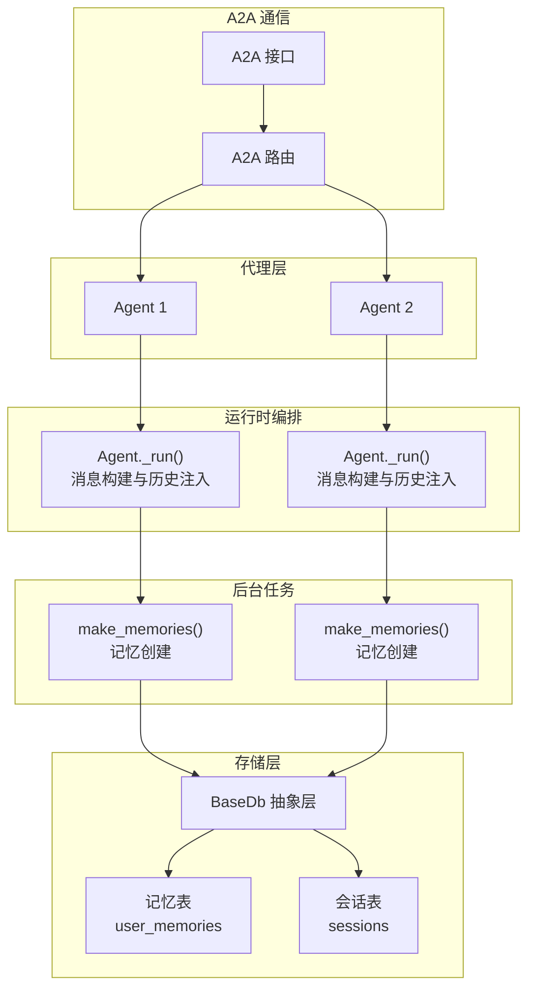
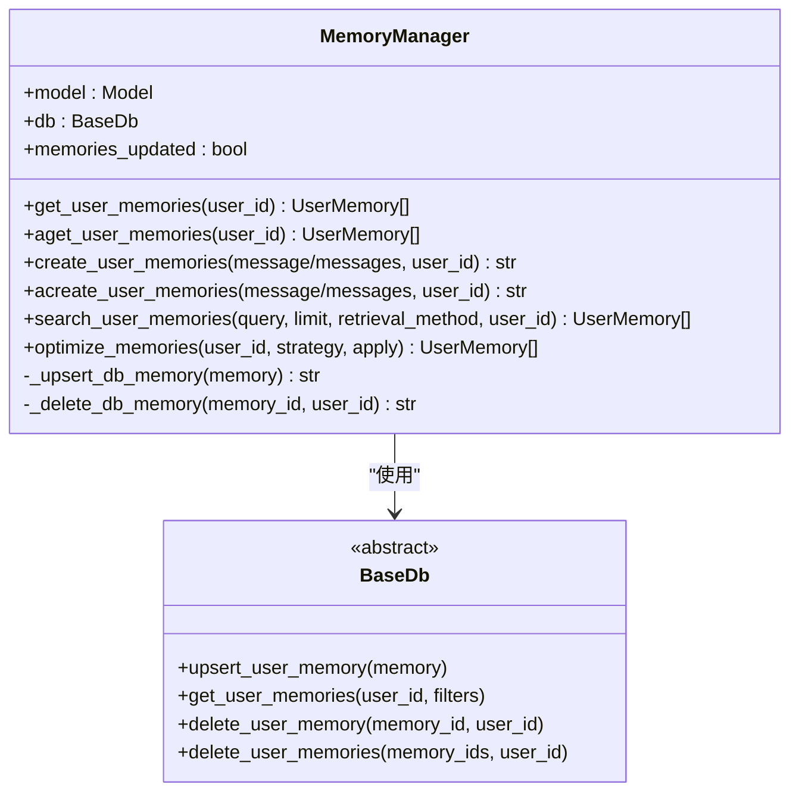
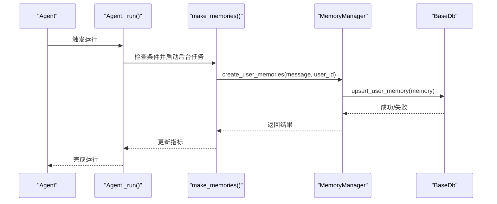
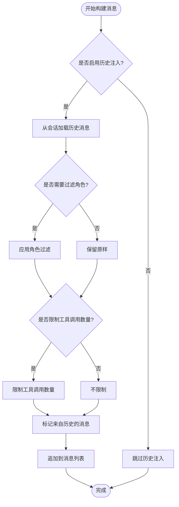
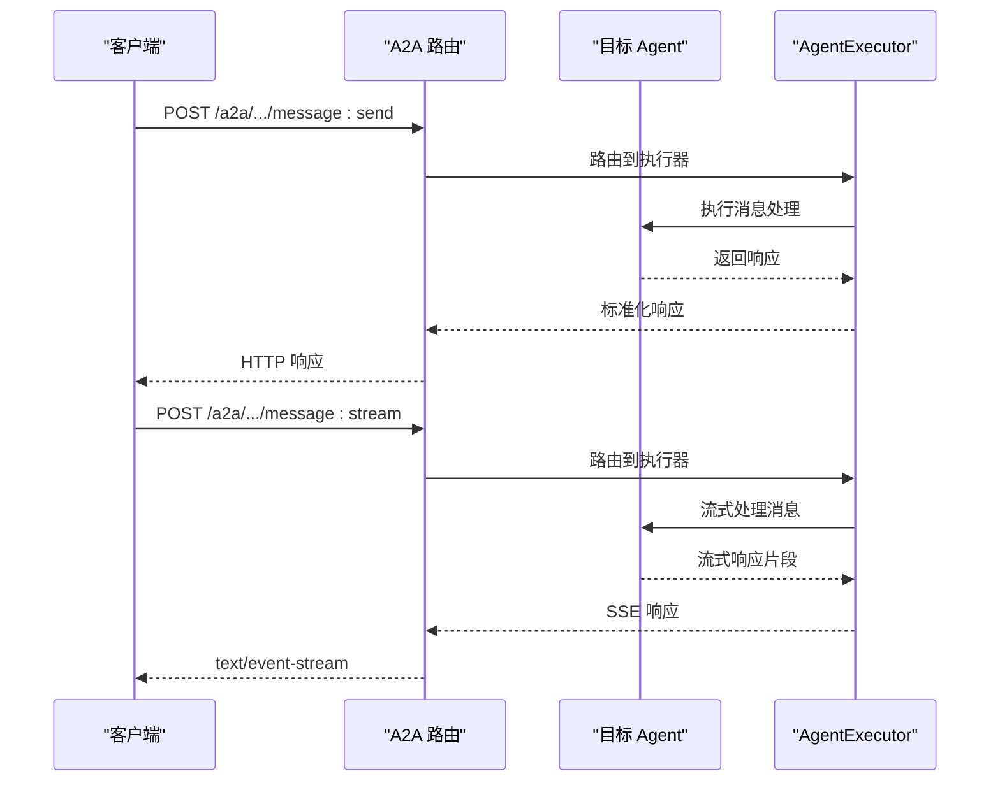
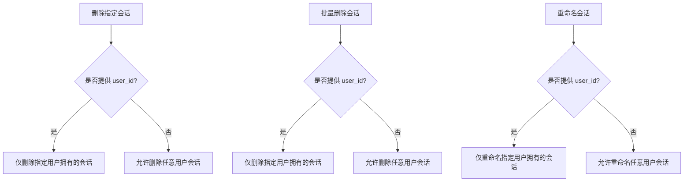
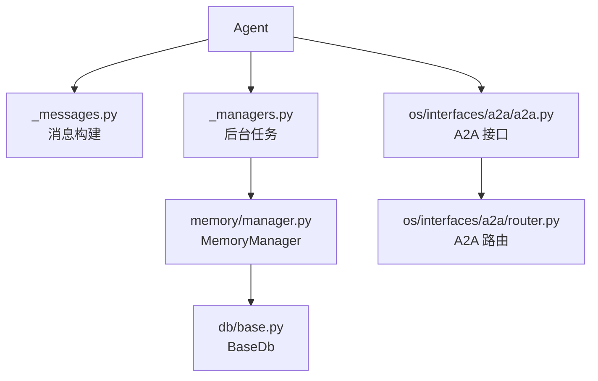

# 代理间内存共享与历史记录

<cite>
**本文档引用的文件**
- [03_agents_share_memory.py](file://cookbook/11_memory/03_agents_share_memory.py)
- [07_share_memory_and_history_between_agents.py](file://cookbook/11_memory/07_share_memory_and_history_between_agents.py)
- [03_agents_share_memory.md](file://cookbook/11_memory/03_agents_share_memory.md)
- [07_share_memory_and_history_between_agents.md](file://cookbook/11_memory/07_share_memory_and_history_between_agents.md)
- [manager.py](file://libs/agno/agno/memory/manager.py)
- [_managers.py](file://libs/agno/agno/agent/_managers.py)
- [_messages.py](file://libs/agno/agno/agent/_messages.py)
- [base.py](file://libs/agno/agno/db/base.py)
- [a2a.py](file://libs/agno/agno/os/interfaces/a2a/a2a.py)
- [router.py](file://libs/agno/agno/os/interfaces/a2a/router.py)
- [test_session_isolation.py](file://libs/agno/tests/unit/db/test_session_isolation.py)
- [test_a2a_routes.py](file://libs/agno/tests/system/tests/test_a2a_routes.py)
</cite>

## 目录
1. [简介](#简介)
2. [项目结构](#项目结构)
3. [核心组件](#核心组件)
4. [架构总览](#架构总览)
5. [详细组件分析](#详细组件分析)
6. [依赖关系分析](#依赖关系分析)
7. [性能考虑](#性能考虑)
8. [故障排除指南](#故障排除指南)
9. [结论](#结论)
10. [附录](#附录)

## 简介
本文件围绕代理间内存共享与历史记录功能，系统性阐述以下主题：
- 代理间内存共享的实现机制与架构设计：包括共享策略、数据传输与同步机制
- 历史记录的管理方法：存储、检索与清理策略
- 内存与历史记录的协同工作机制：数据关联、状态同步与一致性保证
- 代理间通信的实现方式：消息传递、事件广播与状态更新
- 冲突解决与数据一致性保障机制：版本控制、合并策略与回滚机制
- 使用示例与配置指南：帮助开发者高效实现代理间内存共享与历史记录管理

## 项目结构
本项目采用模块化组织，相关功能分布在以下层次：
- 示例与用法：cookbook/11_memory 提供内存与历史记录的使用示例
- 核心实现：libs/agno/agno 下的 memory、agent、db、os/interfaces 等子模块
- 测试与验证：libs/agno/tests 下的单元测试与系统测试

**图表来源**
- [03_agents_share_memory.py:1-61](file://cookbook/11_memory/03_agents_share_memory.py#L1-L61)
- [07_share_memory_and_history_between_agents.py:1-67](file://cookbook/11_memory/07_share_memory_and_history_between_agents.py#L1-L67)
- [manager.py:1-120](file://libs/agno/agno/memory/manager.py#L1-L120)
- [_managers.py:1-120](file://libs/agno/agno/agent/_managers.py#L1-L120)
- [_messages.py:1200-1399](file://libs/agno/agno/agent/_messages.py#L1200-L1399)
- [base.py:1-200](file://libs/agno/agno/db/base.py#L1-L200)
- [a2a.py:1-44](file://libs/agno/agno/os/interfaces/a2a/a2a.py#L1-L44)
- [router.py:100-115](file://libs/agno/agno/os/interfaces/a2a/router.py#L100-L115)
- [test_session_isolation.py:51-127](file://libs/agno/tests/unit/db/test_session_isolation.py#L51-L127)
- [test_a2a_routes.py:392-425](file://libs/agno/tests/system/tests/test_a2a_routes.py#L392-L425)

**章节来源**
- [03_agents_share_memory.py:1-61](file://cookbook/11_memory/03_agents_share_memory.py#L1-L61)
- [07_share_memory_and_history_between_agents.py:1-67](file://cookbook/11_memory/07_share_memory_and_history_between_agents.py#L1-L67)
- [manager.py:1-120](file://libs/agno/agno/memory/manager.py#L1-L120)
- [_managers.py:1-120](file://libs/agno/agno/agent/_managers.py#L1-L120)
- [_messages.py:1200-1399](file://libs/agno/agno/agent/_messages.py#L1200-L1399)
- [base.py:1-200](file://libs/agno/agno/db/base.py#L1-L200)
- [a2a.py:1-44](file://libs/agno/agno/os/interfaces/a2a/a2a.py#L1-L44)
- [router.py:100-115](file://libs/agno/agno/os/interfaces/a2a/router.py#L100-L115)
- [test_session_isolation.py:51-127](file://libs/agno/tests/unit/db/test_session_isolation.py#L51-L127)
- [test_a2a_routes.py:392-425](file://libs/agno/tests/system/tests/test_a2a_routes.py#L392-L425)

## 核心组件
本节聚焦于代理间内存共享与历史记录的关键组件及其职责。

- 内存管理器（MemoryManager）
  - 负责用户记忆的增删改查、检索与优化
  - 通过共享数据库对象实现跨代理的数据一致性
  - 支持同步与异步操作，提供批量处理能力

- 后台任务编排（_managers.py）
  - 在运行过程中自动触发记忆创建与更新
  - 支持线程与协程两种执行路径，确保非阻塞
  - 提供任务取消与重试机制

- 消息构建与历史注入（_messages.py）
  - 在构建对话消息时按配置注入历史记录
  - 支持历史消息数量与角色过滤等策略
  - 通过会话对象统一管理历史数据

- 数据库抽象层（db/base.py）
  - 定义统一的数据库接口，支持多种存储后端
  - 提供会话、记忆、文化知识等核心数据的 CRUD 操作
  - 统一表名与版本管理，便于扩展与迁移

- A2A 接口（os/interfaces/a2a）
  - 提供代理间通信的 HTTP 接口
  - 支持消息发送与流式响应
  - 与代理运行流程无缝集成

**章节来源**
- [manager.py:44-120](file://libs/agno/agno/memory/manager.py#L44-L120)
- [_managers.py:29-81](file://libs/agno/agno/agent/_managers.py#L29-L81)
- [_messages.py:1240-1273](file://libs/agno/agno/agent/_messages.py#L1240-L1273)
- [base.py:30-200](file://libs/agno/agno/db/base.py#L30-L200)
- [a2a.py:16-44](file://libs/agno/agno/os/interfaces/a2a/a2a.py#L16-L44)

## 架构总览
下图展示了代理间内存共享与历史记录的整体架构，以及 A2A 通信的交互路径。

**图表来源**
- [_messages.py:1240-1273](file://libs/agno/agno/agent/_messages.py#L1240-L1273)
- [_managers.py:29-81](file://libs/agno/agno/agent/_managers.py#L29-L81)
- [manager.py:560-586](file://libs/agno/agno/memory/manager.py#L560-L586)
- [base.py:212-277](file://libs/agno/agno/db/base.py#L212-L277)
- [a2a.py:38-43](file://libs/agno/agno/os/interfaces/a2a/a2a.py#L38-L43)
- [router.py:100-115](file://libs/agno/agno/os/interfaces/a2a/router.py#L100-L115)

## 详细组件分析

### 内存管理器（MemoryManager）
内存管理器负责用户记忆的生命周期管理，支持多种检索策略与优化手段。

**图表来源**
- [manager.py:44-120](file://libs/agno/agno/memory/manager.py#L44-L120)
- [manager.py:165-210](file://libs/agno/agno/memory/manager.py#L165-L210)
- [manager.py:368-422](file://libs/agno/agno/memory/manager.py#L368-L422)
- [manager.py:588-639](file://libs/agno/agno/memory/manager.py#L588-L639)
- [base.py:212-277](file://libs/agno/agno/db/base.py#L212-L277)

**章节来源**
- [manager.py:44-120](file://libs/agno/agno/memory/manager.py#L44-L120)
- [manager.py:165-210](file://libs/agno/agno/memory/manager.py#L165-L210)
- [manager.py:368-422](file://libs/agno/agno/memory/manager.py#L368-L422)
- [manager.py:588-639](file://libs/agno/agno/memory/manager.py#L588-L639)
- [base.py:212-277](file://libs/agno/agno/db/base.py#L212-L277)

### 后台任务编排（_managers.py）
后台任务负责在运行时自动触发记忆创建与更新，确保非阻塞与可扩展。

**图表来源**
- [_managers.py:29-81](file://libs/agno/agno/agent/_managers.py#L29-L81)
- [manager.py:368-422](file://libs/agno/agno/memory/manager.py#L368-L422)
- [base.py:264-267](file://libs/agno/agno/db/base.py#L264-L267)

**章节来源**
- [_managers.py:29-81](file://libs/agno/agno/agent/_managers.py#L29-L81)
- [manager.py:368-422](file://libs/agno/agno/memory/manager.py#L368-L422)
- [base.py:264-267](file://libs/agno/agno/db/base.py#L264-L267)

### 历史记录注入（_messages.py）
历史记录注入机制允许代理在构建消息时读取并注入历史消息，支持多种过滤策略。

**图表来源**
- [_messages.py:1240-1273](file://libs/agno/agno/agent/_messages.py#L1240-L1273)

**章节来源**
- [_messages.py:1240-1273](file://libs/agno/agno/agent/_messages.py#L1240-L1273)

### A2A 通信接口
A2A 接口提供标准化的代理间通信能力，支持消息发送与流式响应。

**图表来源**
- [a2a.py:38-43](file://libs/agno/agno/os/interfaces/a2a/a2a.py#L38-L43)
- [router.py:100-115](file://libs/agno/agno/os/interfaces/a2a/router.py#L100-L115)
- [test_a2a_routes.py:392-425](file://libs/agno/tests/system/tests/test_a2a_routes.py#L392-L425)

**章节来源**
- [a2a.py:16-44](file://libs/agno/agno/os/interfaces/a2a/a2a.py#L16-L44)
- [router.py:100-115](file://libs/agno/agno/os/interfaces/a2a/router.py#L100-L115)
- [test_a2a_routes.py:392-425](file://libs/agno/tests/system/tests/test_a2a_routes.py#L392-L425)

### 会话隔离与清理
会话隔离测试验证了不同用户对会话的访问控制与清理权限，确保数据安全与一致性。

**图表来源**
- [test_session_isolation.py:51-127](file://libs/agno/tests/unit/db/test_session_isolation.py#L51-L127)

**章节来源**
- [test_session_isolation.py:51-127](file://libs/agno/tests/unit/db/test_session_isolation.py#L51-L127)

## 依赖关系分析
本节分析组件间的耦合与依赖关系，识别潜在的循环依赖与扩展点。

**图表来源**
- [_messages.py:1240-1273](file://libs/agno/agno/agent/_messages.py#L1240-L1273)
- [_managers.py:29-81](file://libs/agno/agno/agent/_managers.py#L29-L81)
- [manager.py:44-120](file://libs/agno/agno/memory/manager.py#L44-L120)
- [base.py:30-200](file://libs/agno/agno/db/base.py#L30-L200)
- [a2a.py:38-43](file://libs/agno/agno/os/interfaces/a2a/a2a.py#L38-L43)
- [router.py:100-115](file://libs/agno/agno/os/interfaces/a2a/router.py#L100-L115)

**章节来源**
- [_messages.py:1240-1273](file://libs/agno/agno/agent/_messages.py#L1240-L1273)
- [_managers.py:29-81](file://libs/agno/agno/agent/_managers.py#L29-L81)
- [manager.py:44-120](file://libs/agno/agno/memory/manager.py#L44-L120)
- [base.py:30-200](file://libs/agno/agno/db/base.py#L30-L200)
- [a2a.py:38-43](file://libs/agno/agno/os/interfaces/a2a/a2a.py#L38-L43)
- [router.py:100-115](file://libs/agno/agno/os/interfaces/a2a/router.py#L100-L115)

## 性能考虑
- 异步与并发
  - MemoryManager 支持同步与异步操作，建议在高并发场景使用异步接口
  - 后台任务通过线程池与协程并行处理，避免阻塞主流程

- 批量操作
  - 数据库层提供批量 upsert 与批量删除接口，减少网络往返与事务开销
  - 建议在大量记忆或会话操作时使用批量接口

- 历史记录限制
  - 通过 num_history_runs 与 num_history_messages 控制历史长度，避免 context 过长影响性能
  - 工具调用过滤可进一步减少上下文大小

- 缓存与索引
  - 建议在数据库层面建立合适的索引（如 user_id、session_id、updated_at）
  - 合理利用检索策略（last_n、first_n、agentic）提升查询效率

## 故障排除指南
- 内存写入失败
  - 检查 db 是否正确初始化与连接
  - 查看日志中的错误信息，确认 upsert_user_memory 返回值

- 历史注入异常
  - 确认 session_id 与 user_id 传入正确
  - 检查历史消息数量与角色过滤配置是否合理

- A2A 接口不可用
  - 确认 A2A 接口已正确注册到应用路由
  - 检查端口与认证配置，参考测试用例验证路由可用性

- 会话隔离问题
  - 验证 user_id 参数是否正确传递
  - 使用会话隔离测试用例复现并定位问题

**章节来源**
- [manager.py:560-586](file://libs/agno/agno/memory/manager.py#L560-L586)
- [_messages.py:1240-1273](file://libs/agno/agno/agent/_messages.py#L1240-L1273)
- [test_a2a_routes.py:392-425](file://libs/agno/tests/system/tests/test_a2a_routes.py#L392-L425)
- [test_session_isolation.py:51-127](file://libs/agno/tests/unit/db/test_session_isolation.py#L51-L127)

## 结论
本文件系统性阐述了代理间内存共享与历史记录的实现机制与最佳实践。通过共享数据库对象、后台任务编排、历史注入与 A2A 接口，实现了跨代理的数据一致性与高效通信。配合会话隔离与清理策略，确保了系统的安全性与可维护性。建议在生产环境中结合异步接口、批量操作与合理的历史记录限制，以获得更优的性能表现。

## 附录

### 使用示例与配置指南
- 内存共享示例
  - 创建共享数据库实例，并在多个代理中注入相同 db 对象
  - 启用 update_memory_on_run，确保每次运行自动更新记忆
  - 使用 get_user_memories 获取跨代理共享的记忆

- 历史记录共享示例
  - 为两个代理配置相同的 session_id 与 db
  - 启用 add_history_to_context，使代理在构建消息时自动注入历史
  - 通过 session.get_messages 控制历史记录的数量与角色过滤

- A2A 通信示例
  - 初始化 A2A 接口并注册到 AgentOS
  - 通过 HTTP 接口发送消息与接收流式响应
  - 参考测试用例验证路由与接口行为

**章节来源**
- [03_agents_share_memory.py:17-36](file://cookbook/11_memory/03_agents_share_memory.py#L17-L36)
- [07_share_memory_and_history_between_agents.py:18-37](file://cookbook/11_memory/07_share_memory_and_history_between_agents.py#L18-L37)
- [a2a.py:38-43](file://libs/agno/agno/os/interfaces/a2a/a2a.py#L38-L43)
- [test_a2a_routes.py:392-425](file://libs/agno/tests/system/tests/test_a2a_routes.py#L392-L425)