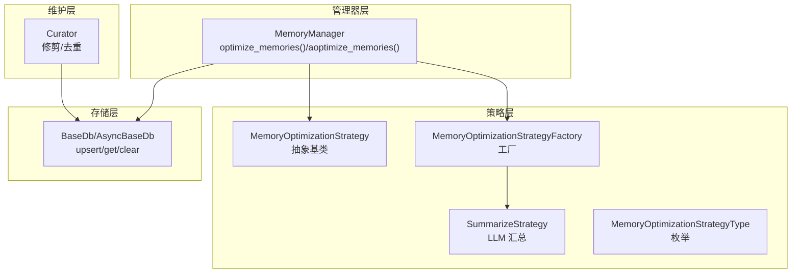
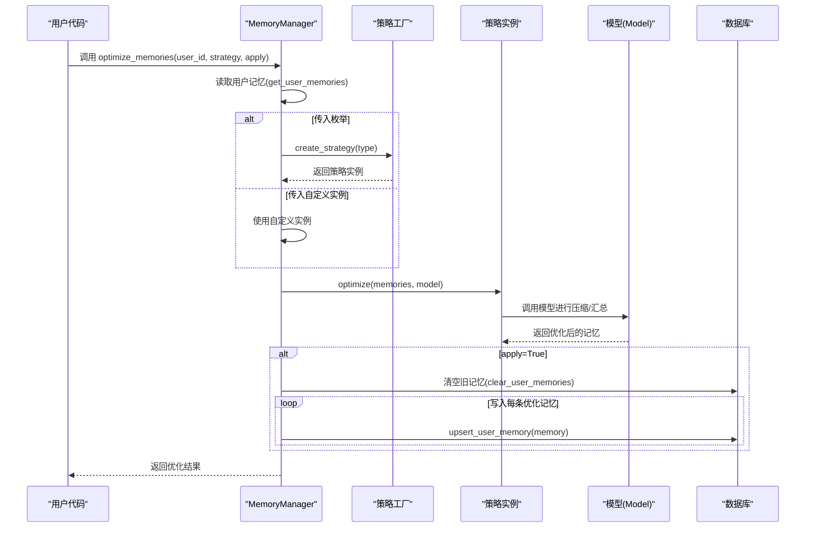
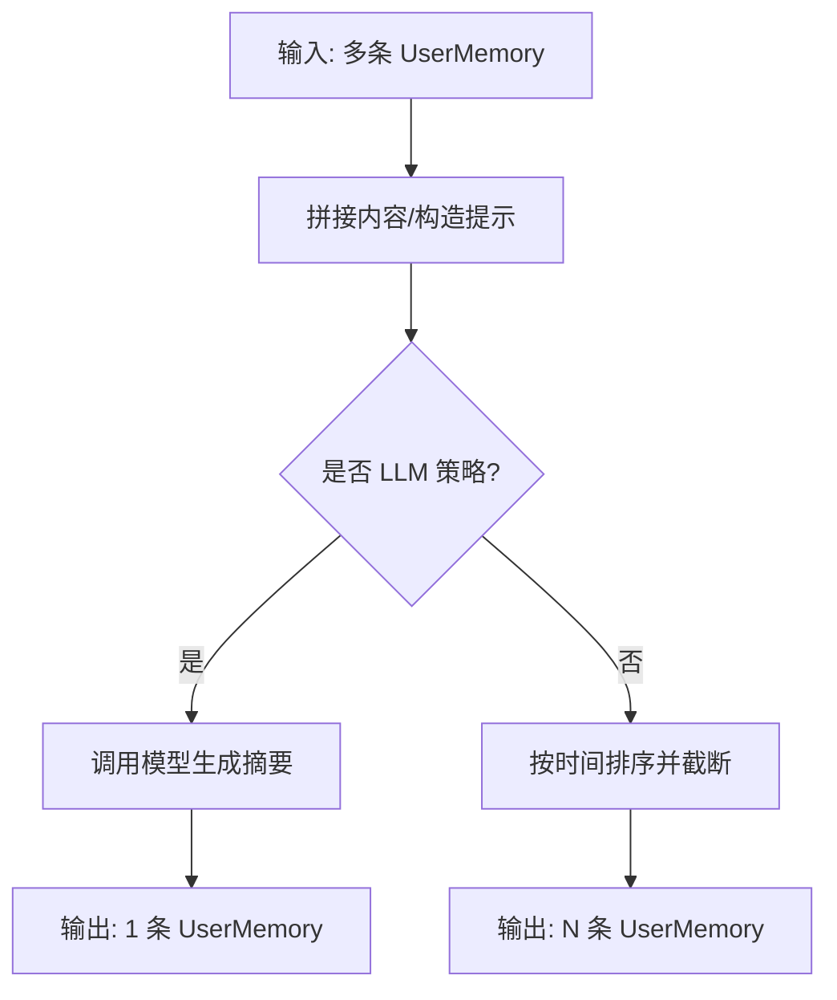
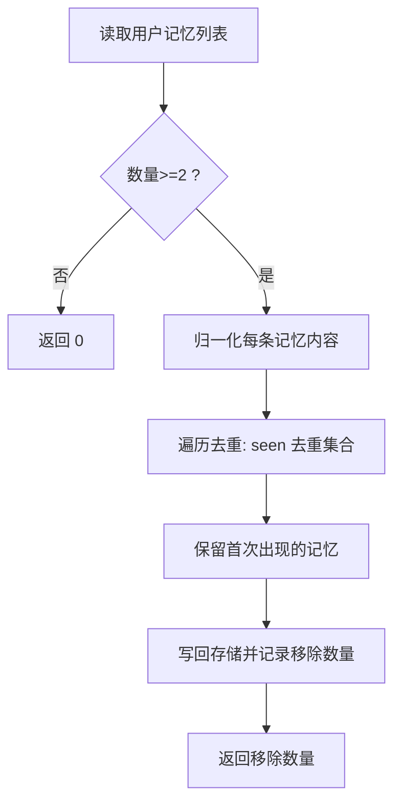
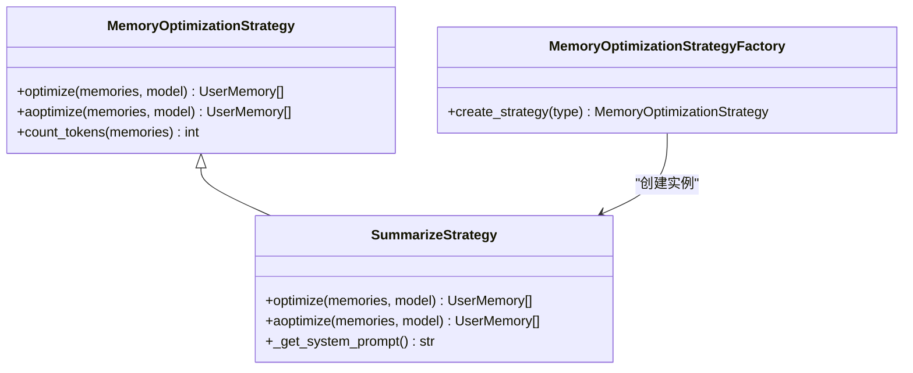
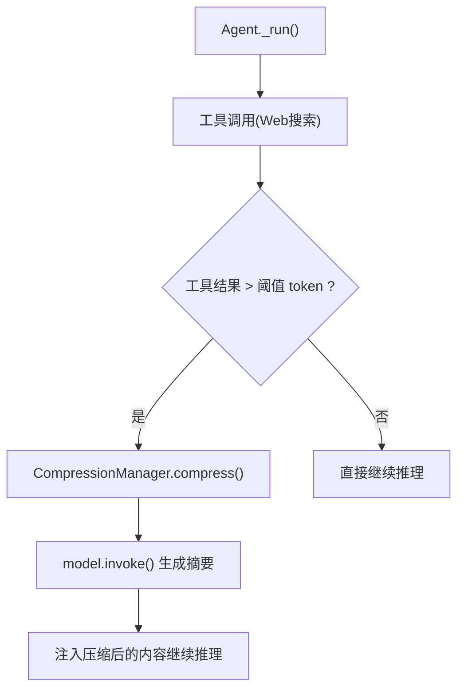
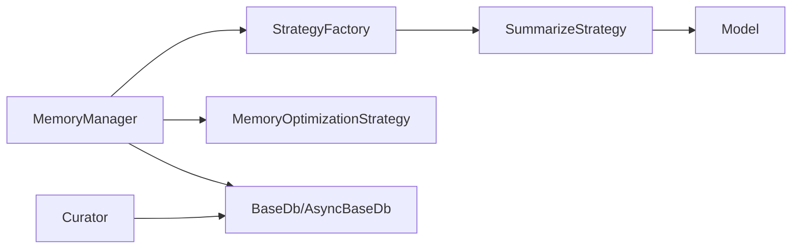

# 内存优化

<cite>
**本文引用的文件**
- [libs/agno/agno/memory/manager.py](file://libs/agno/agno/memory/manager.py)
- [libs/agno/agno/memory/strategies/base.py](file://libs/agno/agno/memory/strategies/base.py)
- [libs/agno/agno/memory/strategies/summarize.py](file://libs/agno/agno/memory/strategies/summarize.py)
- [libs/agno/agno/memory/strategies/types.py](file://libs/agno/agno/memory/strategies/types.py)
- [libs/agno/agno/learn/curate.py](file://libs/agno/agno/learn/curate.py)
- [cookbook/11_memory/optimize_memories/01_memory_summarize_strategy.md](file://cookbook/11_memory/optimize_memories/01_memory_summarize_strategy.md)
- [cookbook/11_memory/optimize_memories/02_custom_memory_strategy.md](file://cookbook/11_memory/optimize_memories/02_custom_memory_strategy.md)
- [cookbook/02_agents/14_advanced/advanced_compression.md](file://cookbook/02_agents/14_advanced/advanced_compression.md)
- [cookbook/03_teams/01_quickstart/09_caching.md](file://cookbook/03_teams/01_quickstart/09_caching.md)
- [cookbook/09_evals/performance/response_with_storage.py.md](file://cookbook/09_evals/performance/response_with_storage.py.md)
</cite>

## 目录
1. [简介](#简介)
2. [项目结构](#项目结构)
3. [核心组件](#核心组件)
4. [架构总览](#架构总览)
5. [详细组件分析](#详细组件分析)
6. [依赖分析](#依赖分析)
7. [性能考虑](#性能考虑)
8. [故障排查指南](#故障排查指南)
9. [结论](#结论)
10. [附录](#附录)

## 简介
本文件系统性梳理 Agno 内存优化模块的实现与应用，覆盖以下主题：
- 压缩技术：基于 LLM 的语义压缩与基于纯 Python 的截断策略
- 去重算法：精确与近似字符串匹配的去重机制
- 存储优化：存储格式选择、缓存与访问性能优化
- 自定义策略：策略接口定义、实现示例与集成方式
- 最佳实践：压缩率优化、性能影响评估与调优建议

## 项目结构
内存优化能力由“管理器 + 策略体系 + 学习/维护工具”三层构成：
- 管理器层：统一入口、数据库交互、异步/同步适配
- 策略层：抽象基类 + 内置策略（汇总）+ 自定义策略
- 维护层：修剪（按年龄/数量）与去重（精确/近似）

图表来源
- [libs/agno/agno/memory/manager.py:793-935](file://libs/agno/agno/memory/manager.py#L793-L935)
- [libs/agno/agno/memory/strategies/base.py:9-67](file://libs/agno/agno/memory/strategies/base.py#L9-L67)
- [libs/agno/agno/memory/strategies/summarize.py:15-197](file://libs/agno/agno/memory/strategies/summarize.py#L15-L197)
- [libs/agno/agno/memory/strategies/types.py:8-38](file://libs/agno/agno/memory/strategies/types.py#L8-L38)
- [libs/agno/agno/learn/curate.py:27-186](file://libs/agno/agno/learn/curate.py#L27-L186)

章节来源
- [libs/agno/agno/memory/manager.py:793-935](file://libs/agno/agno/memory/manager.py#L793-L935)
- [libs/agno/agno/memory/strategies/base.py:9-67](file://libs/agno/agno/memory/strategies/base.py#L9-L67)
- [libs/agno/agno/memory/strategies/summarize.py:15-197](file://libs/agno/agno/memory/strategies/summarize.py#L15-L197)
- [libs/agno/agno/memory/strategies/types.py:8-38](file://libs/agno/agno/memory/strategies/types.py#L8-L38)
- [libs/agno/agno/learn/curate.py:27-186](file://libs/agno/agno/learn/curate.py#L27-L186)

## 核心组件
- MemoryManager.optimize_memories：同步优化入口；支持传入策略枚举或自定义策略实例；可选写回数据库
- MemoryOptimizationStrategy：策略抽象基类，要求实现同步/异步优化与可选系统提示
- SummarizeStrategy：内置 LLM 汇总策略，将多条记忆合并为单条综合摘要
- MemoryOptimizationStrategyFactory/Type：工厂与枚举，负责根据类型创建策略实例
- Curator：学习/维护工具，提供按年龄与数量修剪、以及去重（精确/近似）

章节来源
- [libs/agno/agno/memory/manager.py:793-935](file://libs/agno/agno/memory/manager.py#L793-L935)
- [libs/agno/agno/memory/strategies/base.py:9-67](file://libs/agno/agno/memory/strategies/base.py#L9-L67)
- [libs/agno/agno/memory/strategies/summarize.py:15-197](file://libs/agno/agno/memory/strategies/summarize.py#L15-L197)
- [libs/agno/agno/memory/strategies/types.py:8-38](file://libs/agno/agno/memory/strategies/types.py#L8-L38)
- [libs/agno/agno/learn/curate.py:27-186](file://libs/agno/agno/learn/curate.py#L27-L186)

## 架构总览
下图展示从用户调用到策略执行、模型调用与数据库写回的完整链路。

图表来源
- [libs/agno/agno/memory/manager.py:793-935](file://libs/agno/agno/memory/manager.py#L793-L935)
- [libs/agno/agno/memory/strategies/types.py:14-38](file://libs/agno/agno/memory/strategies/types.py#L14-L38)
- [libs/agno/agno/memory/strategies/summarize.py:44-119](file://libs/agno/agno/memory/strategies/summarize.py#L44-L119)

章节来源
- [libs/agno/agno/memory/manager.py:793-935](file://libs/agno/agno/memory/manager.py#L793-L935)
- [libs/agno/agno/memory/strategies/types.py:14-38](file://libs/agno/agno/memory/strategies/types.py#L14-L38)
- [libs/agno/agno/memory/strategies/summarize.py:44-119](file://libs/agno/agno/memory/strategies/summarize.py#L44-L119)

## 详细组件分析

### 压缩算法与策略
- SummarizeStrategy（LLM 汇总）
  - 输入：多条 UserMemory
  - 处理：拼接内容、构造系统提示、调用模型生成单条摘要
  - 输出：单条 UserMemory（保留 topics、user_id 等元数据）
  - 特点：高压缩率、语义保留、有 API 成本
- RecentOnlyStrategy（纯 Python 截断）
  - 输入：多条 UserMemory
  - 处理：按 updated_at 或 created_at 排序，截取最新 N 条
  - 输出：N 条 UserMemory
  - 特点：零 API 成本、O(n log n) 排序复杂度、信息损失取决于策略参数

图表来源
- [libs/agno/agno/memory/strategies/summarize.py:44-119](file://libs/agno/agno/memory/strategies/summarize.py#L44-L119)
- [cookbook/11_memory/optimize_memories/02_custom_memory_strategy.md:66-83](file://cookbook/11_memory/optimize_memories/02_custom_memory_strategy.md#L66-L83)

章节来源
- [libs/agno/agno/memory/strategies/summarize.py:15-197](file://libs/agno/agno/memory/strategies/summarize.py#L15-L197)
- [cookbook/11_memory/optimize_memories/01_memory_summarize_strategy.md:78-121](file://cookbook/11_memory/optimize_memories/01_memory_summarize_strategy.md#L78-L121)
- [cookbook/11_memory/optimize_memories/02_custom_memory_strategy.md:63-88](file://cookbook/11_memory/optimize_memories/02_custom_memory_strategy.md#L63-L88)

### 去重算法设计与实现
- Curator.deduplicate
  - 使用精确与近似字符串匹配去除重复
  - 文本归一化（小写、去标点、去多余空白）以提升近似匹配效果
  - 保持首次出现的记忆，移除后续重复项
- Curator.prune
  - 按最大年龄与最大数量修剪
  - 保留最新记忆，确保总量与新鲜度

图表来源
- [libs/agno/agno/learn/curate.py:84-119](file://libs/agno/agno/learn/curate.py#L84-L119)
- [libs/agno/agno/learn/curate.py:160-186](file://libs/agno/agno/learn/curate.py#L160-L186)

章节来源
- [libs/agno/agno/learn/curate.py:84-119](file://libs/agno/agno/learn/curate.py#L84-L119)
- [libs/agno/agno/learn/curate.py:160-186](file://libs/agno/agno/learn/curate.py#L160-L186)

### 存储优化策略与配置
- 存储格式选择
  - 支持同步/异步数据库接口，统一 upsert/get/clear 语义
  - 优化流程中可选择是否写回数据库（apply 参数）
- 缓存机制
  - 团队示例展示了多模型调用的缓存响应开关，减少重复调用
- 访问性能优化
  - 通过修剪与去重降低记忆总量，减少检索与上下文注入成本
  - 异步接口避免阻塞，适合高并发场景

章节来源
- [libs/agno/agno/memory/manager.py:816-862](file://libs/agno/agno/memory/manager.py#L816-L862)
- [libs/agno/agno/memory/manager.py:887-935](file://libs/agno/agno/memory/manager.py#L887-L935)
- [cookbook/03_teams/01_quickstart/09_caching.md:29-52](file://cookbook/03_teams/01_quickstart/09_caching.md#L29-L52)
- [cookbook/09_evals/performance/response_with_storage.py.md:1-70](file://cookbook/09_evals/performance/response_with_storage.py.md#L1-L70)

### 自定义内存策略开发指南
- 接口定义
  - 必须实现同步 optimize 与异步 aoptimize
  - 可选实现 get_system_prompt（仅 LLM 策略需要）
  - 提供 count_tokens 辅助统计压缩效果
- 实现示例
  - RecentOnlyStrategy：按时间排序截断，零 LLM 成本
  - SummarizeStrategy：调用模型生成摘要
- 集成方式
  - 传入 MemoryOptimizationStrategyType 枚举由工厂创建
  - 传入自定义策略实例直接使用，不经过工厂

图表来源
- [libs/agno/agno/memory/strategies/base.py:9-67](file://libs/agno/agno/memory/strategies/base.py#L9-L67)
- [libs/agno/agno/memory/strategies/summarize.py:15-197](file://libs/agno/agno/memory/strategies/summarize.py#L15-L197)
- [libs/agno/agno/memory/strategies/types.py:14-38](file://libs/agno/agno/memory/strategies/types.py#L14-L38)

章节来源
- [libs/agno/agno/memory/strategies/base.py:9-67](file://libs/agno/agno/memory/strategies/base.py#L9-L67)
- [libs/agno/agno/memory/strategies/types.py:8-38](file://libs/agno/agno/memory/strategies/types.py#L8-L38)
- [cookbook/11_memory/optimize_memories/02_custom_memory_strategy.md:40-111](file://cookbook/11_memory/optimize_memories/02_custom_memory_strategy.md#L40-L111)

### 上下文压缩与触发机制
- 触发条件
  - 当工具结果超过阈值 token 时触发压缩
  - 压缩后继续主模型推理
- 架构分层
  - 用户代码层 → Agent 层 → 压缩管理层 → 模型层

图表来源
- [cookbook/02_agents/14_advanced/advanced_compression.md:31-50](file://cookbook/02_agents/14_advanced/advanced_compression.md#L31-L50)

章节来源
- [cookbook/02_agents/14_advanced/advanced_compression.md:31-50](file://cookbook/02_agents/14_advanced/advanced_compression.md#L31-L50)

## 依赖分析
- 管理器依赖策略工厂与策略类型，策略依赖模型与数据结构
- Curator 依赖存储接口与工具函数
- 数据流：管理器 → 策略 → 模型 → 数据库

图表来源
- [libs/agno/agno/memory/manager.py:793-935](file://libs/agno/agno/memory/manager.py#L793-L935)
- [libs/agno/agno/memory/strategies/types.py:14-38](file://libs/agno/agno/memory/strategies/types.py#L14-L38)
- [libs/agno/agno/learn/curate.py:27-186](file://libs/agno/agno/learn/curate.py#L27-L186)

章节来源
- [libs/agno/agno/memory/manager.py:793-935](file://libs/agno/agno/memory/manager.py#L793-L935)
- [libs/agno/agno/memory/strategies/types.py:14-38](file://libs/agno/agno/memory/strategies/types.py#L14-L38)
- [libs/agno/agno/learn/curate.py:27-186](file://libs/agno/agno/learn/curate.py#L27-L186)

## 性能考虑
- 压缩率与成本权衡
  - SummarizeStrategy：高压缩率，有 LLM 调用成本
  - RecentOnlyStrategy：低压缩率但极低成本，适合实时性优先场景
- 时间复杂度
  - SummarizeStrategy：主要受限于模型调用与提示拼接
  - RecentOnlyStrategy：排序 O(n log n)，截断 O(n)
- I/O 与缓存
  - 优化后批量 upsert 减少多次往返
  - 团队示例展示了模型调用缓存，降低重复调用
- 存储与检索
  - 通过修剪与去重控制记忆规模，降低检索与注入成本

[本节为通用性能讨论，不直接分析具体文件]

## 故障排查指南
- 优化入口报错
  - 同步/异步数据库混用：同步接口不支持异步数据库
  - 无数据库：apply=True 且未提供数据库时无法写回
- 策略实现问题
  - 未实现同步/异步接口：导致调用失败
  - 未处理空输入：可能导致异常
- 去重无效
  - 归一化规则导致误判：检查正则与空白处理
  - 存储未保存：确认写回逻辑已执行

章节来源
- [libs/agno/agno/memory/manager.py:816-862](file://libs/agno/agno/memory/manager.py#L816-L862)
- [libs/agno/agno/memory/manager.py:887-935](file://libs/agno/agno/memory/manager.py#L887-L935)
- [libs/agno/agno/learn/curate.py:160-186](file://libs/agno/agno/learn/curate.py#L160-L186)

## 结论
- 通过策略抽象与工厂模式，内存优化具备良好的扩展性
- LLM 汇总策略提供高压缩率，纯 Python 截断策略提供低成本方案
- 去重与修剪结合，显著降低存储与检索成本
- 建议根据场景选择策略，并配合缓存与异步接口提升整体性能

[本节为总结性内容，不直接分析具体文件]

## 附录
- 使用建议
  - 高压缩需求：优先 SummarizeStrategy
  - 低延迟/低成本：优先 RecentOnlyStrategy
  - 长期维护：结合 Curator.prune 与 Curator.deduplicate
- 配置要点
  - 明确是否 apply 写回数据库
  - 控制 keep_count 与阈值 token
  - 开启模型调用缓存以减少重复成本

[本节为通用指导，不直接分析具体文件]