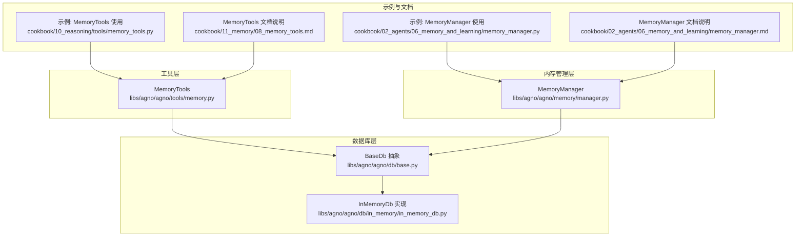
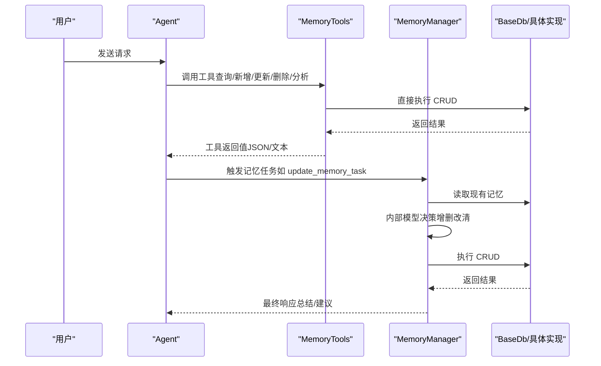
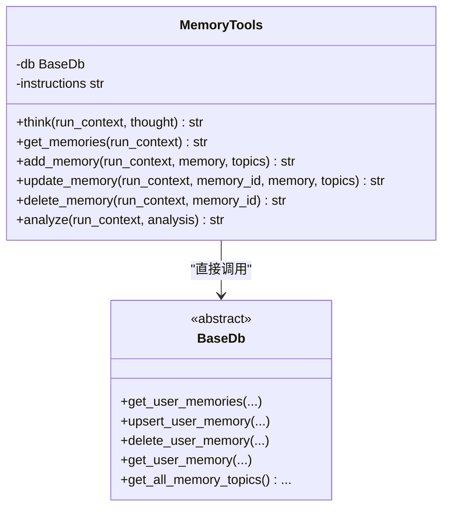
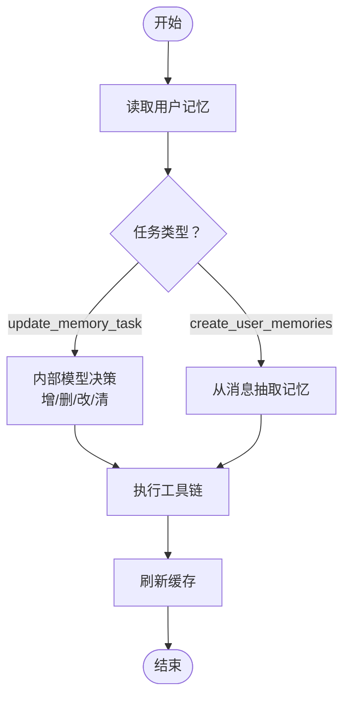
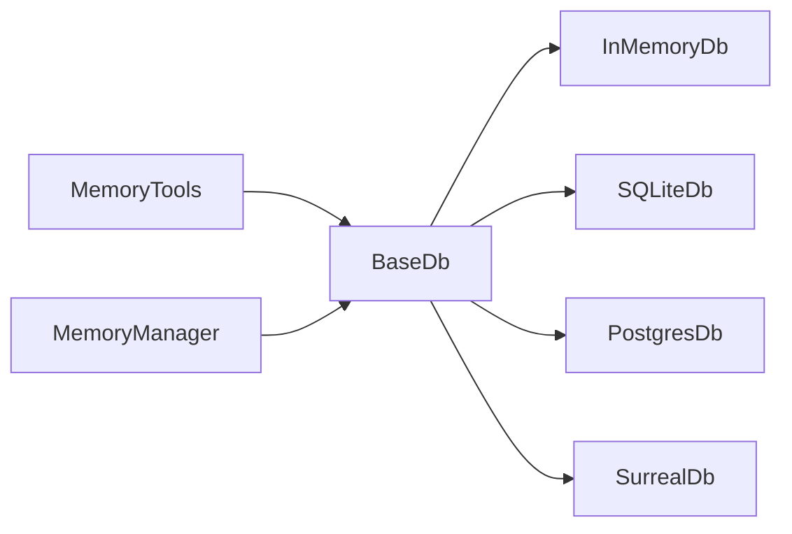

# 内存工具

<cite>
**本文引用的文件**
- [libs/agno/agno/tools/memory.py](file://libs/agno/agno/tools/memory.py)
- [libs/agno/agno/memory/manager.py](file://libs/agno/agno/memory/manager.py)
- [libs/agno/agno/db/base.py](file://libs/agno/agno/db/base.py)
- [libs/agno/agno/db/in_memory/in_memory_db.py](file://libs/agno/agno/db/in_memory/in_memory_db.py)
- [cookbook/10_reasoning/tools/memory_tools.py](file://cookbook/10_reasoning/tools/memory_tools.py)
- [cookbook/02_agents/06_memory_and_learning/memory_manager.py](file://cookbook/02_agents/06_memory_and_learning/memory_manager.py)
- [cookbook/11_memory/08_memory_tools.md](file://cookbook/11_memory/08_memory_tools.md)
- [cookbook/02_agents/06_memory_and_learning/memory_manager.md](file://cookbook/02_agents/06_memory_and_learning/memory_manager.md)
- [libs/agno/agno/memory/__init__.py](file://libs/agno/agno/memory/__init__.py)
</cite>

## 目录
1. [简介](#简介)
2. [项目结构](#项目结构)
3. [核心组件](#核心组件)
4. [架构总览](#架构总览)
5. [详细组件分析](#详细组件分析)
6. [依赖关系分析](#依赖关系分析)
7. [性能考量](#性能考量)
8. [故障排查指南](#故障排查指南)
9. [结论](#结论)
10. [附录](#附录)

## 简介
本文件系统化梳理“内存工具”在本仓库中的设计与实现，涵盖工具接口定义、功能分类与使用场景；深入解析内存查询、管理与分析工具的工作原理；阐述工具注册、参数传递与结果处理流程；介绍扩展机制（自定义工具、工具链组合、批量操作）；并说明与核心内存系统的数据流、状态同步与错误处理策略。最后提供可直接参考的使用示例路径与最佳实践建议，帮助开发者高效利用内存工具提升内存管理效率。

## 项目结构
围绕内存工具的相关模块主要分布在以下位置：
- 工具实现：libs/agno/agno/tools/memory.py
- 内存管理器：libs/agno/agno/memory/manager.py
- 数据库抽象与实现：libs/agno/agno/db/base.py、libs/agno/agno/db/in_memory/in_memory_db.py
- 使用示例：cookbook/10_reasoning/tools/memory_tools.py、cookbook/02_agents/06_memory_and_learning/memory_manager.py
- 文档说明：cookbook/11_memory/08_memory_tools.md、cookbook/02_agents/06_memory_and_learning/memory_manager.md
- 内存模块导出：libs/agno/agno/memory/__init__.py

图表来源
- [libs/agno/agno/tools/memory.py:13-64](file://libs/agno/agno/tools/memory.py#L13-L64)
- [libs/agno/agno/memory/manager.py:44-99](file://libs/agno/agno/memory/manager.py#L44-L99)
- [libs/agno/agno/db/base.py:30-277](file://libs/agno/agno/db/base.py#L30-L277)
- [libs/agno/agno/db/in_memory/in_memory_db.py:435-467](file://libs/agno/agno/db/in_memory/in_memory_db.py#L435-L467)
- [cookbook/10_reasoning/tools/memory_tools.py:18-59](file://cookbook/10_reasoning/tools/memory_tools.py#L18-L59)
- [cookbook/02_agents/06_memory_and_learning/memory_manager.py:16-48](file://cookbook/02_agents/06_memory_and_learning/memory_manager.py#L16-L48)

章节来源
- [libs/agno/agno/tools/memory.py:13-64](file://libs/agno/agno/tools/memory.py#L13-L64)
- [libs/agno/agno/memory/manager.py:44-99](file://libs/agno/agno/memory/manager.py#L44-L99)
- [libs/agno/agno/db/base.py:30-277](file://libs/agno/agno/db/base.py#L30-L277)
- [libs/agno/agno/db/in_memory/in_memory_db.py:435-467](file://libs/agno/agno/db/in_memory/in_memory_db.py#L435-L467)
- [cookbook/10_reasoning/tools/memory_tools.py:18-59](file://cookbook/10_reasoning/tools/memory_tools.py#L18-L59)
- [cookbook/02_agents/06_memory_and_learning/memory_manager.py:16-48](file://cookbook/02_agents/06_memory_and_learning/memory_manager.py#L16-L48)

## 核心组件
- MemoryTools（工具包）
  - 定位：Toolkit 子类，直接面向数据库进行细粒度 CRUD 操作，提供思考、查询、新增、更新、删除、分析等工具。
  - 关键点：支持按需启用/禁用各工具；通过 session_state 记录操作日志；默认注入使用说明与少量示例。
- MemoryManager（内存管理器）
  - 定位：面向用户的记忆管理核心，支持检索、优化、异步操作、批量清理等；可作为 Agent 的“记忆代理”，内部以独立模型驱动工具链完成记忆任务。
  - 关键点：配置 CRUD 权限、检索策略、调试模式；提供同步/异步 API；支持多种检索方法（最近、最早、智能检索）。
- BaseDb 抽象与具体实现
  - 定位：统一数据库接口，定义 get_user_memories、upsert_user_memory、delete_user_memory 等核心方法；具体实现（如内存数据库）遵循该接口。
  - 关键点：提供表名、版本、会话、指标、评估、知识、追踪、组件等多表抽象；支持批量 upsert、统计查询、主题聚合等。

章节来源
- [libs/agno/agno/tools/memory.py:13-64](file://libs/agno/agno/tools/memory.py#L13-L64)
- [libs/agno/agno/memory/manager.py:44-99](file://libs/agno/agno/memory/manager.py#L44-L99)
- [libs/agno/agno/db/base.py:30-277](file://libs/agno/agno/db/base.py#L30-L277)

## 架构总览
内存工具的运行路径通常如下：
- MemoryTools 作为工具包被注入到 Agent 中，直接调用 BaseDb 接口完成 CRUD；
- MemoryManager 作为独立组件，可由 Agent 启用“代理式记忆”能力，内部以专用模型驱动工具链完成记忆任务，并与数据库交互；
- 数据库层通过 BaseDb 抽象屏蔽不同存储后端差异，便于替换与扩展。

图表来源
- [libs/agno/agno/tools/memory.py:97-307](file://libs/agno/agno/tools/memory.py#L97-L307)
- [libs/agno/agno/memory/manager.py:481-517](file://libs/agno/agno/memory/manager.py#L481-L517)
- [libs/agno/agno/db/base.py:212-277](file://libs/agno/agno/db/base.py#L212-L277)

## 详细组件分析

### MemoryTools 组件分析
- 功能分类
  - 思考工具：记录内部思考过程，便于调试与回溯。
  - 查询工具：获取当前用户记忆列表，写入 session_state 供后续分析。
  - 新增工具：创建新记忆，自动填充 ID、用户标识与时间戳。
  - 更新工具：按 ID 更新指定字段（内容或主题），避免覆盖。
  - 删除工具：按 ID 删除记忆，记录删除详情。
  - 分析工具：对操作结果进行评估，辅助判断是否需要回退或重试。
- 参数与返回
  - 所有工具均接收 RunContext 作为上下文，自动读取 user_id 并将操作结果写入 session_state。
  - 返回值统一为 JSON 字符串或错误信息，便于工具链消费。
- 使用场景
  - 个性化助手：先查询再新增/更新，形成闭环记忆。
  - 复杂任务：结合 Think/Analyze 进行规划与验证。
  - 批量维护：配合外部脚本或工作流进行批量新增/删除。

图表来源
- [libs/agno/agno/tools/memory.py:66-337](file://libs/agno/agno/tools/memory.py#L66-L337)
- [libs/agno/agno/db/base.py:212-277](file://libs/agno/agno/db/base.py#L212-L277)

章节来源
- [libs/agno/agno/tools/memory.py:66-337](file://libs/agno/agno/tools/memory.py#L66-L337)
- [libs/agno/agno/db/base.py:212-277](file://libs/agno/agno/db/base.py#L212-L277)

### MemoryManager 组件分析
- 能力概览
  - 用户记忆 CRUD：新增、替换、删除、清空（支持同步/异步）。
  - 记忆检索：最近 N 条、最早 N 条、基于模型的智能检索。
  - 记忆优化：可选策略（如摘要）减少冗余。
  - 任务驱动：根据任务描述自动决策增删改清。
- 关键流程
  - update_memory_task：读取现有记忆 → 内部模型决策 → 工具链执行 → 刷新缓存。
  - create_user_memories/acreate_user_memories：从消息中抽取记忆 → 工具链执行 → 刷新缓存。
- 检索策略
  - last_n：按更新时间取最新若干条。
  - first_n：按更新时间取最旧若干条。
  - agentic：构造系统提示，让模型返回相关记忆 ID，再映射回记忆对象。

图表来源
- [libs/agno/agno/memory/manager.py:481-517](file://libs/agno/agno/memory/manager.py#L481-L517)
- [libs/agno/agno/memory/manager.py:368-421](file://libs/agno/agno/memory/manager.py#L368-L421)

章节来源
- [libs/agno/agno/memory/manager.py:481-517](file://libs/agno/agno/memory/manager.py#L481-L517)
- [libs/agno/agno/memory/manager.py:368-421](file://libs/agno/agno/memory/manager.py#L368-L421)

### 数据库接口与实现
- BaseDb 抽象
  - 定义了统一的记忆 CRUD、统计、主题聚合、批量 upsert 等接口，确保上层工具与管理器无需关心底层存储细节。
- InMemoryDb 实现
  - 提供内存存储的 get_all_memory_topics、get_user_memory 等方法，便于本地测试与演示。
- 与工具交互
  - MemoryTools 直接调用 BaseDb 的 CRUD 方法；
  - MemoryManager 在检索与优化时也依赖 BaseDb 的查询与 upsert 能力。

章节来源
- [libs/agno/agno/db/base.py:212-277](file://libs/agno/agno/db/base.py#L212-L277)
- [libs/agno/agno/db/in_memory/in_memory_db.py:435-467](file://libs/agno/agno/db/in_memory/in_memory_db.py#L435-L467)

## 依赖关系分析
- 组件耦合
  - MemoryTools 与 BaseDb 强耦合（直接依赖），便于快速 CRUD；
  - MemoryManager 与 BaseDb 弱耦合（通过 read_from_db/aread_from_db），便于扩展检索与优化策略。
- 外部依赖
  - 模型：MemoryManager 默认使用模型进行记忆抽取与检索；MemoryTools 不依赖模型，仅依赖数据库。
  - 数据库：可替换为 SQLite、PostgreSQL、SurrealDB 等实现，只需实现 BaseDb 接口。

图表来源
- [libs/agno/agno/tools/memory.py:42](file://libs/agno/agno/tools/memory.py#L42)
- [libs/agno/agno/memory/manager.py:72](file://libs/agno/agno/memory/manager.py#L72)
- [libs/agno/agno/db/base.py:30](file://libs/agno/agno/db/base.py#L30)

章节来源
- [libs/agno/agno/tools/memory.py:42](file://libs/agno/agno/tools/memory.py#L42)
- [libs/agno/agno/memory/manager.py:72](file://libs/agno/agno/memory/manager.py#L72)
- [libs/agno/agno/db/base.py:30](file://libs/agno/agno/db/base.py#L30)

## 性能考量
- 批量操作
  - BaseDb 支持批量 upsert（upsert_memories），MemoryManager 在创建记忆时亦提供批量能力，适合大规模导入/更新。
- 检索策略
  - last_n/first_n：O(n log n) 排序，limit 控制输出规模；
  - agentic 检索：需要遍历所有记忆并调用模型，适合关键场景但成本较高。
- 异步支持
  - MemoryManager 提供异步 API（acreate_user_memories、aupdate_memory_task、aclear_user_memories），在高并发下降低阻塞。
- 日志与调试
  - MemoryManager 支持 debug_mode，便于定位问题；MemoryTools 将操作记录写入 session_state，利于审计。

章节来源
- [libs/agno/agno/db/base.py:270-277](file://libs/agno/agno/db/base.py#L270-L277)
- [libs/agno/agno/memory/manager.py:423-479](file://libs/agno/agno/memory/manager.py#L423-L479)
- [libs/agno/agno/memory/manager.py:519-558](file://libs/agno/agno/memory/manager.py#L519-L558)

## 故障排查指南
- 常见错误与处理
  - 记忆 ID 不存在：更新/删除前应先 get_memories 校验 ID；MemoryTools 对此类错误返回明确错误信息。
  - 数据库未初始化：MemoryManager 在缺少 db 时会返回提示；确保传入有效 BaseDb 实例。
  - 异步不兼容：使用异步 DB 时请调用异步 API（如 aclear_user_memories），避免混用同步/异步导致异常。
- 日志与审计
  - MemoryTools 将每次操作写入 session_state，便于回放与分析；
  - MemoryManager 支持 debug 模式，输出详细日志。
- 错误传播
  - 所有工具返回 JSON 字符串，包含 success/error 字段，便于上层统一处理。

章节来源
- [libs/agno/agno/tools/memory.py:205-211](file://libs/agno/agno/tools/memory.py#L205-L211)
- [libs/agno/agno/memory/manager.py:380-387](file://libs/agno/agno/memory/manager.py#L380-L387)
- [libs/agno/agno/memory/manager.py:519-558](file://libs/agno/agno/memory/manager.py#L519-L558)

## 结论
内存工具体系以 MemoryTools 与 MemoryManager 为核心，前者强调“直接 CRUD + 思考/分析”的细粒度控制，后者强调“任务驱动 + 智能检索 + 优化”的高层封装。二者共享 BaseDb 抽象，既保证灵活性又便于扩展。通过 session_state 与调试模式，开发者可以高效地进行问题定位与流程优化。建议在复杂场景优先使用 MemoryManager 的任务驱动能力，在需要精细控制时采用 MemoryTools 的工具链组合。

## 附录

### 工具注册与参数传递
- MemoryTools 注册
  - 通过构造函数传入 db，并选择性启用/禁用各工具（如 enable_get_memories、enable_add_memory 等）。
  - 初始化后作为 Toolkit 注入到 Agent 的工具列表。
- 参数传递
  - 所有工具接收 RunContext，自动携带 user_id 与 session_state；
  - 新增/更新工具支持 topics 字段，便于检索与分类。
- 结果处理
  - 工具返回 JSON 字符串，包含 success、operation、memory/错误信息等字段；
  - MemoryTools 将操作结果写入 session_state，便于后续分析。

章节来源
- [libs/agno/agno/tools/memory.py:14-64](file://libs/agno/agno/tools/memory.py#L14-L64)
- [libs/agno/agno/tools/memory.py:97-307](file://libs/agno/agno/tools/memory.py#L97-L307)

### 使用示例与最佳实践
- 示例路径
  - MemoryTools 快速上手：cookbook/10_reasoning/tools/memory_tools.py
  - MemoryManager 快速上手：cookbook/02_agents/06_memory_and_learning/memory_manager.py
- 最佳实践
  - 先查询再更新：使用 get_memories 获取现有记忆，再用 update_memory 精准修改；
  - 主题建模：为新增记忆提供合理 topics，提升检索质量；
  - 任务驱动：复杂场景优先使用 MemoryManager 的 update_memory_task；
  - 批量操作：使用 upsert_memories 与 create_user_memories 批量导入；
  - 异步并发：高吞吐场景使用异步 API，避免阻塞；
  - 审计留痕：依赖 session_state 与日志，保留完整操作轨迹。

章节来源
- [cookbook/10_reasoning/tools/memory_tools.py:18-59](file://cookbook/10_reasoning/tools/memory_tools.py#L18-L59)
- [cookbook/02_agents/06_memory_and_learning/memory_manager.py:16-48](file://cookbook/02_agents/06_memory_and_learning/memory_manager.py#L16-L48)