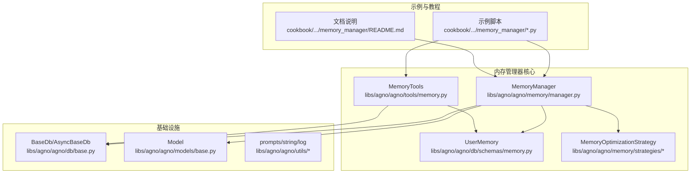
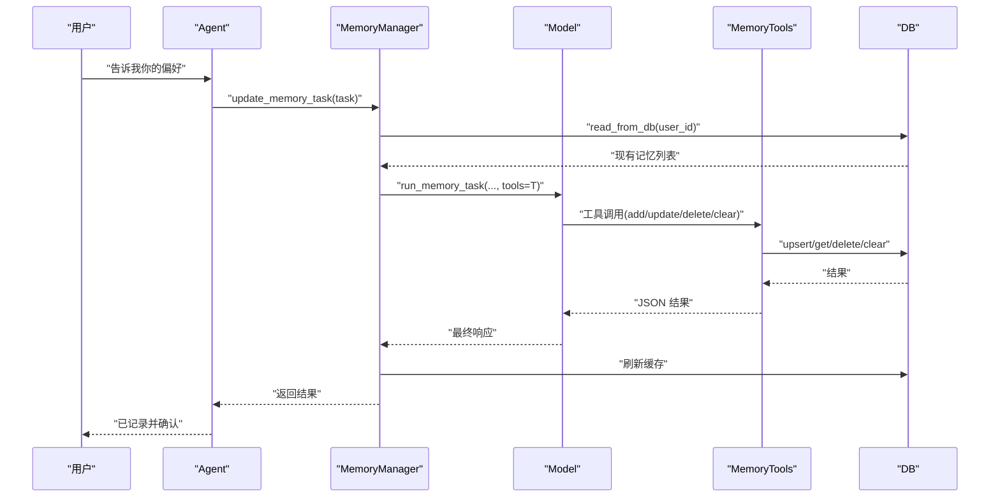
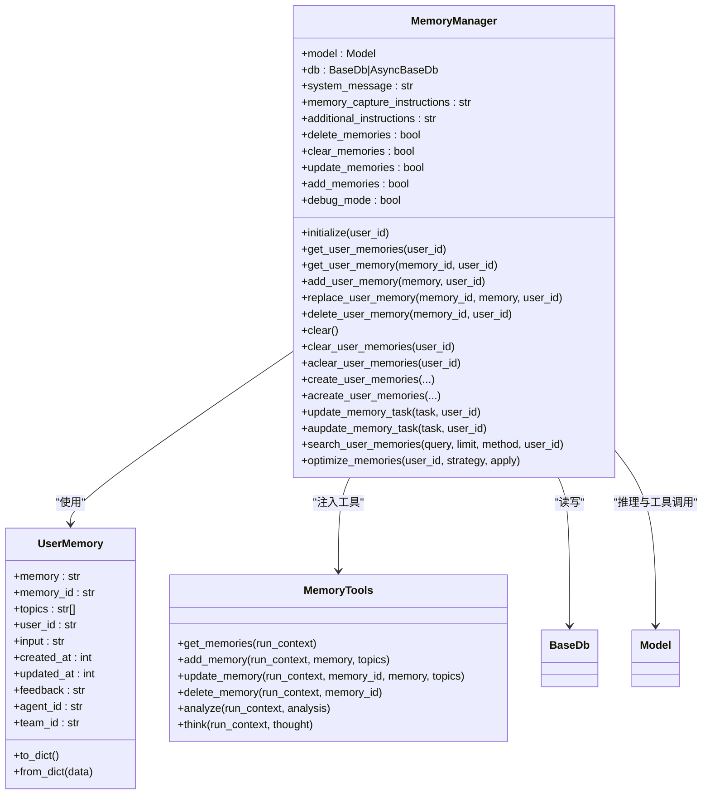
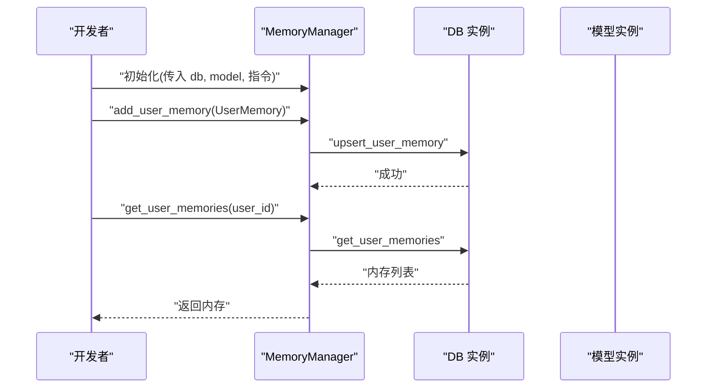
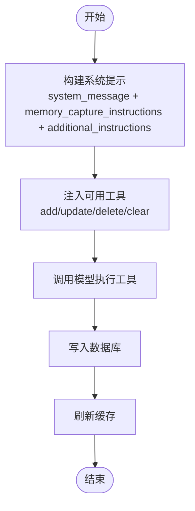
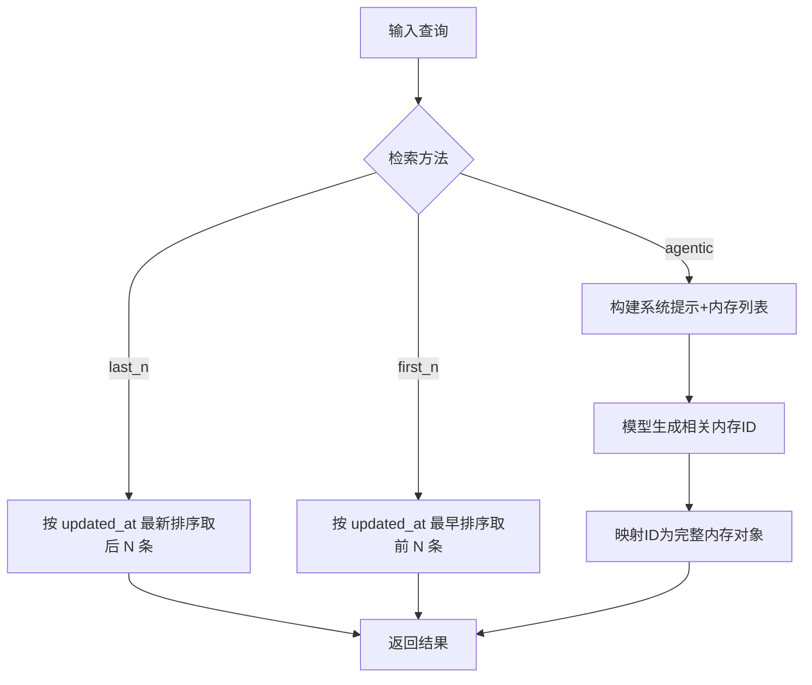
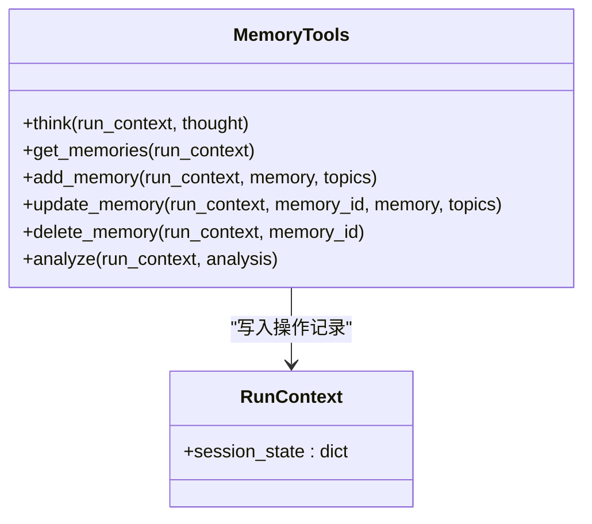
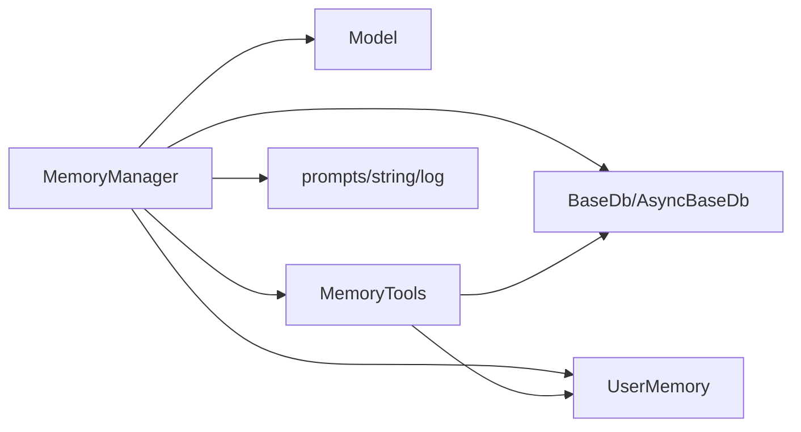

# 内存管理器

<cite>
**本文引用的文件**
- [libs/agno/agno/memory/manager.py](file://libs/agno/agno/memory/manager.py)
- [libs/agno/agno/db/schemas/memory.py](file://libs/agno/agno/db/schemas/memory.py)
- [libs/agno/agno/tools/memory.py](file://libs/agno/agno/tools/memory.py)
- [libs/agno/agno/db/base.py](file://libs/agno/agno/db/base.py)
- [libs/agno/agno/models/base.py](file://libs/agno/agno/models/base.py)
- [libs/agno/agno/utils/prompts.py](file://libs/agno/agno/utils/prompts.py)
- [libs/agno/agno/utils/string.py](file://libs/agno/agno/utils/string.py)
- [libs/agno/agno/utils/log.py](file://libs/agno/agno/utils/log.py)
- [libs/agno/agno/memory/strategies/types.py](file://libs/agno/agno/memory/strategies/types.py)
- [libs/agno/agno/memory/strategies/__init__.py](file://libs/agno/agno/memory/strategies/__init__.py)
- [cookbook/02_agents/06_memory_and_learning/memory_manager.py](file://cookbook/02_agents/06_memory_and_learning/memory_manager.py)
- [cookbook/02_agents/06_memory_and_learning/memory_manager.md](file://cookbook/02_agents/06_memory_and_learning/memory_manager.md)
- [cookbook/11_memory/memory_manager/README.md](file://cookbook/11_memory/memory_manager/README.md)
- [cookbook/11_memory/memory_manager/01_standalone_memory.py](file://cookbook/11_memory/memory_manager/01_standalone_memory.py)
- [cookbook/11_memory/memory_manager/02_memory_creation.py](file://cookbook/11_memory/memory_manager/02_memory_creation.py)
- [cookbook/11_memory/memory_manager/03_custom_memory_instructions.py](file://cookbook/11_memory/memory_manager/03_custom_memory_instructions.py)
- [cookbook/11_memory/memory_manager/04_memory_search.py](file://cookbook/11_memory/memory_manager/04_memory_search.py)
- [cookbook/11_memory/memory_manager/05_db_tools_control.py](file://cookbook/11_memory/memory_manager/05_db_tools_control.py)
</cite>

## 目录
1. [简介](#简介)
2. [项目结构](#项目结构)
3. [核心组件](#核心组件)
4. [架构总览](#架构总览)
5. [详细组件分析](#详细组件分析)
6. [依赖关系分析](#依赖关系分析)
7. [性能考虑](#性能考虑)
8. [故障排查指南](#故障排查指南)
9. [结论](#结论)
10. [附录](#附录)

## 简介
本文件面向“内存管理器”模块，系统化阐述其设计理念、架构实现与使用方法。重点覆盖以下方面：
- 内存策略配置与清理机制设计
- 性能优化策略与日志控制
- 独立内存的创建与管理（初始化、配置、使用示例）
- 自定义内存指令的实现（解析、执行流程、参数配置）
- 内存搜索功能（检索算法、索引机制、查询优化）
- 数据库工具控制机制（工具注册、权限管理、执行监控）
- 完整 API 参考与使用示例

## 项目结构
内存管理器位于 agno 库中，围绕 MemoryManager 核心类展开，并与数据库接口、模型接口、工具集、策略模块协同工作。示例与教程位于 cookbook 中，便于直接上手。

**图表来源**
- [libs/agno/agno/memory/manager.py](file://libs/agno/agno/memory/manager.py)
- [libs/agno/agno/db/schemas/memory.py](file://libs/agno/agno/db/schemas/memory.py)
- [libs/agno/agno/tools/memory.py](file://libs/agno/agno/tools/memory.py)
- [libs/agno/agno/db/base.py](file://libs/agno/agno/db/base.py)
- [libs/agno/agno/models/base.py](file://libs/agno/agno/models/base.py)
- [libs/agno/agno/memory/strategies/types.py](file://libs/agno/agno/memory/strategies/types.py)
- [cookbook/11_memory/memory_manager/README.md](file://cookbook/11_memory/memory_manager/README.md)

**章节来源**
- [libs/agno/agno/memory/manager.py](file://libs/agno/agno/memory/manager.py)
- [libs/agno/agno/db/schemas/memory.py](file://libs/agno/agno/db/schemas/memory.py)
- [libs/agno/agno/tools/memory.py](file://libs/agno/agno/tools/memory.py)
- [libs/agno/agno/db/base.py](file://libs/agno/agno/db/base.py)
- [libs/agno/agno/models/base.py](file://libs/agno/agno/models/base.py)
- [libs/agno/agno/memory/strategies/types.py](file://libs/agno/agno/memory/strategies/types.py)
- [cookbook/11_memory/memory_manager/README.md](file://cookbook/11_memory/memory_manager/README.md)

## 核心组件
- MemoryManager：内存管理核心类，负责读写数据库、执行记忆任务、检索与优化、日志与调试模式等。
- UserMemory：内存数据模型，统一内存字段与时间戳处理。
- MemoryTools：内存工具集，封装 get/add/update/delete/analyze 等工具，支持在运行时注入到 Agent。
- 数据库接口：BaseDb/AsyncBaseDb，抽象出 upsert/get/delete/clear 等能力。
- 模型接口：Model，抽象出消息、响应格式、结构化输出等能力。
- 策略模块：MemoryOptimizationStrategy，提供内存优化策略工厂与类型。

**章节来源**
- [libs/agno/agno/memory/manager.py](file://libs/agno/agno/memory/manager.py)
- [libs/agno/agno/db/schemas/memory.py](file://libs/agno/agno/db/schemas/memory.py)
- [libs/agno/agno/tools/memory.py](file://libs/agno/agno/tools/memory.py)
- [libs/agno/agno/db/base.py](file://libs/agno/agno/db/base.py)
- [libs/agno/agno/models/base.py](file://libs/agno/agno/models/base.py)
- [libs/agno/agno/memory/strategies/types.py](file://libs/agno/agno/memory/strategies/types.py)

## 架构总览
内存管理器采用“模型-工具-数据库”三层协作：
- 模型层：负责记忆任务的推理与工具调用（如 add/update/delete/clear）。
- 工具层：MemoryTools 提供可插拔的内存操作工具，支持权限开关与示例引导。
- 数据层：通过 BaseDb/AsyncBaseDb 抽象访问具体存储（如 SQLite/PostgreSQL/SurrealDB 等）。

**图表来源**
- [libs/agno/agno/memory/manager.py](file://libs/agno/agno/memory/manager.py)
- [libs/agno/agno/tools/memory.py](file://libs/agno/agno/tools/memory.py)
- [libs/agno/agno/db/base.py](file://libs/agno/agno/db/base.py)

**章节来源**
- [libs/agno/agno/memory/manager.py](file://libs/agno/agno/memory/manager.py)
- [libs/agno/agno/tools/memory.py](file://libs/agno/agno/tools/memory.py)
- [libs/agno/agno/db/base.py](file://libs/agno/agno/db/base.py)

## 详细组件分析

### MemoryManager 类与内存策略
- 初始化与配置
  - 支持传入模型、系统提示、记忆捕获指令、附加指令、数据库实例、CRUD 开关、调试模式等。
  - 若未提供模型，默认尝试加载 OpenAIChat 并回退错误提示。
- 数据读取与缓存
  - 同步/异步读取：read_from_db/aread_from_db，按 user_id 分组返回内存列表。
  - 日志级别：set_log_level 根据 debug_mode 或环境变量切换。
- 基础 CRUD
  - get_user_memories/ get_user_memory：获取用户内存或单条内存。
  - add_user_memory/ replace_user_memory：新增或替换内存，自动补全时间戳与 user_id。
  - delete_user_memory：删除指定内存。
  - clear/clear_user_memories/aclear_user_memories：清空所有或某用户的内存。
- 记忆任务执行
  - create_user_memories/acreate_user_memories：从多条消息批量创建/更新记忆。
  - update_memory_task/aupdate_memory_task：以任务形式驱动记忆更新，内部调用 run_memory_task/arun_memory_task。
- 搜索与检索
  - search_user_memories：支持 last_n/first_n/agentic 三种检索方式。
  - _search_user_memories_agentic：基于模型的语义检索，返回最相关内存 ID 列表，再映射为完整内存对象。
  - _get_last_n_memories/_get_first_n_memories：按时间排序返回前 N 条。
- 优化与清理
  - optimize_memories：基于策略对内存进行总结/压缩等优化（策略类型由工厂提供）。

**图表来源**
- [libs/agno/agno/memory/manager.py](file://libs/agno/agno/memory/manager.py)
- [libs/agno/agno/db/schemas/memory.py](file://libs/agno/agno/db/schemas/memory.py)
- [libs/agno/agno/tools/memory.py](file://libs/agno/agno/tools/memory.py)
- [libs/agno/agno/db/base.py](file://libs/agno/agno/db/base.py)
- [libs/agno/agno/models/base.py](file://libs/agno/agno/models/base.py)

**章节来源**
- [libs/agno/agno/memory/manager.py](file://libs/agno/agno/memory/manager.py)
- [libs/agno/agno/db/schemas/memory.py](file://libs/agno/agno/db/schemas/memory.py)
- [libs/agno/agno/tools/memory.py](file://libs/agno/agno/tools/memory.py)

### 独立内存的创建与管理
- 初始化
  - 通过构造函数传入 db 与 model，设置 CRUD 开关与附加指令。
  - 支持同步/异步数据库实例；异步场景下需使用对应异步方法。
- 配置选项
  - system_message/memory_capture_instructions/additional_instructions：定制系统提示与记忆捕获规则。
  - debug_mode：开启调试日志。
- 使用示例
  - 示例脚本展示了如何创建 Agent 并启用 MemoryManager，随后进行两次交互以验证记忆持久性。
  - 教程文档提供了架构分层说明与工具调用流程。

**图表来源**
- [libs/agno/agno/memory/manager.py](file://libs/agno/agno/memory/manager.py)
- [libs/agno/agno/db/base.py](file://libs/agno/agno/db/base.py)

**章节来源**
- [libs/agno/agno/memory/manager.py](file://libs/agno/agno/memory/manager.py)
- [cookbook/02_agents/06_memory_and_learning/memory_manager.py](file://cookbook/02_agents/06_memory_and_learning/memory_manager.py)
- [cookbook/02_agents/06_memory_and_learning/memory_manager.md](file://cookbook/02_agents/06_memory_and_learning/memory_manager.md)

### 自定义内存指令的实现
- 指令注入
  - system_message：完全自定义系统提示。
  - memory_capture_instructions：记忆捕获阶段的专用指令。
  - additional_instructions：追加到默认系统提示末尾。
- 执行流程
  - MemoryManager 在 run_memory_task 中组合上述指令，构建系统消息与工具说明，然后调用模型执行工具。
  - 工具调用结果会写入数据库并刷新缓存。
- 参数配置
  - CRUD 开关：delete_memories/clear_memories/update_memories/add_memories 控制可用工具集合。
  - 检索方法：search_user_memories 支持 last_n/first_n/agentic，其中 agentic 依赖模型的结构化输出能力。

**图表来源**
- [libs/agno/agno/memory/manager.py](file://libs/agno/agno/memory/manager.py)

**章节来源**
- [libs/agno/agno/memory/manager.py](file://libs/agno/agno/memory/manager.py)

### 内存搜索功能
- 检索算法
  - last_n：按 updated_at 最新排序取最后 N 条。
  - first_n：按 updated_at 最早排序取前 N 条。
  - agentic：将所有内存内容拼接为系统提示，要求模型返回最相关内存 ID 列表，再映射为完整内存对象。
- 索引机制
  - 当前实现未见专用向量索引；agentic 模式通过模型解析内存文本完成相似度判断。
- 查询优化
  - 限制返回数量：limit 参数控制返回上限。
  - 响应格式适配：根据模型能力选择原生结构化输出、JSON Schema 或 JSON Object 输出格式。

**图表来源**
- [libs/agno/agno/memory/manager.py](file://libs/agno/agno/memory/manager.py)
- [libs/agno/agno/utils/prompts.py](file://libs/agno/agno/utils/prompts.py)
- [libs/agno/agno/utils/string.py](file://libs/agno/agno/utils/string.py)

**章节来源**
- [libs/agno/agno/memory/manager.py](file://libs/agno/agno/memory/manager.py)

### 数据库工具控制机制
- 工具注册
  - MemoryTools 构造时根据开关 enable_* 注册 think/get_memories/add_memory/update_memory/delete_memory/analyze。
- 权限管理
  - 通过构造参数控制工具可用性，避免不必要的操作暴露。
- 执行监控
  - 所有工具调用均记录到 run_context.session_state 的 memory_operations 中，便于审计与复盘。
- 与 MemoryManager 协作
  - MemoryManager 在 run_memory_task 中将 MemoryTools 注入模型工具集，实现端到端的内存操作闭环。

**图表来源**
- [libs/agno/agno/tools/memory.py](file://libs/agno/agno/tools/memory.py)

**章节来源**
- [libs/agno/agno/tools/memory.py](file://libs/agno/agno/tools/memory.py)

## 依赖关系分析
- 组件耦合
  - MemoryManager 与 Model、DB、Schema 强耦合；与工具集弱耦合（通过工具注入）。
  - MemoryTools 仅依赖 DB 与运行时上下文，职责清晰。
- 外部依赖
  - 模型层依赖具体 Provider（如 OpenAI），若未安装则报错并退出。
  - 日志与提示工具提供统一的输出格式与解析能力。
- 循环依赖
  - 未发现循环导入；模块间通过接口抽象解耦。

**图表来源**
- [libs/agno/agno/memory/manager.py](file://libs/agno/agno/memory/manager.py)
- [libs/agno/agno/tools/memory.py](file://libs/agno/agno/tools/memory.py)
- [libs/agno/agno/db/base.py](file://libs/agno/agno/db/base.py)
- [libs/agno/agno/models/base.py](file://libs/agno/agno/models/base.py)
- [libs/agno/agno/utils/prompts.py](file://libs/agno/agno/utils/prompts.py)
- [libs/agno/agno/utils/string.py](file://libs/agno/agno/utils/string.py)
- [libs/agno/agno/utils/log.py](file://libs/agno/agno/utils/log.py)

**章节来源**
- [libs/agno/agno/memory/manager.py](file://libs/agno/agno/memory/manager.py)
- [libs/agno/agno/tools/memory.py](file://libs/agno/agno/tools/memory.py)
- [libs/agno/agno/db/base.py](file://libs/agno/agno/db/base.py)
- [libs/agno/agno/models/base.py](file://libs/agno/agno/models/base.py)
- [libs/agno/agno/utils/prompts.py](file://libs/agno/agno/utils/prompts.py)
- [libs/agno/agno/utils/string.py](file://libs/agno/agno/utils/string.py)
- [libs/agno/agno/utils/log.py](file://libs/agno/agno/utils/log.py)

## 性能考虑
- 模型成本控制
  - 主对话与记忆任务可使用不同模型实例，降低记忆处理成本（示例文档展示主模型与记忆模型分离）。
- I/O 优化
  - 批量删除：clear_user_memories 通过一次查询获取所有 ID 后批量删除，减少往返次数。
  - 异步支持：提供异步读写与清理方法，适合高并发场景。
- 检索效率
  - last_n/first_n 为 O(n log n) 排序；agentic 检索依赖模型解析，适合少量内存或专用场景。
- 日志与调试
  - debug_mode 可切换日志级别，便于定位问题但可能影响性能。

**章节来源**
- [libs/agno/agno/memory/manager.py](file://libs/agno/agno/memory/manager.py)
- [cookbook/02_agents/06_memory_and_learning/memory_manager.md](file://cookbook/02_agents/06_memory_and_learning/memory_manager.md)

## 故障排查指南
- 模型未安装
  - 现象：启动时报错提示未安装默认模型 Provider。
  - 处理：提供自定义模型或安装对应 Provider。
- 数据库未初始化
  - 现象：调用 CRUD 方法返回警告或异常。
  - 处理：确保传入有效的 BaseDb/AsyncBaseDb 实例。
- 异步不兼容
  - 现象：在异步 DB 上调用同步方法抛出异常。
  - 处理：改用对应异步方法（如 aclear_user_memories）。
- 检索无结果
  - 现象：agentic 检索返回空列表。
  - 处理：检查查询是否为空、内存是否为空、模型是否支持所需输出格式。
- 权限不足
  - 现象：工具调用失败或被拒绝。
  - 处理：确认 MemoryTools 的 enable_* 开关与注入的工具集合一致。

**章节来源**
- [libs/agno/agno/memory/manager.py](file://libs/agno/agno/memory/manager.py)
- [libs/agno/agno/tools/memory.py](file://libs/agno/agno/tools/memory.py)
- [libs/agno/agno/utils/log.py](file://libs/agno/agno/utils/log.py)

## 结论
内存管理器通过清晰的职责划分与抽象接口，实现了从“记忆创建/更新/删除/清空”到“检索与优化”的完整闭环。其可配置的指令体系、灵活的工具注入与异步支持，使其既能满足基础需求，也能适应复杂场景。建议在生产环境中结合异步数据库、模型成本控制与日志监控，持续优化性能与稳定性。

## 附录

### API 参考（摘要）
- MemoryManager
  - 初始化：model, system_message, memory_capture_instructions, additional_instructions, db, CRUD 开关, debug_mode
  - 读取：get_user_memories, get_user_memory, read_from_db/aread_from_db
  - 新增/替换：add_user_memory, replace_user_memory
  - 删除/清空：delete_user_memory, clear/clear_user_memories/aclear_user_memories
  - 记忆任务：create_user_memories/acreate_user_memories, update_memory_task/aupdate_memory_task
  - 搜索：search_user_memories, _search_user_memories_agentic, _get_last_n_memories, _get_first_n_memories
  - 优化：optimize_memories
- MemoryTools
  - think, get_memories, add_memory, update_memory, delete_memory, analyze
- UserMemory
  - 字段：memory, memory_id, topics, user_id, input, created_at, updated_at, feedback, agent_id, team_id
  - 方法：to_dict, from_dict

**章节来源**
- [libs/agno/agno/memory/manager.py](file://libs/agno/agno/memory/manager.py)
- [libs/agno/agno/tools/memory.py](file://libs/agno/agno/tools/memory.py)
- [libs/agno/agno/db/schemas/memory.py](file://libs/agno/agno/db/schemas/memory.py)

### 使用示例路径
- 独立内存管理器：[cookbook/11_memory/memory_manager/01_standalone_memory.py](file://cookbook/11_memory/memory_manager/01_standalone_memory.py)
- 内存创建：[cookbook/11_memory/memory_manager/02_memory_creation.py](file://cookbook/11_memory/memory_manager/02_memory_creation.py)
- 自定义内存指令：[cookbook/11_memory/memory_manager/03_custom_memory_instructions.py](file://cookbook/11_memory/memory_manager/03_custom_memory_instructions.py)
- 内存搜索：[cookbook/11_memory/memory_manager/04_memory_search.py](file://cookbook/11_memory/memory_manager/04_memory_search.py)
- 数据库工具控制：[cookbook/11_memory/memory_manager/05_db_tools_control.py](file://cookbook/11_memory/memory_manager/05_db_tools_control.py)
- 教程与示例总览：[cookbook/11_memory/memory_manager/README.md](file://cookbook/11_memory/memory_manager/README.md)