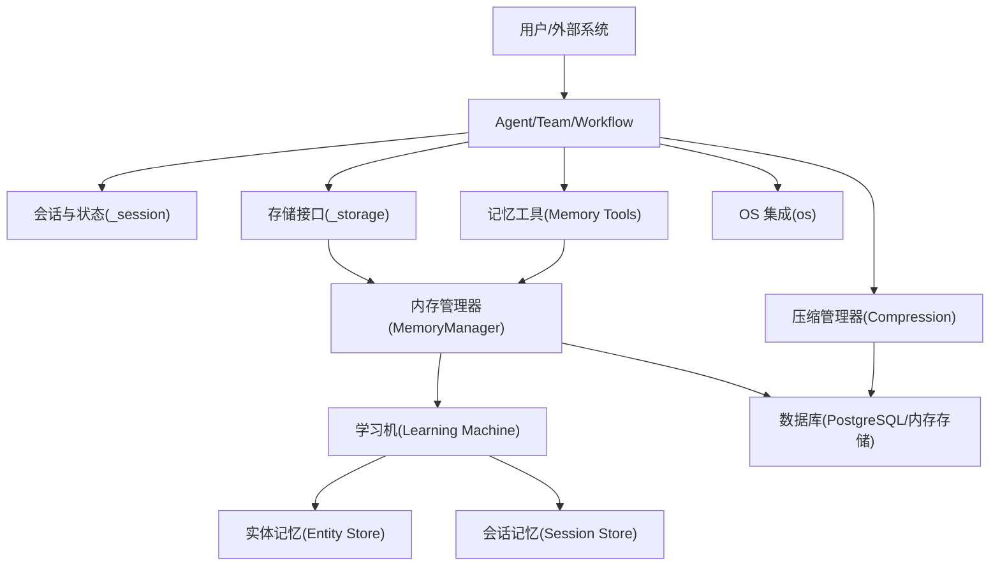
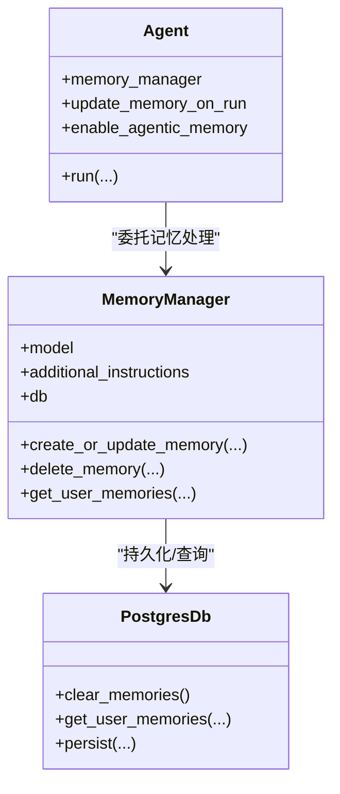
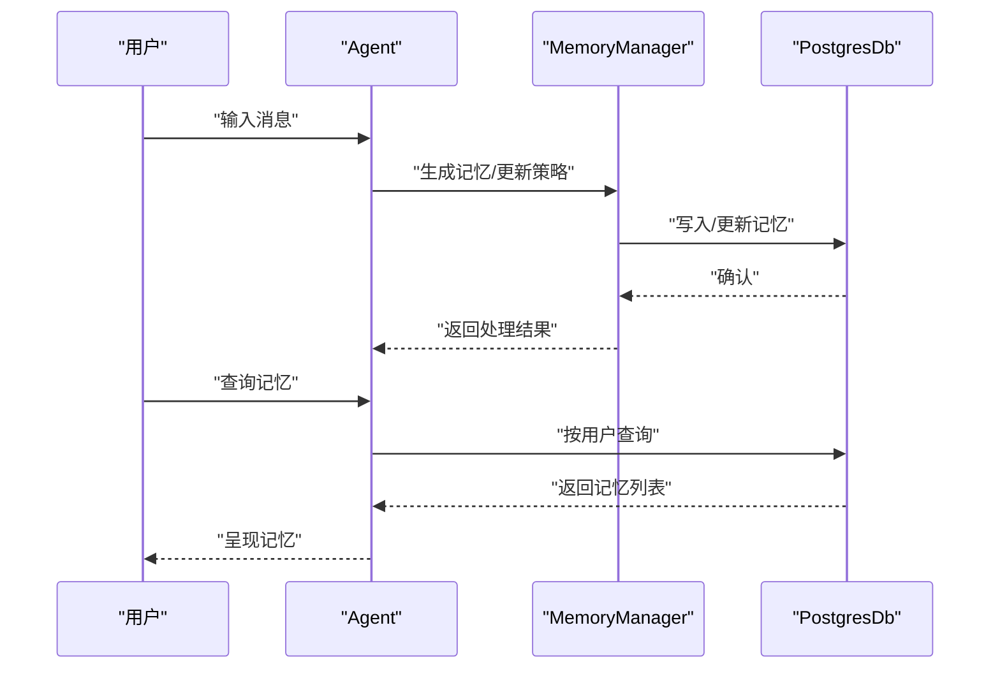
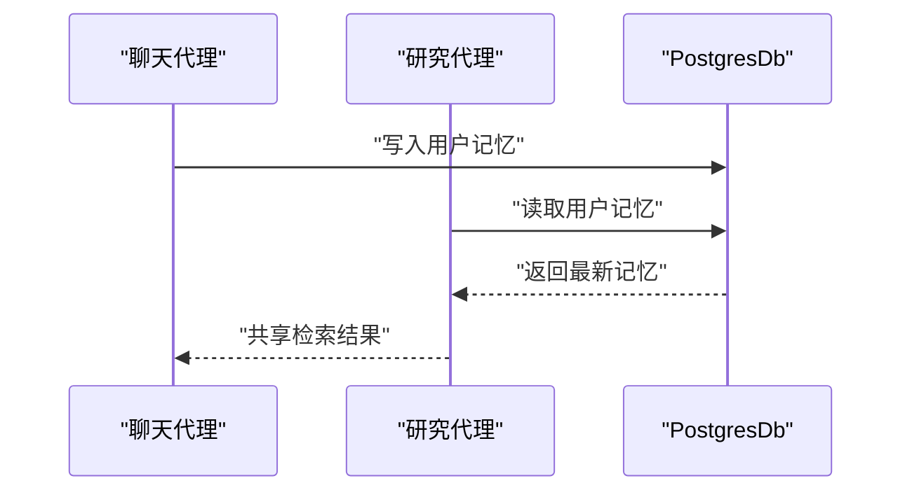
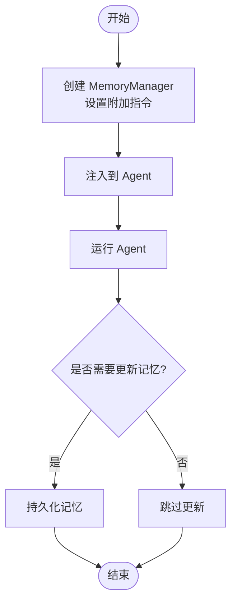
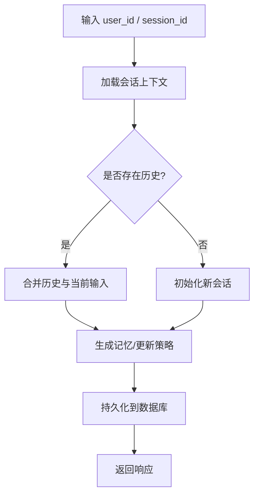
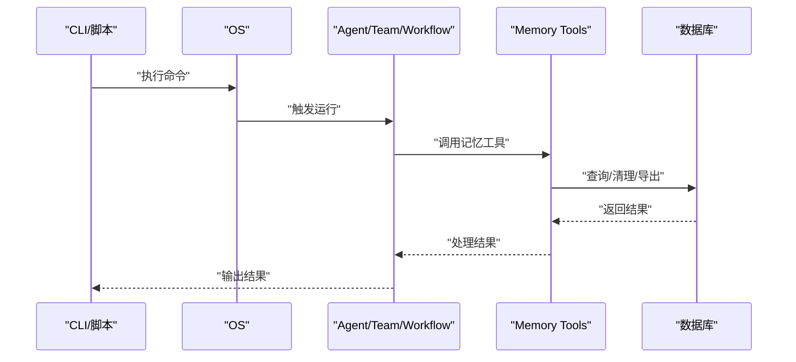
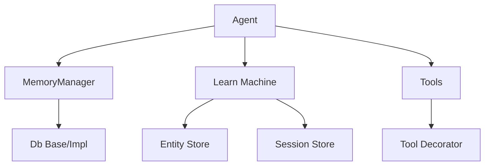

# 内存系统

<cite>
**本文引用的文件**
- [cookbook/11_memory/README.md](file://cookbook/11_memory/README.md)
- [cookbook/11_memory/01_agent_with_memory.py](file://cookbook/11_memory/01_agent_with_memory.py)
- [cookbook/11_memory/02_agentic_memory.py](file://cookbook/11_memory/02_agentic_memory.py)
- [cookbook/11_memory/03_agents_share_memory.py](file://cookbook/11_memory/03_agents_share_memory.py)
- [cookbook/11_memory/04_custom_memory_manager.py](file://cookbook/11_memory/04_custom_memory_manager.py)
- [cookbook/11_memory/05_multi_user_multi_session_chat.py](file://cookbook/11_memory/05_multi_user_multi_session_chat.py)
- [cookbook/11_memory/06_multi_user_multi_session_chat_concurrent.py](file://cookbook/11_memory/06_multi_user_multi_session_chat_concurrent.py)
- [cookbook/11_memory/07_share_memory_and_history_between_agents.py](file://cookbook/11_memory/07_share_memory_and_history_between_agents.py)
- [cookbook/11_memory/08_memory_tools.py](file://cookbook/11_memory/08_memory_tools.py)
- [cookbook/02_agents/06_memory_and_learning/memory_manager.py](file://cookbook/02_agents/06_memory_and_learning/memory_manager.py)
- [cookbook/02_agents/06_memory_and_learning/memory_manager.md](file://cookbook/02_agents/06_memory_and_learning/memory_manager.md)
- [cookbook/03_teams/06_memory/01_team_with_memory_manager.py](file://cookbook/03_teams/06_memory/01_team_with_memory_manager.py)
- [cookbook/03_teams/06_memory/02_team_with_agentic_memory.py](file://cookbook/03_teams/06_memory/02_team_with_agentic_memory.py)
- [cookbook/06_storage/in_memory/in_memory_storage_for_agent.py](file://cookbook/06_storage/in_memory/in_memory_storage_for_agent.py)
- [cookbook/06_storage/in_memory/in_memory_storage_for_team.py](file://cookbook/06_storage/in_memory/in_memory_storage_for_team.py)
- [cookbook/06_storage/in_memory/in_memory_storage_for_workflow.py](file://cookbook/06_storage/in_memory/in_memory_storage_for_workflow.py)
- [libs/agno/db/postgres.py](file://libs/agno/db/postgres.py)
- [libs/agno/db/base.py](file://libs/agno/db/base.py)
- [libs/agno/db/in_memory/base.py](file://libs/agno/db/in_memory/base.py)
- [libs/agno/db/in_memory/store.py](file://libs/agno/db/in_memory/store.py)
- [libs/agno/compression/manager.py](file://libs/agno/compression/manager.py)
- [libs/agno/learn/machine.py](file://libs/agno/learn/machine.py)
- [libs/agno/learn/stores/entity_store.py](file://libs/agno/learn/stores/entity_store.py)
- [libs/agno/learn/stores/session_store.py](file://libs/agno/learn/stores/session_store.py)
- [libs/agno/learn/utils.py](file://libs/agno/learn/utils.py)
- [libs/agno/agent/_session.py](file://libs/agno/agent/_session.py)
- [libs/agno/agent/_storage.py](file://libs/agno/agent/_storage.py)
- [libs/agno/agent/agent.py](file://libs/agno/agent/agent.py)
- [libs/agno/team/team.py](file://libs/agno/team/team.py)
- [libs/agno/workflow/workflow.py](file://libs/agno/workflow/workflow.py)
- [libs/agno/os/os.py](file://libs/agno/os/os.py)
- [libs/agno/tools/tool_decorator.py](file://libs/agno/tools/tool_decorator.py)
</cite>

## 目录
1. [简介](#简介)
2. [项目结构](#项目结构)
3. [核心组件](#核心组件)
4. [架构总览](#架构总览)
5. [详细组件分析](#详细组件分析)
6. [依赖关系分析](#依赖关系分析)
7. [性能考量](#性能考量)
8. [故障排查指南](#故障排查指南)
9. [结论](#结论)
10. [附录](#附录)

## 简介
本文件面向 Agno Learn 的内存系统，系统性梳理其设计理念、实现方式与最佳实践。重点覆盖以下方面：
- 内存管理器的设计与实现：策略、清理与性能优化
- 内存优化技术：压缩、去重与存储优化
- 代理内存管理：记忆更新、检索与同步
- 代理记忆与共享内存：管理、同步与冲突解决
- 自定义内存管理器扩展：策略定制与集成
- 多用户多会话：隔离、会话管理与安全
- 内存工具：集成与实战场景
- 架构设计与最佳实践

## 项目结构
围绕“内存”主题，仓库中存在两条主线：
- Cookbook 示例：以 Agent/Team/Workflow 为载体，演示持久化记忆、聚合记忆、共享记忆、自定义管理器、多用户多会话等用法
- 底层基础设施：数据库抽象、内存存储、压缩管理、学习与实体/会话存储、Agent/Team/Workflow 的会话与存储模块

```mermaid
graph TB
subgraph "示例与用法"
A1["01_agent_with_memory.py"]
A2["02_agentic_memory.py"]
A3["03_agents_share_memory.py"]
A4["04_custom_memory_manager.py"]
A5["05_multi_user_multi_session_chat.py"]
A6["06_multi_user_multi_session_chat_concurrent.py"]
A7["07_share_memory_and_history_between_agents.py"]
A8["08_memory_tools.py"]
end
subgraph "底层基础设施"
B1["db/postgres.py"]
B2["db/base.py"]
B3["db/in_memory/base.py"]
B4["db/in_memory/store.py"]
C1["compression/manager.py"]
D1["learn/machine.py"]
D2["learn/stores/entity_store.py"]
D3["learn/stores/session_store.py"]
E1["agent/_session.py"]
E2["agent/_storage.py"]
E3["agent/agent.py"]
F1["team/team.py"]
G1["workflow/workflow.py"]
H1["os/os.py"]
end
A1 --> B1
A2 --> B1
A3 --> B1
A4 --> B1
A5 --> B1
A6 --> B1
A7 --> B1
A8 --> B1
A1 --> E3
A2 --> E3
A3 --> E3
A4 --> E3
A5 --> E3
A6 --> E3
A7 --> E3
A8 --> E3
E3 --> E1
E3 --> E2
E3 --> D1
E3 --> D2
E3 --> D3
B3 --> B4
C1 --> E3
```



图表来源
- [cookbook/11_memory/01_agent_with_memory.py:1-68](file://cookbook/11_memory/01_agent_with_memory.py#L1-L68)
- [cookbook/11_memory/02_agentic_memory.py:1-72](file://cookbook/11_memory/02_agentic_memory.py#L1-L72)
- [cookbook/11_memory/03_agents_share_memory.py:1-61](file://cookbook/11_memory/03_agents_share_memory.py#L1-L61)
- [cookbook/11_memory/04_custom_memory_manager.py:1-58](file://cookbook/11_memory/04_custom_memory_manager.py#L1-L58)
- [cookbook/11_memory/05_multi_user_multi_session_chat.py](file://cookbook/11_memory/05_multi_user_multi_session_chat.py)
- [cookbook/11_memory/06_multi_user_multi_session_chat_concurrent.py](file://cookbook/11_memory/06_multi_user_multi_session_chat_concurrent.py)
- [cookbook/11_memory/07_share_memory_and_history_between_agents.py](file://cookbook/11_memory/07_share_memory_and_history_between_agents.py)
- [cookbook/11_memory/08_memory_tools.py](file://cookbook/11_memory/08_memory_tools.py)
- [libs/agno/db/postgres.py](file://libs/agno/db/postgres.py)
- [libs/agno/db/base.py](file://libs/agno/db/base.py)
- [libs/agno/db/in_memory/base.py](file://libs/agno/db/in_memory/base.py)
- [libs/agno/db/in_memory/store.py](file://libs/agno/db/in_memory/store.py)
- [libs/agno/compression/manager.py](file://libs/agno/compression/manager.py)
- [libs/agno/learn/machine.py](file://libs/agno/learn/machine.py)
- [libs/agno/learn/stores/entity_store.py](file://libs/agno/learn/stores/entity_store.py)
- [libs/agno/learn/stores/session_store.py](file://libs/agno/learn/stores/session_store.py)
- [libs/agno/agent/_session.py](file://libs/agno/agent/_session.py)
- [libs/agno/agent/_storage.py](file://libs/agno/agent/_storage.py)
- [libs/agno/agent/agent.py](file://libs/agno/agent/agent.py)
- [libs/agno/team/team.py](file://libs/agno/team/team.py)
- [libs/agno/workflow/workflow.py](file://libs/agno/workflow/workflow.py)
- [libs/agno/os/os.py](file://libs/agno/os/os.py)

章节来源
- [cookbook/11_memory/README.md:1-33](file://cookbook/11_memory/README.md#L1-L33)

## 核心组件
- 内存管理器（MemoryManager）：负责从对话中抽取、生成、更新、删除记忆；支持附加指令定制记忆捕获行为
- 数据库适配层：PostgreSQL 等关系型数据库作为持久化后端；内存存储用于本地测试与快速原型
- 学习与记忆存储：实体记忆（Entity Memory）、会话记忆（Session Memory）与学习机（Learning Machine）
- 代理/团队/工作流的会话与存储：在运行时维护上下文、历史与记忆，并与数据库交互
- 压缩与优化：压缩管理器用于减少存储体积与传输开销
- 工具与装饰器：通过工具扩展记忆能力，如检索、清理、导出等

章节来源
- [cookbook/02_agents/06_memory_and_learning/memory_manager.py](file://cookbook/02_agents/06_memory_and_learning/memory_manager.py)
- [cookbook/02_agents/06_memory_and_learning/memory_manager.md](file://cookbook/02_agents/06_memory_and_learning/memory_manager.md)
- [libs/agno/db/postgres.py](file://libs/agno/db/postgres.py)
- [libs/agno/db/base.py](file://libs/agno/db/base.py)
- [libs/agno/db/in_memory/base.py](file://libs/agno/db/in_memory/base.py)
- [libs/agno/db/in_memory/store.py](file://libs/agno/db/in_memory/store.py)
- [libs/agno/compression/manager.py](file://libs/agno/compression/manager.py)
- [libs/agno/learn/machine.py](file://libs/agno/learn/machine.py)
- [libs/agno/learn/stores/entity_store.py](file://libs/agno/learn/stores/entity_store.py)
- [libs/agno/learn/stores/session_store.py](file://libs/agno/learn/stores/session_store.py)
- [libs/agno/agent/_session.py](file://libs/agno/agent/_session.py)
- [libs/agno/agent/_storage.py](file://libs/agno/agent/_storage.py)
- [libs/agno/agent/agent.py](file://libs/agno/agent/agent.py)
- [libs/agno/team/team.py](file://libs/agno/team/team.py)
- [libs/agno/workflow/workflow.py](file://libs/agno/workflow/workflow.py)

## 架构总览
下图展示从代理到数据库、再到学习与存储的完整链路，以及内存优化与共享机制的交互位置。



图表来源
- [libs/agno/agent/agent.py](file://libs/agno/agent/agent.py)
- [libs/agno/agent/_session.py](file://libs/agno/agent/_session.py)
- [libs/agno/agent/_storage.py](file://libs/agno/agent/_storage.py)
- [libs/agno/db/postgres.py](file://libs/agno/db/postgres.py)
- [libs/agno/db/in_memory/base.py](file://libs/agno/db/in_memory/base.py)
- [libs/agno/db/in_memory/store.py](file://libs/agno/db/in_memory/store.py)
- [libs/agno/compression/manager.py](file://libs/agno/compression/manager.py)
- [libs/agno/learn/machine.py](file://libs/agno/learn/machine.py)
- [libs/agno/learn/stores/entity_store.py](file://libs/agno/learn/stores/entity_store.py)
- [libs/agno/learn/stores/session_store.py](file://libs/agno/learn/stores/session_store.py)
- [libs/agno/os/os.py](file://libs/agno/os/os.py)
- [cookbook/11_memory/08_memory_tools.py](file://cookbook/11_memory/08_memory_tools.py)

## 详细组件分析

### 内存管理器（MemoryManager）
- 职责
  - 从对话中抽取与生成记忆
  - 控制记忆的创建、更新、删除
  - 支持附加指令，定制记忆捕获策略
- 关键点
  - 可独立于 Agent 使用，便于复用与测试
  - 与数据库层解耦，可替换后端
- 典型流程
  - 运行前：加载会话上下文与历史
  - 运行中：根据模型输出与附加指令生成/更新记忆
  - 运行后：持久化并返回结果



图表来源
- [cookbook/02_agents/06_memory_and_learning/memory_manager.py](file://cookbook/02_agents/06_memory_and_learning/memory_manager.py)
- [cookbook/11_memory/04_custom_memory_manager.py:1-58](file://cookbook/11_memory/04_custom_memory_manager.py#L1-L58)
- [libs/agno/db/postgres.py](file://libs/agno/db/postgres.py)

章节来源
- [cookbook/02_agents/06_memory_and_learning/memory_manager.py](file://cookbook/02_agents/06_memory_and_learning/memory_manager.py)
- [cookbook/02_agents/06_memory_and_learning/memory_manager.md](file://cookbook/02_agents/06_memory_and_learning/memory_manager.md)
- [cookbook/11_memory/04_custom_memory_manager.py:1-58](file://cookbook/11_memory/04_custom_memory_manager.py#L1-L58)

### 代理内存管理（更新/检索/同步）
- 更新：在每次运行后，根据配置自动或手动更新记忆
- 检索：按用户维度查询记忆，支持过滤与排序
- 同步：多代理共享同一数据库后端，确保一致性



图表来源
- [cookbook/11_memory/01_agent_with_memory.py:1-68](file://cookbook/11_memory/01_agent_with_memory.py#L1-L68)
- [cookbook/11_memory/02_agentic_memory.py:1-72](file://cookbook/11_memory/02_agentic_memory.py#L1-L72)
- [libs/agno/db/postgres.py](file://libs/agno/db/postgres.py)

章节来源
- [cookbook/11_memory/01_agent_with_memory.py:1-68](file://cookbook/11_memory/01_agent_with_memory.py#L1-L68)
- [cookbook/11_memory/02_agentic_memory.py:1-72](file://cookbook/11_memory/02_agentic_memory.py#L1-L72)

### 代理记忆与共享内存
- 多代理共享同一数据库后端，实现跨代理的记忆共享
- 通过统一的用户标识与会话标识，保证检索与更新的一致性
- 支持不同角色代理（聊天、研究）在同一记忆空间协作



图表来源
- [cookbook/11_memory/03_agents_share_memory.py:1-61](file://cookbook/11_memory/03_agents_share_memory.py#L1-L61)
- [libs/agno/db/postgres.py](file://libs/agno/db/postgres.py)

章节来源
- [cookbook/11_memory/03_agents_share_memory.py:1-61](file://cookbook/11_memory/03_agents_share_memory.py#L1-L61)

### 自定义内存管理器扩展
- 独立创建 MemoryManager 并注入到 Agent
- 通过附加指令定制记忆捕获规则（如隐私保护）
- 与工具链结合，实现更复杂的记忆生命周期管理



图表来源
- [cookbook/11_memory/04_custom_memory_manager.py:1-58](file://cookbook/11_memory/04_custom_memory_manager.py#L1-L58)

章节来源
- [cookbook/11_memory/04_custom_memory_manager.py:1-58](file://cookbook/11_memory/04_custom_memory_manager.py#L1-L58)

### 多用户多会话内存管理
- 用户隔离：通过 user_id 区分不同用户的记忆空间
- 会话管理：通过 session_id 维护单次交互的历史与上下文
- 安全保障：数据库层支持清理与访问控制，避免越权访问



图表来源
- [cookbook/11_memory/05_multi_user_multi_session_chat.py](file://cookbook/11_memory/05_multi_user_multi_session_chat.py)
- [cookbook/11_memory/06_multi_user_multi_session_chat_concurrent.py](file://cookbook/11_memory/06_multi_user_multi_session_chat_concurrent.py)

章节来源
- [cookbook/11_memory/05_multi_user_multi_session_chat.py](file://cookbook/11_memory/05_multi_user_multi_session_chat.py)
- [cookbook/11_memory/06_multi_user_multi_session_chat_concurrent.py](file://cookbook/11_memory/06_multi_user_multi_session_chat_concurrent.py)

### 内存工具与集成
- 提供检索、清理、导出等工具，便于在运行时或离线场景操作记忆
- 工具可通过装饰器接入 Agent/Team/Workflow 生命周期钩子
- 与 OS 集成，支持命令行与自动化脚本



图表来源
- [cookbook/11_memory/08_memory_tools.py](file://cookbook/11_memory/08_memory_tools.py)
- [libs/agno/tools/tool_decorator.py](file://libs/agno/tools/tool_decorator.py)
- [libs/agno/os/os.py](file://libs/agno/os/os.py)

章节来源
- [cookbook/11_memory/08_memory_tools.py](file://cookbook/11_memory/08_memory_tools.py)
- [libs/agno/tools/tool_decorator.py](file://libs/agno/tools/tool_decorator.py)
- [libs/agno/os/os.py](file://libs/agno/os/os.py)

### 存储后端与优化
- 关系型数据库（PostgreSQL）：生产级持久化，支持事务与并发
- 内存存储：轻量、易用，适合本地开发与测试
- 压缩管理器：对存储内容进行压缩，降低带宽与存储成本
- 实体/会话存储：学习机驱动的记忆分层存储，提升检索效率

```mermaid
graph LR
DB["PostgresDb"] <- --> IM["In-Memory Store"]
DB --> COMP["Compression Manager"]
IM --> COMP
COMP --> DB
COMP --> IM
```

图表来源
- [libs/agno/db/postgres.py](file://libs/agno/db/postgres.py)
- [libs/agno/db/in_memory/base.py](file://libs/agno/db/in_memory/base.py)
- [libs/agno/db/in_memory/store.py](file://libs/agno/db/in_memory/store.py)
- [libs/agno/compression/manager.py](file://libs/agno/compression/manager.py)

章节来源
- [libs/agno/db/postgres.py](file://libs/agno/db/postgres.py)
- [libs/agno/db/base.py](file://libs/agno/db/base.py)
- [libs/agno/db/in_memory/base.py](file://libs/agno/db/in_memory/base.py)
- [libs/agno/db/in_memory/store.py](file://libs/agno/db/in_memory/store.py)
- [libs/agno/compression/manager.py](file://libs/agno/compression/manager.py)

## 依赖关系分析
- 低耦合高内聚：MemoryManager 与 Agent 解耦，通过接口交互
- 数据层抽象：db/base.py 提供统一接口，postgres 与 in_memory 实现具体逻辑
- 学习与存储：learn/machine.py 与 entity/session stores 协同，形成记忆分层
- 工具与生命周期：tools 与 tool_decorator 在 Agent/Team/Workflow 生命周期中注入



图表来源
- [libs/agno/agent/agent.py](file://libs/agno/agent/agent.py)
- [libs/agno/learn/machine.py](file://libs/agno/learn/machine.py)
- [libs/agno/learn/stores/entity_store.py](file://libs/agno/learn/stores/entity_store.py)
- [libs/agno/learn/stores/session_store.py](file://libs/agno/learn/stores/session_store.py)
- [libs/agno/db/base.py](file://libs/agno/db/base.py)
- [libs/agno/tools/tool_decorator.py](file://libs/agno/tools/tool_decorator.py)

章节来源
- [libs/agno/agent/agent.py](file://libs/agno/agent/agent.py)
- [libs/agno/learn/machine.py](file://libs/agno/learn/machine.py)
- [libs/agno/learn/stores/entity_store.py](file://libs/agno/learn/stores/entity_store.py)
- [libs/agno/learn/stores/session_store.py](file://libs/agno/learn/stores/session_store.py)
- [libs/agno/db/base.py](file://libs/agno/db/base.py)
- [libs/agno/tools/tool_decorator.py](file://libs/agno/tools/tool_decorator.py)

## 性能考量
- 存储优化
  - 使用内存存储进行本地快速迭代，生产环境切换至 PostgreSQL
  - 对大体量文本进行压缩，减少存储与网络传输成本
- 查询与检索
  - 利用实体/会话存储分层，减少全量扫描
  - 通过附加指令限制敏感信息入库，降低冗余
- 并发与一致性
  - 数据库事务保证写入一致性
  - 多会话并发场景下，合理划分 user_id 与 session_id，避免热点竞争
- 学习与缓存
  - 将高频检索结果缓存，减少重复计算
  - 结合压缩与去重，平衡存储与检索性能

## 故障排查指南
- 记忆未更新
  - 检查 update_memory_on_run 与 enable_agentic_memory 配置
  - 确认数据库连接与权限
- 记忆缺失或错乱
  - 核对 user_id 与 session_id 是否正确传递
  - 排查附加指令是否误删关键信息
- 并发冲突
  - 检查数据库锁与事务隔离级别
  - 适当拆分会话，降低竞争
- 工具异常
  - 确认工具装饰器已正确注册到生命周期钩子
  - 查看 OS 层日志与错误码

章节来源
- [cookbook/11_memory/01_agent_with_memory.py:1-68](file://cookbook/11_memory/01_agent_with_memory.py#L1-L68)
- [cookbook/11_memory/02_agentic_memory.py:1-72](file://cookbook/11_memory/02_agentic_memory.py#L1-L72)
- [libs/agno/tools/tool_decorator.py](file://libs/agno/tools/tool_decorator.py)
- [libs/agno/os/os.py](file://libs/agno/os/os.py)

## 结论
Agno Learn 的内存系统以 MemoryManager 为核心，结合数据库抽象、学习与存储分层、压缩优化与工具链，实现了从单代理到多代理、从单用户到多用户多会话的完整记忆管理方案。通过可插拔的后端与可定制的策略，既能满足快速原型需求，也能支撑生产级部署。建议在生产环境中优先采用 PostgreSQL，配合压缩与分层存储，持续监控并发与检索性能，并通过工具链完善记忆的生命周期治理。

## 附录
- 示例清单
  - 代理持久化记忆：[01_agent_with_memory.py:1-68](file://cookbook/11_memory/01_agent_with_memory.py#L1-L68)
  - 聚合记忆管理：[02_agentic_memory.py:1-72](file://cookbook/11_memory/02_agentic_memory.py#L1-L72)
  - 代理共享记忆：[03_agents_share_memory.py:1-61](file://cookbook/11_memory/03_agents_share_memory.py#L1-L61)
  - 自定义内存管理器：[04_custom_memory_manager.py:1-58](file://cookbook/11_memory/04_custom_memory_manager.py#L1-L58)
  - 多用户多会话（串行）：[05_multi_user_multi_session_chat.py](file://cookbook/11_memory/05_multi_user_multi_session_chat.py)
  - 多用户多会话（并发）：[06_multi_user_multi_session_chat_concurrent.py](file://cookbook/11_memory/06_multi_user_multi_session_chat_concurrent.py)
  - 代理间共享记忆与历史：[07_share_memory_and_history_between_agents.py](file://cookbook/11_memory/07_share_memory_and_history_between_agents.py)
  - 内存工具：[08_memory_tools.py](file://cookbook/11_memory/08_memory_tools.py)
- 底层参考
  - 数据库抽象与实现：[db/base.py](file://libs/agno/db/base.py)，[db/postgres.py](file://libs/agno/db/postgres.py)，[db/in_memory/base.py](file://libs/agno/db/in_memory/base.py)，[db/in_memory/store.py](file://libs/agno/db/in_memory/store.py)
  - 压缩管理器：[compression/manager.py](file://libs/agno/compression/manager.py)
  - 学习与存储：[learn/machine.py](file://libs/agno/learn/machine.py)，[learn/stores/entity_store.py](file://libs/agno/learn/stores/entity_store.py)，[learn/stores/session_store.py](file://libs/agno/learn/stores/session_store.py)
  - 会话与存储接口：[agent/_session.py](file://libs/agno/agent/_session.py)，[agent/_storage.py](file://libs/agno/agent/_storage.py)
  - 代理/团队/工作流：[agent/agent.py](file://libs/agno/agent/agent.py)，[team/team.py](file://libs/agno/team/team.py)，[workflow/workflow.py](file://libs/agno/workflow/workflow.py)
  - OS 集成：[os/os.py](file://libs/agno/os/os.py)