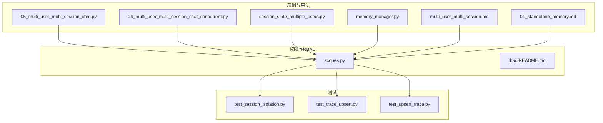
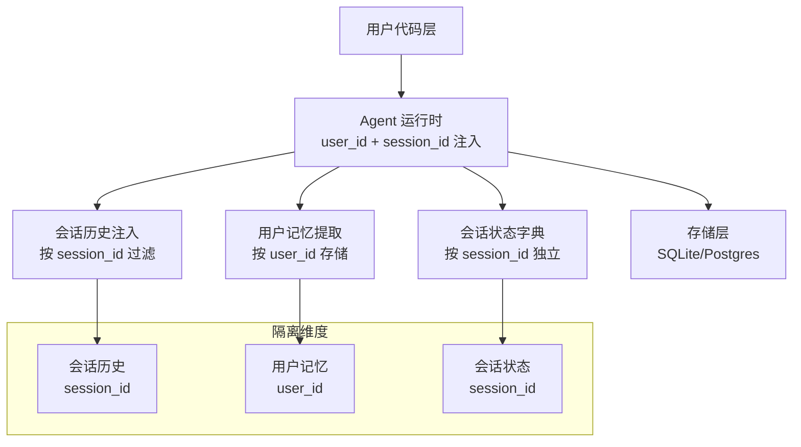
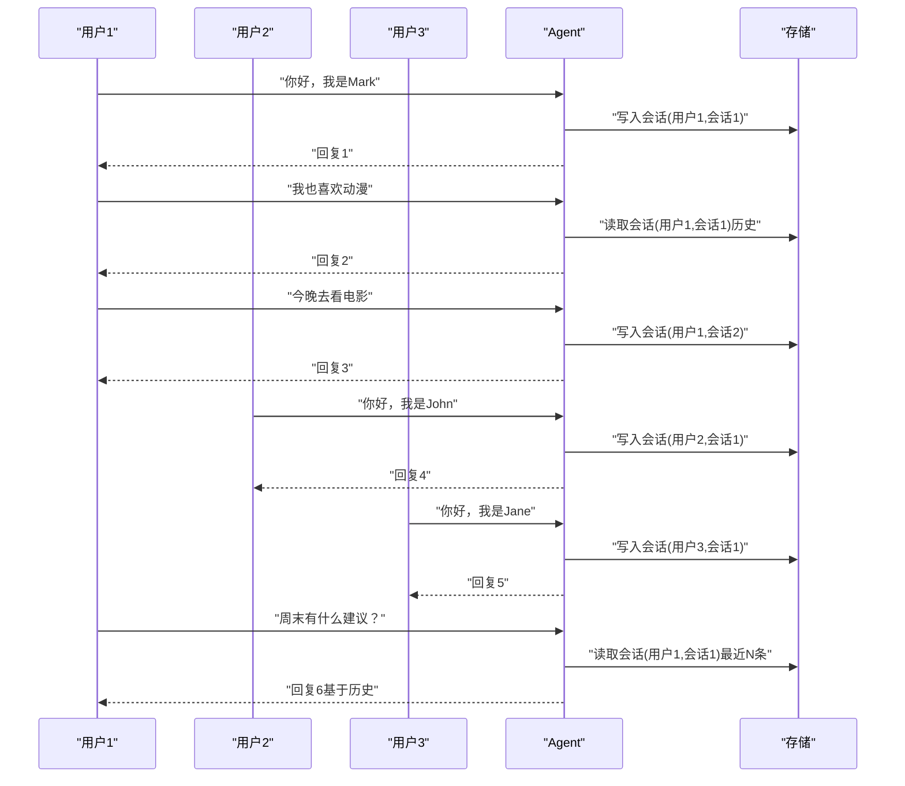
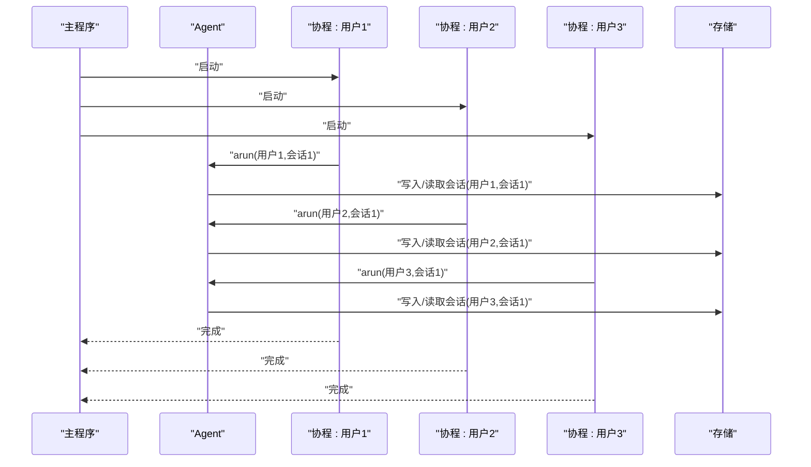
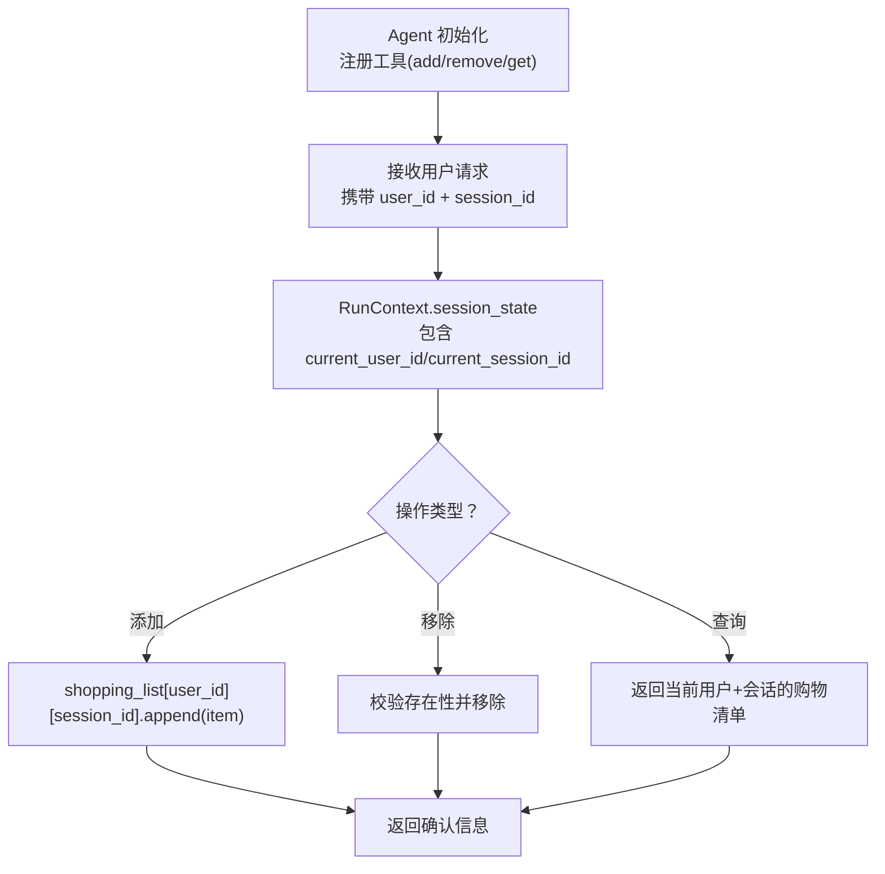
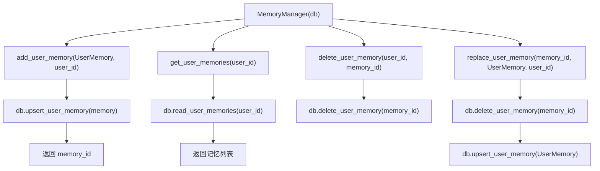
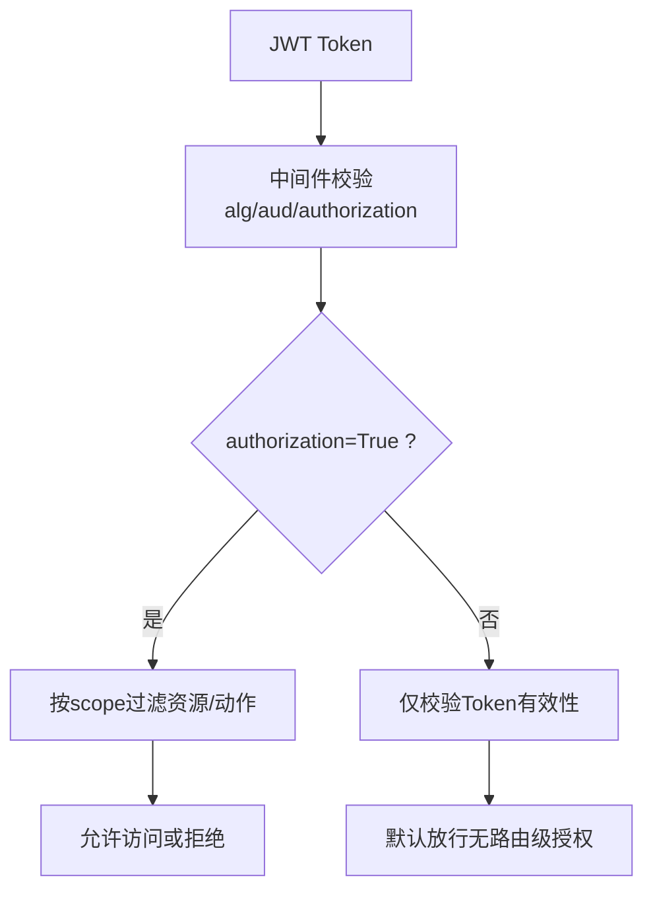
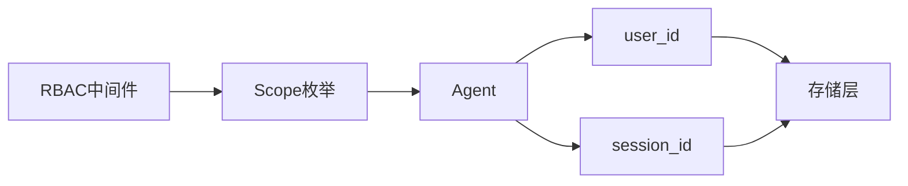

# 多用户多会话

<cite>
**本文引用的文件**
- [multi_user_multi_session_chat.py](file://cookbook/11_memory/05_multi_user_multi_session_chat.py)
- [multi_user_multi_session_chat_concurrent.py](file://cookbook/11_memory/06_multi_user_multi_session_chat_concurrent.py)
- [session_state_multiple_users.py](file://cookbook/02_agents/05_state_and_session/session_state_multiple_users.py)
- [memory_manager.py](file://cookbook/02_agents/06_memory_and_learning/memory_manager.py)
- [multi_user_multi_session.md](file://cookbook/06_storage/examples/multi_user_multi_session.md)
- [01_standalone_memory.md](file://cookbook/11_memory/memory_manager/01_standalone_memory.md)
- [test_session_isolation.py](file://libs/agno/tests/unit/db/test_session_isolation.py)
- [test_trace_upsert.py](file://libs/agno/tests/integration/db/postgres/test_trace_upsert.py)
- [test_upsert_trace.py](file://libs/agno/tests/integration/db/sqlite/test_upsert_trace.py)
- [scopes.py](file://libs/agno/os/scopes.py)
- [README.md](file://cookbook/05_agent_os/rbac/README.md)
</cite>

## 目录
1. [简介](#简介)
2. [项目结构](#项目结构)
3. [核心组件](#核心组件)
4. [架构总览](#架构总览)
5. [详细组件分析](#详细组件分析)
6. [依赖关系分析](#依赖关系分析)
7. [性能考量](#性能考量)
8. [故障排查指南](#故障排查指南)
9. [结论](#结论)
10. [附录](#附录)

## 简介
本文件围绕“多用户多会话内存管理”主题，系统性梳理 Agno 在多用户与多会话场景下的内存隔离、会话生命周期与状态维护、并发控制与性能优化、以及基于 RBAC 的权限与访问审计等能力。文档以仓库中的示例与测试为依据，结合架构图与流程图，帮助开发者构建安全、可靠且高性能的多用户多会话内存管理系统。

## 项目结构
本主题涉及的核心文件主要分布在以下位置：
- 示例与用法：cookbook/11_memory、cookbook/02_agents/05_state_and_session、cookbook/06_storage/examples
- 权限与访问控制：cookbook/05_agent_os/rbac、libs/agno/os/scopes.py
- 单元与集成测试：libs/agno/tests 下的 db、memory、models 等子目录
- 数据库与存储：agno/db 下的 sqlite、postgres 等实现

**图表来源**
- [multi_user_multi_session_chat.py:1-106](file://cookbook/11_memory/05_multi_user_multi_session_chat.py#L1-L106)
- [multi_user_multi_session_chat_concurrent.py:1-120](file://cookbook/11_memory/06_multi_user_multi_session_chat_concurrent.py#L1-L120)
- [session_state_multiple_users.py:1-135](file://cookbook/02_agents/05_state_and_session/session_state_multiple_users.py#L1-L135)
- [memory_manager.py:1-48](file://cookbook/02_agents/06_memory_and_learning/memory_manager.py#L1-L48)
- [multi_user_multi_session.md:1-156](file://cookbook/06_storage/examples/multi_user_multi_session.md#L1-L156)
- [01_standalone_memory.md:1-149](file://cookbook/11_memory/memory_manager/01_standalone_memory.md#L1-L149)
- [scopes.py:1-33](file://libs/agno/os/scopes.py#L1-L33)
- [README.md:1-147](file://cookbook/05_agent_os/rbac/README.md#L1-L147)
- [test_session_isolation.py:51-82](file://libs/agno/tests/unit/db/test_session_isolation.py#L51-L82)
- [test_trace_upsert.py:46-83](file://libs/agno/tests/integration/db/postgres/test_trace_upsert.py#L46-L83)
- [test_upsert_trace.py:46-83](file://libs/agno/tests/integration/db/sqlite/test_upsert_trace.py#L46-L83)

**章节来源**
- [multi_user_multi_session_chat.py:1-106](file://cookbook/11_memory/05_multi_user_multi_session_chat.py#L1-L106)
- [multi_user_multi_session_chat_concurrent.py:1-120](file://cookbook/11_memory/06_multi_user_multi_session_chat_concurrent.py#L1-L120)
- [session_state_multiple_users.py:1-135](file://cookbook/02_agents/05_state_and_session/session_state_multiple_users.py#L1-L135)
- [memory_manager.py:1-48](file://cookbook/02_agents/06_memory_and_learning/memory_manager.py#L1-L48)
- [multi_user_multi_session.md:1-156](file://cookbook/06_storage/examples/multi_user_multi_session.md#L1-L156)
- [01_standalone_memory.md:1-149](file://cookbook/11_memory/memory_manager/01_standalone_memory.md#L1-L149)
- [scopes.py:1-33](file://libs/agno/os/scopes.py#L1-L33)
- [README.md:1-147](file://cookbook/05_agent_os/rbac/README.md#L1-L147)
- [test_session_isolation.py:51-82](file://libs/agno/tests/unit/db/test_session_isolation.py#L51-L82)
- [test_trace_upsert.py:46-83](file://libs/agno/tests/integration/db/postgres/test_trace_upsert.py#L46-L83)
- [test_upsert_trace.py:46-83](file://libs/agno/tests/integration/db/sqlite/test_upsert_trace.py#L46-L83)

## 核心组件
- 多用户多会话运行时参数
  - 通过运行时传入 user_id 与 session_id 区分用户与会话，单实例服务多用户，避免为每个用户创建独立 Agent 的高开销。
- 会话状态与历史
  - 会话历史按 session_id 隔离；支持限制最近 N 次运行的历史注入，控制上下文长度。
- 用户记忆管理
  - 支持按 user_id 的记忆持久化与检索；MemoryManager 提供独立 CRUD 能力，无需 LLM 推断。
- 并发与隔离
  - 单元测试覆盖会话删除的隔离性；集成测试覆盖并发 upsert 的唯一约束冲突处理。
- 权限与访问控制
  - RBAC 提供全局/资源级/通配符权限，支持 JWT 验证与路由级授权检查。

**章节来源**
- [multi_user_multi_session.md:47-86](file://cookbook/06_storage/examples/multi_user_multi_session.md#L47-L86)
- [01_standalone_memory.md:91-104](file://cookbook/11_memory/memory_manager/01_standalone_memory.md#L91-L104)
- [test_session_isolation.py:62-82](file://libs/agno/tests/unit/db/test_session_isolation.py#L62-L82)
- [test_trace_upsert.py:46-83](file://libs/agno/tests/integration/db/postgres/test_trace_upsert.py#L46-L83)
- [test_upsert_trace.py:46-83](file://libs/agno/tests/integration/db/sqlite/test_upsert_trace.py#L46-L83)
- [README.md:1-147](file://cookbook/05_agent_os/rbac/README.md#L1-L147)

## 架构总览
下图展示了多用户多会话在运行时如何通过 user_id 与 session_id 进行数据隔离与状态维护，以及与存储层的交互。

**图表来源**
- [multi_user_multi_session.md:21-45](file://cookbook/06_storage/examples/multi_user_multi_session.md#L21-L45)
- [multi_user_multi_session_chat.py:33-37](file://cookbook/11_memory/05_multi_user_multi_session_chat.py#L33-L37)
- [session_state_multiple_users.py:66-76](file://cookbook/02_agents/05_state_and_session/session_state_multiple_users.py#L66-L76)

## 详细组件分析

### 多用户多会话聊天（串行）
- 场景要点
  - 同一 Agent 实例，分别以不同 user_id 与 session_id 执行多次对话。
  - 用户记忆按 user_id 存储，会话历史按 session_id 隔离。
- 关键行为
  - 第一次与第二次针对同一用户/会话，历史叠加；切换到该用户的另一个会话，历史独立。
  - 第三次运行时，模型仅看到最近若干次运行的消息，受 num_history_runs 限制。
- 输出验证
  - 通过 get_user_memories 获取各用户记忆列表，验证按用户隔离。

**图表来源**
- [multi_user_multi_session_chat.py:43-87](file://cookbook/11_memory/05_multi_user_multi_session_chat.py#L43-L87)

**章节来源**
- [multi_user_multi_session_chat.py:1-106](file://cookbook/11_memory/05_multi_user_multi_session_chat.py#L1-L106)
- [multi_user_multi_session.md:73-86](file://cookbook/06_storage/examples/multi_user_multi_session.md#L73-L86)

### 多用户多会话聊天（并发）
- 场景要点
  - 多用户并发执行，仍保持 per-user/per-session 隔离。
  - 使用 asyncio.gather 并发调度，减少总等待时间。
- 关键行为
  - 每个协程内部按 user_id 与 session_id 调用 Agent 的异步接口。
  - 并发完成后，分别读取各用户的记忆列表进行验证。

**图表来源**
- [multi_user_multi_session_chat_concurrent.py:94-101](file://cookbook/11_memory/06_multi_user_multi_session_chat_concurrent.py#L94-L101)

**章节来源**
- [multi_user_multi_session_chat_concurrent.py:1-120](file://cookbook/11_memory/06_multi_user_multi_session_chat_concurrent.py#L1-L120)

### 会话状态与多用户
- 场景要点
  - 使用工具函数在运行时从 RunContext 的 session_state 中读取当前 user_id 与 session_id。
  - 将购物清单按 user_id 与 session_id 维度组织，确保跨会话独立。
- 关键行为
  - 工具函数根据 current_user_id 与 current_session_id 操作共享状态。
  - 新会话将产生新的状态副本，不与旧会话共享。

**图表来源**
- [session_state_multiple_users.py:20-59](file://cookbook/02_agents/05_state_and_session/session_state_multiple_users.py#L20-L59)

**章节来源**
- [session_state_multiple_users.py:1-135](file://cookbook/02_agents/05_state_and_session/session_state_multiple_users.py#L1-L135)

### 用户记忆管理（MemoryManager）
- 场景要点
  - MemoryManager 提供独立于 Agent 的 CRUD 能力，直接对用户记忆进行增删改查。
  - 默认 user_id 为 "default"，可显式指定其他用户 ID。
- 关键行为
  - add_user_memory：写入存储并返回 memory_id。
  - get_user_memories：按 user_id 查询全部记忆。
  - delete_user_memory：按 memory_id 删除。
  - replace_user_memory：保留原 ID 的完全替换。

**图表来源**
- [01_standalone_memory.md:115-138](file://cookbook/11_memory/memory_manager/01_standalone_memory.md#L115-L138)

**章节来源**
- [01_standalone_memory.md:1-149](file://cookbook/11_memory/memory_manager/01_standalone_memory.md#L1-L149)

### 权限与访问控制（RBAC）
- 场景要点
  - RBAC 支持全局资源、按资源、通配符三种粒度的权限。
  - JWT 验证时校验 aud 与 AgentOS ID 匹配；当 authorization=True 时启用路由级授权。
- 关键行为
  - 列表端点自动过滤返回资源集合。
  - 运行端点按资源上下文校验对应 run 权限。
  - 支持对控制平面流量使用非对称密钥签名。

**图表来源**
- [README.md:9-25](file://cookbook/05_agent_os/rbac/README.md#L9-L25)
- [scopes.py:1-33](file://libs/agno/os/scopes.py#L1-L33)

**章节来源**
- [README.md:1-147](file://cookbook/05_agent_os/rbac/README.md#L1-L147)
- [scopes.py:1-33](file://libs/agno/os/scopes.py#L1-L33)

## 依赖关系分析
- 运行时参数依赖
  - Agent 的 user_id 与 session_id 作为运行时输入，驱动会话历史与记忆的读写路径。
- 存储层依赖
  - SQLite/Postgres 作为多用户共享存储，负责会话记录与用户记忆的持久化。
- 权限依赖
  - RBAC 依赖 JWT 中间件与 scope 定义，用于路由级授权与资源过滤。

**图表来源**
- [multi_user_multi_session.md:146-156](file://cookbook/06_storage/examples/multi_user_multi_session.md#L146-L156)
- [scopes.py:26-33](file://libs/agno/os/scopes.py#L26-L33)

**章节来源**
- [multi_user_multi_session.md:146-156](file://cookbook/06_storage/examples/multi_user_multi_session.md#L146-L156)
- [scopes.py:26-33](file://libs/agno/os/scopes.py#L26-L33)

## 性能考量
- 单实例多用户
  - 通过运行时区分 user_id 与 session_id，避免为每个用户创建独立 Agent，降低实例与上下文切换成本。
- 历史长度控制
  - num_history_runs 限制最近 N 次运行注入，有助于控制上下文长度与推理成本。
- 并发执行
  - 使用 asyncio.gather 并发调度，缩短总体等待时间；注意存储层的并发 upsert 冲突处理。
- 存储层优化
  - 使用事务与批量写入可减少 I/O 开销；合理索引 user_id 与 session_id 字段提升查询效率。

[本节为通用指导，不直接分析具体文件]

## 故障排查指南
- 会话隔离问题
  - 若发现不同用户共享状态，检查是否在工具函数中正确使用 current_user_id 与 current_session_id。
  - 确认 session_state 的初始化与作用域范围。
- 并发 upsert 冲突
  - PostgreSQL 与 SQLite 在并发 upsert 时可能触发唯一约束冲突；应捕获异常并重试或幂等处理。
- 权限不足
  - 若路由被拒绝，请确认 JWT token 的 scopes 是否包含目标资源与动作；必要时开启 authorization 以启用路由级授权。

**章节来源**
- [test_session_isolation.py:62-82](file://libs/agno/tests/unit/db/test_session_isolation.py#L62-L82)
- [test_trace_upsert.py:46-83](file://libs/agno/tests/integration/db/postgres/test_trace_upsert.py#L46-L83)
- [test_upsert_trace.py:46-83](file://libs/agno/tests/integration/db/sqlite/test_upsert_trace.py#L46-L83)
- [README.md:9-25](file://cookbook/05_agent_os/rbac/README.md#L9-L25)

## 结论
Agno 的多用户多会话内存管理以“运行时 user_id 与 session_id”为核心，结合会话历史隔离、用户记忆持久化与会话状态独立维护，实现了高效、可扩展的多租户体验。配合 RBAC 的细粒度权限控制与并发 upsert 的冲突处理，可在保证数据隔离与访问安全的同时，获得良好的性能表现。开发者可参考示例与测试，快速搭建安全可靠的多用户多会话内存系统。

[本节为总结性内容，不直接分析具体文件]

## 附录

### 配置与使用要点
- 运行时参数
  - 在调用 Agent 的响应接口时传入 user_id 与 session_id，即可实现用户与会话的隔离。
- 历史限制
  - 通过 num_history_runs 控制注入的历史轮次数，平衡上下文长度与效果。
- MemoryManager
  - 直接使用 MemoryManager 进行用户记忆的 CRUD 操作，支持多用户隔离与默认用户 ID。
- RBAC
  - 在 JWT 中间件中启用 authorization，按需配置 scopes 以实现路由级授权与资源过滤。

**章节来源**
- [multi_user_multi_session.md:9-19](file://cookbook/06_storage/examples/multi_user_multi_session.md#L9-L19)
- [01_standalone_memory.md:9-16](file://cookbook/11_memory/memory_manager/01_standalone_memory.md#L9-L16)
- [README.md:9-25](file://cookbook/05_agent_os/rbac/README.md#L9-L25)