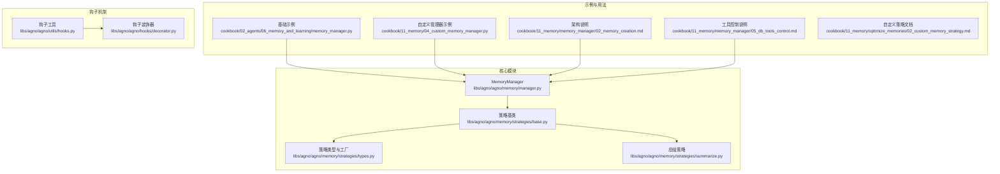
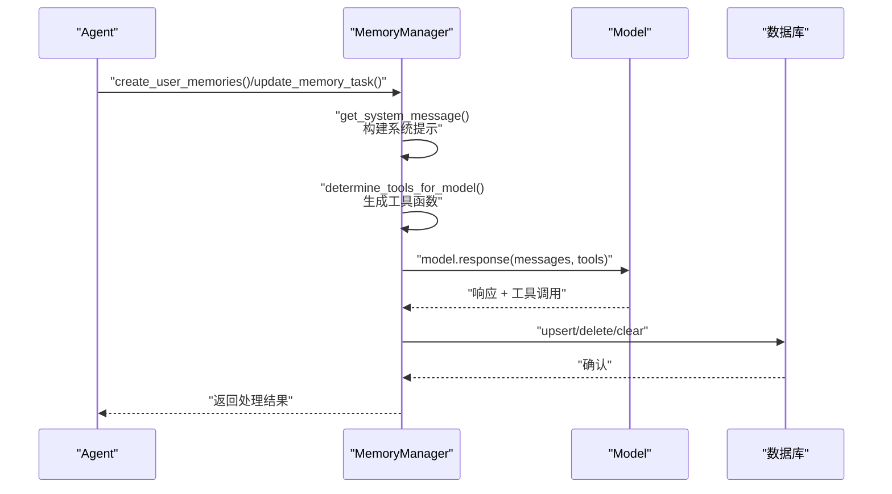
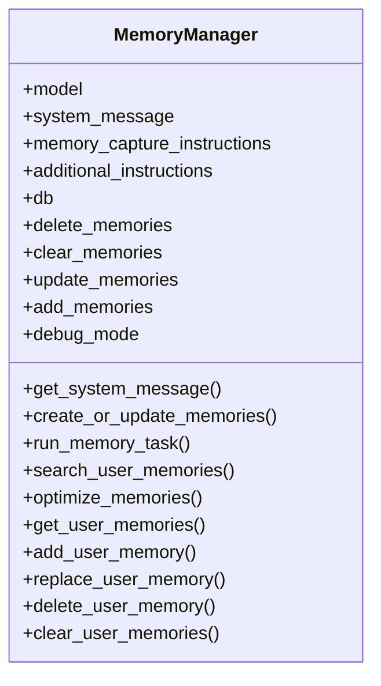
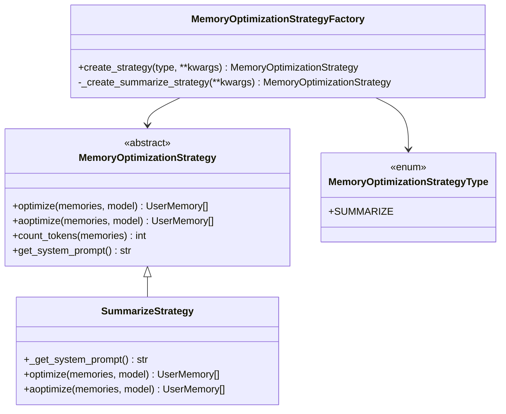
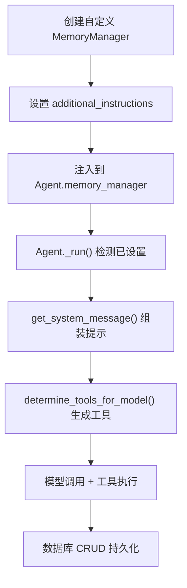
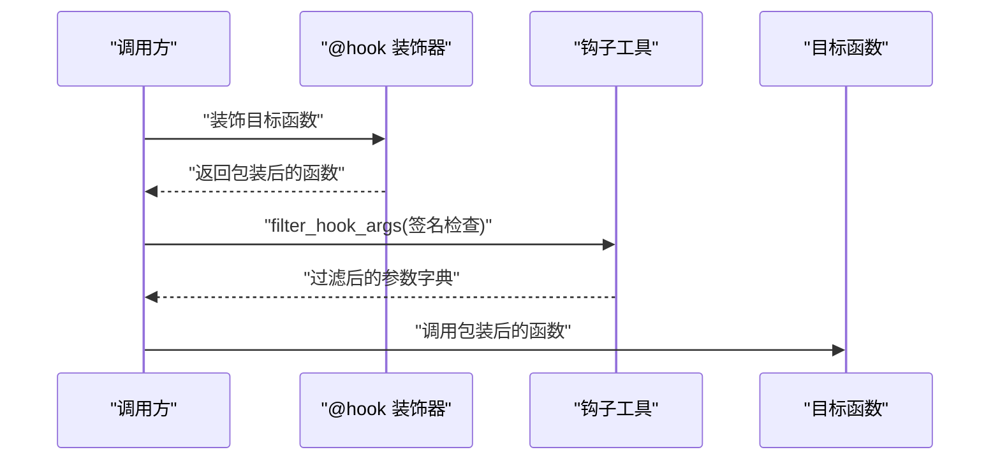
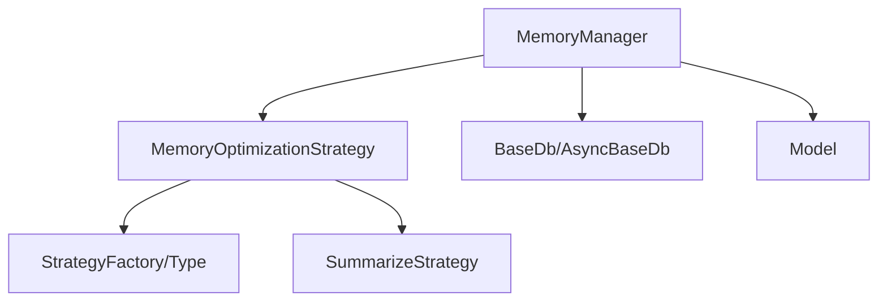

# 自定义内存管理器

<cite>
**本文档引用的文件**
- [libs/agno/agno/memory/manager.py](file://libs/agno/agno/memory/manager.py)
- [libs/agno/agno/memory/strategies/base.py](file://libs/agno/agno/memory/strategies/base.py)
- [libs/agno/agno/memory/strategies/types.py](file://libs/agno/agno/memory/strategies/types.py)
- [libs/agno/agno/memory/strategies/summarize.py](file://libs/agno/agno/memory/strategies/summarize.py)
- [cookbook/02_agents/06_memory_and_learning/memory_manager.py](file://cookbook/02_agents/06_memory_and_learning/memory_manager.py)
- [cookbook/11_memory/04_custom_memory_manager.py](file://cookbook/11_memory/04_custom_memory_manager.py)
- [cookbook/11_memory/memory_manager/02_memory_creation.md](file://cookbook/11_memory/memory_manager/02_memory_creation.md)
- [cookbook/11_memory/memory_manager/05_db_tools_control.md](file://cookbook/11_memory/memory_manager/05_db_tools_control.md)
- [cookbook/11_memory/optimize_memories/02_custom_memory_strategy.md](file://cookbook/11_memory/optimize_memories/02_custom_memory_strategy.md)
- [libs/agno/agno/utils/hooks.py](file://libs/agno/agno/utils/hooks.py)
- [libs/agno/agno/hooks/decorator.py](file://libs/agno/agno/hooks/decorator.py)
- [libs/agno/tests/unit/memory/test_memory_manager_crud.py](file://libs/agno/tests/unit/memory/test_memory_manager_crud.py)
</cite>

## 目录
1. [简介](#简介)
2. [项目结构](#项目结构)
3. [核心组件](#核心组件)
4. [架构总览](#架构总览)
5. [详细组件分析](#详细组件分析)
6. [依赖分析](#依赖分析)
7. [性能考虑](#性能考虑)
8. [故障排除指南](#故障排除指南)
9. [结论](#结论)
10. [附录](#附录)

## 简介
本文件面向希望扩展和定制记忆管理能力的开发者，系统性地介绍自定义内存管理器的扩展机制与开发方法。内容涵盖：
- 管理器接口定义、继承关系与实现要求
- 自定义策略的开发流程（接口设计、实现示例、集成方法）
- 扩展点与钩子机制（事件监听、回调处理、状态管理）
- 配置与部署（配置文件格式、启动参数、运行时配置）
- 与现有内存系统的集成（兼容性、迁移策略、性能影响）
- 完整开发指南与示例代码路径

## 项目结构
围绕自定义内存管理器的关键模块与示例分布如下：
- 核心管理器：libs/agno/agno/memory/manager.py
- 策略体系：libs/agno/agno/memory/strategies/*
- 示例与用法：cookbook/11_memory/* 与 cookbook/02_agents/06_memory_and_learning/*
- 钩子与装饰器：libs/agno/agno/utils/hooks.py、libs/agno/agno/hooks/decorator.py
- 单元测试：libs/agno/tests/unit/memory/test_memory_manager_crud.py

**图表来源**
- [libs/agno/agno/memory/manager.py](file://libs/agno/agno/memory/manager.py)
- [libs/agno/agno/memory/strategies/base.py](file://libs/agno/agno/memory/strategies/base.py)
- [libs/agno/agno/memory/strategies/types.py](file://libs/agno/agno/memory/strategies/types.py)
- [libs/agno/agno/memory/strategies/summarize.py](file://libs/agno/agno/memory/strategies/summarize.py)
- [cookbook/02_agents/06_memory_and_learning/memory_manager.py](file://cookbook/02_agents/06_memory_and_learning/memory_manager.py)
- [cookbook/11_memory/04_custom_memory_manager.py](file://cookbook/11_memory/04_custom_memory_manager.py)
- [cookbook/11_memory/memory_manager/02_memory_creation.md](file://cookbook/11_memory/memory_manager/02_memory_creation.md)
- [cookbook/11_memory/memory_manager/05_db_tools_control.md](file://cookbook/11_memory/memory_manager/05_db_tools_control.md)
- [cookbook/11_memory/optimize_memories/02_custom_memory_strategy.md](file://cookbook/11_memory/optimize_memories/02_custom_memory_strategy.md)
- [libs/agno/agno/utils/hooks.py](file://libs/agno/agno/utils/hooks.py)
- [libs/agno/agno/hooks/decorator.py](file://libs/agno/agno/hooks/decorator.py)

**章节来源**
- [libs/agno/agno/memory/manager.py](file://libs/agno/agno/memory/manager.py)
- [libs/agno/agno/memory/strategies/base.py](file://libs/agno/agno/memory/strategies/base.py)
- [libs/agno/agno/memory/strategies/types.py](file://libs/agno/agno/memory/strategies/types.py)
- [libs/agno/agno/memory/strategies/summarize.py](file://libs/agno/agno/memory/strategies/summarize.py)
- [cookbook/02_agents/06_memory_and_learning/memory_manager.py](file://cookbook/02_agents/06_memory_and_learning/memory_manager.py)
- [cookbook/11_memory/04_custom_memory_manager.py](file://cookbook/11_memory/04_custom_memory_manager.py)
- [cookbook/11_memory/memory_manager/02_memory_creation.md](file://cookbook/11_memory/memory_manager/02_memory_creation.md)
- [cookbook/11_memory/memory_manager/05_db_tools_control.md](file://cookbook/11_memory/memory_manager/05_db_tools_control.md)
- [cookbook/11_memory/optimize_memories/02_custom_memory_strategy.md](file://cookbook/11_memory/optimize_memories/02_custom_memory_strategy.md)
- [libs/agno/agno/utils/hooks.py](file://libs/agno/agno/utils/hooks.py)
- [libs/agno/agno/hooks/decorator.py](file://libs/agno/agno/hooks/decorator.py)

## 核心组件
- MemoryManager：记忆管理核心类，负责系统提示构建、工具函数生成、记忆的增删改查、检索与优化等。
- MemoryOptimizationStrategy：记忆优化策略抽象基类，定义同步/异步优化接口与令牌统计工具。
- MemoryOptimizationStrategyType 与 Factory：内置策略类型枚举与工厂，支持通过枚举创建具体策略实例。
- SummarizeStrategy：内置“总结”策略，将多条记忆压缩为单条综合性摘要。

关键职责与特性：
- 系统提示可配置：支持自定义 system_message、memory_capture_instructions、additional_instructions。
- 动态工具控制：根据开关决定是否启用 add/update/delete/clear 等工具。
- 异步/同步双栈：提供同步与异步的 CRUD、检索与优化接口。
- 策略可插拔：通过工厂或直接传入自定义策略实例，实现灵活的记忆优化。

**章节来源**
- [libs/agno/agno/memory/manager.py](file://libs/agno/agno/memory/manager.py)
- [libs/agno/agno/memory/strategies/base.py](file://libs/agno/agno/memory/strategies/base.py)
- [libs/agno/agno/memory/strategies/types.py](file://libs/agno/agno/memory/strategies/types.py)
- [libs/agno/agno/memory/strategies/summarize.py](file://libs/agno/agno/memory/strategies/summarize.py)

## 架构总览
下图展示了 MemoryManager 的核心工作流：Agent 触发记忆更新时，MemoryManager 构建系统提示与工具集，调用模型执行记忆 CRUD，并与数据库交互完成持久化。

**图表来源**
- [libs/agno/agno/memory/manager.py](file://libs/agno/agno/memory/manager.py)

**章节来源**
- [libs/agno/agno/memory/manager.py](file://libs/agno/agno/memory/manager.py)
- [cookbook/11_memory/memory_manager/02_memory_creation.md](file://cookbook/11_memory/memory_manager/02_memory_creation.md)

## 详细组件分析

### MemoryManager 类分析
- 接口与配置
  - 支持 model、system_message、memory_capture_instructions、additional_instructions、db 等配置。
  - CRUD 开关：delete_memories、clear_memories、update_memories、add_memories。
- 核心方法
  - get_system_message：动态组装系统提示，支持追加 additional_instructions。
  - _get_db_tools/_aget_db_tools：根据开关生成 add/update/delete/clear 工具函数。
  - create_or_update_memories/acreate_or_update_memories：基于消息与现有记忆，调用模型执行记忆 CRUD。
  - run_memory_task/arun_memory_task：以任务形式执行记忆管理。
  - search_user_memories：支持 last_n、first_n、agentic 三种检索策略。
  - optimize_memories/aoptimize_memories：结合策略对记忆进行优化（如总结压缩）。
- 数据访问
  - get_user_memories/aretrieve、add_user_memory/replace_user_memory、delete_user_memory、clear_user_memories/aclear_user_memories。
- 日志与调试
  - set_log_level、debug_mode 控制日志级别；大量 log_debug/log_warning/log_error 便于问题定位。

**图表来源**
- [libs/agno/agno/memory/manager.py](file://libs/agno/agno/memory/manager.py)

**章节来源**
- [libs/agno/agno/memory/manager.py](file://libs/agno/agno/memory/manager.py)

### 策略体系与自定义策略
- 抽象基类
  - MemoryOptimizationStrategy：定义 optimize()、aoptimize() 与 count_tokens()。
- 内置策略
  - SummarizeStrategy：将多条记忆汇总为一条综合性摘要，保留 topics、user_id 等元数据。
- 策略工厂
  - MemoryOptimizationStrategyType：枚举策略类型（当前包含 SUMMARIZE）。
  - MemoryOptimizationStrategyFactory：根据类型创建策略实例。
- 自定义策略开发流程
  - 实现 MemoryOptimizationStrategy 的 optimize() 与 aoptimize()。
  - 如需 LLM，可在 optimize/aoptimize 中调用模型；否则可纯 Python 实现（如按时间排序）。
  - 通过 MemoryManager.optimize_memories() 传入自定义策略实例或工厂创建的实例。

**图表来源**
- [libs/agno/agno/memory/strategies/base.py](file://libs/agno/agno/memory/strategies/base.py)
- [libs/agno/agno/memory/strategies/summarize.py](file://libs/agno/agno/memory/strategies/summarize.py)
- [libs/agno/agno/memory/strategies/types.py](file://libs/agno/agno/memory/strategies/types.py)

**章节来源**
- [libs/agno/agno/memory/strategies/base.py](file://libs/agno/agno/memory/strategies/base.py)
- [libs/agno/agno/memory/strategies/summarize.py](file://libs/agno/agno/memory/strategies/summarize.py)
- [libs/agno/agno/memory/strategies/types.py](file://libs/agno/agno/memory/strategies/types.py)
- [cookbook/11_memory/optimize_memories/02_custom_memory_strategy.md](file://cookbook/11_memory/optimize_memories/02_custom_memory_strategy.md)

### 自定义内存管理器开发流程
- 显式创建 MemoryManager 并注入额外规则
  - 使用 additional_instructions 精确控制记忆提取行为（如禁止存储用户姓名）。
  - 将自定义 MemoryManager 作为 memory_manager 参数传入 Agent。
- 系统提示构建与工具控制
  - get_system_message() 会将 additional_instructions 追加到默认规则之后。
  - _get_db_tools() 根据开关动态生成工具说明与函数，确保 LLM 只能看到允许的操作。
- 生命周期与后台执行
  - Agent 在运行时检测已设置的 memory_manager，跳过懒加载。
  - 后台线程通过 make_memories() 调用 MemoryManager 执行记忆更新。

**图表来源**
- [cookbook/11_memory/04_custom_memory_manager.py](file://cookbook/11_memory/04_custom_memory_manager.py)
- [libs/agno/agno/memory/manager.py](file://libs/agno/agno/memory/manager.py)

**章节来源**
- [cookbook/11_memory/04_custom_memory_manager.py](file://cookbook/11_memory/04_custom_memory_manager.py)
- [cookbook/11_memory/memory_manager/05_db_tools_control.md](file://cookbook/11_memory/memory_manager/05_db_tools_control.md)
- [libs/agno/agno/memory/manager.py](file://libs/agno/agno/memory/manager.py)

### 钩子机制与状态管理
- 钩子工具
  - utils/hooks.py 提供钩子过滤与签名检查，确保只传递钩子函数接受的参数。
- 钩子装饰器
  - hooks/decorator.py 提供 @hook(run_in_background=...) 装饰器，支持后台运行标记与链式包装遍历。
- 状态管理
  - MemoryManager 内部维护 memories_updated 状态，当模型产生工具调用时置位，便于上层感知变更。

**图表来源**
- [libs/agno/agno/hooks/decorator.py](file://libs/agno/agno/hooks/decorator.py)
- [libs/agno/agno/utils/hooks.py](file://libs/agno/agno/utils/hooks.py)

**章节来源**
- [libs/agno/agno/utils/hooks.py](file://libs/agno/agno/utils/hooks.py)
- [libs/agno/agno/hooks/decorator.py](file://libs/agno/agno/hooks/decorator.py)
- [libs/agno/agno/memory/manager.py](file://libs/agno/agno/memory/manager.py)

### 集成与兼容性
- 与 Agent 的集成
  - 显式传入 memory_manager 时，Agent 不再自动创建，完全由用户控制。
  - 支持独立的 MemoryManager 模型（如使用更小模型处理记忆任务以降低成本）。
- 与数据库的集成
  - 支持 BaseDb 与 AsyncBaseDb，提供同步/异步 CRUD 与批量清理。
  - clear_user_memories/aclear_user_memories 会先获取所有记忆 ID 再批量删除，注意性能开销。
- 与检索/优化的集成
  - search_user_memories 支持 last_n、first_n、agentic 三种策略。
  - optimize_memories/aoptimize_memories 结合策略工厂或自定义策略实现压缩与去重。

**章节来源**
- [libs/agno/agno/memory/manager.py](file://libs/agno/agno/memory/manager.py)
- [cookbook/02_agents/06_memory_and_learning/memory_manager.py](file://cookbook/02_agents/06_memory_and_learning/memory_manager.py)
- [cookbook/11_memory/memory_manager/02_memory_creation.md](file://cookbook/11_memory/memory_manager/02_memory_creation.md)

## 依赖分析
- 组件耦合
  - MemoryManager 依赖策略工厂与策略基类，策略实现可替换。
  - 工具函数通过 Function.from_callable 动态生成，避免硬编码。
- 外部依赖
  - 模型接口（Model）、消息结构（Message）、数据库接口（BaseDb/AsyncBaseDb）。
- 循环依赖
  - 当前结构清晰，策略工厂与策略类之间为单向依赖。

**图表来源**
- [libs/agno/agno/memory/manager.py](file://libs/agno/agno/memory/manager.py)
- [libs/agno/agno/memory/strategies/base.py](file://libs/agno/agno/memory/strategies/base.py)
- [libs/agno/agno/memory/strategies/types.py](file://libs/agno/agno/memory/strategies/types.py)
- [libs/agno/agno/memory/strategies/summarize.py](file://libs/agno/agno/memory/strategies/summarize.py)

**章节来源**
- [libs/agno/agno/memory/manager.py](file://libs/agno/agno/memory/manager.py)
- [libs/agno/agno/memory/strategies/base.py](file://libs/agno/agno/memory/strategies/base.py)
- [libs/agno/agno/memory/strategies/types.py](file://libs/agno/agno/memory/strategies/types.py)
- [libs/agno/agno/memory/strategies/summarize.py](file://libs/agno/agno/memory/strategies/summarize.py)

## 性能考虑
- 模型成本控制
  - MemoryManager 可使用独立模型，建议为记忆任务选择更低成本的模型，主对话使用更高精度模型。
- 检索与优化
  - agentic 检索需要额外模型调用，适合高相关性场景；last_n/first_n 更轻量。
  - optimize_memories 会先清空再写入，注意批量操作的事务与回滚成本。
- 异步与并发
  - 异步数据库与异步模型调用可提升吞吐，但需注意资源竞争与错误传播。
- 日志与调试
  - debug_mode 会增加日志开销，生产环境建议关闭。

[本节为通用指导，无需特定文件引用]

## 故障排除指南
- 常见问题与定位
  - 未提供 db：调用 CRUD 方法时会记录警告，检查 db 初始化。
  - 异步数据库与同步方法混用：如 clear_user_memories 会在异步 DB 上抛出异常，应使用 aclear_user_memories。
  - 工具不可用：若 enable_* 为 False，则对应工具不会出现在系统提示中。
- 单元测试参考
  - CRUD 行为可通过单元测试验证，包括 delete、clear、clear_user_memories 等边界条件。

**章节来源**
- [libs/agno/tests/unit/memory/test_memory_manager_crud.py](file://libs/agno/tests/unit/memory/test_memory_manager_crud.py)
- [libs/agno/agno/memory/manager.py](file://libs/agno/agno/memory/manager.py)

## 结论
通过 MemoryManager 与策略体系，开发者可以灵活地定制记忆提取规则、控制工具可见性、选择优化策略，并与 Agent/数据库无缝集成。自定义策略与钩子机制进一步增强了扩展性与可观测性。建议在生产环境中合理选择模型与检索/优化策略，关注异步与批量操作的性能影响，并通过单元测试保障关键路径的稳定性。

[本节为总结，无需特定文件引用]

## 附录

### 配置与部署要点
- 配置文件格式
  - 通常通过 Python 代码初始化 MemoryManager 与数据库连接，示例中使用 SqliteDb/PostgresDb 等。
- 启动参数
  - 可通过环境变量控制日志级别（如 AGNO_DEBUG），或在构造 MemoryManager 时设置 debug_mode。
- 运行时配置
  - additional_instructions 可在运行时动态注入，实现不同用户/场景下的差异化规则。

**章节来源**
- [cookbook/02_agents/06_memory_and_learning/memory_manager.py](file://cookbook/02_agents/06_memory_and_learning/memory_manager.py)
- [cookbook/11_memory/04_custom_memory_manager.py](file://cookbook/11_memory/04_custom_memory_manager.py)
- [libs/agno/agno/memory/manager.py](file://libs/agno/agno/memory/manager.py)

### 开发指南与示例代码路径
- 自定义管理器示例
  - [cookbook/11_memory/04_custom_memory_manager.py](file://cookbook/11_memory/04_custom_memory_manager.py)
- 基础用法示例
  - [cookbook/02_agents/06_memory_and_learning/memory_manager.py](file://cookbook/02_agents/06_memory_and_learning/memory_manager.py)
- 架构与流程说明
  - [cookbook/11_memory/memory_manager/02_memory_creation.md](file://cookbook/11_memory/memory_manager/02_memory_creation.md)
  - [cookbook/11_memory/memory_manager/05_db_tools_control.md](file://cookbook/11_memory/memory_manager/05_db_tools_control.md)
- 自定义策略开发
  - [cookbook/11_memory/optimize_memories/02_custom_memory_strategy.md](file://cookbook/11_memory/optimize_memories/02_custom_memory_strategy.md)
  - [libs/agno/agno/memory/strategies/base.py](file://libs/agno/agno/memory/strategies/base.py)
  - [libs/agno/agno/memory/strategies/types.py](file://libs/agno/agno/memory/strategies/types.py)
  - [libs/agno/agno/memory/strategies/summarize.py](file://libs/agno/agno/memory/strategies/summarize.py)