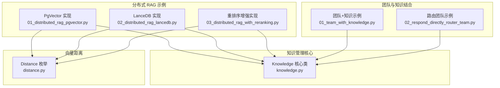
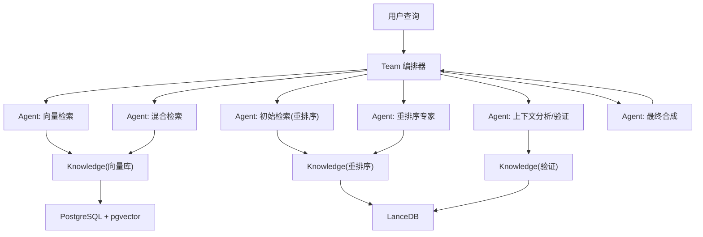
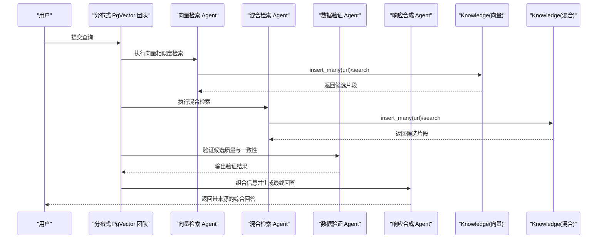
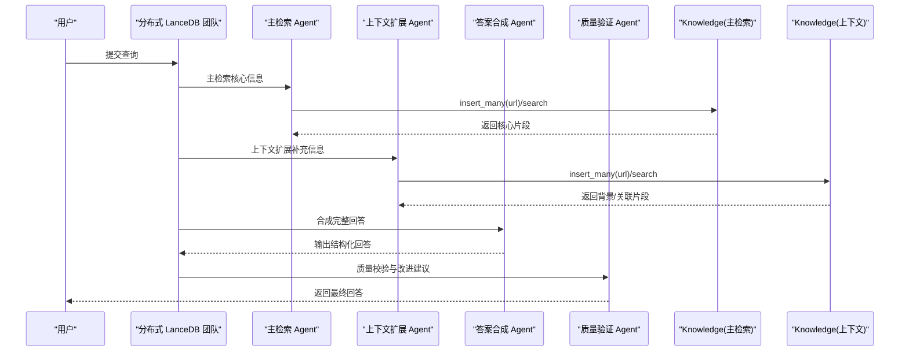
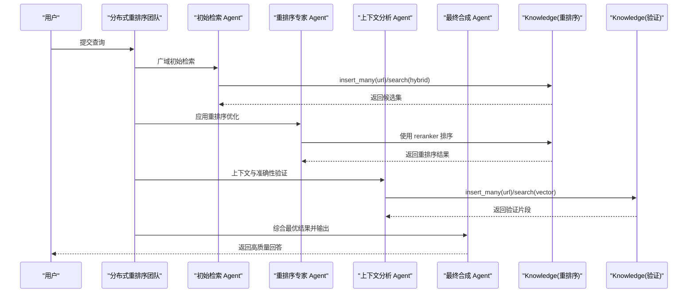
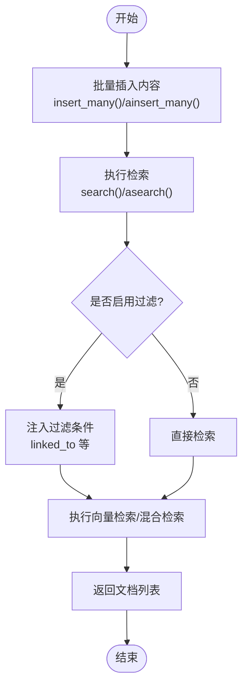
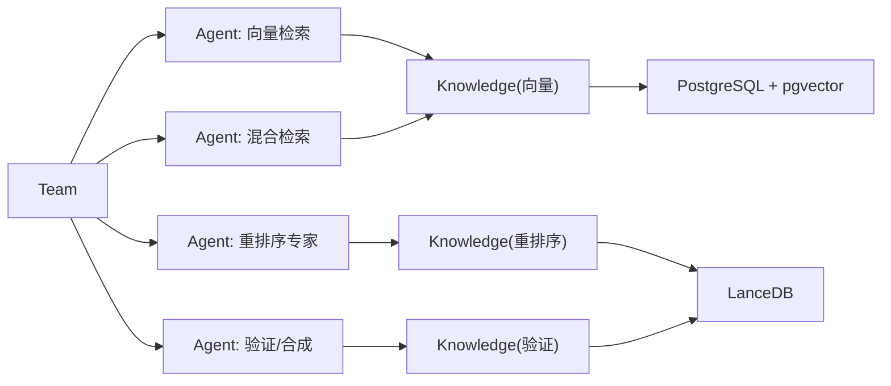

# 分布式 RAG

<cite>
**本文引用的文件**
- [01_distributed_rag_pgvector.py](file://cookbook/03_teams/15_distributed_rag/01_distributed_rag_pgvector.py)
- [02_distributed_rag_lancedb.py](file://cookbook/03_teams/15_distributed_rag/02_distributed_rag_lancedb.py)
- [03_distributed_rag_with_reranking.py](file://cookbook/03_teams/15_distributed_rag/03_distributed_rag_with_reranking.py)
- [knowledge.py](file://libs/agno/agno/knowledge/knowledge.py)
- [distance.py](file://libs/agno/agno/vectordb/distance.py)
- [01_team_with_knowledge.py](file://cookbook/03_teams/05_knowledge/01_team_with_knowledge.py)
- [02_respond_directly_router_team.py](file://cookbook/03_teams/01_quickstart/02_respond_directly_router_team.py)
</cite>

## 目录
1. [简介](#简介)
2. [项目结构](#项目结构)
3. [核心组件](#核心组件)
4. [架构总览](#架构总览)
5. [详细组件分析](#详细组件分析)
6. [依赖分析](#依赖分析)
7. [性能考量](#性能考量)
8. [故障排除指南](#故障排除指南)
9. [结论](#结论)
10. [附录](#附录)

## 简介
本文件面向分布式检索增强生成（RAG）系统，围绕以下目标展开：  
- 深入介绍分布式向量数据库的配置与使用，涵盖 PostgreSQL + pgvector、LanceDB 等实现；  
- 解释分布式 RAG 的工作流与团队协作模式，包括多阶段检索、验证与合成；  
- 提供三种典型分布式 RAG 实现：PgVector 实现、LanceDB 实现、重排序增强的分布式 RAG；  
- 总结分布式架构在扩展性、性能与容错方面的优势；  
- 给出配置方法、索引管理与查询优化建议；  
- 提供可直接定位到源码的路径示例，便于读者对照学习。

## 项目结构
本次文档聚焦于“分布式 RAG”主题相关的示例与知识管理核心模块，主要涉及以下文件：
- 分布式 RAG 示例：PgVector 实现、LanceDB 实现、重排序增强实现
- 知识管理核心：内容插入、异步/同步检索、过滤与隔离等
- 向量距离度量：cosine、L2、内积等枚举
- 团队与知识结合示例：展示如何将知识库检索与团队协作结合

**图表来源**
- [01_distributed_rag_pgvector.py:1-200](file://cookbook/03_teams/15_distributed_rag/01_distributed_rag_pgvector.py#L1-L200)
- [02_distributed_rag_lancedb.py:1-187](file://cookbook/03_teams/15_distributed_rag/02_distributed_rag_lancedb.py#L1-L187)
- [03_distributed_rag_with_reranking.py:1-195](file://cookbook/03_teams/15_distributed_rag/03_distributed_rag_with_reranking.py#L1-L195)
- [knowledge.py:40-800](file://libs/agno/agno/knowledge/knowledge.py#L40-L800)
- [distance.py:1-8](file://libs/agno/agno/vectordb/distance.py#L1-L8)
- [01_team_with_knowledge.py:1-64](file://cookbook/03_teams/05_knowledge/01_team_with_knowledge.py#L1-L64)
- [02_respond_directly_router_team.py:1-114](file://cookbook/03_teams/01_quickstart/02_respond_directly_router_team.py#L1-L114)

**章节来源**
- [01_distributed_rag_pgvector.py:1-200](file://cookbook/03_teams/15_distributed_rag/01_distributed_rag_pgvector.py#L1-L200)
- [02_distributed_rag_lancedb.py:1-187](file://cookbook/03_teams/15_distributed_rag/02_distributed_rag_lancedb.py#L1-L187)
- [03_distributed_rag_with_reranking.py:1-195](file://cookbook/03_teams/15_distributed_rag/03_distributed_rag_with_reranking.py#L1-L195)
- [knowledge.py:40-800](file://libs/agno/agno/knowledge/knowledge.py#L40-L800)
- [distance.py:1-8](file://libs/agno/agno/vectordb/distance.py#L1-L8)
- [01_team_with_knowledge.py:1-64](file://cookbook/03_teams/05_knowledge/01_team_with_knowledge.py#L1-L64)
- [02_respond_directly_router_team.py:1-114](file://cookbook/03_teams/01_quickstart/02_respond_directly_router_team.py#L1-L114)

## 核心组件
- Knowledge 类：统一的知识库抽象，负责内容插入、异步/同步检索、过滤与隔离、删除与统计等。其构造时会自动创建向量数据库表（若不存在），并支持多种插入方式（单条、批量、URL、主题等）。检索接口支持注入过滤条件与搜索类型切换。
- 向量距离度量：Distance 枚举定义了常用的相似度计算方式，用于向量检索的度量标准选择。
- 团队与知识协作：通过 Team 将多个 Agent 组织起来，每个 Agent 可绑定 Knowledge，形成“检索-验证-合成”的流水线。

**章节来源**
- [knowledge.py:40-800](file://libs/agno/agno/knowledge/knowledge.py#L40-L800)
- [distance.py:1-8](file://libs/agno/agno/vectordb/distance.py#L1-L8)

## 架构总览
分布式 RAG 的整体思路是：以 Knowledge 为核心，封装向量数据库与内容管理；以 Team 为编排单元，将多个 Agent（如向量检索、混合检索、重排序、验证、合成）串联为流水线，实现高召回、高精度、高质量的检索增强生成。

**图表来源**
- [01_distributed_rag_pgvector.py:1-200](file://cookbook/03_teams/15_distributed_rag/01_distributed_rag_pgvector.py#L1-L200)
- [02_distributed_rag_lancedb.py:1-187](file://cookbook/03_teams/15_distributed_rag/02_distributed_rag_lancedb.py#L1-L187)
- [03_distributed_rag_with_reranking.py:1-195](file://cookbook/03_teams/15_distributed_rag/03_distributed_rag_with_reranking.py#L1-L195)
- [knowledge.py:40-800](file://libs/agno/agno/knowledge/knowledge.py#L40-L800)

## 详细组件分析

### PgVector 实现（分布式向量检索）
该实现演示了基于 PostgreSQL + pgvector 的分布式 RAG 流程，包含两套知识库：
- 向量检索：仅使用向量相似度
- 混合检索：向量 + 文本检索，覆盖更广

**图表来源**
- [01_distributed_rag_pgvector.py:1-200](file://cookbook/03_teams/15_distributed_rag/01_distributed_rag_pgvector.py#L1-L200)
- [knowledge.py:40-800](file://libs/agno/agno/knowledge/knowledge.py#L40-L800)

**章节来源**
- [01_distributed_rag_pgvector.py:1-200](file://cookbook/03_teams/15_distributed_rag/01_distributed_rag_pgvector.py#L1-L200)

### LanceDB 实现（主/上下文检索）
该实现采用 LanceDB 作为向量存储，区分“主检索”和“上下文扩展”，并通过“答案合成-质量验证”流程提升回答质量。

**图表来源**
- [02_distributed_rag_lancedb.py:1-187](file://cookbook/03_teams/15_distributed_rag/02_distributed_rag_lancedb.py#L1-L187)
- [knowledge.py:40-800](file://libs/agno/agno/knowledge/knowledge.py#L40-L800)

**章节来源**
- [02_distributed_rag_lancedb.py:1-187](file://cookbook/03_teams/15_distributed_rag/02_distributed_rag_lancedb.py#L1-L187)

### 重排序增强的分布式 RAG
该实现引入重排序器（Cohere reranker），先宽召回再精排序，最后进行上下文验证与合成，强调“先广后精”的检索策略。

**图表来源**
- [03_distributed_rag_with_reranking.py:1-195](file://cookbook/03_teams/15_distributed_rag/03_distributed_rag_with_reranking.py#L1-L195)
- [knowledge.py:40-800](file://libs/agno/agno/knowledge/knowledge.py#L40-L800)

**章节来源**
- [03_distributed_rag_with_reranking.py:1-195](file://cookbook/03_teams/15_distributed_rag/03_distributed_rag_with_reranking.py#L1-L195)

### 知识管理与检索流程（通用）
下面以流程图形式总结 Knowledge 的检索与插入流程，适用于上述所有分布式实现。

**图表来源**
- [knowledge.py:40-800](file://libs/agno/agno/knowledge/knowledge.py#L40-L800)

**章节来源**
- [knowledge.py:40-800](file://libs/agno/agno/knowledge/knowledge.py#L40-L800)

## 依赖分析
- 向量数据库实现：示例中分别使用 PostgreSQL + pgvector 与 LanceDB，二者均通过 Knowledge 抽象接入 Team。
- 搜索类型：示例中使用向量检索与混合检索两种模式，具体取决于 Knowledge 的配置。
- 重排序：在重排序实现中引入外部重排序器（Cohere），对候选结果进行二次排序。
- 团队协作：通过 Team 将多个 Agent 组织为流水线，每个 Agent 可独立绑定 Knowledge，实现职责分离。

**图表来源**
- [01_distributed_rag_pgvector.py:1-200](file://cookbook/03_teams/15_distributed_rag/01_distributed_rag_pgvector.py#L1-L200)
- [02_distributed_rag_lancedb.py:1-187](file://cookbook/03_teams/15_distributed_rag/02_distributed_rag_lancedb.py#L1-L187)
- [03_distributed_rag_with_reranking.py:1-195](file://cookbook/03_teams/15_distributed_rag/03_distributed_rag_with_reranking.py#L1-L195)

**章节来源**
- [01_distributed_rag_pgvector.py:1-200](file://cookbook/03_teams/15_distributed_rag/01_distributed_rag_pgvector.py#L1-L200)
- [02_distributed_rag_lancedb.py:1-187](file://cookbook/03_teams/15_distributed_rag/02_distributed_rag_lancedb.py#L1-L187)
- [03_distributed_rag_with_reranking.py:1-195](file://cookbook/03_teams/15_distributed_rag/03_distributed_rag_with_reranking.py#L1-L195)

## 性能考量
- 向量检索与混合检索的选择：向量检索适合语义匹配，混合检索兼顾关键词与语义，可根据场景权衡召回与精度。
- 异步插入与检索：示例大量使用异步接口（ainsert/asearch），在大规模数据入库与并发查询时可显著提升吞吐。
- 过滤与隔离：通过 Knowledge 的过滤与隔离机制，可在共享向量库时实现多知识源的检索隔离，避免相互干扰。
- 重排序收益：在候选集较大时，重排序可显著提升最终回答的相关性与质量。
- 数据库与网络：分布式部署时需关注数据库延迟、带宽与重试策略，必要时引入缓存与限流。

[本节为通用性能建议，不直接分析特定文件]

## 故障排除指南
- 启动失败或无法连接数据库：示例中明确提示需要启动对应数据库服务脚本，若报错请检查数据库可用性与连接参数。
- 插入失败：确认 URL 可访问、网络稳定、权限正确；对于异步插入，注意异常捕获与日志。
- 检索为空：检查向量维度、嵌入模型、索引是否建立；确认过滤条件是否过严导致无结果。
- 重排序不可用：确认重排序器可用且模型可用，必要时回退到无重排序的检索流程。

**章节来源**
- [01_distributed_rag_pgvector.py:120-200](file://cookbook/03_teams/15_distributed_rag/01_distributed_rag_pgvector.py#L120-L200)
- [02_distributed_rag_lancedb.py:120-187](file://cookbook/03_teams/15_distributed_rag/02_distributed_rag_lancedb.py#L120-L187)
- [03_distributed_rag_with_reranking.py:120-195](file://cookbook/03_teams/15_distributed_rag/03_distributed_rag_with_reranking.py#L120-L195)

## 结论
分布式 RAG 通过“知识管理 + 团队编排 + 多种向量数据库”的组合，实现了高扩展、高性能与强容错的检索增强生成体系。示例展示了：
- 基于 PostgreSQL + pgvector 的向量检索与混合检索；
- 基于 LanceDB 的主/上下文检索流水线；
- 引入重排序器的“广召回-精排序-验证合成”闭环；
- 通过 Knowledge 抽象统一内容管理与检索，简化集成与运维。

[本节为总结性内容，不直接分析特定文件]

## 附录

### 配置方法与最佳实践
- 数据库连接
  - PostgreSQL + pgvector：在示例中通过连接字符串配置数据库地址与凭据，确保扩展已安装并加载。
  - LanceDB：通过本地目录或远程存储 URI 配置，注意目录权限与持久化。
- 索引管理
  - Knowledge 构造时会自动创建表（若不存在），批量插入前可预估数据规模，合理设置分片与批大小。
- 查询优化
  - 使用异步接口提升并发；根据场景选择向量或混合检索；必要时启用过滤与隔离以减少无关结果。
- 重排序优化
  - 先宽召回再重排序，结合验证知识库交叉校验，提升最终回答质量。

**章节来源**
- [01_distributed_rag_pgvector.py:1-200](file://cookbook/03_teams/15_distributed_rag/01_distributed_rag_pgvector.py#L1-L200)
- [02_distributed_rag_lancedb.py:1-187](file://cookbook/03_teams/15_distributed_rag/02_distributed_rag_lancedb.py#L1-L187)
- [03_distributed_rag_with_reranking.py:1-195](file://cookbook/03_teams/15_distributed_rag/03_distributed_rag_with_reranking.py#L1-L195)
- [knowledge.py:40-800](file://libs/agno/agno/knowledge/knowledge.py#L40-L800)

### 代码示例路径（不含具体代码内容）
- 分布式 RAG（PgVector）：[01_distributed_rag_pgvector.py:1-200](file://cookbook/03_teams/15_distributed_rag/01_distributed_rag_pgvector.py#L1-L200)
- 分布式 RAG（LanceDB）：[02_distributed_rag_lancedb.py:1-187](file://cookbook/03_teams/15_distributed_rag/02_distributed_rag_lancedb.py#L1-L187)
- 分布式 RAG（重排序增强）：[03_distributed_rag_with_reranking.py:1-195](file://cookbook/03_teams/15_distributed_rag/03_distributed_rag_with_reranking.py#L1-L195)
- 知识管理核心（插入/检索/过滤）：[knowledge.py:40-800](file://libs/agno/agno/knowledge/knowledge.py#L40-L800)
- 向量距离度量（cosine/L2/内积）：[distance.py:1-8](file://libs/agno/agno/vectordb/distance.py#L1-L8)
- 团队+知识结合示例：[01_team_with_knowledge.py:1-64](file://cookbook/03_teams/05_knowledge/01_team_with_knowledge.py#L1-L64)
- 路由团队示例（语言路由）：[02_respond_directly_router_team.py:1-114](file://cookbook/03_teams/01_quickstart/02_respond_directly_router_team.py#L1-L114)