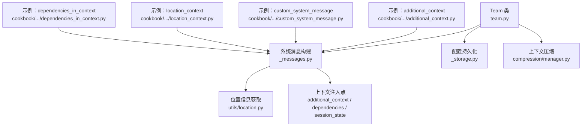
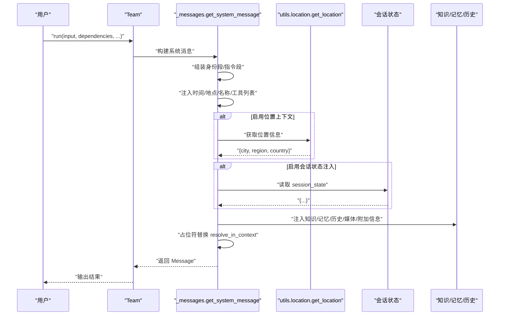
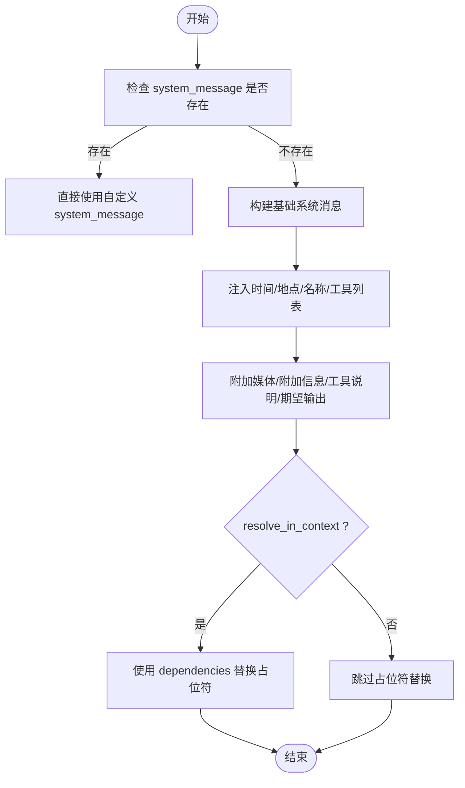
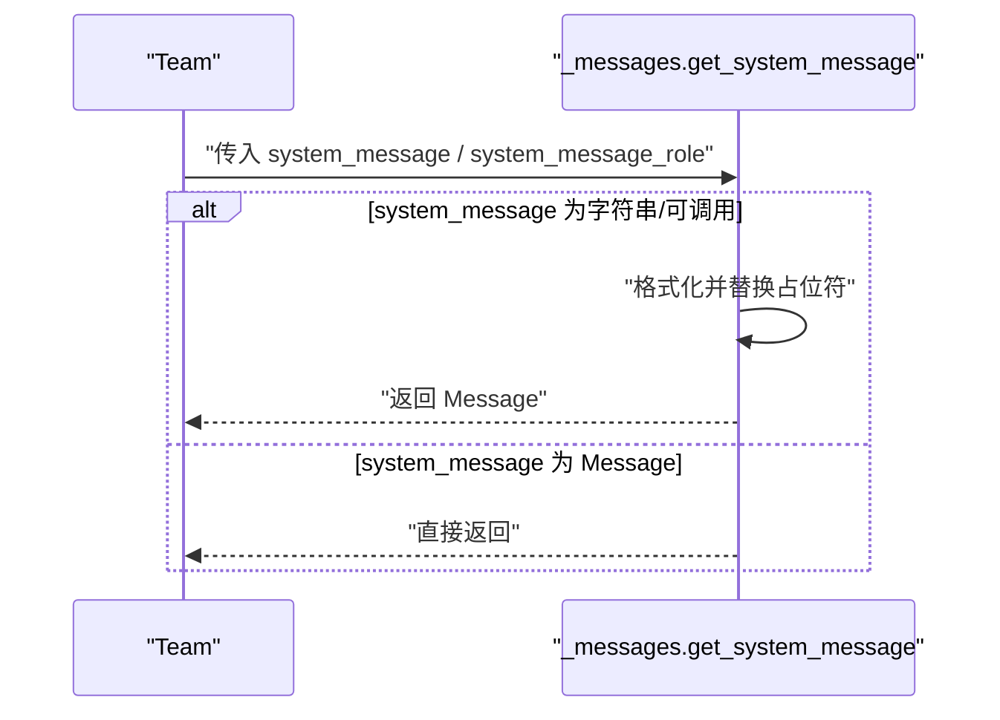
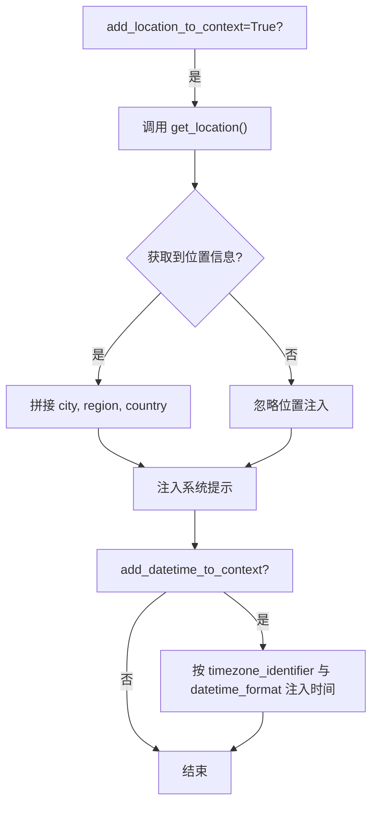
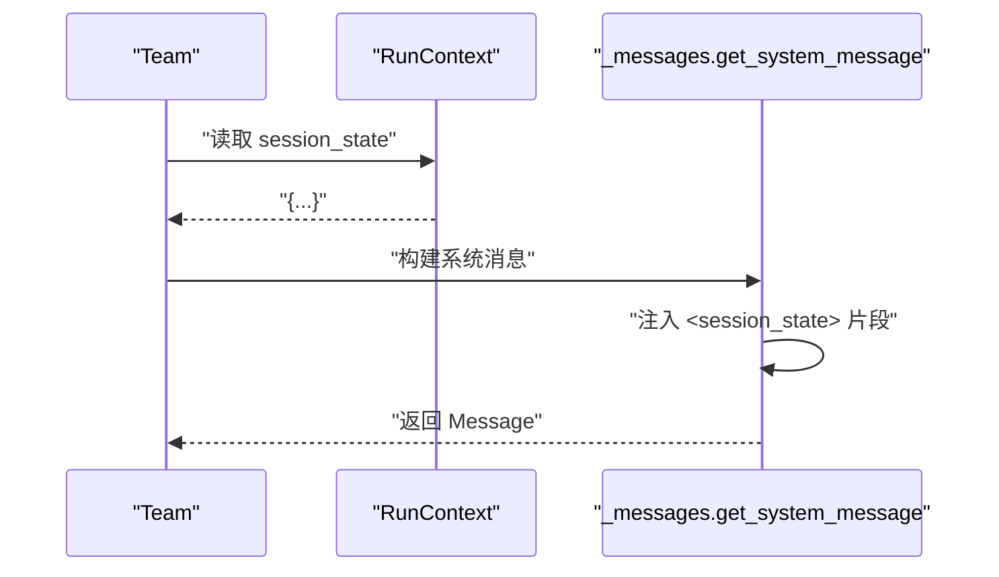
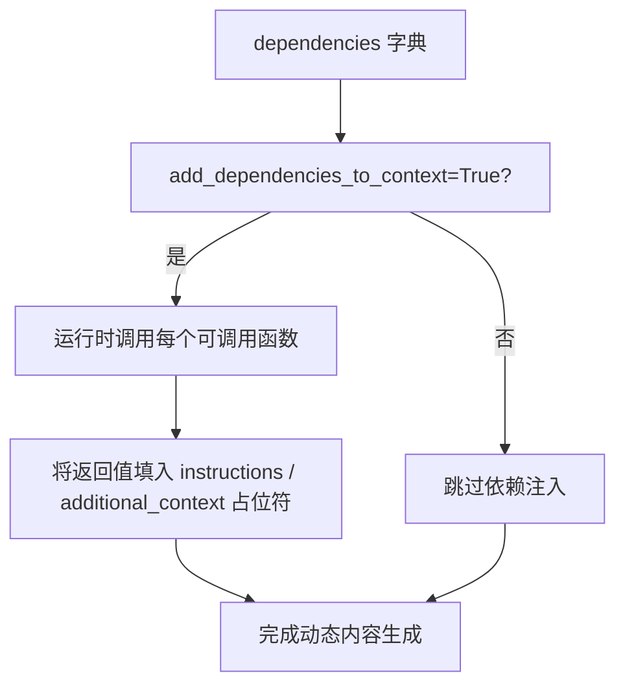
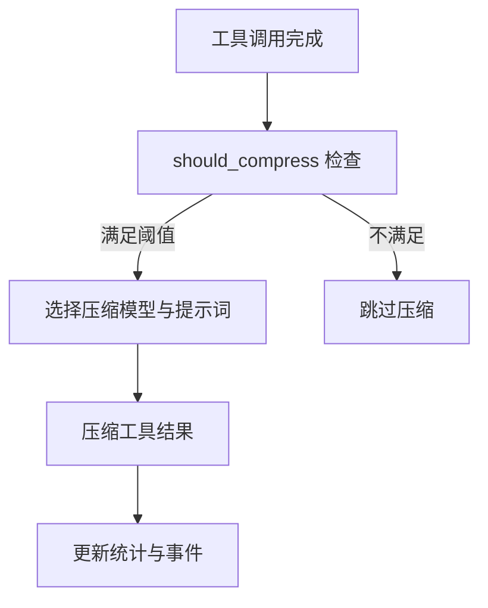

# 上下文创建与配置

<cite>
**本文引用的文件**
- [libs/agno/agno/team/team.py](file://libs/agno/agno/team/team.py)
- [libs/agno/agno/team/_messages.py](file://libs/agno/agno/team/_messages.py)
- [libs/agno/agno/utils/location.py](file://libs/agno/agno/utils/location.py)
- [libs/agno/agno/team/_storage.py](file://libs/agno/agno/team/_storage.py)
- [libs/agno/agno/compression/manager.py](file://libs/agno/agno/compression/manager.py)
- [libs/agno/tests/integration/teams/test_session_state.py](file://libs/agno/tests/integration/teams/test_session_state.py)
- [cookbook/03_teams/09_context_management/additional_context.py](file://cookbook/03_teams/09_context_management/additional_context.py)
- [cookbook/03_teams/09_context_management/custom_system_message.py](file://cookbook/03_teams/09_context_management/custom_system_message.py)
- [cookbook/03_teams/09_context_management/location_context.py](file://cookbook/03_teams/09_context_management/location_context.py)
- [cookbook/03_teams/17_dependencies/dependencies_in_context.py](file://cookbook/03_teams/17_dependencies/dependencies_in_context.py)
- [cookbook/06_storage/mongo/mongodb_for_team.md](file://cookbook/06_storage/mongo/mongodb_for_team.md)
- [cookbook/02_agents/03_context_management/system_message.md](file://cookbook/02_agents/03_context_management/system_message.md)
- [cookbook/02_agents/15_dependencies/dependencies_in_context.md](file://cookbook/02_agents/15_dependencies/dependencies_in_context.md)
- [cookbook/02_agents/08_guardrails/prompt_injection.md](file://cookbook/02_agents/08_guardrails/prompt_injection.md)
- [cookbook/02_agents/14_advanced/tool_call_compression.md](file://cookbook/02_agents/14_advanced/tool_call_compression.md)
- [cookbook/02_agents/14_advanced/advanced_compression.md](file://cookbook/02_agents/14_advanced/advanced_compression.md)
- [cookbook/03_teams/10_context_compression/tool_call_compression_with_manager.md](file://cookbook/03_teams/10_context_compression/tool_call_compression_with_manager.md)
</cite>

## 目录
1. [简介](#简介)
2. [项目结构](#项目结构)
3. [核心组件](#核心组件)
4. [架构总览](#架构总览)
5. [详细组件分析](#详细组件分析)
6. [依赖分析](#依赖分析)
7. [性能考量](#性能考量)
8. [故障排查指南](#故障排查指南)
9. [结论](#结论)
10. [附录](#附录)

## 简介
本文件围绕“团队上下文创建与配置”主题，系统阐述如何为团队代理（Team）添加并管理上下文信息，涵盖以下关键能力：
- 上下文数据的格式化与注入机制（additional_context、dependencies、resolve_in_context）
- 自定义系统消息的配置（system_message、system_message_role）
- 位置上下文（add_location_to_context、timezone_identifier）与时间上下文（add_datetime_to_context、datetime_format）
- 会话状态注入（add_session_state_to_context）
- 上下文压缩与性能优化（compress_tool_results、CompressionManager）
- 安全性考虑（prompt injection 检测）

目标是帮助读者在团队协作场景中，通过合理的上下文设计与配置，提升决策质量与协作效率。

## 项目结构
围绕上下文创建与配置的相关模块主要分布在以下位置：
- Team 类与上下文配置：libs/agno/agno/team/team.py
- 系统消息构建与上下文注入：libs/agno/agno/team/_messages.py
- 位置信息获取：libs/agno/agno/utils/location.py
- Team 配置持久化（上下文相关字段）：libs/agno/agno/team/_storage.py
- 上下文压缩（工具结果压缩）：libs/agno/agno/compression/manager.py
- 示例与用法：cookbook/03_teams/... 与 cookbook/02_agents/...

图表来源
- [libs/agno/agno/team/team.py:1-800](file://libs/agno/agno/team/team.py#L1-L800)
- [libs/agno/agno/team/_messages.py:1-800](file://libs/agno/agno/team/_messages.py#L1-L800)
- [libs/agno/agno/utils/location.py:1-20](file://libs/agno/agno/utils/location.py#L1-L20)
- [libs/agno/agno/team/_storage.py:492-518](file://libs/agno/agno/team/_storage.py#L492-L518)
- [libs/agno/agno/compression/manager.py:87-254](file://libs/agno/agno/compression/manager.py#L87-L254)

章节来源
- [libs/agno/agno/team/team.py:1-800](file://libs/agno/agno/team/team.py#L1-L800)
- [libs/agno/agno/team/_messages.py:1-800](file://libs/agno/agno/team/_messages.py#L1-L800)

## 核心组件
- Team 上下文配置项
  - additional_context：用于在系统提示末尾注入额外上下文文本，支持占位符替换（resolve_in_context=True 时生效）
  - dependencies：运行时依赖函数字典，配合 add_dependencies_to_context=True 将返回值注入 instructions 或 additional_context 的占位符
  - resolve_in_context：是否在运行前对 system_message、additional_context 等进行占位符替换
  - add_datetime_to_context / datetime_format / timezone_identifier：注入当前时间与时区信息
  - add_location_to_context：注入地理位置信息（城市/地区/国家）
  - add_session_state_to_context：将 session_state 以结构化形式注入系统提示
  - add_member_tools_to_context：是否在系统提示中列出成员可用工具
  - system_message / system_message_role：完全自定义系统消息及其角色
  - add_name_to_context：是否在系统提示中包含团队名称
  - add_history_to_context / num_history_runs / num_history_messages：历史消息注入
  - compress_tool_results / compression_manager：工具调用结果压缩
- 上下文注入流程
  - get_system_message（同步）/ aget_system_message（异步）负责组装系统消息，按顺序拼接身份段、知识段、记忆段、会话摘要段、媒体/附加信息/工具说明/期望输出等，并在最后进行占位符替换
  - 位置信息通过 utils/location.py 获取，支持城市、地区、国家三段式组合
  - 会话状态注入通过 _get_formatted_session_state_for_system_message 输出结构化 XML 片段

章节来源
- [libs/agno/agno/team/team.py:145-182](file://libs/agno/agno/team/team.py#L145-L182)
- [libs/agno/agno/team/_messages.py:328-551](file://libs/agno/agno/team/_messages.py#L328-L551)
- [libs/agno/agno/utils/location.py:8-20](file://libs/agno/agno/utils/location.py#L8-L20)
- [libs/agno/agno/team/_storage.py:492-518](file://libs/agno/agno/team/_storage.py#L492-L518)

## 架构总览
下图展示了 Team 在一次运行中如何构建系统消息并注入上下文：

图表来源
- [libs/agno/agno/team/_messages.py:328-551](file://libs/agno/agno/team/_messages.py#L328-L551)
- [libs/agno/agno/utils/location.py:8-20](file://libs/agno/agno/utils/location.py#L8-L20)

## 详细组件分析

### 组件A：additional_context 与占位符解析
- 设计要点
  - additional_context 支持 {variable} 占位符，resolve_in_context=True 时在运行前进行替换
  - 依赖来源：dependencies 字典，支持静态与 per-run 覆盖
  - 注入位置：系统消息末尾的 additional_context 段
- 最佳实践
  - 将与请求者角色、区域、业务背景等相关的上下文放入 additional_context
  - 使用简洁明确的占位符命名，便于维护
  - 通过 per-run 的 dependencies 覆盖实现动态上下文
- 示例路径
  - [cookbook/03_teams/09_context_management/additional_context.py:1-51](file://cookbook/03_teams/09_context_management/additional_context.py#L1-L51)

图表来源
- [libs/agno/agno/team/_messages.py:328-551](file://libs/agno/agno/team/_messages.py#L328-L551)

章节来源
- [libs/agno/agno/team/_messages.py:328-551](file://libs/agno/agno/team/_messages.py#L328-L551)
- [cookbook/03_teams/09_context_management/additional_context.py:1-51](file://cookbook/03_teams/09_context_management/additional_context.py#L1-L51)

### 组件B：自定义系统消息与角色控制
- 设计要点
  - system_message 可为字符串、可调用对象或 Message 对象；若提供则跳过自动构建流程
  - system_message_role 控制消息角色（如 "system" 或 "user"）
  - markdown 开关仅在未设置 system_message 时生效
- 最佳实践
  - 高度定制化场景使用 system_message；常规场景使用 instructions + markdown 组合
  - 当 system_message 为可调用对象时，注意返回值必须为字符串
- 示例路径
  - [cookbook/03_teams/09_context_management/custom_system_message.py:1-51](file://cookbook/03_teams/09_context_management/custom_system_message.py#L1-L51)
  - [cookbook/02_agents/03_context_management/system_message.md:49-92](file://cookbook/02_agents/03_context_management/system_message.md#L49-L92)

图表来源
- [libs/agno/agno/team/_messages.py:355-383](file://libs/agno/agno/team/_messages.py#L355-L383)

章节来源
- [libs/agno/agno/team/_messages.py:355-383](file://libs/agno/agno/team/_messages.py#L355-L383)
- [cookbook/03_teams/09_context_management/custom_system_message.py:1-51](file://cookbook/03_teams/09_context_management/custom_system_message.py#L1-L51)
- [cookbook/02_agents/03_context_management/system_message.md:49-92](file://cookbook/02_agents/03_context_management/system_message.md#L49-L92)

### 组件C：位置上下文与时间上下文
- 设计要点
  - add_location_to_context=True 时，通过 utils/location.py 获取城市/地区/国家并注入系统提示
  - timezone_identifier 使用 IANA 时区标识符，datetime_format 支持自定义时间格式
- 最佳实践
  - 旅行规划、客户服务、活动安排等场景优先启用位置与时区上下文
  - 时区标识符错误会被记录警告，需确保格式正确
- 示例路径
  - [cookbook/03_teams/09_context_management/location_context.py:1-49](file://cookbook/03_teams/09_context_management/location_context.py#L1-L49)
  - [libs/agno/agno/utils/location.py:8-20](file://libs/agno/agno/utils/location.py#L8-L20)

图表来源
- [libs/agno/agno/team/_messages.py:416-449](file://libs/agno/agno/team/_messages.py#L416-L449)
- [libs/agno/agno/utils/location.py:8-20](file://libs/agno/agno/utils/location.py#L8-L20)

章节来源
- [libs/agno/agno/team/_messages.py:416-449](file://libs/agno/agno/team/_messages.py#L416-L449)
- [libs/agno/agno/utils/location.py:8-20](file://libs/agno/agno/utils/location.py#L8-L20)
- [cookbook/03_teams/09_context_management/location_context.py:1-49](file://cookbook/03_teams/09_context_management/location_context.py#L1-L49)

### 组件D：会话状态注入与共享
- 设计要点
  - add_session_state_to_context=True 时，将 session_state 以结构化片段注入系统提示
  - 测试用例验证系统提示中包含 session_state 的键值
- 最佳实践
  - 将与当前任务强相关的上下文（如购物清单、项目进度）放入 session_state
  - 与 dependencies 结合，实现“状态 + 动态依赖”的双重上下文增强
- 示例路径
  - [libs/agno/tests/integration/teams/test_session_state.py:331-347](file://libs/agno/tests/integration/teams/test_session_state.py#L331-L347)

图表来源
- [libs/agno/agno/team/_messages.py:775-777](file://libs/agno/agno/team/_messages.py#L775-L777)
- [libs/agno/tests/integration/teams/test_session_state.py:331-347](file://libs/agno/tests/integration/teams/test_session_state.py#L331-L347)

章节来源
- [libs/agno/agno/team/_messages.py:775-777](file://libs/agno/agno/team/_messages.py#L775-L777)
- [libs/agno/tests/integration/teams/test_session_state.py:331-347](file://libs/agno/tests/integration/teams/test_session_state.py#L331-L347)

### 组件E：依赖注入与动态内容生成
- 设计要点
  - dependencies 为可调用函数字典，add_dependencies_to_context=True 时将返回值注入 instructions 或 additional_context 的占位符
  - 与 resolve_in_context 配合，实现“运行时动态上下文”
- 最佳实践
  - 将外部数据源（用户画像、当前上下文、实时数据）封装为可调用函数
  - 通过 per-run dependencies 覆盖实现灵活的上下文切换
- 示例路径
  - [cookbook/03_teams/17_dependencies/dependencies_in_context.py:1-90](file://cookbook/03_teams/17_dependencies/dependencies_in_context.py#L1-L90)
  - [cookbook/02_agents/15_dependencies/dependencies_in_context.md:1-66](file://cookbook/02_agents/15_dependencies/dependencies_in_context.md#L1-L66)

图表来源
- [libs/agno/agno/team/_messages.py:544-549](file://libs/agno/agno/team/_messages.py#L544-L549)
- [cookbook/03_teams/17_dependencies/dependencies_in_context.py:1-90](file://cookbook/03_teams/17_dependencies/dependencies_in_context.py#L1-L90)

章节来源
- [libs/agno/agno/team/_messages.py:544-549](file://libs/agno/agno/team/_messages.py#L544-L549)
- [cookbook/03_teams/17_dependencies/dependencies_in_context.py:1-90](file://cookbook/03_teams/17_dependencies/dependencies_in_context.py#L1-L90)
- [cookbook/02_agents/15_dependencies/dependencies_in_context.md:1-66](file://cookbook/02_agents/15_dependencies/dependencies_in_context.md#L1-L66)

### 组件F：上下文压缩与性能优化
- 设计要点
  - compress_tool_results=True：启用默认压缩策略，自动压缩过长工具结果
  - CompressionManager：自定义压缩模型、阈值、保留策略与压缩提示词
  - 支持 token 数阈值与工具结果数量阈值两种触发条件
- 最佳实践
  - 对于高 token 的工具结果（如长网页内容、搜索结果）启用压缩
  - 使用 compress_tool_results_limit 保留最新 N 条结果，避免最新信息丢失
  - 通过 stream_events 监控压缩事件与压缩率
- 示例路径
  - [cookbook/02_agents/14_advanced/tool_call_compression.md:1-44](file://cookbook/02_agents/14_advanced/tool_call_compression.md#L1-L44)
  - [cookbook/02_agents/14_advanced/advanced_compression.md:1-50](file://cookbook/02_agents/14_advanced/advanced_compression.md#L1-L50)
  - [cookbook/03_teams/10_context_compression/tool_call_compression_with_manager.md:1-31](file://cookbook/03_teams/10_context_compression/tool_call_compression_with_manager.md#L1-L31)
  - [libs/agno/agno/compression/manager.py:87-254](file://libs/agno/agno/compression/manager.py#L87-L254)

图表来源
- [libs/agno/agno/compression/manager.py:87-254](file://libs/agno/agno/compression/manager.py#L87-L254)

章节来源
- [libs/agno/agno/compression/manager.py:87-254](file://libs/agno/agno/compression/manager.py#L87-L254)
- [cookbook/02_agents/14_advanced/tool_call_compression.md:1-44](file://cookbook/02_agents/14_advanced/tool_call_compression.md#L1-L44)
- [cookbook/02_agents/14_advanced/advanced_compression.md:1-50](file://cookbook/02_agents/14_advanced/advanced_compression.md#L1-L50)
- [cookbook/03_teams/10_context_compression/tool_call_compression_with_manager.md:1-31](file://cookbook/03_teams/10_context_compression/tool_call_compression_with_manager.md#L1-L31)

## 依赖分析
- Team 配置持久化
  - 上下文相关配置（add_datetime_to_context、add_location_to_context、datetime_format、timezone_identifier、add_name_to_context、add_member_tools_to_context、resolve_in_context、add_dependencies_to_context 等）会被序列化到配置中
- 示例：MongoDB 团队存储
  - 通过 MongoDB 持久化 Team 与成员，示例展示了 add_member_tools_to_context=False 的场景，强调减少上下文长度以节省 token
- 关键路径
  - Team 配置序列化：[libs/agno/agno/team/_storage.py:492-518](file://libs/agno/agno/team/_storage.py#L492-L518)
  - MongoDB 示例：[cookbook/06_storage/mongo/mongodb_for_team.md:1-37](file://cookbook/06_storage/mongo/mongodb_for_team.md#L1-L37)

图表来源
- [libs/agno/agno/team/_storage.py:492-518](file://libs/agno/agno/team/_storage.py#L492-L518)
- [cookbook/06_storage/mongo/mongodb_for_team.md:1-37](file://cookbook/06_storage/mongo/mongodb_for_team.md#L1-L37)

章节来源
- [libs/agno/agno/team/_storage.py:492-518](file://libs/agno/agno/team/_storage.py#L492-L518)
- [cookbook/06_storage/mongo/mongodb_for_team.md:1-37](file://cookbook/06_storage/mongo/mongodb_for_team.md#L1-L37)

## 性能考量
- 上下文长度控制
  - 合理使用 add_member_tools_to_context=False 可显著减少系统提示长度，降低 token 消耗
  - 使用 compress_tool_results 或 CompressionManager 压缩工具结果
- 时间与位置上下文
  - timezone_identifier 与 datetime_format 的合理设置可避免冗余格式化开销
- 会话状态与依赖
  - 仅注入必要字段，避免将大体量数据直接写入系统提示
  - 通过 per-run dependencies 覆盖，按需注入动态数据

[本节为通用指导，无需具体文件引用]

## 故障排查指南
- system_message 未生效
  - 若设置了 system_message，则不会执行自动构建流程（包括 markdown 注入），请确认配置
  - 参考：[cookbook/02_agents/03_context_management/system_message.md:49-92](file://cookbook/02_agents/03_context_management/system_message.md#L49-L92)
- 占位符未替换
  - 确认 resolve_in_context=True 且 dependencies 提供了对应键值
  - 参考：[libs/agno/agno/team/_messages.py:544-549](file://libs/agno/agno/team/_messages.py#L544-L549)
- 位置信息为空
  - 检查网络访问与 API 可用性，框架会在异常时记录警告
  - 参考：[libs/agno/agno/utils/location.py:17-19](file://libs/agno/agno/utils/location.py#L17-L19)
- 提示注入风险
  - 使用 PromptInjectionGuardrail 检测潜在注入攻击
  - 参考：[cookbook/02_agents/08_guardrails/prompt_injection.md:45-117](file://cookbook/02_agents/08_guardrails/prompt_injection.md#L45-L117)
- 上下文压缩未触发
  - 检查 compress_token_limit 与 compress_tool_results_limit 阈值设置
  - 参考：[libs/agno/agno/compression/manager.py:87-103](file://libs/agno/agno/compression/manager.py#L87-L103)

章节来源
- [cookbook/02_agents/03_context_management/system_message.md:49-92](file://cookbook/02_agents/03_context_management/system_message.md#L49-L92)
- [libs/agno/agno/team/_messages.py:544-549](file://libs/agno/agno/team/_messages.py#L544-L549)
- [libs/agno/agno/utils/location.py:17-19](file://libs/agno/agno/utils/location.py#L17-L19)
- [cookbook/02_agents/08_guardrails/prompt_injection.md:45-117](file://cookbook/02_agents/08_guardrails/prompt_injection.md#L45-L117)
- [libs/agno/agno/compression/manager.py:87-103](file://libs/agno/agno/compression/manager.py#L87-L103)

## 结论
通过合理配置 Team 的上下文参数（additional_context、dependencies、system_message、位置/时间/会话状态等），并结合上下文压缩与安全防护，可以在团队协作中显著提升决策质量与协作效率。建议：
- 明确上下文边界，仅注入必要信息
- 使用占位符与 per-run 覆盖实现动态上下文
- 在高 token 场景启用压缩策略
- 引入安全守卫检测潜在注入风险

[本节为总结性内容，无需具体文件引用]

## 附录
- 相关示例与最佳实践路径
  - additional_context 示例：[cookbook/03_teams/09_context_management/additional_context.py:1-51](file://cookbook/03_teams/09_context_management/additional_context.py#L1-L51)
  - 自定义系统消息示例：[cookbook/03_teams/09_context_management/custom_system_message.py:1-51](file://cookbook/03_teams/09_context_management/custom_system_message.py#L1-L51)
  - 位置上下文示例：[cookbook/03_teams/09_context_management/location_context.py:1-49](file://cookbook/03_teams/09_context_management/location_context.py#L1-L49)
  - 依赖注入示例：[cookbook/03_teams/17_dependencies/dependencies_in_context.py:1-90](file://cookbook/03_teams/17_dependencies/dependencies_in_context.py#L1-L90)
  - MongoDB 团队存储示例：[cookbook/06_storage/mongo/mongodb_for_team.md:1-37](file://cookbook/06_storage/mongo/mongodb_for_team.md#L1-L37)
  - 上下文压缩示例：[cookbook/02_agents/14_advanced/tool_call_compression.md:1-44](file://cookbook/02_agents/14_advanced/tool_call_compression.md#L1-L44)、[cookbook/02_agents/14_advanced/advanced_compression.md:1-50](file://cookbook/02_agents/14_advanced/advanced_compression.md#L1-L50)、[cookbook/03_teams/10_context_compression/tool_call_compression_with_manager.md:1-31](file://cookbook/03_teams/10_context_compression/tool_call_compression_with_manager.md#L1-L31)

[本节为补充材料，无需具体文件引用]